# Architecture Overview

<cite>
**Referenced Files in This Document**
- [pom.xml](file://pom.xml)
- [community/pom.xml](file://community/pom.xml)
- [community/bolt/src/main/java/org/neo4j/bolt/BoltServer.java](file://community/bolt/src/main/java/org/neo4j/bolt/BoltServer.java)
- [community/configuration/src/main/java/org/neo4j/configuration/GraphDatabaseSettings.java](file://community/configuration/src/main/java/org/neo4j/configuration/GraphDatabaseSettings.java)
- [community/layout/src/main/java/org/neo4j/io/layout/DatabaseLayout.java](file://community/layout/src/main/java/org/neo4j/io/layout/DatabaseLayout.java)
- [community/kernel/src/main/java/org/neo4j/kernel/impl/database/DatabaseManager.java](file://community/kernel/src/main/java/org/neo4j/kernel/impl/database/DatabaseManager.java)
- [community/cypher-shell/cypher-shell/src/main/java/org/neo4j/shell/state/BoltStateHandler.java](file://community/cypher-shell/cypher-shell/src/main/java/org/neo4j/shell/state/BoltStateHandler.java)
- [community/fabric/query-router/src/main/java/org/neo4j/router/CommunityQueryRouterBootstrap.java](file://community/fabric/query-router/src/main/java/org/neo4j/router/CommunityQueryRouterBootstrap.java)
- [community/fabric/fabric/src/main/java/org/neo4j/fabric/bolt/BoltFabricDatabaseService.java](file://community/fabric/fabric/src/main/java/org/neo4j/fabric/bolt/BoltFabricDatabaseService.java)
- [community/bolt/src/main/java/org/neo4j/bolt/dbapi/BoltGraphDatabaseServiceSPI.java](file://community/bolt/src/main/java/org/neo4j/bolt/dbapi/BoltGraphDatabaseServiceSPI.java)
- [community/configuration/src/main/java/org/neo4j/configuration/connectors/BoltConnector.java](file://community/configuration/src/main/java/org/neo4j/configuration/connectors/BoltConnector.java)
- [community/configuration/src/main/java/org/neo4j/configuration/connectors/BoltConnectorInternalSettings.java](file://community/configuration/src/main/java/org/neo4j/configuration/connectors/BoltConnectorInternalSettings.java)
- [community/common/src/main/java/org/neo4j/scheduler/JobScheduler.java](file://community/common/src/main/java/org/neo4j/scheduler/JobScheduler.java)
- [community/security/src/main/java/org/neo4j/server/security/systemgraph/UserSecurityGraphComponent.java](file://community/security/src/main/java/org/neo4j/server/security/systemgraph/UserSecurityGraphComponent.java)
- [community/monitoring/src/main/java/org/neo4j/monitoring/Panic.java](file://community/monitoring/src/main/java/org/neo4j/monitoring/Panic.java)
</cite>

## Table of Contents
1. [Introduction](#introduction)
2. [System Architecture Overview](#system-architecture-overview)
3. [Modular Monorepo Structure](#modular-monorepo-structure)
4. [Community vs Enterprise Edition Separation](#community-vs-enterprise-edition-separation)
5. [Component-Based Architecture](#component-based-architecture)
6. [Technical Decisions and Design Patterns](#technical-decisions-and-design-patterns)
7. [Component Interactions](#component-interactions)
8. [Infrastructure Requirements](#infrastructure-requirements)
9. [Scalability Considerations](#scalability-considerations)
10. [Deployment Topologies](#deployment-topologies)
11. [Cross-Cutting Concerns](#cross-cutting-concerns)
12. [Conclusion](#conclusion)

## Introduction

Neo4j is a sophisticated graph database management system built on a modern, modular architecture that emphasizes separation of concerns, extensibility, and performance. The system employs a hybrid programming language approach using Java for core components and Scala for the Cypher query engine, reflecting careful technical decisions around maintainability, performance, and developer productivity.

The architecture follows a layered approach with clear boundaries between the Bolt protocol server, Cypher query engine, storage engine, and configuration systems. This design enables the system to handle large-scale graph data while maintaining backward compatibility and supporting various deployment scenarios from single-node installations to distributed clusters.

## System Architecture Overview

Neo4j's architecture is built around several key architectural principles that guide its design and implementation:

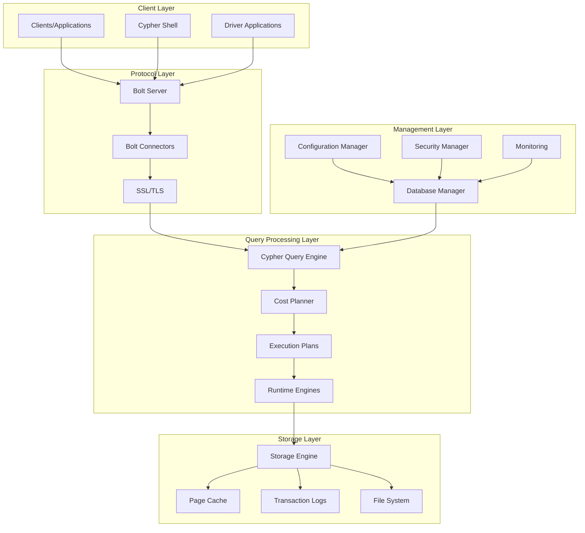

**Diagram sources**
- [community/bolt/src/main/java/org/neo4j/bolt/BoltServer.java](file://community/bolt/src/main/java/org/neo4j/bolt/BoltServer.java#L114-L200)
- [community/configuration/src/main/java/org/neo4j/configuration/GraphDatabaseSettings.java](file://community/configuration/src/main/java/org/neo4j/configuration/GraphDatabaseSettings.java#L75-L100)

The system architecture demonstrates several important characteristics:

- **Layered Architecture**: Clear separation between presentation, business logic, and data persistence layers
- **Protocol Abstraction**: Bolt protocol provides a standardized interface for client communication
- **Query Engine Flexibility**: Pluggable query execution engines supporting different runtime strategies
- **Storage Abstraction**: Modular storage engine architecture supporting various persistence backends

**Section sources**
- [community/bolt/src/main/java/org/neo4j/bolt/BoltServer.java](file://community/bolt/src/main/java/org/neo4j/bolt/BoltServer.java#L1-L100)
- [community/configuration/src/main/java/org/neo4j/configuration/GraphDatabaseSettings.java](file://community/configuration/src/main/java/org/neo4j/configuration/GraphDatabaseSettings.java#L1-L100)

## Modular Monorepo Structure

Neo4j employs a sophisticated modular monorepo architecture that organizes the codebase into distinct functional modules while maintaining a unified build and release process. This approach provides several benefits:

### Module Organization

The monorepo is structured around several key categories of modules:

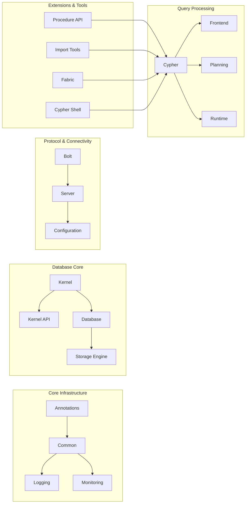

**Diagram sources**
- [pom.xml](file://pom.xml#L189-L193)
- [community/pom.xml](file://community/pom.xml#L20-L88)

### Benefits of Monorepo Approach

The modular monorepo provides several strategic advantages:

1. **Unified Build Process**: Single Maven build configuration manages all modules consistently
2. **Shared Dependencies**: Common libraries and utilities shared across modules
3. **Cross-Module Testing**: Integration testing across module boundaries
4. **Version Alignment**: Consistent versioning across all components
5. **Simplified Development**: Single repository for all development activities

### Trade-offs and Constraints

While the monorepo approach offers significant benefits, it also introduces several constraints:

- **Build Complexity**: Large number of modules requiring sophisticated build management
- **Dependency Management**: Careful coordination to avoid circular dependencies
- **Release Coordination**: All modules released together maintaining version alignment
- **Development Overhead**: Larger codebase requiring disciplined modular boundaries

**Section sources**
- [pom.xml](file://pom.xml#L189-L200)
- [community/pom.xml](file://community/pom.xml#L20-L88)

## Community vs Enterprise Edition Separation

Neo4j maintains clear separation between community and enterprise editions through architectural patterns that allow feature differentiation while sharing core infrastructure:

### Feature Differentiation Strategy

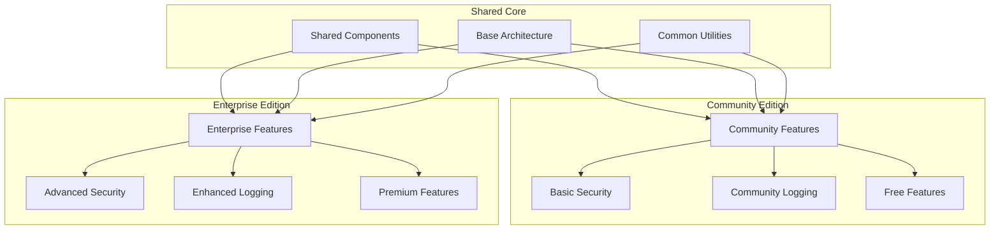

### Implementation Mechanisms

The separation is achieved through several architectural mechanisms:

1. **Conditional Compilation**: Build-time feature selection based on edition
2. **Service Provider Interfaces**: Pluggable implementations for different features
3. **Configuration-Based Activation**: Runtime feature enablement through configuration
4. **Package-Level Separation**: Clear package boundaries between community and enterprise code

### Backward Compatibility Constraints

The architecture must maintain backward compatibility across editions:

- **API Stability**: Core APIs remain stable across editions
- **Feature Flags**: Graceful degradation when enterprise features unavailable
- **Migration Paths**: Clear upgrade paths between editions
- **Documentation Consistency**: Unified documentation with edition-specific notes

**Section sources**
- [community/fabric/query-router/src/main/java/org/neo4j/router/CommunityQueryRouterBootstrap.java](file://community/fabric/query-router/src/main/java/org/neo4j/router/CommunityQueryRouterBootstrap.java#L102-L226)

## Component-Based Architecture

Neo4j's component-based architecture emphasizes modularity, reusability, and testability through well-defined interfaces and dependency injection patterns:

### Core Component Architecture

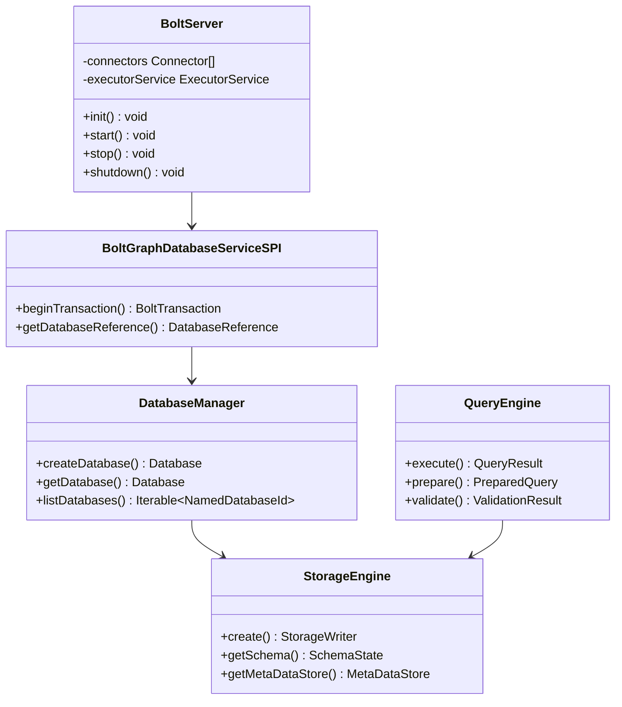

**Diagram sources**
- [community/bolt/src/main/java/org/neo4j/bolt/BoltServer.java](file://community/bolt/src/main/java/org/neo4j/bolt/BoltServer.java#L114-L200)
- [community/bolt/src/main/java/org/neo4j/bolt/dbapi/BoltGraphDatabaseServiceSPI.java](file://community/bolt/src/main/java/org/neo4j/bolt/dbapi/BoltGraphDatabaseServiceSPI.java#L31-L50)

### Dependency Injection Pattern

The architecture employs a sophisticated dependency injection system:

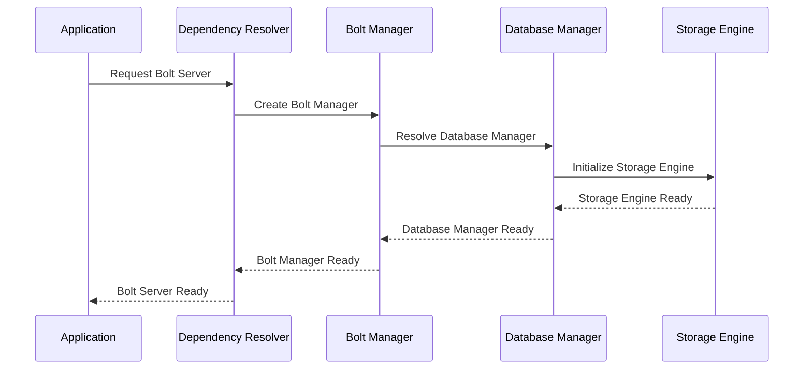

**Diagram sources**
- [community/bolt/src/main/java/org/neo4j/bolt/BoltServer.java](file://community/bolt/src/main/java/org/neo4j/bolt/BoltServer.java#L153-L200)

**Section sources**
- [community/bolt/src/main/java/org/neo4j/bolt/BoltServer.java](file://community/bolt/src/main/java/org/neo4j/bolt/BoltServer.java#L114-L200)
- [community/bolt/src/main/java/org/neo4j/bolt/dbapi/BoltGraphDatabaseServiceSPI.java](file://community/bolt/src/main/java/org/neo4j/bolt/dbapi/BoltGraphDatabaseServiceSPI.java#L31-L50)

## Technical Decisions and Design Patterns

### Java vs Scala Hybrid Approach

Neo4j employs a carefully considered hybrid programming language approach:

#### Java for Core Infrastructure
- **Performance-Critical Components**: Bolt protocol server, storage engine, kernel
- **Interoperability**: Better integration with JVM ecosystem and existing libraries
- **Tooling**: Mature tooling support for Java development
- **Team Expertise**: Existing expertise in Java for core developers

#### Scala for Query Engine
- **Functional Programming**: Natural fit for query processing and transformation
- **Type Safety**: Strong type system beneficial for AST manipulation
- **Conciseness**: More expressive syntax for complex algorithms
- **Modern Features**: Advanced language features for compiler optimizations

### Architectural Patterns Employed

1. **Factory Pattern**: Extensive use of factories for component creation
2. **Strategy Pattern**: Pluggable implementations for different engines
3. **Observer Pattern**: Event-driven architecture for system notifications
4. **Template Method**: Base classes with customizable behavior
5. **Dependency Injection**: Loose coupling through inversion of control

### Design Decision Rationale

The technical decisions reflect careful consideration of multiple factors:

- **Performance Requirements**: Java chosen for low-latency, high-throughput components
- **Developer Productivity**: Scala selected for complex algorithmic code
- **Maintenance Costs**: Balanced approach to language diversity
- **Community Adoption**: Consideration of developer familiarity and tooling

**Section sources**
- [community/bolt/src/main/java/org/neo4j/bolt/BoltServer.java](file://community/bolt/src/main/java/org/neo4j/bolt/BoltServer.java#L1-L100)

## Component Interactions

### Bolt Protocol Server Interaction

The Bolt protocol server serves as the primary interface between clients and the database, implementing a sophisticated connection management system:

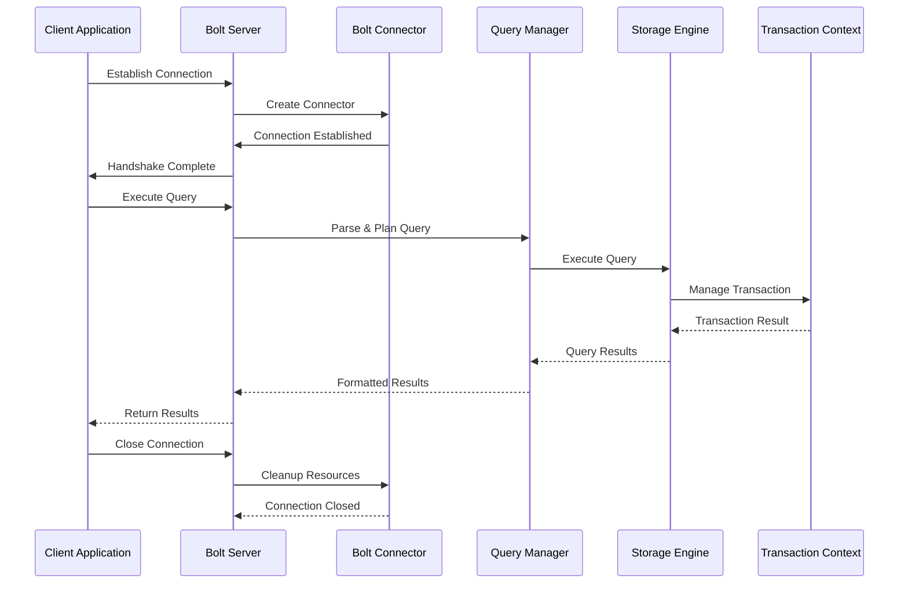

**Diagram sources**
- [community/bolt/src/main/java/org/neo4j/bolt/BoltServer.java](file://community/bolt/src/main/java/org/neo4j/bolt/BoltServer.java#L238-L300)
- [community/cypher-shell/cypher-shell/src/main/java/org/neo4j/shell/state/BoltStateHandler.java](file://community/cypher-shell/cypher-shell/src/main/java/org/neo4j/shell/state/BoltStateHandler.java#L329-L495)

### Cypher Query Engine Integration

The Cypher query engine operates through a multi-stage pipeline:

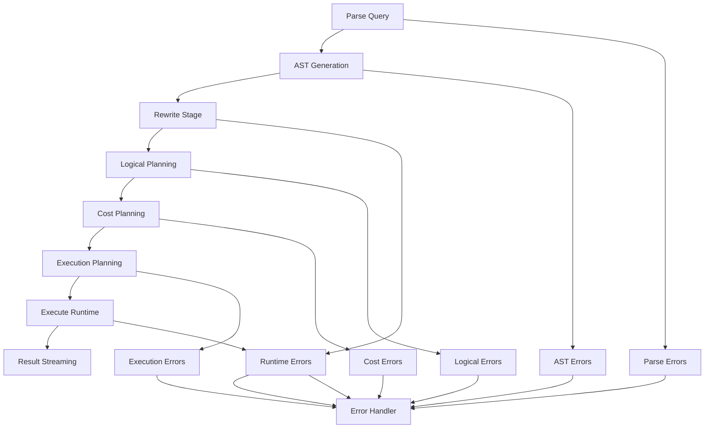

**Diagram sources**
- [community/cypher-shell/cypher-shell/src/main/java/org/neo4j/shell/state/BoltStateHandler.java](file://community/cypher-shell/cypher-shell/src/main/java/org/neo4j/shell/state/BoltStateHandler.java#L329-L495)

### Storage Engine Coordination

The storage engine coordinates multiple subsystems for efficient data management:

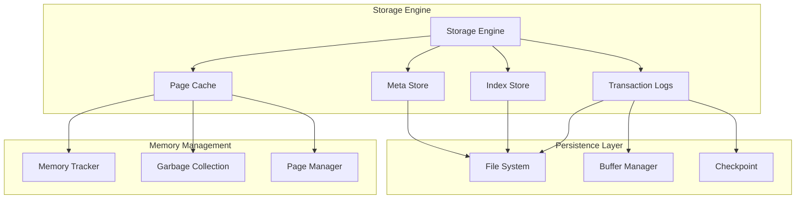

**Diagram sources**
- [community/layout/src/main/java/org/neo4j/io/layout/DatabaseLayout.java](file://community/layout/src/main/java/org/neo4j/io/layout/DatabaseLayout.java#L42-L100)

**Section sources**
- [community/bolt/src/main/java/org/neo4j/bolt/BoltServer.java](file://community/bolt/src/main/java/org/neo4j/bolt/BoltServer.java#L238-L300)
- [community/cypher-shell/cypher-shell/src/main/java/org/neo4j/shell/state/BoltStateHandler.java](file://community/cypher-shell/cypher-shell/src/main/java/org/neo4j/shell/state/BoltStateHandler.java#L329-L495)

## Infrastructure Requirements

### Hardware Requirements

Neo4j's infrastructure requirements vary based on deployment scenario and workload characteristics:

#### Minimum Requirements
- **CPU**: 2+ cores for basic operations
- **Memory**: 4GB RAM minimum, 8GB+ recommended
- **Storage**: SSD recommended for optimal performance
- **Network**: Gigabit Ethernet for distributed deployments

#### Production Requirements
- **CPU**: 8+ cores for heavy workloads
- **Memory**: 32GB+ for large graphs
- **Storage**: NVMe SSD with 1TB+ capacity
- **Network**: 10GbE for high-throughput applications

### Software Dependencies

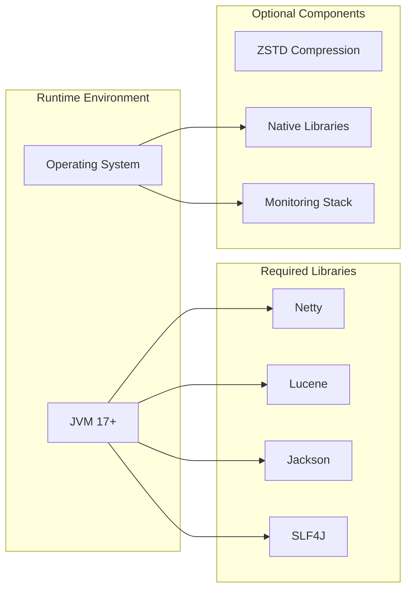

### Configuration Management

The system employs a sophisticated configuration management approach:

| Configuration Category | Scope | Dynamic Support | Default Behavior |
|------------------------|-------|-----------------|------------------|
| Network Settings | Global | Yes | Bolt enabled on port 7687 |
| Memory Allocation | Per Database | No | Heuristic calculation |
| Storage Options | Per Database | Yes | Standard format |
| Security Policies | Global | Yes | Basic authentication |
| Query Optimization | Per Database | Yes | Cost-based planning |

**Section sources**
- [community/configuration/src/main/java/org/neo4j/configuration/GraphDatabaseSettings.java](file://community/configuration/src/main/java/org/neo4j/configuration/GraphDatabaseSettings.java#L75-L200)

## Scalability Considerations

### Horizontal Scaling Strategies

Neo4j supports horizontal scaling through several mechanisms:

#### Database Sharding
- **Partitioned Storage**: Data distributed across multiple storage engines
- **Query Routing**: Intelligent routing of queries to appropriate shards
- **Consistency Management**: Distributed transaction coordination

#### Read Replicas
- **Asynchronous Replication**: Real-time data synchronization
- **Load Distribution**: Offloading read operations to replicas
- **Failover Support**: Automatic failover to healthy replicas

### Vertical Scaling Optimizations

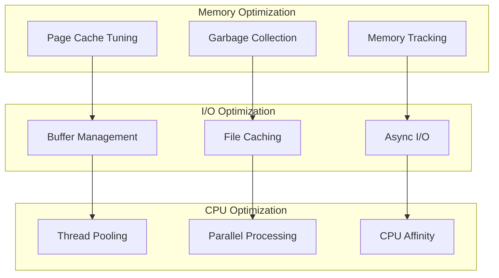

### Performance Monitoring

The system includes comprehensive performance monitoring:

- **Query Performance**: Execution time and resource consumption tracking
- **Storage Metrics**: I/O throughput and latency monitoring
- **Memory Usage**: Heap and off-heap memory tracking
- **Network Statistics**: Connection and throughput metrics

**Section sources**
- [community/configuration/src/main/java/org/neo4j/configuration/GraphDatabaseSettings.java](file://community/configuration/src/main/java/org/neo4j/configuration/GraphDatabaseSettings.java#L600-L700)

## Deployment Topologies

### Single Node Deployment

The simplest deployment scenario suitable for development and small production workloads:

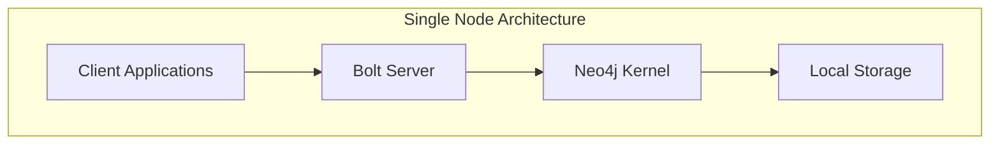

### Multi-Node Cluster

For high availability and scalability requirements:

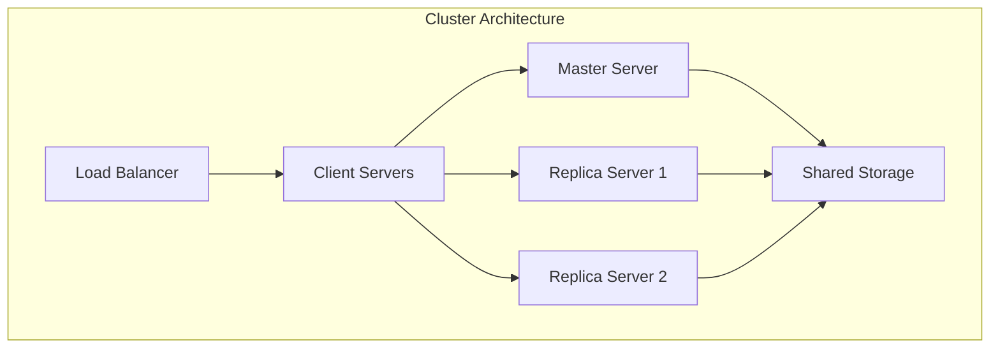

### Cloud-Native Deployment

Modern cloud deployment patterns:

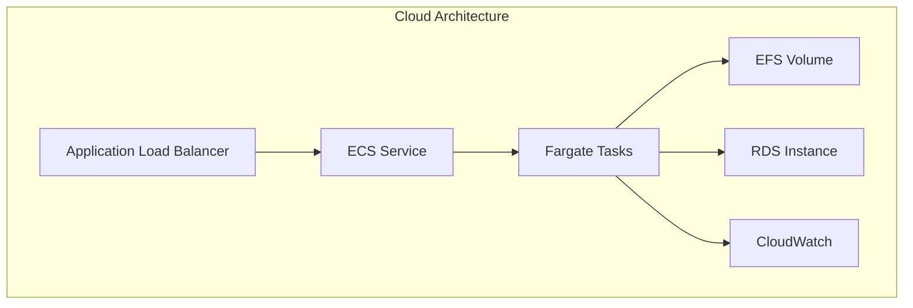

### Container Orchestration

Kubernetes deployment patterns:

| Component | Resource Limits | Persistence | Health Checks |
|-----------|----------------|-------------|---------------|
| Neo4j Server | 4vCPU, 8GB | PersistentVolume | LivenessProbe |
| Page Cache | 2vCPU, 4GB | EmptyDir | ReadinessProbe |
| Backup Agent | 1vCPU, 2GB | PVC | StartupProbe |

**Section sources**
- [community/configuration/src/main/java/org/neo4j/configuration/connectors/BoltConnector.java](file://community/configuration/src/main/java/org/neo4j/configuration/connectors/BoltConnector.java#L29-L58)

## Cross-Cutting Concerns

### Security Architecture

Neo4j implements comprehensive security measures across multiple layers:

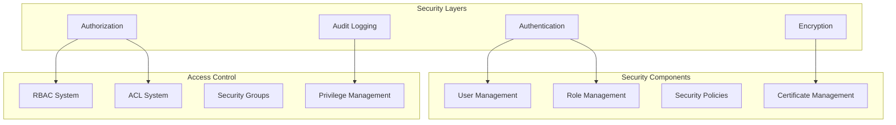

**Diagram sources**
- [community/security/src/main/java/org/neo4j/server/security/systemgraph/UserSecurityGraphComponent.java](file://community/security/src/main/java/org/neo4j/server/security/systemgraph/UserSecurityGraphComponent.java#L71-L193)

### Monitoring and Observability

The system provides extensive monitoring capabilities:

#### Metrics Collection
- **System Metrics**: CPU, memory, disk, network usage
- **Database Metrics**: Query performance, transaction rates, cache hit ratios
- **Application Metrics**: Client connections, error rates, response times

#### Alerting and Notifications
- **Threshold-Based Alerts**: Automated notifications for metric thresholds
- **Anomaly Detection**: Machine learning-based anomaly detection
- **Escalation Procedures**: Automated escalation for critical issues

### Disaster Recovery

Robust disaster recovery mechanisms ensure data protection:

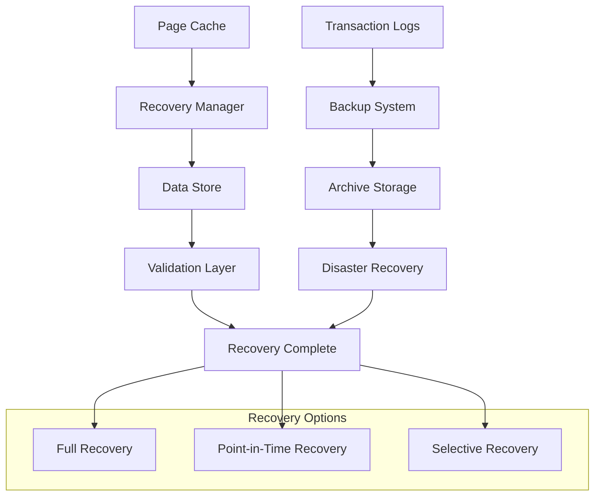

### Configuration Management

Centralized configuration management ensures consistency:

- **Environment-Specific Configurations**: Separate configurations for dev, test, prod
- **Dynamic Configuration Updates**: Runtime configuration changes without restart
- **Configuration Validation**: Comprehensive validation of configuration changes
- **Audit Trail**: Complete audit trail of configuration changes

**Section sources**
- [community/security/src/main/java/org/neo4j/server/security/systemgraph/UserSecurityGraphComponent.java](file://community/security/src/main/java/org/neo4j/server/security/systemgraph/UserSecurityGraphComponent.java#L71-L193)
- [community/monitoring/src/main/java/org/neo4j/monitoring/Panic.java](file://community/monitoring/src/main/java/org/neo4j/monitoring/Panic.java#L1-L30)

## Conclusion

Neo4j's architecture represents a sophisticated balance between performance, scalability, and maintainability. The modular monorepo structure, hybrid programming language approach, and layered architecture enable the system to handle complex graph workloads while maintaining backward compatibility and supporting diverse deployment scenarios.

Key architectural strengths include:

- **Modular Design**: Clear separation of concerns enabling independent development and testing
- **Performance Focus**: Java-Scala hybrid approach optimizing for both performance and developer productivity
- **Scalability Support**: Comprehensive support for horizontal and vertical scaling
- **Security Integration**: Multi-layered security architecture with comprehensive monitoring
- **Operational Excellence**: Robust monitoring, alerting, and disaster recovery capabilities

The architecture's emphasis on backward compatibility and gradual feature adoption ensures that organizations can evolve their Neo4j deployments incrementally while maintaining system stability and reliability. This design philosophy, combined with the system's proven performance characteristics, positions Neo4j as a leading solution for graph database requirements across diverse industries and use cases.

Future architectural evolution will likely focus on enhanced cloud-native capabilities, improved automated operations, and continued optimization for emerging hardware architectures, while maintaining the core architectural principles that have made Neo4j successful.