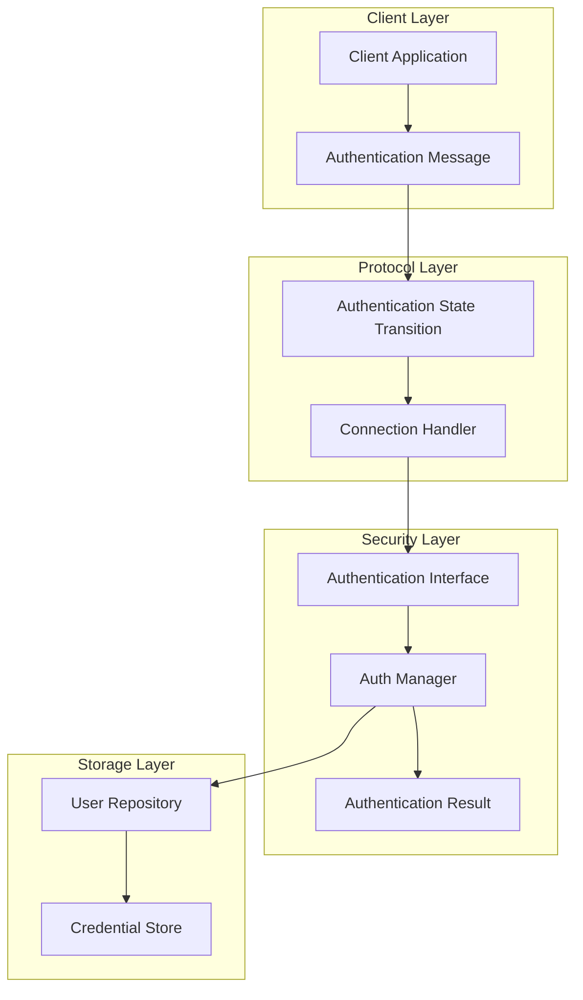
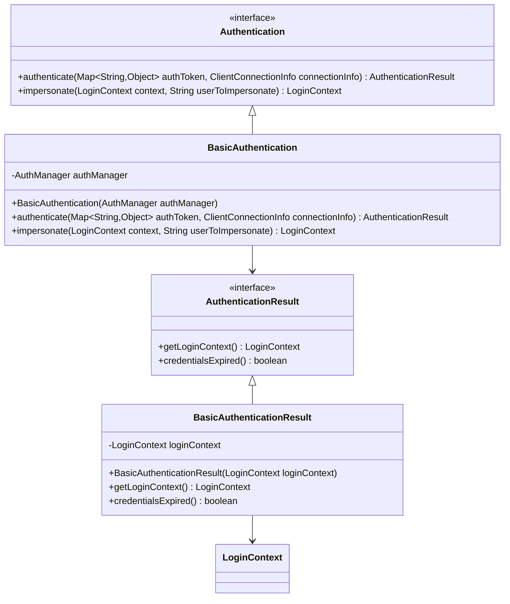
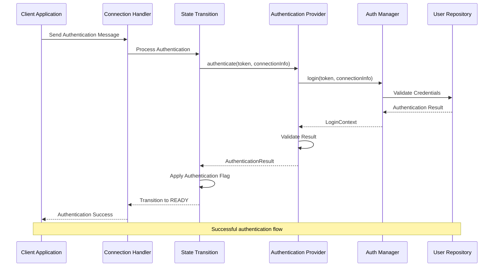
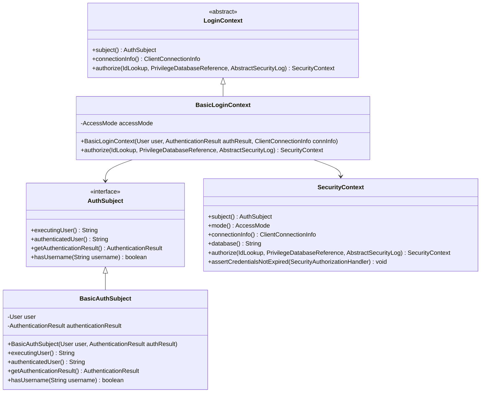
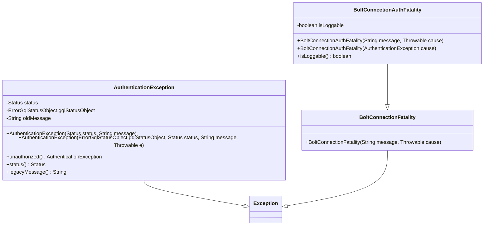
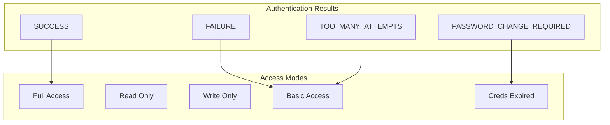
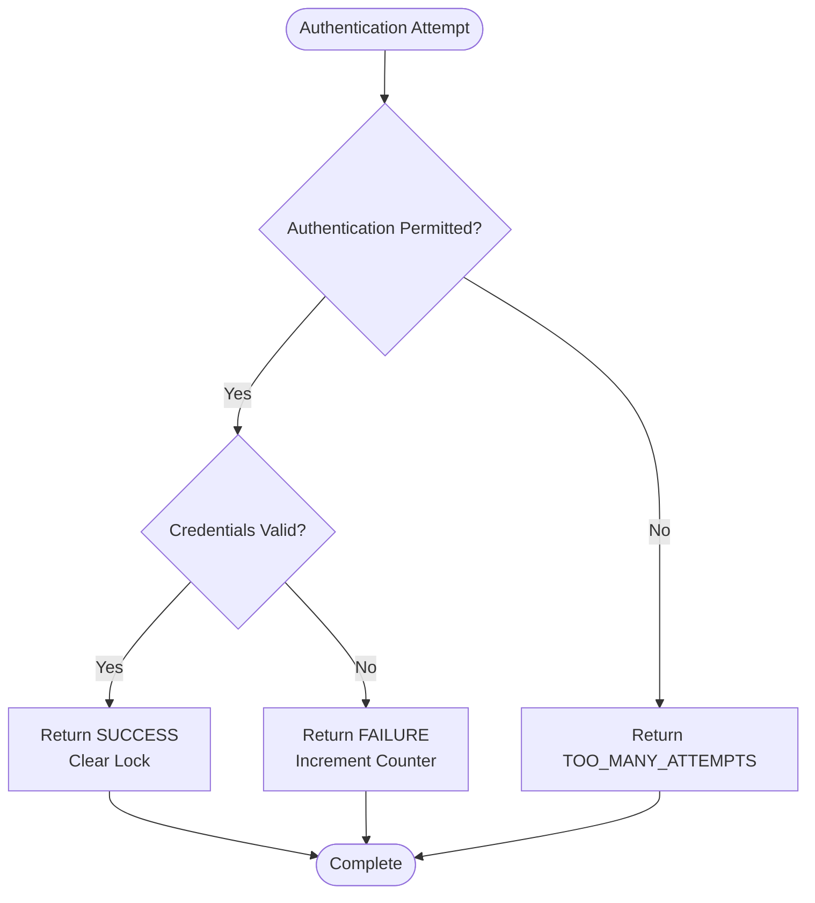

# Authentication

<cite>
**Referenced Files in This Document**
- [Authentication.java](file://community/bolt/src/main/java/org/neo4j/bolt/security/Authentication.java)
- [AuthenticationResult.java](file://community/bolt/src/main/java/org/neo4j/bolt/security/AuthenticationResult.java)
- [BasicAuthentication.java](file://community/bolt/src/main/java/org/neo4j/bolt/security/basic/BasicAuthentication.java)
- [BasicAuthenticationResult.java](file://community/bolt/src/main/java/org/neo4j/bolt/security/basic/BasicAuthenticationResult.java)
- [AuthenticationException.java](file://community/bolt/src/main/java/org/neo4j/bolt/security/error/AuthenticationException.java)
- [BoltConnectionAuthFatality.java](file://community/bolt/src/main/java/org/neo4j/bolt/runtime/BoltConnectionAuthFatality.java)
- [AuthenticationStateTransition.java](file://community/bolt/src/main/java/org/neo4j/bolt/protocol/common/fsm/transition/authentication/AuthenticationStateTransition.java)
- [AuthenticationFlag.java](file://community/bolt/src/main/java/org/neo4j/bolt/protocol/common/connector/connection/authentication/AuthenticationFlag.java)
- [AbstractConnection.java](file://community/bolt/src/main/java/org/neo4j/bolt/protocol/common/connector/connection/AbstractConnection.java)
- [AuthManager.java](file://community/kernel/src/main/java/org/neo4j/kernel/api/security/AuthManager.java)
- [AuthenticationResult.java](file://community/kernel-api/src/main/java/org/neo4j/internal/kernel/api/security/AuthenticationResult.java)
- [LoginContext.java](file://community/kernel-api/src/main/java/org/neo4j/internal/kernel/api/security/LoginContext.java)
- [SecurityContext.java](file://community/kernel-api/src/main/java/org/neo4j/internal/kernel/api/security/SecurityContext.java)
- [RateLimitedAuthenticationStrategy.java](file://community/security/src/main/Java/org/neo4j/server/security/auth/RateLimitedAuthenticationStrategy.java)
- [BasicLoginContext.java](file://community/security/src/main/Java/org/neo4j/server/security/auth/BasicLoginContext.java)
</cite>

## Table of Contents
1. [Introduction](#introduction)
2. [Authentication Architecture Overview](#authentication-architecture-overview)
3. [Core Authentication Components](#core-authentication-components)
4. [Authentication Pipeline Flow](#authentication-pipeline-flow)
5. [Domain Model](#domain-model)
6. [Error Handling and Failure Scenarios](#error-handling-and-failure-scenarios)
7. [Security Policies and Access Control](#security-policies-and-access-control)
8. [Custom Authentication Providers](#custom-authentication-providers)
9. [Security Hardening Strategies](#security-hardening-strategies)
10. [Troubleshooting Guide](#troubleshooting-guide)
11. [Best Practices](#best-practices)

## Introduction

The Bolt Protocol's authentication mechanism provides a robust, extensible framework for securing Neo4j database connections. Built around a layered architecture, it supports multiple authentication schemes, implements comprehensive error handling, and maintains strict security boundaries throughout the connection lifecycle.

The authentication system operates through a state machine-driven pipeline that validates credentials, establishes user sessions, and manages access permissions. It integrates seamlessly with Neo4j's broader security infrastructure while providing fine-grained control over authentication policies and failure modes.

## Authentication Architecture Overview

The authentication system follows a modular design with clear separation of concerns:



**Diagram sources**
- [AuthenticationStateTransition.java](file://community/bolt/src/main/java/org/neo4j/bolt/protocol/common/fsm/transition/authentication/AuthenticationStateTransition.java#L45-L76)
- [Authentication.java](file://community/bolt/src/main/java/org/neo4j/bolt/security/Authentication.java#L41-L55)
- [AuthManager.java](file://community/kernel/src/main/java/org/neo4j/kernel/api/security/AuthManager.java#L35-L73)

**Section sources**
- [AuthenticationStateTransition.java](file://community/bolt/src/main/java/org/neo4j/bolt/protocol/common/fsm/transition/authentication/AuthenticationStateTransition.java#L36-L44)
- [Authentication.java](file://community/bolt/src/main/java/org/neo4j/bolt/security/Authentication.java#L28-L55)

## Core Authentication Components

### Authentication Interface

The [`Authentication`](file://community/bolt/src/main/java/org/neo4j/bolt/security/Authentication.java#L41-L55) interface serves as the primary contract for authentication providers:



**Diagram sources**
- [Authentication.java](file://community/bolt/src/main/java/org/neo4j/bolt/security/Authentication.java#L41-L55)
- [BasicAuthentication.java](file://community/bolt/src/main/java/org/neo4j/bolt/security/basic/BasicAuthentication.java#L35-L68)
- [AuthenticationResult.java](file://community/bolt/src/main/java/org/neo4j/bolt/security/AuthenticationResult.java#L24-L28)
- [BasicAuthenticationResult.java](file://community/bolt/src/main/java/org/neo4j/bolt/security/basic/BasicAuthenticationResult.java#L25-L42)

### Authentication State Management

The authentication state is managed through several key components:

| Component | Purpose | Lifecycle |
|-----------|---------|-----------|
| [`AuthenticationFlag`](file://community/bolt/src/main/java/org/neo4j/bolt/protocol/common/connector/connection/authentication/AuthenticationFlag.java#L25-L32) | Special conditions post-authentication | Single-use flag |
| [`AuthenticationStateTransition`](file://community/bolt/src/main/java/org/neo4j/bolt/protocol/common/fsm/transition/authentication/AuthenticationStateTransition.java#L45-L76) | State machine transitions | Per connection |
| [`BoltConnectionAuthFatality`](file://community/bolt/src/main/java/org/neo4j/bolt/runtime/BoltConnectionAuthFatality.java#L29-L49) | Fatal authentication errors | Connection termination |

**Section sources**
- [AuthenticationFlag.java](file://community/bolt/src/main/java/org/neo4j/bolt/protocol/common/connector/connection/authentication/AuthenticationFlag.java#L25-L32)
- [AuthenticationStateTransition.java](file://community/bolt/src/main/java/org/neo4j/bolt/protocol/common/fsm/transition/authentication/AuthenticationStateTransition.java#L45-L76)
- [BoltConnectionAuthFatality.java](file://community/bolt/src/main/java/org/neo4j/bolt/runtime/BoltConnectionAuthFatality.java#L29-L49)

## Authentication Pipeline Flow

The authentication process follows a structured pipeline with multiple validation stages:



**Diagram sources**
- [AuthenticationStateTransition.java](file://community/bolt/src/main/java/org/neo4j/bolt/protocol/common/fsm/transition/authentication/AuthenticationStateTransition.java#L58-L74)
- [BasicAuthentication.java](file://community/bolt/src/main/java/org/neo4j/bolt/security/basic/BasicAuthentication.java#L42-L61)
- [AbstractConnection.java](file://community/bolt/src/main/java/org/neo4j/bolt/protocol/common/connector/connection/AbstractConnection.java#L404-L428)

### Authentication Token Structure

Authentication tokens follow a standardized format:

| Field | Type | Description | Required |
|-------|------|-------------|----------|
| `scheme` | String | Authentication scheme identifier | Yes |
| `principal` | String/Object | Security principal | Yes |
| `credentials` | String/Object | Authentication credentials | Yes |
| `realm` | String | Authentication realm | No |
| `parameters` | Map | Additional parameters | No |

**Section sources**
- [Authentication.java](file://community/bolt/src/main/java/org/neo4j/bolt/security/Authentication.java#L32-L38)
- [BasicAuthentication.java](file://community/bolt/src/main/java/org/neo4j/bolt/security/basic/BasicAuthentication.java#L42-L61)

## Domain Model

### Authentication Tokens and Session Contexts

The authentication system operates on several key domain objects:



**Diagram sources**
- [LoginContext.java](file://community/kernel-api/src/main/java/org/neo4j/internal/kernel/api/security/LoginContext.java#L30-L106)
- [BasicLoginContext.java](file://community/security/src/main/Java/org/neo4j/server/security/auth/BasicLoginContext.java#L42-L93)
- [AuthSubject.java](file://community/kernel-api/src/main/java/org/neo4j/internal/kernel/api/security/AuthSubject.java#L39-L84)
- [SecurityContext.java](file://community/kernel-api/src/main/java/org/neo4j/internal/kernel/api/security/SecurityContext.java#L30-L136)

### Authentication Results

The system defines specific authentication outcomes:

| Result | Description | Access Mode |
|--------|-------------|-------------|
| `SUCCESS` | Authentication successful | Full access |
| `PASSWORD_CHANGE_REQUIRED` | Credentials expired, password change needed | Credentials expired mode |
| `FAILURE` | Authentication failed | No access |
| `TOO_MANY_ATTEMPTS` | Rate limit exceeded | No access |

**Section sources**
- [AuthenticationResult.java](file://community/kernel-api/src/main/java/org/neo4j/internal/kernel/api/security/AuthenticationResult.java#L22-L26)
- [BasicLoginContext.java](file://community/security/src/main/Java/org/neo4j/server/security/auth/BasicLoginContext.java#L49-L58)

## Error Handling and Failure Scenarios

### Authentication Exception Types

The system handles various error conditions through specialized exception types:



**Diagram sources**
- [AuthenticationException.java](file://community/bolt/src/main/java/org/neo4j/bolt/security/error/AuthenticationException.java#L32-L88)
- [BoltConnectionAuthFatality.java](file://community/bolt/src/main/java/org/neo4j/bolt/runtime/BoltConnectionAuthFatality.java#L29-L49)

### Common Authentication Failures

| Error Condition | Status Code | Description | Mitigation |
|----------------|-------------|-------------|------------|
| Invalid Credentials | 401 Unauthorized | Wrong username/password | Verify credentials |
| Rate Limit Exceeded | 429 Too Many Requests | Too many failed attempts | Wait and retry |
| Expired Credentials | 401 Unauthorized | Password expired | Change password |
| Authentication Timeout | 504 Gateway Timeout | Auth provider timeout | Check network |
| Auth Provider Failed | 502 Bad Gateway | External auth failure | Check auth service |

**Section sources**
- [AuthenticationException.java](file://community/bolt/src/main/java/org/neo4j/bolt/security/error/AuthenticationException.java#L68-L72)
- [RateLimitedAuthenticationStrategy.java](file://community/security/src/main/Java/org/neo4j/server/security/auth/RateLimitedAuthenticationStrategy.java#L75-L90)

## Security Policies and Access Control

### Access Mode Management

The system implements fine-grained access control through access modes:



**Diagram sources**
- [BasicLoginContext.java](file://community/security/src/main/Java/org/neo4j/server/security/auth/BasicLoginContext.java#L49-L58)
- [AuthenticationResult.java](file://community/kernel-api/src/main/java/org/neo4j/internal/kernel/api/security/AuthenticationResult.java#L22-L26)

### Rate Limiting Implementation

The [`RateLimitedAuthenticationStrategy`](file://community/security/src/main/Java/org/neo4j/server/security/auth/RateLimitedAuthenticationStrategy.java#L67-L106) provides built-in protection against brute force attacks:



**Diagram sources**
- [RateLimitedAuthenticationStrategy.java](file://community/security/src/main/Java/org/neo4j/server/security/auth/RateLimitedAuthenticationStrategy.java#L75-L106)

**Section sources**
- [RateLimitedAuthenticationStrategy.java](file://community/security/src/main/Java/org/neo4j/server/security/auth/RateLimitedAuthenticationStrategy.java#L67-L106)

## Custom Authentication Providers

### Implementing Custom Authentication

To create a custom authentication provider, implement the [`Authentication`](file://community/bolt/src/main/java/org/neo4j/bolt/security/Authentication.java#L41-L55) interface:

```java
// Example custom authentication implementation
public class CustomAuthentication implements Authentication {
    private final CustomAuthManager authManager;
    
    public CustomAuthentication(CustomAuthManager authManager) {
        this.authManager = authManager;
    }
    
    @Override
    public AuthenticationResult authenticate(
        Map<String, Object> authToken, 
        ClientConnectionInfo connectionInfo
    ) throws AuthenticationException {
        // Custom authentication logic
        LoginContext loginContext = authManager.customLogin(authToken, connectionInfo);
        
        // Validate authentication result
        switch (loginContext.subject().getAuthenticationResult()) {
            case SUCCESS:
            case PASSWORD_CHANGE_REQUIRED:
                return new CustomAuthenticationResult(loginContext);
            case TOO_MANY_ATTEMPTS:
                throw new AuthenticationException(Status.Security.AuthenticationRateLimit);
            default:
                throw AuthenticationException.unauthorized();
        }
    }
}
```

### Authentication Result Implementation

Custom authentication results must implement the [`AuthenticationResult`](file://community/bolt/src/main/java/org/neo4j/bolt/security/AuthenticationResult.java#L24-L28) interface:

```java
public class CustomAuthenticationResult implements AuthenticationResult {
    private final LoginContext loginContext;
    
    public CustomAuthenticationResult(LoginContext loginContext) {
        this.loginContext = loginContext;
    }
    
    @Override
    public LoginContext getLoginContext() {
        return loginContext;
    }
    
    @Override
    public boolean credentialsExpired() {
        return loginContext.subject().getAuthenticationResult() 
            == AuthenticationResult.PASSWORD_CHANGE_REQUIRED;
    }
}
```

**Section sources**
- [Authentication.java](file://community/bolt/src/main/java/org/neo4j/bolt/security/Authentication.java#L41-L55)
- [AuthenticationResult.java](file://community/bolt/src/main/java/org/neo4j/bolt/security/AuthenticationResult.java#L24-L28)

## Security Hardening Strategies

### Credential Validation Best Practices

1. **Strong Password Policies**: Implement password complexity requirements
2. **Credential Expiration**: Regular password rotation policies
3. **Rate Limiting**: Prevent brute force attacks
4. **Multi-Factor Authentication**: Enhanced security for sensitive operations

### Connection Security

The authentication system provides several security mechanisms:

| Security Feature | Implementation | Benefit |
|------------------|----------------|---------|
| Connection Isolation | Separate state machines per connection | Prevent cross-contamination |
| Credential Clearing | Automatic credential cleanup | Reduce memory exposure |
| Session Management | Login context tracking | Track authenticated sessions |
| Impersonation Control | Restricted user switching | Controlled privilege escalation |

### Monitoring and Auditing

Implement comprehensive logging for authentication events:

```java
// Authentication event logging example
public class AuthenticationAuditLogger {
    public void logAuthenticationAttempt(String username, boolean success) {
        // Log authentication attempts with context
        logger.info("Authentication attempt for user '{}': {}", 
                   username, success ? "SUCCESS" : "FAILED");
    }
    
    public void logSecurityViolation(String username, String violationType) {
        // Log security violations
        logger.warn("Security violation for user '{}': {}", 
                   username, violationType);
    }
}
```

**Section sources**
- [AbstractConnection.java](file://community/bolt/src/main/java/org/neo4j/bolt/protocol/common/connector/connection/AbstractConnection.java#L416-L419)

## Troubleshooting Guide

### Common Authentication Issues

#### Failed Login Attempts

**Symptoms**: AuthenticationException with unauthorized status
**Causes**: 
- Incorrect username/password combination
- Account locked due to rate limiting
- Expired credentials

**Resolution**:
1. Verify credentials accuracy
2. Check account lockout status
3. Reset expired passwords

#### Rate Limit Exceeded

**Symptoms**: AuthenticationException with rate limit status
**Causes**: 
- Too many consecutive failed attempts
- Brute force attack prevention

**Resolution**:
1. Wait for rate limit to expire
2. Implement exponential backoff in client
3. Review authentication logs

#### Authentication Provider Failures

**Symptoms**: AuthProviderFailedException
**Causes**: 
- External authentication service unavailable
- Network connectivity issues
- Configuration errors

**Resolution**:
1. Check external service availability
2. Verify network connectivity
3. Review authentication provider configuration

### Debugging Authentication Flows

Enable detailed logging for authentication debugging:

```java
// Enable authentication debug logging
logger.setLevel(Level.DEBUG);
logger.getLogger("org.neo4j.bolt.security").setLevel(Level.DEBUG);
logger.getLogger("org.neo4j.bolt.protocol.common.fsm").setLevel(Level.DEBUG);
```

**Section sources**
- [AuthenticationException.java](file://community/bolt/src/main/java/org/neo4j/bolt/security/error/AuthenticationException.java#L68-L72)
- [RateLimitedAuthenticationStrategy.java](file://community/security/src/main/Java/org/neo4j/server/security/auth/RateLimitedAuthenticationStrategy.java#L75-L90)

## Best Practices

### Authentication Design Principles

1. **Defense in Depth**: Multiple layers of security checks
2. **Fail-Safe Defaults**: Conservative defaults for security-critical operations
3. **Audit Logging**: Comprehensive logging of all authentication events
4. **Error Handling**: Graceful degradation on authentication failures
5. **Performance**: Efficient authentication without compromising security

### Implementation Guidelines

#### Secure Credential Handling
- Never store plain-text passwords
- Use strong hashing algorithms
- Implement proper credential cleanup
- Encrypt sensitive data in transit

#### Connection Management
- Establish authentication timeouts
- Handle connection failures gracefully
- Implement proper resource cleanup
- Monitor authentication performance

#### Security Monitoring
- Track authentication metrics
- Alert on suspicious patterns
- Audit privileged access
- Regular security assessments

### Configuration Recommendations

| Setting | Recommended Value | Purpose |
|---------|------------------|---------|
| Authentication Timeout | 30 seconds | Balance security and usability |
| Rate Limit Window | 5 minutes | Prevent brute force attacks |
| Max Failed Attempts | 5 | Reasonable threshold |
| Credential Expiration | 90 days | Regular password rotation |

The Bolt Protocol's authentication mechanism provides a comprehensive, secure foundation for database access control. Its modular design enables customization while maintaining strong security guarantees throughout the connection lifecycle.