# Bolt Protocol Architecture Documentation

<cite>
**Referenced Files in This Document**
- [BoltServer.java](file://community/bolt/src/main/java/org/neo4j/bolt/BoltServer.java)
- [AbstractNettyConnector.java](file://community/bolt/src/main/java/org/neo4j/bolt/protocol/common/connector/netty/AbstractNettyConnector.java)
- [SocketNettyConnector.java](file://community/bolt/src/main/java/org/neo4j/bolt/protocol/common/connector/netty/SocketNettyConnector.java)
- [DomainSocketNettyConnector.java](file://community/bolt/src/main/java/org/neo4j/bolt/protocol/common/connector/netty/DomainSocketNettyConnector.java)
- [StateMachineImpl.java](file://community/bolt/src/main/java/org/neo4j/bolt/fsm/StateMachineImpl.java)
- [BoltChannelInitializer.java](file://community/bolt/src/main/java/org/neo4j/bolt/protocol/common/handler/BoltChannelInitializer.java)
- [BoltProtocolRegistry.java](file://community/bolt/src/main/java/org/neo4j/bolt/protocol/BoltProtocolRegistry.java)
- [Authentication.java](file://community/bolt/src/main/java/org/neo4j/bolt/security/Authentication.java)
- [TransactionManager.java](file://community/bolt/src/main/java/org/neo4j/bolt/tx/TransactionManager.java)
- [ErrorAccountant.java](file://community/bolt/src/main/java/org/neo4j/bolt/protocol/common/connector/accounting/error/ErrorAccountant.java)
- [TrafficAccountant.java](file://community/bolt/src/main/java/org/neo4j/bolt/protocol/common/connector/accounting/traffic/TrafficAccountant.java)
- [BoltConnectionMetricsMonitor.java](file://community/bolt/src/main/java/org/neo4j/bolt/protocol/common/connection/BoltConnectionMetricsMonitor.java)
</cite>

## Table of Contents
1. [Introduction](#introduction)
2. [System Architecture Overview](#system-architecture-overview)
3. [Protocol Design and Message Framing](#protocol-design-and-message-framing)
4. [State Machine Architecture](#state-machine-architecture)
5. [Network Layer Implementation](#network-layer-implementation)
6. [Security and Authentication](#security-and-authentication)
7. [Monitoring and Telemetry](#monitoring-and-telemetry)
8. [Scalability and High-Concurrency Design](#scalability-and-high-concurrency-design)
9. [Deployment Topologies](#deployment-topologies)
10. [Cross-Cutting Concerns](#cross-cutting-concerns)
11. [Technical Decisions and Trade-offs](#technical-decisions-and-trade-offs)
12. [Conclusion](#conclusion)

## Introduction

The Bolt Protocol is Neo4j's binary communication protocol designed for efficient client-server interaction. It provides a high-performance, stateful communication mechanism specifically optimized for graph database operations. This document explores the architectural design, implementation details, and operational characteristics of the Bolt Protocol implementation in Neo4j.

The Bolt Protocol serves as the primary interface between Neo4j clients and the database server, offering advantages over HTTP-based protocols through its binary format, persistent connections, and specialized graph query handling. The implementation leverages Netty for high-performance network I/O and employs sophisticated state management to handle complex transactional operations.

## System Architecture Overview

The Bolt Protocol implementation follows a layered architecture with clear separation of concerns:

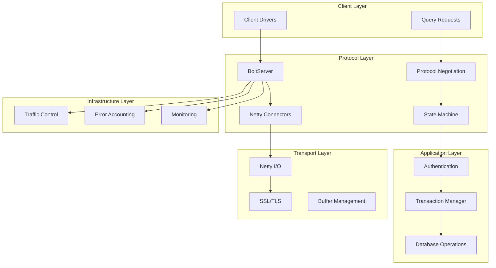

**Diagram sources**
- [BoltServer.java](file://community/bolt/src/main/java/org/neo4j/bolt/BoltServer.java#L114-L817)
- [AbstractNettyConnector.java](file://community/bolt/src/main/java/org/neo4j/bolt/protocol/common/connector/netty/AbstractNettyConnector.java#L60-L342)

The architecture consists of five primary layers:

1. **Client Layer**: Handles client driver communication and query requests
2. **Protocol Layer**: Manages protocol negotiation, state transitions, and message processing
3. **Transport Layer**: Provides network I/O abstraction with Netty
4. **Application Layer**: Implements authentication, transactions, and database operations
5. **Infrastructure Layer**: Offers monitoring, error handling, and traffic management

**Section sources**
- [BoltServer.java](file://community/bolt/src/main/java/org/neo4j/bolt/BoltServer.java#L114-L200)
- [AbstractNettyConnector.java](file://community/bolt/src/main/java/org/neo4j/bolt/protocol/common/connector/netty/AbstractNettyConnector.java#L60-L120)

## Protocol Design and Message Framing

### Binary Protocol Structure

The Bolt Protocol uses a binary format optimized for graph database operations. The protocol supports multiple versions, enabling backward compatibility while introducing new features.

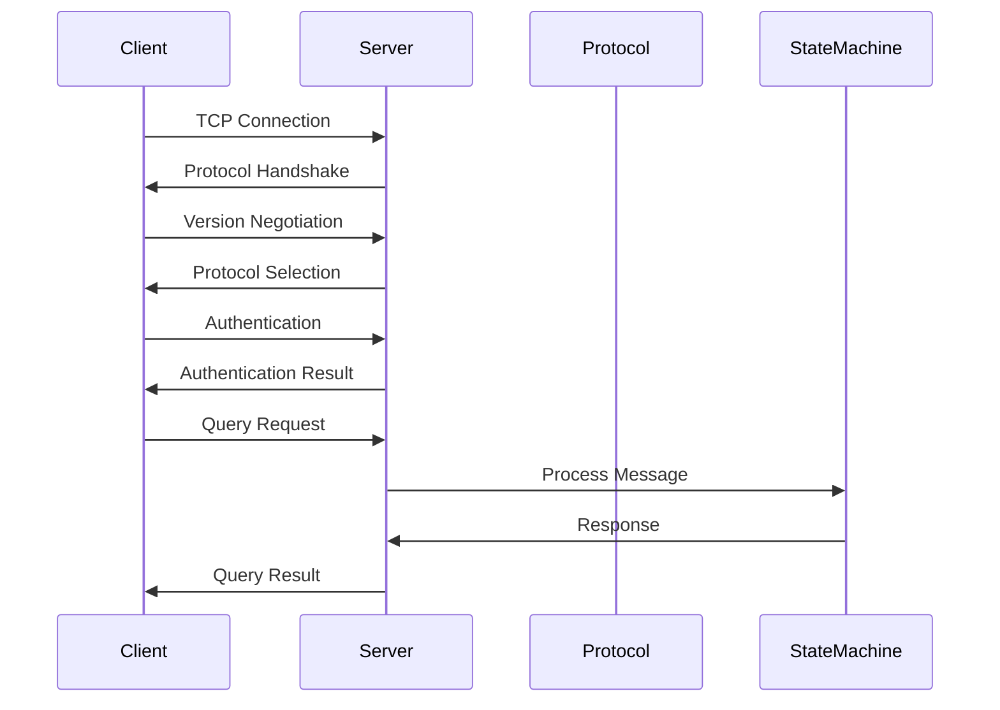

**Diagram sources**
- [BoltChannelInitializer.java](file://community/bolt/src/main/java/org/neo4j/bolt/protocol/common/handler/BoltChannelInitializer.java#L63-L118)
- [StateMachineImpl.java](file://community/bolt/src/main/java/org/neo4j/bolt/fsm/StateMachineImpl.java#L140-L208)

### Message Framing Mechanism

The protocol employs a sophisticated framing system for reliable message transmission:

| Component | Purpose | Implementation |
|-----------|---------|----------------|
| **Magic Number** | Connection identification | 4-byte preamble (0x6060B017) |
| **Frame Header** | Message metadata | Variable-length encoding |
| **Payload** | Message content | Binary-encoded structured data |
| **Signal Messages** | Control operations | Special frame types |

### Protocol Versioning Strategy

The Bolt Protocol supports multiple versions simultaneously, allowing clients and servers to negotiate the highest mutually supported version:

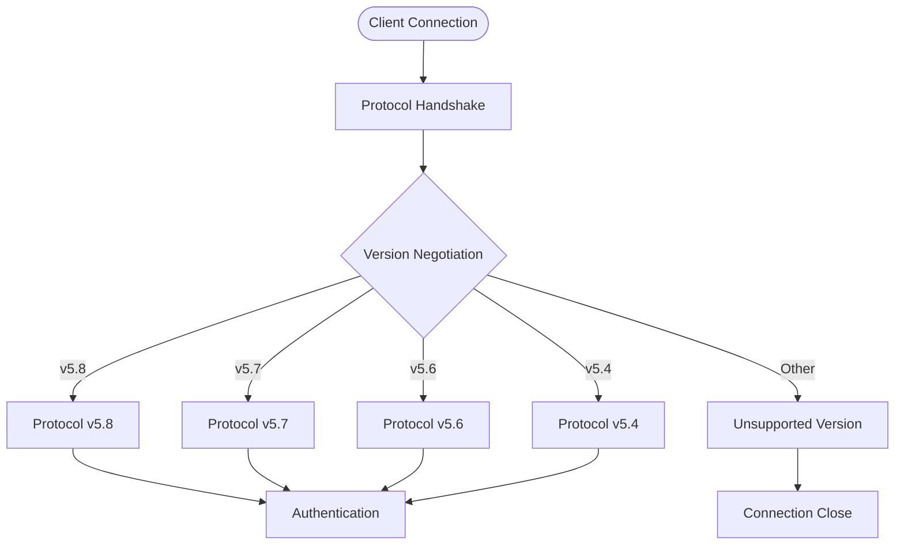

**Diagram sources**
- [BoltProtocolRegistry.java](file://community/bolt/src/main/java/org/neo4j/bolt/protocol/BoltProtocolRegistry.java#L47-L55)

**Section sources**
- [BoltProtocolRegistry.java](file://community/bolt/src/main/java/org/neo4j/bolt/protocol/BoltProtocolRegistry.java#L26-L85)
- [BoltChannelInitializer.java](file://community/bolt/src/main/java/org/neo4j/bolt/protocol/common/handler/BoltChannelInitializer.java#L35-L120)

## State Machine Architecture

### State Transition Model

The Bolt Protocol implements a sophisticated state machine to manage connection lifecycle and message processing:

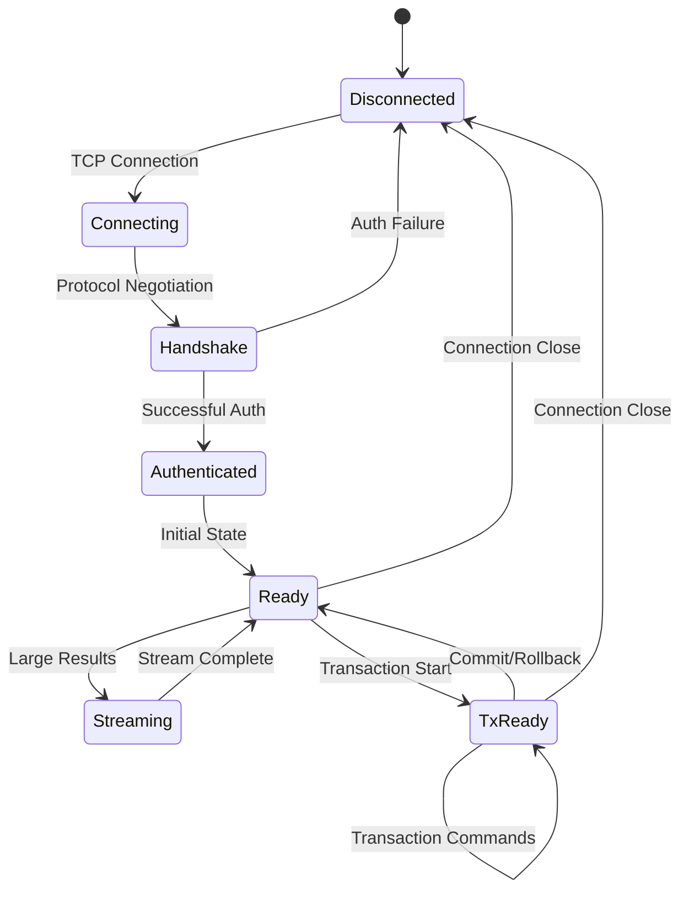

**Diagram sources**
- [StateMachineImpl.java](file://community/bolt/src/main/java/org/neo4j/bolt/fsm/StateMachineImpl.java#L42-L210)

### State Management Implementation

The state machine handles complex scenarios including error recovery, transaction management, and connection resilience:

| State | Description | Transitions |
|-------|-------------|-------------|
| **Disconnected** | Initial state, no connection | Connecting |
| **Connecting** | TCP connection establishment | Handshake |
| **Handshake** | Protocol version negotiation | Authenticated, Disconnected |
| **Authenticated** | Authentication successful | Ready, Disconnected |
| **Ready** | Normal operation state | Streaming, TxReady, Disconnected |
| **Streaming** | Large result streaming | Ready, Disconnected |
| **TxReady** | Transaction active | TxReady, Ready, Disconnected |

**Section sources**
- [StateMachineImpl.java](file://community/bolt/src/main/java/org/neo4j/bolt/fsm/StateMachineImpl.java#L42-L150)

## Network Layer Implementation

### Netty-Based Architecture

The network layer leverages Netty for high-performance, scalable I/O operations:

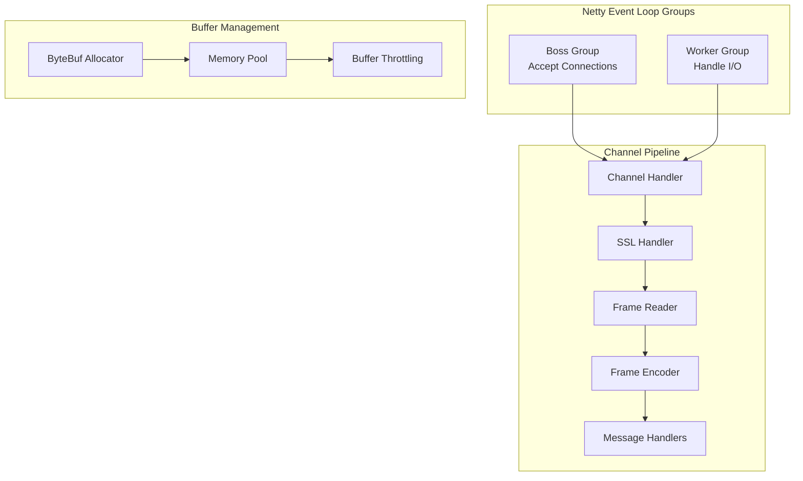

**Diagram sources**
- [AbstractNettyConnector.java](file://community/bolt/src/main/java/org/neo4j/bolt/protocol/common/connector/netty/AbstractNettyConnector.java#L62-L144)
- [SocketNettyConnector.java](file://community/bolt/src/main/java/org/neo4j/bolt/protocol/common/connector/netty/SocketNettyConnector.java#L54-L171)

### Connector Types

The implementation supports multiple connector types for different deployment scenarios:

| Connector Type | Use Case | Features |
|----------------|----------|----------|
| **SocketNettyConnector** | External network connections | TCP/IP, SSL/TLS, configurable ports |
| **DomainSocketNettyConnector** | Unix domain sockets | High-performance local communication |
| **LocalNettyConnector** | In-process connections | Zero-copy optimization |
| **AdditionalSocketNettyConnector** | Multiple external addresses | Load balancing support |

### Transport Abstraction

The transport layer provides abstraction over different networking implementations:

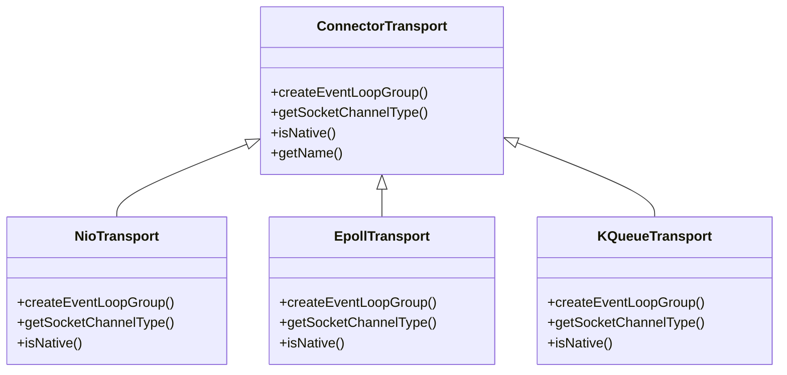

**Section sources**
- [AbstractNettyConnector.java](file://community/bolt/src/main/java/org/neo4j/bolt/protocol/common/connector/netty/AbstractNettyConnector.java#L60-L200)
- [SocketNettyConnector.java](file://community/bolt/src/main/java/org/neo4j/bolt/protocol/common/connector/netty/SocketNettyConnector.java#L54-L171)

## Security and Authentication

### Authentication Framework

The Bolt Protocol implements a pluggable authentication system supporting multiple authentication schemes:

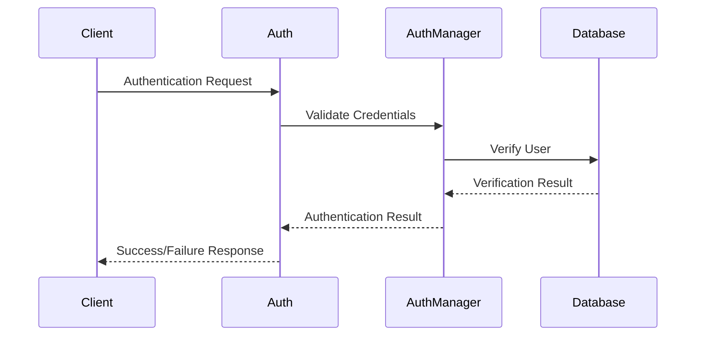

**Diagram sources**
- [Authentication.java](file://community/bolt/src/main/java/org/neo4j/bolt/security/Authentication.java#L41-L56)

### Security Features

| Feature | Implementation | Purpose |
|---------|----------------|---------|
| **SSL/TLS Encryption** | Netty SslContext | Secure communication |
| **Authentication Timeout** | Configurable timeouts | Prevent hanging connections |
| **Connection Limits** | Rate limiting | Resource protection |
| **Access Control** | Database-level permissions | Fine-grained security |

### Authentication Schemes

The system supports various authentication mechanisms:

- **Basic Authentication**: Username/password combinations
- **Token-based Authentication**: JWT and OAuth tokens
- **Certificate-based Authentication**: X.509 certificates
- **Custom Authentication Providers**: Pluggable authentication modules

**Section sources**
- [Authentication.java](file://community/bolt/src/main/java/org/neo4j/bolt/security/Authentication.java#L28-L56)

## Monitoring and Telemetry

### Metrics Collection

The Bolt Protocol implementation provides comprehensive monitoring capabilities:

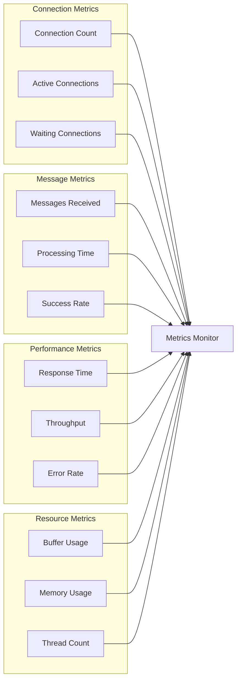

**Diagram sources**
- [BoltConnectionMetricsMonitor.java](file://community/bolt/src/main/java/org/neo4j/bolt/protocol/common/connection/BoltConnectionMetricsMonitor.java#L24-L48)

### Telemetry Features

The protocol supports advanced telemetry capabilities:

| Metric Category | Examples | Purpose |
|-----------------|----------|---------|
| **Connection Metrics** | Open/Close events, Active connections | Capacity planning |
| **Message Metrics** | Processing time, Success/Failure rates | Performance monitoring |
| **Transaction Metrics** | Transaction duration, Rollback frequency | Operational insights |
| **Error Metrics** | Error types, Frequency, Patterns | Reliability analysis |

### Driver Telemetry

The implementation includes driver telemetry support for client-side monitoring:

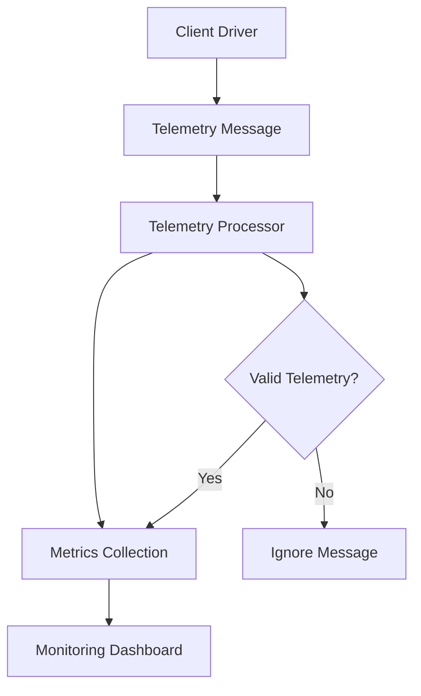

**Section sources**
- [BoltConnectionMetricsMonitor.java](file://community/bolt/src/main/java/org/neo4j/bolt/protocol/common/connection/BoltConnectionMetricsMonitor.java#L24-L48)

## Scalability and High-Concurrency Design

### Concurrency Model

The Bolt Protocol is designed for high-concurrency scenarios with sophisticated threading model:

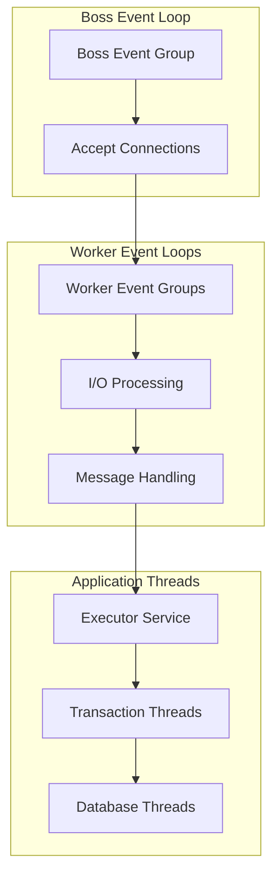

**Diagram sources**
- [AbstractNettyConnector.java](file://community/bolt/src/main/java/org/neo4j/bolt/protocol/common/connector/netty/AbstractNettyConnector.java#L124-L144)

### Memory Management

The implementation employs sophisticated memory management strategies:

| Component | Strategy | Benefits |
|-----------|----------|----------|
| **Buffer Pooling** | Pooled ByteBufAllocator | Reduced GC pressure |
| **Memory Tracking** | Per-connection memory limits | Prevent memory leaks |
| **Garbage Collection** | Off-heap allocation | Predictable performance |
| **Resource Cleanup** | Automatic reference counting | Efficient cleanup |

### Scaling Considerations

The architecture supports horizontal and vertical scaling:

- **Horizontal Scaling**: Multiple Bolt servers behind load balancer
- **Vertical Scaling**: Tunable thread pools and buffer sizes
- **Connection Pooling**: Client-side connection reuse
- **Load Balancing**: Intelligent connection distribution

**Section sources**
- [AbstractNettyConnector.java](file://community/bolt/src/main/java/org/neo4j/bolt/protocol/common/connector/netty/AbstractNettyConnector.java#L124-L200)

## Deployment Topologies

### Single Server Deployment

For development and small-scale deployments:

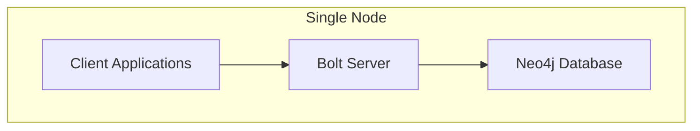

### High-Availability Deployment

For production environments requiring high availability:

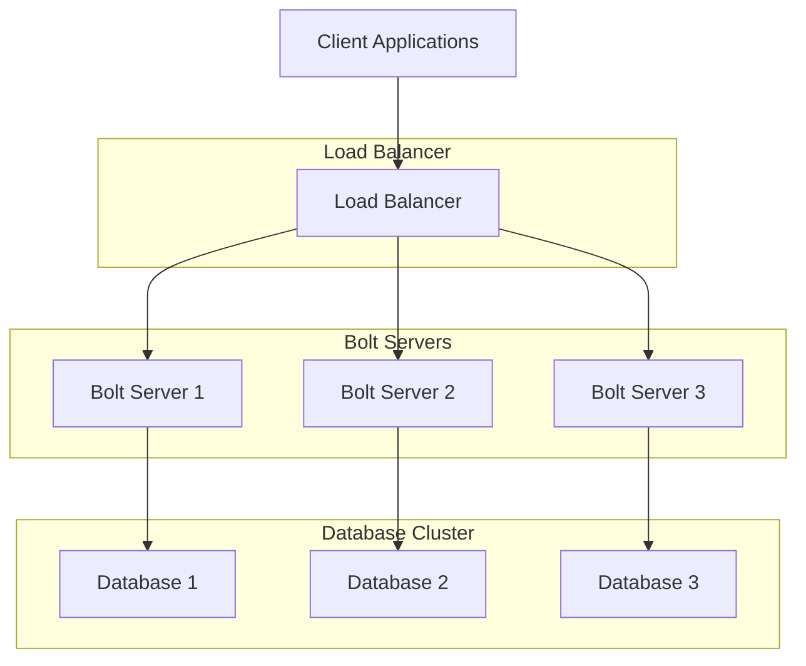

### Multi-Database Deployment

Support for multiple databases within a single Bolt server:

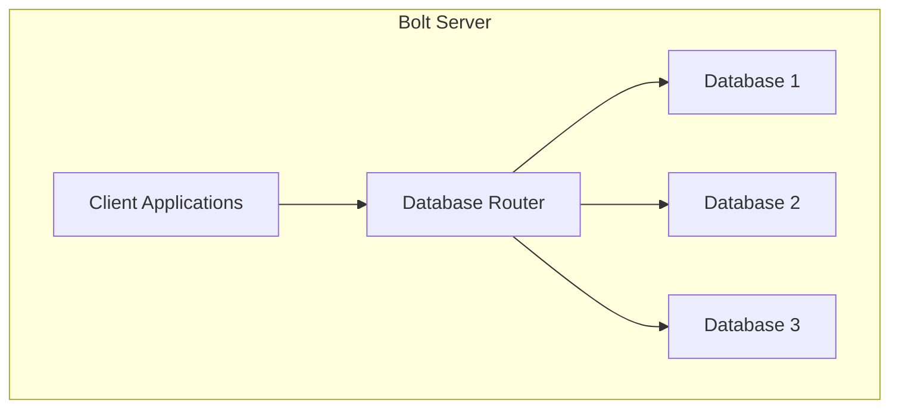

### Containerized Deployment

Container-native deployment with orchestration support:

| Component | Container Image | Purpose |
|-----------|----------------|---------|
| **Bolt Server** | neo4j/bolt-server | Protocol handling |
| **Database** | neo4j/database | Data storage |
| **Proxy** | haproxy/nginx | Load balancing |
| **Monitoring** | prometheus/grafana | Observability |

## Cross-Cutting Concerns

### Error Handling and Resilience

The Bolt Protocol implements comprehensive error handling and resilience mechanisms:

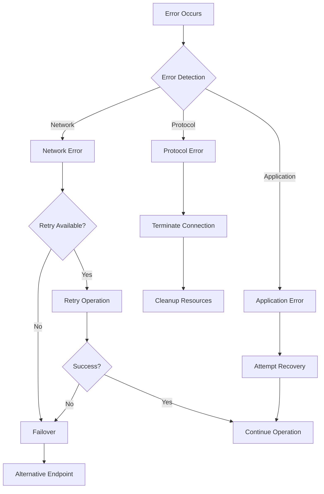

**Diagram sources**
- [ErrorAccountant.java](file://community/bolt/src/main/java/org/neo4j/bolt/protocol/common/connector/accounting/error/ErrorAccountant.java#L28-L42)

### Traffic Management

The system includes sophisticated traffic management capabilities:

| Feature | Implementation | Purpose |
|---------|----------------|---------|
| **Bandwidth Throttling** | Configurable limits | Prevent overload |
| **Connection Limits** | Per-client limits | Fair resource allocation |
| **Priority Queuing** | Message prioritization | Critical operation support |
| **Circuit Breaker** | Error threshold detection | System protection |

### Disaster Recovery

The implementation supports various disaster recovery scenarios:

- **Connection Resilience**: Automatic reconnection with exponential backoff
- **State Recovery**: Transaction state preservation across connections
- **Graceful Degradation**: Reduced functionality during partial failures
- **Health Checks**: Proactive system health monitoring

**Section sources**
- [ErrorAccountant.java](file://community/bolt/src/main/java/org/neo4j/bolt/protocol/common/connector/accounting/error/ErrorAccountant.java#L28-L42)
- [TrafficAccountant.java](file://community/bolt/src/main/java/org/neo4j/bolt/protocol/common/connector/accounting/traffic/TrafficAccountant.java#L22-L29)

## Technical Decisions and Trade-offs

### Netty vs. Other Frameworks

**Decision**: Use Netty for network I/O

**Rationale**:
- High-performance asynchronous I/O
- Mature ecosystem and extensive documentation
- Excellent support for SSL/TLS
- Proven scalability in production environments

**Trade-offs**:
- Increased complexity compared to synchronous frameworks
- Learning curve for Netty-specific concepts
- Additional memory overhead for event loops

### Binary Protocol vs. HTTP

**Decision**: Use binary protocol over HTTP

**Benefits**:
- Lower overhead for frequent small messages
- Better compression ratios for graph data
- Native support for streaming large results
- Optimized for graph traversal patterns

**Considerations**:
- Less human-readable for debugging
- Requires client library support
- More complex protocol implementation

### Stateful vs. Stateless Design

**Decision**: Stateful protocol design

**Advantages**:
- Efficient transaction management
- Reduced overhead for repeated operations
- Better support for streaming operations
- Simplified client-side caching

**Challenges**:
- Increased complexity in connection management
- Higher memory usage per connection
- Need for connection pooling strategies

### Protocol Versioning Strategy

**Approach**: Backward-compatible versioning

**Benefits**:
- Smooth migration paths for clients
- Extended support lifecycle
- Gradual adoption of new features
- Reduced client maintenance burden

**Implementation Details**:
- Version negotiation during handshake
- Graceful degradation for unsupported features
- Comprehensive compatibility testing

## Conclusion

The Bolt Protocol implementation in Neo4j represents a sophisticated, high-performance communication system designed for modern graph database applications. Its architecture demonstrates careful consideration of scalability, reliability, and performance requirements while maintaining flexibility for future enhancements.

Key architectural strengths include:

- **Netty-based Networking**: Leverages proven high-performance I/O framework
- **State Machine Design**: Provides robust connection lifecycle management
- **Comprehensive Monitoring**: Enables operational visibility and optimization
- **Flexible Deployment**: Supports diverse deployment scenarios and scaling patterns
- **Security Focus**: Implements industry-standard security practices

The implementation successfully balances the competing demands of performance, reliability, and maintainability, providing a solid foundation for Neo4j's client-server communication needs. Its modular design and extensible architecture position it well for future protocol enhancements and evolving deployment requirements.