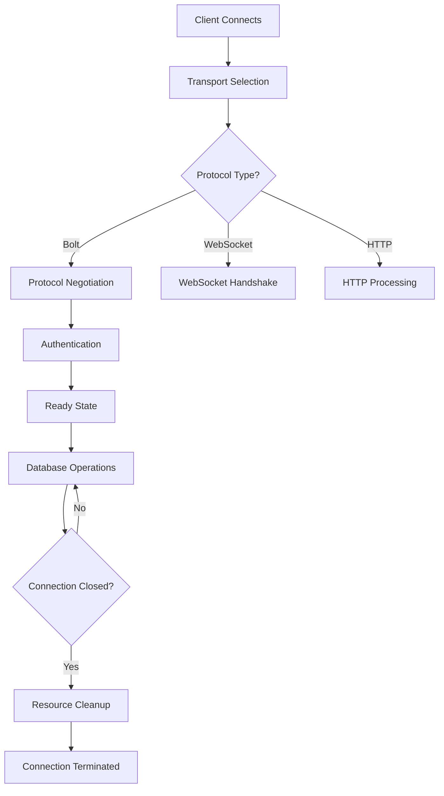
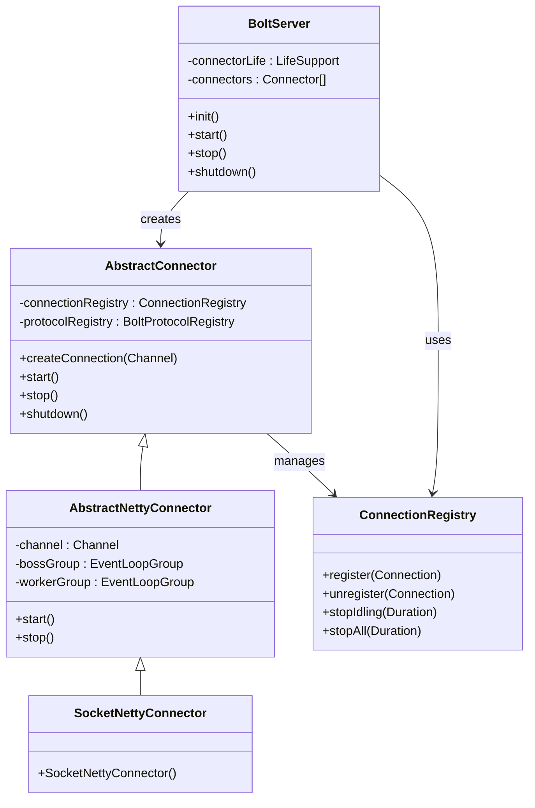
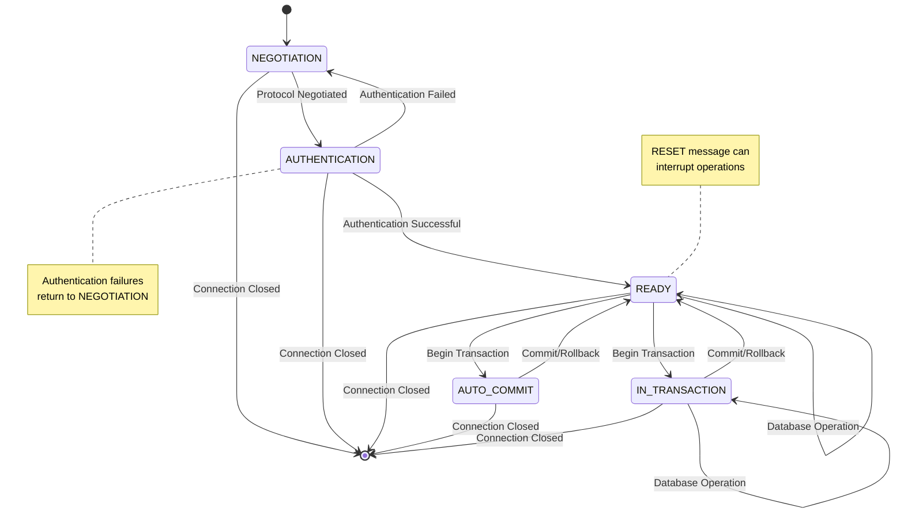
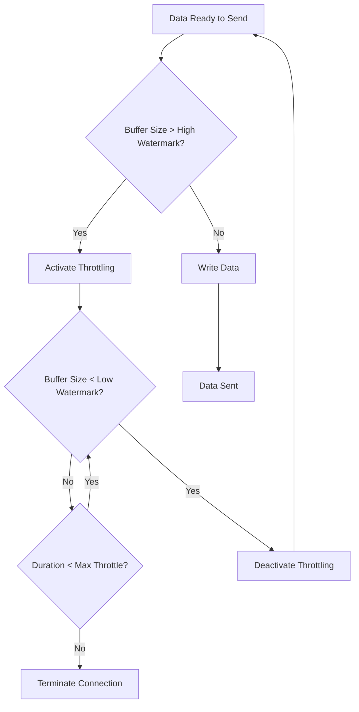
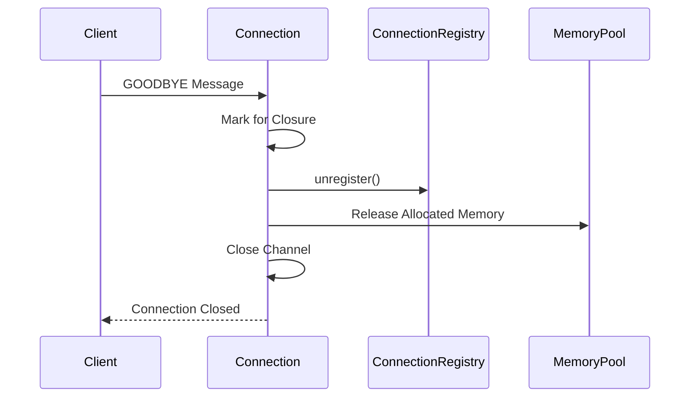

# Connection Management

<cite>
**Referenced Files in This Document**   
- [BoltServer.java](file://community/bolt/src/main/java/org/neo4j/bolt/BoltServer.java)
- [AbstractConnector.java](file://community/bolt/src/main/java/org/neo4j/bolt/protocol/common/connector/AbstractConnector.java)
- [AbstractNettyConnector.java](file://community/bolt/src/main/java/org/neo4j/bolt/protocol/common/connector/netty/AbstractNettyConnector.java)
- [SocketNettyConnector.java](file://community/bolt/src/main/java/org/neo4j/bolt/protocol/common/connector/netty/SocketNettyConnector.java)
- [AbstractConnection.java](file://community/bolt/src/main/java/org/neo4j/bolt/protocol/common/connector/connection/AbstractConnection.java)
- [Connection.java](file://community/bolt/src/main/java/org/neo4j/bolt/protocol/common/connector/connection/Connection.java)
- [TransportThrottle.java](file://community/bolt/src/main/java/org/neo4j/bolt/transport/TransportThrottle.java)
- [TransportThrottleException.java](file://community/bolt/src/main/java/org/neo4j/bolt/transport/TransportThrottleException.java)
- [ChannelWriteThrottleHandler.java](file://community/bolt/src/main/java/org/neo4j/bolt/runtime/throttle/ChannelWriteThrottleHandler.java)
- [ChannelReadThrottleHandler.java](file://community/bolt/src/main/java/org/neo4j/bolt/runtime/throttle/ChannelReadThrottleHandler.java)
- [BoltChannelInitializer.java](file://community/bolt/src/main/java/org/neo4j/bolt/protocol/common/handler/BoltChannelInitializer.java)
- [TransportSelectionHandler.java](file://community/bolt/src/main/java/org/neo4j/bolt/protocol/common/handler/TransportSelectionHandler.java)
- [ConnectionRegistry.java](file://community/bolt/src/main/java/org/neo4j/bolt/protocol/common/connector/ConnectionRegistry.java)
- [StateMachineImpl.java](file://community/bolt/src/main/java/org/neo4j/bolt/fsm/StateMachineImpl.java)
- [States.java](file://community/bolt/src/main/java/org/neo4j/bolt/protocol/common/fsm/States.java)
</cite>

## Table of Contents
1. [Introduction](#introduction)
2. [Connection Lifecycle Management](#connection-lifecycle-management)
3. [BoltServer and Connector Architecture](#boltserver-and-connector-architecture)
4. [Connection State Transitions and Error Handling](#connection-state-transitions-and-error-handling)
5. [TransportThrottle and Resource Management](#transportthrottle-and-resource-management)
6. [Connection Termination and Resource Cleanup](#connection-termination-and-resource-cleanup)
7. [Best Practices and Common Issues](#best-practices-and-common-issues)
8. [Conclusion](#conclusion)

## Introduction
The Bolt Protocol's connection management system in Neo4j provides a robust framework for handling client connections through a layered architecture that integrates Netty for transport, state machines for protocol handling, and comprehensive resource management. This document details the implementation of connection lifecycle handling, including initialization, negotiation, and termination, with a focus on the interaction between BoltServer, Connector implementations, and the Netty transport layer. The system is designed to efficiently manage high-concurrency scenarios while maintaining connection resilience and preventing resource leaks.

**Section sources**
- [BoltServer.java](file://community/bolt/src/main/java/org/neo4j/bolt/BoltServer.java#L113-L815)

## Connection Lifecycle Management

The connection lifecycle in the Bolt Protocol begins with the BoltServer initializing connector components during the database startup process. The BoltServer acts as the central coordinator, managing multiple Connector instances that handle incoming client connections. Each Connector is responsible for a specific transport type (e.g., TCP socket, domain socket) and is configured with parameters such as bind addresses, SSL policies, and authentication mechanisms.

When a client initiates a connection, the Netty-based transport layer accepts the connection and creates a Channel object. The Connector then creates a Connection instance through its connection factory, registering it with the ConnectionRegistry for tracking and management. This Connection object serves as the central representation of the client session, maintaining state information, protocol version, authentication context, and associated resources.

The connection negotiation process follows a structured sequence: transport selection, protocol negotiation, and authentication. The TransportSelectionHandler first determines the appropriate transport protocol (Bolt, WebSocket, or HTTP) by examining the initial bytes of the incoming data stream. For Bolt connections, this is followed by protocol version negotiation where the client and server agree on a compatible Bolt version from the supported range. Finally, the connection transitions to the authentication phase where credentials are validated and a LoginContext is established.

**Diagram sources**
- [BoltServer.java](file://community/bolt/src/main/java/org/neo4j/bolt/BoltServer.java#L113-L815)
- [AbstractNettyConnector.java](file://community/bolt/src/main/java/org/neo4j/bolt/protocol/common/connector/netty/AbstractNettyConnector.java#L60-L342)
- [BoltChannelInitializer.java](file://community/bolt/src/main/java/org/neo4j/bolt/protocol/common/handler/BoltChannelInitializer.java#L68-L97)
- [TransportSelectionHandler.java](file://community/bolt/src/main/java/org/neo4j/bolt/protocol/common/handler/TransportSelectionHandler.java#L54-L295)

**Section sources**
- [BoltServer.java](file://community/bolt/src/main/java/org/neo4j/bolt/BoltServer.java#L113-L815)
- [AbstractNettyConnector.java](file://community/bolt/src/main/java/org/neo4j/bolt/protocol/common/connector/netty/AbstractNettyConnector.java#L60-L342)
- [BoltChannelInitializer.java](file://community/bolt/src/main/java/org/neo4j/bolt/protocol/common/handler/BoltChannelInitializer.java#L68-L97)

## BoltServer and Connector Architecture

The BoltServer class serves as the primary entry point for the Bolt protocol implementation, extending the LifecycleAdapter to integrate with Neo4j's component lifecycle management. During initialization, the BoltServer configures essential components including event loop groups, memory pools, and thread pools that will be shared across all Connector instances. The server discovers the optimal transport implementation (NIO or native) based on the runtime environment and system capabilities.

Connector implementations follow a hierarchical structure with AbstractConnector providing common functionality and AbstractNettyConnector adding Netty-specific features. The SocketNettyConnector is the primary implementation for TCP-based connections, configuring the Netty ServerBootstrap with appropriate channel types, event loop groups, and pipeline initializers. Each Connector maintains configuration parameters that control connection behavior, including buffer sizes, timeout values, and security settings.

The connection factory pattern is employed to decouple connection creation from the specific implementation details. The AtomicSchedulingConnection.Factory creates Connection instances with access to shared resources like the executor service and clock, ensuring consistent behavior across all connections. The ConnectionRegistry maintains a collection of active connections, enabling centralized management and monitoring of connection state.

**Diagram sources**
- [BoltServer.java](file://community/bolt/src/main/java/org/neo4j/bolt/BoltServer.java#L113-L815)
- [AbstractConnector.java](file://community/bolt/src/main/java/org/neo4j/bolt/protocol/common/connector/AbstractConnector.java#L55-L425)
- [AbstractNettyConnector.java](file://community/bolt/src/main/java/org/neo4j/bolt/protocol/common/connector/netty/AbstractNettyConnector.java#L60-L342)
- [SocketNettyConnector.java](file://community/bolt/src/main/java/org/neo4j/bolt/protocol/common/connector/netty/SocketNettyConnector.java)
- [ConnectionRegistry.java](file://community/bolt/src/main/java/org/neo4j/bolt/protocol/common/connector/ConnectionRegistry.java#L36-L144)

**Section sources**
- [BoltServer.java](file://community/bolt/src/main/java/org/neo4j/bolt/BoltServer.java#L113-L815)
- [AbstractConnector.java](file://community/bolt/src/main/java/org/neo4j/bolt/protocol/common/connector/AbstractConnector.java#L55-L425)
- [AbstractNettyConnector.java](file://community/bolt/src/main/java/org/neo4j/bolt/protocol/common/connector/netty/AbstractNettyConnector.java#L60-L342)

## Connection State Transitions and Error Handling

The Bolt protocol implements a finite state machine (FSM) to manage connection state transitions, ensuring protocol compliance and proper sequencing of operations. The state machine follows a well-defined progression from NEGOTIATION to AUTHENTICATION, then to READY state where database operations can commence. Protocol-specific implementations may include additional states such as AUTO_COMMIT or IN_TRANSACTION based on the negotiated Bolt version.

State transitions are triggered by incoming request messages and are processed through registered state transition handlers. For example, receiving a HELLO message in the AUTHENTICATION state triggers the AuthenticationStateTransition, which validates credentials and transitions to the READY state upon success. The StateMachineImpl enforces these transitions, throwing IllegalTransitionException when a request is received in an inappropriate state.

Error handling is implemented through a comprehensive exception hierarchy that distinguishes between recoverable and terminal conditions. StateTransitionException serves as the base class for state machine errors, with specific implementations like IllegalTransitionException and AuthenticationStateTransitionException providing context-specific information. Exceptions implementing ConnectionTerminating indicate that the connection should be closed following the error condition.

**Diagram sources**
- [StateMachineImpl.java](file://community/bolt/src/main/java/org/neo4j/bolt/fsm/StateMachineImpl.java#L62-L113)
- [States.java](file://community/bolt/src/main/java/org/neo4j/bolt/protocol/common/fsm/States.java#L24-L34)
- [IllegalTransitionException.java](file://community/bolt/src/main/java/org/neo4j/bolt/fsm/error/state/IllegalTransitionException.java#L34-L70)
- [AuthenticationStateTransitionException.java](file://community/bolt/src/main/java/org/neo4j/bolt/protocol/common/fsm/error/AuthenticationStateTransitionException.java#L31-L32)

**Section sources**
- [StateMachineImpl.java](file://community/bolt/src/main/java/org/neo4j/bolt/fsm/StateMachineImpl.java#L62-L113)
- [States.java](file://community/bolt/src/main/java/org/neo4j/bolt/protocol/common/fsm/States.java#L24-L34)
- [IllegalTransitionException.java](file://community/bolt/src/main/java/org/neo4j/bolt/fsm/error/state/IllegalTransitionException.java#L34-L70)

## TransportThrottle and Resource Management

The TransportThrottle mechanism protects the server from resource exhaustion by clients that consume data slower than it is produced. When the outbound network buffer exceeds the high watermark threshold, the ChannelWriteThrottleHandler activates throttling, preventing further writes until the buffer drains below the low watermark. If the throttled state persists beyond the configured maximum duration, a TransportThrottleException is thrown, leading to connection termination.

Configuration parameters control the throttling behavior: outboundBufferThrottleHighWatermark sets the threshold for activating throttling, outboundBufferThrottleLowWatermark determines when throttling is released, and outboundBufferMaxThrottleDuration specifies the maximum time a connection can remain throttled before termination. These values are configurable through the Connector's configuration, allowing administrators to tune the behavior based on their specific requirements and network conditions.

Resource management extends beyond network buffers to include memory allocation tracking through the ConnectionMemoryTracker. This component monitors heap memory usage per connection, reserving chunks from the global BoltMemoryPool. The memory tracker helps prevent individual connections from consuming excessive memory and provides visibility into resource utilization for monitoring and troubleshooting.

**Diagram sources**
- [TransportThrottle.java](file://community/bolt/src/main/java/org/neo4j/bolt/transport/TransportThrottle.java#L25-L56)
- [TransportThrottleException.java](file://community/bolt/src/main/java/org/neo4j/bolt/transport/TransportThrottleException.java#L27-L36)
- [ChannelWriteThrottleHandler.java](file://community/bolt/src/main/java/org/neo4j/bolt/runtime/throttle/ChannelWriteThrottleHandler.java#L34-L69)
- [AbstractConnector.java](file://community/bolt/src/main/java/org/neo4j/bolt/protocol/common/connector/AbstractConnector.java#L365-L409)

**Section sources**
- [TransportThrottle.java](file://community/bolt/src/main/java/org/neo4j/bolt/transport/TransportThrottle.java#L25-L56)
- [TransportThrottleException.java](file://community/bolt/src/main/java/org/neo4j/bolt/transport/TransportThrottleException.java#L27-L36)
- [ChannelWriteThrottleHandler.java](file://community/bolt/src/main/java/org/neo4j/bolt/runtime/throttle/ChannelWriteThrottleHandler.java#L34-L69)

## Connection Termination and Resource Cleanup

Connection termination occurs through multiple pathways: graceful closure initiated by the client (GOODBYE message), server-initiated shutdown, timeout expiration, or error conditions. The ConnectionRegistry plays a crucial role in cleanup, maintaining references to all active connections and ensuring proper deregistration during shutdown sequences. During server shutdown, the BoltServer follows a coordinated sequence: first stopping the boss event loop group to prevent new connections, then allowing existing connections to complete their work before terminating worker threads.

The close() method on Connection implements a sophisticated shutdown protocol that varies based on the calling context. When invoked from the connection's worker thread or when the connection is idling, termination occurs immediately. From other threads, the connection is marked for closure and will terminate at the next available opportunity. This design prevents race conditions and ensures orderly cleanup of associated resources including transactions, memory allocations, and network handles.

Resource cleanup extends to protocol-specific components such as the WriterPipeline and StructRegistry, which are released when the connection terminates. The ConnectionMemoryTracker ensures that all allocated memory is properly accounted for and returned to the pool. The NetworkConnectionTracker maintains a global registry of connections for monitoring and management purposes, removing entries when connections are closed.

**Diagram sources**
- [AbstractConnection.java](file://community/bolt/src/main/java/org/neo4j/bolt/protocol/common/connector/connection/AbstractConnection.java#L500-L567)
- [Connection.java](file://community/bolt/src/main/java/org/neo4j/bolt/protocol/common/connector/connection/Connection.java#L395-L397)
- [ConnectionRegistry.java](file://community/bolt/src/main/java/org/neo4j/bolt/protocol/common/connector/ConnectionRegistry.java#L68-L76)
- [BoltServer.java](file://community/bolt/src/main/java/org/neo4j/bolt/BoltServer.java#L404-L459)

**Section sources**
- [AbstractConnection.java](file://community/bolt/src/main/java/org/neo4j/bolt/protocol/common/connector/connection/AbstractConnection.java#L500-L567)
- [ConnectionRegistry.java](file://community/bolt/src/main/java/org/neo4j/bolt/protocol/common/connector/ConnectionRegistry.java#L68-L76)
- [BoltServer.java](file://community/bolt/src/main/java/org/neo4j/bolt/BoltServer.java#L404-L459)

## Best Practices and Common Issues

Effective connection management requires attention to configuration parameters that balance performance, resource utilization, and reliability. Key configuration settings include connection_timeout for detecting stale connections, keep_alive_interval for maintaining connection liveliness through firewalls, and appropriate buffer size settings to optimize throughput without excessive memory consumption.

Common issues include connection pooling problems where clients fail to properly return connections to the pool, leading to resource exhaustion. Implementing proper connection lifecycle management in client applications, including timely closure of connections and handling of exceptions, prevents these issues. Timeout handling should be implemented at both client and server levels, with client-side timeouts slightly shorter than server-side to prevent hanging operations.

Resource leaks can occur when connections are not properly closed, particularly in error conditions. Implementing try-with-resources patterns in client code and ensuring that all code paths properly close connections mitigates this risk. Monitoring connection metrics such as active connection count, connection rate, and error rates provides early warning of potential issues.

For high-concurrency optimization, tuning the thread pool sizes (min and max worker threads) based on the expected workload and available CPU resources is essential. Enabling connection keep-alive reduces the overhead of establishing new connections for frequent operations. Implementing proper error handling and retry logic in client applications improves resilience to transient network issues.

## Conclusion
The Bolt Protocol's connection management system in Neo4j provides a comprehensive framework for handling client connections with a focus on reliability, performance, and resource efficiency. The architecture leverages Netty for scalable transport handling, finite state machines for protocol compliance, and sophisticated resource management to prevent exhaustion. Understanding the connection lifecycle, state transitions, and throttling mechanisms enables effective configuration and troubleshooting of Neo4j deployments. By following best practices for connection management and monitoring key metrics, administrators can ensure optimal performance and reliability in both development and production environments.