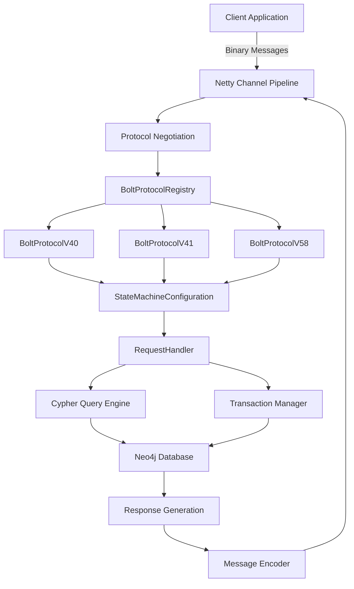
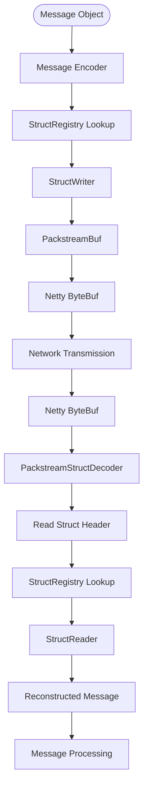
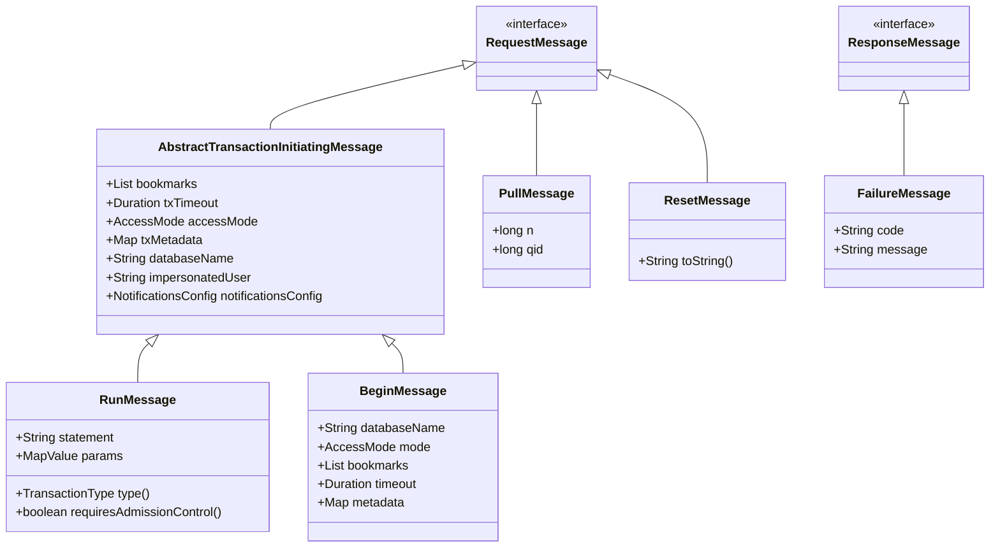
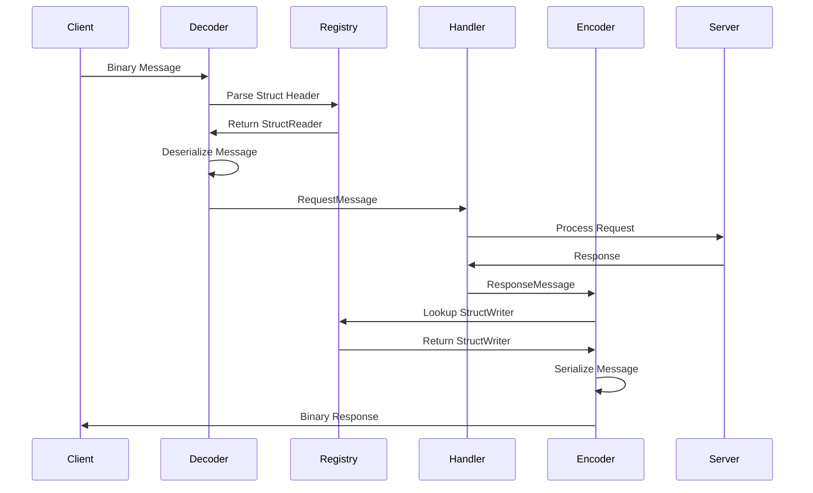

# Message Processing

<cite>
**Referenced Files in This Document**   
- [BoltProtocol.java](file://community/bolt/src/main/java/org/neo4j/bolt/protocol/common/BoltProtocol.java)
- [BoltProtocolRegistry.java](file://community/bolt/src/main/java/org/neo4j/bolt/protocol/BoltProtocolRegistry.java)
- [DefaultRunMessageDecoder.java](file://community/bolt/src/main/java/org/neo4j/bolt/protocol/common/message/decoder/transaction/DefaultRunMessageDecoder.java)
- [RunMessage.java](file://community/bolt/src/main/java/org/neo4j/bolt/protocol/common/message/request/transaction/RunMessage.java)
- [PullMessage.java](file://community/bolt/src/main/java/org/neo4j/bolt/protocol/common/message/request/streaming/PullMessage.java)
- [BeginMessage.java](file://community/bolt/src/main/java/org/neo4j/bolt/protocol/common/message/request/transaction/BeginMessage.java)
- [ResetMessage.java](file://community/bolt/src/main/java/org/neo4j/bolt/protocol/common/message/request/connection/ResetMessage.java)
- [FailureMessage.java](file://community/bolt/src/main/java/org/neo4j/bolt/protocol/common/message/response/FailureMessage.java)
- [ProtocolNegotiationRequestDecoder.java](file://community/bolt/src/main/java/org/neo4j/bolt/negotiation/codec/ProtocolNegotiationRequestDecoder.java)
- [ProtocolVersion.java](file://community/bolt/src/main/java/org/neo4j/bolt/negotiation/ProtocolVersion.java)
- [AbstractBoltProtocol.java](file://community/bolt/src/main/java/org/neo4j/bolt/protocol/AbstractBoltProtocol.java)
- [BoltStructEncoder.java](file://community/bolt/src/main/java/org/neo4j/bolt/protocol/common/codec/BoltStructEncoder.java)
- [PackstreamStructDecoder.java](file://community/bolt/src/main/java/org/neo4j/packstream/codec/PackstreamStructDecoder.java)
- [WriterPipeline.java](file://community/bolt/src/main/java/org/neo4j/bolt/protocol/io/pipeline/WriterPipeline.java)
</cite>

## Table of Contents
1. [Introduction](#introduction)
2. [Bolt Protocol Architecture](#bolt-protocol-architecture)
3. [Message Encoding and Decoding](#message-encoding-and-decoding)
4. [Protocol Version Management](#protocol-version-management)
5. [Message Domain Model](#message-domain-model)
6. [Message Processing Pipeline](#message-processing-pipeline)
7. [Error Handling and Common Issues](#error-handling-and-common-issues)
8. [Performance Optimization](#performance-optimization)
9. [Conclusion](#conclusion)

## Introduction

The Bolt Protocol is Neo4j's binary communication protocol that enables efficient client-server interaction for database operations. This document provides a comprehensive analysis of the message processing system, focusing on the implementation details of message encoding, decoding, and routing. The system handles various protocol versions from V40 to V58, supporting Cypher queries, transaction commands, and streaming responses through a sophisticated binary message format.

The message processing system is built on Netty's event-driven architecture, utilizing a pipeline of handlers for protocol negotiation, message decoding, request processing, and response encoding. The core components include the BoltProtocol implementations, BoltProtocolRegistry for version management, and codec components that handle the binary serialization and deserialization of messages.

This documentation aims to provide both beginners and experienced developers with a thorough understanding of the message processing system, covering the domain model of Bolt messages, the interaction between protocol components, and solutions for common issues such as message corruption and protocol version mismatches.

## Bolt Protocol Architecture

The Bolt Protocol architecture is designed as a layered system that handles connection establishment, protocol negotiation, message processing, and response generation. At its core, the architecture follows a state machine pattern where each protocol version maintains its own state transitions and message handling logic.



**Diagram sources**
- [BoltProtocol.java](file://community/bolt/src/main/java/org/neo4j/bolt/protocol/common/BoltProtocol.java)
- [BoltProtocolRegistry.java](file://community/bolt/src/main/java/org/neo4j/bolt/protocol/BoltProtocolRegistry.java)
- [AbstractBoltProtocol.java](file://community/bolt/src/main/java/org/neo4j/bolt/protocol/AbstractBoltProtocol.java)

The architecture begins with protocol negotiation where the client and server agree on a compatible protocol version. Once established, the selected BoltProtocol implementation configures the message processing pipeline with appropriate decoders and encoders. Each protocol version extends the AbstractBoltProtocol class, inheriting common functionality while implementing version-specific message handling.

The StateMachineConfiguration defines the valid state transitions for each protocol version, ensuring that messages are processed in the correct order according to the protocol specification. The RequestHandler processes decoded messages and routes them to the appropriate subsystems, such as the Cypher query engine or transaction manager.

**Section sources**
- [BoltProtocol.java](file://community/bolt/src/main/java/org/neo4j/bolt/protocol/common/BoltProtocol.java)
- [BoltProtocolRegistry.java](file://community/bolt/src/main/java/org/neo4j/bolt/protocol/BoltProtocolRegistry.java)

## Message Encoding and Decoding

The message encoding and decoding system in the Bolt Protocol is built on PackStream, a compact binary serialization format optimized for efficient transmission and parsing. The encoding process transforms Java objects into binary messages, while decoding reverses this process to reconstruct the original objects from received bytes.



**Diagram sources**
- [PackstreamStructDecoder.java](file://community/bolt/src/main/java/org/neo4j/packstream/codec/PackstreamStructDecoder.java)
- [BoltStructEncoder.java](file://community/bolt/src/main/java/org/neo4j/bolt/protocol/common/codec/BoltStructEncoder.java)
- [WriterPipeline.java](file://community/bolt/src/main/java/org/neo4j/bolt/protocol/io/pipeline/WriterPipeline.java)

The encoding process begins when a message object is passed to the BoltStructEncoder, which uses the StructRegistry to find the appropriate StructWriter for the message type. The StructWriter then serializes the message fields into the PackstreamBuf according to the PackStream format specification. The encoded message is wrapped in a Netty ByteBuf for transmission over the network.

On the receiving end, the PackstreamStructDecoder reads the incoming bytes and parses the struct header to determine the message type. It then uses the StructRegistry to locate the corresponding StructReader, which deserializes the message fields from the buffer. The decoding process includes validation to ensure message integrity and protocol compliance.

The PackStream format uses type markers and length prefixes to efficiently encode different data types. Strings, integers, floating-point numbers, and complex structures like maps and lists are all encoded with minimal overhead. The format supports variable-length encoding for integers and strings, optimizing space usage for common values.

**Section sources**
- [BoltStructEncoder.java](file://community/bolt/src/main/java/org/neo4j/bolt/protocol/common/codec/BoltStructEncoder.java)
- [PackstreamStructDecoder.java](file://community/bolt/src/main/java/org/neo4j/packstream/codec/PackstreamStructDecoder.java)
- [WriterPipeline.java](file://community/bolt/src/main/java/org/neo4j/bolt/protocol/io/pipeline/WriterPipeline.java)

## Protocol Version Management

Protocol version management in the Bolt Protocol system is handled by the BoltProtocolRegistry, which maintains a collection of available protocol implementations and selects the appropriate version during the handshake process. This allows the server to support multiple protocol versions simultaneously while ensuring backward compatibility.

```mermaid
classDiagram
class BoltProtocolRegistry {
+Builder builder()
+Builder builderOf()
+Optional<BoltProtocol> get(ProtocolVersion)
}
class BoltProtocolRegistry$Builder {
+BoltProtocolRegistry build()
+Builder register(BoltProtocol)
+Builder register(Iterable<BoltProtocol>)
}
class BoltProtocol {
+ProtocolVersion version()
+Set<Feature> features()
+Predicate<FrameSignal> frameSignalFilter()
+StateMachineConfiguration stateMachine()
+StructRegistry<Connection, RequestMessage> requestMessageRegistry()
+StructRegistry<Connection, ResponseMessage> responseMessageRegistry()
}
class ProtocolVersion {
+short major
+short minor
+short range
+int compareTo(ProtocolVersion)
}
BoltProtocolRegistry "1" *-- "1..*" BoltProtocolRegistry$Builder : creates
BoltProtocolRegistry "1" --> "0..*" BoltProtocol : contains
BoltProtocol "1" --> "1" ProtocolVersion : has
```

**Diagram sources**
- [BoltProtocolRegistry.java](file://community/bolt/src/main/java/org/neo4j/bolt/protocol/BoltProtocolRegistry.java)
- [BoltProtocol.java](file://community/bolt/src/main/java/org/neo4j/bolt/protocol/common/BoltProtocol.java)
- [ProtocolVersion.java](file://community/bolt/src/main/java/org/neo4j/bolt/negotiation/ProtocolVersion.java)

The protocol negotiation process begins when the client sends a ProtocolNegotiationRequest containing a list of supported protocol versions in order of preference. The server's ProtocolNegotiationRequestDecoder parses this request and passes it to the LegacyProtocolHandshakeHandler, which iterates through the proposed versions to find the highest supported version.

The BoltProtocolRegistry uses a builder pattern to construct the registry of available protocols. The DefaultBoltProtocolRegistry implementation maintains a list of BoltProtocol instances and provides a get method that returns the most appropriate protocol for a given version. When multiple versions match, it returns the one with the highest version number.

Each BoltProtocol implementation is responsible for registering its specific message decoders and encoders in the StructRegistry. For example, BoltProtocolV58 registers decoders for all messages supported in version 5.8, while BoltProtocolV40 registers only the subset supported in version 4.0. This allows each protocol version to have its own message schema while sharing common infrastructure.

**Section sources**
- [BoltProtocolRegistry.java](file://community/bolt/src/main/java/org/neo4j/bolt/protocol/BoltProtocolRegistry.java)
- [BoltProtocol.java](file://community/bolt/src/main/java/org/neo4j/bolt/protocol/common/BoltProtocol.java)
- [ProtocolVersion.java](file://community/bolt/src/main/java/org/neo4j/bolt/negotiation/ProtocolVersion.java)

## Message Domain Model

The message domain model in the Bolt Protocol defines the structure and semantics of all messages exchanged between client and server. The model includes command messages for initiating operations and response messages for conveying results. The core message types include INIT, RUN, PULL, DISCARD, and RESET, each serving a specific purpose in the communication protocol.



**Diagram sources**
- [RunMessage.java](file://community/bolt/src/main/java/org/neo4j/bolt/protocol/common/message/request/transaction/RunMessage.java)
- [PullMessage.java](file://community/bolt/src/main/java/org/neo4j/bolt/protocol/common/message/request/streaming/PullMessage.java)
- [BeginMessage.java](file://community/bolt/src/main/java/org/neo4j/bolt/protocol/common/message/request/transaction/BeginMessage.java)
- [ResetMessage.java](file://community/bolt/src/main/java/org/neo4j/bolt/protocol/common/message/request/connection/ResetMessage.java)
- [FailureMessage.java](file://community/bolt/src/main/java/org/neo4j/bolt/protocol/common/message/response/FailureMessage.java)

The INIT message establishes a new connection and authenticates the client, though in later protocol versions this functionality was moved to the HELLO message. The RUN message executes a Cypher query and returns a result stream identifier. It contains the query statement, parameters, and transaction metadata such as access mode and timeout.

The PULL message retrieves results from a previously executed query. It specifies how many records to return (n) and optionally which result stream (qid) to pull from. The DISCARD message functions similarly but discards the results instead of returning them to the client, useful for queries where only side effects matter.

The RESET message clears the current transaction state and returns the connection to a clean state, typically used for error recovery. Response messages include SUCCESS, which indicates successful completion of an operation, FAILURE for errors, and RECORD for individual result records.

**Section sources**
- [RunMessage.java](file://community/bolt/src/main/java/org/neo4j/bolt/protocol/common/message/request/transaction/RunMessage.java)
- [PullMessage.java](file://community/bolt/src/main/java/org/neo4j/bolt/protocol/common/message/request/streaming/PullMessage.java)
- [BeginMessage.java](file://community/bolt/src/main/java/org/neo4j/bolt/protocol/common/message/request/transaction/BeginMessage.java)
- [ResetMessage.java](file://community/bolt/src/main/java/org/neo4j/bolt/protocol/common/message/request/connection/ResetMessage.java)
- [FailureMessage.java](file://community/bolt/src/main/java/org/neo4j/bolt/protocol/common/message/response/FailureMessage.java)

## Message Processing Pipeline

The message processing pipeline in the Bolt Protocol system is implemented using Netty's channel pipeline pattern, where each handler in the pipeline performs a specific transformation on the message flow. The pipeline is dynamically configured based on the negotiated protocol version, ensuring that only relevant handlers are active for each connection.



**Diagram sources**
- [ProtocolNegotiationRequestDecoder.java](file://community/bolt/src/main/java/org/neo4j/bolt/negotiation/codec/ProtocolNegotiationRequestDecoder.java)
- [PackstreamStructDecoder.java](file://community/bolt/src/main/java/org/neo4j/packstream/codec/PackstreamStructDecoder.java)
- [BoltStructEncoder.java](file://community/bolt/src/main/java/org/neo4j/bolt/protocol/common/codec/BoltStructEncoder.java)

The pipeline begins with protocol negotiation, where the client and server agree on a compatible protocol version. Once established, the appropriate message decoders and encoders are added to the pipeline. The PackstreamStructDecoder handles the deserialization of incoming messages, using the StructRegistry to locate the appropriate StructReader for each message type.

When a message is received, the decoder reads the struct header to determine the message type and length. It then uses the StructRegistry to find the corresponding StructReader implementation, which deserializes the message fields from the buffer. The decoded message is passed to the RequestHandler, which processes the request according to the current state of the connection.

For response generation, the process is reversed. The RequestHandler creates a ResponseMessage object and passes it to the BoltStructEncoder. The encoder uses the StructRegistry to find the appropriate StructWriter, which serializes the message fields into the output buffer. The encoded message is then sent back to the client through the network.

The pipeline also includes specialized handlers for features like message throttling, protocol logging, and connection management. These handlers can be conditionally added based on configuration settings, allowing for flexible pipeline composition.

**Section sources**
- [ProtocolNegotiationRequestDecoder.java](file://community/bolt/src/main/java/org/neo4j/bolt/negotiation/codec/ProtocolNegotiationRequestDecoder.java)
- [PackstreamStructDecoder.java](file://community/bolt/src/main/java/org/neo4j/packstream/codec/PackstreamStructDecoder.java)
- [BoltStructEncoder.java](file://community/bolt/src/main/java/org/neo4j/bolt/protocol/common/codec/BoltStructEncoder.java)

## Error Handling and Common Issues

The Bolt Protocol system includes comprehensive error handling mechanisms to address common issues such as message corruption, protocol version mismatches, and large message handling. These mechanisms ensure reliable communication between client and server while providing meaningful error information for debugging.

For message corruption, the system employs multiple validation checks during the decoding process. The PackstreamStructDecoder verifies struct headers and length prefixes before attempting to deserialize message content. If a message fails validation, the connection is terminated with a debug log entry, preventing the processing of potentially malicious or malformed data.

Protocol version mismatches are handled during the initial handshake phase. When a client proposes protocol versions that are not supported by the server, the LegacyProtocolHandshakeHandler sends a ProtocolNegotiationResponse with an invalid version (all zero bytes) and closes the connection. This allows clients to detect version incompatibility and either retry with different versions or notify the user.

Large message handling is addressed through several mechanisms. The system uses Netty's ByteToMessageDecoder to handle partial message reception, ensuring that large messages can be processed even if they arrive in multiple network packets. Additionally, the protocol supports streaming responses for large result sets, allowing clients to process data incrementally rather than loading everything into memory at once.

Common issues and their solutions include:

- **Message corruption**: Implement checksum validation at the application layer for critical operations
- **Protocol version mismatches**: Maintain backward compatibility and provide clear error messages
- **Large message handling**: Use streaming APIs and implement client-side pagination
- **Connection timeouts**: Configure appropriate heartbeat intervals and timeout values
- **Memory pressure**: Implement message size limits and connection-level memory accounting

Performance optimization tips include reusing connections through connection pooling, batching multiple operations in a single transaction, and using parameterized queries to reduce parsing overhead.

**Section sources**
- [LegacyProtocolHandshakeHandler.java](file://community/bolt/src/main/java/org/neo4j/bolt/negotiation/handler/LegacyProtocolHandshakeHandler.java)
- [ProtocolNegotiationRequestDecoder.java](file://community/bolt/src/main/java/org/neo4j/bolt/negotiation/codec/ProtocolNegotiationRequestDecoder.java)
- [PackstreamStructDecoder.java](file://community/bolt/src/main/java/org/neo4j/packstream/codec/PackstreamStructDecoder.java)

## Performance Optimization

Performance optimization in the Bolt Protocol message processing system focuses on reducing latency, minimizing memory allocation, and maximizing throughput. The system employs several strategies to achieve high-performance message processing while maintaining reliability and correctness.

One key optimization is the use of object pooling and reuse. Message decoder instances are implemented as singleton objects (e.g., DefaultRunMessageDecoder.INSTANCE) to avoid repeated object creation. This reduces garbage collection pressure and improves throughput, especially under high load conditions.

The PackStream binary format is inherently efficient, using compact representations for common data types. Integers are encoded using variable-length encoding, where small values take fewer bytes. Strings and other variable-length data include length prefixes, allowing for efficient parsing without scanning for terminators.

Memory efficiency is further improved through the use of Netty's pooled ByteBuf allocators. These buffers are reused across connections, reducing the overhead of memory allocation and deallocation. The system also employs zero-copy techniques where possible, passing buffer slices rather than copying data.

For high-throughput scenarios, the system supports pipelining of requests, allowing clients to send multiple messages without waiting for responses. This reduces round-trip time overhead and improves overall throughput. The server processes pipelined requests in order, ensuring consistency while maximizing resource utilization.

Additional optimization recommendations include:
- Using connection pooling to amortize handshake costs
- Batching related operations in single transactions
- Employing parameterized queries to reduce parsing overhead
- Configuring appropriate message size limits to prevent memory exhaustion
- Monitoring and tuning Netty's event loop threads for optimal performance
- Using the streaming APIs for large result sets to minimize memory usage

**Section sources**
- [DefaultRunMessageDecoder.java](file://community/bolt/src/main/java/org/neo4j/bolt/protocol/common/message/decoder/transaction/DefaultRunMessageDecoder.java)
- [WriterPipeline.java](file://community/bolt/src/main/java/org/neo4j/bolt/protocol/io/pipeline/WriterPipeline.java)
- [BoltStructEncoder.java](file://community/bolt/src/main/java/org/neo4j/bolt/protocol/common/codec/BoltStructEncoder.java)

## Conclusion

The Bolt Protocol's message processing system represents a sophisticated implementation of binary communication for database operations. By leveraging Netty's event-driven architecture and the efficient PackStream serialization format, the system achieves high performance while maintaining flexibility across multiple protocol versions.

Key strengths of the system include its modular design, with clear separation between protocol versions, message types, and processing stages. The use of the StructRegistry pattern allows for easy extension with new message types while maintaining type safety. The dynamic pipeline configuration enables protocol-specific optimizations without affecting other versions.

For developers looking to extend or optimize the system, the documentation provides insights into the domain model, encoding mechanics, and performance characteristics. The comprehensive error handling and version management systems ensure reliable operation in diverse deployment scenarios.

Future improvements could include enhanced compression for large messages, improved error recovery mechanisms, and additional performance monitoring capabilities. However, the current implementation provides a solid foundation for efficient and reliable database communication.

**Section sources**
- [BoltProtocol.java](file://community/bolt/src/main/java/org/neo4j/bolt/protocol/common/BoltProtocol.java)
- [BoltProtocolRegistry.java](file://community/bolt/src/main/java/org/neo4j/bolt/protocol/BoltProtocolRegistry.java)
- [DefaultRunMessageDecoder.java](file://community/bolt/src/main/java/org/neo4j/bolt/protocol/common/message/decoder/transaction/DefaultRunMessageDecoder.java)