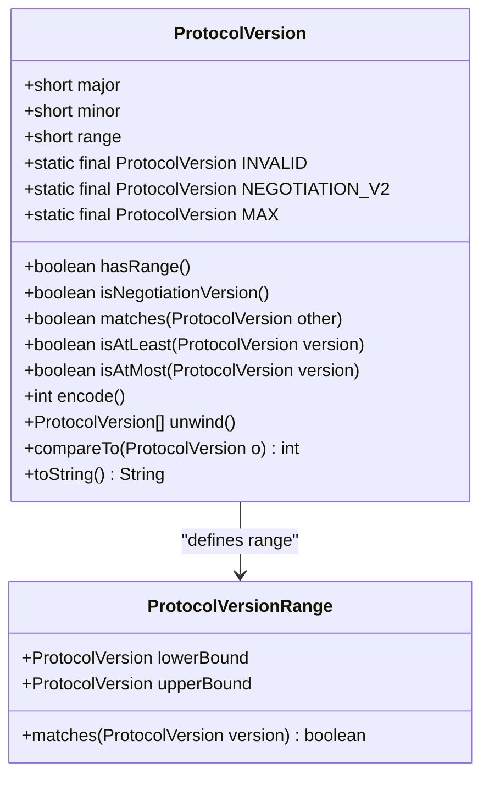
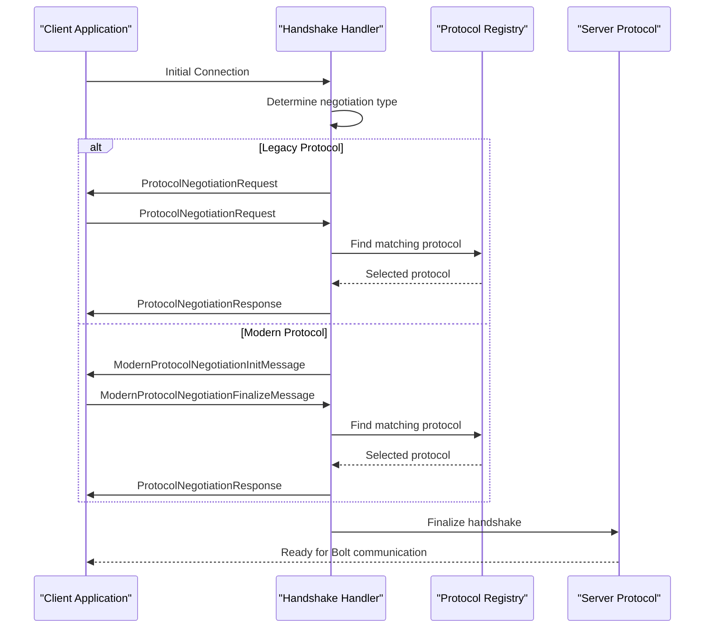
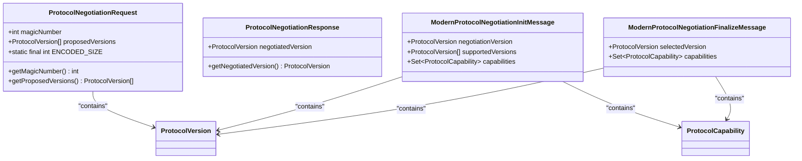
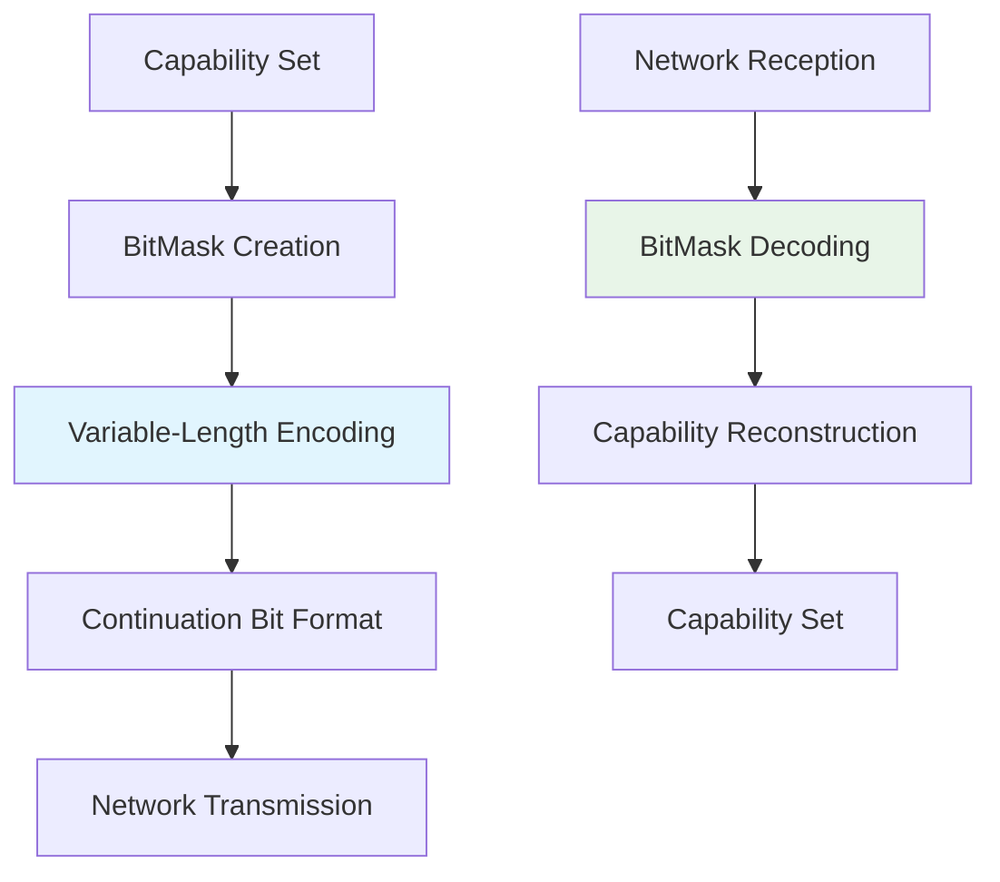
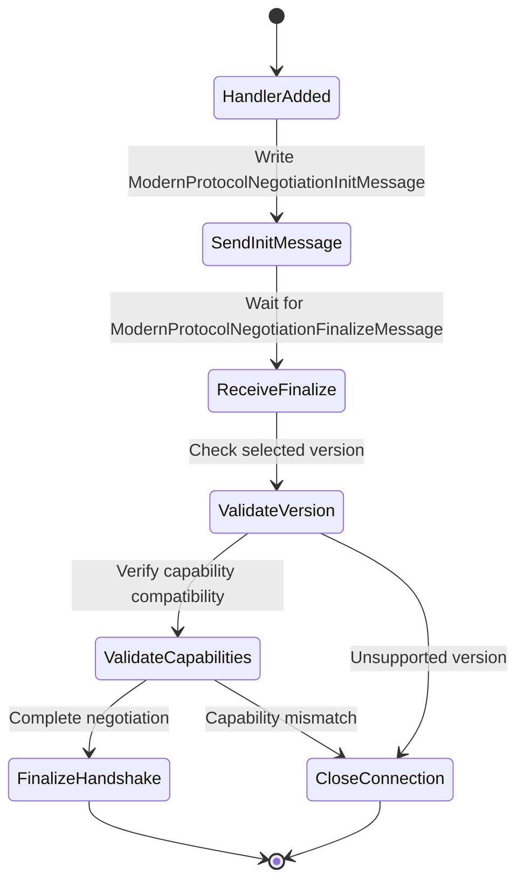
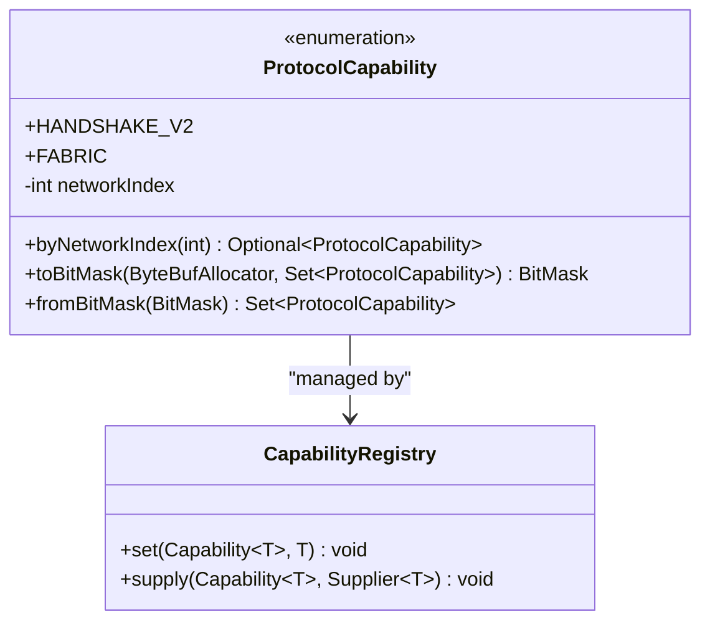
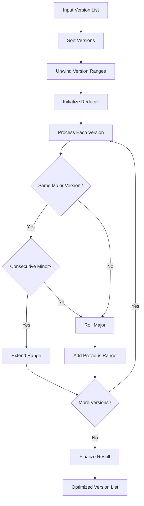
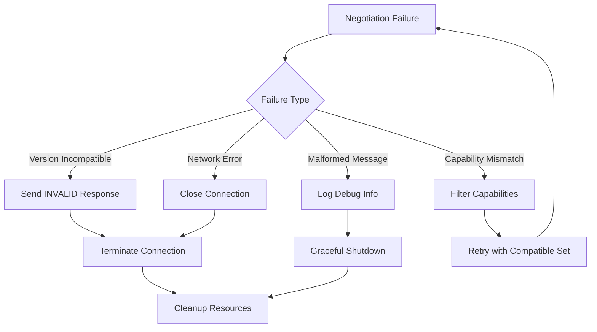

# Protocol Negotiation

<cite>
**Referenced Files in This Document**
- [ProtocolVersion.java](file://community/bolt/src/main/java/org/neo4j/bolt/negotiation/ProtocolVersion.java)
- [ProtocolNegotiationRequest.java](file://community/bolt/src/main/java/org/neo4j/bolt/negotiation/message/ProtocolNegotiationRequest.java)
- [ProtocolNegotiationResponse.java](file://community/bolt/src/main/java/org/neo4j/bolt/negotiation/message/ProtocolNegotiationResponse.java)
- [ModernProtocolNegotiationInitMessage.java](file://community/bolt/src/main/java/org/neo4j/bolt/negotiation/message/ModernProtocolNegotiationInitMessage.java)
- [ModernProtocolNegotiationFinalizeMessage.java](file://community/bolt/src/main/java/org/neo4j/bolt/negotiation/message/ModernProtocolNegotiationFinalizeMessage.java)
- [ProtocolCapability.java](file://community/bolt/src/main/java/org/neo4j/bolt/negotiation/message/ProtocolCapability.java)
- [ModernProtocolHandshakeHandler.java](file://community/bolt/src/main/java/org/neo4j/bolt/negotiation/handler/ModernProtocolHandshakeHandler.java)
- [LegacyProtocolHandshakeHandler.java](file://community/bolt/src/main/java/org/neo4j/bolt/negotiation/handler/LegacyProtocolHandshakeHandler.java)
- [ProtocolVersionReducer.java](file://community/bolt/src/main/java/org/neo4j/bolt/negotiation/ProtocolVersionReducer.java)
- [ProtocolNegotiationRequestDecoder.java](file://community/bolt/src/main/java/org/neo4j/bolt/negotiation/codec/ProtocolNegotiationRequestDecoder.java)
- [ProtocolNegotiationResponseEncoder.java](file://community/bolt/src/main/java/org/neo4j/bolt/negotiation/codec/ProtocolNegotiationResponseEncoder.java)
- [ModernProtocolNegotiationInitMessageEncoder.java](file://community/bolt/src/main/java/org/neo4j/bolt/negotiation/codec/ModernProtocolNegotiationInitMessageEncoder.java)
- [ModernProtocolNegotiationFinalizeMessageDecoder.java](file://community/bolt/src/main/java/org/neo4j/bolt/negotiation/codec/ModernProtocolNegotiationFinalizeMessageDecoder.java)
- [NegotiationEncodingUtil.java](file://community/bolt/src/main/java/org/neo4j/bolt/negotiation/util/NegotiationEncodingUtil.java)
- [BitMask.java](file://community/bolt/src/main/java/org/neo4j/bolt/negotiation/util/BitMask.java)
</cite>

## Table of Contents
1. [Introduction](#introduction)
2. [Protocol Version Model](#protocol-version-model)
3. [Negotiation Process Overview](#negotiation-process-overview)
4. [Domain Model Components](#domain-model-components)
5. [Binary Message Format](#binary-message-format)
6. [Handshake Implementation](#handshake-implementation)
7. [Capability System](#capability-system)
8. [Version Reduction and Optimization](#version-reduction-and-optimization)
9. [Common Issues and Solutions](#common-issues-and-solutions)
10. [Migration Strategies](#migration-strategies)
11. [Advanced Topics](#advanced-topics)
12. [Conclusion](#conclusion)

## Introduction

The Bolt Protocol's version negotiation mechanism is a sophisticated system that enables seamless communication between clients and servers by establishing mutual protocol compatibility. This system supports both legacy and modern negotiation protocols, ensuring backward compatibility while introducing advanced features for newer protocol versions.

The negotiation process involves several key components working together to discover, select, and validate protocol versions, along with negotiating supported capabilities. The system employs binary encoding for efficient network transmission and includes robust error handling for various failure scenarios.

## Protocol Version Model

### ProtocolVersion Record Structure

The [`ProtocolVersion`](file://community/bolt/src/main/java/org/neo4j/bolt/negotiation/ProtocolVersion.java) record serves as the fundamental building block for protocol version identification and comparison. It encapsulates three essential components:



**Diagram sources**
- [ProtocolVersion.java](file://community/bolt/src/main/java/org/neo4j/bolt/negotiation/ProtocolVersion.java#L26-L208)

### Version Encoding and Representation

Protocol versions are encoded using a compact 4-byte representation where:
- **Major version**: 8 bits (0-255)
- **Minor version**: 8 bits (0-255)  
- **Range parameter**: 8 bits (0-255)

The encoding follows the formula: `(major & 0xFF) ^ ((minor & 0xFF) << 8) ^ ((range & 0xFF) << 16)`

### Special Version Constants

The system defines several special protocol versions:
- **INVALID (0.0.0)**: Used for padding or indicating unsupported versions
- **NEGOTIATION_V2 (255.1.0)**: Marker for initiating modern handshake protocol
- **MAX (255.255.0)**: Maximum version for defining infinite upper bounds

**Section sources**
- [ProtocolVersion.java](file://community/bolt/src/main/java/org/neo4j/bolt/negotiation/ProtocolVersion.java#L36-L52)

## Negotiation Process Overview

### Two-Phase Negotiation Flow

The protocol negotiation follows a two-phase approach that accommodates both legacy and modern clients:



**Diagram sources**
- [LegacyProtocolHandshakeHandler.java](file://community/bolt/src/main/java/org/neo4j/bolt/negotiation/handler/LegacyProtocolHandshakeHandler.java#L54-L113)
- [ModernProtocolHandshakeHandler.java](file://community/bolt/src/main/java/org/neo4j/bolt/negotiation/handler/ModernProtocolHandshakeHandler.java#L65-L106)

### Version Matching Algorithm

The negotiation process implements a sophisticated version matching algorithm that considers:

1. **Exact matches**: Direct protocol version equality
2. **Range matches**: Versions falling within specified version ranges
3. **Priority ordering**: Client-specified preference order
4. **Capability compatibility**: Feature support validation

**Section sources**
- [LegacyProtocolHandshakeHandler.java](file://community/bolt/src/main/java/org/neo4j/bolt/negotiation/handler/LegacyProtocolHandshakeHandler.java#L67-L115)

## Domain Model Components

### Message Types and Their Roles

The negotiation system utilizes several specialized message types:



**Diagram sources**
- [ProtocolNegotiationRequest.java](file://community/bolt/src/main/java/org/neo4j/bolt/negotiation/message/ProtocolNegotiationRequest.java#L26-L67)
- [ModernProtocolNegotiationInitMessage.java](file://community/bolt/src/main/java/org/neo4j/bolt/negotiation/message/ModernProtocolNegotiationInitMessage.java#L26-L29)
- [ModernProtocolNegotiationFinalizeMessage.java](file://community/bolt/src/main/java/org/neo4j/bolt/negotiation/message/ModernProtocolNegotiationFinalizeMessage.java#L25-L26)

### Codec Classes for Binary Serialization

The system employs specialized codec classes for efficient binary serialization:

| Codec Class | Purpose | Direction | Key Features |
|-------------|---------|-----------|--------------|
| `ProtocolNegotiationRequestDecoder` | Decode client requests | Client → Server | Magic number validation, version parsing |
| `ProtocolNegotiationResponseEncoder` | Encode server responses | Server → Client | Version encoding, failure handling |
| `ModernProtocolNegotiationInitMessageEncoder` | Encode modern init messages | Server → Client | Version reduction, capability encoding |
| `ModernProtocolNegotiationFinalizeMessageDecoder` | Decode modern finalize messages | Client → Server | Range validation, capability parsing |

**Section sources**
- [ProtocolNegotiationRequestDecoder.java](file://community/bolt/src/main/java/org/neo4j/bolt/negotiation/codec/ProtocolNegotiationRequestDecoder.java#L40-L63)
- [ModernProtocolNegotiationInitMessageEncoder.java](file://community/bolt/src/main/java/org/neo4j/bolt/negotiation/codec/ModernProtocolNegotiationInitMessageEncoder.java#L38-L57)

## Binary Message Format

### Legacy Protocol Message Format

Legacy protocol messages use a fixed-size binary format:

```
+------------------+------------------+------------------+------------------+
| Magic Number (4B) | Version 1 (4B)   | Version 2 (4B)   | Version 3 (4B)   |
+------------------+------------------+------------------+------------------+
| Version 4 (4B)   | Reserved (4B)*   | Reserved (4B)*   | Reserved (4B)*   |
+------------------+------------------+------------------+------------------+

* Zero-filled for unused version slots
```

Each version field encodes as: `major ^ (minor << 8) ^ (range << 16)`

### Modern Protocol Message Format

Modern protocol messages employ variable-length encoding for efficiency:

```
+------------------+------------------+------------------+------------------+
| Negotiation Ver. | Version Count Var| Version 1 (4B)   | Version 2 (4B)   |
+------------------+------------------+------------------+------------------+
| Capability Mask  |                  |                  |                  |
+------------------+------------------+------------------+------------------+
```

The capability mask uses variable-length encoding with continuation bits.

### BitMask Encoding for Capabilities

The capability system uses a sophisticated bit masking approach:



**Diagram sources**
- [NegotiationEncodingUtil.java](file://community/bolt/src/main/java/org/neo4j/bolt/negotiation/util/NegotiationEncodingUtil.java#L27-L97)
- [BitMask.java](file://community/bolt/src/main/java/org/neo4j/bolt/negotiation/util/BitMask.java#L38-L210)

**Section sources**
- [NegotiationEncodingUtil.java](file://community/bolt/src/main/java/org/neo4j/bolt/negotiation/util/NegotiationEncodingUtil.java#L27-L97)

## Handshake Implementation

### Modern Protocol Handshake Handler

The [`ModernProtocolHandshakeHandler`](file://community/bolt/src/main/java/org/neo4j/bolt/negotiation/handler/ModernProtocolHandshakeHandler.java) manages the modern negotiation protocol:



**Diagram sources**
- [ModernProtocolHandshakeHandler.java](file://community/bolt/src/main/java/org/neo4j/bolt/negotiation/handler/ModernProtocolHandshakeHandler.java#L65-L106)

### Legacy Protocol Handshake Handler

The [`LegacyProtocolHandshakeHandler`](file://community/bolt/src/main/java/org/neo4j/bolt/negotiation/handler/LegacyProtocolHandshakeHandler.java) handles backward compatibility:

Key responsibilities include:
- Magic number validation (0x6060B017)
- Version proposal iteration
- Modern handshake detection
- Graceful fallback to modern protocol

**Section sources**
- [ModernProtocolHandshakeHandler.java](file://community/bolt/src/main/java/org/neo4j/bolt/negotiation/handler/ModernProtocolHandshakeHandler.java#L35-L115)
- [LegacyProtocolHandshakeHandler.java](file://community/bolt/src/main/java/org/neo4j/bolt/negotiation/handler/LegacyProtocolHandshakeHandler.java#L38-L149)

## Capability System

### ProtocolCapability Enumeration

The capability system defines extensible feature flags:



**Diagram sources**
- [ProtocolCapability.java](file://community/bolt/src/main/java/org/neo4j/bolt/negotiation/message/ProtocolCapability.java#L30-L125)

### Capability Encoding Process

Capabilities are encoded using a bit mask where each capability corresponds to a specific bit position:

| Capability | Network Index | Bit Position | Purpose |
|------------|---------------|--------------|---------|
| HANDSHAKE_V2 | -1 | Implicit | Indicates modern handshake support |
| FABRIC | 0x01 | Bit 0 | Fabric connector functionality |

**Section sources**
- [ProtocolCapability.java](file://community/bolt/src/main/java/org/neo4j/bolt/negotiation/message/ProtocolCapability.java#L30-L125)

## Version Reduction and Optimization

### ProtocolVersionReducer Algorithm

The [`ProtocolVersionReducer`](file://community/bolt/src/main/java/org/neo4j/bolt/negotiation/ProtocolVersionReducer.java) optimizes version lists by grouping consecutive versions:



**Diagram sources**
- [ProtocolVersionReducer.java](file://community/bolt/src/main/java/org/neo4j/bolt/negotiation/ProtocolVersionReducer.java#L26-L90)

### Optimization Benefits

The reduction algorithm provides several advantages:
- **Reduced bandwidth**: Consecutive versions are grouped into ranges
- **Improved readability**: Simplified version lists for debugging
- **Efficient encoding**: Smaller binary message sizes

**Section sources**
- [ProtocolVersionReducer.java](file://community/bolt/src/main/java/org/neo4j/bolt/negotiation/ProtocolVersionReducer.java#L33-L42)

## Common Issues and Solutions

### Version Incompatibility Scenarios

| Issue | Cause | Solution | Prevention |
|-------|-------|----------|------------|
| No matching versions | Client/server version mismatch | Log debug information, close connection | Version compatibility matrix |
| Invalid version range | Malformed range specification | Validate range parameters | Input validation |
| Capability mismatch | Unsupported feature requests | Filter capabilities, graceful degradation | Capability discovery |
| Protocol timeout | Network latency issues | Implement timeouts, retry logic | Connection health monitoring |

### Error Handling Patterns

The negotiation system implements comprehensive error handling:



### Migration Strategies

For clients transitioning from legacy to modern protocols:

1. **Gradual adoption**: Support both protocols simultaneously
2. **Feature detection**: Use capability negotiation for feature availability
3. **Fallback mechanisms**: Maintain compatibility with older server versions
4. **Progressive enhancement**: Add new features while preserving basic functionality

**Section sources**
- [LegacyProtocolHandshakeHandler.java](file://community/bolt/src/main/java/org/neo4j/bolt/negotiation/handler/LegacyProtocolHandshakeHandler.java#L57-L82)
- [ModernProtocolHandshakeHandler.java](file://community/bolt/src/main/java/org/neo4j/bolt/negotiation/handler/ModernProtocolHandshakeHandler.java#L67-L100)

## Advanced Topics

### Custom Protocol Extensions

The negotiation framework supports custom protocol extensions through:

1. **Capability registration**: Define new capability identifiers
2. **Version range support**: Implement custom version matching logic
3. **Codec customization**: Extend binary encoding for new message types
4. **Handler specialization**: Create custom handshake handlers

### Backward Compatibility Mechanisms

The system maintains backward compatibility through:

- **Dual protocol support**: Both legacy and modern protocols coexist
- **Graceful degradation**: Clients gracefully handle missing features
- **Version discovery**: Automatic protocol version detection
- **Capability negotiation**: Dynamic feature availability assessment

### Performance Optimizations

Several optimizations enhance negotiation performance:

- **Version reduction**: Minimize message size through intelligent grouping
- **Bitmask encoding**: Efficient capability representation
- **Memory management**: Proper resource cleanup and pooling
- **Streaming processing**: Handle large version lists efficiently

## Conclusion

The Bolt Protocol's version negotiation mechanism represents a sophisticated balance between backward compatibility and forward-looking innovation. Through its dual-protocol approach, comprehensive capability system, and efficient binary encoding, it enables seamless communication between diverse client-server combinations.

The system's modular design allows for easy extension and customization while maintaining robust error handling and performance optimization. Whether supporting legacy applications or enabling cutting-edge features, the negotiation framework provides the flexibility and reliability needed for production-grade database connectivity.

Understanding these mechanisms is crucial for developers working with Neo4j's Bolt protocol, as it forms the foundation for reliable and efficient database communication. The combination of legacy support and modern features ensures that applications can evolve while maintaining compatibility with existing infrastructure.