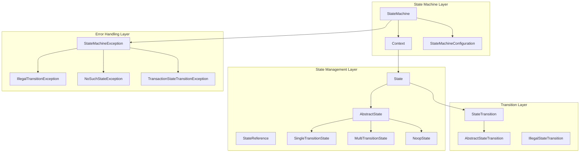
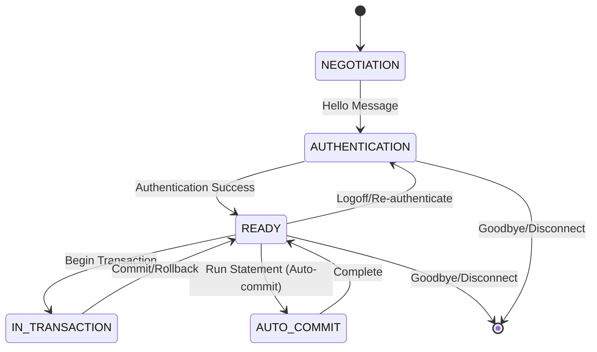
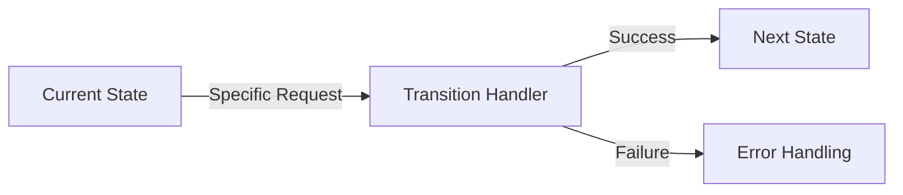
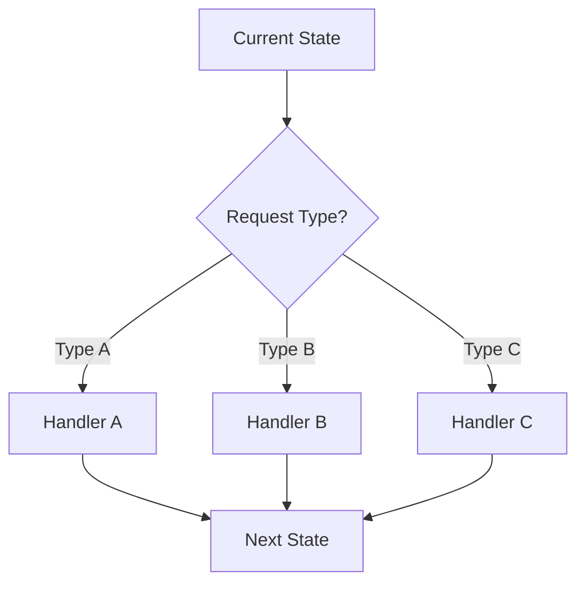
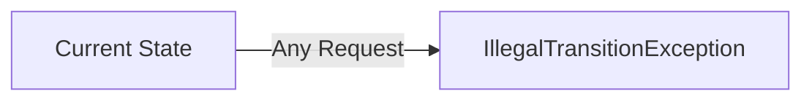
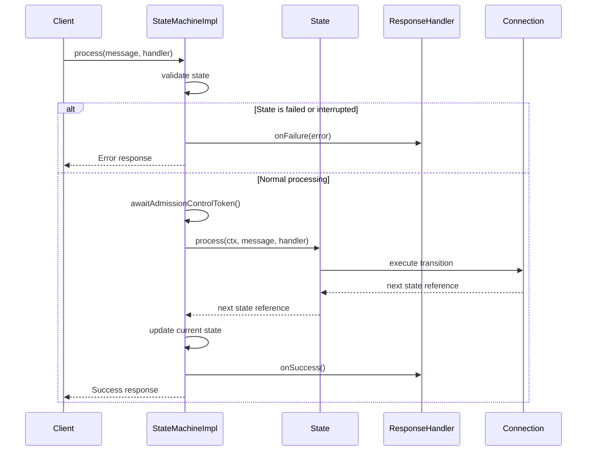
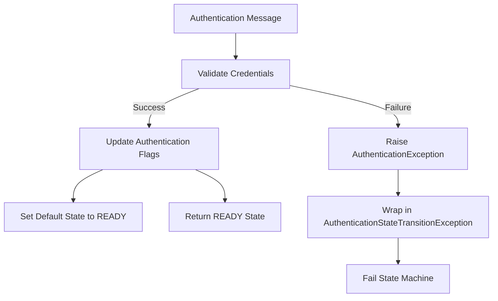
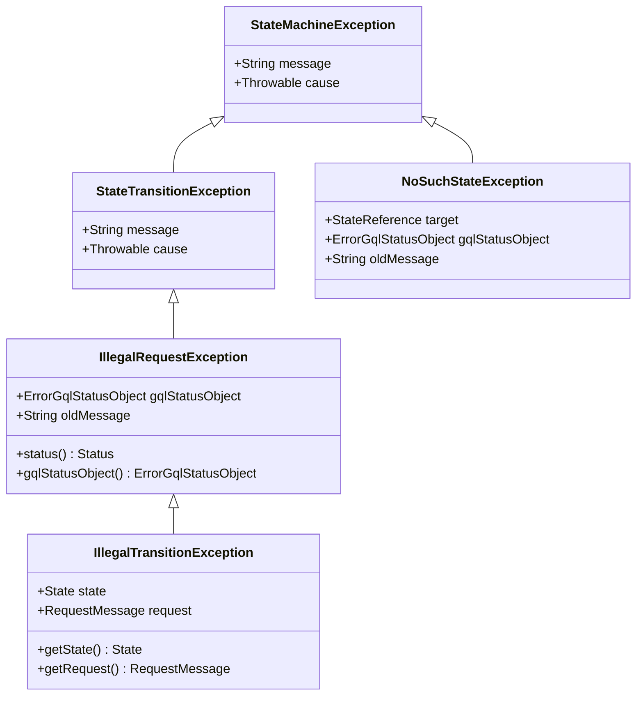
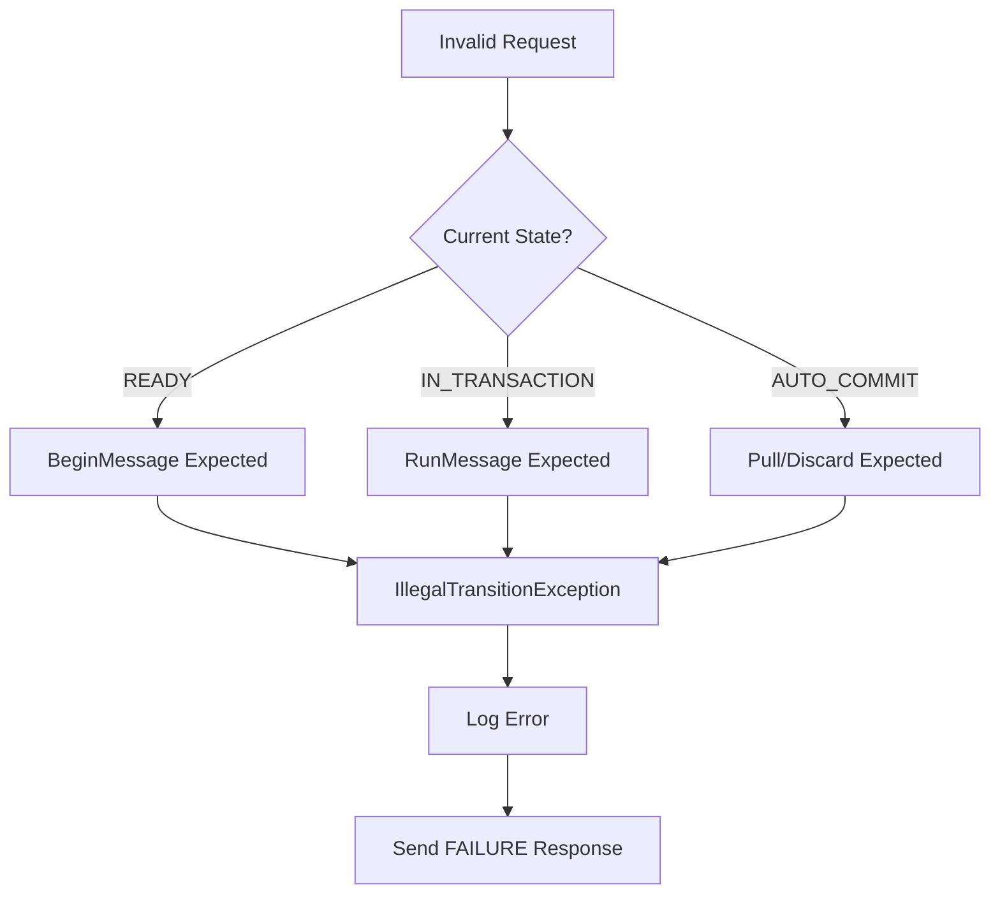

# State Machine Architecture

<cite>
**Referenced Files in This Document**
- [StateMachineImpl.java](file://community/bolt/src/main/java/org/neo4j/bolt/fsm/StateMachineImpl.java)
- [StateMachine.java](file://community/bolt/src/main/java/org/neo4j/bolt/fsm/StateMachine.java)
- [Context.java](file://community/bolt/src/main/java/org/neo4j/bolt/fsm/Context.java)
- [StateMachineConfiguration.java](file://community/bolt/src/main/java/org/neo4j/bolt/fsm/StateMachineConfiguration.java)
- [States.java](file://community/bolt/src/main/java/org/neo4j/bolt/protocol/common/fsm/States.java)
- [State.java](file://community/bolt/src/main/java/org/neo4j/bolt/fsm/state/State.java)
- [StateReference.java](file://community/bolt/src/main/java/org/neo4j/bolt/fsm/state/StateReference.java)
- [AbstractState.java](file://community/bolt/src/main/java/org/neo4j/bolt/fsm/state/AbstractState.java)
- [SingleTransitionState.java](file://community/bolt/src/main/java/org/neo4j/bolt/fsm/state/SingleTransitionState.java)
- [MultiTransitionState.java](file://community/bolt/src/main/java/org/neo4j/bolt/fsm/state/MultiTransitionState.java)
- [NoopState.java](file://community/bolt/src/main/java/org/neo4j/bolt/fsm/state/NoopState.java)
- [StateTransition.java](file://community/bolt/src/main/java/org/neo4j/bolt/fsm/state/transition/StateTransition.java)
- [IllegalTransitionException.java](file://community/bolt/src/main/java/org/neo4j/bolt/fsm/error/state/IllegalTransitionException.java)
- [NoSuchStateException.java](file://community/bolt/src/main/java/org/neo4j/bolt/fsm/error/NoSuchStateException.java)
- [AuthenticationStateTransition.java](file://community/bolt/src/main/java/org/neo4j/bolt/protocol/common/fsm/transition/authentication/AuthenticationStateTransition.java)
- [CreateTransactionStateTransition.java](file://community/bolt/src/main/java/org/neo4j/bolt/protocol/common/fsm/transition/ready/CreateTransactionStateTransition.java)
- [CreateAutocommitStatementStateTransition.java](file://community/bolt/src/main/java/org/neo4j/bolt/protocol/common/fsm/transition/ready/CreateAutocommitStatementStateTransition.java)
- [AutocommitDiscardStreamingStateTransition.java](file://community/bolt/src/main/java/org/neo4j/bolt/protocol/common/fsm/transition/transaction/streaming/AutocommitDiscardStreamingStateTransition.java)
- [AutocommitPullStreamingStateTransition.java](file://community/bolt/src/main/java/org/neo4j/bolt/protocol/common/fsm/transition/transaction/streaming/AutocommitPullStreamingStateTransition.java)
</cite>

## Table of Contents
1. [Introduction](#introduction)
2. [Architecture Overview](#architecture-overview)
3. [Core Components](#core-components)
4. [State Model and Transitions](#state-model-and-transitions)
5. [State Machine Implementation](#state-machine-implementation)
6. [State Transition Management](#state-transition-management)
7. [Error Handling and Recovery](#error-handling-and-recovery)
8. [Common Issues and Debugging](#common-issues-and-debugging)
9. [Customization and Extension](#customization-and-extension)
10. [Best Practices](#best-practices)

## Introduction

The Bolt Protocol's state machine architecture provides a robust framework for managing connection lifecycles, authentication, transaction management, and query execution. This finite state machine governs the progression of connections through distinct states, ensuring proper protocol compliance and handling various operational scenarios.

The state machine architecture is designed around three fundamental concepts: **State Machines**, **States**, and **Transitions**. Each connection maintains its own state machine instance that tracks its current position in the protocol lifecycle and handles incoming requests appropriately based on the current state.

## Architecture Overview

The state machine architecture follows a layered design pattern with clear separation of concerns:



**Diagram sources**
- [StateMachineImpl.java](file://community/bolt/src/main/java/org/neo4j/bolt/fsm/StateMachineImpl.java#L42-L210)
- [State.java](file://community/bolt/src/main/java/org/neo4j/bolt/fsm/state/State.java#L28-L113)
- [StateTransition.java](file://community/bolt/src/main/java/org/neo4j/bolt/fsm/state/transition/StateTransition.java#L34-L69)

## Core Components

### StateMachine Interface

The [`StateMachine`](file://community/bolt/src/main/java/org/neo4j/bolt/fsm/StateMachine.java#L38-L130) interface defines the contract for state machine instances:

- **Connection Management**: Tracks the underlying connection
- **State Tracking**: Monitors the current state and default state
- **Processing Control**: Handles request processing with error recovery
- **Lifecycle Management**: Supports reset, interrupt, and validation operations

### Context Interface

The [`Context`](file://community/bolt/src/main/java/org/neo4j/bolt/fsm/Context.java#L29-L39) interface extends StateMachine with configuration access, providing:

- **Configuration Access**: Reference to the state machine configuration
- **State Resolution**: Lookup and resolution of states
- **Response Handling**: Integration with response handlers

### StateReference

The [`StateReference`](file://community/bolt/src/main/java/org/neo4j/bolt/fsm/state/StateReference.java#L25-L27) provides immutable identifiers for states:

- **Unique Identification**: Immutable state names
- **Reference Management**: Efficient state lookup and comparison
- **Type Safety**: Compile-time verification of state references

**Section sources**
- [StateMachine.java](file://community/bolt/src/main/java/org/neo4j/bolt/fsm/StateMachine.java#L38-L130)
- [Context.java](file://community/bolt/src/main/java/org/neo4j/bolt/fsm/Context.java#L29-L39)
- [StateReference.java](file://community/bolt/src/main/java/org/neo4j/bolt/fsm/state/StateReference.java#L25-L27)

## State Model and Transitions

### Domain Model of States

The Bolt Protocol defines five primary states that represent different phases of connection lifecycle:



**Diagram sources**
- [States.java](file://community/bolt/src/main/java/org/neo4j/bolt/protocol/common/fsm/States.java#L27-L34)

### State Definitions

| State | Description | Key Operations |
|-------|-------------|----------------|
| **NEGOTIATION** | Initial protocol handshake and capability exchange | Protocol version negotiation, feature negotiation |
| **AUTHENTICATION** | User authentication and authorization | Authentication token processing, credential validation |
| **READY** | Connection established and ready for transactions | Transaction creation, statement execution |
| **IN_TRANSACTION** | Active transaction context | Query execution, transaction control |
| **AUTO_COMMIT** | Auto-commit transaction state | Statement execution with automatic commit |

### State Transition Patterns

The state machine implements several transition patterns:

#### Single Transition States
States with exactly one valid transition type, implemented by [`SingleTransitionState`](file://community/bolt/src/main/java/org/neo4j/bolt/fsm/state/SingleTransitionState.java#L29-L53):



#### Multi Transition States
States supporting multiple request types, implemented by [`MultiTransitionState`](file://community/bolt/src/main/java/org/neo4j/bolt/fsm/state/MultiTransitionState.java#L29-L55):



#### No-op States
States that reject all requests, implemented by [`NoopState`](file://community/bolt/src/main/java/org/neo4j/bolt/fsm/state/NoopState.java#L28-L44):



**Section sources**
- [States.java](file://community/bolt/src/main/java/org/neo4j/bolt/protocol/common/fsm/States.java#L27-L34)
- [SingleTransitionState.java](file://community/bolt/src/main/java/org/neo4j/bolt/fsm/state/SingleTransitionState.java#L29-L53)
- [MultiTransitionState.java](file://community/bolt/src/main/java/org/neo4j/bolt/fsm/state/MultiTransitionState.java#L29-L55)
- [NoopState.java](file://community/bolt/src/main/java/org/neo4j/bolt/fsm/state/NoopState.java#L28-L44)

## State Machine Implementation

### StateMachineImpl

The [`StateMachineImpl`](file://community/bolt/src/main/java/org/neo4j/bolt/fsm/StateMachineImpl.java#L42-L210) serves as the concrete implementation of the state machine:

#### Key Features

1. **State Tracking**: Maintains current and default states
2. **Error Management**: Handles failures and interruptions
3. **Admission Control**: Integrates with admission control service
4. **Logging**: Comprehensive logging for debugging and monitoring

#### State Processing Workflow



**Diagram sources**
- [StateMachineImpl.java](file://community/bolt/src/main/java/org/neo4j/bolt/fsm/StateMachineImpl.java#L139-L194)

#### Error Handling Mechanism

The state machine implements comprehensive error handling:

1. **Exception Capture**: Wraps all exceptions in structured error responses
2. **Logging Integration**: Logs detailed error information for debugging
3. **Connection Termination**: Determines when connections should be terminated
4. **State Reset**: Provides mechanisms to recover from errors

**Section sources**
- [StateMachineImpl.java](file://community/bolt/src/main/java/org/neo4j/bolt/fsm/StateMachineImpl.java#L42-L210)

## State Transition Management

### StateTransition Interface

The [`StateTransition`](file://community/bolt/src/main/java/org/neo4j/bolt/fsm/state/transition/StateTransition.java#L34-L69) interface defines the contract for state transitions:

#### Core Methods

- **requestType()**: Returns the accepted request message type
- **process()**: Executes the transition logic and returns the next state
- **andThen()**: Chains multiple transitions together

### Authentication Transition

The [`AuthenticationStateTransition`](file://community/bolt/src/main/java/org/neo4j/bolt/protocol/common/fsm/transition/authentication/AuthenticationStateTransition.java#L45-L76) demonstrates typical transition implementation:



**Diagram sources**
- [AuthenticationStateTransition.java](file://community/bolt/src/main/java/org/neo4j/bolt/protocol/common/fsm/transition/authentication/AuthenticationStateTransition.java#L56-L75)

### Transaction Creation Transition

The [`CreateTransactionStateTransition`](file://community/bolt/src/main/java/org/neo4j/bolt/protocol/common/fsm/transition/ready/CreateTransactionStateTransition.java#L50-L78) shows transaction management:

1. **Impersonation Handling**: Processes user impersonation requests
2. **Transaction Creation**: Establishes new transaction contexts
3. **Database Selection**: Handles database selection logic
4. **State Transition**: Moves to IN_TRANSACTION state

### Streaming Transitions

Streaming transitions manage result set consumption:

#### Pull Streaming
[`AutocommitPullStreamingStateTransition`](file://community/bolt/src/main/java/org/neo4j/bolt/protocol/common/fsm/transition/transaction/streaming/AutocommitPullStreamingStateTransition.java#L42-L46) consumes result sets:

```mermaid
flowchart LR
A[Pull Message] --> B[statement.consume(handler, n)]
B --> C[Stream Results to Client]
C --> D[Continue Streaming]
```

#### Discard Streaming
[`AutocommitDiscardStreamingStateTransition`](file://community/bolt/src/main/java/org/neo4j/bolt/protocol/common/fsm/transition/transaction/streaming/AutocommitDiscardStreamingStateTransition.java#L43-L46) discards result sets:

```mermaid
flowchart LR
A[Discard Message] --> B[statement.discard(handler, n)]
B --> C[Skip Remaining Results]
C --> D[Complete Operation]
```

**Section sources**
- [StateTransition.java](file://community/bolt/src/main/java/org/neo4j/bolt/fsm/state/transition/StateTransition.java#L34-L69)
- [AuthenticationStateTransition.java](file://community/bolt/src/main/java/org/neo4j/bolt/protocol/common/fsm/transition/authentication/AuthenticationStateTransition.java#L45-L76)
- [CreateTransactionStateTransition.java](file://community/bolt/src/main/java/org/neo4j/bolt/protocol/common/fsm/transition/ready/CreateTransactionStateTransition.java#L50-L78)
- [AutocommitPullStreamingStateTransition.java](file://community/bolt/src/main/java/org/neo4j/bolt/protocol/common/fsm/transition/transaction/streaming/AutocommitPullStreamingStateTransition.java#L42-L46)
- [AutocommitDiscardStreamingStateTransition.java](file://community/bolt/src/main/java/org/neo4j/bolt/protocol/common/fsm/transition/transaction/streaming/AutocommitDiscardStreamingStateTransition.java#L43-L46)

## Error Handling and Recovery

### Exception Hierarchy

The state machine implements a comprehensive exception hierarchy:



**Diagram sources**
- [IllegalTransitionException.java](file://community/bolt/src/main/java/org/neo4j/bolt/fsm/error/state/IllegalTransitionException.java#L34-L97)
- [NoSuchStateException.java](file://community/bolt/src/main/java/org/neo4j/bolt/fsm/error/NoSuchStateException.java#L36-L67)

### Common Error Scenarios

#### Invalid State Transitions

When clients send inappropriate messages for the current state:



#### Missing States

When state machine configuration references non-existent states:

[`NoSuchStateException`](file://community/bolt/src/main/java/org/neo4j/bolt/fsm/error/NoSuchStateException.java#L58-L62) handles missing state references with detailed error messages.

#### Transaction Failures

Transaction-related failures are wrapped in specialized exceptions:

- **TransactionStateTransitionException**: Base class for transaction errors
- **StatusTransactionStateTransitionException**: Includes status information
- **AuthenticationStateTransitionException**: Authentication-specific errors

### Recovery Strategies

#### Automatic Recovery

1. **State Reset**: [`reset()`](file://community/bolt/src/main/java/org/neo4j/bolt/fsm/StateMachineImpl.java#L118-L122) method restores to default state
2. **Interrupt Handling**: [`interrupt()`](file://community/bolt/src/main/java/org/neo4j/bolt/fsm/StateMachineImpl.java#L113-L115) method stops processing
3. **Validation**: [`validate()`](file://community/bolt/src/main/java/org/neo4j/bolt/fsm/StateMachineImpl.java#L126-L136) ensures state consistency

#### Manual Recovery

1. **Connection Termination**: Graceful shutdown of problematic connections
2. **State Inspection**: Debugging state machine configurations
3. **Logging Analysis**: Investigating error patterns

**Section sources**
- [IllegalTransitionException.java](file://community/bolt/src/main/java/org/neo4j/bolt/fsm/error/state/IllegalTransitionException.java#L34-L97)
- [NoSuchStateException.java](file://community/bolt/src/main/java/org/neo4j/bolt/fsm/error/NoSuchStateException.java#L36-L67)
- [StateMachineImpl.java](file://community/bolt/src/main/java/org/neo4j/bolt/fsm/StateMachineImpl.java#L118-L136)

## Common Issues and Debugging

### Invalid State Transitions

**Problem**: Clients sending inappropriate messages for current state

**Symptoms**:
- `IllegalTransitionException` in logs
- `FAILURE` responses with "invalid state" message
- Connection appears stuck in current state

**Debugging Steps**:
1. Check current state using [`state()`](file://community/bolt/src/main/java/org/neo4j/bolt/fsm/StateMachineImpl.java#L83-L85)
2. Review request message type and expected transitions
3. Verify client-side state management

**Solution**: Implement proper client-side state tracking and validation.

### Protocol Violations

**Problem**: Breaking protocol sequence requirements

**Symptoms**:
- Unexpected state machine failures
- Authentication bypass attempts
- Transaction state corruption

**Debugging Steps**:
1. Enable detailed logging for state transitions
2. Monitor admission control tokens
3. Check connection validation status

**Solution**: Implement comprehensive protocol validation and error recovery.

### Connection State Corruption

**Problem**: State machine entering inconsistent states

**Symptoms**:
- Persistent error responses
- Memory leaks in streaming states
- Transaction timeouts

**Debugging Steps**:
1. Monitor state machine lifecycle
2. Check for unhandled exceptions
3. Review streaming state cleanup

**Solution**: Implement proper resource cleanup and state validation.

### Performance Issues

**Problem**: Slow state transitions affecting throughput

**Symptoms**:
- High latency in response times
- Timeout errors
- Resource exhaustion

**Debugging Steps**:
1. Profile state transition execution times
2. Monitor admission control delays
3. Check database transaction performance

**Solution**: Optimize transition handlers and implement caching where appropriate.

## Customization and Extension

### Creating Custom States

To add new states to the state machine:

1. **Define State Reference**: Add to [`States`](file://community/bolt/src/main/java/org/neo4j/bolt/protocol/common/fsm/States.java#L27-L34) class
2. **Implement State Logic**: Create state implementation classes
3. **Configure Transitions**: Define valid transitions from/to new state
4. **Register with Configuration**: Update state machine factory

### Extending State Transitions

Custom transition implementations should:

1. **Extend AbstractStateTransition**: Provide base functionality
2. **Handle Specific Requests**: Implement request-specific logic
3. **Manage Side Effects**: Handle transaction and connection state changes
4. **Provide Error Handling**: Wrap exceptions appropriately

### State Machine Configuration

Custom state machine configurations can be created by:

1. **Using StateMachineConfiguration.Factory**: Build state machines programmatically
2. **Defining Initial States**: Specify startup behavior
3. **Registering Transitions**: Add custom transition handlers
4. **Integrating Services**: Connect with external systems

**Section sources**
- [States.java](file://community/bolt/src/main/java/org/neo4j/bolt/protocol/common/fsm/States.java#L27-L34)
- [StateTransition.java](file://community/bolt/src/main/java/org/neo4j/bolt/fsm/state/transition/StateTransition.java#L34-L69)

## Best Practices

### State Machine Design

1. **Single Responsibility**: Each state should handle one aspect of the protocol
2. **Clear Transitions**: Define explicit valid transition paths
3. **Error Boundaries**: Implement comprehensive error handling
4. **Resource Management**: Properly clean up resources in all states

### Transition Implementation

1. **Idempotency**: Ensure transitions can be safely retried
2. **Validation**: Validate requests before processing
3. **Logging**: Provide detailed logging for debugging
4. **Performance**: Minimize processing overhead in transitions

### Error Handling

1. **Graceful Degradation**: Handle errors without crashing
2. **Meaningful Messages**: Provide helpful error information
3. **Recovery Options**: Offer clear recovery paths
4. **Monitoring**: Track error patterns and frequencies

### Testing and Validation

1. **State Coverage**: Test all valid state transitions
2. **Error Scenarios**: Validate error handling behavior
3. **Concurrency**: Test thread safety and race conditions
4. **Performance**: Validate under load conditions

The Bolt Protocol's state machine architecture provides a robust foundation for managing complex connection lifecycles while maintaining protocol compliance and handling various operational scenarios gracefully. Understanding these patterns and implementing them correctly ensures reliable and maintainable protocol implementations.