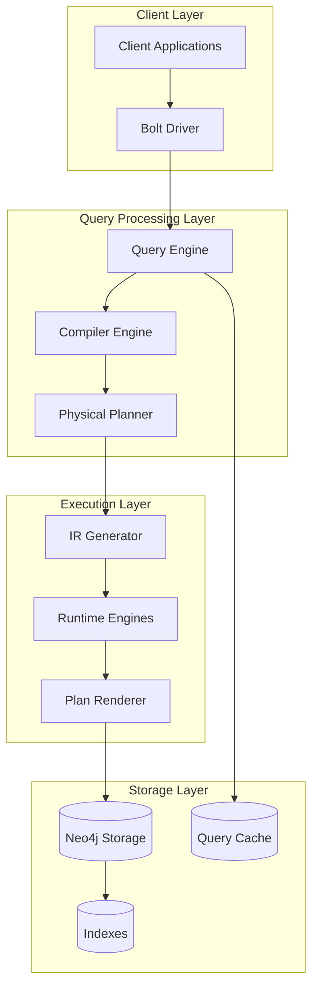
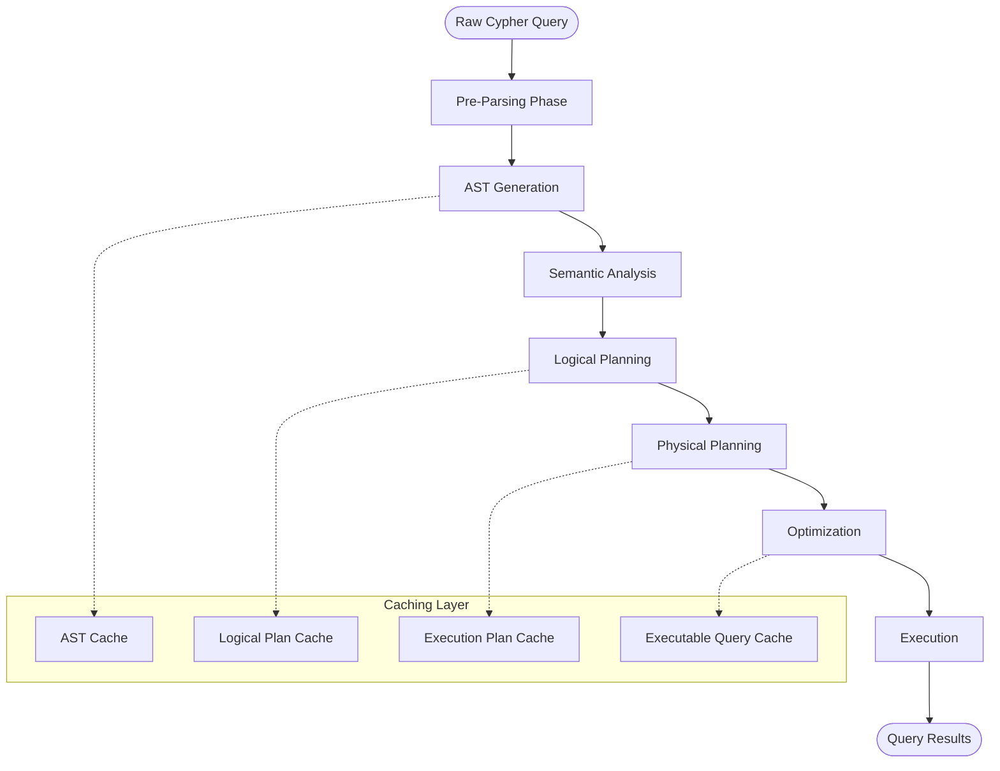
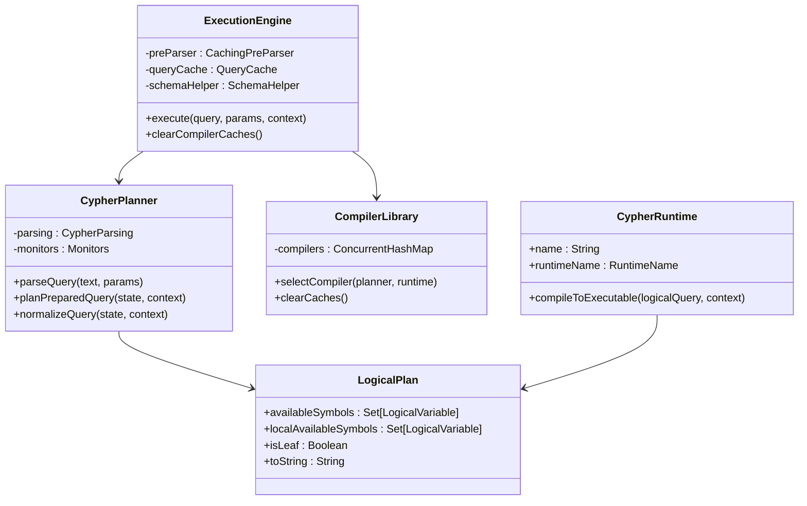
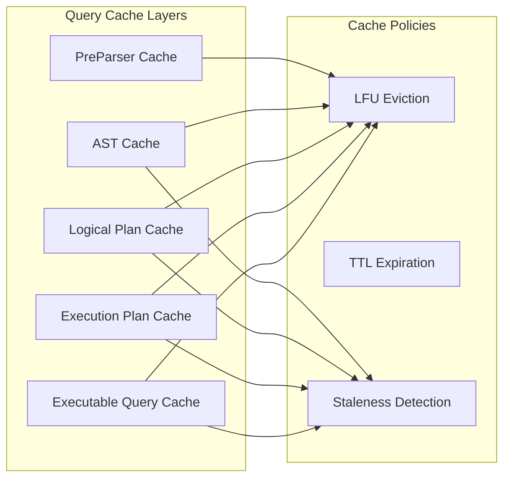
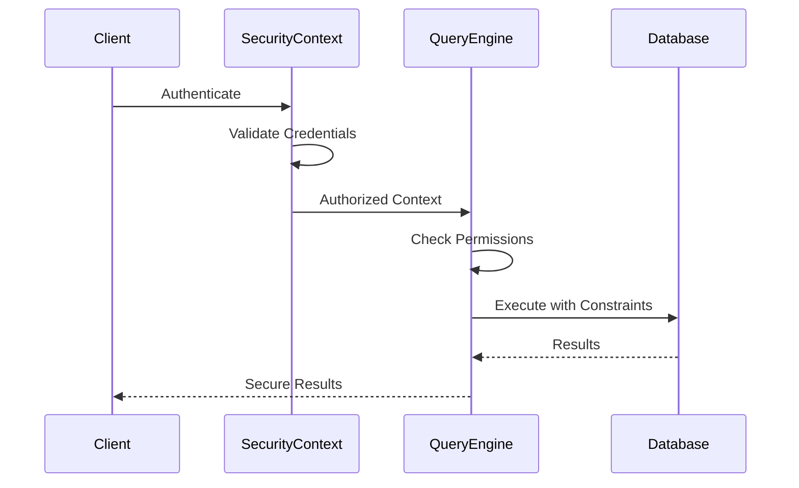
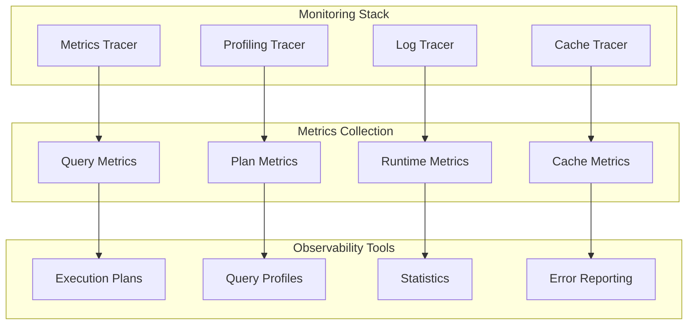
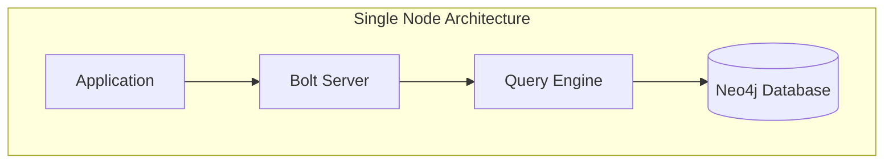
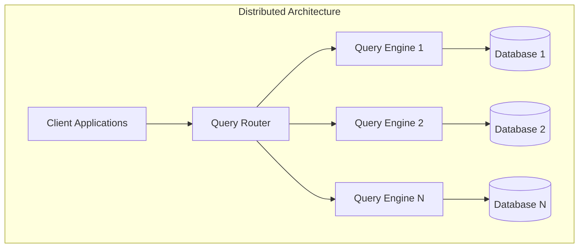

# Cypher Query Engine

<cite>
**Referenced Files in This Document**
- [pom.xml](file://community/cypher/pom.xml)
- [ExecutionEngine.scala](file://community/cypher/cypher/src/main/scala/org/neo4j/cypher/internal/ExecutionEngine.scala)
- [CypherPlanner.scala](file://community/cypher/cypher-planner/src/main/scala/org/neo4j/cypher/internal/compiler/CypherPlanner.scala)
- [Phases.scala](file://community/cypher/front-end/frontend/src/main/scala/org/neo4j/cypher/internal/frontend/Phases.scala)
- [LogicalPlan.scala](file://community/cypher/cypher-logical-plans/src/main/scala/org/neo4j/cypher/internal/logical/plans/LogicalPlan.scala)
- [CompilationPhases.scala](file://community/cypher/cypher-planner/src/main/scala/org/neo4j/cypher/internal/compiler/phases/CompilationPhases.scala)
- [LFUCache.scala](file://community/cypher/cypher-cache/src/main/scala/org/neo4j/cypher/internal/cache/LFUCache.scala)
- [CompilerLibrary.scala](file://community/cypher/cypher/src/main/scala/org/neo4j/cypher/internal/CompilerLibrary.scala)
- [SecurityContext.java](file://community/kernel-api/src/main/java/org/neo4j/internal/kernel/api/security/SecurityContext.java)
- [QueryController.java](file://community/server/src/main/java/org/neo4j/server/queryapi/QueryController.java)
- [ProfilingTracer.java](file://community/cypher/runtime-util/src/main/java/org/neo4j/cypher/internal/profiling/ProfilingTracer.java)
- [CommunityQueryRouterBootstrap.java](file://community/fabric/query-router/src/main/java/org/neo4j/router/CommunityQueryRouterBootstrap.java)
- [QueryCache.scala](file://community/cypher/cypher/src/main/scala/org/neo4j/cypher/internal/QueryCache.scala)
- [CypherQueryOptions.scala](file://community/cypher/cypher-config/src/main/scala/org/neo4j/cypher/internal/options/CypherQueryOptions.scala)
- [Group.java](file://community/common/src/main/java/org/neo4j/scheduler/Group.java)
</cite>

## Table of Contents
1. [Introduction](#introduction)
2. [System Architecture Overview](#system-architecture-overview)
3. [Query Processing Pipeline](#query-processing-pipeline)
4. [Component Architecture](#component-architecture)
5. [Caching and Performance](#caching-and-performance)
6. [Security and Permissions](#security-and-permissions)
7. [Monitoring and Observability](#monitoring-and-observability)
8. [Deployment Topology](#deployment-topology)
9. [Scalability Considerations](#scalability-considerations)
10. [Technical Decisions](#technical-decisions)
11. [Cross-Cutting Concerns](#cross-cutting-concerns)
12. [Conclusion](#conclusion)

## Introduction

The Neo4j Cypher Query Engine represents a sophisticated, modular system designed to process Cypher queries efficiently and securely. Built primarily in Scala with strategic Java components, the engine implements a multi-phase compilation pipeline that transforms human-readable Cypher queries into optimized execution plans capable of handling complex graph traversals and analytical workloads.

The engine's architecture emphasizes separation of concerns through distinct phases: parsing, logical planning, physical planning, and execution. This modular design enables efficient caching, parallel execution capabilities, and comprehensive monitoring while maintaining strong security boundaries and performance guarantees.

## System Architecture Overview

The Cypher Query Engine follows a layered architecture with clear separation between query compilation and execution phases. The system is designed to handle both interactive queries and batch processing workloads with varying complexity requirements.



**Diagram sources**
- [ExecutionEngine.scala](file://community/cypher/cypher/src/main/scala/org/neo4j/cypher/internal/ExecutionEngine.scala#L66-L75)
- [CypherPlanner.scala](file://community/cypher/cypher-planner/src/main/scala/org/neo4j/cypher/internal/compiler/CypherPlanner.scala#L71-L80)

**Section sources**
- [pom.xml](file://community/cypher/pom.xml#L33-L54)
- [ExecutionEngine.scala](file://community/cypher/cypher/src/main/scala/org/neo4j/cypher/internal/ExecutionEngine.scala#L66-L75)

## Query Processing Pipeline

The Cypher Query Engine implements a sophisticated multi-phase compilation pipeline that transforms raw Cypher queries through several distinct stages, each with specific responsibilities and optimization opportunities.

### Pipeline Phases



**Diagram sources**
- [CompilationPhases.scala](file://community/cypher/cypher-planner/src/main/scala/org/neo4j/cypher/internal/compiler/phases/CompilationPhases.scala#L112-L174)
- [QueryCache.scala](file://community/cypher/cypher/src/main/scala/org/neo4j/cypher/internal/QueryCache.scala#L261-L542)

### Phase Details

#### 1. Pre-Parsing Phase
The pre-parsing phase extracts query options and prepares the query for full parsing. This includes:
- Query option extraction (planner, runtime, execution mode)
- Parameter type inference
- Syntax validation
- Query routing preparation

#### 2. AST Generation Phase
The Abstract Syntax Tree generation transforms the query text into a structured representation:
- Tokenization and lexical analysis
- Syntactic validation
- AST construction with semantic annotations
- Query structure normalization

#### 3. Semantic Analysis Phase
Semantic analysis validates query semantics and prepares for planning:
- Type checking and resolution
- Variable binding and scoping
- Constraint validation
- Permission verification

#### 4. Logical Planning Phase
Logical planning generates an abstract query plan:
- Query graph construction
- Join ordering decisions
- Index selection
- Predicate pushdown optimization

#### 5. Physical Planning Phase
Physical planning converts logical plans to executable plans:
- Operator selection
- Distribution strategy
- Parallelization decisions
- Resource allocation

**Section sources**
- [CompilationPhases.scala](file://community/cypher/cypher-planner/src/main/scala/org/neo4j/cypher/internal/compiler/phases/CompilationPhases.scala#L112-L174)
- [Phases.scala](file://community/cypher/front-end/frontend/src/main/scala/org/neo4j/cypher/internal/frontend/Phases.scala)

## Component Architecture

The Cypher Query Engine consists of several interconnected components, each responsible for specific aspects of query processing.

### Core Components



**Diagram sources**
- [ExecutionEngine.scala](file://community/cypher/cypher/src/main/scala/org/neo4j/cypher/internal/ExecutionEngine.scala#L66-L75)
- [CypherPlanner.scala](file://community/cypher/cypher-planner/src/main/scala/org/neo4j/cypher/internal/compiler/CypherPlanner.scala#L71-L80)
- [CompilerLibrary.scala](file://community/cypher/cypher/src/main/scala/org/neo4j/cypher/internal/CompilerLibrary.scala#L38-L42)
- [LogicalPlan.scala](file://community/cypher/cypher-logical-plans/src/main/scala/org/neo4j/cypher/internal/logical/plans/LogicalPlan.scala#L152-L162)

### Component Interactions

The components interact through well-defined interfaces and protocols:

1. **Execution Engine** serves as the primary entry point, coordinating query execution
2. **Cypher Planner** handles query compilation from AST to logical plan
3. **Compiler Library** manages different compiler configurations and caching
4. **Logical Plan** represents the abstract query structure for optimization
5. **Runtime Engines** execute the optimized plans against the storage layer

**Section sources**
- [ExecutionEngine.scala](file://community/cypher/cypher/src/main/scala/org/neo4j/cypher/internal/ExecutionEngine.scala#L66-L200)
- [CypherPlanner.scala](file://community/cypher/cypher-planner/src/main/scala/org/neo4j/cypher/internal/compiler/CypherPlanner.scala#L71-L130)
- [CompilerLibrary.scala](file://community/cypher/cypher/src/main/scala/org/neo4j/cypher/internal/CompilerLibrary.scala#L38-L96)

## Caching and Performance

The Cypher Query Engine implements a multi-layered caching strategy to optimize performance and reduce computational overhead for repeated queries.

### Cache Architecture



**Diagram sources**
- [LFUCache.scala](file://community/cypher/cypher-cache/src/main/scala/org/neo4j/cypher/internal/cache/LFUCache.scala#L31-L45)
- [QueryCache.scala](file://community/cypher/cypher/src/main/scala/org/neo4j/cypher/internal/QueryCache.scala#L529-L572)

### Cache Types and Purposes

| Cache Layer | Purpose | Key Features |
|-------------|---------|--------------|
| PreParser Cache | Query option extraction | Fast query preprocessing |
| AST Cache | Abstract syntax trees | Prevents redundant parsing |
| Logical Plan Cache | Query plans | Optimizes planning phase |
| Execution Plan Cache | Physical execution plans | Reduces compilation overhead |
| Executable Query Cache | Complete query objects | Full query lifecycle caching |

### Performance Optimization Strategies

1. **Query Compilation Caching**: Prevents repeated compilation of identical queries
2. **Staleness Detection**: Automatic cache invalidation based on schema changes
3. **Parameter Type Caching**: Optimizes parameter handling for similar queries
4. **Expression Code Generation**: JIT compilation for frequently executed queries
5. **Parallel Execution Planning**: Distributes work across available resources

**Section sources**
- [LFUCache.scala](file://community/cypher/cypher-cache/src/main/scala/org/neo4j/cypher/internal/cache/LFUCache.scala#L31-L85)
- [QueryCache.scala](file://community/cypher/cypher/src/main/scala/org/neo4j/cypher/internal/QueryCache.scala#L261-L542)

## Security and Permissions

The Cypher Query Engine implements comprehensive security measures to ensure safe query execution and proper access control.

### Security Architecture



**Diagram sources**
- [SecurityContext.java](file://community/kernel-api/src/main/java/org/neo4j/internal/kernel/api/security/SecurityContext.java#L71-L136)
- [QueryController.java](file://community/server/src/main/java/org/neo4j/server/queryapi/QueryController.java#L58-L198)

### Security Features

1. **Authentication and Authorization**: Multi-factor authentication with role-based access control
2. **Query Permission Checking**: Runtime permission verification for each query operation
3. **Parameter Sanitization**: Protection against injection attacks through parameterized queries
4. **Resource Limits**: Query timeout and resource consumption limits
5. **Audit Logging**: Comprehensive logging of security-relevant events

### Parameterized Queries

The engine strongly encourages parameterized queries to prevent SQL injection and improve caching efficiency:

```scala
// Example of secure parameterized query execution
val params = MapValue.of(Map("userId" -> Values.stringValue("user123")))
val query = "MATCH (u:User {id: $userId}) RETURN u.name"
engine.execute(query, params, context, profile = false, prePopulate = false, subscriber)
```

**Section sources**
- [SecurityContext.java](file://community/kernel-api/src/main/java/org/neo4j/internal/kernel/api/security/SecurityContext.java#L71-L136)
- [QueryController.java](file://community/server/src/main/java/org/neo4j/server/queryapi/QueryController.java#L58-L198)

## Monitoring and Observability

The Cypher Query Engine provides comprehensive monitoring and observability features to track performance, diagnose issues, and optimize query execution.

### Monitoring Architecture



**Diagram sources**
- [ProfilingTracer.java](file://community/cypher/runtime-util/src/main/java/org/neo4j/cypher/internal/profiling/ProfilingTracer.java#L80-L191)

### Key Monitoring Features

1. **Query Performance Metrics**: Execution time, memory usage, I/O operations
2. **Plan Analysis**: Detailed execution plan visualization and optimization suggestions
3. **Cache Performance**: Hit rates, eviction patterns, memory utilization
4. **Error Tracking**: Comprehensive error reporting and diagnostic information
5. **Resource Utilization**: CPU, memory, and disk usage monitoring

### Query Profiling

The engine provides detailed query profiling capabilities:

```scala
// Enable profiling for detailed performance analysis
val profileResult = engine.execute(query, params, context, profile = true, ...)
// Access detailed execution statistics
val executionPlan = profileResult.executionPlanDescription()
val queryProfile = profileResult.queryProfile()
```

**Section sources**
- [ProfilingTracer.java](file://community/cypher/runtime-util/src/main/java/org/neo4j/cypher/internal/profiling/ProfilingTracer.java#L80-L191)

## Deployment Topology

The Cypher Query Engine supports various deployment topologies to accommodate different workload patterns and scaling requirements.

### Single Instance Deployment



### Distributed Query Router Architecture



**Diagram sources**
- [CommunityQueryRouterBootstrap.java](file://community/fabric/query-router/src/main/java/org/neo4j/router/CommunityQueryRouterBootstrap.java#L150-L227)

### Infrastructure Requirements

| Component | Minimum | Recommended | Maximum |
|-----------|---------|-------------|---------|
| CPU Cores | 4 | 16+ | 64+ |
| Memory | 8GB | 32GB+ | 256GB+ |
| Storage | 100GB SSD | 500GB+ SSD | 10TB+ NVMe |
| Network | Gigabit | 10GbE | 100GbE |

**Section sources**
- [CommunityQueryRouterBootstrap.java](file://community/fabric/query-router/src/main/java/org/neo4j/router/CommunityQueryRouterBootstrap.java#L150-L227)

## Scalability Considerations

The Cypher Query Engine is designed to scale horizontally and vertically to handle increasing query loads and data volumes.

### Horizontal Scaling Strategies

1. **Query Router Distribution**: Distribute queries across multiple query engines
2. **Database Sharding**: Partition data across multiple database instances
3. **Read Replica Support**: Offload read queries to replica databases
4. **Query Federation**: Combine results from multiple database sources

### Vertical Scaling Optimizations

1. **Memory Management**: Efficient memory allocation and garbage collection
2. **CPU Utilization**: Parallel query execution and multi-threading
3. **I/O Optimization**: Asynchronous I/O and batching strategies
4. **Cache Efficiency**: Multi-level caching with intelligent eviction policies

### Performance Tuning Parameters

| Parameter | Description | Impact |
|-----------|-------------|--------|
| `cypher_query_cache_size` | Query result cache size | Memory vs. performance trade-off |
| `cypher_planner_version` | Planner algorithm version | Planning quality vs. planning time |
| `cypher_runtime` | Execution runtime choice | Performance vs. compatibility |
| `cypher_expression_engine` | Expression compilation mode | Compilation overhead vs. execution speed |

**Section sources**
- [CypherQueryOptions.scala](file://community/cypher/cypher-config/src/main/scala/org/neo4j/cypher/internal/options/CypherQueryOptions.scala#L38-L55)
- [Group.java](file://community/common/src/main/java/org/neo4j/scheduler/Group.java#L78-L169)

## Technical Decisions

### Language Choice: Scala with Java Components

The Cypher Query Engine predominantly uses Scala for several strategic reasons:

1. **Functional Programming Support**: Scala's functional programming features enable elegant expression of query transformations and optimizations
2. **Type Safety**: Strong type system helps catch errors early in the development cycle
3. **Concurrency Support**: Scala's actor model and futures provide robust concurrency primitives
4. **Interoperability**: Java interoperability allows leveraging existing Java libraries and frameworks

### Modular Architecture Benefits

The modular design provides several advantages:

1. **Separation of Concerns**: Each module has a single responsibility, improving maintainability
2. **Testability**: Isolated modules can be tested independently
3. **Extensibility**: New planners, runtimes, and optimizers can be added without affecting core components
4. **Caching Efficiency**: Different cache layers can be optimized for their specific use cases

### Declarative Query Language Approach

The choice of Cypher as a declarative query language offers:

1. **Expressiveness**: Natural representation of graph traversal patterns
2. **Optimization Opportunities**: The engine can choose optimal execution strategies
3. **Readability**: Queries are easier to understand and maintain
4. **Portability**: Similar syntax across different graph databases

**Section sources**
- [pom.xml](file://community/cypher/pom.xml#L33-L54)
- [ExecutionEngine.scala](file://community/cypher/cypher/src/main/scala/org/neo4j/cypher/internal/ExecutionEngine.scala#L63-L65)

## Cross-Cutting Concerns

### Query Cancellation and Timeouts

The engine implements comprehensive timeout and cancellation mechanisms:

```scala
// Query timeout handling
val cancellationChecker = new CancellationChecker {
  override def isCancelled: Boolean = {
    // Check if query should be terminated
    // Based on configured timeout or external signals
  }
}

// Graceful query termination
engine.execute(query, params, context, profile = false, prePopulate = false, subscriber) match {
  case execution if cancellationChecker.isCancelled =>
    execution.terminate()
    throw new QueryTerminatedException("Query cancelled")
}
```

### Disaster Recovery

1. **Query State Persistence**: Ability to checkpoint query execution state
2. **Graceful Degradation**: Fallback mechanisms for resource exhaustion
3. **Error Recovery**: Automatic retry and circuit breaker patterns
4. **Backup and Restore**: Query result caching for quick recovery

### Resource Management

1. **Memory Management**: Automatic memory tracking and limits
2. **Thread Pool Management**: Configurable thread pools for different workloads
3. **Connection Pooling**: Efficient database connection management
4. **Garbage Collection Tuning**: Optimized GC settings for query workloads

**Section sources**
- [QueryCache.scala](file://community/cypher/cypher/src/main/scala/org/neo4j/cypher/internal/QueryCache.scala#L353-L400)

## Conclusion

The Neo4j Cypher Query Engine represents a sophisticated, scalable solution for graph query processing. Its modular architecture, comprehensive caching strategy, and robust security model make it suitable for production environments handling complex graph analytics workloads.

Key strengths of the system include:

- **Modular Design**: Clear separation of concerns enables maintainability and extensibility
- **Performance Optimization**: Multi-layered caching and intelligent optimization strategies
- **Security Focus**: Comprehensive security measures and permission checking
- **Observability**: Rich monitoring and profiling capabilities
- **Scalability**: Support for both horizontal and vertical scaling

The engine's design demonstrates careful consideration of the trade-offs between performance, maintainability, and functionality, making it a robust foundation for graph database query processing in enterprise environments.