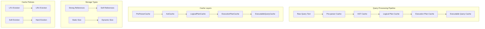
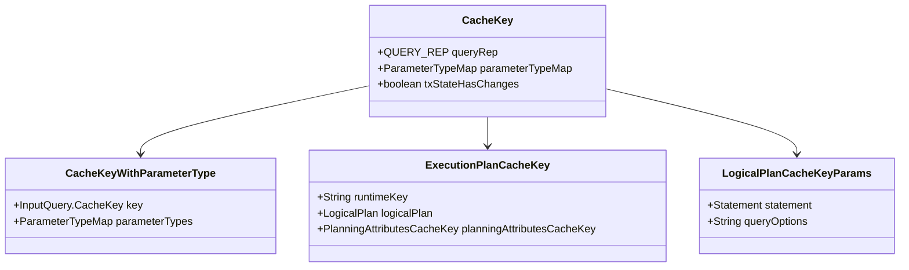
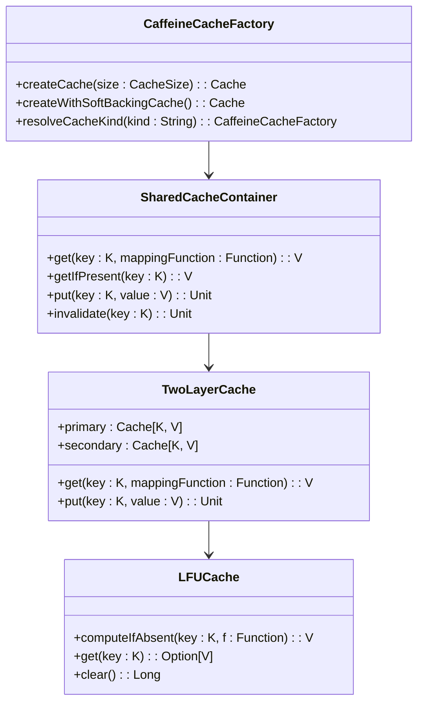
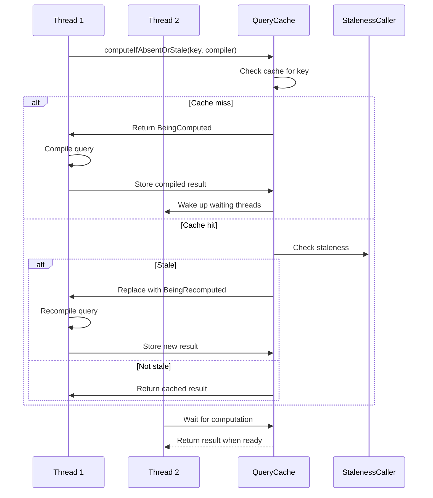
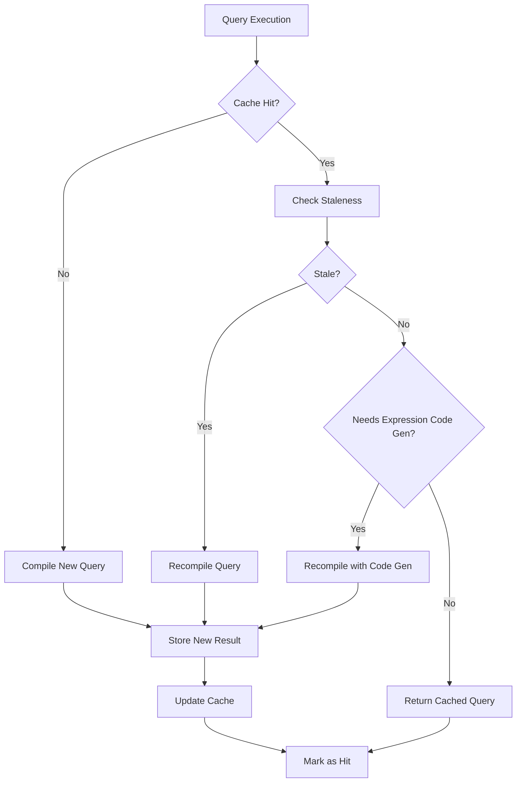
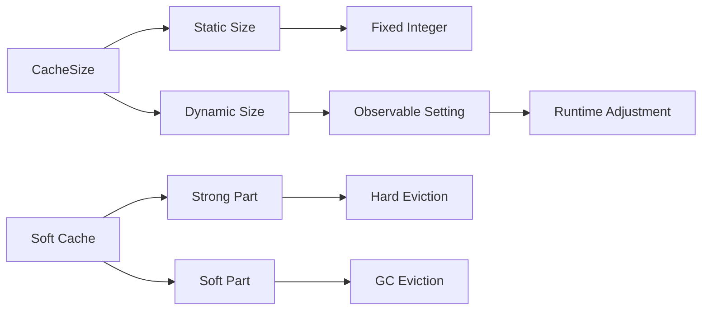
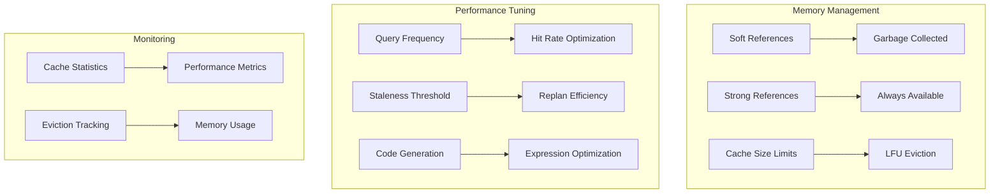
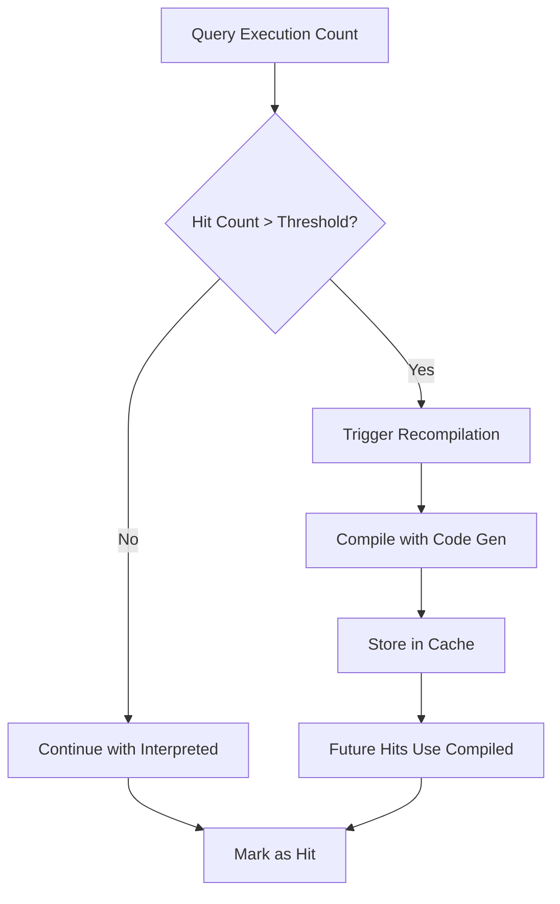
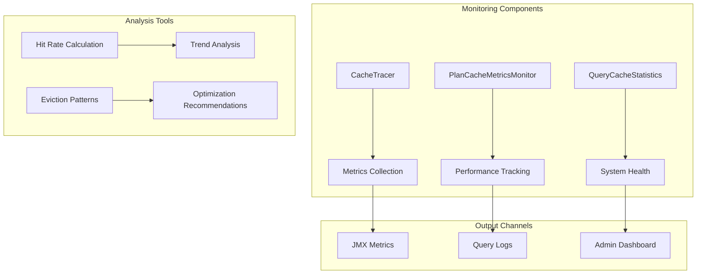

# Query Caching

<cite>
**Referenced Files in This Document**
- [CaffeineCacheFactory.scala](file://community/cypher/cypher-cache/src/main/scala/org/neo4j/cypher/internal/cache/CaffeineCacheFactory.scala)
- [SharedCacheContainer.scala](file://community/cypher/cypher-cache/src/main/scala/org/neo4j/cypher/internal/cache/SharedCacheContainer.scala)
- [TwoLayerCache.scala](file://community/cypher/cypher-cache/src/main/scala/org/neo4j/cypher/internal/cache/TwoLayerCache.scala)
- [CacheSize.scala](file://community/cypher/cypher-cache/src/main/scala/org/neo4j/cypher/internal/cache/CacheSize.scala)
- [CypherQueryCaches.scala](file://community/cypher/cypher/src/main/scala/org/neo4j/cypher/internal/cache/CypherQueryCaches.scala)
- [QueryCache.scala](file://community/cypher/cypher/src/main/scala/org/neo4j/cypher/internal/query/QueryCache.scala)
- [LFUCache.scala](file://community/cypher/cypher-cache/src/main/scala/org/neo4j/cypher/internal/cache/LFUCache.scala)
- [CacheTracer.scala](file://community/cypher/cypher-cache/src/main/scala/org/neo4j/cypher/internal/cache/CacheTracer.scala)
- [PlanCacheMetricsMonitor.scala](file://community/cypher/cypher/src/main/scala/org/neo4j/cypher/PlanCacheMetricsMonitor.scala)
- [CombinedQueryCacheStatistics.scala](file://community/cypher/cypher/src/main/scala/org/neo4j/cypher/internal/cache/CombinedQueryCacheStatistics.scala)
- [GraphDatabaseInternalSettings.java](file://community/configuration/src/main/java/org/neo4j/configuration/GraphDatabaseInternalSettings.java)
- [GraphDatabaseSettings.java](file://community/configuration/src/main/java/org/neo4j/configuration/GraphDatabaseSettings.java)
</cite>

## Table of Contents
1. [Introduction](#introduction)
2. [Multi-Layer Caching Architecture](#multi-layer-caching-architecture)
3. [Domain Model of Cache Keys and Entries](#domain-model-of-cache-keys-and-entries)
4. [Implementation Details](#implementation-details)
5. [Cache Configuration and Management](#cache-configuration-and-management)
6. [Performance Optimization Strategies](#performance-optimization-strategies)
7. [Common Issues and Solutions](#common-issues-and-solutions)
8. [Monitoring and Statistics](#monitoring-and-statistics)
9. [Best Practices](#best-practices)
10. [Troubleshooting Guide](#troubleshooting-guide)

## Introduction

The Neo4j Cypher query caching system is a sophisticated multi-tier caching architecture designed to optimize query performance by storing parsed queries, execution plans, and compilation metadata. This system significantly reduces query compilation overhead by reusing previously computed results for identical or similar queries.

The caching system operates at multiple layers, each serving specific purposes in the query processing pipeline:
- **Pre-parser cache**: Stores pre-parsed query text
- **AST cache**: Caches parsed abstract syntax trees
- **Logical plan cache**: Stores optimized logical execution plans
- **Execution plan cache**: Caches physical execution plans
- **Executable query cache**: Stores fully compiled executable queries

## Multi-Layer Caching Architecture

The Cypher query caching system implements a hierarchical architecture with specialized caches for different stages of query processing.



**Diagram sources**
- [CypherQueryCaches.scala](file://community/cypher/cypher/src/main/scala/org/neo4j/cypher/internal/cache/CypherQueryCaches.scala#L430-L634)
- [QueryCache.scala](file://community/cypher/cypher/src/main/scala/org/neo4j/cypher/internal/query/QueryCache.scala#L138-L162)

### Cache Hierarchy Overview

The system employs a layered approach where each cache serves a specific purpose:

1. **Pre-parser Cache**: Stores raw query text after initial preprocessing
2. **AST Cache**: Caches the parsed abstract syntax tree with parameter type information
3. **Logical Plan Cache**: Stores optimized logical execution plans with staleness detection
4. **Execution Plan Cache**: Caches physical execution plans with cardinality estimates
5. **Executable Query Cache**: Stores fully compiled executable queries with expression code generation

**Section sources**
- [CypherQueryCaches.scala](file://community/cypher/cypher/src/main/scala/org/neo4j/cypher/internal/cache/CypherQueryCaches.scala#L203-L371)

## Domain Model of Cache Keys and Entries

The caching system uses sophisticated key structures and entry types to ensure efficient storage and retrieval of cached query artifacts.

### Cache Key Design

Each cache type uses specialized key structures that capture essential query characteristics:



**Diagram sources**
- [QueryCache.scala](file://community/cypher/cypher/src/main/scala/org/neo4j/cypher/internal/query/QueryCache.scala#L644-L650)
- [CypherQueryCaches.scala](file://community/cypher/cypher/src/main/scala/org/neo4j/cypher/internal/cache/CypherQueryCaches.scala#L308-L312)

### Entry Types and Metadata

The system supports various entry types depending on the cache level:

| Cache Level | Entry Type | Purpose | Metadata |
|-------------|------------|---------|----------|
| PreParser | String → PreParsedQuery | Raw query text to pre-parsed form | Query text, parsing options |
| AST | CacheKeyWithParameterType → AstCacheValue | Parsed AST with notifications | AST, notifications, parameter types |
| Logical Plan | CacheKey → CacheableLogicalPlan | Optimized logical plan | Plan state, reusability, notifications |
| Execution Plan | ExecutionPlanCacheKey → CachedExecutionPlan | Physical execution plan | Plan, cardinalities, orders |
| Executable Query | CacheKey → ExecutableQuery | Compiled query with code | Query, reusability, notifications |

**Section sources**
- [CypherQueryCaches.scala](file://community/cypher/cypher/src/main/scala/org/neo4j/cypher/internal/cache/CypherQueryCaches.scala#L227-L371)

## Implementation Details

The caching system is built on top of Caffeine cache with custom extensions for multi-threading, soft references, and specialized eviction policies.

### Core Cache Infrastructure



**Diagram sources**
- [CaffeineCacheFactory.scala](file://community/cypher/cypher-cache/src/main/scala/org/neo4j/cypher/internal/cache/CaffeineCacheFactory.scala#L128-L140)
- [SharedCacheContainer.scala](file://community/cypher/cypher-cache/src/main/scala/org/neo4j/cypher/internal/cache/SharedCacheContainer.scala#L56-L90)
- [TwoLayerCache.scala](file://community/cypher/cypher-cache/src/main/scala/org/neo4j/cypher/internal/cache/TwoLayerCache.scala#L36-L70)

### Multi-Threading and Concurrency

The system handles concurrent access through sophisticated synchronization mechanisms:



**Diagram sources**
- [QueryCache.scala](file://community/cypher/cypher/src/main/scala/org/neo4j/cypher/internal/query/QueryCache.scala#L276-L418)

### Staleness Detection and Management

The system implements intelligent staleness detection to ensure cached plans remain valid:



**Diagram sources**
- [QueryCache.scala](file://community/cypher/cypher/src/main/scala/org/neo4j/cypher/internal/query/QueryCache.scala#L331-L356)

**Section sources**
- [QueryCache.scala](file://community/cypher/cypher/src/main/scala/org/neo4j/cypher/internal/query/QueryCache.scala#L138-L420)

## Cache Configuration and Management

The caching system provides extensive configuration options for tuning performance and memory usage.

### Configuration Options

| Setting | Description | Default | Range |
|---------|-------------|---------|-------|
| `query_cache_size` | Maximum entries per database | 1000 | 0+ |
| `cypher_soft_cache_enabled` | Enable soft reference cache | false | true/false |
| `query_cache_strong_size` | Strong reference cache size | 200 | 0+ |
| `query_cache_soft_size` | Soft reference cache size | 800 | 0+ |
| `query_execution_plan_cache_size` | Execution plan cache size | -1 (auto) | -1, 0, or positive integer |
| `cypher_min_replan_interval` | Minimum replan interval | 1000ms | 1000+ ms |

### Cache Size Management

The system supports both static and dynamic cache sizing:



**Diagram sources**
- [CacheSize.scala](file://community/cypher/cypher-cache/src/main/scala/org/neo4j/cypher/internal/cache/CacheSize.scala#L25-L50)
- [CypherQueryCaches.scala](file://community/cypher/cypher/src/main/scala/org/neo4j/cypher/internal/cache/CypherQueryCaches.scala#L108-L120)

**Section sources**
- [GraphDatabaseInternalSettings.java](file://community/configuration/src/main/java/org/neo4j/configuration/GraphDatabaseInternalSettings.java#L710-L1471)
- [GraphDatabaseSettings.java](file://community/configuration/src/main/java/org/neo4j/configuration/GraphDatabaseSettings.java#L298-L648)

## Performance Optimization Strategies

### Maximizing Cache Effectiveness

To achieve optimal cache performance, follow these strategies:

1. **Consistent Query Text**: Use parameterized queries instead of literal values
2. **Parameter Normalization**: Ensure consistent parameter ordering and naming
3. **Query Pattern Recognition**: Design queries to share common patterns
4. **Cache Warming**: Preload frequently used queries into cache

### Memory Usage Optimization



**Diagram sources**
- [CypherQueryCaches.scala](file://community/cypher/cypher/src/main/scala/org/neo4j/cypher/internal/cache/CypherQueryCaches.scala#L573-L590)

### Expression Code Generation Optimization

The system automatically optimizes frequently executed queries by compiling them with expression code generation:



**Diagram sources**
- [QueryCache.scala](file://community/cypher/cypher/src/main/scala/org/neo4j/cypher/internal/query/QueryCache.scala#L452-L495)

**Section sources**
- [QueryCache.scala](file://community/cypher/cypher/src/main/scala/org/neo4j/cypher/internal/query/QueryCache.scala#L452-L495)

## Common Issues and Solutions

### Cache Invalidation Problems

**Issue**: Cached plans become stale due to schema changes or data modifications.

**Solution**: The system implements automatic staleness detection based on:
- Transaction ID comparison
- Schema change detection
- Statistics divergence calculation
- Manual cache clearing

### Memory Usage Concerns

**Issue**: Cache consumes excessive memory, causing OutOfMemoryError.

**Solutions**:
1. Reduce cache sizes through configuration
2. Enable soft cache mode for automatic GC management
3. Monitor cache statistics and adjust accordingly
4. Implement cache warming strategies

### Performance Considerations

**Issue**: Cache misses lead to repeated compilation overhead.

**Solutions**:
1. Use parameterized queries consistently
2. Optimize query patterns for cache sharing
3. Increase cache sizes for frequently executed queries
4. Monitor cache hit rates and adjust configuration

**Section sources**
- [QueryCache.scala](file://community/cypher/cypher/src/main/scala/org/neo4j/cypher/internal/query/QueryCache.scala#L331-L356)

## Monitoring and Statistics

The caching system provides comprehensive monitoring capabilities through dedicated metrics and statistics.

### Cache Statistics

| Metric | Description | Purpose |
|--------|-------------|---------|
| Cache Hits | Number of successful cache retrievals | Performance measurement |
| Cache Misses | Number of cache lookups requiring computation | Bottleneck identification |
| Compiled Queries | Number of newly compiled queries | Compilation overhead tracking |
| Stale Entries | Number of evicted stale entries | Staleness detection effectiveness |
| Cache Flushes | Number of cache clearing operations | Maintenance impact assessment |

### Monitoring Architecture



**Diagram sources**
- [PlanCacheMetricsMonitor.scala](file://community/cypher/cypher/src/main/scala/org/neo4j/cypher/PlanCacheMetricsMonitor.scala#L34-L67)
- [CombinedQueryCacheStatistics.scala](file://community/cypher/cypher/src/main/scala/org/neo4j/cypher/internal/cache/CombinedQueryCacheStatistics.scala#L33-L66)

**Section sources**
- [PlanCacheMetricsMonitor.scala](file://community/cypher/cypher/src/main/scala/org/neo4j/cypher/PlanCacheMetricsMonitor.scala#L34-L67)
- [CombinedQueryCacheStatistics.scala](file://community/cypher/cypher/src/main/scala/org/neo4j/cypher/internal/cache/CombinedQueryCacheStatistics.scala#L33-L66)

## Best Practices

### Query Design Guidelines

1. **Use Parameterized Queries**: Always use parameters instead of embedding values directly
2. **Consistent Naming**: Maintain consistent parameter names across similar queries
3. **Avoid Literal Values**: Replace hardcoded values with parameters
4. **Query Normalization**: Standardize query patterns for better cache sharing

### Configuration Recommendations

1. **Start Conservative**: Begin with smaller cache sizes and increase gradually
2. **Monitor Performance**: Track hit rates and adjust sizes based on usage patterns
3. **Enable Soft Cache**: Use soft references for better memory management
4. **Regular Monitoring**: Implement continuous monitoring of cache statistics

### Operational Practices

1. **Cache Warming**: Preload critical queries during startup
2. **Gradual Scaling**: Increase cache sizes incrementally
3. **Regular Maintenance**: Periodic cache clearing for stale data
4. **Performance Testing**: Validate cache effectiveness with realistic workloads

## Troubleshooting Guide

### Common Performance Issues

**Problem**: Low cache hit rates despite high query volume

**Diagnosis Steps**:
1. Check query parameter consistency
2. Verify cache configuration settings
3. Analyze query patterns for optimization opportunities
4. Review staleness detection thresholds

**Problem**: Memory consumption growing rapidly

**Diagnosis Steps**:
1. Monitor cache size limits
2. Check soft cache configuration
3. Analyze eviction patterns
4. Review query complexity and frequency

### Debugging Cache Issues

Enable debug monitoring for detailed cache behavior analysis:

```scala
// Example configuration for debug monitoring
val config = CypherQueryCaches.Config(
  cacheSize = CacheSize.Dynamic(queryCacheSize),
  executionPlanCacheSize = ExecutionPlanCacheSize.Default,
  divergenceConfig = StatsDivergenceCalculatorConfig(...),
  enableExecutionPlanCacheTracing = true,
  enableDebugMonitors = true,
  softCacheSize = SoftCacheSize.Sized(strongSize, softSize)
)
```

**Section sources**
- [CypherQueryCaches.scala](file://community/cypher/cypher/src/main/scala/org/neo4j/cypher/internal/cache/CypherQueryCaches.scala#L390-L400)