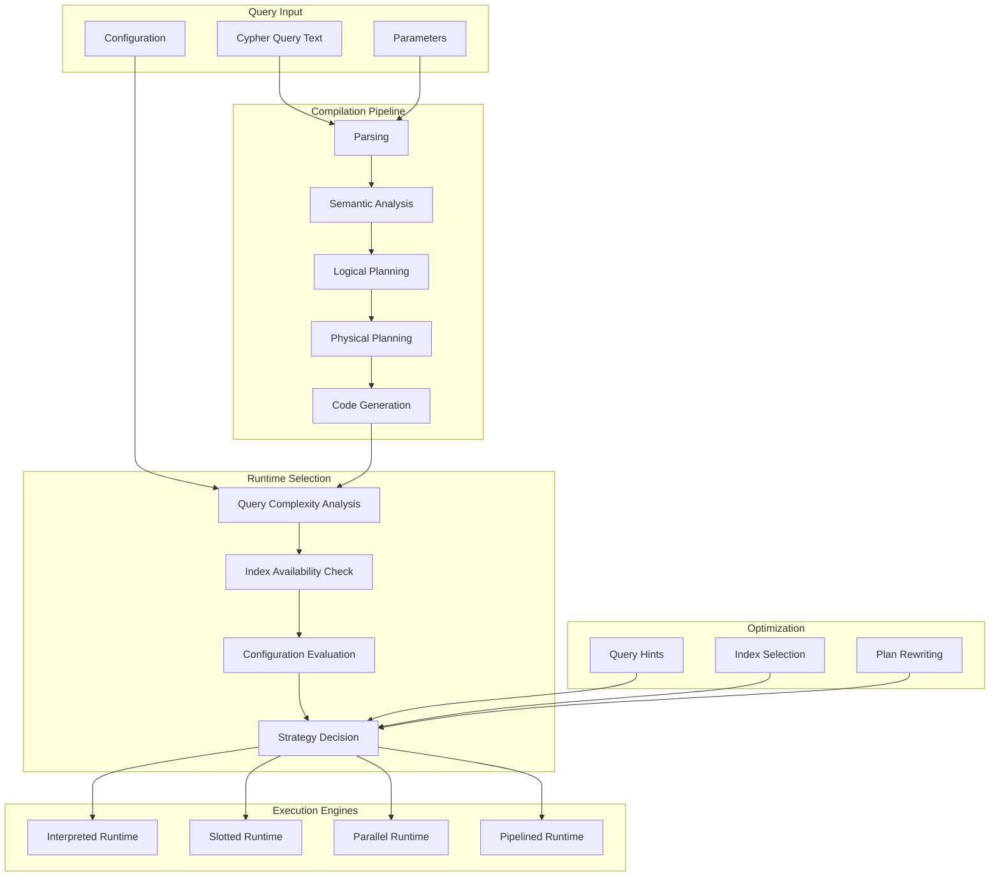
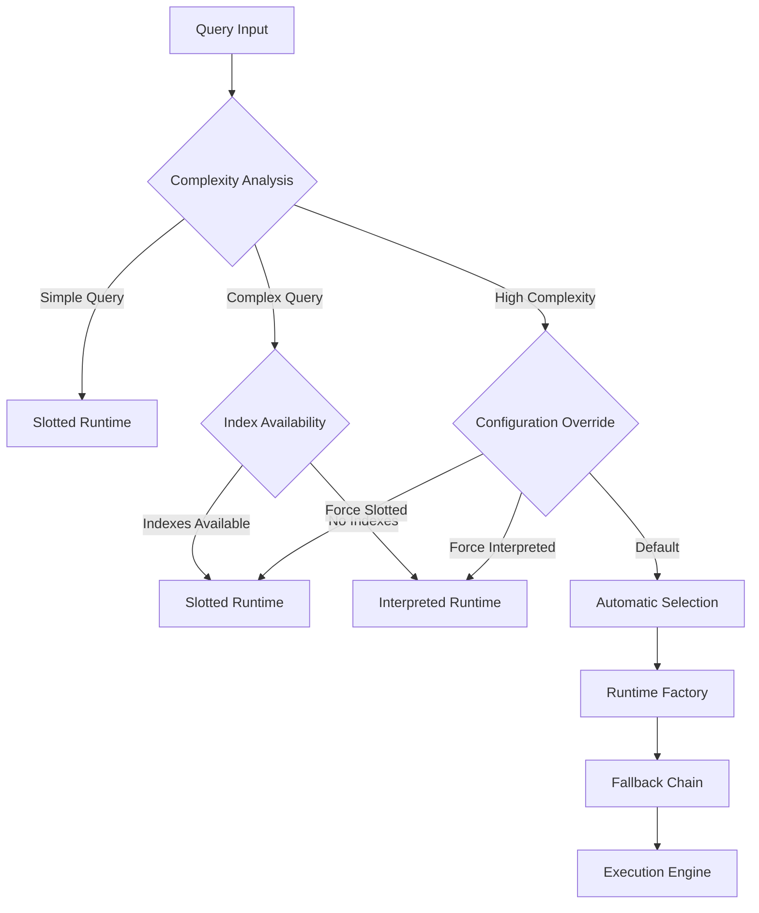
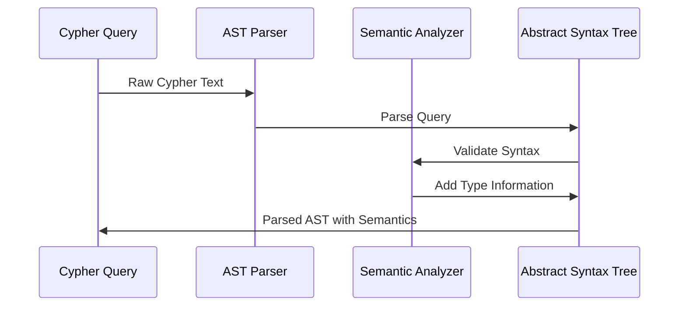
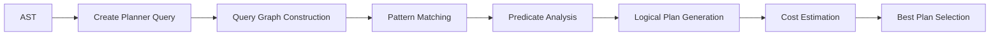
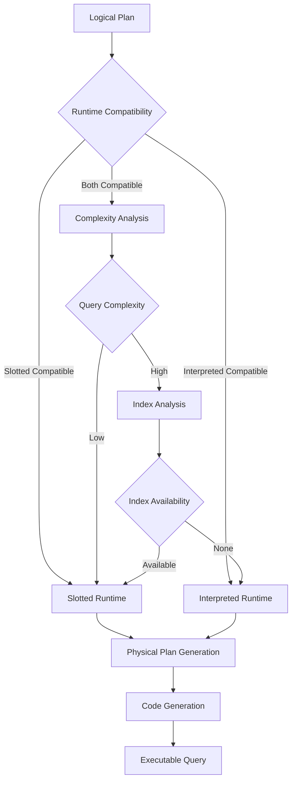
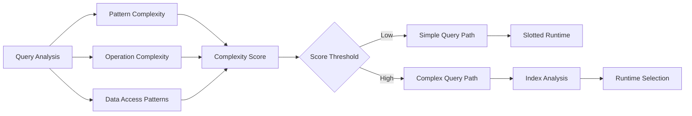
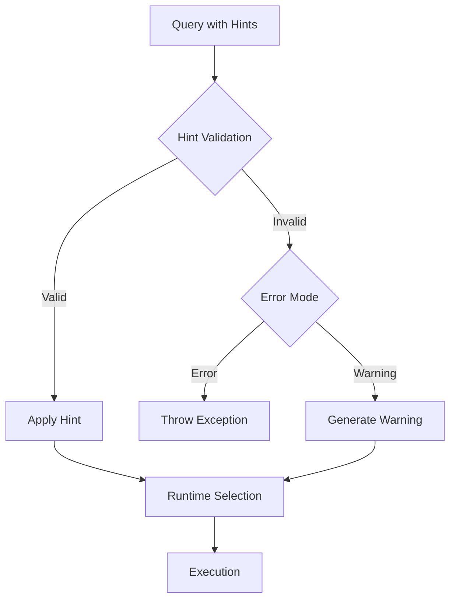

# Execution Strategies

<cite>
**Referenced Files in This Document**
- [CypherRuntime.scala](file://community/cypher/cypher/src/main/scala/org/neo4j/cypher/internal/CypherRuntime.scala)
- [CommunityRuntimeFactory.scala](file://community/cypher/cypher/src/main/scala/org/neo4j/cypher/internal/CommunityRuntimeFactory.scala)
- [InterpretedRuntime.scala](file://community/cypher/interpreted-runtime/src/main/scala/org/neo4j/cypher/internal/runtime/interpreted/InterpretedRuntime.scala)
- [SlottedRuntime.scala](file://community/cypher/slotted-runtime/src/main/scala/org/neo4j/cypher/internal/runtime/slotted/SlottedRuntime.scala)
- [CypherRuntimeOption.scala](file://community/cypher/cypher-config/src/main/scala/org/neo4j/cypher/internal/options/CypherRuntimeOption.scala)
- [RuntimeName.scala](file://community/cypher/cypher/src/main/scala/org/neo4j/cypher/internal/RuntimeName.scala)
- [ExecutionEngine.scala](file://community/cypher/cypher/src/main/scala/org/neo4j/cypher/internal/ExecutionEngine.scala)
- [CypherPlanner.scala](file://community/cypher/cypher/src/main/scala/org/neo4j/cypher/internal/planning/CypherPlanner.scala)
- [CompilationPhases.scala](file://community/cypher/cypher-planner/src/main/scala/org/neo4j/cypher/internal/compiler/phases/CompilationPhases.scala)
- [LogicalPlanState.scala](file://community/cypher/cypher-planner/src/main/scala/org/neo4j/cypher/internal/compiler/phases/LogicalPlanState.scala)
- [QueryCache.scala](file://community/cypher/cypher/src/main/scala/org/neo4j/cypher/internal/QueryCache.scala)
- [GraphDatabaseSettings.java](file://community/configuration/src/main/java/org/neo4j/configuration/GraphDatabaseSettings.java)
- [Hint.scala](file://community/cypher/front-end/ast/src/main/scala/org/neo4j/cypher/internal/ast/Hint.scala)
- [HintException.java](file://community/neo4j-exceptions/src/main/java/org/neo4j/exceptions/HintException.java)
- [VerifyBestPlan.scala](file://community/cypher/cypher-planner/src/main/scala/org/neo4j/cypher/internal/compiler/planner/logical/steps/VerifyBestPlan.scala)
</cite>

## Table of Contents
1. [Introduction](#introduction)
2. [Runtime Architecture Overview](#runtime-architecture-overview)
3. [Execution Strategy Selection](#execution-strategy-selection)
4. [Compilation Pipeline](#compilation-pipeline)
5. [Runtime Types and Characteristics](#runtime-types-and-characteristics)
6. [Query Complexity Analysis](#query-complexity-analysis)
7. [Configuration Options](#configuration-options)
8. [Query Hints and Influence](#query-hints-and-influence)
9. [Performance Considerations](#performance-considerations)
10. [Diagnosis and Troubleshooting](#diagnosis-and-troubleshooting)
11. [Best Practices](#best-practices)

## Introduction

Neo4j's Cypher execution engine employs a sophisticated runtime selection mechanism that determines the optimal execution strategy for each query based on multiple factors including query complexity, available indexes, configuration settings, and runtime characteristics. This system automatically selects between different execution engines to maximize performance while maintaining correctness.

The execution strategy selection process involves analyzing query patterns, assessing available optimization opportunities, and choosing the most efficient runtime implementation. This document explores the decision-making process, compilation pipeline, and configuration options that influence execution strategy selection.

## Runtime Architecture Overview

The Neo4j Cypher runtime system is built around a flexible architecture that supports multiple execution engines, each optimized for different query patterns and performance characteristics.

**Diagram sources**
- [CypherRuntime.scala](file://community/cypher/cypher/src/main/scala/org/neo4j/cypher/internal/CypherRuntime.scala#L52-L72)
- [ExecutionEngine.scala](file://community/cypher/cypher/src/main/scala/org/neo4j/cypher/internal/ExecutionEngine.scala#L66-L75)

**Section sources**
- [CypherRuntime.scala](file://community/cypher/cypher/src/main/scala/org/neo4j/cypher/internal/CypherRuntime.scala#L52-L72)
- [CommunityRuntimeFactory.scala](file://community/cypher/cypher/src/main/scala/org/neo4j/cypher/internal/CommunityRuntimeFactory.scala#L27-L64)

## Execution Strategy Selection

### Decision Factors

The runtime selection process considers multiple factors to determine the optimal execution strategy:

#### Query Complexity Analysis
The system evaluates query complexity based on:
- Number and type of pattern matches
- Presence of aggregation operations
- Subquery complexity
- Join patterns and relationships
- Index availability and usage patterns

#### Index Availability Assessment
Available indexes significantly influence runtime selection:
- Node and relationship indexes
- Composite indexes
- Full-text and point indexes
- Range and equality predicates

#### Configuration Settings
System-wide and query-specific configurations affect strategy selection:
- Runtime preferences
- Planner choices
- Optimization thresholds
- Memory allocation settings

### Selection Algorithm

**Diagram sources**
- [CommunityRuntimeFactory.scala](file://community/cypher/cypher/src/main/scala/org/neo4j/cypher/internal/CommunityRuntimeFactory.scala#L46-L64)
- [CypherRuntime.scala](file://community/cypher/cypher/src/main/scala/org/neo4j/cypher/internal/CypherRuntime.scala#L196-L275)

**Section sources**
- [CommunityRuntimeFactory.scala](file://community/cypher/cypher/src/main/scala/org/neo4j/cypher/internal/CommunityRuntimeFactory.scala#L46-L64)
- [CypherRuntime.scala](file://community/cypher/cypher/src/main/scala/org/neo4j/cypher/internal/CypherRuntime.scala#L196-L275)

## Compilation Pipeline

The compilation pipeline transforms Cypher text into executable query plans through several distinct phases, each contributing to the final execution strategy selection.

### Phase 1: Parsing and Semantic Analysis

**Diagram sources**
- [CompilationPhases.scala](file://community/cypher/cypher-planner/src/main/scala/org/neo4j/cypher/internal/compiler/phases/CompilationPhases.scala#L81-L174)
- [SemanticAnalysis.scala](file://community/cypher/front-end/frontend/src/main/scala/org/neo4j/cypher/internal/frontend/phases/SemanticAnalysis.scala#L44-L128)

### Phase 2: Logical Planning

The logical planning phase generates an abstract representation of the query execution strategy:

**Diagram sources**
- [LogicalPlanState.scala](file://community/cypher/cypher-planner/src/main/scala/org/neo4j/cypher/internal/compiler/phases/LogicalPlanState.scala#L54-L79)
- [CompilationPhases.scala](file://community/cypher/cypher-planner/src/main/scala/org/neo4j/cypher/internal/compiler/phases/CompilationPhases.scala#L104-L142)

### Phase 3: Physical Planning and Runtime Selection

The final phase determines the specific execution engine and optimization strategies:

**Diagram sources**
- [CypherPlanner.scala](file://community/cypher/cypher/src/main/scala/org/neo4j/cypher/internal/planning/CypherPlanner.scala#L242-L353)
- [ExecutionEngine.scala](file://community/cypher/cypher/src/main/scala/org/neo4j/cypher/internal/ExecutionEngine.scala#L331-L371)

**Section sources**
- [CompilationPhases.scala](file://community/cypher/cypher-planner/src/main/scala/org/neo4j/cypher/internal/compiler/phases/CompilationPhases.scala#L81-L174)
- [CypherPlanner.scala](file://community/cypher/cypher/src/main/scala/org/neo4j/cypher/internal/planning/CypherPlanner.scala#L242-L353)

## Runtime Types and Characteristics

### Slotted Runtime

The Slotted runtime represents the modern, optimized execution engine designed for high-performance query execution.

**Key Characteristics:**
- Column-oriented execution model
- Efficient memory utilization
- Advanced optimization capabilities
- Support for complex queries with indexes

**Optimal Use Cases:**
- Queries with multiple pattern matches
- Aggregation-heavy queries
- Complex join operations
- Queries utilizing available indexes

**Section sources**
- [SlottedRuntime.scala](file://community/cypher/slotted-runtime/src/main/scala/org/neo4j/cypher/internal/runtime/slotted/SlottedRuntime.scala#L48-L203)

### Interpreted Runtime

The Interpreted runtime serves as a fallback execution engine with broad compatibility.

**Key Characteristics:**
- Row-oriented execution model
- Broad query compatibility
- Lower memory efficiency
- Simpler execution logic

**Optimal Use Cases:**
- Legacy queries requiring compatibility
- Simple pattern matching scenarios
- Queries without suitable indexes
- Development and debugging scenarios

**Section sources**
- [InterpretedRuntime.scala](file://community/cypher/interpreted-runtime/src/main/scala/org/neo4j/cypher/internal/runtime/interpreted/InterpretedRuntime.scala#L62-L114)

### Runtime Comparison Matrix

| Feature | Slotted Runtime | Interpreted Runtime |
|---------|----------------|-------------------|
| Memory Efficiency | High | Medium |
| Query Complexity | High | Low |
| Index Utilization | Excellent | Limited |
| Compilation Speed | Fast | Very Fast |
| Debugging Support | Good | Excellent |
| Compatibility | Modern | Broad |

**Section sources**
- [RuntimeName.scala](file://community/cypher/cypher/src/main/scala/org/neo4j/cypher/internal/RuntimeName.scala#L24-L46)

## Query Complexity Analysis

### Complexity Factors

The system analyzes several factors to assess query complexity:

#### Pattern Match Complexity
- Number of pattern elements
- Relationship types and directions
- Variable bindings and constraints
- Quantified patterns and variable-length relationships

#### Operation Complexity
- Aggregation functions and grouping
- Sorting and ordering operations
- Filtering and predicate complexity
- Subquery nesting levels

#### Data Access Patterns
- Index usage patterns
- Scan operations and filtering
- Join strategies and complexity
- Memory requirements estimation

### Complexity Scoring

**Diagram sources**
- [QueryCache.scala](file://community/cypher/cypher/src/main/scala/org/neo4j/cypher/internal/QueryCache.scala#L63-L87)

**Section sources**
- [QueryCache.scala](file://community/cypher/cypher/src/main/scala/org/neo4j/cypher/internal/QueryCache.scala#L63-L87)

## Configuration Options

### Runtime Configuration Settings

Neo4j provides several configuration options that influence execution strategy selection:

#### Global Runtime Settings
- `dbms.cypher.planner`: Controls the planner algorithm (IDP, DP, COST)
- `dbms.cypher.hints_error`: Determines behavior for unfulfillable hints
- `dbms.cypher.runtime`: Sets the default runtime preference

#### Performance Tuning Options
- `dbms.cypher.idp_solver_table_threshold`: IDP solver table size limits
- `dbms.cypher.idp_solver_duration_threshold`: Solver iteration duration limits
- `dbms.cypher.predicates_as_union_max_size`: Maximum predicates for union optimization

### Runtime-Specific Configuration

Each runtime type supports specific configuration options that optimize performance for particular query patterns and data characteristics.

**Section sources**
- [GraphDatabaseSettings.java](file://community/configuration/src/main/java/org/neo4j/configuration/GraphDatabaseSettings.java#L236-L255)

## Query Hints and Influence

### Hint Types and Impact

Query hints provide explicit guidance to the query optimizer about preferred execution strategies:

#### Index Hints
- `USING INDEX`: Force specific index usage
- `USING SCAN`: Prefer scan operations over seeks
- `USING RANGE INDEX`: Specify range index usage

#### Join Hints
- `USING JOIN`: Enable hash join optimization
- `USING LOOKUP`: Force lookup operations

#### Runtime Hints
- `runtime=slotted`: Force slotted runtime
- `runtime=interpreted`: Force interpreted runtime

### Hint Validation and Fallback

**Diagram sources**
- [VerifyBestPlan.scala](file://community/cypher/cypher-planner/src/main/scala/org/neo4j/cypher/internal/compiler/planner/logical/steps/VerifyBestPlan.scala#L74-L174)
- [HintException.java](file://community/neo4j-exceptions/src/main/java/org/neo4j/exceptions/HintException.java#L33-L46)

### Hint Processing Workflow

The system processes hints through multiple validation stages:

1. **Syntax Validation**: Verify hint syntax correctness
2. **Semantic Validation**: Check hint applicability to query
3. **Availability Validation**: Confirm resource availability
4. **Conflict Resolution**: Handle conflicting hints
5. **Execution Application**: Apply validated hints to runtime selection

**Section sources**
- [Hint.scala](file://community/cypher/front-end/ast/src/main/scala/org/neo4j/cypher/internal/ast/Hint.scala#L63-L103)
- [VerifyBestPlan.scala](file://community/cypher/cypher-planner/src/main/scala/org/neo4j/cypher/internal/compiler/planner/logical/steps/VerifyBestPlan.scala#L74-L174)

## Performance Considerations

### Runtime Performance Characteristics

Different runtime types exhibit varying performance characteristics across different query patterns:

#### Throughput Optimization
- Slotted runtime generally provides higher throughput for complex queries
- Interpreted runtime may offer better startup performance for simple queries
- Parallel runtime enables multi-core utilization for large datasets

#### Latency Considerations
- Slotted runtime reduces memory allocation overhead
- Interpreted runtime may have lower compilation latency
- Runtime selection impacts query warm-up time

#### Memory Usage Patterns
- Slotted runtime optimizes memory layout for columnar operations
- Interpreted runtime maintains simpler row-based structures
- Memory pressure affects runtime selection decisions

### Performance Monitoring

The system provides comprehensive monitoring capabilities to track runtime performance:

- Execution time breakdown by operation type
- Memory allocation patterns
- Index utilization statistics
- Runtime selection frequency

## Diagnosis and Troubleshooting

### Runtime Selection Diagnosis

To diagnose runtime selection decisions, examine the query execution plan and compilation logs:

#### Plan Analysis
- Review the selected runtime in the execution plan description
- Examine the compilation phase timing
- Analyze the chosen optimization strategies

#### Log Analysis
- Enable debug logging for compilation phases
- Monitor runtime selection decisions
- Track performance metrics across different runtimes

### Common Issues and Solutions

#### Suboptimal Runtime Selection
- **Issue**: Query runs slower than expected
- **Solution**: Analyze execution plan and consider runtime hints
- **Prevention**: Profile queries and establish baseline performance

#### Runtime Compatibility Issues
- **Issue**: Certain queries fail with specific runtimes
- **Solution**: Use interpreted runtime as fallback or rewrite query
- **Prevention**: Test queries across different runtime configurations

#### Performance Regression
- **Issue**: Runtime selection leads to performance degradation
- **Solution**: Adjust configuration settings or use explicit runtime hints
- **Prevention**: Establish performance baselines and monitor trends

## Best Practices

### Runtime Selection Guidelines

#### When to Use Slotted Runtime
- Complex queries with multiple pattern matches
- Aggregation-heavy operations
- Queries utilizing available indexes
- Production environments requiring optimal performance

#### When to Use Interpreted Runtime
- Legacy queries requiring compatibility
- Development and debugging scenarios
- Simple pattern matching queries
- Queries without suitable indexes

#### Configuration Recommendations
- Set `dbms.cypher.planner=IDP` for most production workloads
- Configure appropriate solver thresholds for query complexity
- Use runtime hints judiciously for critical queries
- Monitor and adjust based on query performance metrics

### Query Optimization Strategies

#### Index Utilization
- Design indexes to match query patterns
- Use composite indexes for multi-column predicates
- Consider index maintenance costs versus query benefits

#### Query Structure Optimization
- Minimize subquery complexity
- Optimize pattern matching order
- Use appropriate aggregation strategies
- Leverage available indexes effectively

#### Monitoring and Maintenance
- Regular performance monitoring
- Query plan analysis
- Runtime selection review
- Configuration tuning based on workload characteristics