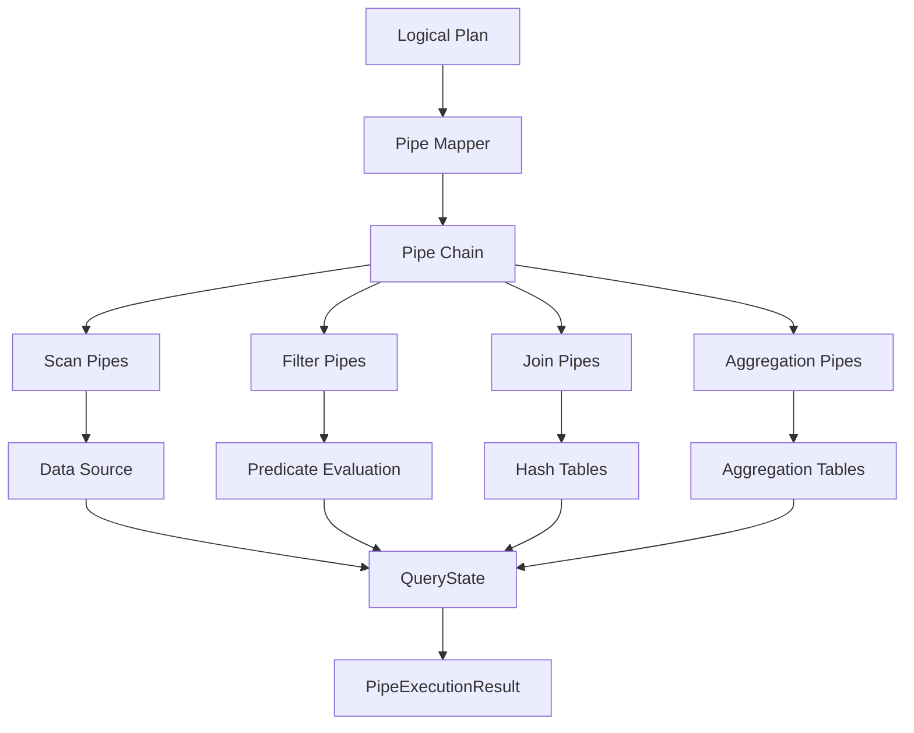
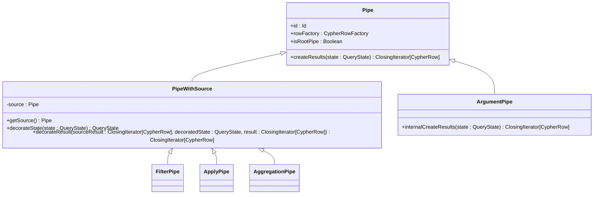
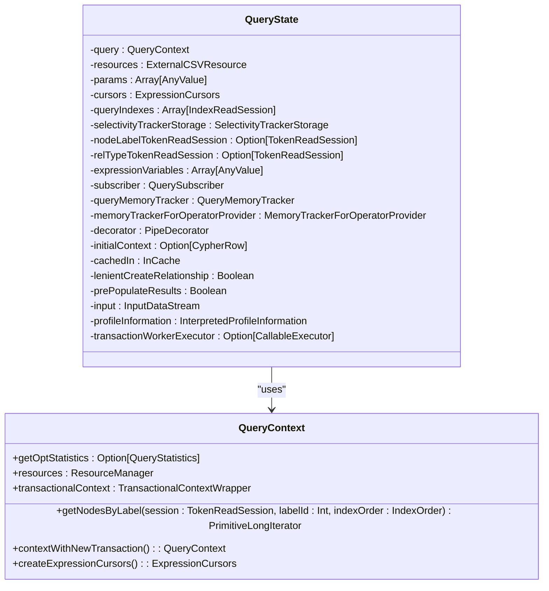
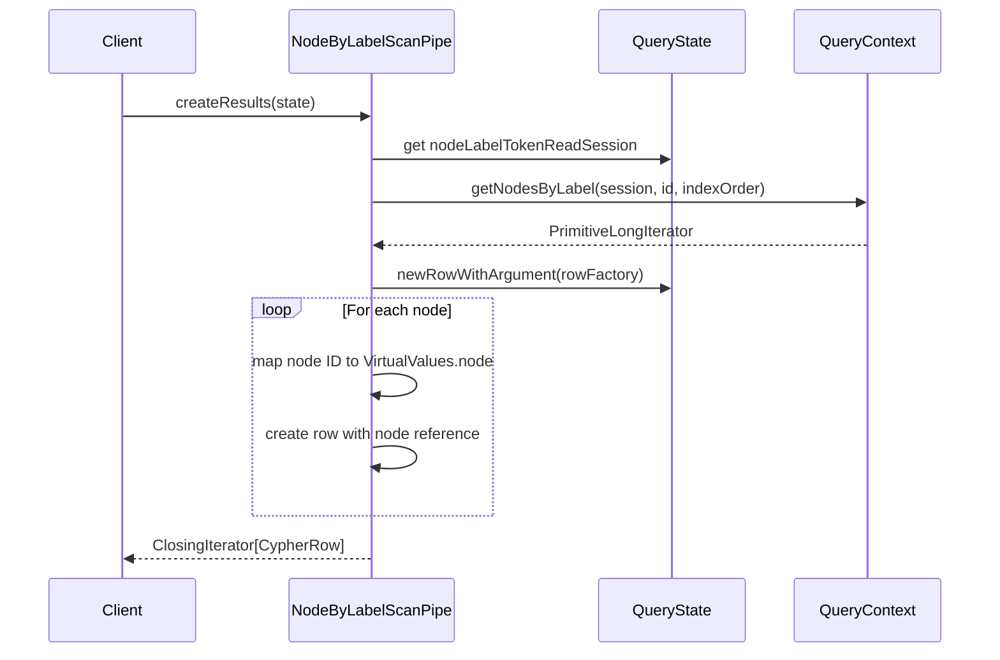
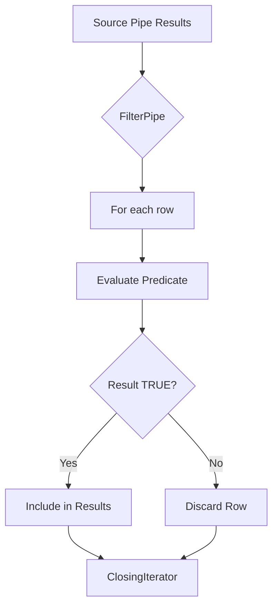
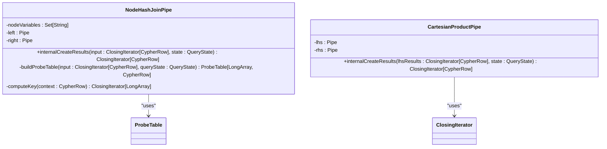
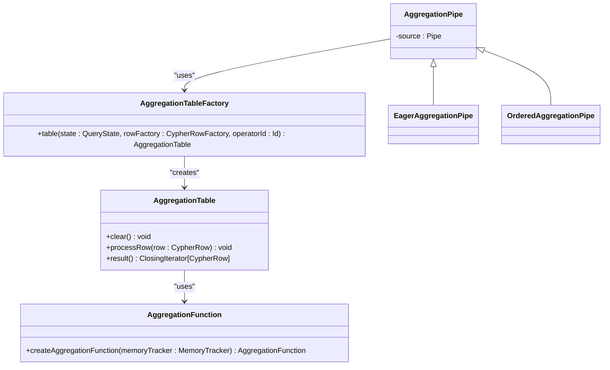
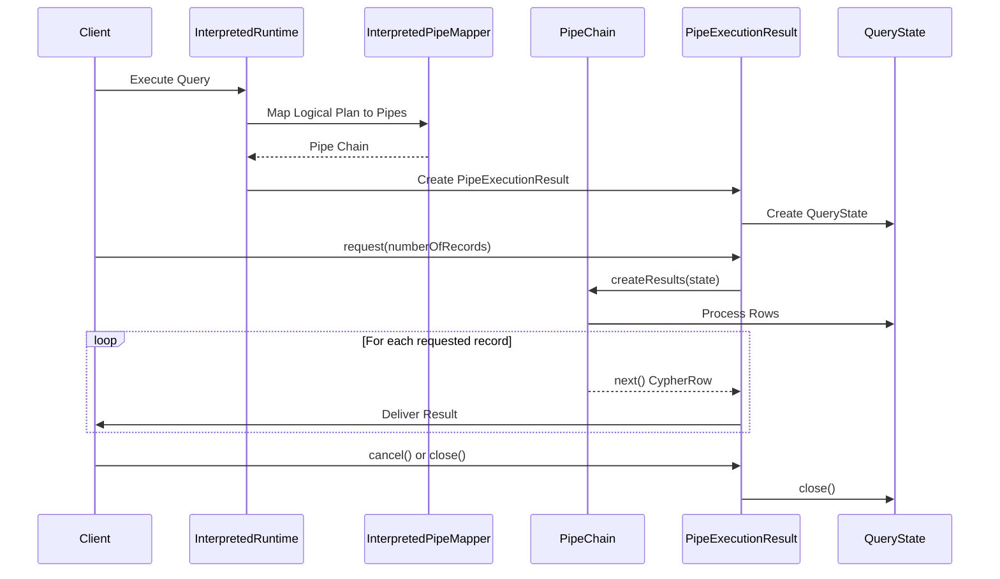

# Interpreted Runtime

<cite>
**Referenced Files in This Document**   
- [InterpretedPipeMapper.scala](file://community/cypher/interpreted-runtime/src/main/scala/org/neo4j/cypher/internal/runtime/interpreted/InterpretedPipeMapper.scala)
- [Pipe.scala](file://community/cypher/interpreted-runtime/src/main/scala/org/neo4j/cypher/internal/runtime/interpreted/pipes/Pipe.scala)
- [QueryState.scala](file://community/cypher/interpreted-runtime/src/main/scala/org/neo4j/cypher/internal/runtime/interpreted/pipes/QueryState.scala)
- [PipeExecutionResult.scala](file://community/cypher/interpreted-runtime/src/main/scala/org/neo4j/cypher/internal/runtime/interpreted/PipeExecutionResult.scala)
- [NodeByLabelScanPipe.scala](file://community/cypher/interpreted-runtime/src/main/scala/org/neo4j/cypher/internal/runtime/interpreted/pipes/NodeByLabelScanPipe.scala)
- [FilterPipe.scala](file://community/cypher/interpreted-runtime/src/main/scala/org/neo4j/cypher/internal/runtime/interpreted/pipes/FilterPipe.scala)
- [AggregationPipe.scala](file://community/cypher/interpreted-runtime/src/main/scala/org/neo4j/cypher/internal/runtime/interpreted/pipes/AggregationPipe.scala)
- [NodeHashJoinPipe.scala](file://community/cypher/interpreted-runtime/src/main/scala/org/neo4j/cypher/internal/runtime/interpreted/pipes/NodeHashJoinPipe.scala)
- [CartesianProductPipe.scala](file://community/cypher/interpreted-runtime/src/main/scala/org/neo4j/cypher/internal/runtime/interpreted/pipes/CartesianProductPipe.scala)
- [ApplyPipe.scala](file://community/cypher/interpreted-runtime/src/main/scala/org/neo4j/cypher/internal/runtime/interpreted/pipes/ApplyPipe.scala)
- [InterpretedRuntime.scala](file://community/cypher/cypher/src/main/scala/org/neo4j/cypher/internal/InterpretedRuntime.scala)
- [CommunityRuntimeFactory.scala](file://community/cypher/cypher/src/main/scala/org/neo4j/cypher/internal/CommunityRuntimeFactory.scala)
- [RuntimeName.scala](file://community/cypher/cypher/src/main/scala/org/neo4j/cypher/internal/RuntimeName.scala)
</cite>

## Table of Contents
1. [Introduction](#introduction)
2. [Architecture Overview](#architecture-overview)
3. [Core Components](#core-components)
4. [Detailed Component Analysis](#detailed-component-analysis)
5. [Query Execution Flow](#query-execution-flow)
6. [Performance Characteristics](#performance-characteristics)
7. [Optimization Guidance](#optimization-guidance)
8. [Conclusion](#conclusion)

## Introduction
The interpreted runtime execution engine in Neo4j is responsible for processing Cypher queries through a pipe-based architecture that interprets logical execution plans and processes data row-by-row. This runtime serves as the foundation for query execution, translating high-level Cypher queries into a series of pipe operators that scan, filter, join, and aggregate data. The engine is designed to handle complex graph operations while maintaining flexibility and extensibility. Unlike the slotted runtime which uses a more optimized memory layout, the interpreted runtime provides a more straightforward execution model that is easier to debug and extend.

**Section sources**
- [InterpretedRuntime.scala](file://community/cypher/cypher/src/main/scala/org/neo4j/cypher/internal/InterpretedRuntime.scala#L62-L77)
- [CommunityRuntimeFactory.scala](file://community/cypher/cypher/src/main/scala/org/neo4j/cypher/internal/CommunityRuntimeFactory.scala#L27-L64)

## Architecture Overview
The interpreted runtime follows a pipe-based architecture where each query execution plan is represented as a chain of pipe operators. These pipes form a tree structure that processes data row-by-row, with each pipe responsible for a specific operation such as scanning, filtering, or joining. The execution begins with leaf pipes that produce initial data, which then flows through intermediate pipes that transform or filter the data, culminating in result-producing pipes that return the final output.

**Diagram sources**
- [InterpretedPipeMapper.scala](file://community/cypher/interpreted-runtime/src/main/scala/org/neo4j/cypher/internal/runtime/interpreted/InterpretedPipeMapper.scala#L375-L1415)
- [Pipe.scala](file://community/cypher/interpreted-runtime/src/main/scala/org/neo4j/cypher/internal/runtime/interpreted/pipes/Pipe.scala#L37-L68)

## Core Components
The interpreted runtime consists of several core components that work together to execute Cypher queries. The pipe system forms the backbone of the execution engine, with each pipe representing a specific operation in the query plan. The QueryState maintains execution context and state across pipe operations, while the PipeExecutionResult handles the final result delivery to clients. The InterpretedPipeMapper is responsible for converting logical plans into physical pipe chains.

**Section sources**
- [Pipe.scala](file://community/cypher/interpreted-runtime/src/main/scala/org/neo4j/cypher/internal/runtime/interpreted/pipes/Pipe.scala#L37-L68)
- [QueryState.scala](file://community/cypher/interpreted-runtime/src/main/scala/org/neo4j/cypher/internal/runtime/interpreted/pipes/QueryState.scala#L54-L353)
- [PipeExecutionResult.scala](file://community/cypher/interpreted-runtime/src/main/scala/org/neo4j/cypher/internal/runtime/interpreted/PipeExecutionResult.scala#L35-L110)

## Detailed Component Analysis

### Pipe System
The pipe system in the interpreted runtime follows a decorator pattern where pipes wrap other pipes to form execution chains. Each pipe implements the Pipe trait, which defines the createResults method that produces an iterator of CypherRow objects. Pipes are stateless and reused across query executions, with per-query state maintained in the QueryState object. The PipeWithSource abstract class provides common functionality for pipes that have a source pipe, handling the decoration and error handling around result creation.

**Diagram sources**
- [Pipe.scala](file://community/cypher/interpreted-runtime/src/main/scala/org/neo4j/cypher/internal/runtime/interpreted/pipes/Pipe.scala#L37-L122)

### Query State Management
The QueryState object serves as the central repository for execution state during query processing. It contains references to the query context, resources, parameters, cursors, and various trackers needed for execution. The state is passed through the pipe chain and decorated at each step to support profiling and monitoring. Memory tracking is implemented through the QueryMemoryTracker to monitor heap usage and prevent out-of-memory conditions during query execution.

**Diagram sources**
- [QueryState.scala](file://community/cypher/interpreted-runtime/src/main/scala/org/neo4j/cypher/internal/runtime/interpreted/pipes/QueryState.scala#L54-L473)

### Key Pipe Operators

#### Scan Operators
Scan operators are responsible for retrieving data from the underlying storage. The NodeByLabelScanPipe scans all nodes with a specific label, using the query context to access nodes by label. The pipe creates a base context and maps node IDs to VirtualValues.node objects, which are then added to the result rows. Index-based scan pipes like NodeIndexScanPipe and NodeIndexSeekPipe provide more efficient access patterns when indexes are available.

**Diagram sources**
- [NodeByLabelScanPipe.scala](file://community/cypher/interpreted-runtime/src/main/scala/org/neo4j/cypher/internal/runtime/interpreted/pipes/NodeByLabelScanPipe.scala#L30-L45)

#### Filter Operators
The FilterPipe implements predicate evaluation by wrapping a source pipe and filtering its results based on a boolean expression. It uses the expression evaluation system to compute the predicate value for each row, only passing through rows where the predicate evaluates to TRUE. The implementation leverages Scala's iterator filter method to efficiently process the result stream without materializing all results in memory.

**Diagram sources**
- [FilterPipe.scala](file://community/cypher/interpreted-runtime/src/main/scala/org/neo4j/cypher/internal/runtime/interpreted/pipes/FilterPipe.scala#L28-L36)

#### Join Operators
Join operations are implemented through hash-based algorithms that build in-memory hash tables for efficient lookups. The NodeHashJoinPipe builds a probe table from the left input and then probes it with keys from the right input. The CartesianProductPipe implements cross joins by creating a nested loop over both inputs. These join implementations balance memory usage with performance, using memory tracking to prevent excessive memory consumption.

**Diagram sources**
- [NodeHashJoinPipe.scala](file://community/cypher/interpreted-runtime/src/main/scala/org/neo4j/cypher/internal/runtime/interpreted/pipes/NodeHashJoinPipe.scala#L37-L111)
- [CartesianProductPipe.scala](file://community/cypher/interpreted-runtime/src/main/scala/org/neo4j/cypher/internal/runtime/interpreted/pipes/CartesianProductPipe.scala#L26-L42)

#### Aggregation Operators
Aggregation operations are implemented through specialized aggregation tables that maintain state for grouping and aggregation functions. The AggregationPipe abstract class provides the foundation for both grouped and ungrouped aggregations, with concrete implementations handling specific aggregation types. The system precomputes grouping functions and result row construction functions to optimize performance based on the number of grouping columns.

**Diagram sources**
- [AggregationPipe.scala](file://community/cypher/interpreted-runtime/src/main/scala/org/neo4j/cypher/internal/runtime/interpreted/pipes/AggregationPipe.scala#L38-L155)

## Query Execution Flow
The execution of a Cypher query in the interpreted runtime follows a well-defined flow from logical plan to physical execution. The process begins with the InterpretedRuntime selecting the appropriate execution strategy, followed by the InterpretedPipeMapper converting the logical plan into a physical pipe chain. The pipe chain is then executed through the PipeExecutionResult, which manages the request-response cycle with the client.

For a simple MATCH query like "MATCH (n:Person) WHERE n.age > 30 RETURN n.name", the execution flow would be:
1. The logical plan is mapped to a pipe chain: NodeByLabelScanPipe → FilterPipe → ProjectionPipe → ProduceResultsPipe
2. The NodeByLabelScanPipe retrieves all nodes with the Person label
3. The FilterPipe evaluates the predicate n.age > 30 for each node
4. The ProjectionPipe extracts the name property from matching nodes
5. The ProduceResultsPipe formats the results for the client

**Diagram sources**
- [InterpretedRuntime.scala](file://community/cypher/cypher/src/main/scala/org/neo4j/cypher/internal/InterpretedRuntime.scala#L62-L77)
- [InterpretedPipeMapper.scala](file://community/cypher/interpreted-runtime/src/main/scala/org/neo4j/cypher/internal/runtime/interpreted/InterpretedPipeMapper.scala#L375-L1415)
- [PipeExecutionResult.scala](file://community/cypher/interpreted-runtime/src/main/scala/org/neo4j/cypher/internal/runtime/interpreted/PipeExecutionResult.scala#L35-L110)

## Performance Characteristics
The interpreted runtime exhibits specific performance characteristics that influence query execution efficiency. Memory usage is primarily determined by the size of intermediate results and hash tables used in join operations. The row-by-row processing model allows for efficient memory management but can lead to higher CPU overhead compared to more optimized runtimes. The runtime's performance is particularly affected by the complexity of expression evaluation and the size of data sets being processed.

When compared to the slotted runtime, the interpreted runtime generally has higher memory overhead due to its object-oriented approach to row representation. However, it provides better flexibility and easier debugging capabilities. The interpreted runtime is typically selected for complex queries with many conditional operations or when the slotted runtime cannot handle specific query patterns.

Key performance metrics include:
- Memory usage patterns that scale with result set size and aggregation complexity
- CPU utilization that depends on expression evaluation complexity
- I/O patterns that reflect the underlying storage access patterns
- Latency characteristics influenced by the depth of the pipe chain

**Section sources**
- [QueryState.scala](file://community/cypher/interpreted-runtime/src/main/scala/org/neo4j/cypher/internal/runtime/interpreted/pipes/QueryState.scala#L54-L353)
- [PipeExecutionResult.scala](file://community/cypher/interpreted-runtime/src/main/scala/org/neo4j/cypher/internal/runtime/interpreted/PipeExecutionResult.scala#L35-L110)

## Optimization Guidance
To optimize queries executing in the interpreted runtime, consider the following guidance:

1. **Leverage indexes**: Ensure that queries use indexed properties for filtering and joining to minimize full scans
2. **Limit result sizes**: Use LIMIT clauses early in the query to reduce intermediate result sizes
3. **Optimize filter order**: Place more selective filters earlier in the query to reduce downstream processing
4. **Avoid unnecessary projections**: Only return required properties to minimize data transfer
5. **Use appropriate join strategies**: Consider whether hash joins or other join types are more suitable for your data patterns

Known bottlenecks in the interpreted runtime include:
- Large hash tables in join operations that can consume significant memory
- Complex expression evaluation that increases CPU utilization
- Deep pipe chains that add overhead to row processing
- Aggregation operations on large datasets without proper grouping

The runtime is selected over the slotted runtime when query patterns are too complex for the slotted execution model or when specific features only available in the interpreted runtime are required. The CommunityRuntimeFactory determines runtime selection based on the requested CypherRuntimeOption, with fallback mechanisms in place for compatibility.

**Section sources**
- [CommunityRuntimeFactory.scala](file://community/cypher/cypher/src/main/scala/org/neo4j/cypher/internal/CommunityRuntimeFactory.scala#L27-L64)
- [RuntimeName.scala](file://community/cypher/cypher/src/main/scala/org/neo4j/cypher/internal/RuntimeName.scala#L24-L65)

## Conclusion
The interpreted runtime execution engine provides a flexible and extensible foundation for Cypher query processing in Neo4j. Its pipe-based architecture enables efficient row-by-row data processing through a chain of specialized operators. While it may not offer the same performance characteristics as more optimized runtimes like the slotted runtime, it provides essential capabilities for handling complex query patterns and serves as a reliable fallback execution strategy. Understanding the inner workings of the pipe operators, state management, and execution flow is crucial for optimizing query performance and troubleshooting issues in Neo4j applications.