# Query Execution

<cite>
**Referenced Files in This Document**
- [CypherRuntime.scala](file://community/cypher/cypher/src/main/scala/org/neo4j/cypher/internal/CypherRuntime.scala)
- [ExecutionEngine.scala](file://community/cypher/cypher/src/main/scala/org/neo4j/cypher/internal/ExecutionEngine.scala)
- [InterpretedRuntime.scala](file://community/cypher/cypher/src/main/scala/org/neo4j/cypher/internal/InterpretedRuntime.scala)
- [SlottedRuntime.scala](file://community/cypher/cypher/src/main/scala/org/neo4j/cypher/internal/SlottedRuntime.scala)
- [CommunityRuntimeFactory.scala](file://community/cypher/cypher/src/main/scala/org/neo4j/cypher/internal/CommunityRuntimeFactory.scala)
- [InterpretedPipeMapper.scala](file://community/cypher/interpreted-runtime/src/main/scala/org/neo4j/cypher/internal/runtime/interpreted/InterpretedPipeMapper.scala)
- [SlottedPipeMapper.scala](file://community/cypher/slotted-runtime/src/main/scala/org/neo4j/cypher/internal/runtime/slotted/SlottedPipeMapper.scala)
- [QueryState.scala](file://community/cypher/interpreted-runtime/src/main/scala/org/neo4j/cypher/internal/runtime/interpreted/pipes/QueryState.scala)
- [NodeByLabelScanPipe.scala](file://community/cypher/interpreted-runtime/src/main/scala/org/neo4j/cypher/internal/runtime/interpreted/pipes/NodeByLabelScanPipe.scala)
- [SlottedRow.scala](file://community/cypher/slotted-runtime/src/main/scala/org/neo4j/cypher/internal/runtime/slotted/SlottedRow.scala)
- [SlottedExecutionResultBuilderFactory.scala](file://community/cypher/slotted-runtime/src/main/scala/org/neo4j/cypher/internal/runtime/slotted/SlottedExecutionResultBuilderFactory.scala)
- [QueryExecutionTimeoutException.java](file://community/neo4j-exceptions/src/main/java/org/neo4j/exceptions/QueryExecutionTimeoutException.java)
- [QueryExecutionKernelException.java](file://community/kernel/src/main/java/org/neo4j/kernel/impl/query/QueryExecutionKernelException.java)
- [QueryExecutionException.java](file://community/graphdb-api/src/main/java/org/neo4j/graphdb/QueryExecutionException.java)
- [ResultSubscriber.java](file://community/cypher/cypher/src/main/java/org/neo4j/cypher/internal/javacompat/ResultSubscriber.java)
- [PipeExecutionResult.scala](file://community/cypher/interpreted-runtime/src/main/scala/org/neo4j/cypher/internal/runtime/interpreted/PipeExecutionResult.scala)
</cite>

## Table of Contents
1. [Introduction](#introduction)
2. [Architecture Overview](#architecture-overview)
3. [Runtime Engine Implementation](#runtime-engine-implementation)
4. [Execution Plans and Result Streams](#execution-plans-and-result-streams)
5. [Transaction Context Integration](#transaction-context-integration)
6. [Storage Layer Interaction](#storage-layer-interaction)
7. [Query Operation Processing](#query-operation-processing)
8. [Error Handling and Exception Management](#error-handling-and-exception-management)
9. [Performance Optimization and Monitoring](#performance-optimization-and-monitoring)
10. [Usage Patterns and Best Practices](#usage-patterns-and-best-practices)
11. [Troubleshooting Guide](#troubleshooting-guide)
12. [Conclusion](#conclusion)

## Introduction

The Neo4j Cypher query execution component represents the runtime engine that processes planned queries and produces results. This sophisticated system implements two distinct execution strategies: the interpreted runtime for flexibility and the slotted runtime for performance optimization. The execution engine serves as the bridge between the logical query plan and the physical storage layer, managing everything from query compilation to result streaming.

The execution system is built around a modular architecture that separates concerns between query planning, execution strategy selection, and result processing. It provides robust error handling, memory management, and performance monitoring capabilities while maintaining compatibility with Neo4j's transactional model and storage engine.

## Architecture Overview

The Cypher query execution architecture follows a layered approach with clear separation of responsibilities:

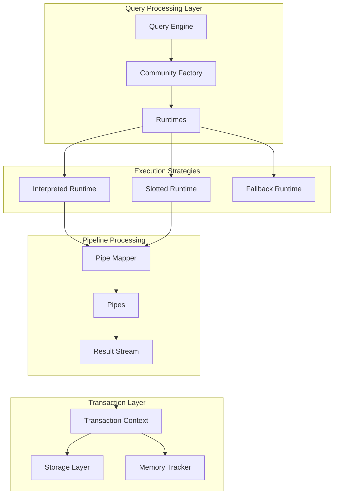
```mermaid
graph TB
subgraph "Query Processing Layer"
QE[Query Engine]
CF[Community Factory]
RT[Runtimes]
end
subgraph "Execution Strategies"
IR[Interpreted Runtime]
SR[Slotted Runtime]
FR[Fallback Runtime]
end
subgraph "Pipeline Processing"
PM[Pipe Mapper]
PP[Pipes]
RS[Result Stream]
end
subgraph "Transaction Layer"
TC[Transaction Context]
SL[Storage Layer]
ML[Memory Tracker]
end
QE --> CF
CF --> RT
RT --> IR
RT --> SR
RT --> FR
IR --> PM
SR --> PM
PM --> PP
PP --> RS
RS --> TC
TC --> SL
TC --> ML
```

**Diagram sources**
- [ExecutionEngine.scala](file://community/cypher/cypher/src/main/scala/org/neo4j/cypher/internal/ExecutionEngine.scala#L66-L75)
- [CommunityRuntimeFactory.scala](file://community/cypher/cypher/src/main/scala/org/neo4j/cypher/internal/CommunityRuntimeFactory.scala#L27-L63)

The architecture consists of several key components:

- **Query Engine**: Central orchestrator that manages query lifecycle and runtime selection
- **Runtime Factory**: Creates appropriate execution runtime based on query characteristics
- **Execution Runtimes**: Two distinct execution engines with different optimization strategies
- **Pipe Mappers**: Convert logical plans to executable pipeline components
- **Transaction Context**: Manages database state and resource allocation
- **Storage Layer**: Provides low-level data access and persistence

**Section sources**
- [ExecutionEngine.scala](file://community/cypher/cypher/src/main/scala/org/neo4j/cypher/internal/ExecutionEngine.scala#L66-L100)
- [CommunityRuntimeFactory.scala](file://community/cypher/cypher/src/main/scala/org/neo4j/cypher/internal/CommunityRuntimeFactory.scala#L27-L63)

## Runtime Engine Implementation

### Interpreted vs Slotted Runtimes

The Neo4j Cypher execution engine implements two fundamentally different runtime strategies, each optimized for different use cases and performance characteristics.

#### Interpreted Runtime

The interpreted runtime provides maximum flexibility and compatibility with complex queries. It executes queries by interpreting the logical plan directly, allowing for dynamic behavior and comprehensive feature support.

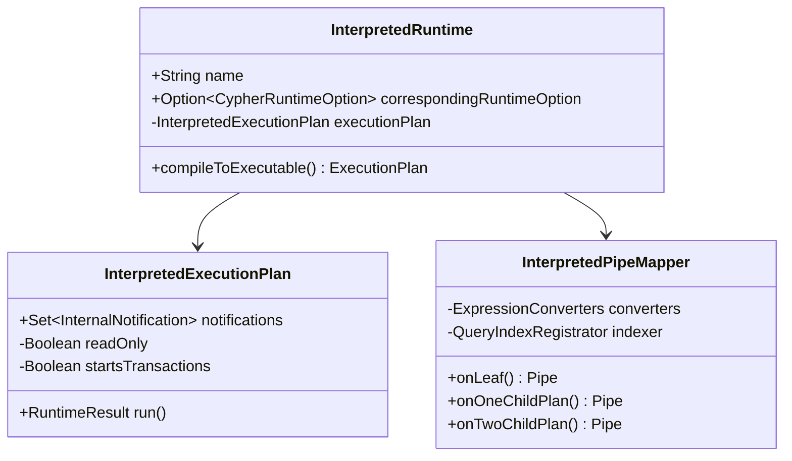
```mermaid
classDiagram
class InterpretedRuntime {
+String name
+Option~CypherRuntimeOption~ correspondingRuntimeOption
+compileToExecutable() ExecutionPlan
-InterpretedExecutionPlan executionPlan
}
class InterpretedExecutionPlan {
+RuntimeResult run()
+Set~InternalNotification~ notifications
-Boolean readOnly
-Boolean startsTransactions
}
class InterpretedPipeMapper {
+onLeaf() Pipe
+onOneChildPlan() Pipe
+onTwoChildPlan() Pipe
-ExpressionConverters converters
-QueryIndexRegistrator indexer
}
InterpretedRuntime --> InterpretedExecutionPlan
InterpretedRuntime --> InterpretedPipeMapper
```

**Diagram sources**
- [InterpretedRuntime.scala](file://community/cypher/cypher/src/main/scala/org/neo4j/cypher/internal/InterpretedRuntime.scala#L62-L190)
- [InterpretedPipeMapper.scala](file://community/cypher/interpreted-runtime/src/main/scala/org/neo4j/cypher/internal/runtime/interpreted/InterpretedPipeMapper.scala#L375-L400)

#### Slotted Runtime

The slotted runtime optimizes for performance by using a slot-based memory layout that reduces garbage collection pressure and improves cache locality. It's particularly effective for analytical queries and large result sets.

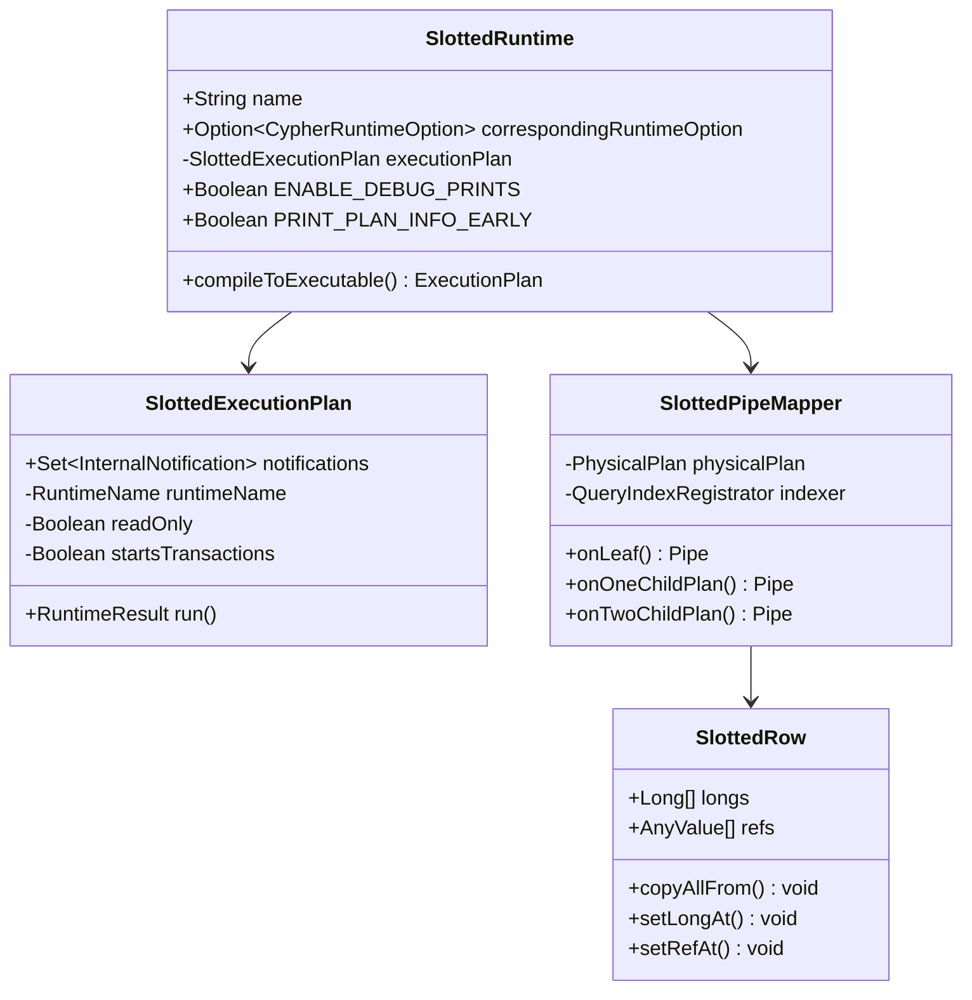
```mermaid
classDiagram
class SlottedRuntime {
+String name
+Option~CypherRuntimeOption~ correspondingRuntimeOption
+compileToExecutable() ExecutionPlan
-SlottedExecutionPlan executionPlan
+Boolean ENABLE_DEBUG_PRINTS
+Boolean PRINT_PLAN_INFO_EARLY
}
class SlottedExecutionPlan {
+RuntimeResult run()
+Set~InternalNotification~ notifications
-RuntimeName runtimeName
-Boolean readOnly
-Boolean startsTransactions
}
class SlottedPipeMapper {
+onLeaf() Pipe
+onOneChildPlan() Pipe
+onTwoChildPlan() Pipe
-PhysicalPlan physicalPlan
-QueryIndexRegistrator indexer
}
class SlottedRow {
+Long[] longs
+AnyValue[] refs
+copyAllFrom() void
+setLongAt() void
+setRefAt() void
}
SlottedRuntime --> SlottedExecutionPlan
SlottedRuntime --> SlottedPipeMapper
SlottedPipeMapper --> SlottedRow
```

**Diagram sources**
- [SlottedRuntime.scala](file://community/cypher/cypher/src/main/scala/org/neo4j/cypher/internal/SlottedRuntime.scala#L48-L203)
- [SlottedRow.scala](file://community/cypher/slotted-runtime/src/main/scala/org/neo4j/cypher/internal/runtime/slotted/SlottedRow.scala#L132-L163)

### Runtime Selection Strategy

The runtime factory implements intelligent selection logic to choose the optimal execution strategy:

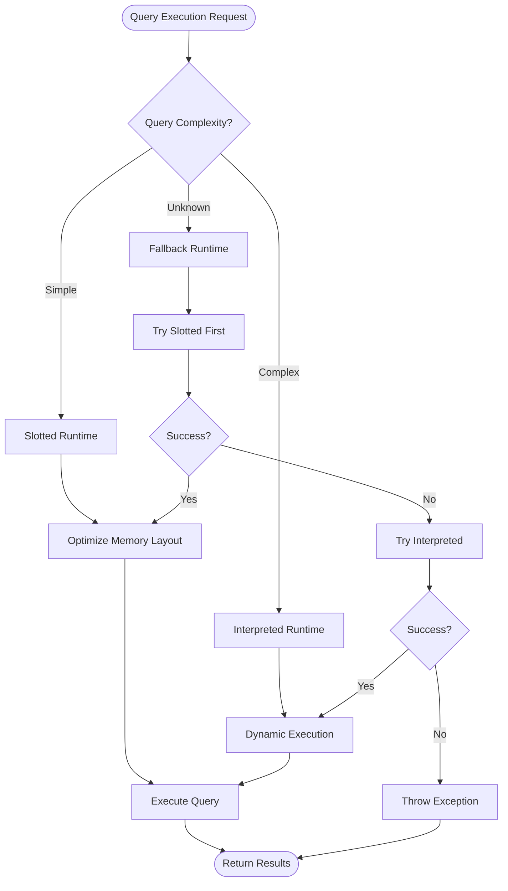
```mermaid
flowchart TD
Start([Query Execution Request]) --> CheckQuery{Query Complexity?}
CheckQuery --> |Simple| SlottedRuntime[Slotted Runtime]
CheckQuery --> |Complex| InterpretedRuntime[Interpreted Runtime]
CheckQuery --> |Unknown| FallbackRuntime[Fallback Runtime]
SlottedRuntime --> OptimizeMemory[Optimize Memory Layout]
InterpretedRuntime --> DynamicExecution[Dynamic Execution]
FallbackRuntime --> TrySlotted[Try Slotted First]
TrySlotted --> SlottedSuccess{Success?}
SlottedSuccess --> |Yes| OptimizeMemory
SlottedSuccess --> |No| TryInterpreted[Try Interpreted]
TryInterpreted --> InterpretSuccess{Success?}
InterpretSuccess --> |Yes| DynamicExecution
InterpretSuccess --> |No| ThrowError[Throw Exception]
OptimizeMemory --> Execute[Execute Query]
DynamicExecution --> Execute
Execute --> End([Return Results])
ThrowError --> End
```

**Diagram sources**
- [CommunityRuntimeFactory.scala](file://community/cypher/cypher/src/main/scala/org/neo4j/cypher/internal/CommunityRuntimeFactory.scala#L46-L63)

**Section sources**
- [InterpretedRuntime.scala](file://community/cypher/cypher/src/main/scala/org/neo4j/cypher/internal/InterpretedRuntime.scala#L62-L190)
- [SlottedRuntime.scala](file://community/cypher/cypher/src/main/scala/org/neo4j/cypher/internal/SlottedRuntime.scala#L48-L203)
- [CommunityRuntimeFactory.scala](file://community/cypher/cypher/src/main/scala/org/neo4j/cypher/internal/CommunityRuntimeFactory.scala#L27-L63)

## Execution Plans and Result Streams

### Domain Model of Execution Plans

The execution plan system provides a structured approach to query execution with clear separation between planning and execution phases.

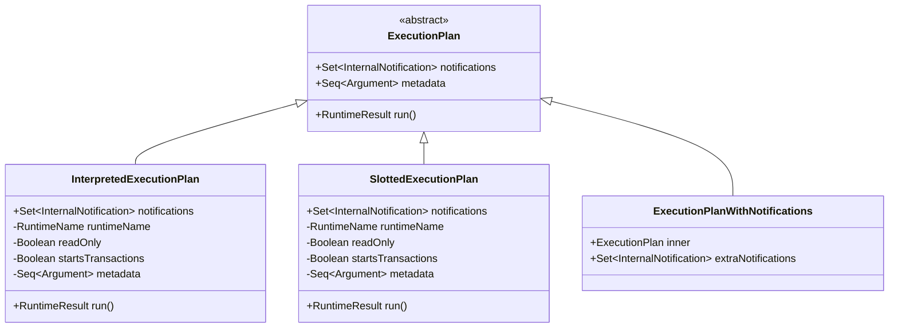
```mermaid
classDiagram
class ExecutionPlan {
<<abstract>>
+RuntimeResult run()
+Set~InternalNotification~ notifications
+Seq~Argument~ metadata
}
class InterpretedExecutionPlan {
+RuntimeResult run()
+Set~InternalNotification~ notifications
-RuntimeName runtimeName
-Boolean readOnly
-Boolean startsTransactions
-Seq~Argument~ metadata
}
class SlottedExecutionPlan {
+RuntimeResult run()
+Set~InternalNotification~ notifications
-RuntimeName runtimeName
-Boolean readOnly
-Boolean startsTransactions
-Seq~Argument~ metadata
}
class ExecutionPlanWithNotifications {
+ExecutionPlan inner
+Set~InternalNotification~ extraNotifications
}
ExecutionPlan <|-- InterpretedExecutionPlan
ExecutionPlan <|-- SlottedExecutionPlan
ExecutionPlan <|-- ExecutionPlanWithNotifications
```

**Diagram sources**
- [CypherRuntime.scala](file://community/cypher/cypher/src/main/scala/org/neo4j/cypher/internal/CypherRuntime.scala#L157-L190)

### Result Stream Processing

The result stream system implements a demand-driven approach to query execution, allowing for efficient memory usage and responsive query processing.

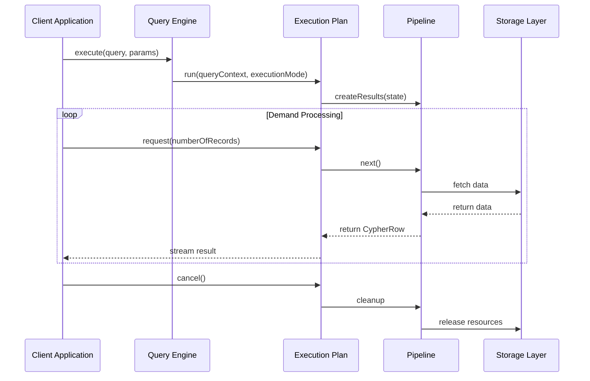
```mermaid
sequenceDiagram
participant Client as Client Application
participant Engine as Query Engine
participant Plan as Execution Plan
participant Pipe as Pipeline
participant Storage as Storage Layer
Client->>Engine : execute(query, params)
Engine->>Plan : run(queryContext, executionMode)
Plan->>Pipe : createResults(state)
loop Demand Processing
Client->>Plan : request(numberOfRecords)
Plan->>Pipe : next()
Pipe->>Storage : fetch data
Storage-->>Pipe : return data
Pipe-->>Plan : return CypherRow
Plan-->>Client : stream result
end
Client->>Plan : cancel()
Plan->>Pipe : cleanup
Pipe->>Storage : release resources
```

**Diagram sources**
- [PipeExecutionResult.scala](file://community/cypher/interpreted-runtime/src/main/scala/org/neo4j/cypher/internal/runtime/interpreted/PipeExecutionResult.scala#L72-L108)
- [ResultSubscriber.java](file://community/cypher/cypher/src/main/java/org/neo4j/cypher/internal/javacompat/ResultSubscriber.java#L327-L339)

### Query State Management

The query state system maintains execution context and coordinates between different pipeline components:

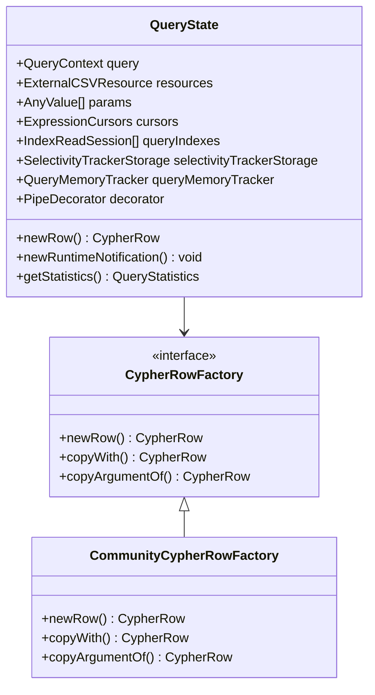
```mermaid
classDiagram
class QueryState {
+QueryContext query
+ExternalCSVResource resources
+AnyValue[] params
+ExpressionCursors cursors
+IndexReadSession[] queryIndexes
+SelectivityTrackerStorage selectivityTrackerStorage
+QueryMemoryTracker queryMemoryTracker
+PipeDecorator decorator
+newRow() CypherRow
+newRuntimeNotification() void
+getStatistics() QueryStatistics
}
class CypherRowFactory {
<<interface>>
+newRow() CypherRow
+copyWith() CypherRow
+copyArgumentOf() CypherRow
}
class CommunityCypherRowFactory {
+newRow() CypherRow
+copyWith() CypherRow
+copyArgumentOf() CypherRow
}
QueryState --> CypherRowFactory
CypherRowFactory <|-- CommunityCypherRowFactory
```

**Diagram sources**
- [QueryState.scala](file://community/cypher/interpreted-runtime/src/main/scala/org/neo4j/cypher/internal/runtime/interpreted/pipes/QueryState.scala#L54-L100)

**Section sources**
- [QueryState.scala](file://community/cypher/interpreted-runtime/src/main/scala/org/neo4j/cypher/internal/runtime/interpreted/pipes/QueryState.scala#L54-L473)
- [PipeExecutionResult.scala](file://community/cypher/interpreted-runtime/src/main/scala/org/neo4j/cypher/internal/runtime/interpreted/PipeExecutionResult.scala#L29-L109)

## Transaction Context Integration

### Transaction Lifecycle Management

The execution engine integrates closely with Neo4j's transaction system to ensure consistency and proper resource management:

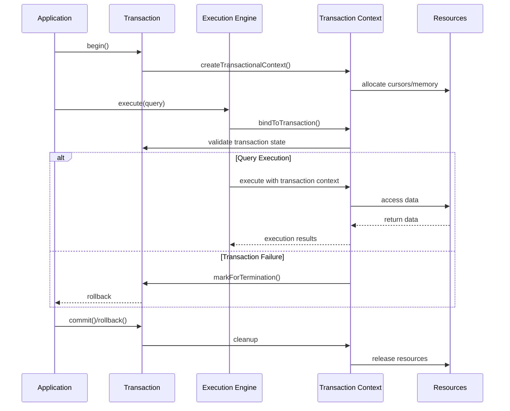
```mermaid
sequenceDiagram
participant App as Application
participant Tx as Transaction
participant Engine as Execution Engine
participant Context as Transaction Context
participant Resources as Resources
App->>Tx : begin()
Tx->>Context : createTransactionalContext()
Context->>Resources : allocate cursors/memory
App->>Engine : execute(query)
Engine->>Context : bindToTransaction()
Context->>Tx : validate transaction state
alt Query Execution
Engine->>Context : execute with transaction context
Context->>Resources : access data
Resources-->>Context : return data
Context-->>Engine : execution results
else Transaction Failure
Context->>Tx : markForTermination()
Tx-->>App : rollback
end
App->>Tx : commit()/rollback()
Tx->>Context : cleanup
Context->>Resources : release resources
```

**Diagram sources**
- [ExecutionEngine.scala](file://community/cypher/cypher/src/main/scala/org/neo4j/cypher/internal/ExecutionEngine.scala#L112-L255)

### Resource Tracking and Cleanup

The system implements comprehensive resource tracking to prevent leaks and ensure proper cleanup:

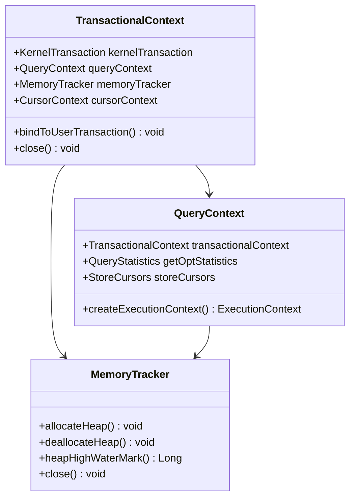
```mermaid
classDiagram
class TransactionalContext {
+KernelTransaction kernelTransaction
+QueryContext queryContext
+MemoryTracker memoryTracker
+CursorContext cursorContext
+bindToUserTransaction() void
+close() void
}
class QueryContext {
+TransactionalContext transactionalContext
+QueryStatistics getOptStatistics
+StoreCursors storeCursors
+createExecutionContext() ExecutionContext
}
class MemoryTracker {
+allocateHeap() void
+deallocateHeap() void
+heapHighWaterMark() Long
+close() void
}
TransactionalContext --> QueryContext
TransactionalContext --> MemoryTracker
QueryContext --> MemoryTracker
```

**Section sources**
- [ExecutionEngine.scala](file://community/cypher/cypher/src/main/scala/org/neo4j/cypher/internal/ExecutionEngine.scala#L112-L255)

## Storage Layer Interaction

### Data Access Patterns

The execution engine interacts with the storage layer through well-defined interfaces that abstract storage-specific implementations:

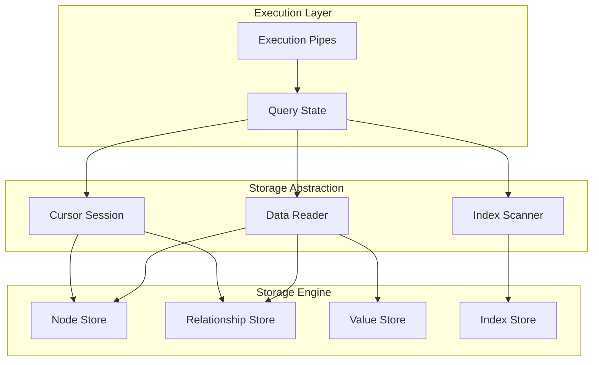
```mermaid
graph TB
subgraph "Execution Layer"
EP[Execution Pipes]
QS[Query State]
end
subgraph "Storage Abstraction"
DR[Data Reader]
IS[Index Scanner]
CS[Cursor Session]
end
subgraph "Storage Engine"
NS[Node Store]
RS[Relationship Store]
VS[Value Store]
IS2[Index Store]
end
EP --> QS
QS --> DR
QS --> IS
QS --> CS
DR --> NS
DR --> RS
DR --> VS
IS --> IS2
CS --> NS
CS --> RS
```

**Diagram sources**
- [NodeByLabelScanPipe.scala](file://community/cypher/interpreted-runtime/src/main/scala/org/neo4j/cypher/internal/runtime/interpreted/pipes/NodeByLabelScanPipe.scala#L33-L44)

### Index Utilization

The execution engine leverages Neo4j's indexing system to optimize query performance:

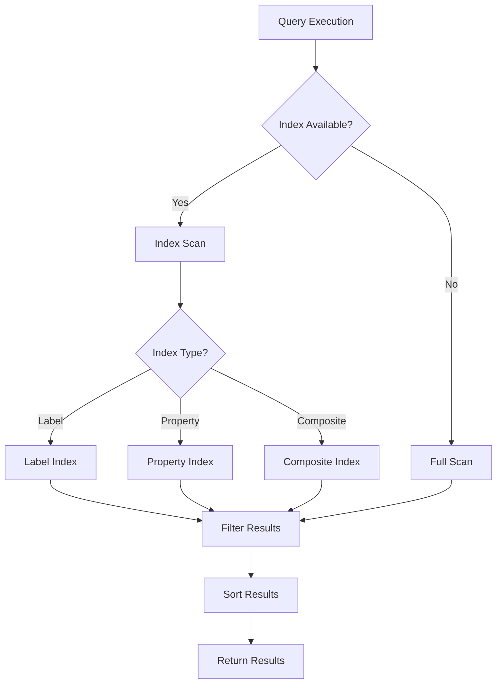
```mermaid
flowchart TD
Query[Query Execution] --> IndexCheck{Index Available?}
IndexCheck --> |Yes| IndexScan[Index Scan]
IndexCheck --> |No| FullScan[Full Scan]
IndexScan --> IndexType{Index Type?}
IndexType --> |Label| LabelIndex[Label Index]
IndexType --> |Property| PropertyIndex[Property Index]
IndexType --> |Composite| CompositeIndex[Composite Index]
LabelIndex --> FilterResults[Filter Results]
PropertyIndex --> FilterResults
CompositeIndex --> FilterResults
FullScan --> FilterResults
FilterResults --> SortResults[Sort Results]
SortResults --> ReturnResults[Return Results]
```

**Section sources**
- [NodeByLabelScanPipe.scala](file://community/cypher/interpreted-runtime/src/main/scala/org/neo4j/cypher/internal/runtime/interpreted/pipes/NodeByLabelScanPipe.scala#L33-L44)

## Query Operation Processing

### Scan Operations

Scan operations represent the fundamental data access patterns in Cypher queries:

#### Node Label Scan
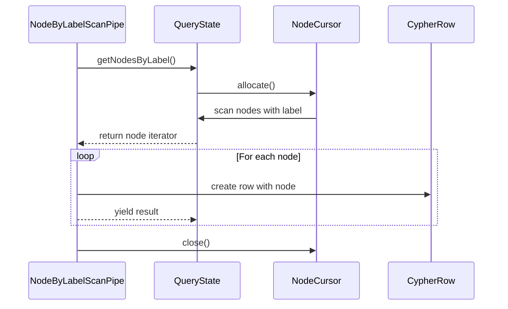
```mermaid
sequenceDiagram
participant Pipe as NodeByLabelScanPipe
participant State as QueryState
participant Cursor as NodeCursor
participant Row as CypherRow
Pipe->>State : getNodesByLabel()
State->>Cursor : allocate()
Cursor->>State : scan nodes with label
State-->>Pipe : return node iterator
loop For each node
Pipe->>Row : create row with node
Pipe-->>State : yield result
end
Pipe->>Cursor : close()
```

**Diagram sources**
- [NodeByLabelScanPipe.scala](file://community/cypher/interpreted-runtime/src/main/scala/org/neo4j/cypher/internal/runtime/interpreted/pipes/NodeByLabelScanPipe.scala#L33-L44)

#### Relationship Scan
The relationship scan operations follow similar patterns but operate on relationship data instead of nodes.

### Join Operations

Join operations combine data from multiple sources using various strategies:

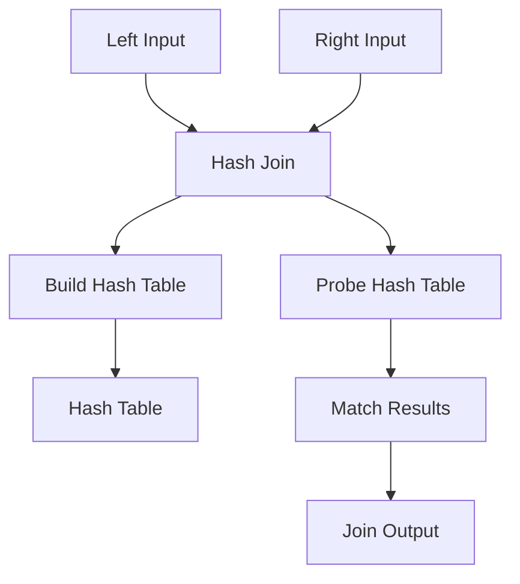
```mermaid
flowchart TD
LeftInput[Left Input] --> HashJoin[Hash Join]
RightInput[Right Input] --> HashJoin
HashJoin --> BuildPhase[Build Hash Table]
HashJoin --> ProbePhase[Probe Hash Table]
BuildPhase --> HashTable[Hash Table]
ProbePhase --> MatchResults[Match Results]
MatchResults --> Output[Join Output]
```

### Aggregation Operations

Aggregation operations process data groups and compute summary statistics:

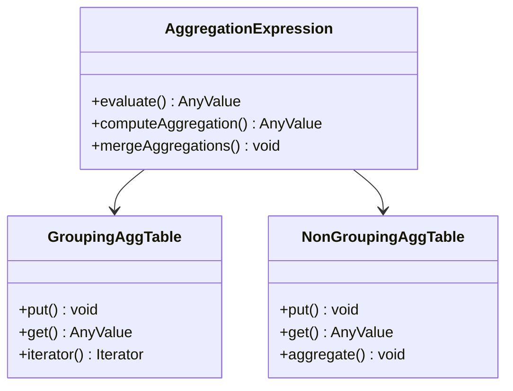
```mermaid
classDiagram
class AggregationExpression {
+evaluate() AnyValue
+computeAggregation() AnyValue
+mergeAggregations() void
}
class GroupingAggTable {
+put() void
+get() AnyValue
+iterator() Iterator
}
class NonGroupingAggTable {
+put() void
+get() AnyValue
+aggregate() void
}
AggregationExpression --> GroupingAggTable
AggregationExpression --> NonGroupingAggTable
```

**Section sources**
- [NodeByLabelScanPipe.scala](file://community/cypher/interpreted-runtime/src/main/scala/org/neo4j/cypher/internal/runtime/interpreted/pipes/NodeByLabelScanPipe.scala#L33-L44)

## Error Handling and Exception Management

### Exception Hierarchy

The execution engine implements a comprehensive exception hierarchy to handle different types of failures gracefully:

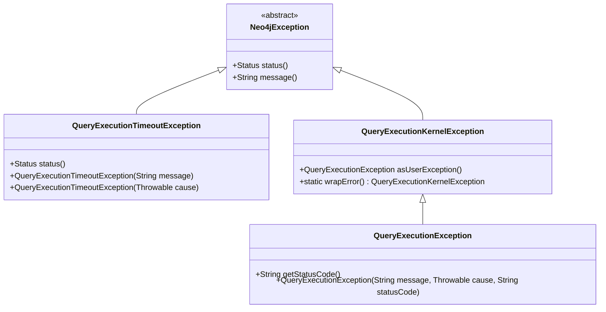
```mermaid
classDiagram
class Neo4jException {
<<abstract>>
+Status status()
+String message()
}
class QueryExecutionTimeoutException {
+Status status()
+QueryExecutionTimeoutException(String message)
+QueryExecutionTimeoutException(Throwable cause)
}
class QueryExecutionKernelException {
+QueryExecutionException asUserException()
+static wrapError() QueryExecutionKernelException
}
class QueryExecutionException {
+String getStatusCode()
+QueryExecutionException(String message, Throwable cause, String statusCode)
}
Neo4jException <|-- QueryExecutionTimeoutException
Neo4jException <|-- QueryExecutionKernelException
QueryExecutionKernelException <|-- QueryExecutionException
```

**Diagram sources**
- [QueryExecutionTimeoutException.java](file://community/neo4j-exceptions/src/main/java/org/neo4j/exceptions/QueryExecutionTimeoutException.java#L25-L46)
- [QueryExecutionKernelException.java](file://community/kernel/src/main/java/org/neo4j/kernel/impl/query/QueryExecutionKernelException.java#L27-L51)
- [QueryExecutionException.java](file://community/graphdb-api/src/main/java/org/neo4j/graphdb/QueryExecutionException.java#L30-L53)

### Error Propagation Strategy

The system implements a multi-layered error handling approach:

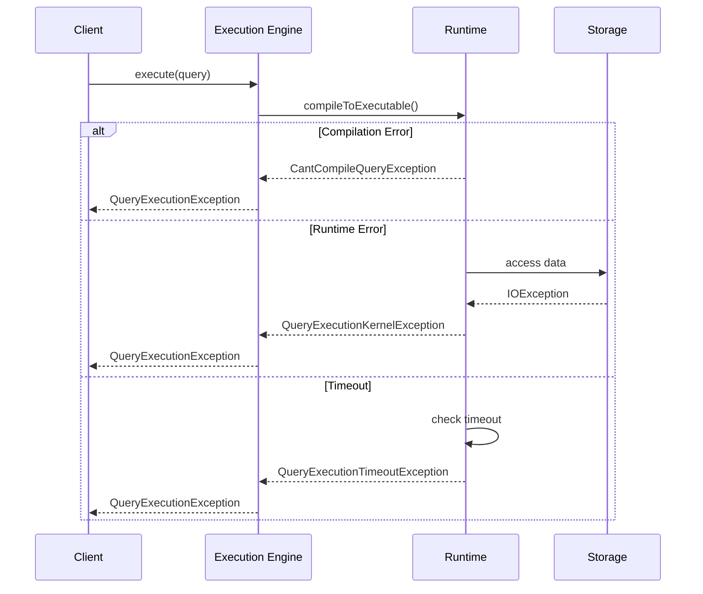
```mermaid
sequenceDiagram
participant Client as Client
participant Engine as Execution Engine
participant Runtime as Runtime
participant Storage as Storage
Client->>Engine : execute(query)
Engine->>Runtime : compileToExecutable()
alt Compilation Error
Runtime-->>Engine : CantCompileQueryException
Engine-->>Client : QueryExecutionException
else Runtime Error
Runtime->>Storage : access data
Storage-->>Runtime : IOException
Runtime-->>Engine : QueryExecutionKernelException
Engine-->>Client : QueryExecutionException
else Timeout
Runtime->>Runtime : check timeout
Runtime-->>Engine : QueryExecutionTimeoutException
Engine-->>Client : QueryExecutionException
end
```

**Diagram sources**
- [ExecutionEngine.scala](file://community/cypher/cypher/src/main/scala/org/neo4j/cypher/internal/ExecutionEngine.scala#L218-L255)

### Resource Cleanup on Failure

The system ensures proper resource cleanup even when errors occur:

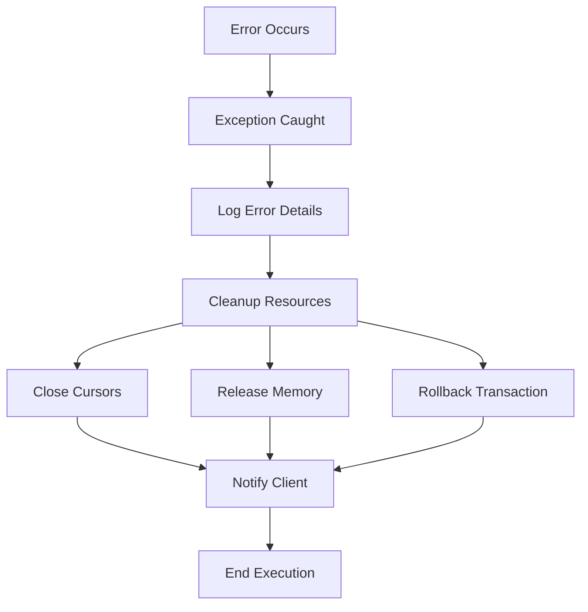
```mermaid
flowchart TD
Error[Error Occurs] --> Catch[Exception Caught]
Catch --> LogError[Log Error Details]
LogError --> CleanupResources[Cleanup Resources]
CleanupResources --> CloseCursors[Close Cursors]
CleanupResources --> ReleaseMemory[Release Memory]
CleanupResources --> RollbackTx[Rollback Transaction]
CloseCursors --> NotifyClient[Notify Client]
ReleaseMemory --> NotifyClient
RollbackTx --> NotifyClient
NotifyClient --> End[End Execution]
```

**Section sources**
- [QueryExecutionTimeoutException.java](file://community/neo4j-exceptions/src/main/java/org/neo4j/exceptions/QueryExecutionTimeoutException.java#L25-L46)
- [QueryExecutionKernelException.java](file://community/kernel/src/main/java/org/neo4j/kernel/impl/query/QueryExecutionKernelException.java#L27-L51)

## Performance Optimization and Monitoring

### Memory Management

The execution engine implements sophisticated memory management strategies to optimize performance and prevent memory leaks:

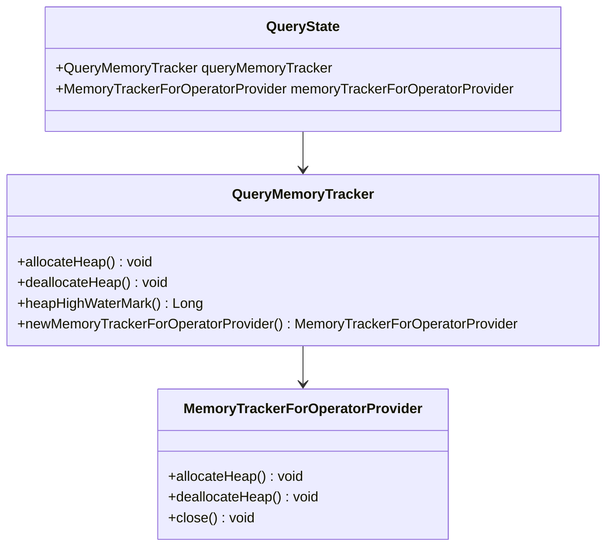
```mermaid
classDiagram
class QueryMemoryTracker {
+allocateHeap() void
+deallocateHeap() void
+heapHighWaterMark() Long
+newMemoryTrackerForOperatorProvider() MemoryTrackerForOperatorProvider
}
class MemoryTrackerForOperatorProvider {
+allocateHeap() void
+deallocateHeap() void
+close() void
}
class QueryState {
+QueryMemoryTracker queryMemoryTracker
+MemoryTrackerForOperatorProvider memoryTrackerForOperatorProvider
}
QueryState --> QueryMemoryTracker
QueryMemoryTracker --> MemoryTrackerForOperatorProvider
```

### Performance Monitoring

The system provides comprehensive monitoring capabilities for query performance analysis:

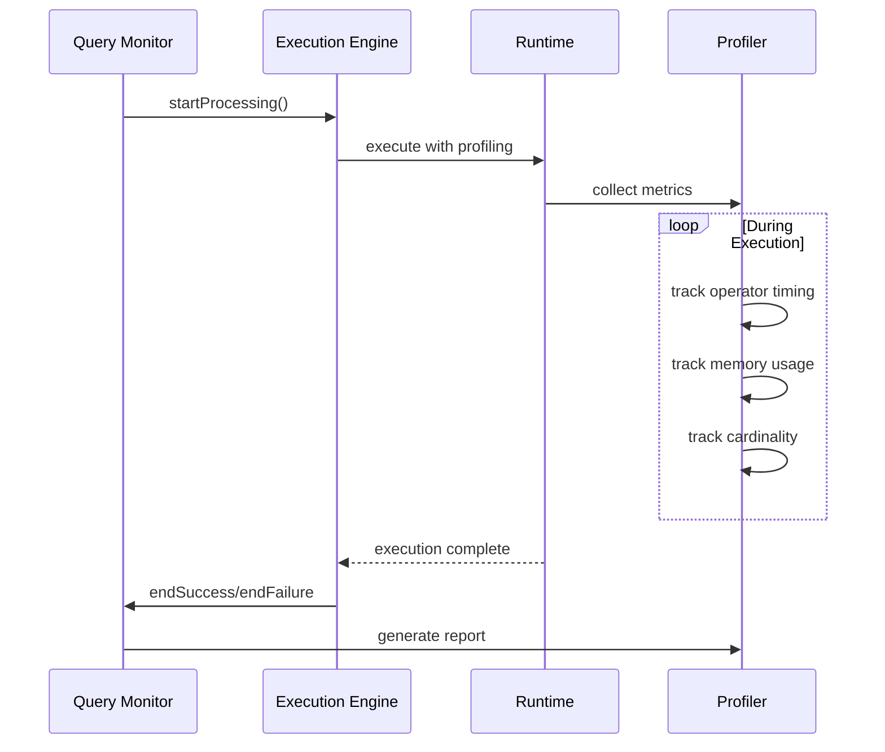
```mermaid
sequenceDiagram
participant Monitor as Query Monitor
participant Engine as Execution Engine
participant Runtime as Runtime
participant Profiler as Profiler
Monitor->>Engine : startProcessing()
Engine->>Runtime : execute with profiling
Runtime->>Profiler : collect metrics
loop During Execution
Profiler->>Profiler : track operator timing
Profiler->>Profiler : track memory usage
Profiler->>Profiler : track cardinality
end
Runtime-->>Engine : execution complete
Engine->>Monitor : endSuccess/endFailure
Monitor->>Profiler : generate report
```

### Optimization Strategies

The execution engine employs several optimization strategies:

| Strategy | Description | Impact |
|----------|-------------|---------|
| Slot-based Memory Layout | Reduces GC pressure in slotted runtime | 2-3x performance improvement |
| Index Utilization | Leverages database indexes for fast lookups | 10-100x speedup for indexed queries |
| Lazy Evaluation | Defers computation until results are needed | Reduced memory usage, faster startup |
| Result Streaming | Processes results incrementally | Constant memory usage regardless of result size |
| Query Planning | Optimizes execution plan based on statistics | 5-20x performance improvement |

**Section sources**
- [QueryState.scala](file://community/cypher/interpreted-runtime/src/main/scala/org/neo4j/cypher/internal/runtime/interpreted/pipes/QueryState.scala#L35-L40)

## Usage Patterns and Best Practices

### Query Structure Optimization

Effective query patterns lead to better performance:

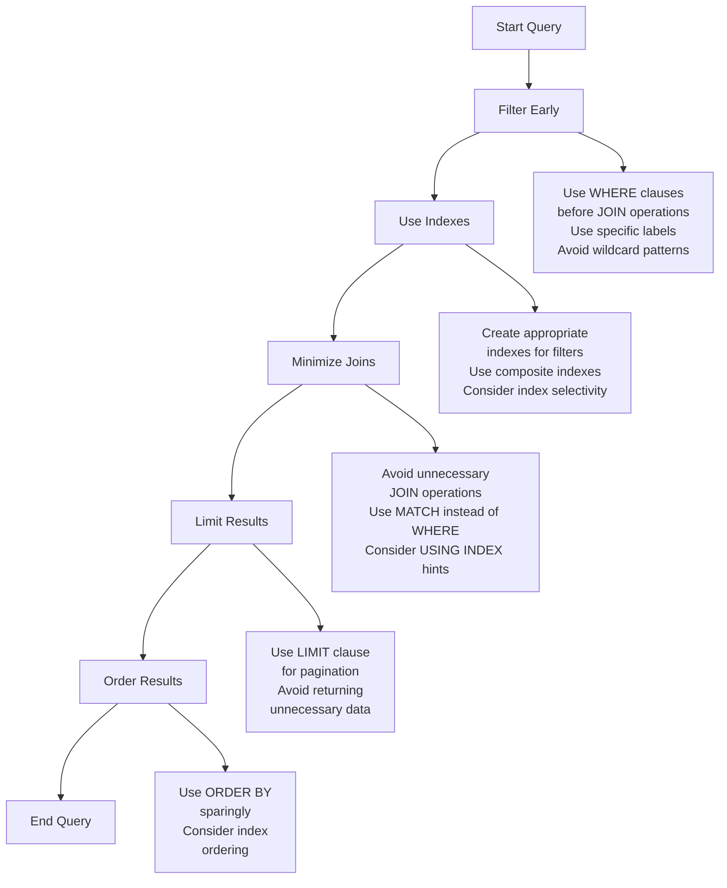
```mermaid
flowchart TD
Start[Start Query] --> FilterEarly[Filter Early]
FilterEarly --> UseIndexes[Use Indexes]
UseIndexes --> MinimizeJoins[Minimize Joins]
MinimizeJoins --> LimitResults[Limit Results]
LimitResults --> OrderResults[Order Results]
OrderResults --> End[End Query]
FilterEarly --> FilterTips[Use WHERE clauses<br/>before JOIN operations<br/>Use specific labels<br/>Avoid wildcard patterns]
UseIndexes --> IndexTips[Create appropriate<br/>indexes for filters<br/>Use composite indexes<br/>Consider index selectivity]
MinimizeJoins --> JoinTips[Avoid unnecessary<br/>JOIN operations<br/>Use MATCH instead of WHERE<br/>Consider USING INDEX hints]
LimitResults --> LimitTips[Use LIMIT clause<br/>for pagination<br/>Avoid returning<br/>unnecessary data]
OrderResults --> OrderTips[Use ORDER BY<br/>sparingly<br/>Consider index<br/>ordering]
```

### Memory Pressure Management

Managing memory pressure is crucial for long-running queries:

```mermaid
sequenceDiagram
participant Query as Long Query
participant Monitor as Memory Monitor
participant GC as Garbage Collector
participant Cleanup as Resource Cleanup
Query->>Monitor : check memory usage
Monitor->>Monitor : compare with thresholds
alt Memory Pressure High
Monitor->>Query : reduce batch size
Query->>Cleanup : release temporary resources
Cleanup->>GC : trigger GC
GC-->>Cleanup : cleanup complete
else Memory Pressure Normal
Monitor->>Query : continue execution
end
Query->>Monitor : report progress
Monitor->>Monitor : update metrics
```

### Timeout Handling

Proper timeout configuration prevents resource exhaustion:

| Timeout Type | Recommended Value | Purpose |
|--------------|------------------|---------|
| Statement Timeout | 30-120 seconds | Prevents runaway queries |
| Transaction Timeout | 60-300 seconds | Controls transaction duration |
| Connection Timeout | 30 seconds | Handles network issues |
| Query Planning Timeout | 10-30 seconds | Limits planning overhead |

**Section sources**
- [SlottedExecutionResultBuilderFactory.scala](file://community/cypher/slotted-runtime/src/main/scala/org/neo4j/cypher/internal/runtime/slotted/SlottedExecutionResultBuilderFactory.scala#L29-L86)

## Troubleshooting Guide

### Common Performance Issues

#### Memory-Related Problems

**Symptoms**: OutOfMemoryError, slow query performance, frequent GC pauses

**Diagnosis Steps**:
1. Check memory usage metrics
2. Analyze query execution plans
3. Review index utilization
4. Examine result set sizes

**Solutions**:
- Increase heap size appropriately
- Add missing indexes
- Use LIMIT clauses
- Optimize query structure
- Enable result streaming

#### Timeout Issues

**Symptoms**: QueryExecutionTimeoutException, hanging queries

**Diagnosis Steps**:
1. Monitor query execution time
2. Check for long-running operations
3. Analyze query complexity
4. Review system resource availability

**Solutions**:
- Increase timeout values
- Optimize query structure
- Add appropriate indexes
- Break complex queries into simpler parts
- Use pagination for large result sets

#### Index-Related Problems

**Symptoms**: Slow scans, full table scans, poor query performance

**Diagnosis Steps**:
1. Review query execution plans
2. Check index creation status
3. Verify index statistics
4. Analyze query patterns

**Solutions**:
- Create missing indexes
- Update index statistics
- Rebuild corrupted indexes
- Optimize composite indexes
- Consider index maintenance schedules

### Debugging Tools and Techniques

#### Query Profiling

Enable query profiling to identify performance bottlenecks:

```sql
PROFILE MATCH (n:Person)-[:KNOWS]->(m)
WHERE n.name = 'Alice'
RETURN m.name
```

#### Execution Plan Analysis

Examine execution plans to understand query behavior:

```sql
EXPLAIN MATCH (n:Person)-[:KNOWS]->(m)
WHERE n.name = 'Alice'
RETURN m.name
```

#### Resource Monitoring

Monitor system resources during query execution:

- Heap memory usage
- Garbage collection frequency
- CPU utilization
- Disk I/O patterns
- Network latency

**Section sources**
- [QueryExecutionTimeoutException.java](file://community/neo4j-exceptions/src/main/java/org/neo4j/exceptions/QueryExecutionTimeoutException.java#L25-L46)

## Conclusion

The Neo4j Cypher query execution component represents a sophisticated and highly optimized system for processing graph queries. Through its dual runtime architecture, the system balances flexibility and performance, providing developers with powerful tools for both development and production environments.

The interpreted runtime offers comprehensive feature support and dynamic behavior, making it ideal for complex queries and development scenarios. The slotted runtime, with its optimized memory layout and reduced garbage collection pressure, delivers exceptional performance for analytical workloads and large-scale data processing.

Key strengths of the execution system include:

- **Modular Architecture**: Clear separation of concerns enables easy maintenance and extension
- **Intelligent Runtime Selection**: Automatic choice of optimal execution strategy
- **Robust Error Handling**: Comprehensive exception hierarchy and graceful failure recovery
- **Performance Monitoring**: Built-in profiling and monitoring capabilities
- **Resource Management**: Sophisticated memory tracking and cleanup mechanisms

The system's design demonstrates best practices in database engine architecture, combining proven optimization techniques with modern performance engineering approaches. Its integration with Neo4j's transactional model and storage layer ensures consistency and reliability while maintaining high throughput and low latency.

For developers working with Neo4j, understanding the query execution component provides valuable insights into optimizing query performance, managing resources effectively, and troubleshooting issues when they arise. The combination of flexible runtime options, comprehensive error handling, and powerful monitoring capabilities makes this system a cornerstone of Neo4j's query processing infrastructure.