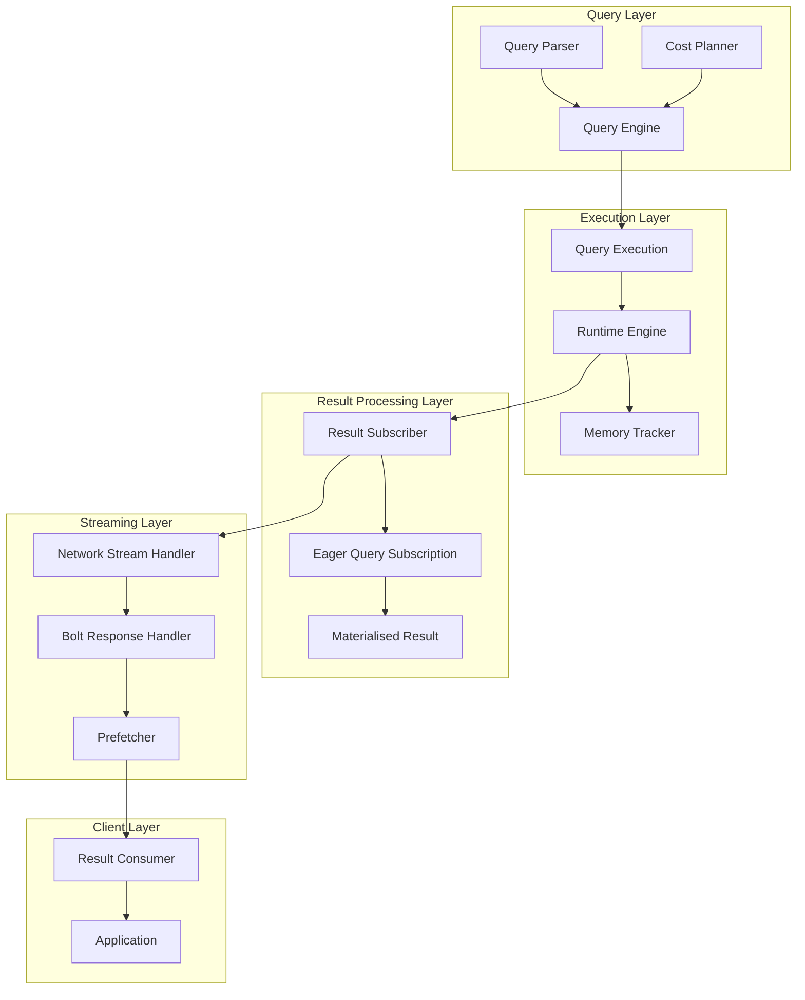
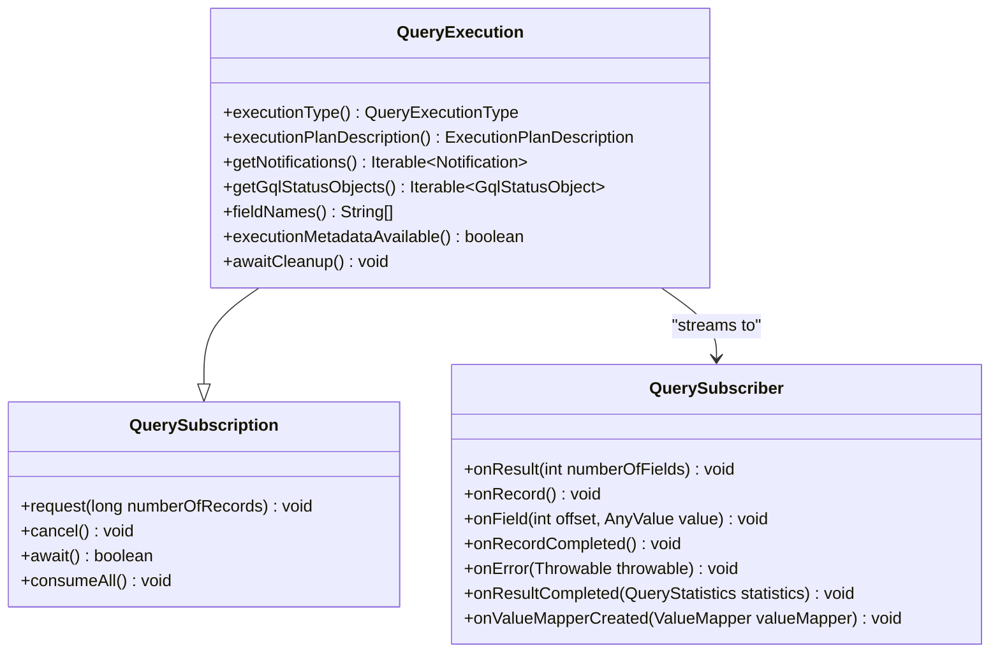
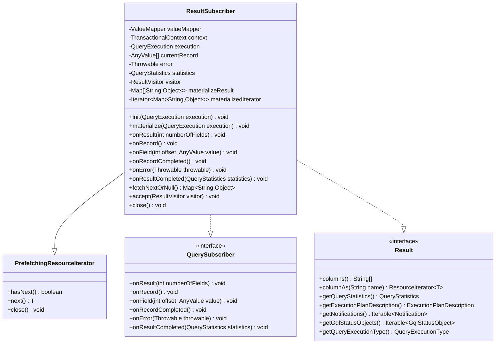
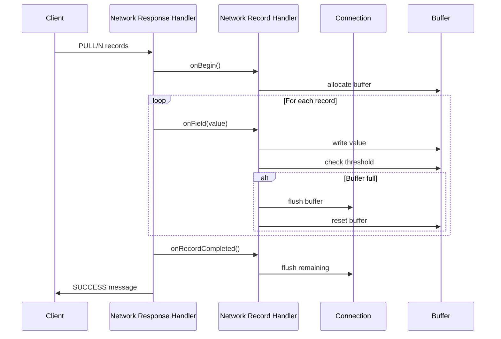
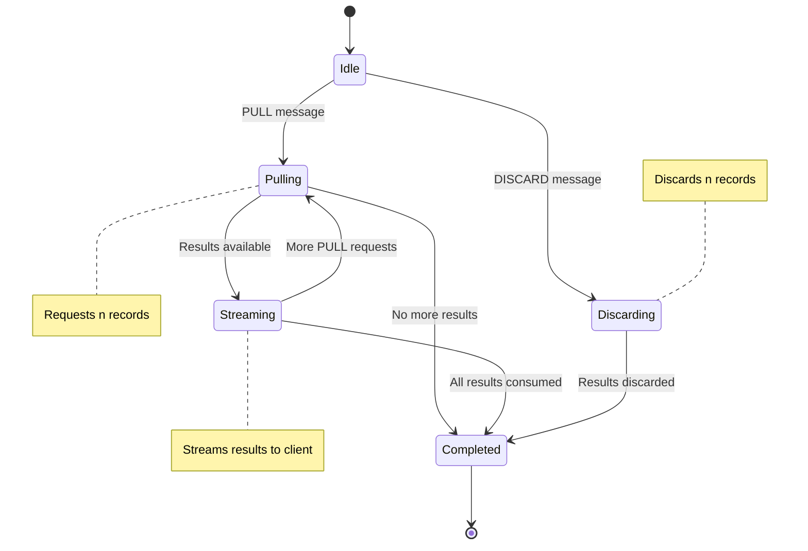
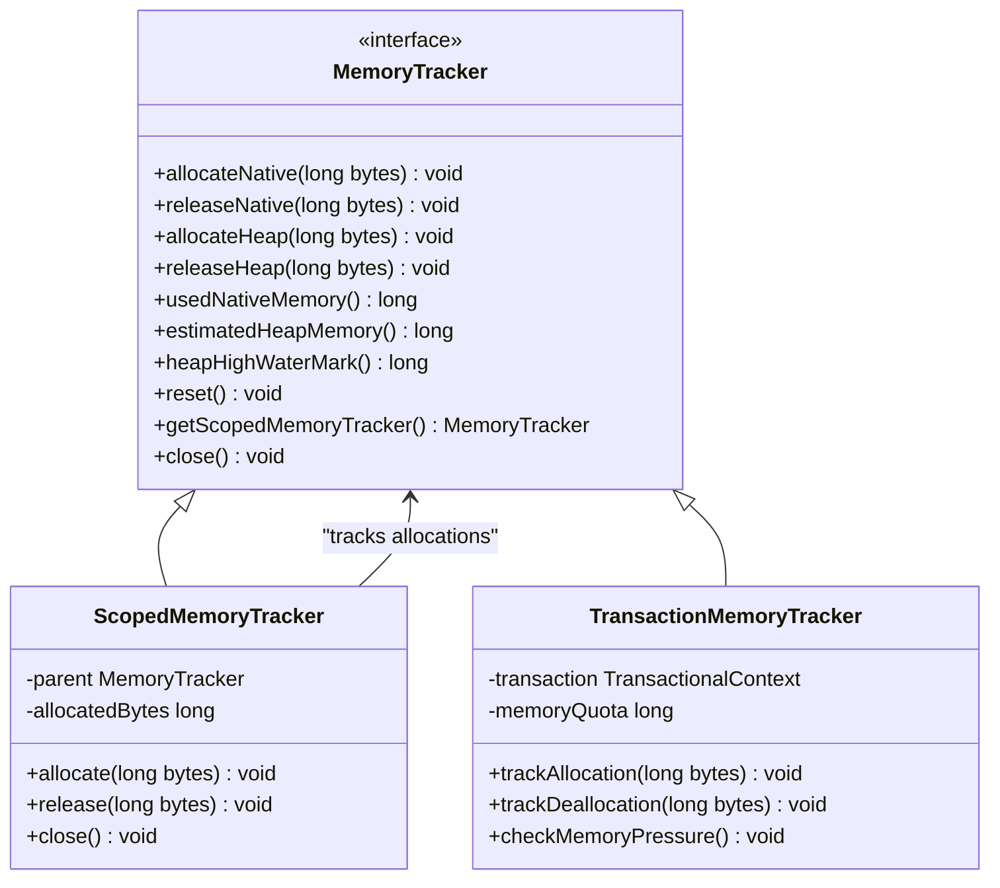
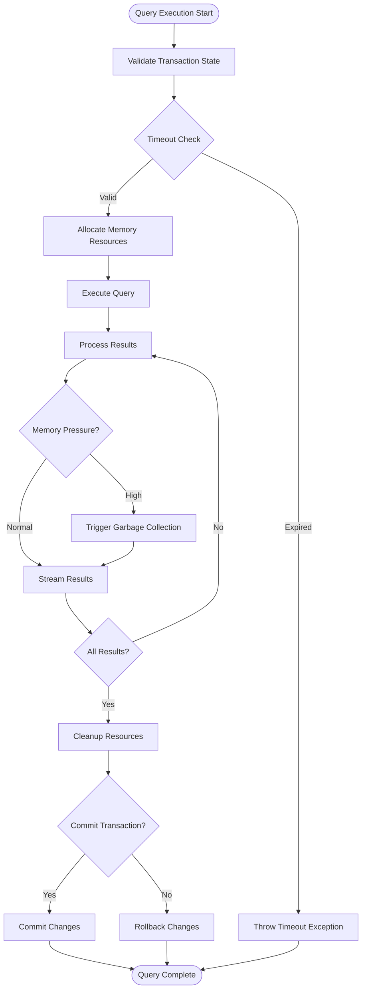
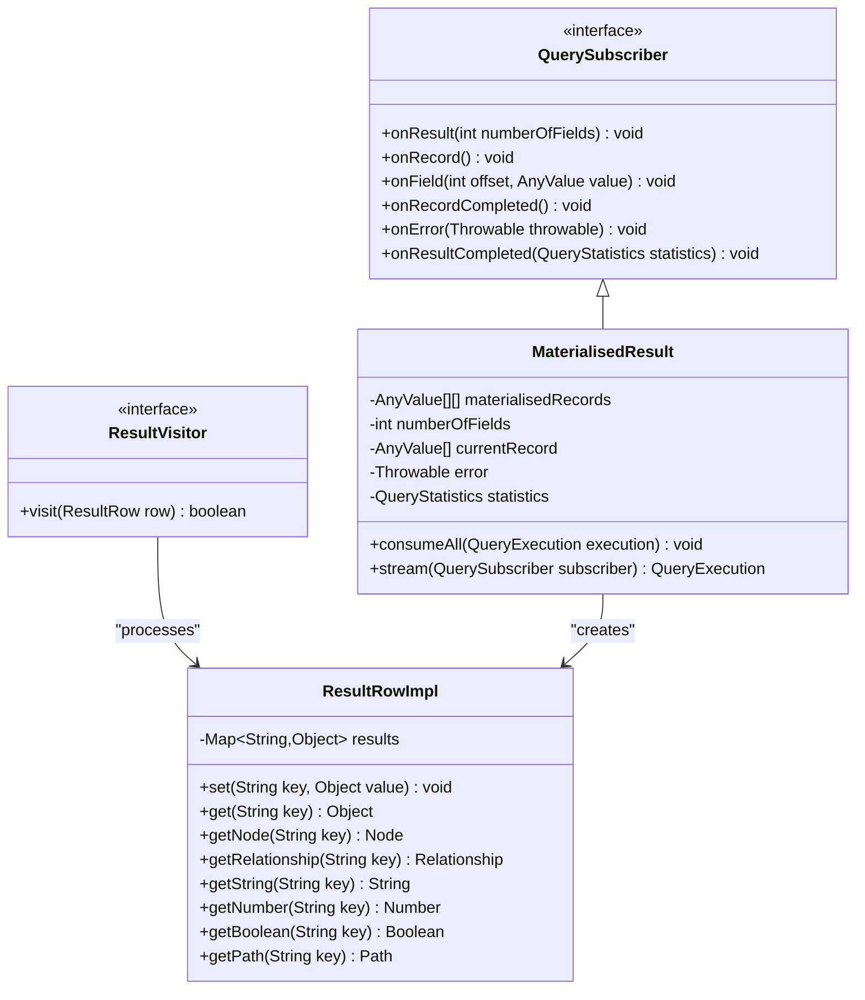
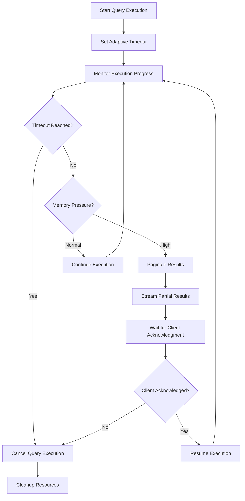
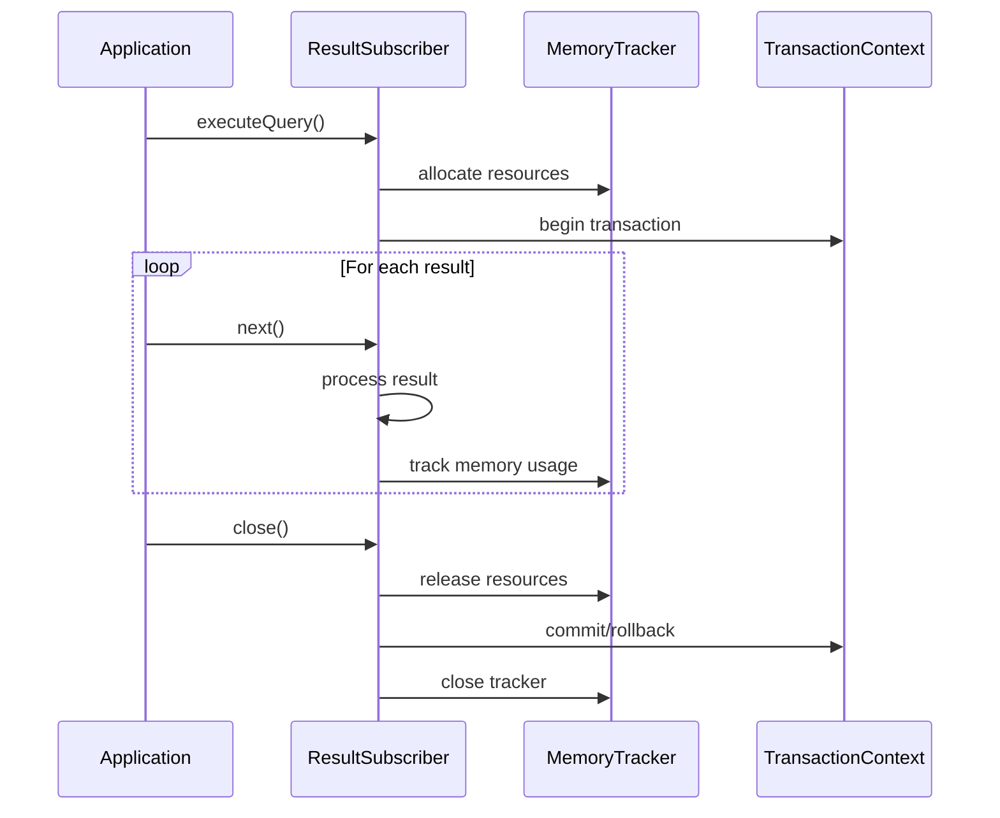

# Result Processing

<cite>
**Referenced Files in This Document**
- [ResultSubscriber.java](file://community/cypher/cypher/src/main/java/org/neo4j/cypher/internal/javacompat/ResultSubscriber.java)
- [MaterialisedResult.java](file://community/cypher/cypher/src/main/java/org/neo4j/cypher/internal/javacompat/MaterialisedResult.java)
- [QuerySubscription.java](file://community/kernel/src/main/java/org/neo4j/kernel/impl/query/QuerySubscription.java)
- [QuerySubscriber.java](file://community/kernel/src/main/java/org/neo4j/kernel/impl/query/QuerySubscriber.java)
- [QueryExecution.java](file://community/kernel/src/main/java/org/neo4j/kernel/impl/query/QueryExecution.java)
- [EagerQuerySubscription.java](file://community/cypher/runtime-util/src/main/java/org/neo4j/cypher/result/EagerQuerySubscription.java)
- [MemoryTracker.java](file://community/common/src/main/java/org/neo4j/memory/MemoryTracker.java)
- [StatementImpl.java](file://community/bolt/src/main/java/org/neo4j/bolt/tx/statement/StatementImpl.java)
- [NetworkResponseHandler.java](file://community/bolt/src/main/java/org/neo4j/bolt/protocol/common/fsm/response/NetworkResponseHandler.java)
- [PrefetchingResourceIterator.java](file://community/graphdb-api/src/main/java/org/neo4j/graphdb/Result.java)
- [ResultRowImpl.java](file://community/cypher/cypher/src/main/java/org/neo4j/cypher/internal/javacompat/ResultRowImpl.java)
- [BoltQueryExecutionImpl.java](file://community/fabric/fabric/src/main/java/org/neo4j/fabric/bolt/BoltQueryExecutionImpl.java)
- [RingRecentBuffer.java](file://community/data-collector/src/main/java/org/neo4j/internal/collector/RingRecentBuffer.java)
- [ProducerStep.java](file://community/import-util/src/main/java/org/neo4j/internal/batchimport/staging/ProducerStep.java)
- [Prefetcher.java](file://community/fabric/fabric/src/main/java/org/neo4j/fabric/stream/Prefetcher.java)
</cite>

## Table of Contents
1. [Introduction](#introduction)
2. [Architecture Overview](#architecture-overview)
3. [Result Processing Components](#result-processing-components)
4. [Streaming Protocols](#streaming-protocols)
5. [Memory Management](#memory-management)
6. [Transaction Boundaries](#transaction-boundaries)
7. [Result Subscribers](#result-subscribers)
8. [Common Issues and Solutions](#common-issues-and-solutions)
9. [Best Practices](#best-practices)
10. [Performance Considerations](#performance-considerations)

## Introduction

Neo4j's Cypher result processing system provides a sophisticated framework for materializing, streaming, and managing query results across various execution contexts. The system is designed to handle different query types (read, write, streaming) efficiently while maintaining strict transaction boundaries and providing robust memory management capabilities.

The result processing architecture supports both eager materialization for small result sets and lazy streaming for large datasets, with built-in mechanisms for handling timeouts, memory pressure, and resource cleanup. This comprehensive system ensures optimal performance across diverse use cases while maintaining data consistency and transaction safety.

## Architecture Overview

The Cypher result processing system follows a layered architecture that separates concerns between query execution, result materialization, and client communication:



**Diagram sources**
- [QueryExecution.java](file://community/kernel/src/main/java/org/neo4j/kernel/impl/query/QueryExecution.java#L31-L78)
- [ResultSubscriber.java](file://community/cypher/cypher/src/main/java/org/neo4j/cypher/internal/javacompat/ResultSubscriber.java#L57-L407)
- [NetworkResponseHandler.java](file://community/bolt/src/main/java/org/neo4j/bolt/protocol/common/fsm/response/NetworkResponseHandler.java#L40-L62)

## Result Processing Components

### Query Execution Interface

The foundation of result processing is the `QueryExecution` interface, which extends `QuerySubscription` to provide comprehensive query execution capabilities:



**Diagram sources**
- [QuerySubscription.java](file://community/kernel/src/main/java/org/neo4j/kernel/impl/query/QuerySubscription.java#L28-L55)
- [QueryExecution.java](file://community/kernel/src/main/java/org/neo4j/kernel/impl/query/QueryExecution.java#L31-L78)
- [QuerySubscriber.java](file://community/kernel/src/main/java/org/neo4j/kernel/impl/query/QuerySubscriber.java#L50-L114)

**Section sources**
- [QueryExecution.java](file://community/kernel/src/main/java/org/neo4j/kernel/impl/query/QueryExecution.java#L31-L78)
- [QuerySubscription.java](file://community/kernel/src/main/java/org/neo4j/kernel/impl/query/QuerySubscription.java#L28-L55)

### Result Subscriber Implementation

The `ResultSubscriber` class serves as the primary implementation of the result processing pipeline, providing both iterator-based and visitor-based APIs:



**Diagram sources**
- [ResultSubscriber.java](file://community/cypher/cypher/src/main/java/org/neo4j/cypher/internal/javacompat/ResultSubscriber.java#L57-L407)

**Section sources**
- [ResultSubscriber.java](file://community/cypher/cypher/src/main/java/org/neo4j/cypher/internal/javacompat/ResultSubscriber.java#L57-L407)

## Streaming Protocols

### Network Streaming Architecture

The streaming system utilizes a sophisticated network response handler that manages the transmission of result data over the Bolt protocol:



**Diagram sources**
- [NetworkResponseHandler.java](file://community/bolt/src/main/java/org/neo4j/bolt/protocol/common/fsm/response/NetworkResponseHandler.java#L40-L62)
- [NetworkRecordHandler.java](file://community/bolt/src/main/java/org/neo4j/bolt/protocol/common/fsm/response/NetworkRecordHandler.java#L33-L68)

### Streaming State Transitions

The Bolt protocol implements state transitions for different streaming operations:



**Section sources**
- [StatementImpl.java](file://community/bolt/src/main/java/org/neo4j/bolt/tx/statement/StatementImpl.java#L129-L254)

## Memory Management

### Memory Tracking System

The memory management system provides comprehensive tracking and control over resource allocation:



**Diagram sources**
- [MemoryTracker.java](file://community/common/src/main/java/org/neo4j/memory/MemoryTracker.java#L24-L87)

### Buffer Management Strategies

The system employs several buffer management strategies for different scenarios:

| Strategy | Use Case | Memory Growth | GC Impact |
|----------|----------|---------------|-----------|
| Fixed Size | Small result sets | Constant | Low |
| Exponential | Medium result sets | O(log n) | Moderate |
| Chunked | Large result sets | Linear | High |
| Streaming | Continuous streams | Adaptive | Variable |

**Section sources**
- [MemoryTracker.java](file://community/common/src/main/java/org/neo4j/memory/MemoryTracker.java#L24-L87)

## Transaction Boundaries

### Transaction Lifecycle Management

Result processing operates within strict transaction boundaries to ensure data consistency:



**Section sources**
- [QueryExecution.java](file://community/kernel/src/main/java/org/neo4j/kernel/impl/query/QueryExecution.java#L70-L78)

## Result Subscribers

### Subscriber Patterns

The system supports multiple subscriber patterns for different consumption scenarios:



**Diagram sources**
- [QuerySubscriber.java](file://community/kernel/src/main/java/org/neo4j/kernel/impl/query/QuerySubscriber.java#L50-L114)
- [ResultRowImpl.java](file://community/cypher/cypher/src/main/java/org/neo4j/cypher/internal/javacompat/ResultRowImpl.java#L29-L92)
- [MaterialisedResult.java](file://community/cypher/cypher/src/main/java/org/neo4j/cypher/internal/javacompat/MaterialisedResult.java#L37-L161)

**Section sources**
- [QuerySubscriber.java](file://community/kernel/src/main/java/org/neo4j/kernel/impl/query/QuerySubscriber.java#L50-L114)
- [ResultRowImpl.java](file://community/cypher/cypher/src/main/java/org/neo4j/cypher/internal/javacompat/ResultRowImpl.java#L29-L92)
- [MaterialisedResult.java](file://community/cypher/cypher/src/main/java/org/neo4j/cypher/internal/javacompat/MaterialisedResult.java#L37-L161)

## Common Issues and Solutions

### Result Timeouts

**Problem**: Queries taking too long to execute or returning large result sets can cause timeouts.

**Solution**: Implement adaptive timeout mechanisms and result pagination:



### Memory Pressure During Large Result Sets

**Problem**: Processing large result sets can exhaust available memory.

**Solution**: Implement memory-aware streaming with back-pressure:

| Memory Level | Action | Back-pressure | Resource Cleanup |
|--------------|--------|---------------|------------------|
| Normal | Continue streaming | None | Minimal |
| Warning | Reduce batch size | Moderate | Periodic |
| Critical | Pause streaming | High | Aggressive |
| Exhausted | Terminate query | Maximum | Immediate |

### Resource Cleanup Issues

**Problem**: Unclosed result sets can lead to resource leaks.

**Solution**: Implement comprehensive resource management:



**Section sources**
- [ResultSubscriber.java](file://community/cypher/cypher/src/main/java/org/neo4j/cypher/internal/javacompat/ResultSubscriber.java#L190-L205)
- [MemoryTracker.java](file://community/common/src/main/java/org/neo4j/memory/MemoryTracker.java#L24-L87)

## Best Practices

### Efficient Result Consumption

1. **Use Visitor Pattern for Large Result Sets**
   ```java
   result.accept(new ResultVisitor<>() {
       @Override
       public boolean visit(ResultRow row) {
           // Process each row immediately
           processData(row);
           return true; // Continue iteration
       }
   });
   ```

2. **Implement Proper Resource Management**
   ```java
   try (Result result = session.run(query)) {
       // Process results
   } // Automatic cleanup
   ```

3. **Use Appropriate Batch Sizes**
   - Small datasets: Full materialization
   - Medium datasets: Batch sizes of 1000-10000
   - Large datasets: Streaming with adaptive batching

### Memory Optimization Strategies

1. **Monitor Memory Usage**
   ```java
   MemoryTracker tracker = transaction.memoryTracker();
   long usedMemory = tracker.estimatedHeapMemory();
   ```

2. **Implement Back-pressure**
   ```java
   while (result.hasNext() && !memoryPressure.isHigh()) {
       process(result.next());
   }
   ```

3. **Use Streaming for Large Queries**
   ```java
   result.accept(new ResultVisitor<>() {
       @Override
       public boolean visit(ResultRow row) {
           // Process immediately, don't accumulate
           return !memoryPressure.isCritical();
       }
   });
   ```

### Error Handling Best Practices

1. **Graceful Degradation**
   ```java
   try {
       result.accept(visitor);
   } catch (MemoryLimitExceededException e) {
       // Fall back to materialized result
       List<Map<String, Object>> data = result.list();
   }
   ```

2. **Comprehensive Logging**
   ```java
   try {
       processResults(result);
   } catch (Exception e) {
       logger.error("Result processing failed", e);
       throw new ProcessingException("Failed to process results", e);
   }
   ```

## Performance Considerations

### Query Execution Types

Different query types require different result processing approaches:

| Query Type | Processing Strategy | Memory Usage | Performance |
|------------|-------------------|--------------|-------------|
| READ | Streaming with prefetch | Low-Medium | High |
| WRITE | Materialized for validation | Medium-High | Medium |
| EXPLAIN | Full materialization | High | Low |
| ADMIN | Immediate execution | Variable | Very High |

### Optimization Techniques

1. **Result Caching**
   - Cache frequently accessed results
   - Implement LRU eviction policies
   - Use weak references for large caches

2. **Parallel Processing**
   - Process result batches in parallel
   - Use thread pools for CPU-intensive operations
   - Implement work stealing for load balancing

3. **Compression**
   - Compress result data for network transmission
   - Use efficient serialization formats
   - Implement delta compression for incremental updates

### Monitoring and Metrics

Key metrics to monitor for result processing performance:

- **Throughput**: Records processed per second
- **Latency**: Time from query start to first result
- **Memory Usage**: Peak and average memory consumption
- **Error Rate**: Percentage of failed result operations
- **Resource Utilization**: CPU and I/O usage during processing

**Section sources**
- [Prefetcher.java](file://community/fabric/fabric/src/main/java/org/neo4j/fabric/stream/Prefetcher.java#L117-L222)
- [RingRecentBuffer.java](file://community/data-collector/src/main/java/org/neo4j/internal/collector/RingRecentBuffer.java#L73-L104)