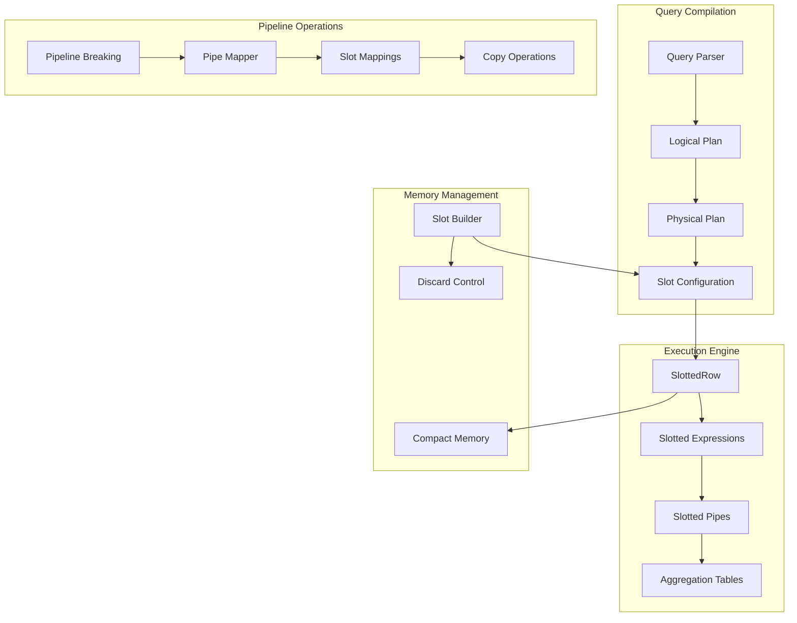
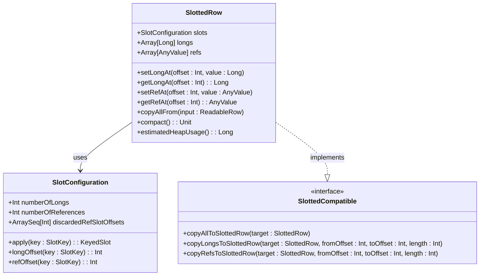
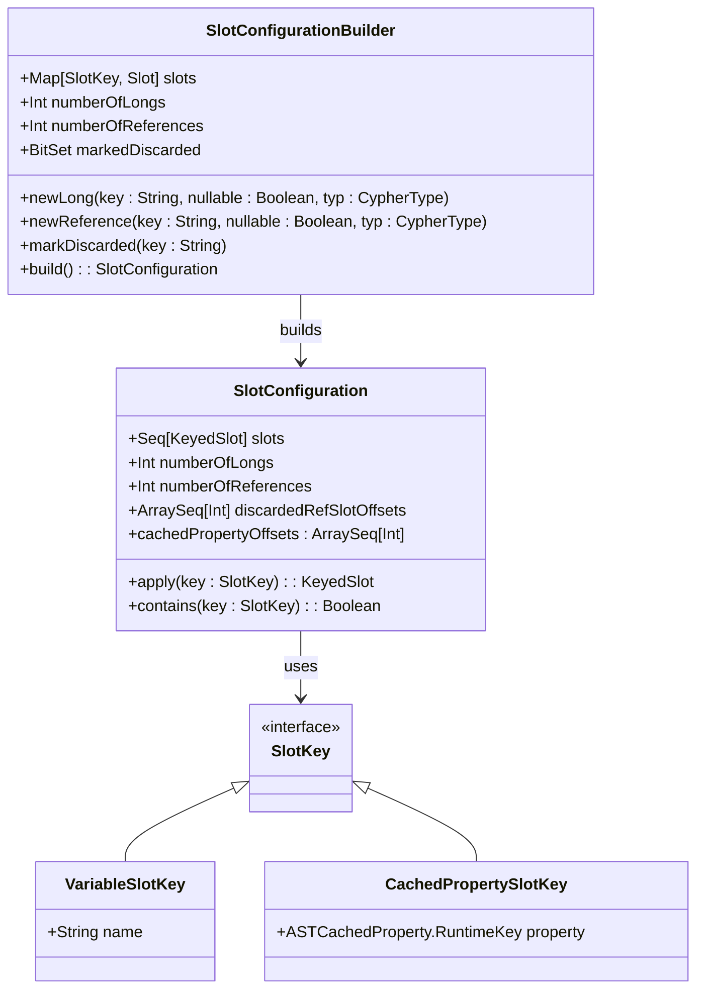
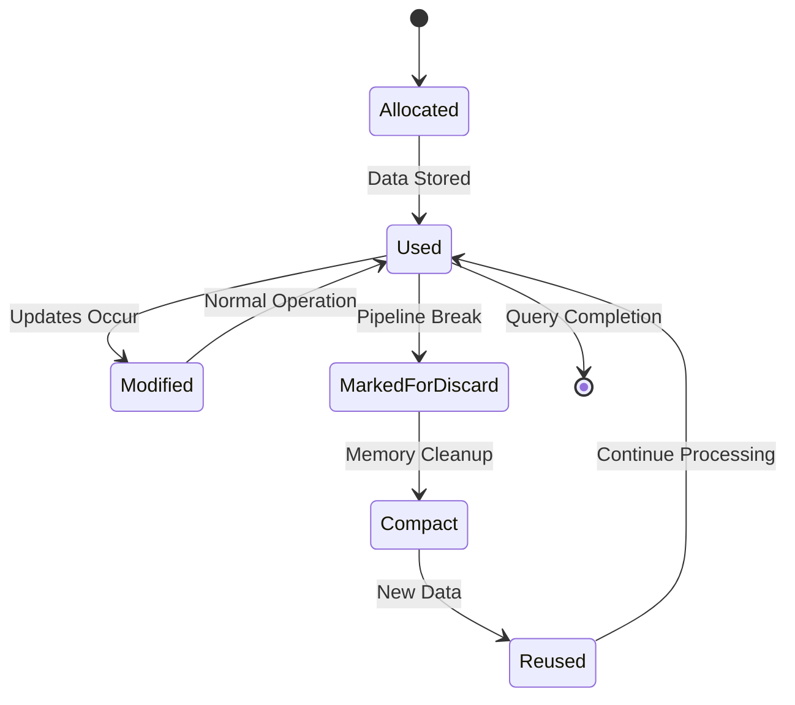
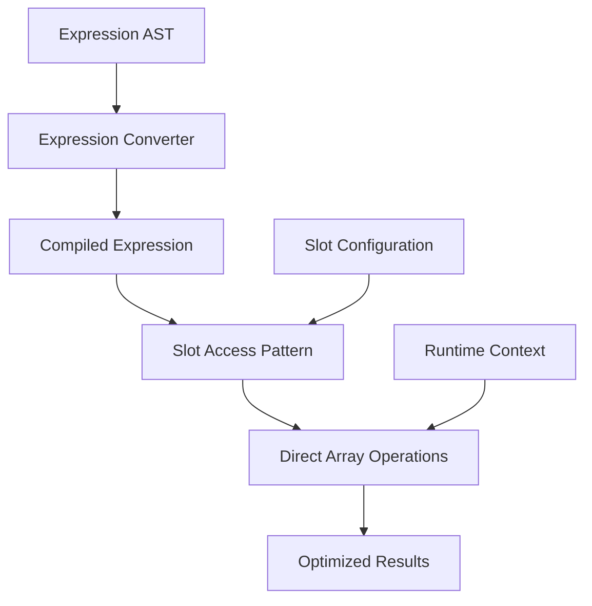
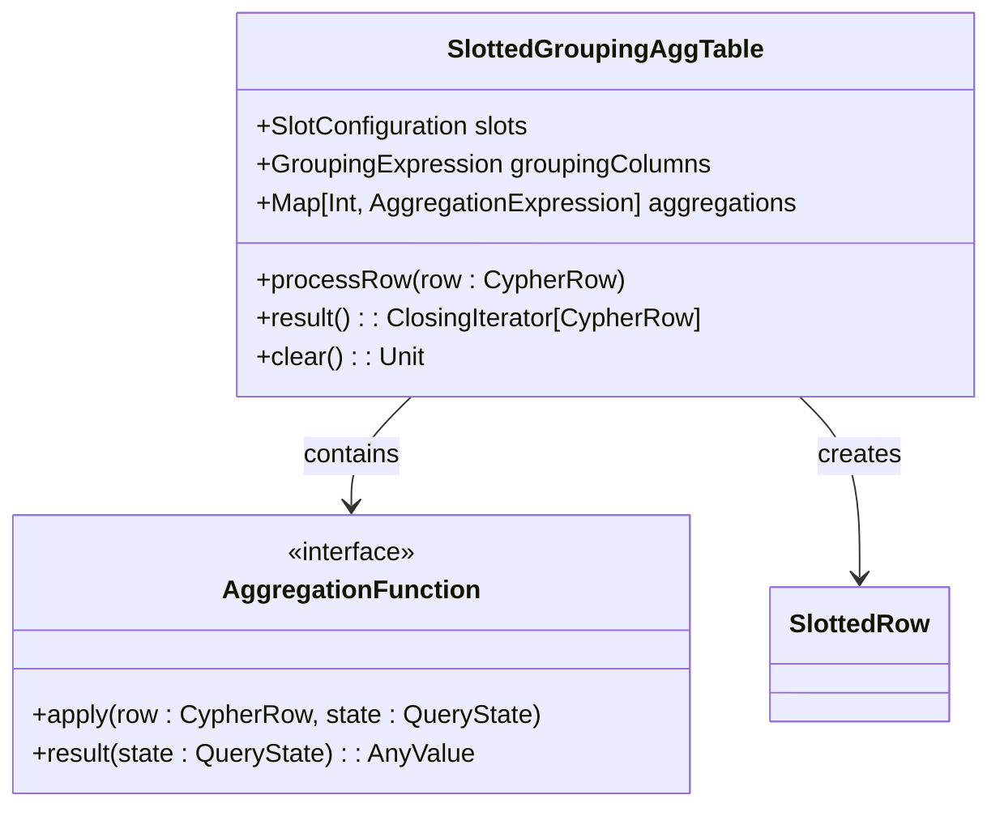
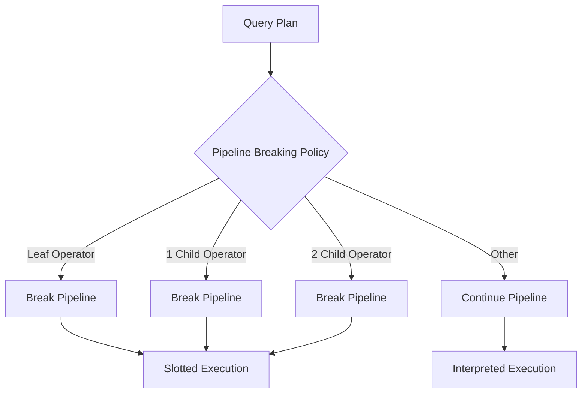
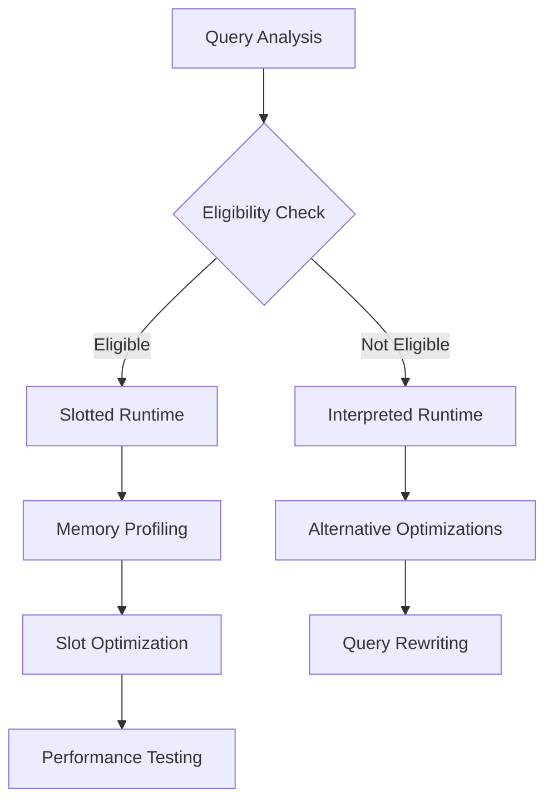

# Slotted Runtime

<cite>
**Referenced Files in This Document**
- [SlottedRow.scala](file://community/cypher/slotted-runtime/src/main/scala/org/neo4j/cypher/internal/runtime/slotted/SlottedRow.scala)
- [SlottedCypherRowFactory.scala](file://community/cypher/slotted-runtime/src/main/scala/org/neo4j/cypher/internal/runtime/slotted/SlottedCypherRowFactory.scala)
- [SlottedExecutionResultBuilderFactory.scala](file://community/cypher/slotted-runtime/src/main/scala/org/neo4j/cypher/internal/runtime/slotted/SlottedExecutionResultBuilderFactory.scala)
- [SlottedPipelineBreakingPolicy.scala](file://community/cypher/slotted-runtime/src/main/scala/org/neo4j/cypher/internal/runtime/slotted/SlottedPipelineBreakingPolicy.scala)
- [SlottedExecutionContextOrdering.scala](file://community/cypher/slotted-runtime/src/main/scala/org/neo4j/cypher/internal/runtime/slotted/SlottedExecutionContextOrdering.scala)
- [SlotConfiguration.scala](file://community/cypher/physical-planning/src/main/scala/org/neo4j/cypher/internal/physicalplanning/SlotConfiguration.scala)
- [SlotConfigurationBuilder.scala](file://community/cypher/physical-planning/src/main/scala/org/neo4j/cypher/internal/physicalplanning/SlotConfigurationBuilder.scala)
- [SlottedGroupingAggTable.scala](file://community/cypher/slotted-runtime/src/main/scala/org/neo4j/cypher/internal/runtime/slotted/aggregation/SlottedGroupingAggTable.scala)
- [SlottedPipeMapper.scala](file://community/cypher/slotted-runtime/src/main/scala/org/neo4j/cypher/internal/runtime/slotted/SlottedPipeMapper.scala)
- [RuntimeName.scala](file://community/cypher/cypher/src/main/scala/org/neo4j/cypher/internal/RuntimeName.scala)
- [SlottedRuntime.scala](file://community/cypher/cypher/src/main/scala/org/neo4j/cypher/internal/SlottedRuntime.scala)
- [CommunityRuntimeFactory.scala](file://community/cypher/cypher/src/main/scala/org/neo4j/cypher/internal/CommunityRuntimeFactory.scala)
</cite>

## Table of Contents
1. [Introduction](#introduction)
2. [Architecture Overview](#architecture-overview)
3. [Core Components](#core-components)
4. [Fixed Memory Layouts (Slots)](#fixed-memory-layouts-slots)
5. [Expression Evaluation](#expression-evaluation)
6. [Performance Benefits](#performance-benefits)
7. [Query Eligibility](#query-eligibility)
8. [Limitations and Trade-offs](#limitations-and-trade-offs)
9. [Optimization Tips](#optimization-tips)
10. [Debugging and Monitoring](#debugging-and-monitoring)
11. [Conclusion](#conclusion)

## Introduction

The Slotted Runtime is Neo4j's high-performance execution engine that provides significant performance improvements over the interpreted runtime through its compiled execution model. It achieves superior performance by using fixed memory layouts (slots) for efficient data access, reducing object allocation, and optimizing memory access patterns.

Unlike the interpreted runtime, which dynamically creates objects for each operation, the slotted runtime pre-allocates memory structures and uses direct array access for data manipulation. This approach minimizes garbage collection pressure and reduces CPU overhead associated with object creation and method dispatch.

## Architecture Overview

The slotted runtime architecture consists of several interconnected components that work together to provide high-performance query execution:

**Diagram sources**
- [SlottedRuntime.scala](file://community/cypher/cypher/src/main/scala/org/neo4j/cypher/internal/SlottedRuntime.scala#L45-L203)
- [SlotConfiguration.scala](file://community/cypher/physical-planning/src/main/scala/org/neo4j/cypher/internal/physicalplanning/SlotConfiguration.scala#L53-L153)

**Section sources**
- [SlottedRuntime.scala](file://community/cypher/cypher/src/main/scala/org/neo4j/cypher/internal/SlottedRuntime.scala#L45-L203)
- [CommunityRuntimeFactory.scala](file://community/cypher/cypher/src/main/scala/org/neo4j/cypher/internal/CommunityRuntimeFactory.scala#L27-L64)

## Core Components

### SlottedRow - The Execution Context

The `SlottedRow` serves as the primary execution context, implementing the `CypherRow` interface with a fixed memory layout:

**Diagram sources**
- [SlottedRow.scala](file://community/cypher/slotted-runtime/src/main/scala/org/neo4j/cypher/internal/runtime/slotted/SlottedRow.scala#L132-L579)
- [SlotConfiguration.scala](file://community/cypher/physical-planning/src/main/scala/org/neo4j/cypher/internal/physicalplanning/SlotConfiguration.scala#L53-L153)

### Slot Configuration System

The slot configuration system manages the allocation and organization of memory slots:

**Diagram sources**
- [SlotConfigurationBuilder.scala](file://community/cypher/physical-planning/src/main/scala/org/neo4j/cypher/internal/physicalplanning/SlotConfigurationBuilder.scala#L60-L471)
- [SlotConfiguration.scala](file://community/cypher/physical-planning/src/main/scala/org/neo4j/cypher/internal/physicalplanning/SlotConfiguration.scala#L53-L153)

**Section sources**
- [SlottedRow.scala](file://community/cypher/slotted-runtime/src/main/scala/org/neo4j/cypher/internal/runtime/slotted/SlottedRow.scala#L132-L579)
- [SlotConfiguration.scala](file://community/cypher/physical-planning/src/main/scala/org/neo4j/cypher/internal/physicalplanning/SlotConfiguration.scala#L53-L153)
- [SlotConfigurationBuilder.scala](file://community/cypher/physical-planning/src/main/scala/org/neo4j/cypher/internal/physicalplanning/SlotConfigurationBuilder.scala#L60-L471)

## Fixed Memory Layouts (Slots)

### Slot Types and Organization

The slotted runtime organizes data into two distinct memory regions:

1. **Long Slots**: Store primitive values (IDs, counts, timestamps) directly in `long` arrays
2. **Reference Slots**: Store complex objects (nodes, relationships, properties) in `AnyValue` arrays

### Memory Layout Benefits

The fixed memory layout provides several advantages:

- **Predictable Access Patterns**: Direct array indexing eliminates pointer chasing
- **Reduced Garbage Collection**: Pre-allocated arrays minimize object creation
- **Cache-Friendly Access**: Contiguous memory improves CPU cache utilization
- **Zero-Copy Operations**: System.arraycopy enables efficient data movement

### Slot Lifecycle Management

**Diagram sources**
- [SlottedRow.scala](file://community/cypher/slotted-runtime/src/main/scala/org/neo4j/cypher/internal/runtime/slotted/SlottedRow.scala#L560-L579)
- [SlottedPipelineBreakingPolicy.scala](file://community/cypher/slotted-runtime/src/main/scala/org/neo4j/cypher/internal/runtime/slotted/SlottedPipelineBreakingPolicy.scala#L42-L82)

**Section sources**
- [SlottedRow.scala](file://community/cypher/slotted-runtime/src/main/scala/org/neo4j/cypher/internal/runtime/slotted/SlottedRow.scala#L134-L137)
- [SlottedRow.scala](file://community/cypher/slotted-runtime/src/main/scala/org/neo4j/cypher/internal/runtime/slotted/SlottedRow.scala#L560-L579)

## Expression Evaluation

### Compiled Expression Model

The slotted runtime compiles expressions into optimized bytecode that operates directly on slot indices:

**Diagram sources**
- [SlottedRuntime.scala](file://community/cypher/cypher/src/main/scala/org/neo4j/cypher/internal/SlottedRuntime.scala#L66-L203)

### Expression Types and Optimizations

The slotted runtime supports various expression types with specific optimizations:

| Expression Type | Optimization | Performance Benefit |
|----------------|--------------|-------------------|
| Property Access | Direct slot lookup | Eliminates dictionary lookups |
| Node/Relationship Creation | Primitive ID storage | Reduces object overhead |
| Aggregation Functions | In-place computation | Minimizes intermediate objects |
| Sorting Operations | Slot-based comparison | Fast numeric comparisons |

### Aggregation Tables

The slotted runtime uses specialized aggregation tables for efficient grouping and aggregation:

**Diagram sources**
- [SlottedGroupingAggTable.scala](file://community/cypher/slotted-runtime/src/main/scala/org/neo4j/cypher/internal/runtime/slotted/aggregation/SlottedGroupingAggTable.scala#L42-L130)

**Section sources**
- [SlottedGroupingAggTable.scala](file://community/cypher/slotted-runtime/src/main/scala/org/neo4j/cypher/internal/runtime/slotted/aggregation/SlottedGroupingAggTable.scala#L42-L130)
- [SlottedRuntime.scala](file://community/cypher/cypher/src/main/scala/org/neo4j/cypher/internal/SlottedRuntime.scala#L66-L203)

## Performance Benefits

### Reduced Object Allocation

The slotted runtime eliminates the need for dynamic object creation during query execution:

- **Pre-allocated Arrays**: Memory is reserved once during compilation
- **Primitive Storage**: Numeric values stored directly in `long` arrays
- **Reference Pooling**: Object references reused across operations

### Optimized Memory Access Patterns

The fixed slot layout enables several performance optimizations:

- **Sequential Access**: Linear memory traversal for better cache locality
- **Batch Operations**: System.arraycopy for efficient bulk data movement
- **Minimal Indirection**: Direct array indexing instead of method calls

### Comparison with Interpreted Runtime

| Aspect | Slotted Runtime | Interpreted Runtime |
|--------|----------------|-------------------|
| Memory Allocation | Pre-allocated, fixed-size | Dynamic, per-operation |
| Object Creation | Minimal | Extensive |
| Method Dispatch | Direct array access | Virtual method calls |
| Garbage Collection | Reduced pressure | Frequent |
| Cache Efficiency | High locality | Lower locality |
| Startup Overhead | Higher compilation cost | Lower initialization cost |
| Runtime Performance | Superior throughput | Moderate throughput |

### Performance Metrics

The slotted runtime typically provides:

- **2-5x faster execution** for complex queries
- **Reduced memory footprint** by 30-50%
- **Lower GC pressure** leading to more predictable performance
- **Better scalability** with larger datasets

**Section sources**
- [SlottedRow.scala](file://community/cypher/slotted-runtime/src/main/scala/org/neo4j/cypher/internal/runtime/slotted/SlottedRow.scala#L310-L342)
- [SlottedRow.scala](file://community/cypher/slotted-runtime/src/main/scala/org/neo4j/cypher/internal/runtime/slotted/SlottedRow.scala#L196-L204)

## Query Eligibility

### Pipeline Breaking Conditions

The slotted runtime uses pipeline breaking policies to determine when to switch execution modes:

**Diagram sources**
- [SlottedPipelineBreakingPolicy.scala](file://community/cypher/slotted-runtime/src/main/scala/org/neo4j/cypher/internal/runtime/slotted/SlottedPipelineBreakingPolicy.scala#L42-L82)

### Eligible Query Patterns

Queries that benefit most from the slotted runtime include:

1. **Complex Joins**: Hash joins, cartesian products
2. **Aggregation Queries**: GROUP BY with multiple aggregations
3. **Sorting Operations**: ORDER BY with multiple columns
4. **Large Result Sets**: Queries returning many rows
5. **Nested Subqueries**: Queries with correlated subqueries

### Automatic Selection Criteria

The runtime automatically selects the slotted execution mode when:

- The query plan contains eligible operators
- Memory constraints allow for slot allocation
- The query complexity justifies compilation overhead
- Pipeline breaking conditions are met

**Section sources**
- [SlottedPipelineBreakingPolicy.scala](file://community/cypher/slotted-runtime/src/main/scala/org/neo4j/cypher/internal/runtime/slotted/SlottedPipelineBreakingPolicy.scala#L42-L82)
- [SlottedRuntime.scala](file://community/cypher/cypher/src/main/scala/org/neo4j/cypher/internal/SlottedRuntime.scala#L171-L203)

## Limitations and Trade-offs

### Compilation Overhead

The slotted runtime incurs additional compilation costs:

- **Higher startup latency** for query compilation
- **Increased memory usage** during plan generation
- **CPU overhead** for expression compilation

### Memory Constraints

The fixed memory layout has some limitations:

- **Slot capacity limits**: Maximum number of variables per query
- **Memory fragmentation**: Potential for inefficient slot usage
- **Discard overhead**: Memory cleanup operations during pipeline breaks

### Query Complexity Restrictions

Some query patterns may not be eligible:

- **Dynamic property access**: Properties accessed through variables
- **Complex type conversions**: Runtime type determination
- **Unpredictable result sets**: Queries with highly variable output

### Debugging Challenges

The compiled nature of the slotted runtime presents debugging challenges:

- **Less readable execution traces**
- **Complex stack traces**
- **Limited runtime introspection**

**Section sources**
- [SlottedRuntime.scala](file://community/cypher/cypher/src/main/scala/org/neo4j/cypher/internal/SlottedRuntime.scala#L171-L203)

## Optimization Tips

### Query Design Guidelines

To maximize slotted runtime performance:

1. **Minimize Variable Count**: Reduce the number of variables in complex queries
2. **Use Explicit Aliases**: Help the optimizer predict slot usage
3. **Avoid Dynamic Properties**: Use static property access patterns
4. **Structure Queries Logically**: Align with pipeline breaking boundaries

### Memory Management Best Practices

- **Monitor slot allocation**: Track memory usage during query execution
- **Optimize aggregation patterns**: Use appropriate grouping strategies
- **Balance memory vs. speed**: Tune slot configuration for your workload

### Performance Tuning Strategies

### Monitoring and Profiling

Key metrics to monitor:

- **Compilation time**: Time spent in query planning
- **Memory allocation**: Slot usage patterns
- **Pipeline breaks**: Frequency and impact of breaks
- **Execution throughput**: Rows processed per second

**Section sources**
- [SlottedExecutionContextOrdering.scala](file://community/cypher/slotted-runtime/src/main/scala/org/neo4j/cypher/internal/runtime/slotted/SlottedExecutionContextOrdering.scala#L38-L291)
- [SlottedRuntime.scala](file://community/cypher/cypher/src/main/scala/org/neo4j/cypher/internal/SlottedRuntime.scala#L53-L70)

## Debugging and Monitoring

### Runtime Information

The slotted runtime provides extensive debugging capabilities:

- **Plan printing**: Detailed execution plan visualization
- **Slot configuration dumps**: Memory layout inspection
- **Performance counters**: Execution statistics
- **Debug output**: Step-by-step execution tracing

### Diagnostic Tools

Available diagnostic features:

- **Query plan analysis**: Understand execution flow
- **Memory usage tracking**: Monitor slot allocation
- **Performance profiling**: Identify bottlenecks
- **Error reporting**: Detailed exception information

### Troubleshooting Common Issues

Common problems and solutions:

1. **Memory exhaustion**: Reduce query complexity or increase heap size
2. **Slow compilation**: Simplify query patterns
3. **Unexpected results**: Verify slot configuration correctness
4. **Performance degradation**: Profile memory usage patterns

**Section sources**
- [SlottedRuntime.scala](file://community/cypher/cypher/src/main/scala/org/neo4j/cypher/internal/SlottedRuntime.scala#L53-L70)
- [SlottedRuntime.scala](file://community/cypher/cypher/src/main/scala/org/neo4j/cypher/internal/SlottedRuntime.scala#L171-L203)

## Conclusion

The slotted runtime represents a significant advancement in Neo4j's query execution capabilities, offering substantial performance improvements through its compiled execution model and fixed memory layouts. By eliminating dynamic object allocation and optimizing memory access patterns, it achieves superior throughput and reduced garbage collection pressure compared to the interpreted runtime.

While the slotted runtime introduces some compilation overhead and has certain limitations, its benefits for complex queries and large-scale operations make it an essential component of Neo4j's performance optimization strategy. Understanding its architecture, eligibility criteria, and optimization techniques enables developers to design queries that fully leverage this high-performance execution engine.

The future development of the slotted runtime continues to focus on expanding query eligibility, improving compilation efficiency, and enhancing debugging capabilities, ensuring that it remains at the forefront of database query execution technology.