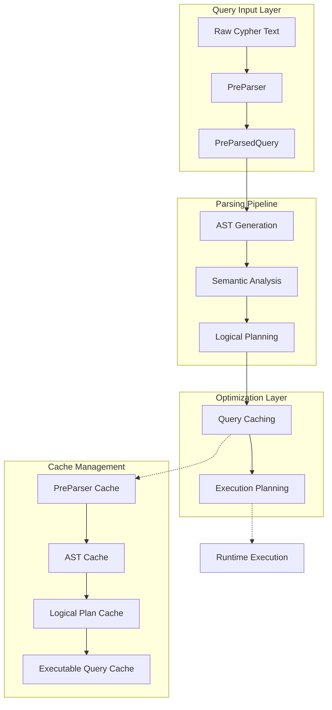
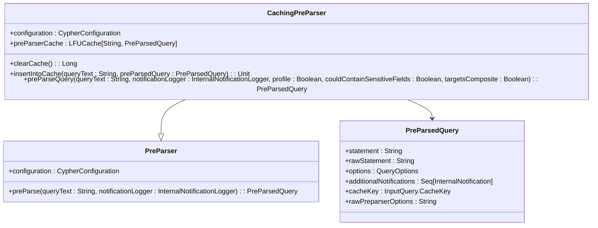
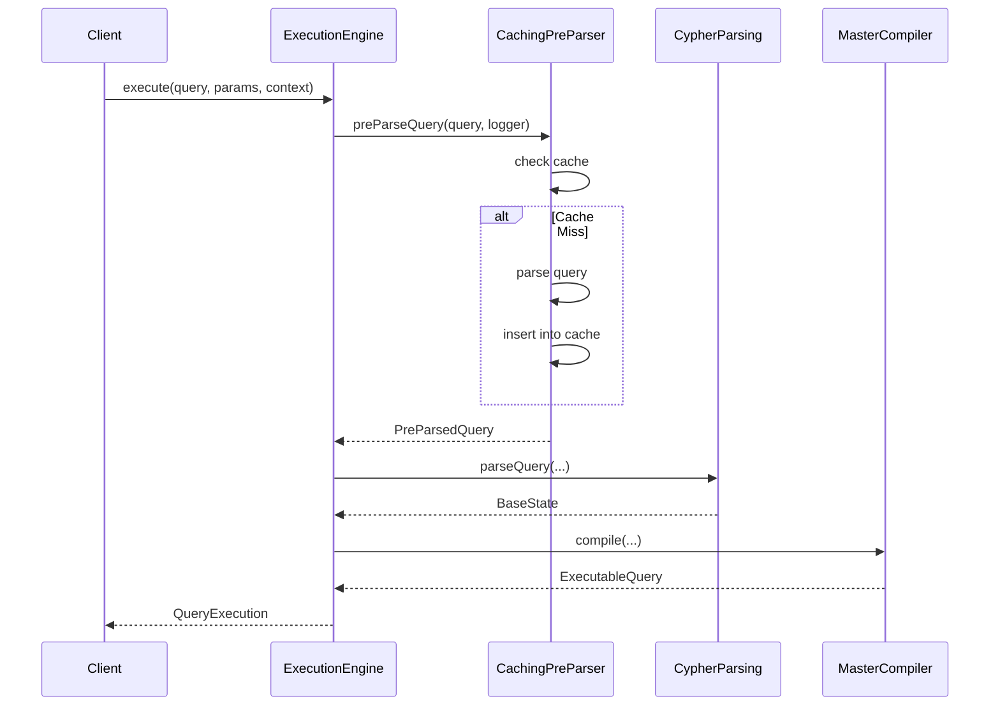
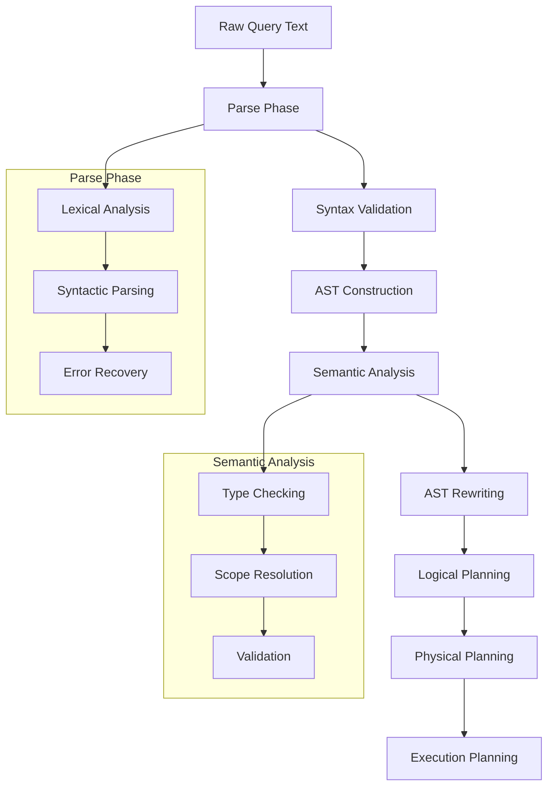
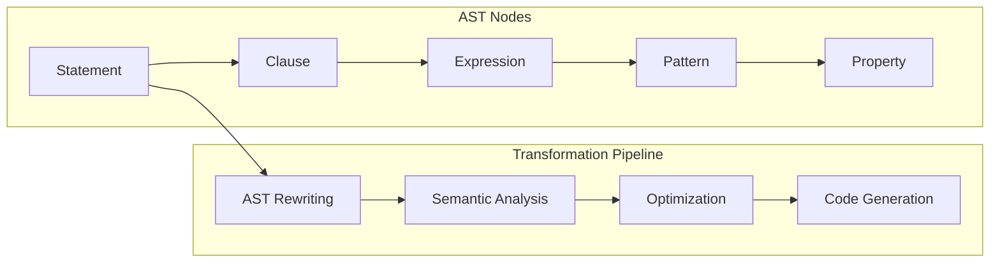
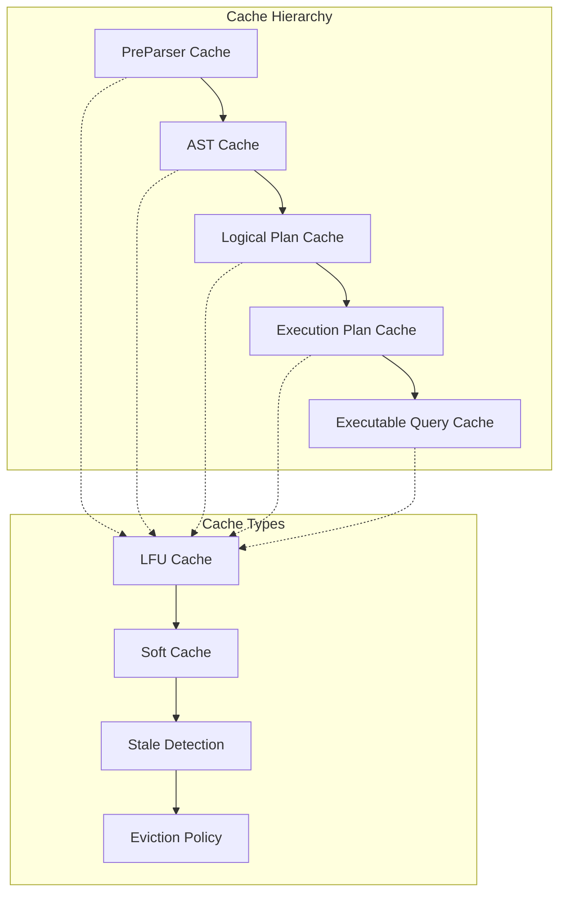
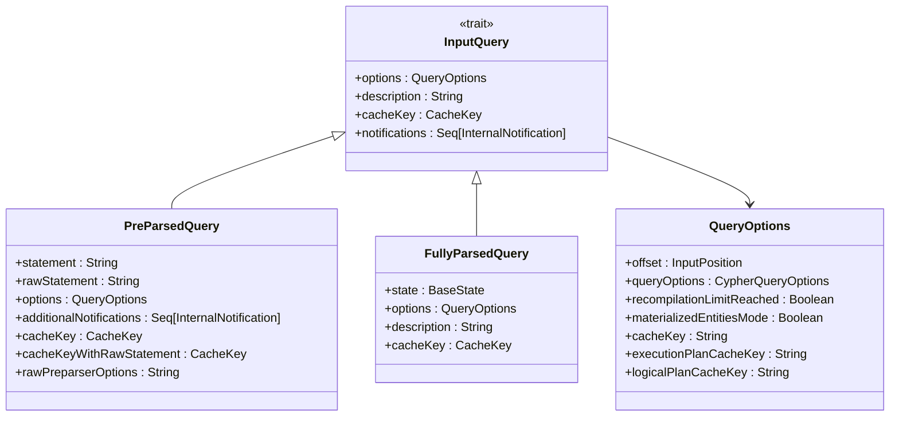
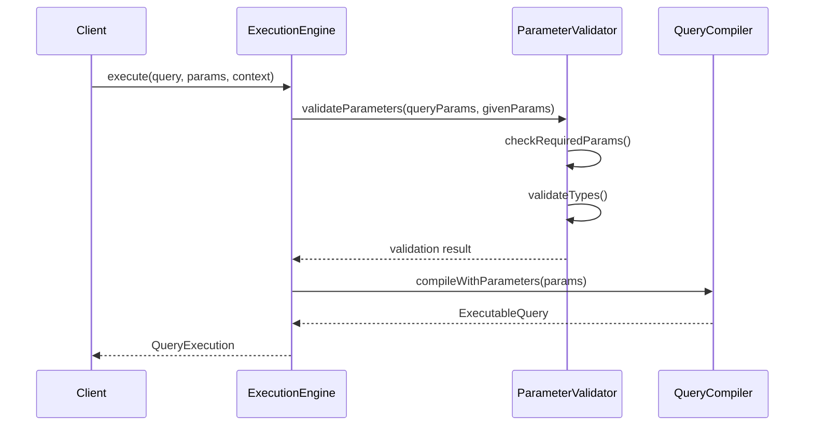
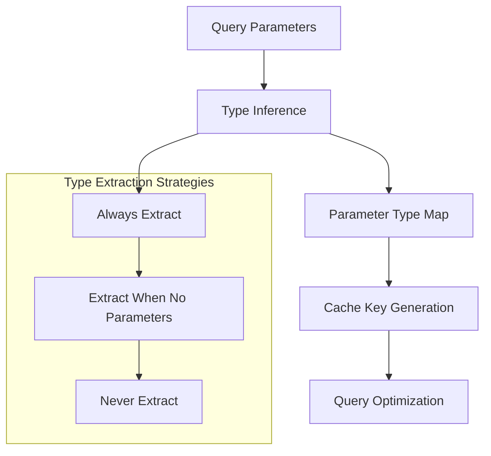
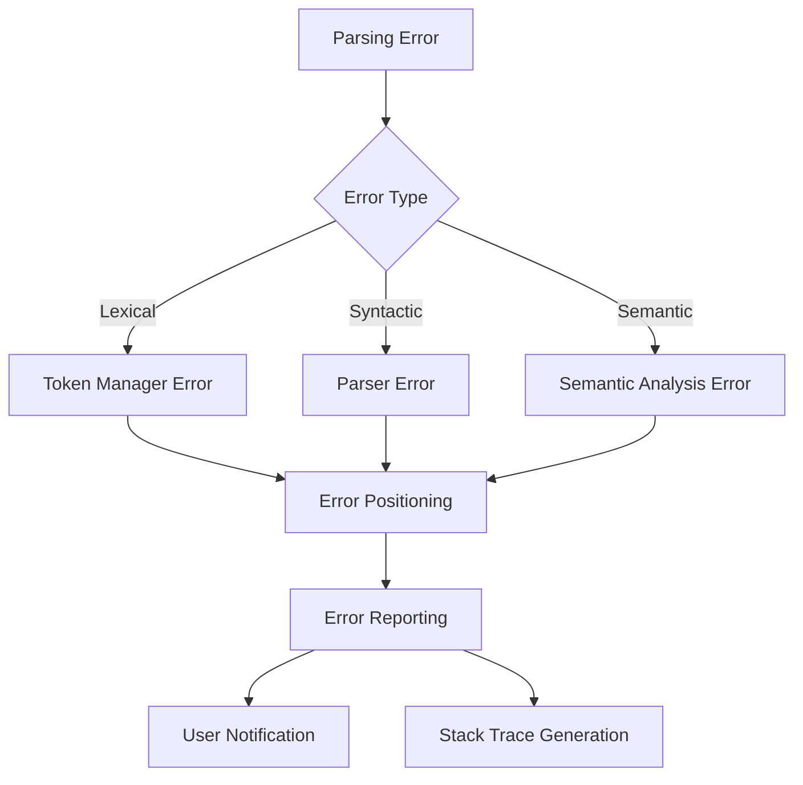

# Query Parsing

<cite>
**Referenced Files in This Document**
- [CachingPreParser.scala](file://community/cypher/cypher/src/main/scala/org/neo4j/cypher/internal/CachingPreParser.scala)
- [InputQuery.scala](file://community/cypher/cypher/src/main/scala/org/neo4j/cypher/internal/InputQuery.scala)
- [CypherParsing.scala](file://community/cypher/cypher-planner/src/main/scala/org/neo4j/cypher/internal/compiler/CypherParsing.scala)
- [ExecutionEngine.scala](file://community/cypher/cypher/src/main/scala/org/neo4j/cypher/internal/ExecutionEngine.scala)
- [PreParsedStatement.scala](file://community/cypher/cypher/src/main/scala/org/neo4j/cypher/internal/PreParsedStatement.scala)
- [CypherQueryCaches.scala](file://community/cypher/cypher/src/main/scala/org/neo4j/cypher/internal/cache/CypherQueryCaches.scala)
- [CompilationPhases.scala](file://community/cypher/cypher-planner/src/main/scala/org/neo4j/cypher/internal/compiler/phases/CompilationPhases.scala)
- [QueryCache.scala](file://community/cypher/cypher/src/main/scala/org/neo4j/cypher/internal/QueryCache.scala)
- [MasterCompiler.scala](file://community/cypher/cypher/src/main/scala/org/neo4j/cypher/internal/MasterCompiler.scala)
- [CypherPlanner.scala](file://community/cypher/cypher/src/main/scala/org/neo4j/cypher/internal/planning/CypherPlanner.scala)
- [CompilerLibrary.scala](file://community/cypher/cypher/src/main/scala/org/neo4j/cypher/internal/CompilerLibrary.scala)
</cite>

## Table of Contents
1. [Introduction](#introduction)
2. [Architecture Overview](#architecture-overview)
3. [Core Components](#core-components)
4. [Parsing Pipeline Implementation](#parsing-pipeline-implementation)
5. [Caching Mechanisms](#caching-mechanisms)
6. [Domain Model](#domain-model)
7. [Query Parameterization](#query-parameterization)
8. [Performance Optimization](#performance-optimization)
9. [Error Handling](#error-handling)
10. [Best Practices](#best-practices)
11. [Troubleshooting Guide](#troubleshooting-guide)

## Introduction

The Cypher query parsing component in Neo4j represents a sophisticated system designed to efficiently convert raw Cypher text queries into structured representations suitable for execution. This component serves as the critical first stage in the query processing pipeline, transforming human-readable Cypher statements into optimized execution plans.

The parsing system implements a multi-layered approach combining lexical analysis, syntactic parsing, semantic analysis, and optimization techniques to deliver high-performance query processing. At its core lies the CachingPreParser, which optimizes repeated parsing operations through intelligent caching strategies, while maintaining thread safety and memory efficiency.

## Architecture Overview

The query parsing architecture follows a layered design pattern with clear separation of concerns:

**Diagram sources**
- [CachingPreParser.scala](file://community/cypher/cypher/src/main/scala/org/neo4j/cypher/internal/CachingPreParser.scala#L61-L121)
- [CypherParsing.scala](file://community/cypher/cypher-planner/src/main/scala/org/neo4j/cypher/internal/compiler/CypherParsing.scala#L56-L99)
- [CypherQueryCaches.scala](file://community/cypher/cypher/src/main/scala/org/neo4j/cypher/internal/cache/CypherQueryCaches.scala#L461-L591)

## Core Components

### CachingPreParser

The CachingPreParser serves as the primary entry point for query preprocessing, implementing intelligent caching to optimize repeated parsing operations:

**Diagram sources**
- [CachingPreParser.scala](file://community/cypher/cypher/src/main/scala/org/neo4j/cypher/internal/CachingPreParser.scala#L61-L121)
- [InputQuery.scala](file://community/cypher/cypher/src/main/scala/org/neo4j/cypher/internal/InputQuery.scala#L73-L95)

### Execution Engine Integration

The ExecutionEngine orchestrates the entire query processing workflow:

**Diagram sources**
- [ExecutionEngine.scala](file://community/cypher/cypher/src/main/scala/org/neo4j/cypher/internal/ExecutionEngine.scala#L181-L200)
- [CachingPreParser.scala](file://community/cypher/cypher/src/main/scala/org/neo4j/cypher/internal/CachingPreParser.scala#L98-L120)

**Section sources**
- [CachingPreParser.scala](file://community/cypher/cypher/src/main/scala/org/neo4j/cypher/internal/CachingPreParser.scala#L61-L121)
- [ExecutionEngine.scala](file://community/cypher/cypher/src/main/scala/org/neo4j/cypher/internal/ExecutionEngine.scala#L66-L100)

## Parsing Pipeline Implementation

### Frontend Compilation Phases

The parsing pipeline consists of multiple distinct phases, each responsible for specific aspects of query processing:

**Diagram sources**
- [CompilationPhases.scala](file://community/cypher/cypher-planner/src/main/scala/org/neo4j/cypher/internal/compiler/phases/CompilationPhases.scala#L75-L175)

### AST Generation and Transformation

The Abstract Syntax Tree (AST) generation process transforms parsed queries into structured representations:

**Section sources**
- [CompilationPhases.scala](file://community/cypher/cypher-planner/src/main/scala/org/neo4j/cypher/internal/compiler/phases/CompilationPhases.scala#L75-L142)

## Caching Mechanisms

### Multi-Level Cache Architecture

The caching system implements a sophisticated multi-level architecture designed for optimal performance:

**Diagram sources**
- [CypherQueryCaches.scala](file://community/cypher/cypher/src/main/scala/org/neo4j/cypher/internal/cache/CypherQueryCaches.scala#L461-L591)

### Cache Key Generation

Cache keys are carefully constructed to ensure proper cache coherency:

| Cache Level | Key Components | Purpose |
|-------------|---------------|---------|
| PreParser | Raw query text | Prevents redundant parsing |
| AST | Parsed query + parameter types | Ensures semantic correctness |
| Logical Plan | Statement + query options + parameters | Supports parameterized queries |
| Execution Plan | Logical plan + runtime context | Optimizes physical execution |
| Executable Query | Complete compilation state | Enables direct execution |

**Section sources**
- [CypherQueryCaches.scala](file://community/cypher/cypher/src/main/scala/org/neo4j/cypher/internal/cache/CypherQueryCaches.scala#L216-L226)
- [QueryCache.scala](file://community/cypher/cypher/src/main/scala/org/neo4j/cypher/internal/QueryCache.scala#L642-L693)

## Domain Model

### InputQuery Hierarchy

The domain model defines a clear hierarchy of query representations:

**Diagram sources**
- [InputQuery.scala](file://community/cypher/cypher/src/main/scala/org/neo4j/cypher/internal/InputQuery.scala#L35-L182)

### Query Options Management

Query options control various aspects of query execution and optimization:

| Option Category | Configuration | Impact |
|----------------|---------------|---------|
| Execution Mode | `EXPLAIN`, `PROFILE`, `NORMAL` | Controls query execution behavior |
| Planner Selection | `cost`, `idp`, `dp` | Determines optimization strategy |
| Runtime Engine | `interpreted`, `slotted`, `compiled` | Affects execution performance |
| Expression Engine | `interpreted`, `compiled`, `onlyWhenHot` | Controls code generation |
| Parameter Handling | `extractLiterals`, `obfuscateLiterals` | Security and performance tuning |

**Section sources**
- [InputQuery.scala](file://community/cypher/cypher/src/main/scala/org/neo4j/cypher/internal/InputQuery.scala#L117-L172)

## Query Parameterization

### Parameter Binding Process

The parameterization system ensures type-safe query execution with proper validation:

**Diagram sources**
- [ExecutionEngine.scala](file://community/cypher/cypher/src/main/scala/org/neo4j/cypher/internal/ExecutionEngine.scala#L485-L497)

### Parameter Type Extraction

The system automatically extracts parameter types for optimization:

**Section sources**
- [ExecutionEngine.scala](file://community/cypher/cypher/src/main/scala/org/neo4j/cypher/internal/ExecutionEngine.scala#L485-L497)

## Performance Optimization

### Parsing Overhead Reduction

Several strategies minimize parsing overhead for frequently executed queries:

1. **Intelligent Caching**: Multi-level cache hierarchy prevents redundant parsing
2. **Lazy Evaluation**: AST construction occurs only when needed
3. **Parameter Type Optimization**: Efficient parameter type extraction reduces compilation time
4. **Soft Cache Support**: Memory-efficient cache eviction policies

### Cache Utilization Patterns

| Pattern | Use Case | Benefits |
|---------|----------|----------|
| Hot Query Caching | Frequently executed queries | Eliminates parsing overhead |
| Parameterized Queries | Dynamic parameter values | Maintains cache effectiveness |
| Soft Cache Eviction | Memory pressure scenarios | Prevents OOM conditions |
| Stale Detection | Schema change scenarios | Ensures query correctness |

**Section sources**
- [CypherQueryCaches.scala](file://community/cypher/cypher/src/main/scala/org/neo4j/cypher/internal/cache/CypherQueryCaches.scala#L486-L510)

## Error Handling

### Syntax Error Management

The parsing system implements comprehensive error handling:

### Common Parsing Issues

| Issue Category | Symptoms | Solutions |
|---------------|----------|-----------|
| Syntax Errors | Unexpected token messages | Validate query structure |
| Parameter Binding | Type mismatch errors | Check parameter types |
| Cache Misses | Performance degradation | Optimize cache configuration |
| Memory Issues | OutOfMemoryError | Adjust cache sizes |

**Section sources**
- [CachingPreParser.scala](file://community/cypher/cypher/src/main/scala/org/neo4j/cypher/internal/CachingPreParser.scala#L131-L141)

## Best Practices

### Query Design Guidelines

1. **Use Parameterized Queries**: Always use parameters instead of embedding literals
2. **Optimize Cache Usage**: Structure queries to maximize cache hit rates
3. **Minimize Query Complexity**: Break complex queries into simpler components
4. **Monitor Cache Performance**: Track cache hit ratios and adjust accordingly

### Performance Tuning Recommendations

1. **Configure Appropriate Cache Sizes**: Balance memory usage with performance benefits
2. **Enable Soft Caching**: Use soft cache eviction for memory-constrained environments
3. **Monitor Stale Cache Detection**: Ensure proper staleness detection for schema changes
4. **Profile Query Execution**: Use EXPLAIN and PROFILE modes for optimization

### Memory Management

1. **Monitor Cache Growth**: Track cache sizes and growth patterns
2. **Implement Cache Warming**: Preload frequently used queries
3. **Configure Eviction Policies**: Set appropriate eviction strategies
4. **Handle Memory Pressure**: Implement graceful degradation under memory constraints

## Troubleshooting Guide

### Common Issues and Solutions

#### High Parsing Overhead

**Symptoms**: Slow query execution, high CPU usage during parsing
**Causes**: 
- Frequent cache misses
- Large query variations
- Inefficient parameterization

**Solutions**:
- Review query patterns for commonality
- Optimize parameter usage
- Increase cache sizes
- Implement query batching

#### Cache Inefficiency

**Symptoms**: Low cache hit ratios, poor performance scaling
**Causes**:
- Poor cache key design
- Excessive query variation
- Memory pressure

**Solutions**:
- Standardize query patterns
- Use consistent parameter naming
- Monitor cache statistics
- Adjust cache eviction policies

#### Memory Issues

**Symptoms**: OutOfMemoryError, slow garbage collection
**Causes**:
- Cache sizes too large
- Memory leaks in cache entries
- Stale cache accumulation

**Solutions**:
- Reduce cache sizes
- Enable soft caching
- Monitor cache growth
- Implement cache cleanup

### Diagnostic Tools

The system provides several diagnostic capabilities:

1. **Cache Statistics**: Monitor hit ratios and cache sizes
2. **Query Tracing**: Track query execution phases
3. **Performance Metrics**: Measure parsing and compilation times
4. **Error Logging**: Detailed error reporting and stack traces

**Section sources**
- [CypherQueryCaches.scala](file://community/cypher/cypher/src/main/scala/org/neo4j/cypher/internal/cache/CypherQueryCaches.scala#L598-L630)