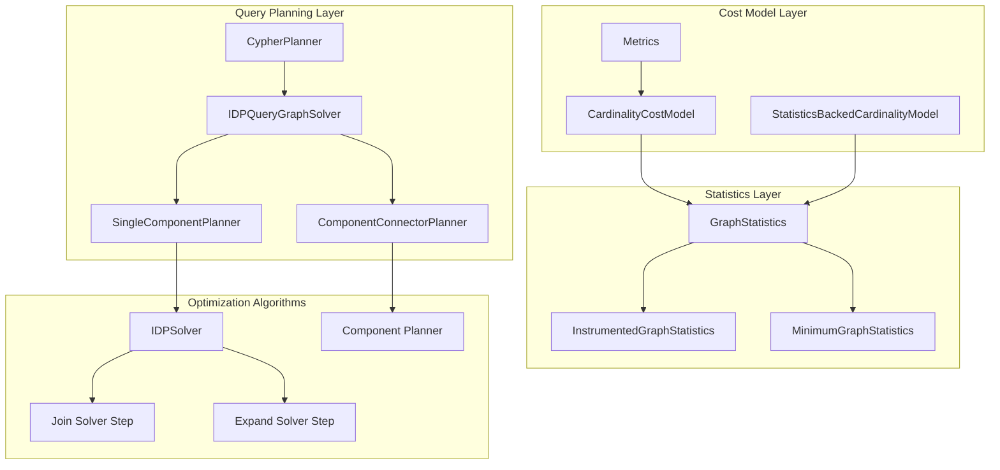
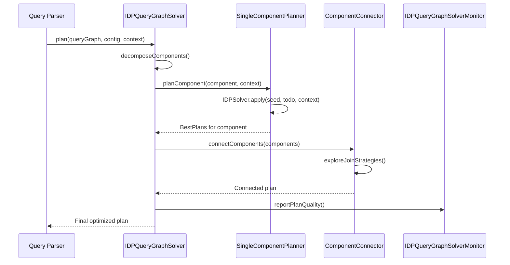
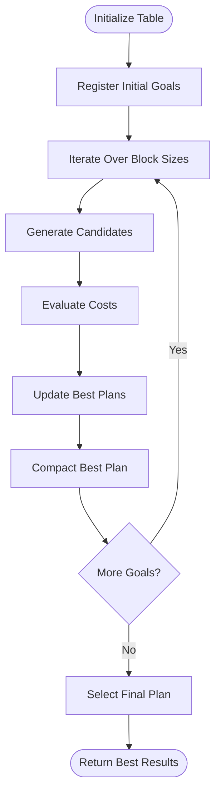
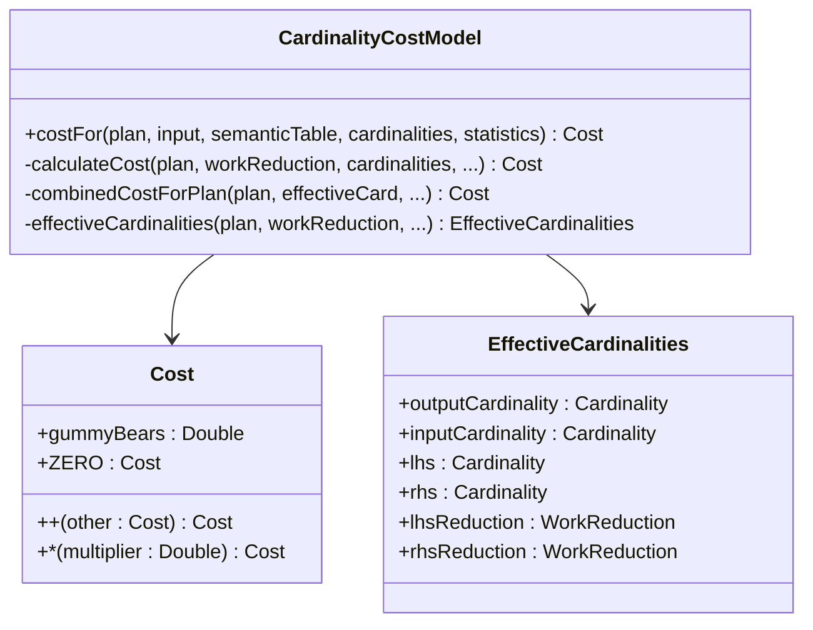
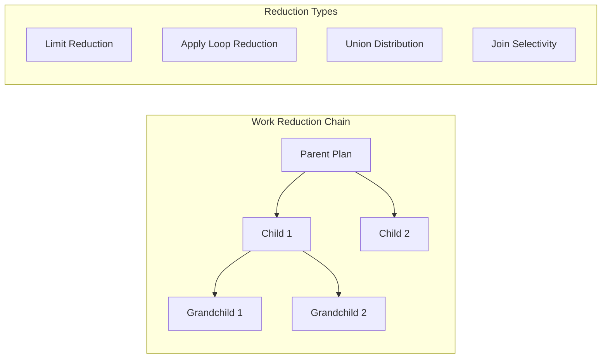
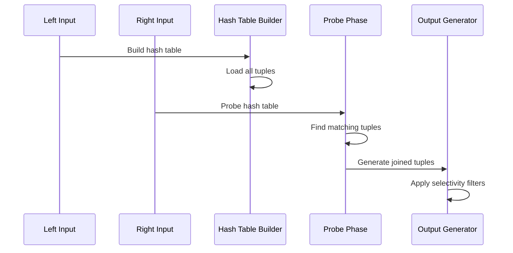
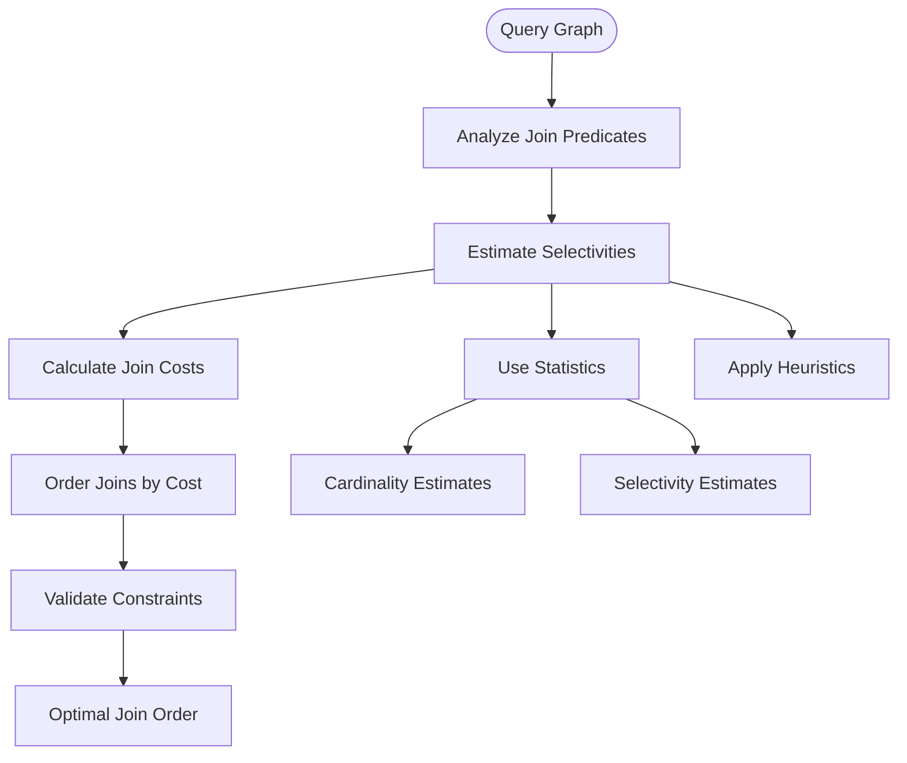
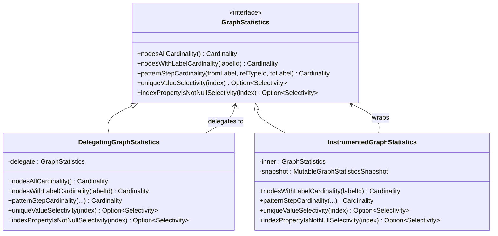
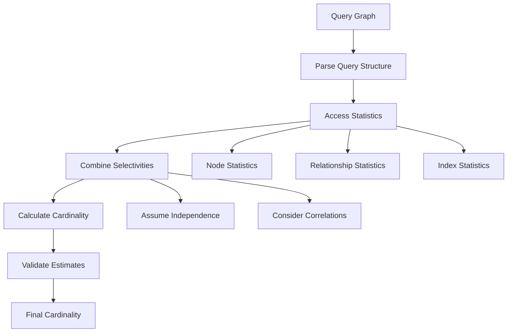
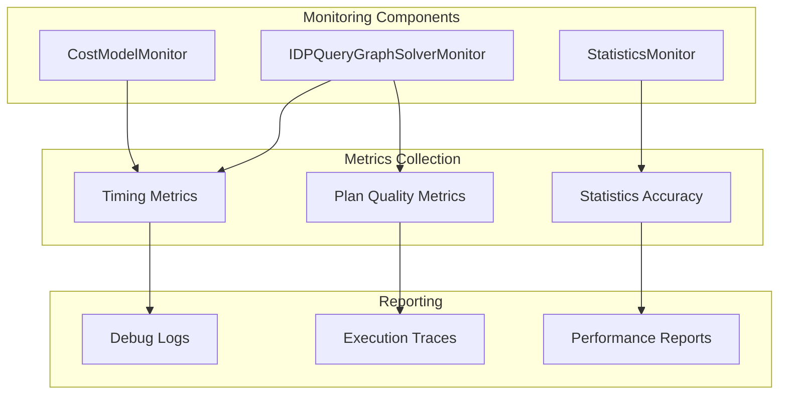

# Cost-Based Optimization

<cite>
**Referenced Files in This Document**
- [CypherPlanner.scala](file://community/cypher/cypher/src/main/scala/org/neo4j/cypher/internal/planning/CypherPlanner.scala)
- [IDPQueryGraphSolver.scala](file://community/cypher/cypher-planner/src/main/scala/org/neo4j/cypher/internal/compiler/planner/logical/idp/IDPQueryGraphSolver.scala)
- [IDPSolver.scala](file://community/cypher/cypher-planner/src/main/scala/org/neo4j/cypher/internal/compiler/planner/logical/idp/IDPSolver.scala)
- [IDPSolverConfig.scala](file://community/cypher/cypher-planner/src/main/scala/org/neo4j/cypher/internal/compiler/planner/logical/idp/IDPSolverConfig.scala)
- [GraphStatistics.scala](file://community/cypher/planner-spi/src/main/scala/org/neo4j/cypher/internal/planner/spi/GraphStatistics.scala)
- [CardinalityCostModel.scala](file://community/cypher/cypher-planner/src/main/scala/org/neo4j/cypher/internal/compiler/planner/logical/CardinalityCostModel.scala)
- [joinSolverStep.scala](file://community/cypher/cypher-planner/src/main/scala/org/neo4j/cypher/internal/compiler/planner/logical/idp/joinSolverStep.scala)
- [expandSolverStep.scala](file://community/cypher/cypher-planner/src/main/scala/org/neo4j/cypher/internal/compiler/planner/logical/idp/expandSolverStep.scala)
- [cartesianProductsOrValueJoins.scala](file://community/cypher/cypher-planner/src/main/scala/org/neo4j/cypher/internal/compiler/planner/logical/idp/cartesianProductsOrValueJoins.scala)
- [StatisticsBackedCardinalityModel.scala](file://community/cypher/cypher-planner/src/main/scala/org/neo4j/cypher/internal/compiler/planner/logical/StatisticsBackedCardinalityModel.scala)
- [Metrics.scala](file://community/cypher/cypher-planner/src/main/scala/org/neo4j/cypher/internal/compiler/planner/logical/Metrics.scala)
- [ComponentConnectorPlanner.scala](file://community/cypher/cypher-planner/src/main/scala/org/neo4j/cypher/internal/compiler/planner/logical/idp/ComponentConnectorPlanner.scala)
</cite>

## Table of Contents
1. [Introduction](#introduction)
2. [System Architecture](#system-architecture)
3. [IDPQueryGraphSolver Implementation](#idpquerygraphsolver-implementation)
4. [Dynamic Programming Algorithms](#dynamic-programming-algorithms)
5. [Cost Models and Estimation](#cost-models-and-estimation)
6. [Join Strategies and Costing](#join-strategies-and-costing)
7. [GraphStatistics SPI](#graphstatistics-spi)
8. [Cardinality Estimation](#cardinality-estimation)
9. [Optimization Tracing and Monitoring](#optimization-tracing-and-monitoring)
10. [Troubleshooting Guide](#troubleshooting-guide)
11. [Performance Considerations](#performance-considerations)
12. [Conclusion](#conclusion)

## Introduction

The cost-based optimization system in Neo4j's Cypher query planner represents a sophisticated approach to query execution plan selection. Built around the iterative dynamic programming (IDP) algorithm framework, this system evaluates multiple execution alternatives by leveraging graph statistics, cardinality estimation, and comprehensive cost models to identify the most efficient query execution strategy.

The optimization system operates on the principle that query performance can be significantly improved by intelligently choosing between different execution strategies based on data characteristics and query patterns. This approach moves beyond rule-based optimization to provide adaptive query planning that considers actual data distribution and access patterns.

## System Architecture

The cost-based optimization system is structured around several key components that work together to produce optimal query execution plans:

**Diagram sources**
- [CypherPlanner.scala](file://community/cypher/cypher/src/main/scala/org/neo4j/cypher/internal/planning/CypherPlanner.scala#L143-L169)
- [IDPQueryGraphSolver.scala](file://community/cypher/cypher-planner/src/main/scala/org/neo4j/cypher/internal/compiler/planner/logical/idp/IDPQueryGraphSolver.scala#L114-L118)

**Section sources**
- [CypherPlanner.scala](file://community/cypher/cypher/src/main/scala/org/neo4j/cypher/internal/planning/CypherPlanner.scala#L143-L169)
- [IDPQueryGraphSolver.scala](file://community/cypher/cypher-planner/src/main/scala/org/neo4j/cypher/internal/compiler/planner/logical/idp/IDPQueryGraphSolver.scala#L114-L118)

## IDPQueryGraphSolver Implementation

The IDPQueryGraphSolver serves as the central orchestrator for cost-based query optimization, implementing the iterative dynamic programming algorithm described in the seminal paper by Donald Kossmann and Konrad Stocker.

### Core Architecture

The solver operates through a multi-phase approach:

1. **Component Decomposition**: Breaks complex queries into smaller, connected components
2. **Individual Component Planning**: Plans each component independently using dynamic programming
3. **Component Connection**: Reconnects components using various join strategies
4. **Optional Match Handling**: Processes optional matches and subqueries

**Diagram sources**
- [IDPQueryGraphSolver.scala](file://community/cypher/cypher-planner/src/main/scala/org/neo4j/cypher/internal/compiler/planner/logical/idp/IDPQueryGraphSolver.scala#L121-L135)

### Solver Configuration

The system supports multiple solver configurations to balance optimization quality and planning performance:

| Configuration | Max Table Size | Duration Limit | Use Case |
|---------------|----------------|----------------|----------|
| DefaultIDPSolverConfig | 128 | 1000ms | Production use |
| DPSolverConfig | Unlimited | Unlimited | Exhaustive optimization |
| ConfigurableIDPSolverConfig | User-defined | User-defined | Tuned optimization |
| ExpandOnlyIDPSolverConfig | 256 | Unlimited | Testing scenarios |
| JoinOnlyIDPSolverConfig | 256 | Unlimited | Testing scenarios |

**Section sources**
- [IDPSolverConfig.scala](file://community/cypher/cypher-planner/src/main/scala/org/neo4j/cypher/internal/compiler/planner/logical/idp/IDPSolverConfig.scala#L41-L86)

## Dynamic Programming Algorithms

The IDP algorithm forms the backbone of the optimization system, systematically exploring the space of possible execution plans through iterative refinement.

### IDPSolver Implementation

The IDPSolver implements the core iterative dynamic programming algorithm with the following key features:

**Diagram sources**
- [IDPSolver.scala](file://community/cypher/cypher-planner/src/main/scala/org/neo4j/cypher/internal/compiler/planner/logical/idp/IDPSolver.scala#L96-L224)

### Solver Steps and Strategies

The system employs specialized solver steps for different optimization scenarios:

#### Join Solver Step
Focuses on identifying and costing join operations between query components:

- **Overlap Detection**: Identifies common variables between plans
- **Predicate Analysis**: Evaluates join predicates and their selectivity
- **Hint Utilization**: Applies join hints when available
- **Cost Calculation**: Computes join costs based on input cardinalities

#### Expand Solver Step
Handles expansion operations and path traversal:

- **Pattern Matching**: Identifies expansion patterns in query graphs
- **Direction Heuristics**: Chooses optimal expansion directions
- **Variable Binding**: Manages variable binding and scoping
- **Stateful Shortest Paths**: Special handling for shortest path queries

**Section sources**
- [joinSolverStep.scala](file://community/cypher/cypher-planner/src/main/scala/org/neo4j/cypher/internal/compiler/planner/logical/idp/joinSolverStep.scala#L37-L156)
- [expandSolverStep.scala](file://community/cypher/cypher-planner/src/main/scala/org/neo4j/cypher/internal/compiler/planner/logical/idp/expandSolverStep.scala#L80-L867)

## Cost Models and Estimation

The cost-based optimization relies on sophisticated cost models that estimate the computational expense of different execution strategies.

### CardinalityCostModel

The CardinalityCostModel serves as the primary cost estimation engine, computing costs for individual operators and their combinations:

**Diagram sources**
- [CardinalityCostModel.scala](file://community/cypher/cypher-planner/src/main/scala/org/neo4j/cypher/internal/compiler/planner/logical/CardinalityCostModel.scala#L141-L170)

### Cost Estimation Factors

The cost model considers multiple factors when estimating operator costs:

| Operator Type | Cost Factors | Base Cost |
|---------------|--------------|-----------|
| Hash Join | Build cost + probe cost + input cardinalities | 3.1 + 2.4 + (lhs * PROBE_BUILD_COST + rhs * PROBE_SEARCH_COST) |
| Expand | Expansion mode + relationship type + direction | 6.4 (ExpandInto) or 1.5 (ExpandAll) |
| Scan Operations | Index type + selectivity + cardinality | 1.0 (Index) to 1.2 (All Nodes) |
| Sort | Input cardinality + logarithmic factor | DEFAULT_COST_PER_ROW * log(cardinality) |
| Limit | Input cardinality reduction | Min(input, limit) |

### Work Reduction Calculations

The system accounts for work reduction effects in nested operations:

**Diagram sources**
- [CardinalityCostModel.scala](file://community/cypher/cypher-planner/src/main/scala/org/neo4j/cypher/internal/compiler/planner/logical/CardinalityCostModel.scala#L650-L769)

**Section sources**
- [CardinalityCostModel.scala](file://community/cypher/cypher-planner/src/main/scala/org/neo4j/cypher/internal/compiler/planner/logical/CardinalityCostModel.scala#L141-L800)

## Join Strategies and Costing

The optimization system supports multiple join strategies, each optimized for different data distributions and query patterns.

### Available Join Strategies

#### Hash Join
The primary join strategy for equi-join operations:

**Diagram sources**
- [CardinalityCostModel.scala](file://community/cypher/cypher-planner/src/main/scala/org/neo4j/cypher/internal/compiler/planner/logical/CardinalityCostModel.scala#L318-L322)

#### Nested Index Join
Optimized for queries with indexed access patterns:

- **Index Utilization**: Leverages existing indexes for efficient probing
- **Selectivity Awareness**: Considers index selectivity in cost calculations
- **Predicate Pushdown**: Pushes predicates into index scans when beneficial

#### Value Hash Join
Specialized for value-based equality joins:

- **Equality Predicates**: Focuses on = operators and IN clauses
- **Symmetric Planning**: Generates both LHS→RHS and RHS→LHS variants
- **Hint Integration**: Respects join hints for strategy selection

### Join Ordering Optimization

The system employs sophisticated algorithms to determine optimal join orders:

**Diagram sources**
- [cartesianProductsOrValueJoins.scala](file://community/cypher/cypher-planner/src/main/scala/org/neo4j/cypher/internal/compiler/planner/logical/idp/cartesianProductsOrValueJoins.scala#L168-L202)

**Section sources**
- [cartesianProductsOrValueJoins.scala](file://community/cypher/cypher-planner/src/main/scala/org/neo4j/cypher/internal/compiler/planner/logical/idp/cartesianProductsOrValueJoins.scala#L416-L652)
- [joinSolverStep.scala](file://community/cypher/cypher-planner/src/main/scala/org/neo4j/cypher/internal/compiler/planner/logical/idp/joinSolverStep.scala#L37-L156)

## GraphStatistics SPI

The GraphStatistics Service Provider Interface provides the foundation for collecting and maintaining graph statistics that drive optimization decisions.

### Statistics Collection Framework

**Diagram sources**
- [GraphStatistics.scala](file://community/cypher/planner-spi/src/main/scala/org/neo4j/cypher/internal/planner/spi/GraphStatistics.scala#L27-L98)

### Statistics Maintenance

The system maintains statistics through multiple mechanisms:

#### Automatic Collection
- **Schema Changes**: Updates statistics when indexes or constraints change
- **Data Modifications**: Refreshes statistics after significant data modifications
- **Periodic Updates**: Scheduled updates for frequently changing data

#### Manual Collection
- **Explicit Commands**: Administrative commands for forced statistics refresh
- **Bulk Operations**: Optimized collection for large-scale data loads
- **Incremental Updates**: Efficient updates for small-scale changes

### Statistics Quality Assurance

The system includes mechanisms to ensure statistics accuracy:

| Quality Control | Mechanism | Purpose |
|-----------------|-----------|---------|
| Minimum Bounds | MinimumGraphStatistics | Prevents underestimation |
| Sampling | Random sampling for large datasets | Reduces collection overhead |
| Validation | Cross-reference with actual data | Detects inconsistencies |
| Aging | Statistics decay over time | Adapts to data changes |

**Section sources**
- [GraphStatistics.scala](file://community/cypher/planner-spi/src/main/scala/org/neo4j/cypher/internal/planner/spi/GraphStatistics.scala#L27-L98)
- [StatisticsBackedCardinalityModel.scala](file://community/cypher/cypher-planner/src/main/scala/org/neo4j/cypher/internal/compiler/planner/logical/StatisticsBackedCardinalityModel.scala#L75-L338)

## Cardinality Estimation

Cardinality estimation forms the foundation for cost-based optimization, providing estimates of result sizes for different query operations.

### Estimation Methods

The system employs multiple estimation approaches:

#### Statistics-Based Estimation
Uses graph statistics to estimate cardinalities:

**Diagram sources**
- [StatisticsBackedCardinalityModel.scala](file://community/cypher/cypher-planner/src/main/scala/org/neo4j/cypher/internal/compiler/planner/logical/StatisticsBackedCardinalityModel.scala#L295-L315)

#### Heuristic Estimation
Employs domain-specific heuristics for complex patterns:

- **Aggregate Estimation**: Uses sqrt(input) for aggregation operations
- **Distinct Estimation**: Applies DEFAULT_DISTINCT_SELECTIVITY factor
- **Union Estimation**: Considers cardinality distribution across branches
- **Limit Estimation**: Applies selectivity reductions for LIMIT clauses

### Estimation Accuracy Improvements

The system includes several mechanisms to improve estimation accuracy:

#### Minimum Cardinality Bounds
Prevents underestimation through minimum bounds:

- **Minimum Graph Statistics**: Ensures minimum cardinality thresholds
- **Pattern Step Minimums**: Prevents zero cardinality estimates
- **Index Minimums**: Accounts for index existence guarantees

#### Selectivity Adjustments
Refines selectivity estimates based on context:

- **Index Selectivity**: Uses unique value selectivity from indexes
- **Property Existence**: Considers property nullability
- **Label Distribution**: Accounts for label cardinality ratios

**Section sources**
- [StatisticsBackedCardinalityModel.scala](file://community/cypher/cypher-planner/src/main/scala/org/neo4j/cypher/internal/compiler/planner/logical/StatisticsBackedCardinalityModel.scala#L204-L338)

## Optimization Tracing and Monitoring

The system provides comprehensive monitoring and tracing capabilities to understand optimization decisions and diagnose performance issues.

### Monitoring Infrastructure

### Key Monitoring Features

#### Plan Quality Tracking
Monitors the effectiveness of optimization decisions:

- **Best Plan Selection**: Tracks which plans are selected as optimal
- **Alternative Evaluation**: Records competing plan costs
- **Improvement Metrics**: Measures optimization improvements over time

#### Statistics Usage Analysis
Tracks how statistics influence optimization:

- **Statistics Access**: Monitors which statistics are used
- **Accuracy Measurement**: Compares estimates to actual results
- **Update Frequency**: Tracks statistics freshness

#### Performance Profiling
Provides detailed performance insights:

- **Solver Iterations**: Counts IDP solver iterations
- **Table Growth**: Monitors plan table expansion
- **Timeout Analysis**: Tracks timeout-related failures

**Section sources**
- [IDPQueryGraphSolver.scala](file://community/cypher/cypher-planner/src/main/scala/org/neo4j/cypher/internal/compiler/planner/logical/idp/IDPQueryGraphSolver.scala#L37-L45)

## Troubleshooting Guide

Common optimization issues and their solutions:

### Inaccurate Cardinality Estimates

**Symptoms:**
- Poor join ordering decisions
- Suboptimal plan selection
- Unexpected performance variations

**Diagnosis:**
1. Check statistics freshness using `db.stats.retrieve('GRAPH COUNTS')`
2. Verify index coverage for join predicates
3. Review query patterns for unusual selectivities

**Solutions:**
- Force statistics refresh: `CALL db.stats.refresh()`
- Add missing indexes for frequently joined columns
- Use join hints to guide optimization: `USING JOIN ON n1, n2`

### Suboptimal Join Ordering

**Symptoms:**
- High-cost join operations in critical paths
- Poor memory utilization during joins
- Unbalanced workload distribution

**Diagnosis:**
1. Examine join predicate selectivities
2. Check cardinality estimates for join inputs
3. Analyze query graph decomposition

**Solutions:**
- Add selective predicates to reduce input cardinalities
- Restructure queries to expose better join opportunities
- Use join hints to enforce desired ordering

### Planning Timeout Issues

**Symptoms:**
- Queries fail with timeout errors
- Long planning times for complex queries
- Resource exhaustion during optimization

**Diagnosis:**
1. Monitor IDP solver iteration counts
2. Check table size growth patterns
3. Analyze query complexity metrics

**Solutions:**
- Increase planning timeouts: `dbms.cypher.idp_solver_duration_threshold=5000`
- Simplify complex queries
- Use query hints to constrain optimization space

### Memory Pressure During Optimization

**Symptoms:**
- Out-of-memory errors during planning
- Slow garbage collection during optimization
- Reduced query throughput

**Diagnosis:**
1. Monitor heap usage during planning
2. Check plan table size limits
3. Analyze query graph complexity

**Solutions:**
- Reduce IDP table size: `dbms.cypher.idp_solver_table_threshold=64`
- Simplify query patterns
- Use query partitioning for large datasets

**Section sources**
- [IDPSolver.scala](file://community/cypher/cypher-planner/src/main/scala/org/neo4j/cypher/internal/compiler/planner/logical/idp/IDPSolver.scala#L188-L193)

## Performance Considerations

### Optimization Quality vs. Planning Time Trade-offs

The system provides multiple configuration levels to balance optimization quality and planning performance:

| Configuration | Planning Time | Optimization Quality | Recommended Use |
|---------------|---------------|---------------------|-----------------|
| Fast Planning | < 10ms | Basic | High-throughput systems |
| Balanced | 10-100ms | Good | General production use |
| Exhaustive | > 100ms | Excellent | Batch processing, analytics |

### Scalability Considerations

#### Large Dataset Optimization
- **Statistics Scaling**: Ensure statistics scale with dataset size
- **Index Coverage**: Maintain comprehensive index coverage
- **Query Restructuring**: Break large queries into manageable chunks

#### Complex Query Optimization
- **Component Decomposition**: Leverage component-based planning
- **Join Strategy Selection**: Choose appropriate join strategies
- **Resource Management**: Monitor memory and CPU usage

### Monitoring and Alerting

Implement monitoring for key optimization metrics:

- **Planning Time**: Track average and peak planning times
- **Plan Quality**: Monitor optimization effectiveness
- **Statistics Freshness**: Ensure statistics remain current
- **Resource Utilization**: Monitor system resource consumption

## Conclusion

The cost-based optimization system in Neo4j's Cypher query planner represents a sophisticated approach to query execution plan selection. Through the integration of iterative dynamic programming algorithms, comprehensive cost models, and adaptive statistics-driven estimation, the system provides robust query optimization capabilities.

Key strengths of the system include:

- **Adaptive Optimization**: Automatically adapts to data characteristics and query patterns
- **Comprehensive Coverage**: Supports diverse query types and execution strategies
- **Scalable Design**: Handles both simple and complex query scenarios efficiently
- **Extensible Architecture**: Provides clear interfaces for customization and extension

The system continues to evolve with ongoing research into machine learning-based optimization, enhanced statistics collection, and improved cost modeling techniques. These advancements promise even greater optimization capabilities for complex analytical workloads and large-scale graph data processing.

For optimal results, users should maintain current statistics, understand query optimization trade-offs, and leverage the extensive monitoring and troubleshooting capabilities provided by the system. Regular review of query performance and optimization effectiveness ensures continued benefit from the sophisticated cost-based optimization infrastructure.