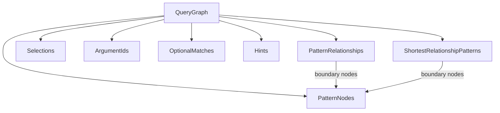
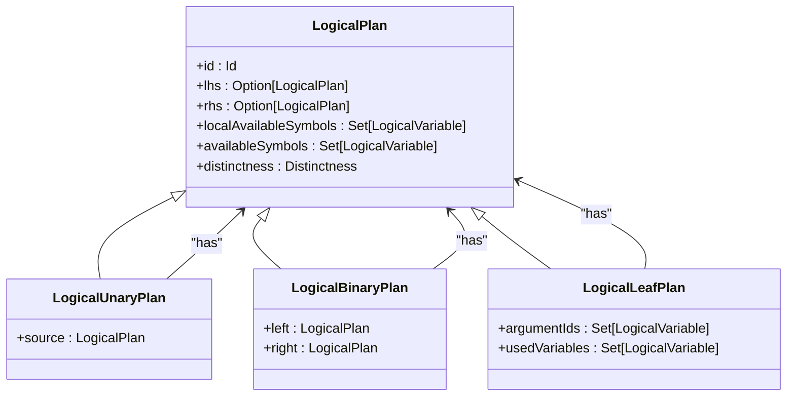
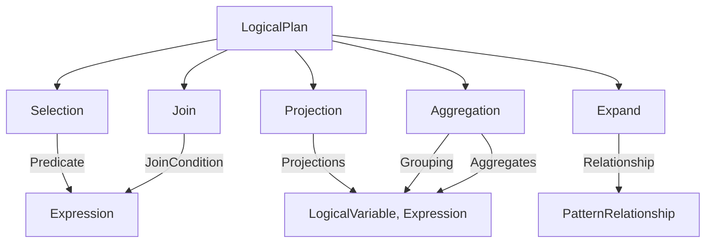
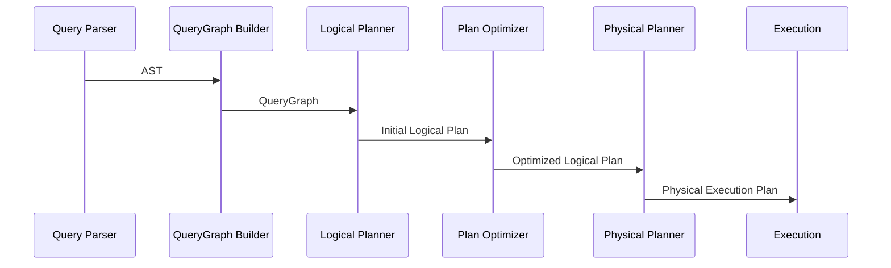
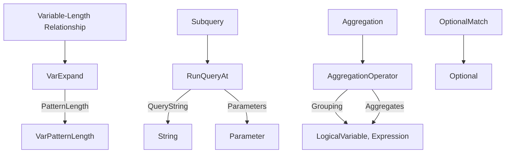
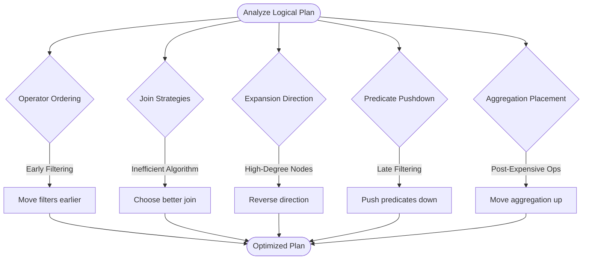

# Logical Planning

<cite>
**Referenced Files in This Document**   
- [LogicalPlan.scala](file://community\cypher\cypher-logical-plans\src\main\scala\org\neo4j\cypher\internal\logical\plans\LogicalPlan.scala)
- [QueryGraph.scala](file://community\cypher\ir\src\main\scala\org\neo4j\cypher\internal\ir\QueryGraph.scala)
- [QueryExpression.scala](file://community\cypher\cypher-logical-plans\src\main\scala\org\neo4j\cypher\internal\logical\plans\QueryExpression.scala)
- [LogicalPlans.scala](file://community\cypher\cypher-logical-plans\src\main\scala\org\neo4j\cypher\internal\logical\plans\LogicalPlans.scala)
- [SimpleLogicalPlanBuilder.scala](file://community\cypher\logical-plan-builder\src\main\scala\org\neo4j\cypher\internal\logical\builder\SimpleLogicalPlanBuilder.scala)
- [LogicalPlanProducer.scala](file://community\cypher\cypher-planner\src\main\scala\org\neo4j\cypher\internal\compiler\planner\logical\steps\LogicalPlanProducer.scala)
- [CypherRuntime.scala](file://community\cypher\cypher\src\main\scala\org\neo4j\cypher\internal\CypherRuntime.scala)
- [QueryHorizon.scala](file://community\cypher\ir\src\main\scala\org\neo4j\cypher\internal\ir\QueryHorizon.scala)
</cite>

## Table of Contents
1. [Introduction](#introduction)
2. [QueryGraph Representation](#querygraph-representation)
3. [Logical Plan Structure](#logical-plan-structure)
4. [Logical Operators](#logical-operators)
5. [Planning Process](#planning-process)
6. [Complex Pattern Planning](#complex-pattern-planning)
7. [Plan Analysis and Optimization](#plan-analysis-and-optimization)

## Introduction

The logical planning phase in Neo4j's Cypher query execution transforms parsed Cypher queries into executable logical query plans. This process begins with the transformation of the Abstract Syntax Tree (AST) into a QueryGraph representation, which captures the declarative aspects of the query including pattern matching, filtering, and data flow requirements. The QueryGraph serves as the foundation for generating logical plans composed of various logical operators that represent the operations needed to execute the query.

The logical planning process involves several key components: the QueryGraph which represents the query structure, logical operators that form the building blocks of the execution plan, and the planning algorithms that compose these operators into an optimal execution strategy. This document explains how Cypher clauses are translated into logical plan structures and provides guidance on understanding plan shapes and identifying potential inefficiencies.

**Section sources**
- [LogicalPlan.scala](file://community\cypher\cypher-logical-plans\src\main\scala\org\neo4j\cypher\internal\logical\plans\LogicalPlan.scala#L1-L100)
- [QueryGraph.scala](file://community\cypher\ir\src\main\scala\org\neo4j\cypher\internal\ir\QueryGraph.scala#L1-L50)

## QueryGraph Representation

The QueryGraph is a core component in Neo4j's query planning process, serving as an intermediate representation that captures the declarative aspects of a Cypher query. It represents the query structure in a format optimized for consumption by the planner, containing the same information as the AST but organized in a way that facilitates efficient planning.

A QueryGraph represents all MATCH, OPTIONAL MATCH, and update clauses between two WITH statements. It contains several key components:

- **patternRelationships**: Set of pattern relationships defined in the query
- **patternNodes**: Set of logical variables representing nodes in the pattern
- **selections**: Filter conditions from WHERE clauses
- **argumentIds**: Variables from the outer scope that are available as arguments
- **optionalMatches**: Optional match patterns that may not produce results
- **hints**: Query hints that influence the planning process
- **shortestRelationshipPatterns**: Patterns for shortest path calculations

The QueryGraph maintains important contracts to ensure consistency:
- All boundary nodes of node connections must be subset of pattern nodes
- All boundary nodes of shortest relationship patterns must be subset of pattern nodes

**Diagram sources **
- [QueryGraph.scala](file://community\cypher\ir\src\main\scala\org\neo4j\cypher\internal\ir\QueryGraph.scala#L62-L80)
- [QueryGraph.scala](file://community\cypher\ir\src\main\scala\org\neo4j\cypher\internal\ir\QueryGraph.scala#L52-L53)

**Section sources**
- [QueryGraph.scala](file://community\cypher\ir\src\main\scala\org\neo4j\cypher\internal\ir\QueryGraph.scala#L42-L80)

## Logical Plan Structure

Logical plans in Neo4j are represented as query trees where leaves correspond to database relations and non-leaf nodes represent algebraic operators such as selections, projections, and joins. The edges of the tree represent data flow from bottom to top, with intermediate nodes indicating the application of operators on the results of their children.

The LogicalPlan class hierarchy provides the foundation for all logical operators:

- **LogicalPlan**: Base abstract class for all logical operators
- **LogicalUnaryPlan**: Plan with a single child (source)
- **LogicalBinaryPlan**: Plan with two children (left and right)
- **LogicalLeafPlan**: Terminal plan with no children
- **AggregatingPlan**: Marker for plans that perform aggregation
- **UpdatingPlan**: Marker for plans that perform updates

Each logical plan has several key properties:
- **id**: Unique identifier for the plan
- **localAvailableSymbols**: Symbols available after the plan execution
- **availableSymbols**: Symbols including arguments from outer scopes
- **distinctness**: Information about whether the plan produces distinct results
- **lhs/rhs**: References to child plans (for binary plans)
- **source**: Reference to the child plan (for unary plans)

**Diagram sources **
- [LogicalPlan.scala](file://community\cypher\cypher-logical-plans\src\main\scala\org\neo4j\cypher\internal\logical\plans\LogicalPlan.scala#L152-L161)
- [LogicalPlan.scala](file://community\cypher\cypher-logical-plans\src\main\scala\org\neo4j\cypher\internal\logical\plans\LogicalPlan.scala#L395-L432)

**Section sources**
- [LogicalPlan.scala](file://community\cypher\cypher-logical-plans\src\main\scala\org\neo4j\cypher\internal\logical\plans\LogicalPlan.scala#L140-L200)

## Logical Operators

Logical operators are the building blocks of executable query plans, each representing a specific operation in the query execution process. These operators are composed hierarchically to form complete execution plans that satisfy the requirements of the original Cypher query.

### Selection Operator

The Selection operator filters rows based on a predicate expression. It evaluates the predicate for each input row and only passes through rows for which the predicate evaluates to true. This operator corresponds to the WHERE clause in Cypher queries.

### Projection Operator

The Projection operator computes new expressions and adds them to the result stream. It corresponds to the RETURN clause in Cypher queries, where expressions are evaluated and their results are included in the output. The projection operator maintains a mapping of variable names to their corresponding expressions.

### Expand Operator

The Expand operator traverses relationships between nodes, corresponding to pattern matching in Cypher queries. It can expand from a node to its neighbors in a specified direction, optionally filtering by relationship type and applying predicates on the traversed relationships and nodes.

### Join Operators

Join operators combine data from multiple sources based on specified conditions:

- **NodeHashJoin**: Performs hash-based joining on node identifiers
- **ValueHashJoin**: Performs hash-based joining on arbitrary values
- **Apply**: Executes the right-hand side plan for each row from the left-hand side, passing the left row as arguments

### Aggregation Operators

Aggregation operators perform grouping and aggregation operations:

- **Aggregation**: Groups rows by specified expressions and computes aggregate functions
- **EagerAggregation**: Forces materialization of intermediate results before aggregation

**Diagram sources **
- [LogicalPlan.scala](file://community\cypher\cypher-logical-plans\src\main\scala\org\neo4j\cypher\internal\logical\plans\LogicalPlan.scala#L749-L782)
- [LogicalPlan.scala](file://community\cypher\cypher-logical-plans\src\main\scala\org\neo4j\cypher\internal\logical\plans\LogicalPlan.scala#L788-L799)

**Section sources**
- [LogicalPlan.scala](file://community\cypher\cypher-logical-plans\src\main\scala\org\neo4j\cypher\internal\logical\plans\LogicalPlan.scala#L749-L800)

## Planning Process

The logical planning process transforms a QueryGraph into a logical query plan through a series of steps that analyze the query structure and compose appropriate logical operators. This process begins with the creation of a LogicalQuery object that contains the logical plan along with metadata such as query text, read-only status, result columns, and semantic information.

The planning process follows these key steps:

1. **Query Parsing**: The Cypher query is parsed into an AST
2. **QueryGraph Construction**: The AST is transformed into a QueryGraph representation
3. **Logical Plan Generation**: The QueryGraph is used to generate a logical plan through pattern matching and operator composition
4. **Plan Optimization**: The initial plan is optimized through various rewriting rules
5. **Physical Planning**: The logical plan is translated into a physical execution plan

The LogicalPlanProducer class is responsible for creating logical plans with the appropriate solved PlannerQuery. It takes parameters such as cardinality model, planning attributes, and ID generator to produce the correct logical plan structure.

**Diagram sources **
- [LogicalPlanProducer.scala](file://community\cypher\cypher-planner\src\main\scala\org\neo4j\cypher\internal\compiler\planner\logical\steps\LogicalPlanProducer.scala#L301-L305)
- [CypherRuntime.scala](file://community\cypher\cypher\src\main\scala\org\neo4j\cypher\internal\CypherRuntime.scala#L58-L67)

**Section sources**
- [LogicalPlanProducer.scala](file://community\cypher\cypher-planner\src\main\scala\org\neo4j\cypher\internal\compiler\planner\logical\steps\LogicalPlanProducer.scala#L296-L318)
- [CypherRuntime.scala](file://community\cypher\cypher\src\main\scala\org\neo4j\cypher\internal\CypherRuntime.scala#L58-L103)

## Complex Pattern Planning

The logical planning process handles complex Cypher patterns including variable-length relationships, subqueries, and aggregations through specialized operators and planning strategies.

### Variable-Length Relationships

Variable-length relationships are handled by the VarExpand operator, which extends the basic Expand operator to traverse multiple relationship steps. The planning process analyzes the length constraints and directionality of the pattern to determine the most efficient expansion strategy.

### Subqueries

Subqueries are represented using the RunQueryAt operator, which encapsulates a subquery execution within the main query plan. The subquery is serialized as a standalone Cypher query string with parameters for imported variables from the outer query.

### Aggregations

Aggregation planning involves the Aggregation operator which groups input rows by specified expressions and computes aggregate functions. The planning process analyzes the grouping expressions and aggregation functions to determine the appropriate execution strategy, including whether intermediate results need to be materialized.

### Optional Matches

Optional matches are handled through the Optional operator, which preserves all rows from the left side while optionally including matching rows from the right side. The planning process must carefully manage the scoping of variables and null handling for unmatched patterns.

**Diagram sources **
- [QueryHorizon.scala](file://community\cypher\ir\src\main\scala\org\neo4j\cypher\internal\ir\QueryHorizon.scala#L361-L368)
- [LogicalPlan.scala](file://community\cypher\cypher-logical-plans\src\main\scala\org\neo4j\cypher\internal\logical\plans\LogicalPlan.scala#L749-L782)

**Section sources**
- [QueryHorizon.scala](file://community\cypher\ir\src\main\scala\org\neo4j\cypher\internal\ir\QueryHorizon.scala#L361-L374)
- [LogicalPlan.scala](file://community\cypher\cypher-logical-plans\src\main\scala\org\neo4j\cypher\internal\logical\plans\LogicalPlan.scala#L749-L782)

## Plan Analysis and Optimization

Understanding logical plan shapes is crucial for identifying potential inefficiencies and optimizing query performance. The structure of the logical plan reveals the execution strategy chosen by the planner and can highlight areas for improvement.

Key aspects to analyze in logical plans include:

- **Operator Ordering**: The sequence of operators can significantly impact performance. Early filtering reduces the number of rows processed by subsequent operators.
- **Join Strategies**: The choice of join algorithm (hash join, nested loop, etc.) affects memory usage and execution time.
- **Expansion Direction**: For graph traversals, the direction of expansion can impact performance based on node degree distribution.
- **Predicate Pushdown**: Whether filtering predicates are applied as early as possible in the plan.
- **Aggregation Placement**: Whether aggregations are performed before or after expensive operations.

The LogicalPlans utility provides methods for traversing and analyzing plan structures:

- **map**: Transforms the plan tree in a bottom-up fashion
- **foldPlan**: Folds over the plan tree in execution order
- **simpleFoldPlan**: Simple fold over the plan tree

These utilities enable analysis of plan properties such as operator counts, predicate distributions, and data flow characteristics.

**Diagram sources **
- [LogicalPlans.scala](file://community\cypher\cypher-logical-plans\src\main\scala\org\neo4j\cypher\internal\logical\plans\LogicalPlans.scala#L26-L124)
- [LogicalPlan.scala](file://community\cypher\cypher-logical-plans\src\main\scala\org\neo4j\cypher\internal\logical\plans\LogicalPlan.scala#L145-L151)

**Section sources**
- [LogicalPlans.scala](file://community\cypher\cypher-logical-plans\src\main\scala\org\neo4j\cypher\internal\logical\plans\LogicalPlans.scala#L26-L283)
- [LogicalPlan.scala](file://community\cypher\cypher-logical-plans\src\main\scala\org\neo4j\cypher\internal\logical\plans\LogicalPlan.scala#L140-L151)