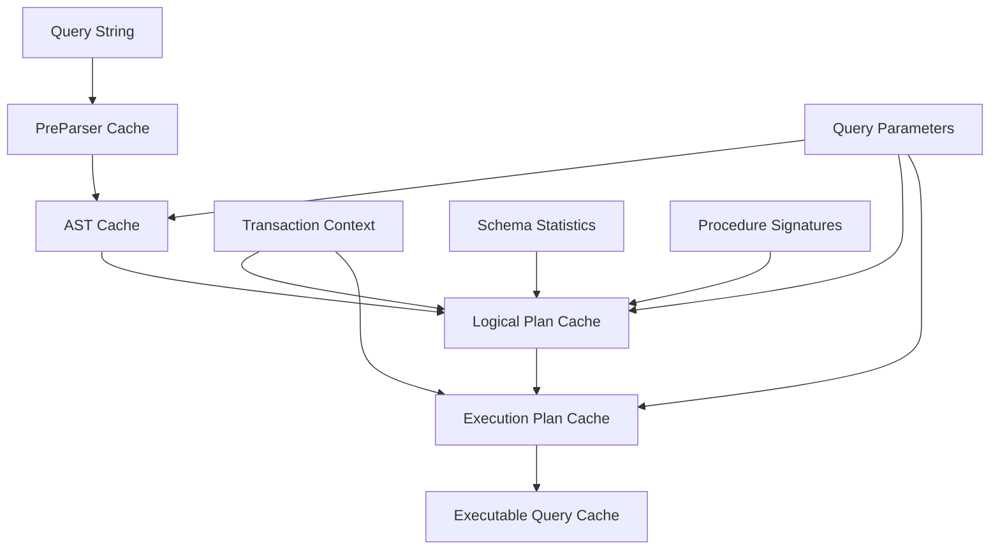
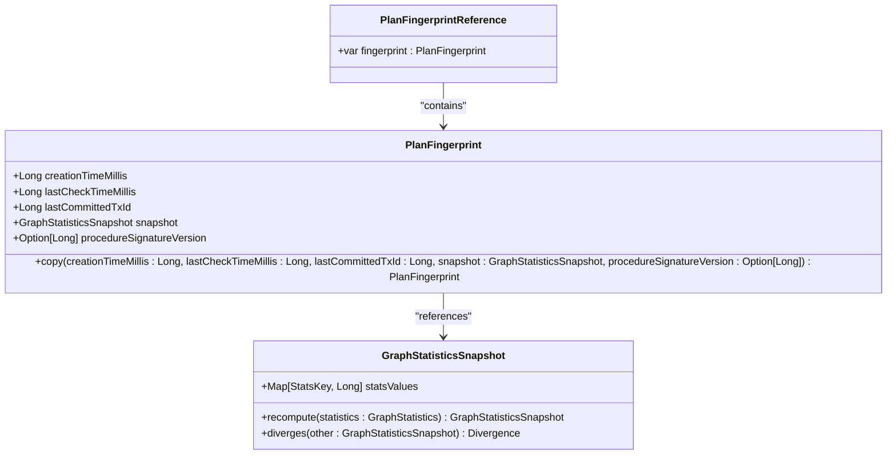
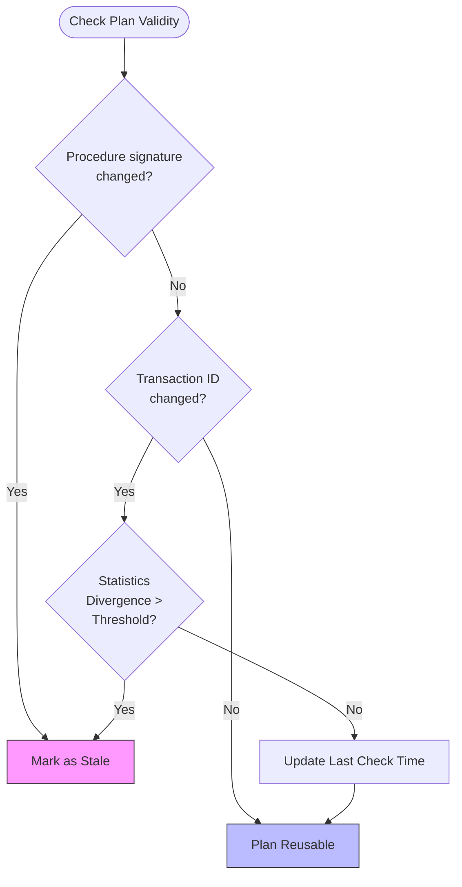
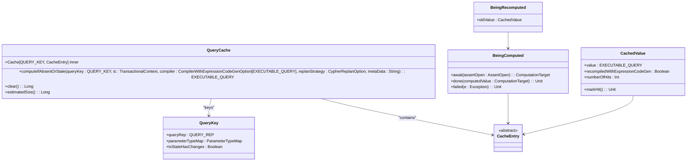
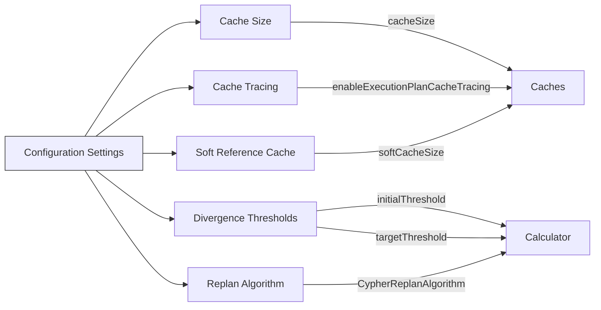
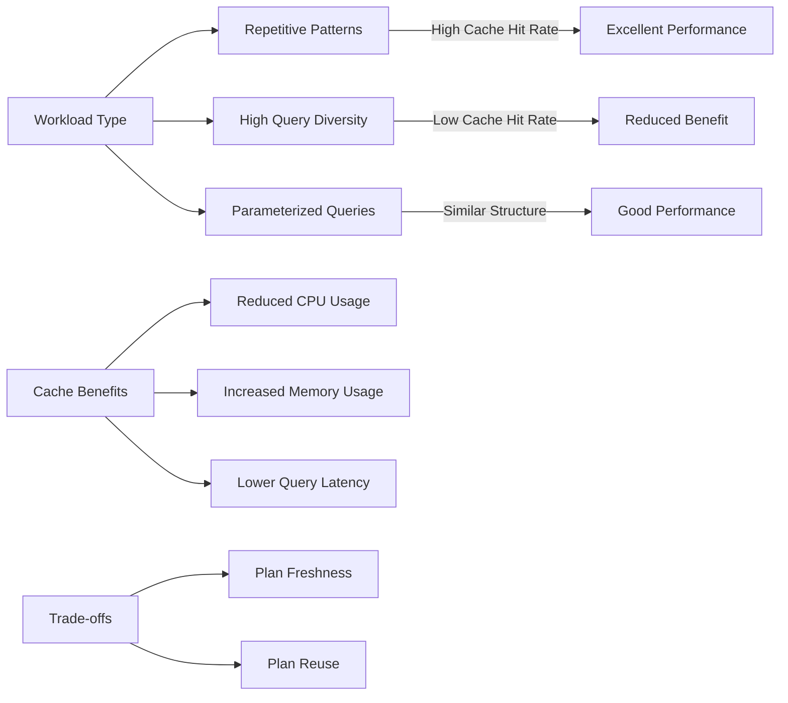
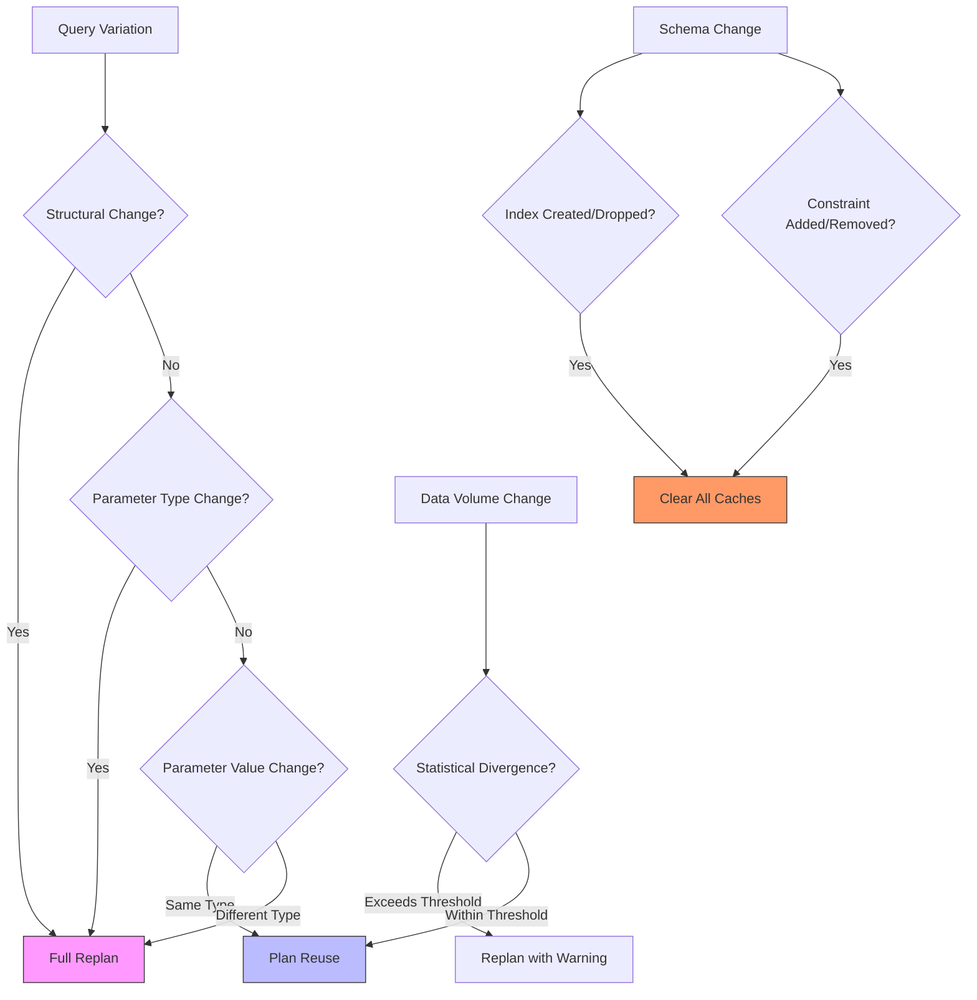
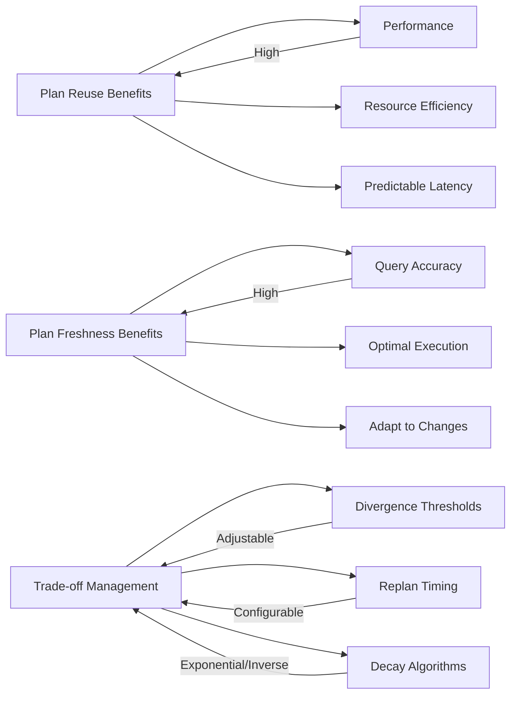

# Plan Selection Strategies

<cite>
**Referenced Files in This Document**   
- [PlanFingerprint.scala](file://community/cypher/cypher/src/main/scala/org/neo4j/cypher/internal/PlanFingerprint.scala)
- [DefaultPlanStalenessCaller.scala](file://community/cypher/cypher/src/main/scala/org/neo4j/cypher/internal/DefaultPlanStalenessCaller.scala)
- [CypherQueryCaches.scala](file://community/cypher/cypher/src/main/scala/org/neo4j/cypher/internal/cache/CypherQueryCaches.scala)
- [QueryCache.scala](file://community/cypher/cypher/src/main/scala/org/neo4j/cypher/internal/QueryCache.scala)
- [ExecutableQuery.scala](file://community/cypher/cypher/src/main/scala/org/neo4j/cypher/internal/ExecutableQuery.scala)
- [StatsDivergenceCalculator.scala](file://community/cypher/cypher-planner/src/main/scala/org/neo4j/cypher/internal/compiler/StatsDivergenceCalculator.scala)
- [QueryGraph.scala](file://community/cypher/ir/src/main/scala/org/neo4j/cypher/internal/ir/QueryGraph.scala)
</cite>

## Table of Contents
1. [Introduction](#introduction)
2. [Query Plan Caching Architecture](#query-plan-caching-architecture)
3. [Fingerprinting Mechanism](#fingerprinting-mechanism)
4. [Plan Reusability and Staleness Detection](#plan-reusability-and-staleness-detection)
5. [Query Graph Fingerprint Reference Cache](#query-graph-fingerprint-reference-cache)
6. [Configuration and Control](#configuration-and-control)
7. [Performance Implications](#performance-implications)
8. [Query Variations and Plan Invalidation](#query-variations-and-plan-invalidation)
9. [Trade-offs Between Plan Reuse and Freshness](#trade-offs-between-plan-reuse-and-freshness)
10. [Conclusion](#conclusion)

## Introduction
Neo4j's Cypher query planner employs sophisticated plan selection strategies to optimize query execution performance through intelligent caching and reuse of execution plans. The system implements a multi-layered caching architecture that leverages fingerprinting mechanisms to detect query similarity and structural equivalence, enabling efficient plan reuse while maintaining query result accuracy. This document details the implementation of the QueryGraphFingerprintReferenceCache and PlanFingerprint components that form the foundation of Neo4j's plan caching system, explaining how they handle parameter changes, schema evolution, and workload characteristics to balance performance optimization with query plan freshness.

**Section sources**
- [PlanFingerprint.scala](file://community/cypher/cypher/src/main/scala/org/neo4j/cypher/internal/PlanFingerprint.scala)
- [CypherQueryCaches.scala](file://community/cypher/cypher/src/main/scala/org/neo4j/cypher/internal/cache/CypherQueryCaches.scala)

## Query Plan Caching Architecture
Neo4j implements a hierarchical caching system for Cypher query planning with multiple cache layers that store different stages of the query compilation process. The architecture consists of several specialized caches that work together to optimize query execution:

**Diagram sources**
- [CypherQueryCaches.scala](file://community/cypher/cypher/src/main/scala/org/neo4j/cypher/internal/cache/CypherQueryCaches.scala)
- [QueryCache.scala](file://community/cypher/cypher/src/main/scala/org/neo4j/cypher/internal/QueryCache.scala)

The caching hierarchy operates as follows:
- **PreParser Cache**: Stores normalized query representations after initial parsing
- **AST Cache**: Caches abstract syntax trees with parameter type information
- **Logical Plan Cache**: Stores optimized logical query plans with reusability state
- **Execution Plan Cache**: Contains physical execution plans for specific runtimes
- **Executable Query Cache**: Caches complete query processing with all dependencies

Each cache layer serves as an optimization point, allowing the system to skip expensive compilation stages when equivalent queries are encountered. The Logical Plan Cache and Execution Plan Cache are particularly important for plan reuse, as they store the core optimization decisions that significantly impact query performance.

**Section sources**
- [CypherQueryCaches.scala](file://community/cypher/cypher/src/main/scala/org/neo4j/cypher/internal/cache/CypherQueryCaches.scala)
- [QueryCache.scala](file://community/cypher/cypher/src/main/scala/org/neo4j/cypher/internal/QueryCache.scala)

## Fingerprinting Mechanism
The plan fingerprinting mechanism in Neo4j captures the essential context required to determine whether a cached execution plan remains valid for reuse. The PlanFingerprint class encapsulates this context with several key components that ensure plan correctness across different execution scenarios.

**Diagram sources**
- [PlanFingerprint.scala](file://community/cypher/cypher/src/main/scala/org/neo4j/cypher/internal/PlanFingerprint.scala)
- [QueryCache.scala](file://community/cypher/cypher/src/main/scala/org/neo4j/cypher/internal/QueryCache.scala)

The PlanFingerprint structure includes:
- **Creation timestamp**: Records when the plan was initially generated
- **Last check timestamp**: Tracks the most recent staleness verification
- **Last committed transaction ID**: Monitors database changes that might affect plan validity
- **Graph statistics snapshot**: Captures database statistics (node/relationship counts, index densities) at plan creation time
- **Procedure signature version**: Ensures compatibility with database procedures and functions

The fingerprint is created using the `PlanFingerprint.take()` method, which captures the current database state including statistics and transaction context. This comprehensive snapshot enables the system to detect when underlying data or schema changes would invalidate the cached plan's assumptions.

**Section sources**
- [PlanFingerprint.scala](file://community/cypher/cypher/src/main/scala/org/neo4j/cypher/internal/PlanFingerprint.scala)
- [DefaultPlanStalenessCaller.scala](file://community/cypher/cypher/src/main/scala/org/neo4j/cypher/internal/DefaultPlanStalenessCaller.scala)

## Plan Reusability and Staleness Detection
Neo4j employs a sophisticated staleness detection system to determine when cached execution plans should be discarded and regenerated. The DefaultPlanStalenessCaller class implements the logic for evaluating plan validity based on multiple factors that could affect query performance or correctness.

**Diagram sources**
- [DefaultPlanStalenessCaller.scala](file://community/cypher/cypher/src/main/scala/org/neo4j/cypher/internal/DefaultPlanStalenessCaller.scala)
    - [PlanFingerprint.scala](file://community/cypher/cypher/src/main/scala/org/neo4j/cypher/internal/PlanFingerprint.scala)

The staleness detection process evaluates three primary conditions:
1. **Procedure signature changes**: If the signature version of any resolved procedure differs from when the plan was created, the plan is considered stale
2. **Transaction state changes**: When the last committed transaction ID has changed, indicating database modifications
3. **Statistical divergence**: When the current graph statistics diverge significantly from the snapshot in the fingerprint

The system uses a configurable divergence calculator (StatsDivergenceCalculator) that implements decay algorithms to balance plan reuse with freshness. The threshold for statistical divergence decreases over time since the last recompilation, encouraging periodic plan regeneration for frequently executed queries.

**Section sources**
- [DefaultPlanStalenessCaller.scala](file://community/cypher/cypher/src/main/scala/org/neo4j/cypher/internal/DefaultPlanStalenessCaller.scala)
- [StatsDivergenceCalculator.scala](file://community/cypher/cypher-planner/src/main/scala/org/neo4j/cypher/internal/compiler/StatsDivergenceCalculator.scala)

## Query Graph Fingerprint Reference Cache
The QueryGraphFingerprintReferenceCache is a specialized cache implementation that stores execution plans with their associated fingerprints, enabling efficient plan reuse based on query structure and execution context. This cache serves as the foundation for Neo4j's multi-level caching strategy.

**Diagram sources**
- [QueryCache.scala](file://community/cypher/cypher/src/main/scala/org/neo4j/cypher/internal/QueryCache.scala)
- [CypherQueryCaches.scala](file://community/cypher/cypher/src/main/scala/org/neo4j/cypher/internal/cache/CypherQueryCaches.scala)

The cache implementation features several sophisticated mechanisms:
- **Concurrent compilation handling**: Uses CompletableFuture to coordinate multiple threads attempting to compile the same query
- **Parameter type mapping**: Incorporates parameter types into the cache key to prevent type-related execution errors
- **Transaction state awareness**: Includes transaction state changes in the cache key to handle write operations correctly
- **Recompilation tracking**: Manages both initial compilation and subsequent recompilation with expression code generation

The cache entry states handle various scenarios:
- **BeingComputed**: Placeholder for queries currently being compiled
- **BeingRecomputed**: Temporary state when a cached plan is being re-evaluated for staleness
- **CachedValue**: Final state containing the executable query with hit tracking

**Section sources**
- [QueryCache.scala](file://community/cypher/cypher/src/main/scala/org/neo4j/cypher/internal/QueryCache.scala)
- [CypherQueryCaches.scala](file://community/cypher/cypher/src/main/scala/org/neo4j/cypher/internal/cache/CypherQueryCaches.scala)

## Configuration and Control
Neo4j provides extensive configuration options to control plan caching behavior, allowing administrators to tune the system for specific workload characteristics and performance requirements.

**Diagram sources**
- [CypherQueryCaches.scala](file://community/cypher/cypher/src/main/scala/org/neo4j/cypher/internal/cache/CypherQueryCaches.scala)
- [StatsDivergenceCalculator.scala](file://community/cypher/cypher-planner/src/main/scala/org/neo4j/cypher/internal/compiler/StatsDivergenceCalculator.scala)

Key configuration parameters include:
- **Cache size**: Controls the maximum number of entries in each cache level
- **Divergence thresholds**: Configures the initial and target thresholds for statistical divergence
- **Replan algorithm**: Selects the decay algorithm (NONE, EXPONENTIAL, INVERSE) for threshold adjustment
- **Minimum replan interval**: Sets the minimum time between plan recompilations
- **Target replan interval**: Defines the desired time frame for threshold decay
- **Soft reference cache**: Enables soft references for memory pressure resilience

The system also supports query-level control through the `replan` option, allowing individual queries to force recompilation (`replan=force`), skip caching (`replan=skip`), or use default behavior (`replan=default`).

**Section sources**
- [CypherQueryCaches.scala](file://community/cypher/cypher/src/main/scala/org/neo4j/cypher/internal/cache/CypherQueryCaches.scala)
- [StatsDivergenceCalculator.scala](file://community/cypher/cypher-planner/src/main/scala/org/neo4j/cypher/internal/compiler/StatsDivergenceCalculator.scala)

## Performance Implications
The plan selection strategies in Neo4j have significant performance implications that vary depending on workload characteristics. The caching system is optimized for different query patterns and data access scenarios.

**Diagram sources**
- [CypherQueryCaches.scala](file://community/cypher/cypher/src/main/scala/org/neo4j/cypher/internal/cache/CypherQueryCaches.scala)
- [ExecutableQuery.scala](file://community/cypher/cypher/src/main/scala/org/neo4j/cypher/internal/ExecutableQuery.scala)

For workloads with repetitive query patterns, the caching system provides substantial performance benefits:
- **Reduced compilation overhead**: Eliminates expensive parsing and optimization for repeated queries
- **Lower CPU utilization**: Avoids repeated cost model calculations and plan selection
- **Predictable latency**: Provides consistent response times for frequently executed queries

For workloads with high query diversity, the benefits are more limited:
- **Cache pollution risk**: Unique queries can fill the cache without providing reuse benefits
- **Memory overhead**: Large caches consume significant memory resources
- **Management overhead**: Cache maintenance operations consume system resources

The system performs particularly well with parameterized queries that share the same structure but different parameter values, as these can reuse execution plans while maintaining query-specific optimizations.

**Section sources**
- [CypherQueryCaches.scala](file://community/cypher/cypher/src/main/scala/org/neo4j/cypher/internal/cache/CypherQueryCaches.scala)
- [ExecutableQuery.scala](file://community/cypher/cypher/src/main/scala/org/neo4j/cypher/internal/ExecutableQuery.scala)

## Query Variations and Plan Invalidation
Neo4j's plan caching system handles various query variations through sophisticated invalidation mechanisms that balance plan reuse with correctness. Different types of query changes trigger different responses in the caching system.

**Diagram sources**
- [DefaultPlanStalenessCaller.scala](file://community/cypher/cypher/src/main/scala/org/neo4j/cypher/internal/DefaultPlanStalenessCaller.scala)
- [QueryCache.scala](file://community/cypher/cypher/src/main/scala/org/neo4j/cypher/internal/QueryCache.scala)

The system responds to different query variations as follows:
- **Structural changes**: Any modification to query structure (added/removed clauses, changed patterns) results in a new cache entry
- **Parameter type changes**: Changes in parameter types invalidate cached plans to prevent type-related execution errors
- **Parameter value changes**: Values of the same type allow plan reuse, maintaining optimization benefits
- **Schema evolution**: Creation or removal of indexes and constraints clears all caches to ensure plan correctness
- **Data volume changes**: Significant changes in graph statistics trigger plan re-evaluation based on divergence thresholds

The system also handles procedure and function changes by tracking signature versions, ensuring that queries using database procedures are recompiled when those procedures change.

**Section sources**
- [DefaultPlanStalenessCaller.scala](file://community/cypher/cypher/src/main/scala/org/neo4j/cypher/internal/DefaultPlanStalenessCaller.scala)
- [QueryCache.scala](file://community/cypher/cypher/src/main/scala/org/neo4j/cypher/internal/QueryCache.scala)

## Trade-offs Between Plan Reuse and Freshness
The plan selection strategies in Neo4j involve careful trade-offs between the benefits of plan reuse and the need for plan freshness. These trade-offs are managed through configurable parameters and adaptive algorithms.

**Diagram sources**
- [StatsDivergenceCalculator.scala](file://community/cypher/cypher-planner/src/main/scala/org/neo4j/cypher/internal/compiler/StatsDivergenceCalculator.scala)
- [DefaultPlanStalenessCaller.scala](file://community/cypher/cypher/src/main/scala/org/neo4j/cypher/internal/DefaultPlanStalenessCaller.scala)

The key trade-offs include:
- **Performance vs. Optimality**: Reusing plans improves performance but may miss optimization opportunities from updated statistics
- **Memory usage vs. Compilation cost**: Larger caches consume more memory but reduce compilation overhead
- **Stability vs. Adaptability**: Stable plans provide predictable performance but may not adapt quickly to data changes

Neo4j addresses these trade-offs through:
- **Adaptive threshold decay**: Gradually lowering divergence thresholds over time to encourage periodic re-planning
- **Configurable algorithms**: Allowing selection of decay algorithms (exponential, inverse) based on workload characteristics
- **Multi-level caching**: Balancing reuse benefits across different compilation stages
- **Context-aware invalidation**: Precisely identifying when changes require plan regeneration

The system is designed to favor plan reuse for stable workloads while ensuring timely re-planning when data or schema changes warrant optimization updates.

**Section sources**
- [StatsDivergenceCalculator.scala](file://community/cypher/cypher-planner/src/main/scala/org/neo4j/cypher/internal/compiler/StatsDivergenceCalculator.scala)
- [DefaultPlanStalenessCaller.scala](file://community/cypher/cypher/src/main/scala/org/neo4j/cypher/internal/DefaultPlanStalenessCaller.scala)

## Conclusion
Neo4j's plan selection strategies represent a sophisticated approach to query optimization that balances performance, correctness, and resource efficiency. The system's fingerprinting mechanism and multi-level caching architecture enable efficient plan reuse while maintaining query result accuracy through comprehensive staleness detection. By capturing essential execution context in the PlanFingerprint and using adaptive algorithms to manage the trade-offs between reuse and freshness, Neo4j provides a robust solution for optimizing Cypher query performance across diverse workloads. The configurable nature of the caching system allows administrators to tune behavior for specific use cases, from high-throughput transactional systems to analytical workloads with complex query patterns. This comprehensive approach ensures that Neo4j can deliver optimal query performance while adapting to changing data and schema conditions.

**Section sources**
- [PlanFingerprint.scala](file://community/cypher/cypher/src/main/scala/org/neo4j/cypher/internal/PlanFingerprint.scala)
- [CypherQueryCaches.scala](file://community/cypher/cypher/src/main/scala/org/neo4j/cypher/internal/cache/CypherQueryCaches.scala)
- [DefaultPlanStalenessCaller.scala](file://community/cypher/cypher/src/main/scala/org/neo4j/cypher/internal/DefaultPlanStalenessCaller.scala)