# Query Planning

<cite>
**Referenced Files in This Document**   
- [LogicalPlan.scala](file://community/cypher/cypher-logical-plans/src/main/scala/org/neo4j/cypher/internal/logical/plans/LogicalPlan.scala)
- [IDPQueryGraphSolver.scala](file://community/cypher/cypher-planner/src/main/scala/org/neo4j/cypher/internal/compiler/planner/logical/idp/IDPQueryGraphSolver.scala)
- [QueryGraphSolver.scala](file://community/cypher/cypher-planner/src/main/scala/org/neo4j/cypher/internal/compiler/planner/logical/QueryGraphSolver.scala)
- [QueryGraph.scala](file://community/cypher/ir/src/main/scala/org/neo4j/cypher/internal/ir/QueryGraph.scala)
- [CardinalityCostModel.scala](file://community/cypher/cypher-planner/src/main/scala/org/neo4j/cypher/internal/compiler/planner/logical/CardinalityCostModel.scala)
- [PhysicalPlanner.scala](file://community/cypher/physical-planning/src/main/scala/org/neo4j/cypher/internal/physicalplanning/PhysicalPlanner.scala)
- [QueryPlanner.scala](file://community/cypher/cypher-planner/src/main/scala/org/neo4j/cypher/internal/compiler/planner/logical/QueryPlanner.scala)
- [NFA.scala](file://community/cypher/cypher-logical-plans/src/main/scala/org/neo4j/cypher/internal/logical/plans/NFA.scala)
- [LogicalPlanGenerator.scala](file://community/cypher/logical-plan-generator/src/main/scala/org/neo4j/cypher/internal/logical/generator/LogicalPlanGenerator.scala)
</cite>

## Table of Contents
1. [Introduction](#introduction)
2. [Query Planning Architecture](#query-planning-architecture)
3. [QueryGraph and Declarative Query Representation](#querygraph-and-declarative-query-representation)
4. [Logical Planning Process](#logical-planning-process)
5. [IDPQueryGraphSolver and Optimal Plan Selection](#idpquerygraphsolver-and-optimal-plan-selection)
6. [Domain Model of Logical Plans](#domain-model-of-logical-plans)
7. [Cost-Based Optimization and Cardinality Estimation](#cost-based-optimization-and-cardinality-estimation)
8. [Physical Planning and Execution Runtime](#physical-planning-and-execution-runtime)
9. [Query Pattern Translation Examples](#query-pattern-translation-examples)
10. [Common Planning Issues and Performance Considerations](#common-planning-issues-and-performance-considerations)
11. [Query Optimization Best Practices](#query-optimization-best-practices)
12. [Conclusion](#conclusion)

## Introduction

The Cypher query planning component is responsible for transforming parsed Cypher queries into executable logical plans through a sophisticated optimization process. This document provides a comprehensive analysis of the query planning architecture, focusing on the logical planning process that converts declarative query patterns into optimal execution strategies. The planner employs a cost-based optimization approach, utilizing the QueryGraph data structure to represent query patterns and the IDPQueryGraphSolver to find optimal execution plans through dynamic programming techniques. The system integrates with the execution runtime to deliver efficient query processing while handling complex graph patterns, subqueries, and various MATCH clauses.

## Query Planning Architecture

The Cypher query planning architecture follows a multi-stage compilation process that transforms high-level Cypher queries into executable physical plans. The architecture is organized into distinct components that handle different aspects of the planning process, from initial query analysis to final plan execution.

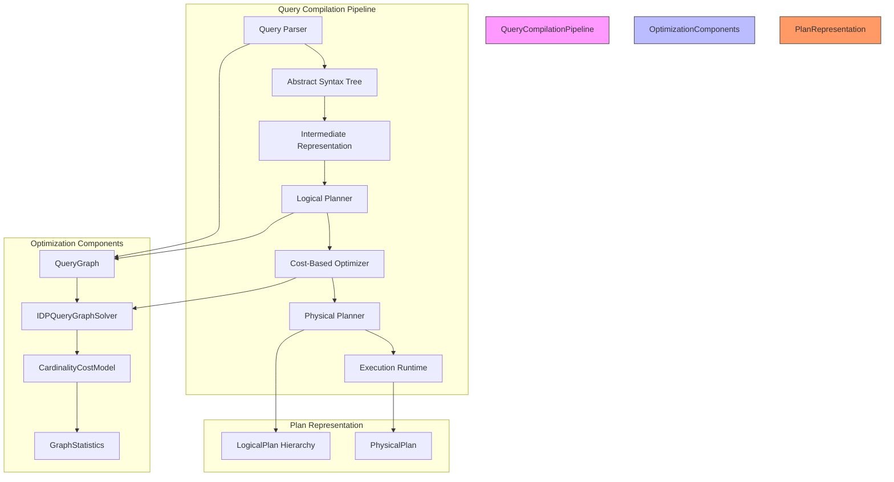

**Diagram sources**
- [QueryPlanner.scala](file://community/cypher/cypher-planner/src/main/scala/org/neo4j/cypher/internal/compiler/planner/logical/QueryPlanner.scala)
- [IDPQueryGraphSolver.scala](file://community/cypher/cypher-planner/src/main/scala/org/neo4j/cypher/internal/compiler/planner/logical/idp/IDPQueryGraphSolver.scala)
- [CardinalityCostModel.scala](file://community/cypher/cypher-planner/src/main/scala/org/neo4j/cypher/internal/compiler/planner/logical/CardinalityCostModel.scala)

**Section sources**
- [QueryPlanner.scala](file://community/cypher/cypher-planner/src/main/scala/org/neo4j/cypher/internal/compiler/planner/logical/QueryPlanner.scala)
- [PhysicalPlanner.scala](file://community/cypher/physical-planning/src/main/scala/org/neo4j/cypher/internal/physicalplanning/PhysicalPlanner.scala)

## QueryGraph and Declarative Query Representation

The QueryGraph is a fundamental data structure that represents the declarative query patterns extracted from Cypher queries. It serves as an intermediate representation that captures the essential elements of a query, including patterns, predicates, and relationships, without specifying the execution strategy. The QueryGraph acts as the input to the planning process, enabling the planner to analyze and optimize query patterns independently of their execution.

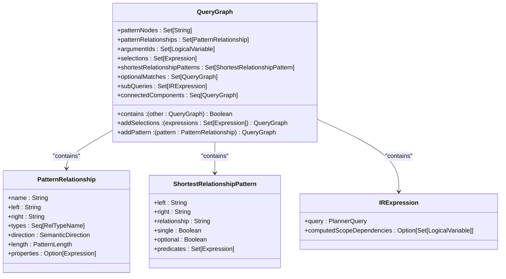

**Diagram sources**
- [QueryGraph.scala](file://community/cypher/ir/src/main/scala/org/neo4j/cypher/internal/ir/QueryGraph.scala)
- [LogicalPlan.scala](file://community/cypher/cypher-logical-plans/src/main/scala/org/neo4j/cypher/internal/logical/plans/LogicalPlan.scala)

**Section sources**
- [QueryGraph.scala](file://community/cypher/ir/src/main/scala/org/neo4j/cypher/internal/ir/QueryGraph.scala)

## Logical Planning Process

The logical planning process transforms the declarative QueryGraph representation into executable logical plans through a systematic approach that considers various execution strategies and selects the optimal one based on cost estimates. The process begins with the decomposition of the query into connected components, which are planned independently before being connected through appropriate join operations.

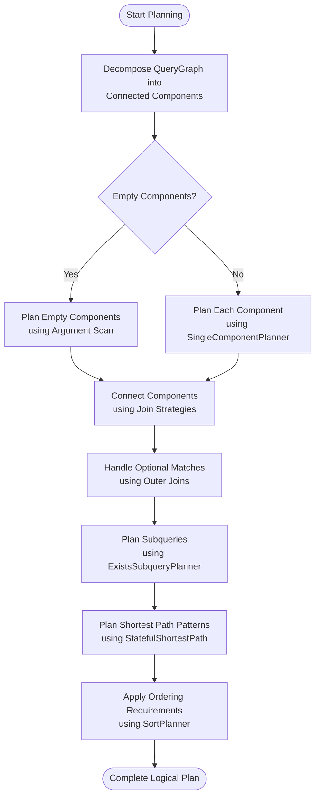

**Diagram sources**
- [IDPQueryGraphSolver.scala](file://community/cypher/cypher-planner/src/main/scala/org/neo4j/cypher/internal/compiler/planner/logical/idp/IDPQueryGraphSolver.scala)
- [QueryPlanner.scala](file://community/cypher/cypher-planner/src/main/scala/org/neo4j/cypher/internal/compiler/planner/logical/QueryPlanner.scala)

**Section sources**
- [IDPQueryGraphSolver.scala](file://community/cypher/cypher-planner/src/main/scala/org/neo4j/cypher/internal/compiler/planner/logical/idp/IDPQueryGraphSolver.scala)

## IDPQueryGraphSolver and Optimal Plan Selection

The IDPQueryGraphSolver is the core component responsible for finding optimal execution strategies through an iterative dynamic programming approach. Based on the paper "Iterative Dynamic Programming: A New Class of Query Optimization Algorithms" by Donald Kossmann and Konrad Stocker, this solver employs a systematic method to explore the space of possible execution plans and select the most efficient one based on cost estimates.

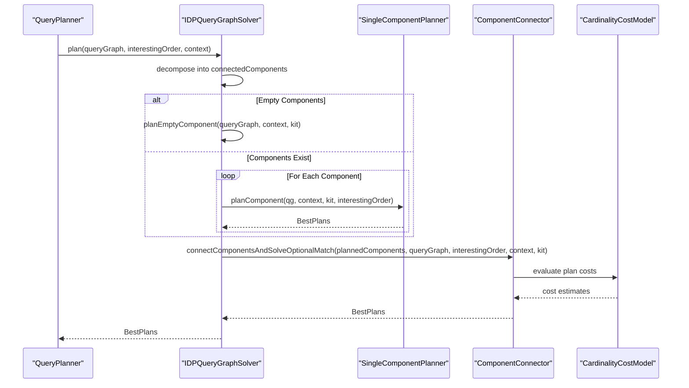

**Diagram sources**
- [IDPQueryGraphSolver.scala](file://community/cypher/cypher-planner/src/main/scala/org/neo4j/cypher/internal/compiler/planner/logical/idp/IDPQueryGraphSolver.scala)
- [CardinalityCostModel.scala](file://community/cypher/cypher-planner/src/main/scala/org/neo4j/cypher/internal/compiler/planner/logical/CardinalityCostModel.scala)

**Section sources**
- [IDPQueryGraphSolver.scala](file://community/cypher/cypher-planner/src/main/scala/org/neo4j/cypher/internal/compiler/planner/logical/idp/IDPQueryGraphSolver.scala)

## Domain Model of Logical Plans

The domain model of logical plans is built around a hierarchy of plan nodes that represent different operations in the query execution process. The LogicalPlan trait serves as the base class for all plan nodes, with various specialized implementations for different operations such as scans, joins, aggregations, and pattern matching.

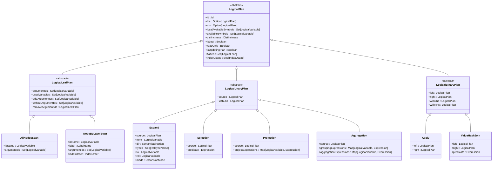

**Diagram sources**
- [LogicalPlan.scala](file://community/cypher/cypher-logical-plans/src/main/scala/org/neo4j/cypher/internal/logical/plans/LogicalPlan.scala)

**Section sources**
- [LogicalPlan.scala](file://community/cypher/cypher-logical-plans/src/main/scala/org/neo4j/cypher/internal/logical/plans/LogicalPlan.scala)

## Cost-Based Optimization and Cardinality Estimation

The cost-based optimization process relies on accurate cardinality estimation to compare different execution plans and select the most efficient one. The CardinalityCostModel evaluates the cost of each plan based on estimated row counts, operation complexity, and data access patterns, using graph statistics to inform its estimates.

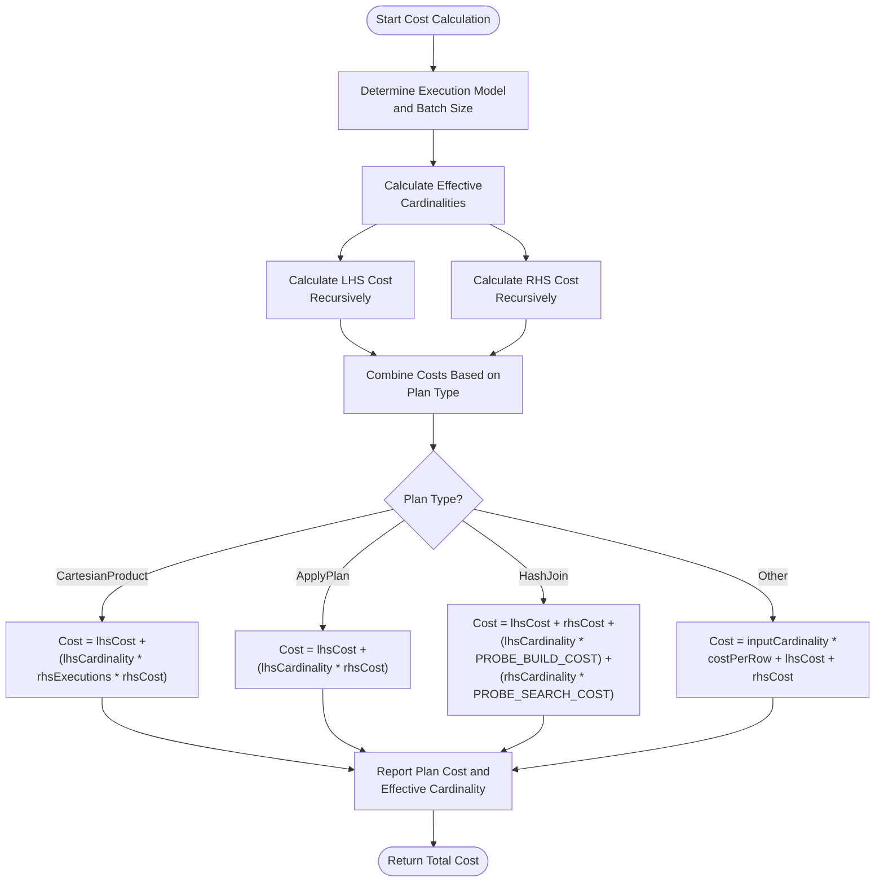

**Diagram sources**
- [CardinalityCostModel.scala](file://community/cypher/cypher-planner/src/main/scala/org/neo4j/cypher/internal/compiler/planner/logical/CardinalityCostModel.scala)

**Section sources**
- [CardinalityCostModel.scala](file://community/cypher/cypher-planner/src/main/scala/org/neo4j/cypher/internal/compiler/planner/logical/CardinalityCostModel.scala)

## Physical Planning and Execution Runtime

The physical planning phase transforms the optimized logical plan into a physical execution plan that can be executed by the runtime engine. This process involves slot allocation, expression variable allocation, and pipeline breaking decisions that optimize memory usage and execution efficiency.

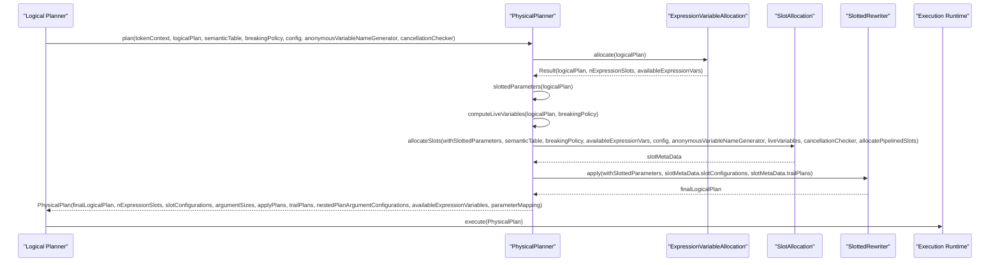

**Diagram sources**
- [PhysicalPlanner.scala](file://community/cypher/physical-planning/src/main/scala/org/neo4j/cypher/internal/physicalplanning/PhysicalPlanner.scala)

**Section sources**
- [PhysicalPlanner.scala](file://community/cypher/physical-planning/src/main/scala/org/neo4j/cypher/internal/physicalplanning/PhysicalPlanner.scala)

## Query Pattern Translation Examples

This section illustrates how different Cypher query patterns are translated into logical operators during the planning process. Each example demonstrates the transformation from a declarative query pattern to its corresponding logical plan representation.

### MATCH Clause Translation

The MATCH clause is translated into a series of Expand operations that traverse the graph according to the specified pattern. The planner considers various strategies, including index seeks, label scans, and relationship scans, to optimize the traversal.

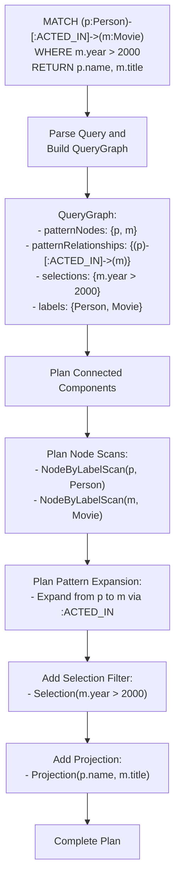

**Section sources**
- [LogicalPlan.scala](file://community/cypher/cypher-logical-plans/src/main/scala/org/neo4j/cypher/internal/logical/plans/LogicalPlan.scala)
- [IDPQueryGraphSolver.scala](file://community/cypher/cypher-planner/src/main/scala/org/neo4j/cypher/internal/compiler/planner/logical/idp/IDPQueryGraphSolver.scala)

### OPTIONAL MATCH Translation

The OPTIONAL MATCH clause is translated into an outer join operation that preserves rows from the left side even when no matching patterns are found on the right side. The planner uses a LeftOuterHashJoin to implement this behavior efficiently.

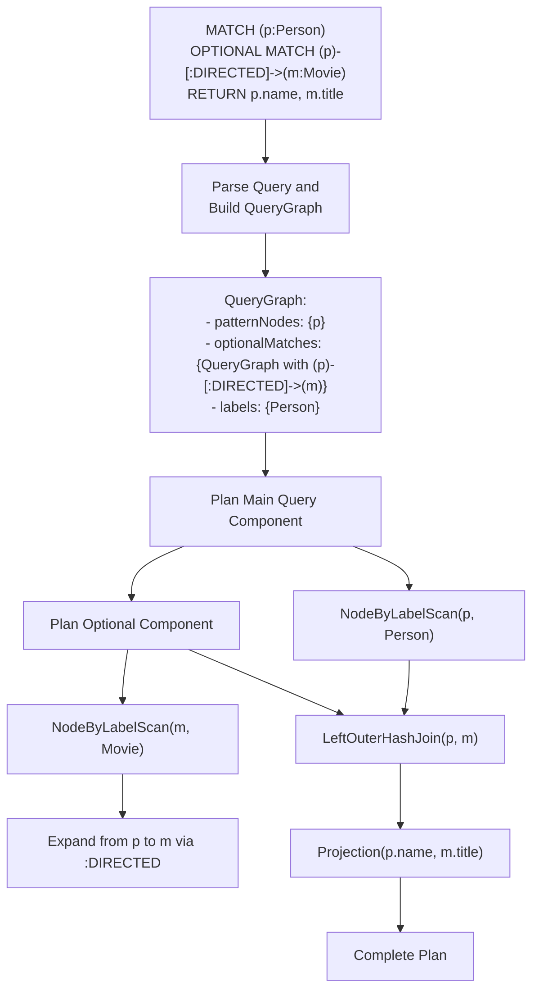

**Section sources**
- [LogicalPlan.scala](file://community/cypher/cypher-logical-plans/src/main/scala/org/neo4j/cypher/internal/logical/plans/LogicalPlan.scala)
- [IDPQueryGraphSolver.scala](file://community/cypher/cypher-planner/src/main/scala/org/neo4j/cypher/internal/compiler/planner/logical/idp/IDPQueryGraphSolver.scala)

### Subquery Translation

Subqueries, particularly those used in EXISTS expressions, are planned using specialized strategies that consider the interaction between the outer query and the subquery. The planner uses an ExistsSubqueryPlanner to optimize these patterns.

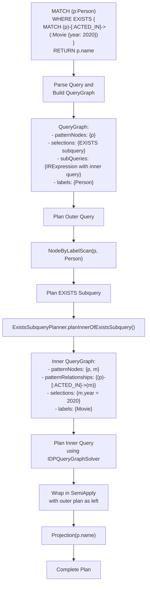

**Section sources**
- [IDPQueryGraphSolver.scala](file://community/cypher/cypher-planner/src/main/scala/org/neo4j/cypher/internal/compiler/planner/logical/idp/IDPQueryGraphSolver.scala)
- [QueryPlanner.scala](file://community/cypher/cypher-planner/src/main/scala/org/neo4j/cypher/internal/compiler/planner/logical/QueryPlanner.scala)

## Common Planning Issues and Performance Considerations

Several common issues can affect query planning performance and result in suboptimal execution strategies. Understanding these issues and their root causes is essential for effective query optimization and performance tuning.

### Suboptimal Plan Selection

Suboptimal plan selection occurs when the planner chooses an execution strategy that is not the most efficient for the given query and data distribution. This can happen due to inaccurate cardinality estimates, missing statistics, or limitations in the cost model.

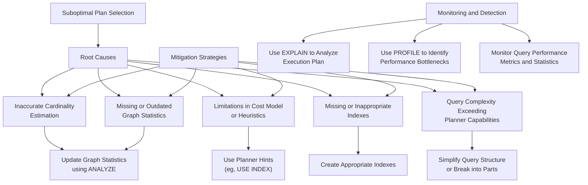

**Section sources**
- [CardinalityCostModel.scala](file://community/cypher/cypher-planner/src/main/scala/org/neo4j/cypher/internal/compiler/planner/logical/CardinalityCostModel.scala)
- [IDPQueryGraphSolver.scala](file://community/cypher/cypher-planner/src/main/scala/org/neo4j/cypher/internal/compiler/planner/logical/idp/IDPQueryGraphSolver.scala)

### Cardinality Estimation Errors

Cardinality estimation errors are a primary cause of suboptimal plan selection. The planner relies on accurate row count estimates to compare different execution strategies, and errors in these estimates can lead to poor plan choices.

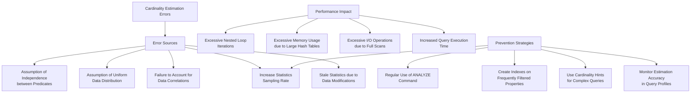

**Section sources**
- [CardinalityCostModel.scala](file://community/cypher/cypher-planner/src/main/scala/org/neo4j/cypher/internal/compiler/planner/logical/CardinalityCostModel.scala)
- [QueryGraph.scala](file://community/cypher/ir/src/main/scala/org/neo4j/cypher/internal/ir/QueryGraph.scala)

## Query Optimization Best Practices

Effective query optimization requires understanding both the capabilities of the query planner and the characteristics of the underlying data. The following best practices can help ensure optimal query performance.

### Writing Planner-Friendly Queries

Writing queries that the planner can optimize effectively involves following certain patterns and avoiding common pitfalls that can hinder optimization.

```mermaid
flowchart TD
BestPractices["Query Optimization Best Practices"] --> Structure["Query Structure"]
Structure --> Specific["Be Specific with Labels\nand Relationship Types"]
Structure --> Early["Filter Early in the Query\nusing WHERE clauses"]
Structure --> Simple["Keep Queries Simple\nand Focused"]
Structure --> Parameters["Use Parameters Instead\nof Literal Values"]
Structure --> Limit["Use LIMIT to Reduce\nResult Set Size"]
Indexes["Index Utilization"] --> Create["Create Indexes on\nFrequently Queried Properties"]
Indexes --> Composite["Use Composite Indexes for\nMultiple Property Queries"]
Indexes --> Constraints["Use Unique Constraints for\nHigh-Cardinality Properties"]
Indexes --> Array["Consider Indexing Array\nProperties when Appropriate"]
Patterns["Pattern Matching"] --> Avoid["Avoid Cartesian Products\nwith Multiple MATCH clauses"]
Patterns --> Direction["Specify Relationship\nDirection when Possible"]
Patterns --> Optional["Use OPTIONAL MATCH Sparingly\nand with Filters"]
Patterns --> Shortest["Use shortestPath with\nAppropriate Constraints"]
Monitoring["Performance Monitoring"] --> Explain["Use EXPLAIN to Understand\nExecution Plans"]
Monitoring --> Profile["Use PROFILE to Identify\nBottlenecks"]
Monitoring --> Stats["Monitor Query Performance\nand Statistics"]
Monitoring --> Analyze["Regularly Run ANALYZE\nto Update Statistics"]
```

**Section sources**
- [LogicalPlan.scala](file://community/cypher/cypher-logical-plans/src/main/scala/org/neo4j/cypher/internal/logical/plans/LogicalPlan.scala)
- [CardinalityCostModel.scala](file://community/cypher/cypher-planner/src/main/scala/org/neo4j/cypher/internal/compiler/planner/logical/CardinalityCostModel.scala)

## Conclusion

The Cypher query planning component represents a sophisticated optimization system that transforms declarative graph queries into efficient execution plans. By leveraging the QueryGraph data structure to represent query patterns and the IDPQueryGraphSolver to find optimal execution strategies through dynamic programming, the planner effectively balances query complexity with performance requirements. The integration of cost-based optimization, cardinality estimation, and physical planning ensures that queries are executed efficiently across diverse data distributions and access patterns. Understanding the planner's behavior, including its handling of various query patterns and potential optimization challenges, is essential for developing high-performance graph applications. By following query optimization best practices and monitoring plan selection, developers can ensure that their queries leverage the full capabilities of the Neo4j query engine.