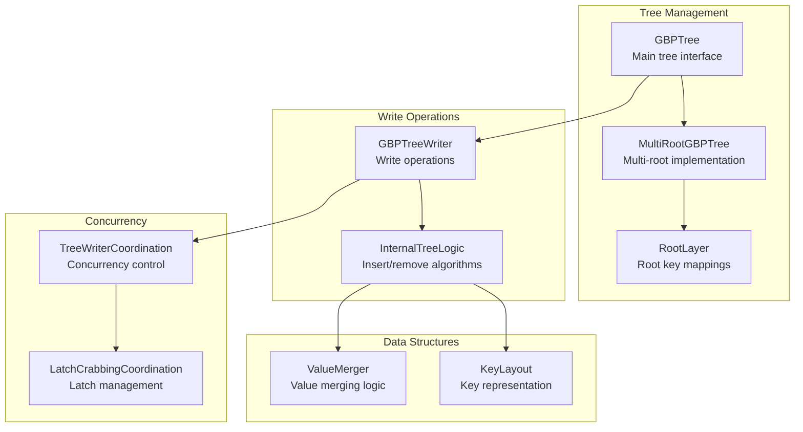
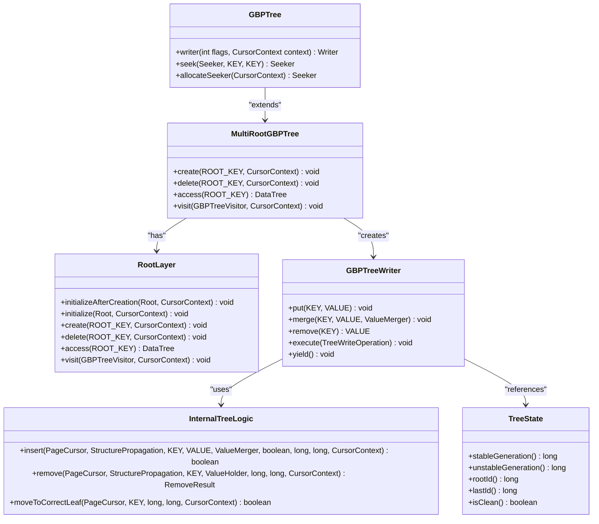
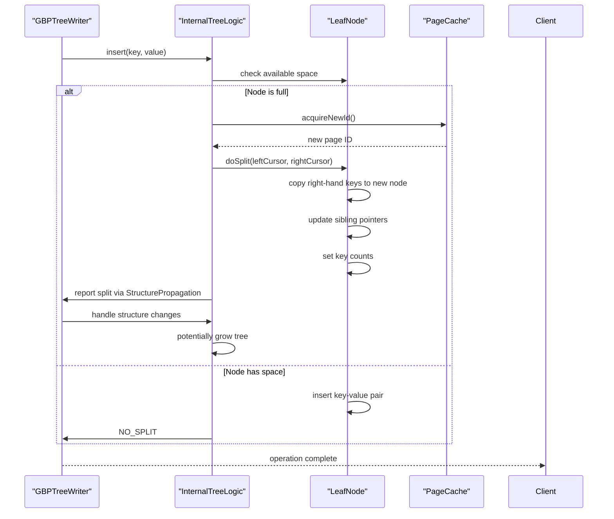
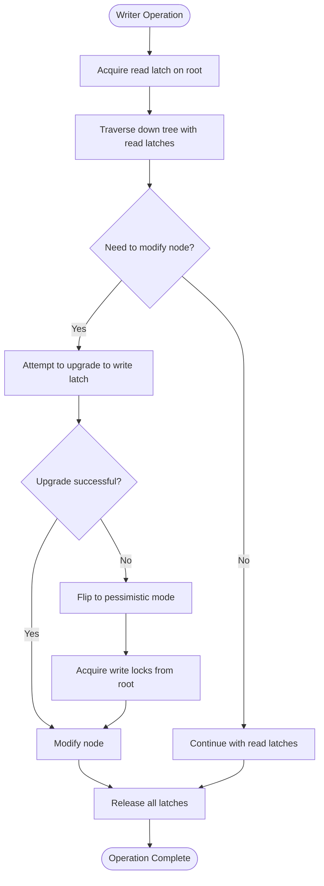
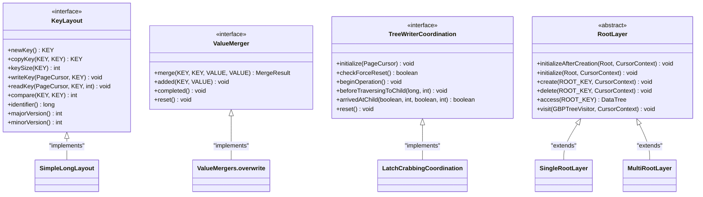

# B+ Tree Indexing

<cite>
**Referenced Files in This Document**   
- [GBPTree.java](file://community/index/src/main/java/org/neo4j/index/internal/gbptree/GBPTree.java)
- [InternalTreeLogic.java](file://community/index/src/main/java/org/neo4j/index/internal/gbptree/InternalTreeLogic.java)
- [GBPTreeWriter.java](file://community/index/src/main/java/org/neo4j/index/internal/gbptree/GBPTreeWriter.java)
- [KeyLayout.java](file://community/index/src/main/java/org/neo4j/index/internal/gbptree/KeyLayout.java)
- [ValueMerger.java](file://community/index/src/main/java/org/neo4j/index/internal/gbptree/ValueMerger.java)
- [TreeWriterCoordination.java](file://community/index/src/main/java/org/neo4j/index/internal/gbptree/TreeWriterCoordination.java)
- [LatchCrabbingCoordination.java](file://community/index/src/main/java/org/neo4j/index/internal/gbptree/LatchCrabbingCoordination.java)
- [MultiRootGBPTree.java](file://community/index/src/main/java/org/neo4j/index/internal/gbptree/MultiRootGBPTree.java)
- [RootLayer.java](file://community/index/src/main/java/org/neo4j/index/internal/gbptree/RootLayer.java)
- [TreeState.java](file://community/index/src/main/java/org/neo4j/index/internal/gbptree/TreeState.java)
</cite>

## Table of Contents
1. [Introduction](#introduction)
2. [Architecture Overview](#architecture-overview)
3. [Core Components](#core-components)
4. [Node Splitting and Merging](#node-splitting-and-merging)
5. [Concurrency Control](#concurrency-control)
6. [Domain Model](#domain-model)
7. [Performance and Optimization](#performance-and-optimization)
8. [Conclusion](#conclusion)

## Introduction

The Generalized B+ Tree (GBPTree) is Neo4j's core indexing structure designed for efficient exact match and range queries. This implementation extends traditional B+ tree concepts with advanced features like generation awareness, latch crabbing coordination, and multi-root architecture. The GBPTree provides a robust foundation for database indexing by ensuring data consistency, supporting concurrent operations, and enabling efficient recovery from crashes.

The GBPTree implementation is built directly atop the PageCache without intermediate caching, providing direct control over page-level operations. It supports both single-root and multi-root configurations, with the multi-root variant enabling parallel writers on different data trees. The tree maintains immutability of stable nodes, copying nodes to unstable generations when modifications are needed, which facilitates crash recovery and ensures data integrity.

This document provides a comprehensive analysis of the GBPTree implementation, covering its architecture, key components, concurrency mechanisms, and optimization strategies. The content is structured to be accessible to beginners while providing sufficient technical depth for experienced developers working with Neo4j's indexing system.

## Architecture Overview

The GBPTree architecture follows a multi-level tree structure with specialized components for tree management, write operations, and consistency maintenance. At its core, the implementation consists of a hierarchical organization of nodes, with internal nodes directing traversal and leaf nodes storing key-value pairs. The architecture incorporates generation awareness, where each node has stable and unstable generation markers, enabling recovery from the last checkpoint.

**Diagram sources**
- [GBPTree.java](file://community/index/src/main/java/org/neo4j/index/internal/gbptree/GBPTree.java)
- [MultiRootGBPTree.java](file://community/index/src/main/java/org/neo4j/index/internal/gbptree/MultiRootGBPTree.java)
- [RootLayer.java](file://community/index/src/main/java/org/neo4j/index/internal/gbptree/RootLayer.java)
- [GBPTreeWriter.java](file://community/index/src/main/java/org/neo4j/index/internal/gbptree/GBPTreeWriter.java)
- [InternalTreeLogic.java](file://community/index/src/main/java/org/neo4j/index/internal/gbptree/InternalTreeLogic.java)
- [KeyLayout.java](file://community/index/src/main/java/org/neo4j/index/internal/gbptree/KeyLayout.java)
- [ValueMerger.java](file://community/index/src/main/java/org/neo4j/index/internal/gbptree/ValueMerger.java)
- [TreeWriterCoordination.java](file://community/index/src/main/java/org/neo4j/index/internal/gbptree/TreeWriterCoordination.java)
- [LatchCrabbingCoordination.java](file://community/index/src/main/java/org/neo4j/index/internal/gbptree/LatchCrabbingCoordination.java)

**Section sources**
- [GBPTree.java](file://community/index/src/main/java/org/neo4j/index/internal/gbptree/GBPTree.java)
- [MultiRootGBPTree.java](file://community/index/src/main/java/org/neo4j/index/internal/gbptree/MultiRootGBPTree.java)
- [RootLayer.java](file://community/index/src/main/java/org/neo4j/index/internal/gbptree/RootLayer.java)

## Core Components

The GBPTree implementation consists of several key components that work together to provide efficient indexing capabilities. The GBPTree class serves as the main interface for single-root trees, extending the MultiRootGBPTree implementation. The MultiRootGBPTree enables multiple data trees under a single index, with the RootLayer managing mappings from root keys to data trees. This architecture allows for parallel writers on different data trees while maintaining isolation.

The GBPTreeWriter component handles all write operations, coordinating with the InternalTreeLogic class that implements the core insert and remove algorithms. The writer manages the traversal path through the tree and handles node splits and merges. The TreeState class maintains critical metadata about the tree, including stable and unstable generation numbers, root ID, and last allocated page ID, which are essential for recovery and consistency checking.

**Diagram sources**
- [GBPTree.java](file://community/index/src/main/java/org/neo4j/index/internal/gbptree/GBPTree.java)
- [MultiRootGBPTree.java](file://community/index/src/main/java/org/neo4j/index/internal/gbptree/MultiRootGBPTree.java)
- [RootLayer.java](file://community/index/src/main/java/org/neo4j/index/internal/gbptree/RootLayer.java)
- [GBPTreeWriter.java](file://community/index/src/main/java/org/neo4j/index/internal/gbptree/GBPTreeWriter.java)
- [InternalTreeLogic.java](file://community/index/src/main/java/org/neo4j/index/internal/gbptree/InternalTreeLogic.java)
- [TreeState.java](file://community/index/src/main/java/org/neo4j/index/internal/gbptree/TreeState.java)

**Section sources**
- [GBPTree.java](file://community/index/src/main/java/org/neo4j/index/internal/gbptree/GBPTree.java)
- [MultiRootGBPTree.java](file://community/index/src/main/java/org/neo4j/index/internal/gbptree/MultiRootGBPTree.java)
- [RootLayer.java](file://community/index/src/main/java/org/neo4j/index/internal/gbptree/RootLayer.java)
- [GBPTreeWriter.java](file://community/index/src/main/java/org/neo4j/index/internal/gbptree/GBPTreeWriter.java)
- [InternalTreeLogic.java](file://community/index/src/main/java/org/neo4j/index/internal/gbptree/InternalTreeLogic.java)
- [TreeState.java](file://community/index/src/main/java/org/neo4j/index/internal/gbptree/TreeState.java)

## Node Splitting and Merging

The GBPTree implementation handles node splitting and merging through sophisticated algorithms in the InternalTreeLogic class. When a leaf node becomes full during an insertion, the tree performs a split operation that redistributes keys between the original node and a newly allocated node. The split ratio, configurable through the ratioToKeepInLeftOnSplit parameter, determines how keys are distributed between the left and right nodes.

The splitting process follows a careful sequence: acquiring a new page ID, copying the appropriate keys and values to the new node, updating sibling pointers, and adjusting key counts. The algorithm ensures that readers traversing the tree concurrently can handle the intermediate states safely, maintaining read consistency without blocking writers. For internal nodes, splitting involves promoting a key to the parent level, potentially causing cascading splits up the tree hierarchy.

**Diagram sources**
- [InternalTreeLogic.java](file://community/index/src/main/java/org/neo4j/index/internal/gbptree/InternalTreeLogic.java)
- [GBPTreeWriter.java](file://community/index/src/main/java/org/neo4j/index/internal/gbptree/GBPTreeWriter.java)

**Section sources**
- [InternalTreeLogic.java](file://community/index/src/main/java/org/neo4j/index/internal/gbptree/InternalTreeLogic.java)
- [GBPTreeWriter.java](file://community/index/src/main/java/org/neo4j/index/internal/gbptree/GBPTreeWriter.java)

## Concurrency Control

The GBPTree implements a sophisticated concurrency control mechanism using latch crabbing coordination, which allows multiple readers and writers to access the tree concurrently without blocking. The TreeWriterCoordination interface, implemented by LatchCrabbingCoordination, manages the acquisition and release of latches on tree nodes during traversal. This approach enables optimistic concurrency, where writers attempt operations without exclusive locks and only escalate to pessimistic mode when conflicts occur.

The latch crabbing algorithm works by acquiring read latches on nodes as the writer traverses down the tree. When a modification is needed, the writer attempts to upgrade the latch to a write latch. If this upgrade fails due to contention, the writer flips to pessimistic mode, acquiring exclusive locks. This hybrid approach maximizes concurrency while ensuring data consistency. The implementation also includes mechanisms to prevent deadlocks, such as the ordering of latch acquisition from root to leaves.

**Diagram sources**
- [TreeWriterCoordination.java](file://community/index/src/main/java/org/neo4j/index/internal/gbptree/TreeWriterCoordination.java)
- [LatchCrabbingCoordination.java](file://community/index/src/main/java/org/neo4j/index/internal/gbptree/LatchCrabbingCoordination.java)

**Section sources**
- [TreeWriterCoordination.java](file://community/index/src/main/java/org/neo4j/index/internal/gbptree/TreeWriterCoordination.java)
- [LatchCrabbingCoordination.java](file://community/index/src/main/java/org/neo4j/index/internal/gbptree/LatchCrabbingCoordination.java)

## Domain Model

The GBPTree domain model is designed for flexibility and customization through several key interfaces. The KeyLayout interface defines how keys are represented as bytes, allowing for custom key types and serialization strategies. It provides methods for key comparison, size determination, and reading/writing operations. The ValueMerger interface controls how values are handled when keys already exist in the tree, enabling different merge strategies like overwrite, keep existing, or custom merging logic.

The TreeWriterCoordination component manages the coordination between concurrent operations, ensuring that structural changes are properly synchronized. The RootLayer interface handles the mapping between root keys and data trees in multi-root configurations, enabling efficient access to specific data subsets. These components work together to provide a customizable indexing framework that can be adapted to various use cases while maintaining the core B+ tree guarantees.

**Diagram sources**
- [KeyLayout.java](file://community/index/src/main/java/org/neo4j/index/internal/gbptree/KeyLayout.java)
- [ValueMerger.java](file://community/index/src/main/java/org/neo4j/index/internal/gbptree/ValueMerger.java)
- [TreeWriterCoordination.java](file://community/index/src/main/java/org/neo4j/index/internal/gbptree/TreeWriterCoordination.java)
- [RootLayer.java](file://community/index/src/main/java/org/neo4j/index/internal/gbptree/RootLayer.java)

**Section sources**
- [KeyLayout.java](file://community/index/src/main/java/org/neo4j/index/internal/gbptree/KeyLayout.java)
- [ValueMerger.java](file://community/index/src/main/java/org/neo4j/index/internal/gbptree/ValueMerger.java)
- [TreeWriterCoordination.java](file://community/index/src/main/java/org/neo4j/index/internal/gbptree/TreeWriterCoordination.java)
- [RootLayer.java](file://community/index/src/main/java/org/neo4j/index/internal/gbptree/RootLayer.java)

## Performance and Optimization

The GBPTree implementation incorporates several performance optimizations to minimize write amplification and improve cache efficiency. Dynamic node sizing allows the tree to adapt to the specific characteristics of the data, reducing wasted space in nodes. The implementation uses off-heap storage through the PageCache abstraction, minimizing garbage collection overhead and improving memory efficiency.

Background cleanup jobs handle the release of pages from the free list, preventing unbounded growth of the free list and ensuring efficient space reuse. The structure write log, when enabled, records structural changes to the tree, enabling detailed analysis of tree evolution and aiding in debugging and optimization. The implementation also includes mechanisms for consistency checking, which can detect and report potential corruption issues.

To address tree imbalance, the implementation uses a combination of node splitting and merging strategies that maintain the B+ tree invariants. The split ratio can be tuned to balance between space utilization and the frequency of splits. For range queries, the tree's linked leaf nodes (sibling pointers) enable efficient sequential traversal without requiring repeated root-to-leaf traversals.

**Section sources**
- [GBPTree.java](file://community/index/src/main/java/org/neo4j/index/internal/gbptree/GBPTree.java)
- [InternalTreeLogic.java](file://community/index/src/main/java/org/neo4j/index/internal/gbptree/InternalTreeLogic.java)
- [StructureWriteLog.java](file://community/index/src/main/java/org/neo4j/index/internal/gbptree/StructureWriteLog.java)

## Conclusion

The Generalized B+ Tree (GBPTree) implementation in Neo4j provides a robust and efficient indexing solution for both exact match and range queries. Its multi-level architecture, combined with generation awareness and latch crabbing coordination, enables high concurrency while maintaining data consistency. The implementation's modular design, with clear separation between tree management, write operations, and domain-specific components, allows for customization and extension.

Key strengths of the implementation include its support for multi-root trees, which enables parallel writers on different data subsets, and its sophisticated concurrency control mechanisms that maximize throughput. The use of off-heap storage and direct page cache operations minimizes memory overhead and garbage collection pressure. The extensible domain model, with customizable key layouts and value merging strategies, makes the GBPTree adaptable to various use cases.

For developers working with Neo4j, understanding the GBPTree internals provides valuable insights into query performance, indexing strategies, and optimization opportunities. The implementation demonstrates how advanced data structures can be engineered to meet the demanding requirements of modern database systems, balancing performance, consistency, and reliability.