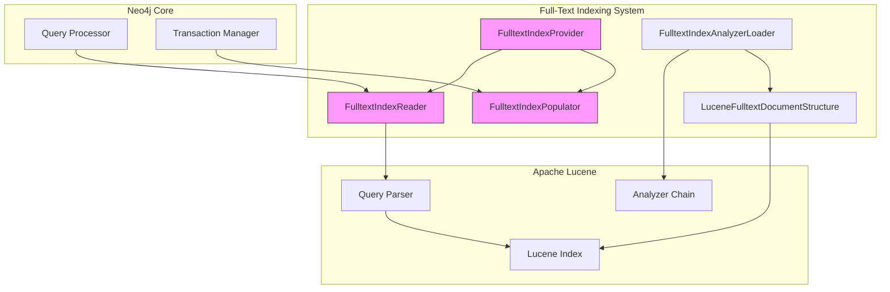
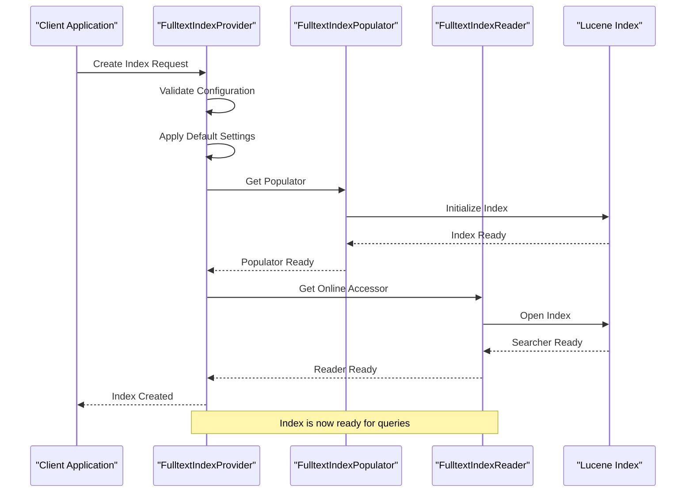
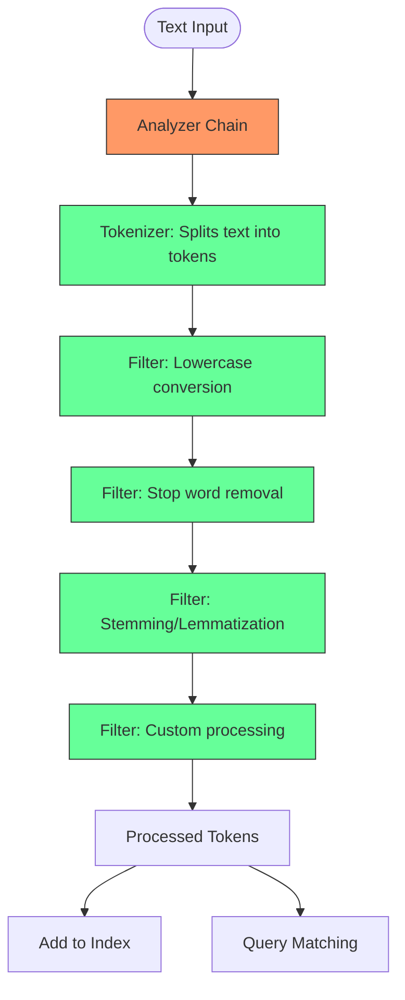
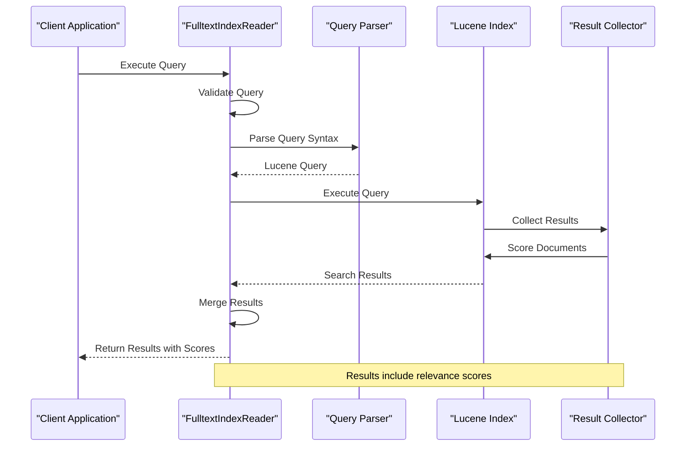
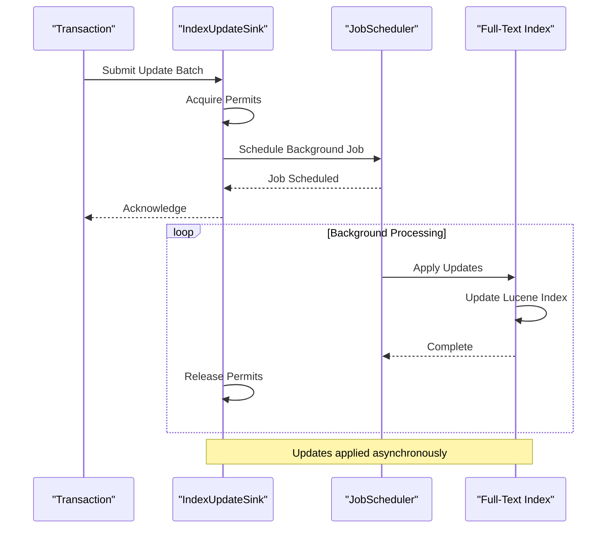
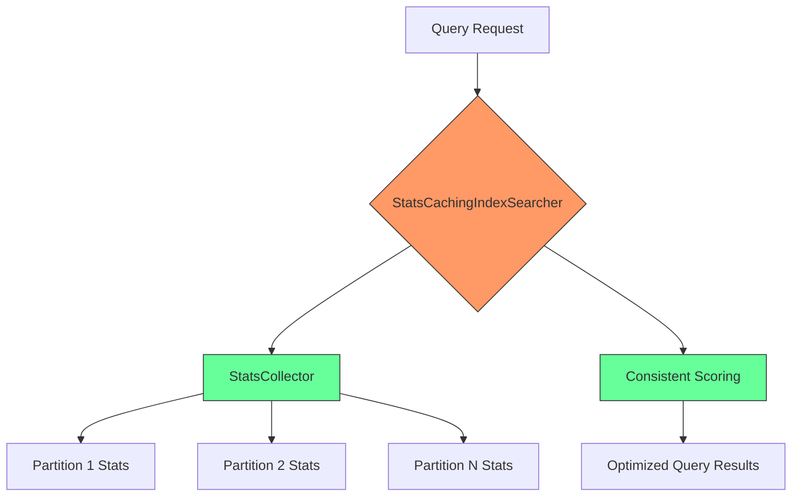
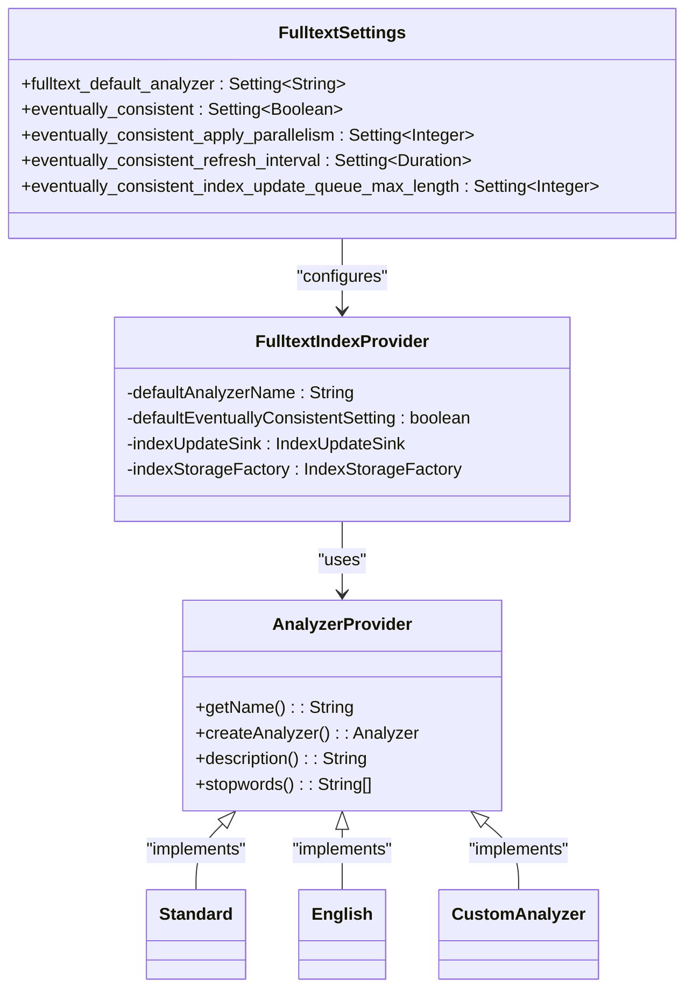

# Full-Text Indexing

<cite>
**Referenced Files in This Document**   
- [FulltextIndexProvider.java](file://community\fulltext-index\src\main\java\org\neo4j\kernel\api\impl\fulltext\FulltextIndexProvider.java)
- [FulltextIndexPopulator.java](file://community\fulltext-index\src\main\java\org\neo4j\kernel\api\impl\fulltext\FulltextIndexPopulator.java)
- [FulltextIndexReader.java](file://community\fulltext-index\src\main\java\org\neo4j\kernel\api\impl\fulltext\FulltextIndexReader.java)
- [IndexUpdateSink.java](file://community\fulltext-index\src\main\java\org\neo4j\kernel\api\impl\fulltext\IndexUpdateSink.java)
- [StatsCachingIndexSearcher.java](file://community\fulltext-index\src\main\java\org\neo4j\kernel\api\impl\fulltext\StatsCachingIndexSearcher.java)
- [FulltextSettings.java](file://community\fulltext-index\src\main\java\org\neo4j\configuration\FulltextSettings.java)
- [AnalyzerProvider.java](file://community\fulltext-index\src\main\java\org\neo4j\graphdb\schema\AnalyzerProvider.java)
- [FulltextIndexAnalyzerLoader.java](file://community\fulltext-index\src\main\java\org\neo4j\kernel\api\impl\fulltext\FulltextIndexAnalyzerLoader.java)
- [LuceneFulltextDocumentStructure.java](file://community\fulltext-index\src\main\java\org\neo4j\kernel\api\impl\fulltext\LuceneFulltextDocumentStructure.java)
- [FulltextIndexTransactionState.java](file://community\fulltext-index\src\main\java\org\neo4j\kernel\api\impl\fulltext\FulltextIndexTransactionState.java)
- [FulltextIndexBuilder.java](file://community\fulltext-index\src\main\java\org\neo4j\kernel\api\impl\fulltext\FulltextIndexBuilder.java)
</cite>

## Table of Contents
1. [Introduction](#introduction)
2. [Architecture Overview](#architecture-overview)
3. [Core Components](#core-components)
4. [Full-Text Index Lifecycle Management](#full-text-index-lifecycle-management)
5. [Text Processing and Analysis](#text-processing-and-analysis)
6. [Query Execution and Relevance Scoring](#query-execution-and-relevance-scoring)
7. [Eventually Consistent Indexing](#eventually-consistent-indexing)
8. [Performance Optimization](#performance-optimization)
9. [Configuration and Customization](#configuration-and-customization)
10. [Common Issues and Solutions](#common-issues-and-solutions)

## Introduction

Neo4j's full-text indexing system provides powerful text search capabilities by integrating with Apache Lucene, enabling efficient and sophisticated text-based queries across graph data. This system allows users to perform complex text searches on node and relationship properties, supporting features like relevance scoring, fuzzy matching, and advanced query syntax. The implementation is designed to handle large volumes of text data while maintaining high performance and scalability.

The full-text indexing system in Neo4j is built around several key components that work together to provide a comprehensive text search solution. At its core, the system uses Apache Lucene as the underlying search engine, leveraging its mature text analysis and indexing capabilities. The integration is designed to be seamless, allowing users to create full-text indexes on graph properties and query them using familiar Cypher syntax.

This documentation provides a comprehensive overview of the full-text indexing system, covering its architecture, implementation details, and usage patterns. It explains how the system manages index lifecycle, processes text data, executes queries, and handles performance optimization. The content is structured to be accessible to beginners while providing sufficient technical depth for experienced developers who want to understand the inner workings of the system.

## Architecture Overview

The full-text indexing system in Neo4j follows a modular architecture that separates concerns and enables extensibility. The system is built around several key components that work together to provide text search capabilities. At the highest level, the architecture consists of an index provider that manages the lifecycle of full-text indexes, a populator that builds indexes from existing data, and a reader that executes text queries.



**Diagram sources**
- [FulltextIndexProvider.java](file://community\fulltext-index\src\main\java\org\neo4j\kernel\api\impl\fulltext\FulltextIndexProvider.java)
- [FulltextIndexPopulator.java](file://community\fulltext-index\src\main\java\org\neo4j\kernel\api\impl\fulltext\FulltextIndexPopulator.java)
- [FulltextIndexReader.java](file://community\fulltext-index\src\main\java\org\neo4j\kernel\api\impl\fulltext\FulltextIndexReader.java)

The architecture follows a layered approach where higher-level components interact with lower-level ones through well-defined interfaces. The FulltextIndexProvider acts as the entry point for the full-text indexing system, managing the creation and lifecycle of indexes. It delegates specific tasks to specialized components like the FulltextIndexPopulator for building indexes and the FulltextIndexReader for executing queries.

The system integrates with Apache Lucene through a series of adapters and wrappers that translate Neo4j-specific concepts into Lucene-compatible structures. The LuceneFulltextDocumentStructure class is responsible for mapping Neo4j properties to Lucene documents, while the FulltextIndexAnalyzerLoader manages the integration of Lucene analyzers. This separation of concerns allows the system to leverage Lucene's powerful text processing capabilities while maintaining a clean abstraction layer that isolates Neo4j-specific logic.

## Core Components

The full-text indexing system in Neo4j consists of several core components that work together to provide text search capabilities. These components are designed to handle different aspects of the indexing and querying process, from index creation to query execution. Understanding these components is essential for effectively using and extending the full-text indexing system.

The primary components include the FulltextIndexProvider, which manages the lifecycle of full-text indexes; the FulltextIndexPopulator, which builds indexes from existing data; and the FulltextIndexReader, which executes text queries. Additionally, the system includes specialized components for text analysis, query parsing, and performance optimization. These components are designed to work together seamlessly, providing a comprehensive solution for text-based searches in Neo4j.

Each component has a specific responsibility and interacts with others through well-defined interfaces. This modular design enables extensibility and makes it easier to understand and maintain the system. The components are also designed to be reusable, allowing them to be combined in different ways to support various use cases and requirements.

**Section sources**
- [FulltextIndexProvider.java](file://community\fulltext-index\src\main\java\org\neo4j\kernel\api\impl\fulltext\FulltextIndexProvider.java)
- [FulltextIndexPopulator.java](file://community\fulltext-index\src\main\java\org\neo4j\kernel\api\impl\fulltext\FulltextIndexPopulator.java)
- [FulltextIndexReader.java](file://community\fulltext-index\src\main\java\org\neo4j\kernel\api\impl\fulltext\FulltextIndexReader.java)

## Full-Text Index Lifecycle Management

The full-text index lifecycle in Neo4j is managed by the FulltextIndexProvider class, which serves as the central component for creating, configuring, and maintaining full-text indexes. This provider implements the IndexProvider interface and is responsible for coordinating the various stages of index lifecycle, from creation to deletion. The lifecycle management process ensures that indexes are properly initialized, populated, and made available for querying.

When a full-text index is created, the FulltextIndexProvider validates the index configuration and ensures that all required settings are present. It uses default values for any missing configuration options, such as the analyzer and consistency model. The provider also validates that the specified analyzer is available and properly configured, preventing issues that could arise from invalid analyzer settings.



**Diagram sources**
- [FulltextIndexProvider.java](file://community\fulltext-index\src\main\java\org\neo4j\kernel\api\impl\fulltext\FulltextIndexProvider.java)
- [FulltextIndexPopulator.java](file://community\fulltext-index\src\main\java\org\neo4j\kernel\api\impl\fulltext\FulltextIndexPopulator.java)
- [FulltextIndexReader.java](file://community\fulltext-index\src\main\java\org\neo4j\kernel\api\impl\fulltext\FulltextIndexReader.java)

The index population process is handled by the FulltextIndexPopulator, which is responsible for building the index from existing data in the graph. This component processes index updates and adds them to the Lucene index, ensuring that all relevant properties are properly indexed. The populator uses a streaming approach to handle large volumes of data efficiently, minimizing memory usage and maximizing performance.

Once the index is populated, the FulltextIndexReader provides access to the index for querying. This component is responsible for executing text searches and returning results with relevance scores. It integrates with Lucene's query parser to support complex query syntax and provides additional functionality for handling Neo4j-specific requirements, such as transaction state and property mapping.

The lifecycle management system also includes error handling and recovery mechanisms. If an index creation or population process fails, the system stores the failure information and marks the index as failed. This allows administrators to diagnose and resolve issues before attempting to recreate the index. The system also supports index migration and versioning, ensuring compatibility across different Neo4j versions.

**Section sources**
- [FulltextIndexProvider.java](file://community\fulltext-index\src\main\java\org\neo4j\kernel\api\impl\fulltext\FulltextIndexProvider.java)
- [FulltextIndexPopulator.java](file://community\fulltext-index\src\main\java\org\neo4j\kernel\api\impl\fulltext\FulltextIndexPopulator.java)
- [FulltextIndexReader.java](file://community\fulltext-index\src\main\java\org\neo4j\kernel\api\impl\fulltext\FulltextIndexReader.java)

## Text Processing and Analysis

Text processing and analysis are critical components of the full-text indexing system in Neo4j, enabling sophisticated text searches and queries. The system leverages Apache Lucene's powerful text analysis capabilities through a flexible analyzer framework that supports various text processing techniques. This framework allows users to customize how text is processed before indexing and querying, enabling language-specific processing and specialized text analysis.

The text analysis process begins with the FulltextIndexAnalyzerLoader, which is responsible for creating and managing analyzer instances. This component loads analyzer providers from the classpath and caches them for efficient reuse. When an index is created or queried, the analyzer loader retrieves the appropriate analyzer based on the index configuration or query parameters. This ensures that text is processed consistently across indexing and querying operations.



**Diagram sources**
- [FulltextIndexAnalyzerLoader.java](file://community\fulltext-index\src\main\java\org\neo4j\kernel\api\impl\fulltext\FulltextIndexAnalyzerLoader.java)
- [AnalyzerProvider.java](file://community\fulltext-index\src\main\java\org\neo4j\graphdb\schema\AnalyzerProvider.java)

The analyzer framework supports a wide range of built-in analyzers for different languages and use cases. These include language-specific analyzers like English, French, and German, as well as specialized analyzers for handling URLs, emails, and other structured text. Each analyzer is implemented as a service provider that can be dynamically loaded and configured. This modular design allows new analyzers to be added without modifying the core system.

The text processing pipeline typically consists of a tokenizer followed by a series of filters. The tokenizer splits the input text into individual tokens, usually based on whitespace and punctuation. The filters then process these tokens, performing operations like lowercase conversion, stop word removal, stemming, and lemmatization. This pipeline can be customized by chaining different filters together, allowing for sophisticated text analysis tailored to specific requirements.

For example, the Standard analyzer tokenizes text on non-letter characters and filters out English stop words and punctuation. It preserves product names, URLs, and email addresses as single terms, making it suitable for general-purpose text indexing. Other analyzers may include language-specific stemming algorithms or specialized processing for technical terms and domain-specific vocabulary.

The system also supports custom analyzer configuration through index settings. Users can specify which analyzer to use when creating a full-text index, allowing them to choose the most appropriate text processing strategy for their data. This configuration is stored with the index metadata and used consistently during both indexing and querying operations.

**Section sources**
- [FulltextIndexAnalyzerLoader.java](file://community\fulltext-index\src\main\java\org\neo4j\kernel\api\impl\fulltext\FulltextIndexAnalyzerLoader.java)
- [AnalyzerProvider.java](file://community\fulltext-index\src\main\java\org\neo4j\graphdb\schema\AnalyzerProvider.java)
- [Standard.java](file://community\fulltext-index\src\main\java\org\neo4j\kernel\api\impl\fulltext\analyzer\providers\Standard.java)

## Query Execution and Relevance Scoring

Query execution in Neo4j's full-text indexing system is handled by the FulltextIndexReader component, which translates Cypher queries into Lucene queries and executes them against the underlying index. This process involves several steps, including query parsing, index searching, and result processing, all designed to provide efficient and accurate text search results with relevance scoring.

When a full-text query is received, the FulltextIndexReader first validates the query to ensure it is compatible with the index type and configuration. It then converts the query into a Lucene query using the MultiFieldQueryParser, which supports complex query syntax including boolean operators, wildcards, and phrase searches. The parser is configured to search across all indexed properties, allowing users to find relevant results regardless of which specific property contains the search terms.



**Diagram sources**
- [FulltextIndexReader.java](file://community\fulltext-index\src\main\java\org\neo4j\kernel\api\impl\fulltext\FulltextIndexReader.java)
- [LuceneFulltextDocumentStructure.java](file://community\fulltext-index\src\main\java\org\neo4j\kernel\api\impl\fulltext\LuceneFulltextDocumentStructure.java)

The query execution process takes into account both the persisted index data and any changes in the current transaction state. This ensures that queries return up-to-date results that reflect recent modifications to the graph. The system uses a two-phase approach: first querying the persisted index and filtering out results that have been modified in the current transaction, then querying an in-memory index that contains the transaction state changes.

Relevance scoring is a key feature of the full-text search system, providing a measure of how well each result matches the query. The scoring is based on Lucene's TF-IDF (Term Frequency-Inverse Document Frequency) algorithm, which considers factors like term frequency, document length, and inverse document frequency. This produces scores that can be used to rank results by relevance, with higher scores indicating better matches.

To ensure consistent scoring across multiple index partitions and transaction state, the system uses the StatsCachingIndexSearcher component. This searcher delegates to a StatsCollector that aggregates statistics across all partitions, ensuring that scores are comparable regardless of which partition a document comes from. This is particularly important for distributed full-text search, where results may come from multiple sources.

The query execution system also supports various query types and constraints. In addition to full-text search predicates, it can handle composite queries and apply additional constraints to filter results. The system validates queries to ensure they are supported by the index type and configuration, providing clear error messages when incompatible queries are attempted.

**Section sources**
- [FulltextIndexReader.java](file://community\fulltext-index\src\main\java\org\neo4j\kernel\api\impl\fulltext\FulltextIndexReader.java)
- [StatsCachingIndexSearcher.java](file://community\fulltext-index\src\main\java\org\neo4j\kernel\api\impl\fulltext\StatsCachingIndexSearcher.java)
- [LuceneFulltextDocumentStructure.java](file://community\fulltext-index\src\main\java\org\neo4j\kernel\api\impl\fulltext\LuceneFulltextDocumentStructure.java)

## Eventually Consistent Indexing

Eventually consistent indexing is a key feature of Neo4j's full-text indexing system, designed to improve performance and scalability for high-throughput workloads. This approach decouples index updates from transaction processing, allowing transactions to complete quickly while index updates are applied asynchronously in the background. The system uses the IndexUpdateSink component to manage this process, providing a queue-based mechanism for handling index updates.

The eventually consistent model is particularly useful for applications with high write volumes, where immediate index consistency could become a bottleneck. By deferring index updates, the system can maintain high transaction throughput while still providing timely access to search results. The consistency delay is configurable, allowing users to balance between performance and freshness requirements.



**Diagram sources**
- [IndexUpdateSink.java](file://community\fulltext-index\src\main\java\org\neo4j\kernel\api\impl\fulltext\IndexUpdateSink.java)
- [EventuallyConsistentIndexUpdater.java](file://community\fulltext-index\src\main\java\org\neo4j\kernel\api\impl\fulltext\EventuallyConsistentIndexUpdater.java)

The IndexUpdateSink component implements a bounded queue for index updates, with configurable size limits to prevent unbounded memory usage. When a transaction modifies data that affects a full-text index, the updates are collected and submitted to the sink as a batch. The sink then schedules a background job to apply these updates to the index, using Neo4j's JobScheduler for execution.

This approach provides several benefits. First, it reduces the latency of transaction commits, as the transaction doesn't need to wait for index updates to complete. Second, it allows for batched processing of index updates, which can be more efficient than processing updates individually. Third, it enables better resource utilization by spreading index update work over time rather than concentrating it during transaction processing.

The system includes mechanisms to handle backpressure when the update queue approaches its capacity. When the queue is nearly full, transaction processing is slowed down to allow the background workers to catch up. This prevents the system from becoming overwhelmed and ensures stable performance under heavy load.

For applications that require stronger consistency guarantees, the system provides the awaitRefresh method on the FulltextIndexProvider. This method blocks until all pending index updates have been applied, ensuring that subsequent queries see the most up-to-date results. This allows applications to choose between performance and consistency based on their specific requirements.

The eventually consistent model also supports monitoring and diagnostics through various configuration settings. Users can configure the number of parallel update threads, the refresh interval, and other parameters to tune the behavior of the system. These settings allow administrators to optimize the trade-off between performance and consistency based on their workload characteristics.

**Section sources**
- [IndexUpdateSink.java](file://community\fulltext-index\src\main\java\org\neo4j\kernel\api\impl\fulltext\IndexUpdateSink.java)
- [FulltextIndexProvider.java](file://community\fulltext-index\src\main\java\org\neo4j\kernel\api\impl\fulltext\FulltextIndexProvider.java)
- [EventuallyConsistentIndexUpdater.java](file://community\fulltext-index\src\main\java\org\neo4j\kernel\api\impl\fulltext\EventuallyConsistentIndexUpdater.java)

## Performance Optimization

Performance optimization in Neo4j's full-text indexing system is achieved through several mechanisms that improve query efficiency, reduce resource usage, and enhance scalability. The system employs various techniques to ensure fast query response times, efficient memory utilization, and optimal indexing performance, even with large datasets and high query volumes.

One of the key optimization strategies is the use of the StatsCachingIndexSearcher component, which improves query performance by aggregating statistics across multiple index partitions. This component delegates to a StatsCollector that maintains aggregate statistics, allowing for consistent relevance scoring across partitions. By caching these statistics, the system avoids the overhead of recalculating them for each query, resulting in faster query execution.



**Diagram sources**
- [StatsCachingIndexSearcher.java](file://community\fulltext-index\src\main\java\org\neo4j\kernel\api\impl\fulltext\StatsCachingIndexSearcher.java)
- [StatsCollector.java](file://community\fulltext-index\src\main\java\org\neo4j\kernel\api\impl\fulltext\StatsCollector.java)

Another important optimization is the use of analyzer caching through the FulltextIndexAnalyzerLoader. This component maintains a cache of analyzer instances, preventing the overhead of creating new analyzers for each indexing or query operation. Since analyzer creation can be expensive, especially for complex language-specific analyzers, this caching significantly improves performance.

The system also optimizes memory usage during indexing operations. The FulltextIndexPopulator uses a streaming approach to process index updates, minimizing memory footprint by processing updates in batches rather than loading all data into memory at once. This allows the system to handle large volumes of data efficiently, even on systems with limited memory resources.

For query execution, the system employs result merging strategies to optimize performance. When queries span multiple index partitions or include transaction state, the results from different sources are merged efficiently using the ScoredEntityIterator. This iterator combines results from multiple sources while maintaining proper ordering by relevance score, ensuring optimal performance even for complex queries.

The eventually consistent indexing model also contributes to performance optimization by decoupling index updates from transaction processing. This reduces transaction latency and allows for batched processing of index updates, which can be more efficient than processing updates individually. The system's configurable queue size and parallelism settings allow administrators to tune performance based on their specific workload characteristics.

Additional performance optimizations include:
- Efficient document structure design in LuceneFulltextDocumentStructure, which minimizes storage overhead
- Use of thread-local storage for document reuse, reducing object allocation and garbage collection
- Optimized query parsing and rewriting to improve search efficiency
- Background indexing and refresh operations to minimize impact on query performance

These optimizations work together to provide a high-performance full-text search system that can handle demanding workloads while maintaining responsiveness and scalability.

**Section sources**
- [StatsCachingIndexSearcher.java](file://community\fulltext-index\src\main\java\org\neo4j\kernel\api\impl\fulltext\StatsCachingIndexSearcher.java)
- [FulltextIndexAnalyzerLoader.java](file://community\fulltext-index\src\main\java\org\neo4j\kernel\api\impl\fulltext\FulltextIndexAnalyzerLoader.java)
- [FulltextIndexPopulator.java](file://community\fulltext-index\src\main\java\org\neo4j\kernel\api\impl\fulltext\FulltextIndexPopulator.java)
- [LuceneFulltextDocumentStructure.java](file://community\fulltext-index\src\main\java\org\neo4j\kernel\api\impl\fulltext\LuceneFulltextDocumentStructure.java)

## Configuration and Customization

The full-text indexing system in Neo4j provides extensive configuration options that allow users to customize the behavior of indexes to meet their specific requirements. These configuration options are exposed through the FulltextSettings class, which defines various settings for controlling analyzer selection, consistency model, and performance characteristics.

The primary configuration options include:
- **db.index.fulltext.default_analyzer**: Specifies the default analyzer to use for full-text indexes when no analyzer is explicitly specified
- **db.index.fulltext.eventually_consistent**: Determines whether full-text indexes should be eventually consistent by default
- **db.index.fulltext.eventually_consistent_apply_parallelism**: Controls the number of threads processing queued index updates
- **db.index.fulltext.eventually_consistent_refresh_interval**: Sets how often eventually consistent indexes are refreshed
- **db.index.fulltext.eventually_consistent_index_update_queue_max_length**: Defines the maximum number of pending index updates



**Diagram sources**
- [FulltextSettings.java](file://community\fulltext-index\src\main\java\org\neo4j\configuration\FulltextSettings.java)
- [AnalyzerProvider.java](file://community\fulltext-index\src\main\java\org\neo4j\graphdb\schema\AnalyzerProvider.java)
- [FulltextIndexProvider.java](file://community\fulltext-index\src\main\java\org\neo4j\kernel\api\impl\fulltext\FulltextIndexProvider.java)

Users can customize full-text indexes at creation time by specifying configuration options through Cypher commands. For example, when creating a full-text index, users can specify which analyzer to use and whether the index should be eventually consistent:

```cypher
CALL db.index.fulltext.createNodeIndex(
  'myIndex',
  ['Label'],
  ['property1', 'property2'],
  {analyzer: 'english', eventually_consistent: true}
)
```

The system also supports custom analyzer development through the AnalyzerProvider interface. Developers can create their own analyzer providers by implementing this interface and annotating their class with @ServiceProvider. This allows for the integration of specialized text processing algorithms, domain-specific analyzers, or custom language support.

Analyzer providers must have a public no-argument constructor and call the superclass constructor with a unique name. They implement the createAnalyzer() method to return a configured Lucene Analyzer instance. The system automatically discovers and loads analyzer providers through Java's service provider interface mechanism.

The configuration system includes validation and migration capabilities. The FulltextSettingsMigrator class handles the migration of deprecated configuration settings to their current equivalents, ensuring backward compatibility. The system also validates analyzer names during index creation, preventing the use of non-existent or misconfigured analyzers.

For advanced customization, users can extend the system by:
- Creating custom analyzer providers for specialized text processing needs
- Implementing custom scoring algorithms through Lucene's similarity framework
- Developing custom query parsers for domain-specific search syntax
- Extending the document structure to support additional field types or metadata

These customization options make the full-text indexing system highly adaptable to different use cases and requirements, from simple text search to complex domain-specific information retrieval applications.

**Section sources**
- [FulltextSettings.java](file://community\fulltext-index\src\main\java\org\neo4j\configuration\FulltextSettings.java)
- [AnalyzerProvider.java](file://community\fulltext-index\src\main\java\org\neo4j\graphdb\schema\AnalyzerProvider.java)
- [FulltextSettingsMigrator.java](file://community\fulltext-index\src\main\java\org\neo4j\configuration\FulltextSettingsMigrator.java)

## Common Issues and Solutions

The full-text indexing system in Neo4j may encounter various issues in production environments, ranging from configuration problems to performance bottlenecks. Understanding these common issues and their solutions is essential for maintaining a reliable and efficient full-text search capability.

One common issue is index staleness, particularly with eventually consistent indexes. When using the eventually consistent model, there may be a delay between when data is modified and when those changes are reflected in search results. This can be addressed by:
- Using the awaitRefresh() method on FulltextIndexProvider to ensure all pending updates are applied
- Configuring appropriate refresh intervals based on application requirements
- Monitoring the update queue length and adjusting parallelism settings as needed

Analyzer configuration complexity is another frequent challenge. Users may encounter issues when:
- Specifying non-existent analyzer names
- Using analyzers that are not properly configured for their data
- Mixing analyzers with incompatible text processing rules

Solutions include:
- Validating analyzer names during index creation
- Providing clear documentation on available analyzers and their characteristics
- Using the listAvailableAnalyzers() method to discover available options

Memory usage during indexing can become problematic with large datasets. The system addresses this through:
- Streaming processing in the FulltextIndexPopulator to minimize memory footprint
- Configurable queue sizes for eventually consistent updates
- Background indexing to avoid impacting transaction performance

Other common issues and their solutions:

| Issue | Symptoms | Solutions |
|------|---------|----------|
| Index creation failure | Index marked as failed, error messages about analyzer configuration | Verify analyzer name, check for missing dependencies, validate index configuration |
| Poor query performance | Slow query response times, high CPU usage | Optimize analyzer configuration, review index structure, consider partitioning strategy |
| High memory usage | Increased heap consumption, garbage collection pressure | Adjust eventually consistent queue size, optimize analyzer caching, monitor background indexing |
| Inconsistent search results | Results vary between queries, missing expected matches | Ensure consistent analyzer usage, validate text processing pipeline, check for indexing errors |
| Transaction conflicts | Index update failures, conflict exceptions | Review eventually consistent configuration, adjust queue size, monitor update throughput |

The system provides several diagnostic and troubleshooting tools:
- The getPopulationFailure() method on FulltextIndexProvider to retrieve details about index creation failures
- Logging capabilities in the FulltextIndexProvider for monitoring index operations
- Configuration validation during index creation to prevent common errors
- The awaitRefresh() method for ensuring index consistency when needed

For complex issues, administrators can:
- Review system logs for error messages and warnings
- Monitor index statistics and performance metrics
- Test analyzer behavior with sample data before applying to production
- Use smaller test datasets to validate configuration changes

By understanding these common issues and their solutions, users can effectively maintain and optimize their full-text indexing system, ensuring reliable and high-performance text search capabilities.

**Section sources**
- [FulltextIndexProvider.java](file://community\fulltext-index\src\main\java\org\neo4j\kernel\api\impl\fulltext\FulltextIndexProvider.java)
- [IndexUpdateSink.java](file://community\fulltext-index\src\main\java\org\neo4j\kernel\api\impl\fulltext\IndexUpdateSink.java)
- [FulltextIndexPopulator.java](file://community\fulltext-index\src\main\java\org\neo4j\kernel\api\impl\fulltext\FulltextIndexPopulator.java)