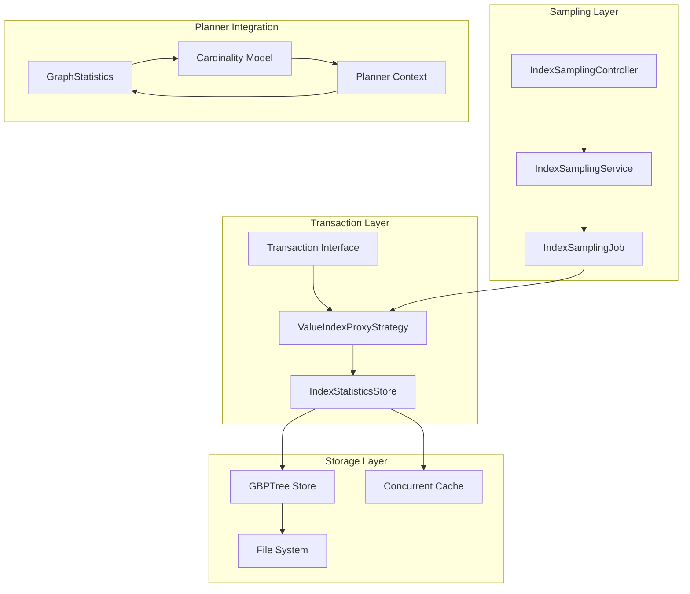
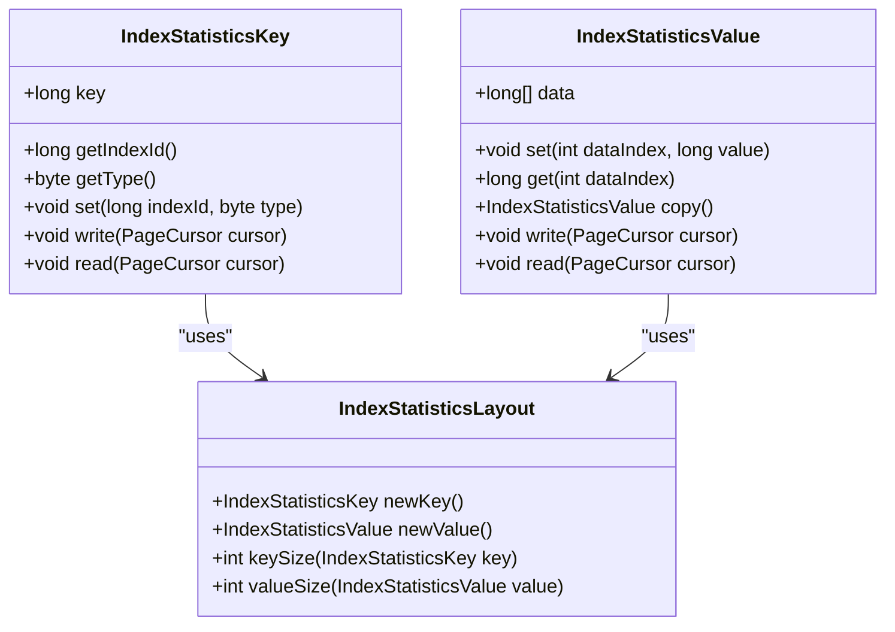
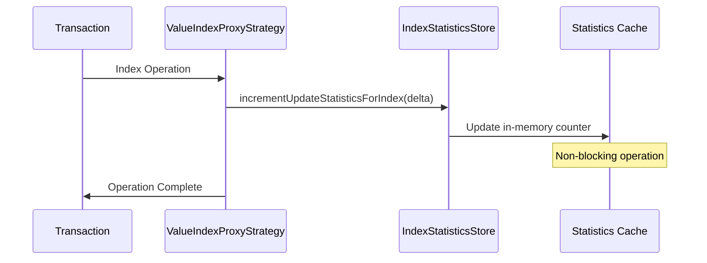
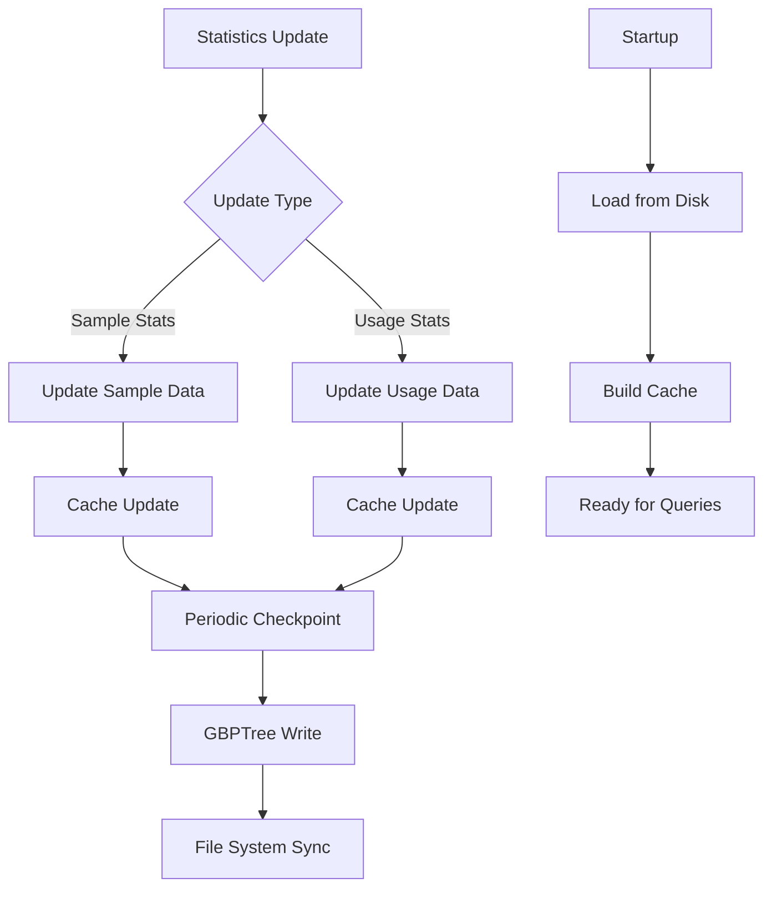
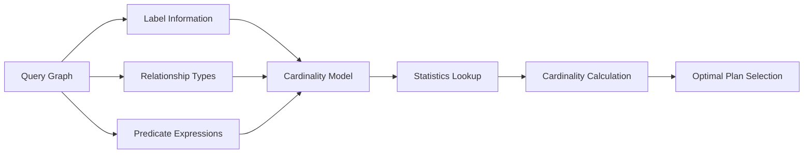
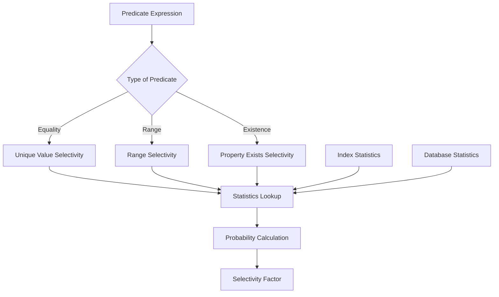
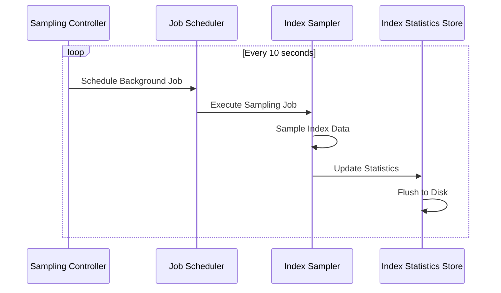
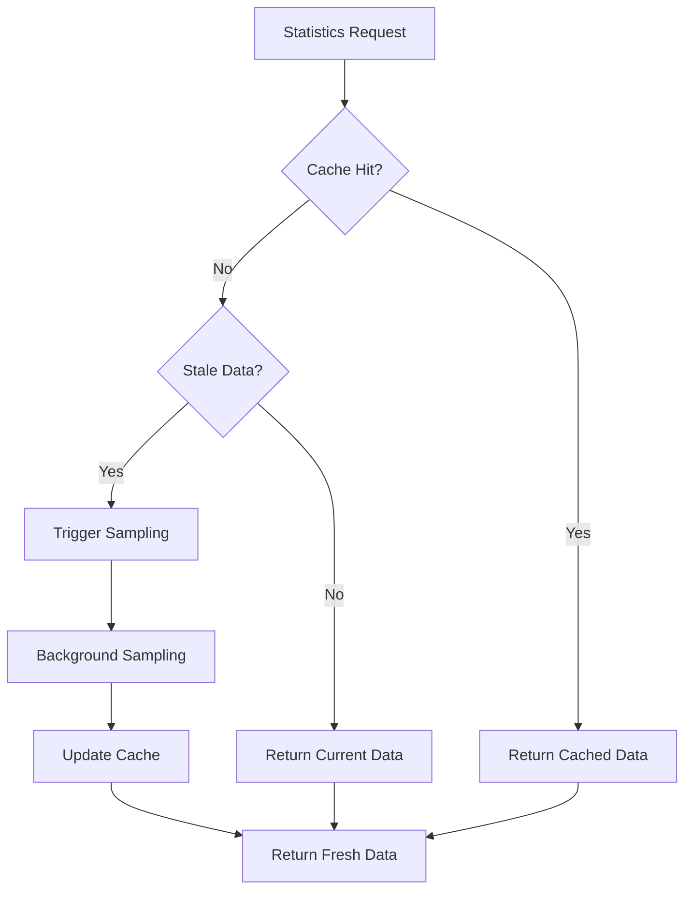
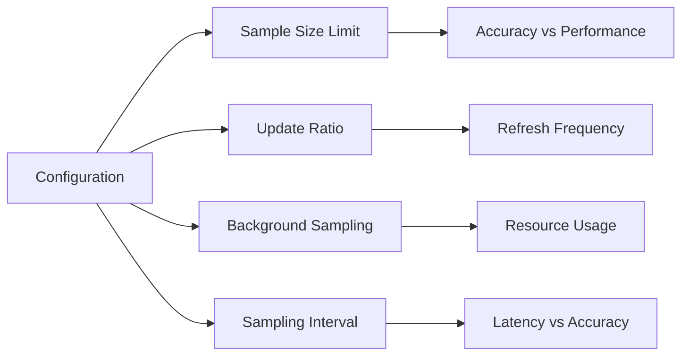

# Index Statistics

<cite>
**Referenced Files in This Document**
- [IndexStatisticsStore.java](file://community/storage-engine-util/src/main/java/org/neo4j/kernel/impl/api/index/stats/IndexStatisticsStore.java)
- [IndexStatisticsKey.java](file://community/storage-engine-util/src/main/java/org/neo4j/kernel/impl/api/index/stats/IndexStatisticsKey.java)
- [IndexStatisticsValue.java](file://community/storage-engine-util/src/main/java/org/neo4j/kernel/impl/api/index/stats/IndexStatisticsValue.java)
- [IndexStatisticsLayout.java](file://community/storage-engine-util/src/main/java/org/neo4j/kernel/impl/api/index/stats/IndexStatisticsLayout.java)
- [IndexStatisticsVisitor.java](file://community/storage-engine-util/src/main/java/org/neo4j/kernel/impl/api/index/stats/IndexStatisticsVisitor.java)
- [IndexSamplingController.java](file://community/kernel/src/main/java/org/neo4j/kernel/impl/api/index/sampling/IndexSamplingController.java)
- [IndexSamplingConfig.java](file://community/kernel-api/src/main/java/org/neo4j/kernel/impl/api/index/IndexSamplingConfig.java)
- [GraphStatistics.scala](file://community/cypher/planner-spi/src/main/scala/org/neo4j/cypher/internal/planner/spi/GraphStatistics.scala)
- [StatisticsBackedCardinalityModel.scala](file://community/cypher/cypher-planner/src/main/scala/org/neo4j/cypher/internal/compiler/planner/logical/StatisticsBackedCardinalityModel.scala)
- [ValueIndexProxyStrategy.java](file://community/kernel/src/main/java/org/neo4j/kernel/impl/api/index/ValueIndexProxyStrategy.java)
- [DatabaseIndexStats.java](file://community/kernel/src/main/java/org/neo4j/kernel/impl/index/DatabaseIndexStats.java)
</cite>

## Table of Contents
1. [Introduction](#introduction)
2. [System Architecture](#system-architecture)
3. [Core Components](#core-components)
4. [Statistics Collection and Storage](#statistics-collection-and-storage)
5. [Integration with Cypher Planner](#integration-with-cypher-planner)
6. [Sampling and Refresh Mechanisms](#sampling-and-refresh-mechanisms)
7. [Performance Considerations](#performance-considerations)
8. [Common Issues and Solutions](#common-issues-and-solutions)
9. [Configuration and Tuning](#configuration-and-tuning)
10. [Troubleshooting Guide](#troubleshooting-guide)
11. [Conclusion](#conclusion)

## Introduction

The Neo4j Index Statistics system is a sophisticated mechanism designed to collect, store, and utilize statistical data about database indexes to optimize query execution plans. This system plays a crucial role in the Cypher query planner by providing cardinality estimates, selectivity measurements, and usage patterns that enable the planner to make informed decisions about index selection, join ordering, and query optimization strategies.

The statistics system operates on a dual-layer architecture: real-time statistics collection during transaction processing and periodic sampling for large-scale statistics gathering. This approach balances query performance with statistical accuracy, ensuring that the query planner has up-to-date information while minimizing the overhead of statistics maintenance.

## System Architecture

The Index Statistics system consists of several interconnected components that work together to provide comprehensive statistical information for query optimization:

**Diagram sources**
- [IndexStatisticsStore.java](file://community/storage-engine-util/src/main/java/org/neo4j/kernel/impl/api/index/stats/IndexStatisticsStore.java#L56-L272)
- [IndexSamplingController.java](file://community/kernel/src/main/java/org/neo4j/kernel/impl/api/index/sampling/IndexSamplingController.java#L61-L283)
- [GraphStatistics.scala](file://community/cypher/planner-spi/src/main/scala/org/neo4j/cypher/internal/planner/spi/GraphStatistics.scala#L27-L73)

## Core Components

### IndexStatisticsStore

The [`IndexStatisticsStore`](file://community/storage-engine-util/src/main/java/org/neo4j/kernel/impl/api/index/stats/IndexStatisticsStore.java#L56-L272) serves as the central component for managing index statistics data. It provides a persistent storage layer built on top of the GBPTree (Generalized B+ Tree) technology, ensuring efficient access and durability of statistical information.

**Key Features:**
- **Dual Storage Strategy**: Maintains statistics in both memory (cache) and persistent storage (GBPTree)
- **Non-blocking Operations**: Reads, writes, and checkpoints operate independently without blocking each other
- **Transactional Safety**: Statistics are not updated transactionally but are flushed to disk during checkpoints
- **Type-Safe Storage**: Supports both sample statistics and usage statistics through distinct key types

**Section sources**
- [IndexStatisticsStore.java](file://community/storage-engine-util/src/main/java/org/neo4j/kernel/impl/api/index/stats/IndexStatisticsStore.java#L56-L272)

### IndexStatisticsKey and IndexStatisticsValue

The statistical data is organized using a sophisticated key-value structure that enables efficient indexing and retrieval:

**Diagram sources**
- [IndexStatisticsKey.java](file://community/storage-engine-util/src/main/java/org/neo4j/kernel/impl/api/index/stats/IndexStatisticsKey.java#L44-L130)
- [IndexStatisticsValue.java](file://community/storage-engine-util/src/main/java/org/neo4j/kernel/impl/api/index/stats/IndexStatisticsValue.java#L35-L66)
- [IndexStatisticsLayout.java](file://community/storage-engine-util/src/main/java/org/neo4j/kernel/impl/api/index/stats/IndexStatisticsLayout.java#L29-L94)

**Section sources**
- [IndexStatisticsKey.java](file://community/storage-engine-util/src/main/java/org/neo4j/kernel/impl/api/index/stats/IndexStatisticsKey.java#L44-L130)
- [IndexStatisticsValue.java](file://community/storage-engine-util/src/main/java/org/neo4j/kernel/impl/api/index/stats/IndexStatisticsValue.java#L35-L66)
- [IndexStatisticsLayout.java](file://community/storage-engine-util/src/main/java/org/neo4j/kernel/impl/api/index/stats/IndexStatisticsLayout.java#L29-L94)

### GraphStatistics Interface

The [`GraphStatistics`](file://community/cypher/planner-spi/src/main/scala/org/neo4j/cypher/internal/planner/spi/GraphStatistics.scala#L27-L73) interface defines the contract between the statistics system and the Cypher planner, providing essential cardinality and selectivity information:

**Core Methods:**
- `nodesAllCardinality()`: Total number of nodes in the database
- `nodesWithLabelCardinality(labelId)`: Cardinality for nodes with specific labels
- `patternStepCardinality()`: Cardinality for relationship patterns
- `uniqueValueSelectivity()`: Selectivity of unique values in indexes
- `indexPropertyIsNotNullSelectivity()`: Probability of property existence

**Section sources**
- [GraphStatistics.scala](file://community/cypher/planner-spi/src/main/scala/org/neo4j/cypher/internal/planner/spi/GraphStatistics.scala#L27-L73)

## Statistics Collection and Storage

### Real-Time Statistics Updates

During transaction processing, the system maintains real-time statistics through the [`ValueIndexProxyStrategy`](file://community/kernel/src/main/java/org/neo4j/kernel/impl/api/index/ValueIndexProxyStrategy.java#L32-L63):

**Diagram sources**
- [ValueIndexProxyStrategy.java](file://community/kernel/src/main/java/org/neo4j/kernel/impl/api/index/ValueIndexProxyStrategy.java#L32-L63)

**Section sources**
- [ValueIndexProxyStrategy.java](file://community/kernel/src/main/java/org/neo4j/kernel/impl/api/index/ValueIndexProxyStrategy.java#L32-L63)

### Persistent Storage Architecture

The statistics are stored using a sophisticated GBPTree-based architecture that ensures both performance and durability:

**Diagram sources**
- [IndexStatisticsStore.java](file://community/storage-engine-util/src/main/java/org/neo4j/kernel/impl/api/index/stats/IndexStatisticsStore.java#L273-L338)

**Section sources**
- [IndexStatisticsStore.java](file://community/storage-engine-util/src/main/java/org/neo4j/kernel/impl/api/index/stats/IndexStatisticsStore.java#L273-L338)

### Statistics Types and Fields

The system tracks multiple types of statistics for each index:

| Statistic Type | Fields | Purpose |
|----------------|--------|---------|
| **Sample Statistics** | Unique Values, Sample Size, Updates Count, Index Size | Cardinality estimation and selectivity calculation |
| **Usage Statistics** | Last Read Time, Query Count, Tracked Since | Query pattern analysis and index utilization |

**Section sources**
- [IndexStatisticsKey.java](file://community/storage-engine-util/src/main/java/org/neo4j/kernel/impl/api/index/stats/IndexStatisticsKey.java#L35-L43)

## Integration with Cypher Planner

### Cardinality Estimation

The [`StatisticsBackedCardinalityModel`](file://community/cypher/cypher-planner/src/main/scala/org/neo4j/cypher/internal/compiler/planner/logical/StatisticsBackedCardinalityModel.scala#L75-L338) integrates statistics into the Cypher planner's cardinality estimation process:

**Diagram sources**
- [StatisticsBackedCardinalityModel.scala](file://community/cypher/cypher-planner/src/main/scala/org/neo4j/cypher/internal/compiler/planner/logical/StatisticsBackedCardinalityModel.scala#L75-L338)

**Section sources**
- [StatisticsBackedCardinalityModel.scala](file://community/cypher/cypher-planner/src/main/scala/org/neo4j/cypher/internal/compiler/planner/logical/StatisticsBackedCardinalityModel.scala#L75-L338)

### Selectivity Calculations

The system performs sophisticated selectivity calculations using statistical data:

**Section sources**
- [StatisticsBackedCardinalityModel.scala](file://community/cypher/cypher-planner/src/main/scala/org/neo4j/cypher/internal/compiler/planner/logical/StatisticsBackedCardinalityModel.scala#L295-L338)

## Sampling and Refresh Mechanisms

### Background Sampling

The [`IndexSamplingController`](file://community/kernel/src/main/java/org/neo4j/kernel/impl/api/index/sampling/IndexSamplingController.java#L61-L283) manages periodic sampling of index statistics:

**Diagram sources**
- [IndexSamplingController.java](file://community/kernel/src/main/java/org/neo4j/kernel/impl/api/index/sampling/IndexSamplingController.java#L61-L283)

**Section sources**
- [IndexSamplingController.java](file://community/kernel/src/main/java/org/neo4j/kernel/impl/api/index/sampling/IndexSamplingController.java#L61-L283)

### Sampling Configuration

The [`IndexSamplingConfig`](file://community/kernel-api/src/main/java/org/neo4j/kernel/impl/api/index/IndexSamplingConfig.java#L25-L80) controls sampling behavior:

| Configuration | Description | Default Value |
|---------------|-------------|---------------|
| `sampleSizeLimit` | Maximum number of entries to sample | 10,000 |
| `updateRatio` | Ratio of updates triggering sampling | 0.1 (10%) |
| `backgroundSampling` | Enable background sampling | true |

**Section sources**
- [IndexSamplingConfig.java](file://community/kernel-api/src/main/java/org/neo4j/kernel/impl/api/index/IndexSamplingConfig.java#L25-L80)

### Statistics Refresh Strategies

The system employs multiple refresh strategies to keep statistics current:

## Performance Considerations

### Memory Management

The statistics system is designed with careful attention to memory usage:

- **Concurrent HashMap**: Uses thread-safe concurrent structures for cache management
- **Immutable Values**: Statistics values are immutable to prevent race conditions
- **Lazy Loading**: Statistics are loaded on-demand from persistent storage
- **Memory Limits**: Configurable limits prevent excessive memory consumption

### I/O Optimization

The GBPTree-based storage provides several performance benefits:

- **Sequential Access**: Optimized for sequential read patterns
- **Batch Operations**: Multiple statistics updates are batched together
- **Asynchronous Writes**: I/O operations don't block query execution
- **Compression**: Statistical data is compressed for efficient storage

### Scalability Factors

Several factors affect the scalability of the statistics system:

| Factor | Impact | Mitigation Strategy |
|--------|--------|-------------------|
| **Index Count** | Linear growth in memory usage | Efficient key encoding |
| **Update Frequency** | Affects sampling timing | Configurable update ratios |
| **Sample Size** | Direct impact on accuracy | Adaptive sampling rates |
| **Disk I/O** | Checkpoint performance | Batched write operations |

## Common Issues and Solutions

### Statistics Staleness

**Problem**: Statistics become outdated, leading to suboptimal query plans.

**Causes:**
- High update frequency without adequate sampling
- Large indexes requiring frequent refresh
- Background sampling disabled

**Solutions:**
- Increase sampling frequency through configuration
- Enable background sampling for continuous updates
- Monitor statistics divergence and trigger manual sampling when needed

### Overhead of Statistics Collection

**Problem**: Statistics collection impacts query performance.

**Mitigation Strategies:**
- Use incremental updates instead of full recomputation
- Configure appropriate sampling ratios
- Implement adaptive sampling based on workload patterns

### Inaccurate Cardinality Estimates

**Problem**: Poor query performance due to incorrect cardinality estimates.

**Diagnosis Steps:**
1. Check statistics freshness using divergence metrics
2. Verify sampling configuration adequacy
3. Review index coverage and selectivity
4. Analyze query patterns and predicates

**Resolution Approaches:**
- Trigger manual sampling for critical indexes
- Adjust sampling parameters based on workload characteristics
- Implement hybrid approaches combining statistics and heuristics

**Section sources**
- [IndexSamplingController.java](file://community/kernel/src/main/java/org/neo4j/kernel/impl/api/index/sampling/IndexSamplingController.java#L117-L148)

## Configuration and Tuning

### Key Configuration Parameters

The statistics system can be tuned through several configuration parameters:

### Monitoring and Metrics

The system provides comprehensive monitoring capabilities:

- **Statistics Divergence**: Measures deviation between cached and actual statistics
- **Sampling Performance**: Tracks sampling execution time and resource usage
- **Cache Hit Rates**: Monitors effectiveness of the statistics cache
- **I/O Patterns**: Analyzes read/write patterns for optimization

**Section sources**
- [DatabaseIndexStats.java](file://community/kernel/src/main/java/org/neo4j/kernel/impl/index/DatabaseIndexStats.java#L33-L71)

## Troubleshooting Guide

### Common Symptoms and Solutions

| Symptom | Possible Cause | Solution |
|---------|---------------|----------|
| Slow query execution | Stale statistics | Trigger manual sampling |
| Suboptimal query plans | Inaccurate cardinality estimates | Adjust sampling configuration |
| High CPU usage | Excessive statistics updates | Tune update ratio and sampling frequency |
| Disk space issues | Large statistics files | Review sampling parameters |

### Diagnostic Commands

The system provides several diagnostic capabilities:

1. **Statistics Inspection**: Query current statistics values
2. **Divergence Analysis**: Compare cached vs. actual statistics
3. **Sampling History**: Track sampling execution history
4. **Performance Metrics**: Monitor statistics-related performance

### Recovery Procedures

In case of statistics corruption or loss:

1. **Automatic Recovery**: System attempts to rebuild statistics from scratch
2. **Manual Intervention**: Force sampling for specific indexes
3. **Configuration Reset**: Restore default sampling parameters
4. **Full Rebuild**: Trigger complete statistics reconstruction

**Section sources**
- [IndexStatisticsStore.java](file://community/storage-engine-util/src/main/java/org/neo4j/kernel/impl/api/index/stats/IndexStatisticsStore.java#L280-L287)

## Conclusion

The Neo4j Index Statistics system represents a sophisticated approach to query optimization that balances accuracy with performance. Through its dual-layer architecture of real-time updates and periodic sampling, the system provides the Cypher planner with the statistical information needed to make optimal execution decisions.

Key strengths of the system include:

- **Scalability**: Efficient handling of large databases with millions of nodes and relationships
- **Accuracy**: Sophisticated sampling and estimation algorithms
- **Performance**: Minimal overhead through intelligent caching and batching
- **Reliability**: Robust persistence and recovery mechanisms

The system continues to evolve with ongoing improvements in sampling algorithms, caching strategies, and integration with emerging query optimization techniques. For database administrators and developers working with Neo4j, understanding and properly configuring the statistics system is essential for achieving optimal query performance in production environments.