# Indexing System

<cite>
**Referenced Files in This Document**   
- [PointBlockBasedIndexPopulator.java](file://community\kernel\src\main\java\org\neo4j\kernel\impl\index\schema\PointBlockBasedIndexPopulator.java)
- [SpatialIndexConfig.java](file://community\kernel\src\main\java\org\neo4j\kernel\impl\index\schema\SpatialIndexConfig.java)
- [IndexingProvidersService.java](file://community\kernel\src\main\java\org\neo4j\kernel\impl\api\index\IndexingProvidersService.java)
- [StaticIndexProviderMap.java](file://community\kernel\src\main\java\org\neo4j\kernel\impl\transaction\state\StaticIndexProviderMap.java)
- [AllIndexProviderDescriptors.java](file://community\schema\src\main\java\org\neo4j\internal\schema\AllIndexProviderDescriptors.java)
- [PointIndexReader.java](file://community\kernel\src\main\java\org\neo4j\kernel\impl\index\schema\PointIndexReader.java)
- [NativeIndexProvider.java](file://community\kernel\src\main\java\org\neo4j\kernel\impl\index\schema\NativeIndexProvider.java)
- [SpaceFillingCurveSettingsFactory.java](file://community\kernel\src\main\java\org\neo4j\kernel\impl\index\schema\config\SpaceFillingCurveSettingsFactory.java)
- [IndexSetting.java](file://community\graphdb-api\src\main\java\org\neo4j\graphdb\schema\IndexSetting.java)
- [PointIndexProvider.java](file://community\kernel\src\main\java\org\neo4j\kernel\impl\index\schema\PointIndexProvider.java)
- [IndexSettingUtil.java](file://community\kernel\src\main\java\org\neo4j\graphdb\schema\IndexSettingUtil.java)
- [VectorIndexAccessor.java](file://community\lucene-index\src\main\java\org\neo4j\kernel\api\impl\schema\vector\VectorIndexAccessor.java)
- [PointIndexAccessor.java](file://community\kernel\src\main\java\org\neo4j\kernel\impl\index\schema\PointIndexAccessor.java)
- [MockIndexProviderMap.java](file://community\kernel-test-utils\src\main\java\org\neo4j\kernel\impl\api\index\MockIndexProviderMap.java)
- [IndexProvider.java](file://community\kernel-api\src\main\java\org\neo4j\kernel\api\index\IndexProvider.java)
- [ReadOnlyIndexPartition.java](file://community\lucene-index\src\main\java\org\neo4j\kernel\api\impl\index\partition\ReadOnlyIndexPartition.java)
- [AbstractLuceneIndexAccessor.java](file://community\lucene-index\src\main\java\org\neo4j\kernel\api\impl\index\AbstractLuceneIndexAccessor.java)
- [NativeIndexAccessor.java](file://community\kernel\src\main\java\org\neo4j\kernel\impl\index\schema\NativeIndexAccessor.java)
- [IndexReaderCache.java](file://community\kernel\src\main\java\org\neo4j\kernel\impl\api\IndexReaderCache.java)
- [TokenIndexImporter.java](file://community\kernel\src\main\java\org\neo4j\kernel\impl\index\schema\TokenIndexImporter.java)
- [IndexAccessor.java](file://community\kernel-api\src\main\java\org\neo4j\kernel\api\index\IndexAccessor.java)
- [LuceneMinimalIndexAccessor.java](file://community\lucene-index\src\main\java\org\neo4j\kernel\api\impl\index\LuceneMinimalIndexAccessor.java)
- [FlippableIndexProxy.java](file://community\kernel\src\main\java\org\neo4j\kernel\impl\api\index\FlippableIndexProxy.java)
- [IndexReaders.java](file://community\kernel\src\main\java\org\neo4j\kernel\impl\newapi\IndexReaders.java)
- [IndexReaderCloseException.java](file://community\lucene-index\src\main\java\org\neo4j\kernel\api\impl\schema\reader\IndexReaderCloseException.java)
- [AbstractLuceneIndex.java](file://community\lucene-index\src\main\java\org\neo4j\kernel\api\impl\index\AbstractLuceneIndex.java)
- [DefaultIndexProvidersAccess.java](file://community\kernel\src\main\java\org\neo4j\kernel\impl\index\schema\DefaultIndexProvidersAccess.java)
- [AbstractDatabaseIndex.java](file://community\lucene-index\src\main\java\org\neo4j\kernel\api\impl\index\AbstractDatabaseIndex.java)
- [KernelTransactionImplementation.java](file://community\kernel\src\main\java\org\neo4j\kernel\impl\api\KernelTransactionImplementation.java)
- [StorageEngine.java](file://community\kernel-api\src\main\java\org\neo4j\storageengine\api\StorageEngine.java)
- [SchemaReadCoreSnapshot.java](file://community\kernel\src\main\java\org\neo4j\kernel\impl\newapi\SchemaReadCoreSnapshot.java)
- [IndexingService.java](file://community\kernel\src\main\java\org\neo4j\kernel\impl\api\index\IndexingService.java)
- [RecordStorageEngine.java](file://community\record-storage-engine\src\main\java\org\neo4j\internal\recordstorage\RecordStorageEngine.java)
- [QueryPlannerConfiguration.scala](file://community\cypher\cypher-planner\src\main\scala\org\neo4j\cypher\internal\compiler\planner\logical\QueryPlannerConfiguration.scala)
- [CompositeExpressionSelectivityCalculator.scala](file://community\cypher\cypher-planner\src\main\scala\org\neo4j\cypher\internal\compiler\planner\logical\cardinality\CompositeExpressionSelectivityCalculator.scala)
- [LogicalPlanProducer.scala](file://community\cypher\cypher-planner\src\main\scala\org\neo4j\cypher\internal\compiler\planner\logical\steps\LogicalPlanProducer.scala)
- [EntityIndexScanPlanProvider.scala](file://community\cypher\cypher-planner\src\main\scala\org\neo4j\cypher\internal\compiler\planner\logical\steps\index\EntityIndexScanPlanProvider.scala)
- [RelationshipIndexSeekPlanProvider.scala](file://community\cypher\cypher-planner\src\main\scala\org\neo4j\cypher\internal\compiler\planner\logical\steps\index\RelationshipIndexSeekPlanProvider.scala)
- [cartesianProductsOrValueJoins.scala](file://community\cypher\cypher-planner\src\main\scala\org\neo4j\cypher\internal\compiler\planner\logical\idp\cartesianProductsOrValueJoins.scala)
- [PlannerName.scala](file://community\cypher\planner-spi\src\main\scala\org\neo4j\cypher\internal\planner\spi\PlannerName.scala)
- [GBPTree.java](file://community\index\src\main\java\org\neo4j\index\internal\gbptree\GBPTree.java)
- [NativeIndexKey.java](file://community\kernel\src\main\java\org\neo4j\kernel\impl\index\schema\NativeIndexKey.java)
- [GBPTreeStructure.java](file://community\index\src\main\java\org\neo4j\index\internal\gbptree\GBPTreeStructure.java)
- [DefaultEntityValueIndexCursor.java](file://community\kernel\src\main\java\org\neo4j\kernel\impl\newapi\DefaultEntityValueIndexCursor.java)
- [GBPTreeVisitor.java](file://community\index\src\main\java\org\neo4j\index\internal\gbptree\GBPTreeVisitor.java)
- [SeekCursor.java](file://community\index\src\main\java\org\neo4j\index\internal\gbptree\SeekCursor.java)
- [GBPTreePointerType.java](file://community\index\src\main\java\org\neo4j\index\internal\gbptree\GBPTreePointerType.java)
- [GBPPointerType.java](file://community\index\src\main\java\org\neo4j\index\internal\gbptree\GBPPointerType.java)
- [MultiRootLayer.java](file://community\index\src\main\java\org\neo4j\index\internal\gbptree\MultiRootLayer.java)
- [RangeIndexReader.java](file://community\kernel\src\main\java\org\neo4j\kernel\impl\index\schema\RangeIndexReader.java)
- [FulltextIndex.java](file://community\fulltext-index\src\main\java\org\neo4j\kernel\api\impl\fulltext\FulltextIndex.java)
- [FulltextIndexProvider.java](file://community\fulltext-index\src\main\java\org\neo4j\kernel\api\impl\fulltext\FulltextIndexProvider.java)
- [FulltextIndexPopulator.java](file://community\fulltext-index\src\main\java\org\neo4j\kernel\api\impl\fulltext\FulltextIndexPopulator.java)
- [TransactionStateLuceneIndexWriter.java](file://community\fulltext-index\src\main\java\org\neo4j\kernel\api\impl\fulltext\TransactionStateLuceneIndexWriter.java)
- [FulltextIndexReader.java](file://community\fulltext-index\src\main\java\org\neo4j\kernel\api\impl\fulltext\FulltextIndexReader.java)
- [FulltextIndexTransactionState.java](file://community\fulltext-index\src\main\java\org\neo4j\kernel\api\impl\fulltext\FulltextIndexTransactionState.java)
- [StatsCachingIndexSearcher.java](file://community\fulltext-index\src\main\java\org\neo4j\kernel\api\impl\fulltext\StatsCachingIndexSearcher.java)
- [PreparedSearch.java](file://community\fulltext-index\src\main\java\org\neo4j\kernel\api\impl\fulltext\PreparedSearch.java)
- [FulltextIndexAccessor.java](file://community\fulltext-index\src\main\java\org\neo4j\kernel\api\impl\fulltext\FulltextIndexAccessor.java)
- [LuceneIndexStorageBuilder.java](file://community\lucene-index\src\main\java\org\neo4j\kernel\api\impl\index\builder\LuceneIndexStorageBuilder.java)
- [FulltextIndexBuilder.java](file://community\fulltext-index\src\main\java\org\neo4j\kernel\api\impl\fulltext\FulltextIndexBuilder.java)
- [LucenePartitionAllDocumentsReader.java](file://community\lucene-index\src\main\java\org\neo4j\kernel\api\impl\index\LucenePartitionAllDocumentsReader.java)
- [LuceneFulltextDocumentStructure.java](file://community\fulltext-index\src\main\java\org\neo4j\kernel\api\impl\fulltext\LuceneFulltextDocumentStructure.java)
- [TextIndexBuilder.java](file://community\lucene-index\src\main\java\org\neo4j\kernel\api\impl\schema\TextIndexBuilder.java)
- [BuiltInProcedures.java](file://community\procedure\src\main\java\org\neo4j\procedure\builtin\BuiltInProcedures.java)
- [IndexStatisticsKey.java](file://community\storage-engine-util\src\main\java\org\neo4j\kernel\impl\api\index\stats\IndexStatisticsKey.java)
- [DataCollectorProcedures.java](file://community\data-collector\src\main\java\org\neo4j\internal\collector\DataCollectorProcedures.java)
- [GroupingRecoveryCleanupWorkCollector.java](file://community\index\src\main\java\org\neo4j\index\internal\gbptree\GroupingRecoveryCleanupWorkCollector.java)
- [IndexStatisticsStore.java](file://community\storage-engine-util\src\main\java\org\neo4j\kernel\impl\api\index\stats\IndexStatisticsStore.java)
- [DatabaseIndexStats.java](file://community\kernel\src\main\java\org\neo4j\kernel\impl\index\DatabaseIndexStats.java)
- [OnlineIndexProxy.java](file://community\kernel\src\main\java\org\neo4j\kernel\impl\api\index\OnlineIndexProxy.java)
- [IndexingService.java](file://community\kernel\src\main\java\org\neo4j\kernel\impl\api\index\IndexingService.java)
- [TxState.java](file://community\kernel\src\main\java\org\neo4j\kernel\impl\api\state\TxState.java)
- [IndexSamplingController.java](file://community\kernel\src\main\java\org\neo4j\kernel\impl\api\index\sampling\IndexSamplingController.java)
- [IndexingServiceFactory.java](file://community\kernel\src\main\java\org\neo4j\kernel\impl\api\index\IndexingServiceFactory.java)
- [VectorSimilarityEuclidean.scala](file://community\cypher\front-end\expressions\src\main\scala\org\neo4j\cypher\internal\expressions\functions\VectorSimilarityEuclidean.scala)
- [VectorSimilarity.java](file://community\lucene-index\src\main\java\org\neo4j\kernel\api\impl\schema\vector\VectorSimilarity.java)
- [VectorIndexVersion.java](file://community\lucene-index\src\main\java\org\neo4j\kernel\api\impl\schema\vector\VectorIndexVersion.java)
- [VectorIndexCapability.java](file://community\lucene-index\src\main\java\org\neo4j\kernel\api\impl\schema\vector\VectorIndexCapability.java)
- [VectorIndexProcedures.java](file://community\procedure\src\main\java\org\neo4j\procedure\builtin\VectorIndexProcedures.java)
- [VectorSimilarityFunction.scala](file://community\cypher\interpreted-runtime\src\main\scala\org\neo4j\cypher\internal\runtime\interpreted\commands\expressions\VectorSimilarityFunction.scala)
- [VectorSimilarityFunctions.java](file://community\lucene-index\src\main\java\org\neo4j\kernel\api\impl\schema\vector\VectorSimilarityFunctions.java)
- [VectorSimilarityFunction.java](file://community\kernel-api\src\main\java\org\neo4j\kernel\api\vector\VectorSimilarityFunction.java)
- [CypherFunctions.java](file://community\cypher\runtime-util\src\main\java\org\neo4j\cypher\operations\CypherFunctions.java)
- [VectorTestUtils.java](file://community\kernel-test-utils\src\main\java\org\neo4j\kernel\api\schema\vector\VectorTestUtils.java)
- [PointKey.java](file://community\kernel\src\main\java\org\neo4j\kernel\impl\index\schema\PointKey.java)
- [IndexSpecificSpaceFillingCurveSettings.java](file://community\kernel\src\main\java\org\neo4j\kernel\impl\index\schema\config\IndexSpecificSpaceFillingCurveSettings.java)
- [SpatialIndexValueTestUtil.java](file://community\kernel-test-utils\src\main\java\org\neo4j\kernel\impl\index\schema\config\SpatialIndexValueTestUtil.java)
- [GeometryType.java](file://community\kernel\src\main\java\org\neo4j\kernel\impl\index\schema\GeometryType.java)
- [CoordinateReferenceSystem.java](file://community\values\src\main\java\org\neo4j\values\storable\CoordinateReferenceSystem.java)
- [GeometryType.java](file://community\record-storage-engine\src\main\java\org\neo4j\kernel\impl\store\GeometryType.java)
- [TreeWriterCoordination.java](file://community\index\src\main\java\org\neo4j\index\internal\gbptree\TreeWriterCoordination.java)
- [InternalNodeFixedSize.java](file://community\index\src\main\java\org\neo4j\index\internal\gbptree\InternalNodeFixedSize.java)
- [GBPTreeWriter.java](file://community\index\src\main\java\org\neo4j\index\internal\gbptree\GBPTreeWriter.java)
- [InternalTreeLogic.java](file://community\index\src\main\java\org\neo4j\index\internal\gbptree\InternalTreeLogic.java)
- [GBPTreeGenericCountsStore.java](file://community\storage-engine-util\src\main\java\org\neo4j\internal\counts\GBPTreeGenericCountsStore.java)
- [BatchContextImpl.java](file://community\record-storage-engine\src\main\java\org\neo4j\internal\recordstorage\BatchContextImpl.java)
- [AdversarialReadPageCursor.java](file://community\testing\io-utils\src\main\java\org\neo4j\adversaries\pagecache\AdversarialReadPageCursor.java)
- [NativeIndexPopulator.java](file://community\kernel\src\main\java\org\neo4j\kernel\impl\index\schema\NativeIndexPopulator.java)
- [IndexStatisticsStore.java](file://community\storage-engine-util\src\main\java\org\neo4j\kernel\impl\api\index\stats\IndexStatisticsStore.java)
- [IndexUpdatesWorkSync.java](file://community\storage-engine-util\src\main\java\org\neo4j\storageengine\util\IndexUpdatesWorkSync.java)
- [IndexSamplingController.java](file://community\kernel\src\main\java\org\neo4j\kernel\impl\api\index\sampling\IndexSamplingController.java)
- [IndexingService.java](file://community\kernel\src\main\java\org\neo4j\kernel\impl\api\index\IndexingService.java)
- [RangeIndexProvider.java](file://community\kernel\src\main\java\org\neo4j\kernel\impl\index\schema\RangeIndexProvider.java)
- [MultiRootGBPTree.java](file://community\index\src\main\java\org\neo4j\index\internal\gbptree\MultiRootGBPTree.java)
- [BulkIndexesCreator.java](file://community\kernel\src\main\java\org\neo4j\kernel\impl\index\schema\BulkIndexesCreator.java)
- [BlockBasedIndexPopulator.java](file://community\kernel\src\main\java\org\neo4j\kernel\impl\index\schema\BlockBasedIndexPopulator.java)
- [IndexMonitorAdaptor.java](file://community\kernel\src\main\java\org\neo4j\kernel\impl\index\schema\IndexMonitorAdaptor.java)
- [LoggingMonitor.java](file://community\kernel-api\src\main\java\org\neo4j\kernel\api\index\LoggingMonitor.java)
- [NativeIndex.java](file://community\kernel\src\main\java\org\neo4j\kernel\impl\index\schema\NativeIndex.java)
- [NativeIndexUpdater.java](file://community\kernel\src\main\java\org\neo4j\kernel\impl\index\schema\NativeIndexUpdater.java)
- [PhaseTracker.java](file://community\kernel-api\src\main\java\org\neo4j\kernel\impl\api\index\PhaseTracker.java)
- [GroupingRecoveryCleanupWorkCollector.java](file://community\index\src\main\java\org\neo4j\index\internal\gbptree\GroupingRecoveryCleanupWorkCollector.java)
</cite>

## Table of Contents
1. [Introduction](#introduction)
2. [Indexing Architecture Overview](#indexing-architecture-overview)
3. [Core Indexing Components](#core-indexing-components)
4. [Generalized B+ Tree (GBPTree) Implementation](#generalized-b-tree-gbptree-implementation)
5. [Apache Lucene Integration for Full-Text Search](#apache-lucene-integration-for-full-text-search)
6. [Specialized Indexes for Spatial and Vector Data](#specialized-indexes-for-spatial-and-vector-data)
7. [Index Provider and Storage Engine Integration](#index-provider-and-storage-engine-integration)
8. [Index Lifecycle Management](#index-lifecycle-management)
9. [Query Optimization and Execution](#query-optimization-and-execution)
10. [Index Configuration and Maintenance](#index-configuration-and-maintenance)
11. [Concurrency and Consistency](#concurrency-and-consistency)
12. [Performance Considerations](#performance-considerations)
13. [Troubleshooting Guide](#troubleshooting-guide)
14. [Conclusion](#conclusion)

## Introduction

The Neo4j indexing system provides a comprehensive framework for efficient data retrieval through multiple indexing strategies. This document details the implementation of the indexing system within Neo4j's storage engine, focusing on the Generalized B+ Tree (GBPTree) for exact match queries, Apache Lucene integration for full-text search, and specialized indexes for spatial and vector data. The system is designed to balance performance, scalability, and consistency while supporting complex query patterns across diverse data types.

The indexing architecture is built around a modular design that separates index providers, storage mechanisms, and query optimization components. This separation allows for specialized implementations tailored to specific data types and query patterns while maintaining a consistent interface for index creation, maintenance, and utilization. The system supports both synchronous and asynchronous index updates, background compaction, and eventually consistent index updates to handle high-write workloads efficiently.

**Section sources**
- [AllIndexProviderDescriptors.java](file://community\schema\src\main\java\org\neo4j\internal\schema\AllIndexProviderDescriptors.java#L33-L60)
- [IndexingProvidersService.java](file://community\kernel\src\main\java\org\neo4j\kernel\impl\api\index\IndexingProvidersService.java#L101-L122)

## Indexing Architecture Overview

The Neo4j indexing system follows a layered architecture that integrates multiple indexing technologies while maintaining a unified interface for the storage engine and query planner. The core components include index providers, index accessors, index readers, and the query optimization layer. This architecture enables the system to support diverse indexing strategies while providing consistent behavior across different index types.

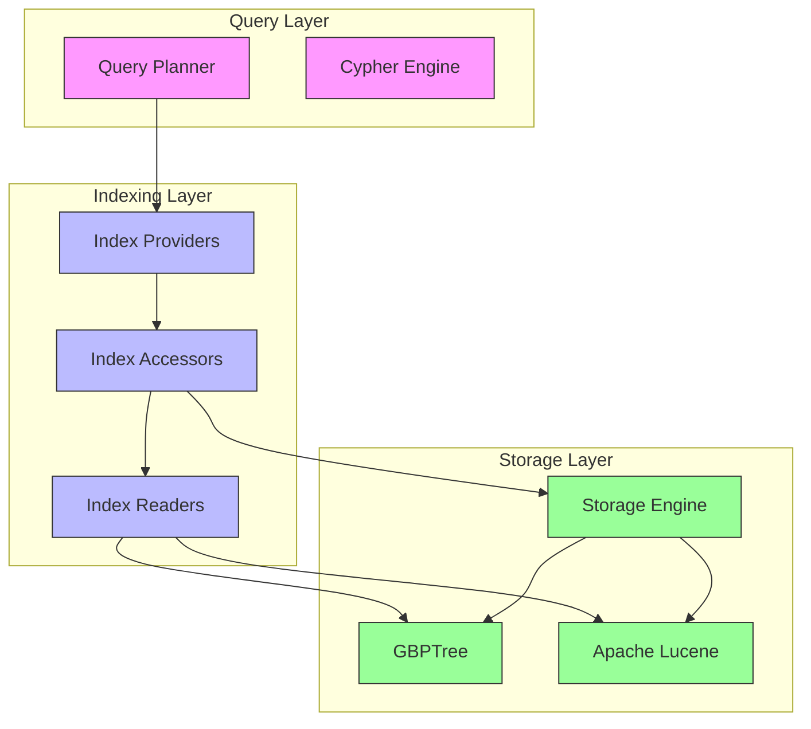

**Diagram sources**
- [StaticIndexProviderMap.java](file://community\kernel\src\main\java\org\neo4j\kernel\impl\transaction\state\StaticIndexProviderMap.java#L55-L86)
- [IndexingProvidersService.java](file://community\kernel\src\main\java\org\neo4j\kernel\impl\api\index\IndexingProvidersService.java#L101-L122)
- [IndexProvider.java](file://community\kernel-api\src\main\java\org\neo4j\kernel\api\index\IndexProvider.java#L390-L422)

**Section sources**
- [AllIndexProviderDescriptors.java](file://community\schema\src\main\java\org\neo4j\internal\schema\AllIndexProviderDescriptors.java#L33-L60)
- [IndexingProvidersService.java](file://community\kernel\src\main\java\org\neo4j\kernel\impl\api\index\IndexingProvidersService.java#L101-L122)

## Core Indexing Components

The Neo4j indexing system is built around three core components: IndexProvider, IndexAccessor, and IndexReader. These components form a hierarchical structure that manages the lifecycle of indexes from creation to query execution. The IndexProvider serves as the factory for creating index instances, the IndexAccessor manages the online state of an index, and the IndexReader provides the interface for querying indexed data.

The IndexProvider is responsible for creating and configuring index instances based on the index type and configuration parameters. Each index provider corresponds to a specific indexing strategy, such as GBPTree for exact match queries or Lucene for full-text search. The provider validates index configurations, completes missing settings with defaults, and creates the appropriate index accessor for online operations.

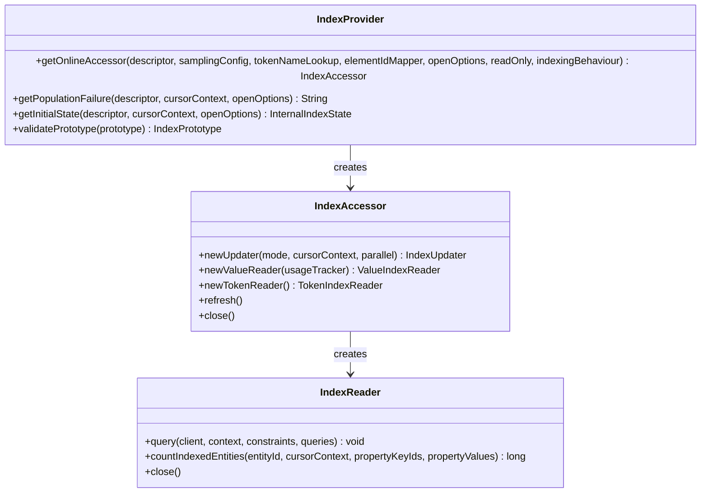

**Diagram sources**
- [IndexProvider.java](file://community\kernel-api\src\main\java\org\neo4j\kernel\api\index\IndexProvider.java#L390-L422)
- [IndexAccessor.java](file://community\kernel-api\src\main\java\org\neo4j\kernel\api\index\IndexAccessor.java#L82-L109)
- [PointIndexReader.java](file://community\kernel\src\main\java\org\neo4j\kernel\impl\index\schema\PointIndexReader.java#L31-L88)

**Section sources**
- [IndexProvider.java](file://community\kernel-api\src\main\java\org\neo4j\kernel\api\index\IndexProvider.java#L390-L422)
- [IndexAccessor.java](file://community\kernel-api\src\main\java\org\neo4j\kernel\api\index\IndexAccessor.java#L82-L109)
- [PointIndexReader.java](file://community\kernel\src\main\java\org\neo4j\kernel\impl\index\schema\PointIndexReader.java#L31-L88)

## Generalized B+ Tree (GBPTree) Implementation

The Generalized B+ Tree (GBPTree) is Neo4j's primary indexing structure for exact match queries and range queries. It provides a balanced tree structure that ensures logarithmic time complexity for insertions, deletions, and lookups. The GBPTree implementation is optimized for disk-based storage with efficient page management and caching strategies.

The GBPTree structure consists of internal nodes and leaf nodes, with keys stored in sorted order. Internal nodes contain keys that act as separators for the ranges in child nodes, while leaf nodes contain the actual data entries. The tree maintains balance through node splitting and merging operations during insertions and deletions. Each node is designed to fit within a single page of the underlying storage system to minimize I/O operations.

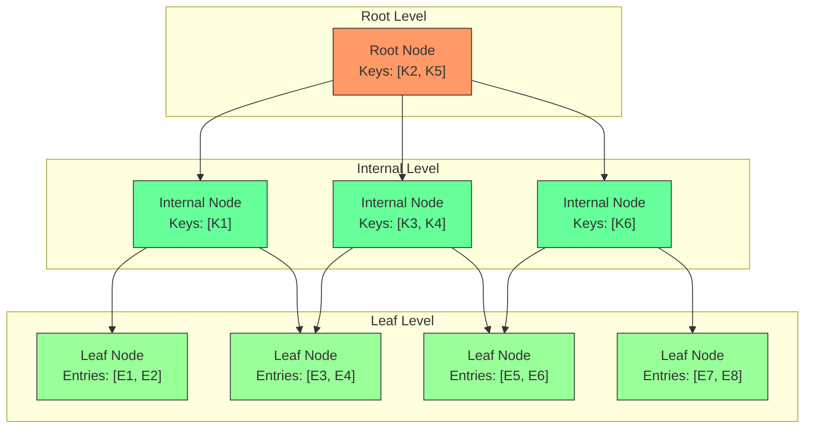

The GBPTree implementation includes several optimization techniques to improve performance and reduce write amplification. These include lazy node splitting, batched updates, and background compaction. The tree structure supports concurrent read and write operations through careful latch management and versioning. The implementation also includes recovery mechanisms to handle crashes and ensure data consistency.

**Diagram sources**
- [GBPTree.java](file://community\index\src\main\java\org\neo4j\index\internal\gbptree\GBPTree.java)
- [GBPTreeStructure.java](file://community\index\src\main\java\org\neo4j\index\internal\gbptree\GBPTreeStructure.java#L245-L356)
- [SeekCursor.java](file://community\index\src\main\java\org\neo4j\index\internal\gbptree\SeekCursor.java#L49-L696)

**Section sources**
- [GBPTree.java](file://community\index\src\main\java\org\neo4j\index\internal\gbptree\GBPTree.java)
- [GBPTreeStructure.java](file://community\index\src\main\java\org\neo4j\index\internal\gbptree\GBPTreeStructure.java#L245-L356)
- [SeekCursor.java](file://community\index\src\main\java\org\neo4j\index\internal\gbptree\SeekCursor.java#L49-L696)

## Apache Lucene Integration for Full-Text Search

Neo4j integrates Apache Lucene to provide full-text search capabilities through specialized index providers. The Lucene integration enables complex text queries including term matching, phrase search, wildcard queries, and fuzzy matching. This integration is implemented through a layered architecture that bridges Neo4j's native storage format with Lucene's inverted index structure.

The full-text indexing system consists of several components that work together to provide efficient text search capabilities. The FulltextIndexProvider manages the lifecycle of full-text indexes, while the FulltextIndexAccessor handles online operations and updates. The FulltextIndexReader provides the query interface, translating Cypher text queries into Lucene queries and processing the results.

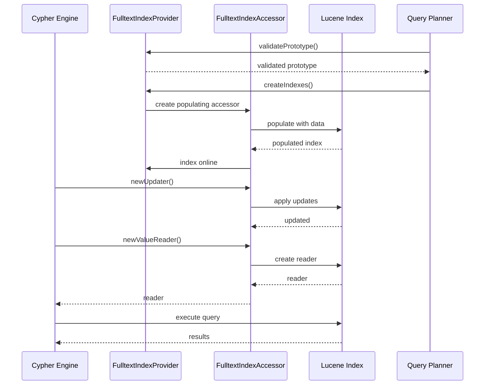

**Diagram sources**
- [FulltextIndexProvider.java](file://community\fulltext-index\src\main\java\org\neo4j\kernel\api\impl\fulltext\FulltextIndexProvider.java#L111-L332)
- [FulltextIndexAccessor.java](file://community\fulltext-index\src\main\java\org\neo4j\kernel\api\impl\fulltext\FulltextIndexAccessor.java#L31-L84)
- [FulltextIndexReader.java](file://community\fulltext-index\src\main\java\org\neo4j\kernel\api\impl\fulltext\FulltextIndexReader.java#L84-L225)

**Section sources**
- [FulltextIndexProvider.java](file://community\fulltext-index\src\main\java\org\neo4j\kernel\api\impl\fulltext\FulltextIndexProvider.java#L111-L332)
- [FulltextIndexAccessor.java](file://community\fulltext-index\src\main\java\org\neo4j\kernel\api\impl\fulltext\FulltextIndexAccessor.java#L31-L84)
- [FulltextIndexReader.java](file://community\fulltext-index\src\main\java\org\neo4j\kernel\api\impl\fulltext\FulltextIndexReader.java#L84-L225)

## Specialized Indexes for Spatial and Vector Data

Neo4j provides specialized indexing strategies for spatial and vector data types, enabling efficient querying of geometric objects and similarity searches on high-dimensional vectors. These specialized indexes are implemented as extensions of the core indexing framework, with custom index providers and data structures optimized for their specific use cases.

For spatial data, Neo4j uses a space-filling curve approach to map multi-dimensional geometric data to a one-dimensional space that can be efficiently indexed using the GBPTree structure. The PointIndexProvider manages spatial indexes, converting geometric coordinates into space-filling curve values that preserve spatial locality. This approach enables efficient range queries and bounding box searches on point data.

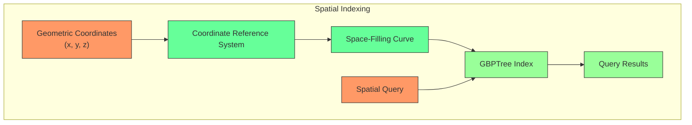

For vector data, Neo4j integrates with Lucene's vector search capabilities to support similarity queries using distance metrics such as Euclidean distance and cosine similarity. The VectorIndexProvider manages vector indexes, storing high-dimensional vectors in a format optimized for similarity searches. The implementation supports configurable similarity functions and indexing parameters to balance query performance and accuracy.

**Diagram sources**
- [PointIndexProvider.java](file://community\kernel\src\main\java\org\neo4j\kernel\impl\index\schema\PointIndexProvider.java#L53-L231)
- [SpatialIndexConfig.java](file://community\kernel\src\main\java\org\neo4j\kernel\impl\index\schema\SpatialIndexConfig.java#L31-L107)
- [VectorIndexProcedures.java](file://community\procedure\src\main\java\org\neo4j\procedure\builtin\VectorIndexProcedures.java#L60-L295)

**Section sources**
- [PointIndexProvider.java](file://community\kernel\src\main\java\org\neo4j\kernel\impl\index\schema\PointIndexProvider.java#L53-L231)
- [SpatialIndexConfig.java](file://community\kernel\src\main\java\org\neo4j\kernel\impl\index\schema\SpatialIndexConfig.java#L31-L107)
- [VectorIndexProcedures.java](file://community\procedure\src\main\java\org\neo4j\procedure\builtin\VectorIndexProcedures.java#L60-L295)

## Index Provider and Storage Engine Integration

The integration between index providers and the storage engine is a critical aspect of Neo4j's indexing system, enabling seamless coordination between data modifications and index updates. This integration is managed through the IndexingService, which acts as a bridge between the storage engine's transaction processing and the various index providers.

The storage engine generates index update events for each data modification, which are then processed by the IndexingService. The service routes these updates to the appropriate index providers based on the affected properties and index configurations. This decoupled design allows the storage engine to remain agnostic of specific indexing implementations while ensuring that all indexes are consistently updated.

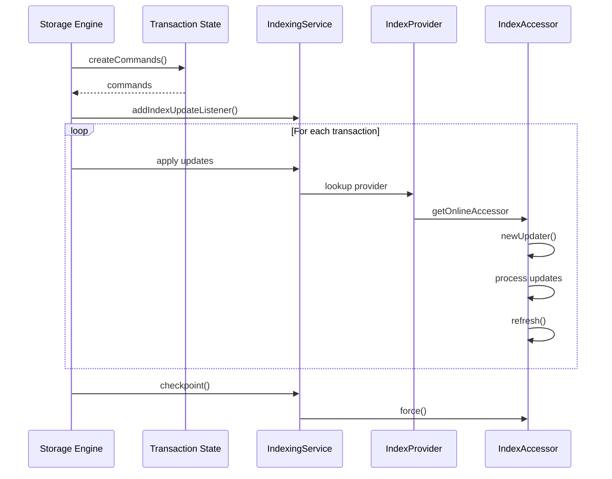

**Diagram sources**
- [IndexingService.java](file://community\kernel\src\main\java\org\neo4j\kernel\impl\api\index\IndexingService.java#L615-L647)
- [StorageEngine.java](file://community\kernel-api\src\main\java\org\neo4j\storageengine\api\StorageEngine.java#L60-L103)
- [RecordStorageEngine.java](file://community\record-storage-engine\src\main\java\org\neo4j\internal\recordstorage\RecordStorageEngine.java#L486-L512)

**Section sources**
- [IndexingService.java](file://community\kernel\src\main\java\org\neo4j\kernel\impl\api\index\IndexingService.java#L615-L647)
- [StorageEngine.java](file://community\kernel-api\src\main\java\org\neo4j\storageengine\api\StorageEngine.java#L60-L103)
- [RecordStorageEngine.java](file://community\record-storage-engine\src\main\java\org\neo4j\internal\recordstorage\RecordStorageEngine.java#L486-L512)

## Index Lifecycle Management

The lifecycle management of indexes in Neo4j involves several phases from creation to deletion, with careful coordination between online and offline operations. The system supports both synchronous and asynchronous index creation, allowing for background population of large indexes without blocking database operations.

Index creation begins with the validation of the index prototype, ensuring that the requested index type and configuration are supported by the available index providers. Once validated, the index enters the population phase where existing data is scanned and indexed. This process is managed by the IndexingService, which coordinates the creation of multiple indexes simultaneously to optimize resource utilization.

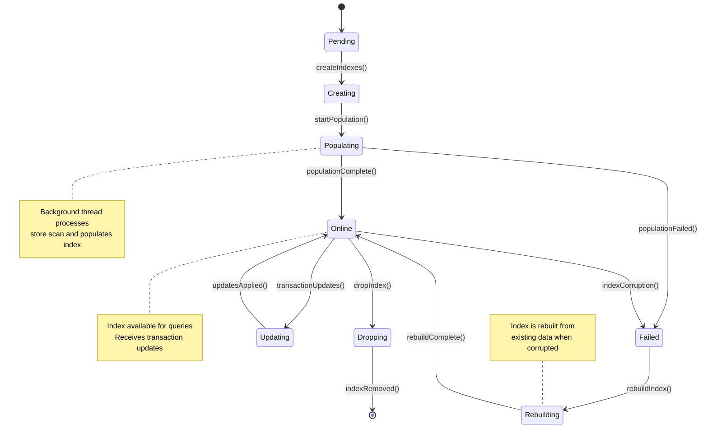

Index maintenance operations such as rebuilding and resampling are performed through dedicated procedures that can be scheduled or triggered manually. The system includes mechanisms for background index sampling to maintain statistics used by the query planner. These operations are designed to minimize impact on database performance while ensuring index quality and query optimization accuracy.

**Diagram sources**
- [IndexingService.java](file://community\kernel\src\main\java\org\neo4j\kernel\impl\api\index\IndexingService.java#L615-L647)
- [IndexSamplingController.java](file://community\kernel\src\main\java\org\neo4j\kernel\impl\api\index\sampling\IndexSamplingController.java#L222-L256)
- [BuiltInProcedures.java](file://community\procedure\src\main\java\org\neo4j\procedure\builtin\BuiltInProcedures.java#L172-L234)

**Section sources**
- [IndexingService.java](file://community\kernel\src\main\java\org\neo4j\kernel\impl\api\index\IndexingService.java#L615-L647)
- [IndexSamplingController.java](file://community\kernel\src\main\java\org\neo4j\kernel\impl\api\index\sampling\IndexSamplingController.java#L222-L256)
- [BuiltInProcedures.java](file://community\procedure\src\main\java\org\neo4j\procedure\builtin\BuiltInProcedures.java#L172-L234)

## Query Optimization and Execution

The query optimization process in Neo4j leverages index statistics and capabilities to generate efficient execution plans for Cypher queries. The query planner analyzes the query pattern and available indexes to determine the most efficient access path, considering factors such as selectivity, index type, and query complexity.

Index statistics are collected and maintained by the IndexStatisticsStore, which uses a GBPTree to store counters for index usage, population, and size. These statistics are updated incrementally during transaction processing and checkpointed periodically to ensure durability. The query planner uses this information to estimate the cost of different execution plans and select the optimal strategy.

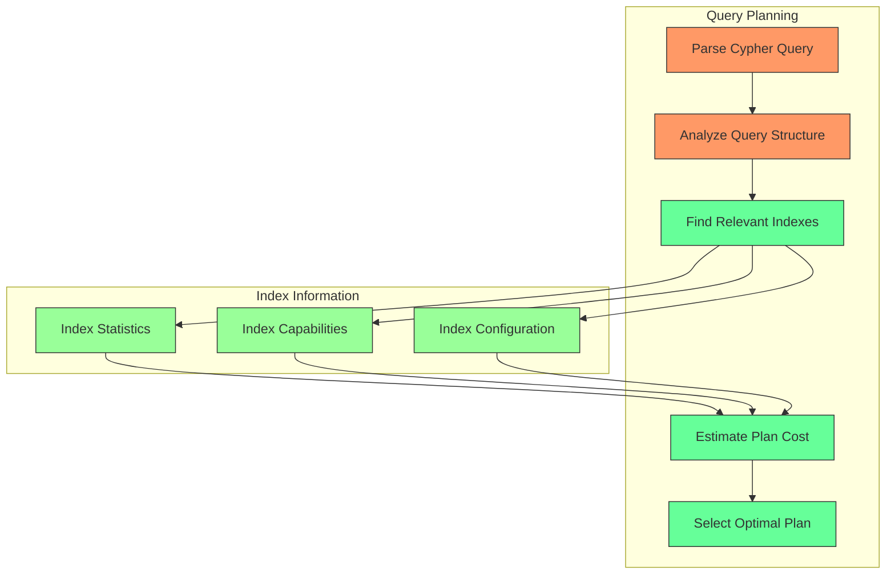

The execution of index-backed queries involves several components working in concert. The IndexReaderCache manages the lifecycle of index readers, ensuring efficient reuse and proper cleanup. The FlippableIndexProxy provides a consistent interface for accessing indexes during the transition from population to online state. The actual query execution is handled by the specific IndexReader implementation, which translates the query into the appropriate operations on the underlying index structure.

**Diagram sources**
- [QueryPlannerConfiguration.scala](file://community\cypher\cypher-planner\src\main\scala\org\neo4j\cypher\internal\compiler\planner\logical\QueryPlannerConfiguration.scala#L95-L127)
- [CompositeExpressionSelectivityCalculator.scala](file://community\cypher\cypher-planner\src\main\scala\org\neo4j\cypher\internal\compiler\planner\logical\cardinality\CompositeExpressionSelectivityCalculator.scala#L248-L325)
- [LogicalPlanProducer.scala](file://community\cypher\cypher-planner\src\main\scala\org\neo4j\cypher\internal\compiler\planner\logical\steps\LogicalPlanProducer.scala#L1539-L1587)

**Section sources**
- [QueryPlannerConfiguration.scala](file://community\cypher\cypher-planner\src\main\scala\org\neo4j\cypher\internal\compiler\planner\logical\QueryPlannerConfiguration.scala#L95-L127)
- [CompositeExpressionSelectivityCalculator.scala](file://community\cypher\cypher-planner\src\main\scala\org\neo4j\cypher\internal\compiler\planner\logical\cardinality\CompositeExpressionSelectivityCalculator.scala#L248-L325)
- [LogicalPlanProducer.scala](file://community\cypher\cypher-planner\src\main\scala\org\neo4j\cypher\internal\compiler\planner\logical\steps\LogicalPlanProducer.scala#L1539-L1587)

## Index Configuration and Maintenance

Index configuration in Neo4j is managed through a flexible settings system that allows for fine-tuning of index behavior based on specific use cases. Configuration parameters are defined using the IndexSetting interface, with specific settings available for different index types and providers. These settings can be specified during index creation and are stored as part of the index metadata.

The configuration system supports both global defaults and index-specific overrides, providing flexibility in managing index behavior across different workloads. For spatial indexes, configuration includes parameters for coordinate reference systems and spatial extents. For vector indexes, configuration includes parameters for dimensionality, similarity functions, and indexing algorithms. Full-text indexes support configuration of analyzers, tokenization rules, and relevance scoring.

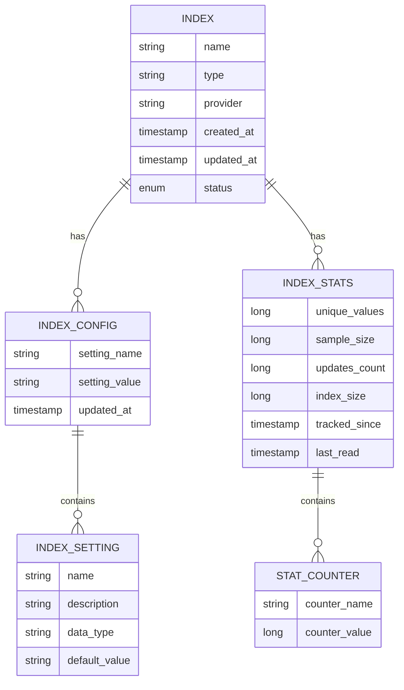

Index maintenance operations are designed to ensure optimal performance and data consistency over time. The system includes automated background tasks for index sampling, statistics collection, and compaction. Manual maintenance operations can be performed through administrative procedures, including index rebuilding, resampling, and consistency checking. These operations are implemented to minimize impact on database availability and performance.

**Diagram sources**
- [IndexSetting.java](file://community\graphdb-api\src\main\java\org\neo4j\graphdb\schema\IndexSetting.java#L104-L173)
- [IndexSettingUtil.java](file://community\kernel\src\main\java\org\neo4j\graphdb\schema\IndexSettingUtil.java#L85-L146)
- [IndexStatisticsStore.java](file://community\storage-engine-util\src\main\java\org\neo4j\kernel\impl\api\index\stats\IndexStatisticsStore.java#L56-L251)

**Section sources**
- [IndexSetting.java](file://community\graphdb-api\src\main\java\org\neo4j\graphdb\schema\IndexSetting.java#L104-L173)
- [IndexSettingUtil.java](file://community\kernel\src\main\java\org\neo4j\graphdb\schema\IndexSettingUtil.java#L85-L146)
- [IndexStatisticsStore.java](file://community\storage-engine-util\src\main\java\org\neo4j\kernel\impl\api\index\stats\IndexStatisticsStore.java#L56-L251)

## Concurrency and Consistency

The Neo4j indexing system implements sophisticated concurrency control mechanisms to ensure data consistency while supporting high levels of parallelism. The system uses a combination of latching, versioning, and optimistic concurrency control to manage concurrent access to index structures.

For the GBPTree implementation, concurrency is managed through a hierarchical latching strategy that minimizes contention while ensuring structural integrity. Node-level latches are acquired during tree traversal, with careful attention to latch ordering to prevent deadlocks. The implementation supports lock-free reads in many scenarios, allowing for high-performance query processing even under heavy write loads.

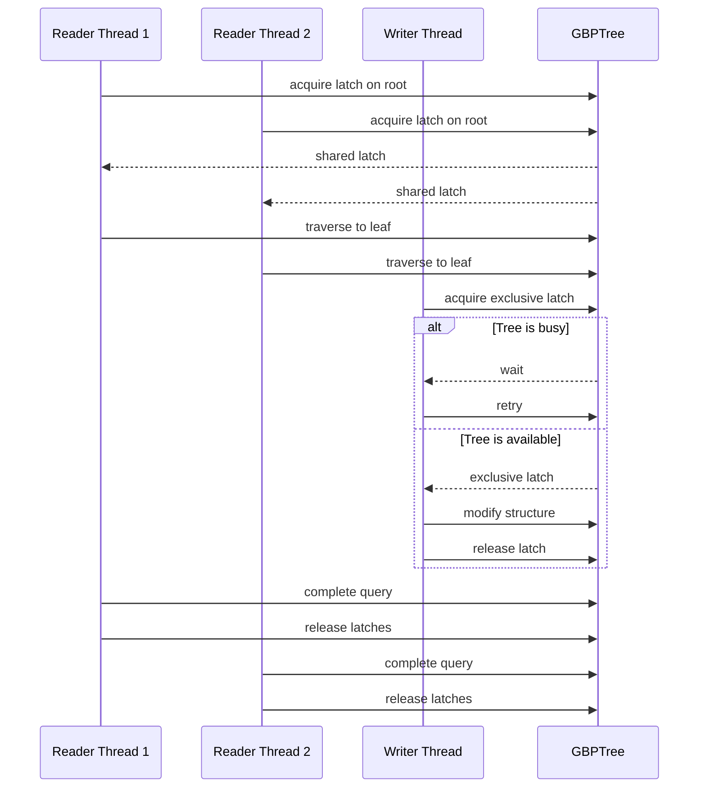

Consistency is maintained through a combination of write-ahead logging, checkpointing, and recovery mechanisms. Index updates are coordinated with the storage engine's transaction processing to ensure atomicity and durability. The system includes background cleanup tasks that resolve any inconsistencies that may arise from crashes or abnormal shutdowns. Eventually consistent index updates are supported for high-write scenarios, with mechanisms to ensure eventual convergence to a consistent state.

**Diagram sources**
- [TreeWriterCoordination.java](file://community\index\src\main\java\org\neo4j\index\internal\gbptree\TreeWriterCoordination.java#L91-L139)
- [InternalNodeFixedSize.java](file://community\index\src\main\java\org\neo4j\index\internal\gbptree\InternalNodeFixedSize.java#L209-L246)
- [GroupingRecoveryCleanupWorkCollector.java](file://community\index\src\main\java\org\neo4j\index\internal\gbptree\GroupingRecoveryCleanupWorkCollector.java#L61-L101)

**Section sources**
- [TreeWriterCoordination.java](file://community\index\src\main\java\org\neo4j\index\internal\gbptree\TreeWriterCoordination.java#L91-L139)
- [InternalNodeFixedSize.java](file://community\index\src\main\java\org\neo4j\index\internal\gbptree\InternalNodeFixedSize.java#L209-L246)
- [GroupingRecoveryCleanupWorkCollector.java](file://community\index\src\main\java\org\neo4j\index\internal\gbptree\GroupingRecoveryCleanupWorkCollector.java#L61-L101)

## Performance Considerations

The performance of Neo4j's indexing system is influenced by several factors, including index type, data distribution, query patterns, and system configuration. The system includes various optimization techniques to maximize performance while minimizing resource consumption.

For GBPTree-based indexes, performance is affected by tree depth, node fill factor, and cache efficiency. The implementation uses variable node sizes and adaptive splitting strategies to maintain optimal tree balance. Page caching is leveraged to reduce disk I/O, with careful management of cache eviction policies to prioritize frequently accessed index nodes.

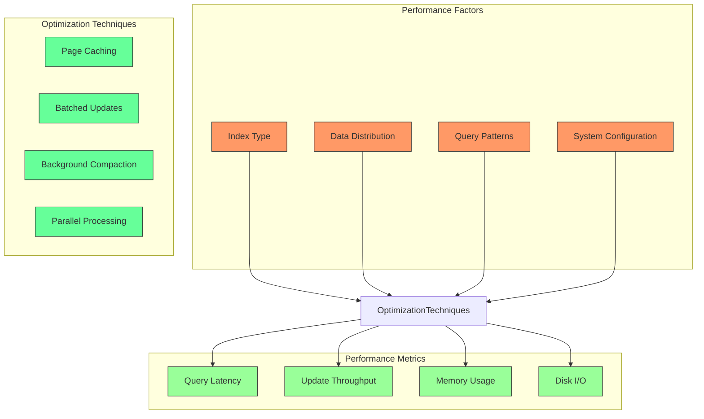

Write amplification is minimized through techniques such as lazy node splitting, batched updates, and background compaction. The system also includes mechanisms for monitoring and controlling index fragmentation, with automatic defragmentation during maintenance operations. For high-write workloads, eventually consistent index updates can be used to improve throughput at the cost of temporary staleness.

**Diagram sources**
- [NativeIndexPopulator.java](file://community\kernel\src\main\java\org\neo4j\kernel\impl\index\schema\NativeIndexPopulator.java#L63-L99)
- [BlockBasedIndexPopulator.java](file://community\kernel\src\main\java\org\neo4j\kernel\impl\index\schema\BlockBasedIndexPopulator.java#L292-L321)
- [IndexStatisticsStore.java](file://community\storage-engine-util\src\main\java\org\neo4j\kernel\impl\api\index\stats\IndexStatisticsStore.java#L78-L298)

**Section sources**
- [NativeIndexPopulator.java](file://community\kernel\src\main\java\org\neo4j\kernel\impl\index\schema\NativeIndexPopulator.java#L63-L99)
- [BlockBasedIndexPopulator.java](file://community\kernel\src\main\java\org\neo4j\kernel\impl\index\schema\BlockBasedIndexPopulator.java#L292-L321)
- [IndexStatisticsStore.java](file://community\storage-engine-util\src\main\java\org\neo4j\kernel\impl\api\index\stats\IndexStatisticsStore.java#L78-L298)

## Troubleshooting Guide

Common issues with Neo4j indexes typically fall into several categories: performance problems, consistency errors, configuration issues, and operational failures. This section provides guidance on diagnosing and resolving these issues.

Performance issues often manifest as slow query response times or high resource utilization. These can be diagnosed using the database's built-in monitoring tools, which provide metrics on index usage, query latency, and system resource consumption. The IndexStatisticsStore contains detailed statistics that can help identify underperforming indexes or suboptimal query plans.

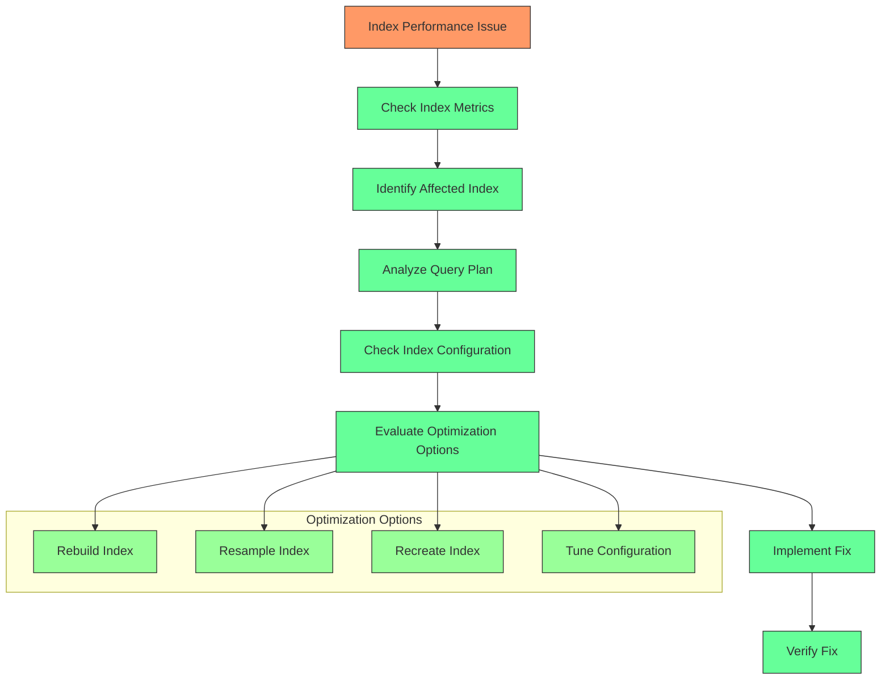

Consistency issues may occur due to crashes, hardware failures, or software bugs. The system includes built-in consistency checking tools that can verify the integrity of indexes and repair any detected issues. Regular maintenance operations such as index resampling and statistics collection help prevent consistency problems from developing over time.

**Diagram sources**
- [IndexingService.java](file://community\kernel\src\main\java\org\neo4j\kernel\impl\api\index\IndexingService.java#L410-L436)
- [ConsistencyCheckService.java](file://community\consistency-check\src\main\java\org\neo4j\consistency\ConsistencyCheckService.java#L561-L592)
- [DataCollectorProcedures.java](file://community\data-collector\src\main\java\org\neo4j\internal\collector\DataCollectorProcedures.java#L143-L172)

**Section sources**
- [IndexingService.java](file://community\kernel\src\main\java\org\neo4j\kernel\impl\api\index\IndexingService.java#L410-L436)
- [ConsistencyCheckService.java](file://community\consistency-check\src\main\java\org\neo4j\consistency\ConsistencyCheckService.java#L561-L592)
- [DataCollectorProcedures.java](file://community\data-collector\src\main\java\org\neo4j\internal\collector\DataCollectorProcedures.java#L143-L172)

## Conclusion

The Neo4j indexing system provides a comprehensive and flexible framework for efficient data retrieval across diverse data types and query patterns. By integrating multiple indexing technologies including the Generalized B+ Tree, Apache Lucene, and specialized spatial and vector indexes, the system offers optimized performance for a wide range of use cases.

The modular architecture separates concerns between index providers, accessors, and readers, enabling specialized implementations while maintaining a consistent interface. This design allows for continuous improvement of individual components without affecting the overall system stability. The integration with the storage engine and query planner ensures that indexes are consistently updated and effectively utilized for query optimization.

Future developments may focus on enhancing the machine learning capabilities of the query planner, improving the scalability of distributed indexes, and expanding the range of supported data types and query patterns. The system's extensible design positions it well to incorporate these advancements while maintaining backward compatibility and operational stability.