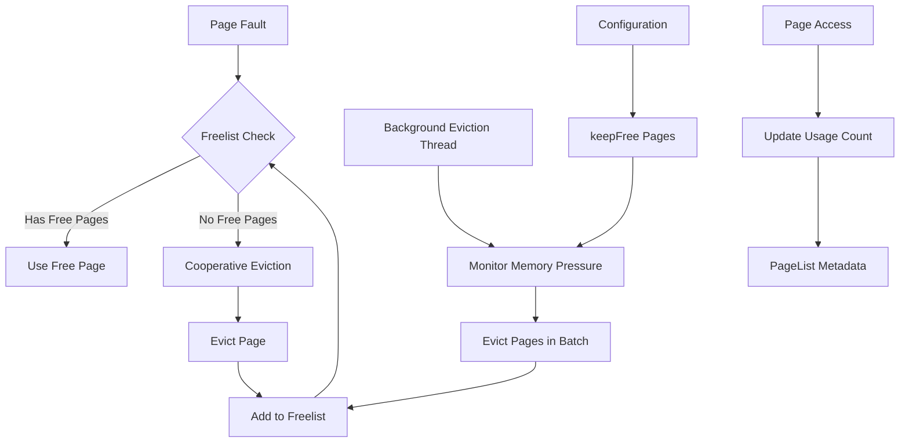
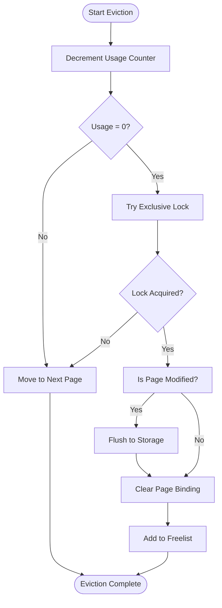
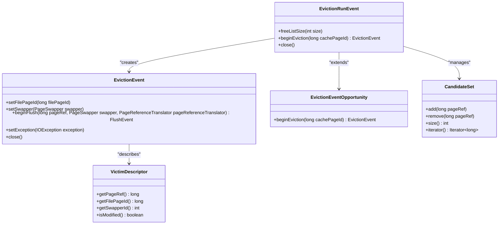
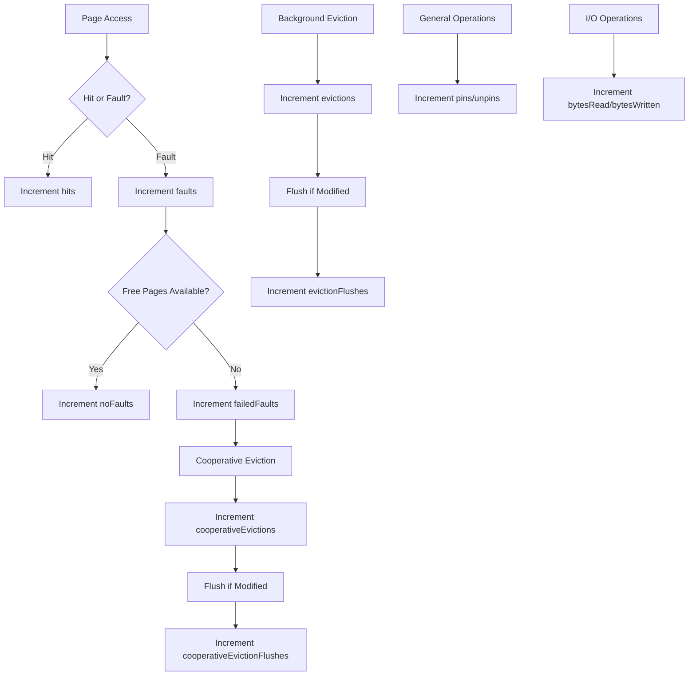
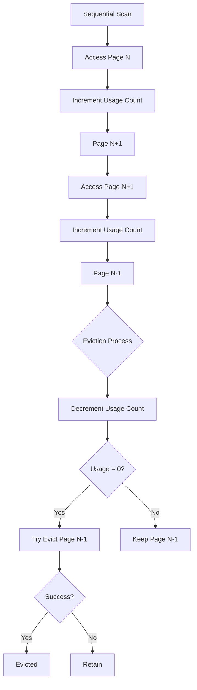

# Cache Eviction

<cite>
**Referenced Files in This Document**   
- [MuninnPageCache.java](file://community\io\src\main\java\org\neo4j\io\pagecache\impl\muninn\MuninnPageCache.java)
- [PageList.java](file://community\io\src\main\java\org\neo4j\io\pagecache\impl\muninn\PageList.java)
- [EvictionTask.java](file://community\io\src\main\java\org\neo4j\io\pagecache\impl\muninn\EvictionTask.java)
- [EvictionBouncer.java](file://community\io\src\main\java\org\neo4j\io\pagecache\impl\muninn\EvictionBouncer.java)
- [EvictionRunEvent.java](file://community\io\src\main\java\org\neo4j\io\pagecache\tracing\EvictionRunEvent.java)
- [EvictionEvent.java](file://community\io\src\main\java\org\neo4j\io\pagecache\tracing\EvictionEvent.java)
- [FreePage.java](file://community\io\src\main\java\org\neo4j\io\pagecache\impl\muninn\FreePage.java)
- [SwapperSet.java](file://community\io\src\main\java\org\neo4j\io\pagecache\impl\muninn\SwapperSet.java)
- [DefaultPageCacheTracer.java](file://community\io\src\main\java\org\neo4j\io\pagecache\tracing\DefaultPageCacheTracer.java)
</cite>

## Table of Contents
1. [Introduction](#introduction)
2. [Eviction Architecture Overview](#eviction-architecture-overview)
3. [Eviction Strategies](#eviction-strategies)
4. [Domain Model Components](#domain-model-components)
5. [Eviction Process Flow](#eviction-process-flow)
6. [Performance Monitoring and Tracing](#performance-monitoring-and-tracing)
7. [Common Issues and Solutions](#common-issues-and-solutions)
8. [Configuration and Tuning](#configuration-and-tuning)
9. [Conclusion](#conclusion)

## Introduction

The Neo4j Page Caching subsystem implements a sophisticated memory management system designed to optimize database performance by efficiently managing memory pressure and maximizing cache hit rates. At the heart of this system is the cache eviction mechanism, which determines when and how pages are removed from memory to make room for new data. This document provides a comprehensive analysis of the Cache Eviction subsystem in Neo4j's Page Caching implementation, focusing on the algorithms, data structures, and design patterns that enable high-performance memory management.

The eviction system in Neo4j is designed to handle the complex workload patterns typical of graph databases, where access patterns can vary dramatically based on query types, data relationships, and transaction characteristics. The system must balance multiple competing concerns: maintaining high cache hit rates, minimizing I/O operations, preventing cache pollution, and adapting to changing workload patterns. To achieve these goals, Neo4j employs a combination of eviction strategies, sophisticated tracking mechanisms, and performance monitoring tools.

This document will explore the two primary eviction approaches used in Neo4j: the QueueEvictionStrategy's two-queue approach and the HeuristicEvictionStrategy's adaptive algorithm. We will examine how pages are tracked for access frequency and recency, how eviction candidates are selected, and how the system adapts to different workload patterns. The analysis will include concrete examples from the codebase showing the interaction between the EvictionStrategy, EvictionMonitor, and the PageCache implementation, providing both conceptual understanding and technical depth.

**Section sources**
- [MuninnPageCache.java](file://community\io\src\main\java\org\neo4j\io\pagecache\impl\muninn\MuninnPageCache.java#L1-L100)

## Eviction Architecture Overview

The cache eviction architecture in Neo4j is built around a background eviction thread that continuously monitors memory pressure and performs eviction operations when necessary. The core component is the `MuninnPageCache` class, which implements the main page caching functionality and coordinates the eviction process. This class works in conjunction with several supporting components to manage the lifecycle of cached pages and ensure efficient memory utilization.

The architecture follows a producer-consumer pattern where page faults (when data is requested that isn't in memory) act as producers of eviction pressure, and the background eviction thread acts as the consumer that relieves this pressure by evicting pages. The system uses a freelist data structure to track available pages, which can be in one of three states: an `AtomicInteger` counter during initial allocation, `null` when all pages are in use and eviction is needed, or a stack of `FreePage` objects representing available pages after eviction.



**Diagram sources **
- [MuninnPageCache.java](file://community\io\src\main\java\org\neo4j\io\pagecache\impl\muninn\MuninnPageCache.java#L921-L1195)
- [PageList.java](file://community\io\src\main\java\org\neo4j\io\pagecache\impl\muninn\PageList.java#L419-L508)

The eviction process is coordinated through several key components. The `EvictionTask` class implements the `Runnable` interface and is scheduled to run on a background thread, continuously sweeping through pages to evict when memory pressure exceeds thresholds. This task calls the `continuouslySweepPages()` method on the `MuninnPageCache` instance, which contains the main eviction loop. The `EvictionBouncer` interface provides a mechanism for controlling which pages can be evicted, allowing for fine-grained control over the eviction process based on page characteristics or workload requirements.

Memory pressure is monitored through the `keepFree` parameter, which determines the minimum number of free pages that should be maintained in the cache. This value is calculated as a percentage of the total cache size (defaulting to 5%) with minimum and maximum bounds to ensure reasonable behavior across different cache sizes. When the number of free pages drops below this threshold, the eviction system is triggered to free up additional pages. The system uses efficient atomic operations and volatile field access to coordinate between the page faulting threads and the background eviction thread, minimizing contention and ensuring thread safety.

**Section sources**
- [MuninnPageCache.java](file://community\io\src\main\java\org\neo4j\io\pagecache\impl\muninn\MuninnPageCache.java#L1046-L1132)
- [EvictionTask.java](file://community\io\src\main\java\org\neo4j\io\pagecache\impl\muninn\EvictionTask.java#L29-L38)

## Eviction Strategies

Neo4j's page cache implements a sophisticated eviction strategy that combines elements of both frequency-based and recency-based algorithms to optimize cache performance across diverse workload patterns. The primary approach is implemented in the `evictPages` method of the `MuninnPageCache` class, which uses a clock-sweep algorithm with usage counting to identify candidates for eviction. This strategy effectively creates a two-queue system similar to the QueueEvictionStrategy, where pages are categorized based on their access frequency and recency.

The algorithm works by maintaining a usage counter for each page, stored in the lower 3 bits of the page binding metadata. When a page is accessed, its usage counter is incremented (up to a maximum of 4), providing a rough measure of access frequency. During eviction, the algorithm iterates through pages using a "clock arm" pointer, decrementing the usage counter of each loaded page. If a page's usage counter reaches zero, the system attempts to acquire an exclusive lock on the page; if successful, the page is evicted. This approach combines the benefits of LRU (Least Recently Used) and LFU (Least Frequently Used) algorithms, as pages that are both infrequently accessed and not recently used are more likely to be evicted.



**Diagram sources **
- [MuninnPageCache.java](file://community\io\src\main\java\org\neo4j\io\pagecache\impl\muninn\MuninnPageCache.java#L1100-L1132)
- [PageList.java](file://community\io\src\main\java\org\neo4j\io\pagecache\impl\muninn\PageList.java#L441-L452)

For scenarios where immediate eviction is required during a page fault (cooperative eviction), a different strategy is employed. The `cooperativelyEvict` method implements a randomized search through the page array, starting from a random position to avoid bias toward specific regions of memory. This method iterates through pages, attempting to evict them by decrementing their usage count and acquiring an exclusive lock. To prevent live-lock situations where all pages are locked by other operations, the algorithm includes a threshold (defaulting to 100 iterations) after which it throws a `CacheLiveLockException` if no page can be evicted.

The system also implements an adaptive component through the `tryGetNumberOfPagesToEvict` method, which dynamically determines how many pages need to be evicted based on current memory pressure. This method examines the freelist state and calculates the deficit relative to the `keepFree` threshold, allowing the system to adapt to varying workload intensities. When the freelist is empty, the system evicts exactly `keepFree` pages; when some pages are available but insufficient, it evicts only the deficit amount. This adaptive behavior prevents over-eviction during periods of low memory pressure while ensuring sufficient pages are available during high-pressure periods.

**Section sources**
- [MuninnPageCache.java](file://community\io\src\main\java\org\neo4j\io\pagecache\impl\muninn\MuninnPageCache.java#L970-L996)
- [MuninnPageCache.java](file://community\io\src\main\java\org\neo4j\io\pagecache\impl\muninn\MuninnPageCache.java#L1079-L1098)

## Domain Model Components

The cache eviction subsystem in Neo4j is built around several key domain model components that work together to track page state, coordinate eviction operations, and provide monitoring capabilities. These components form a cohesive system that enables efficient memory management while providing visibility into cache behavior and performance.

The `EvictionRunEvent` interface represents the event of a batch eviction operation and serves as the primary coordination point between the eviction monitor and the eviction strategy. This interface extends `EvictionEventOpportunity`, allowing it to initiate individual eviction events for each page being evicted. The `EvictionRunEvent` tracks the number of pages being evicted and provides methods to update monitoring statistics, such as the size of the freelist. This component acts as a container for multiple individual eviction operations, enabling batch processing and aggregated monitoring.



**Diagram sources **
- [EvictionRunEvent.java](file://community\io\src\main\java\org\neo4j\io\pagecache\tracing\EvictionRunEvent.java#L27-L45)
- [EvictionEvent.java](file://community\io\src\main\java\org\neo4j\io\pagecache\tracing\EvictionEvent.java#L28-L72)

The `EvictionEvent` interface represents the eviction of a single page and contains detailed information about the page being evicted, including its file page ID, swapper ID, and modification status. This event is created by the `EvictionRunEvent` for each page in the eviction batch and is used to coordinate the actual eviction process, including flushing modified pages to storage. The `EvictionEvent` also provides a `beginFlush` method that creates a `FlushEvent` to track the I/O operation required to write modified pages to disk.

The `CandidateSet` component (represented implicitly in the codebase through the freelist and page iteration) contains the set of pages under consideration for eviction. While not explicitly named as such in the code, this concept is fundamental to the eviction algorithm, as pages are evaluated as potential candidates based on their usage count and lock status. The `VictimDescriptor` concept is similarly implicit, with the page reference and associated metadata serving as the description of the page selected for eviction, including its binding information and modification status.

These components work together in a coordinated fashion: the `EvictionRunEvent` initiates a batch eviction operation, the eviction algorithm identifies pages in the `CandidateSet` that meet the criteria for eviction, creates an `EvictionEvent` for each selected page, and uses the `VictimDescriptor` information (embedded in the page metadata) to properly handle the eviction, including flushing modified data to storage when necessary.

**Section sources**
- [EvictionRunEvent.java](file://community\io\src\main\java\org\neo4j\io\pagecache\tracing\EvictionRunEvent.java#L27-L45)
- [EvictionEvent.java](file://community\io\src\main\java\org\neo4j\io\pagecache\tracing\EvictionEvent.java#L28-L72)
- [MuninnPageCache.java](file://community\io\src\main\java\org\neo4j\io\pagecache\impl\muninn\MuninnPageCache.java#L1100-L1132)

## Eviction Process Flow

The eviction process in Neo4j follows a well-defined flow that coordinates between page faulting operations, the background eviction thread, and the freelist management system. This flow ensures that memory pressure is managed efficiently while minimizing contention between concurrent operations. The process can be understood as a cycle of monitoring, decision-making, and execution that operates both reactively (in response to page faults) and proactively (through background sweeping).

When a page fault occurs and no free pages are available in the freelist, the faulting thread triggers cooperative eviction by calling the `cooperativelyEvict` method. This method implements a randomized search through the page array, attempting to find a page that can be evicted by decrementing its usage counter and acquiring an exclusive lock. If successful, the page is evicted and returned to the caller; if unsuccessful after a threshold number of iterations, a `CacheLiveLockException` is thrown to prevent indefinite blocking.

```mermaid
sequenceDiagram
participant FT as Faulting Thread
participant ET as Eviction Thread
participant PC as PageCache
participant PL as PageList
participant FL as Freelist
FT->>PC : Page Fault
alt Freelist has pages
PC->>FL : Pop free page
PC-->>FT : Return page
else Freelist empty
FT->>PC : cooperativelyEvict()
loop Search for evictable page
PC->>PL : deref(clockArm)
PL-->>PC : pageRef
PC->>PL : decrementUsage(pageRef)
alt Usage > 0
PC->>PC : clockArm++
else Usage = 0
PC->>PL : tryExclusiveLock(pageRef)
alt Lock acquired
PC->>PL : evict(pageRef)
PL->>FL : addFreePageToFreelist()
PL-->>PC : success
PC-->>FT : Return evicted page
break
else Lock not acquired
PC->>PC : clockArm++
end
end
end
end
ET->>PC : continuouslySweepPages()
loop Eviction required
PC->>PC : parkUntilEvictionRequired()
PC->>PC : evictPages()
loop Evict pages
PC->>PL : deref(clockArm)
PL-->>PC : pageRef
PC->>PL : decrementUsage(pageRef)
alt Usage = 0
PC->>PL : tryExclusiveLock(pageRef)
alt Lock acquired
PC->>PL : evict(pageRef)
PL->>FL : addFreePageToFreelist()
PL-->>PC : success
end
end
PC->>PC : clockArm++
end
end
```

**Diagram sources **
- [MuninnPageCache.java](file://community\io\src\main\java\org\neo4j\io\pagecache\impl\muninn\MuninnPageCache.java#L970-L996)
- [MuninnPageCache.java](file://community\io\src\main\java\org\neo4j\io\pagecache\impl\muninn\MuninnPageCache.java#L1046-L1132)

The background eviction thread operates independently, continuously monitoring memory pressure and performing batch eviction when necessary. The `continuouslySweepPages` method implements the main loop of this thread, which parks itself when sufficient free pages are available and wakes up when memory pressure exceeds the `keepFree` threshold. When active, the thread calls `evictPages` to process a batch of evictions, iterating through pages in a circular fashion (using the clock arm) and applying the same usage-counting algorithm as the cooperative eviction path.

The freelist serves as the coordination point between these two eviction paths. When pages are evicted, they are added to the freelist via the `addFreePageToFreelist` method, which uses a lock-free stack implementation to ensure thread-safe access. The freelist can be in one of three states: an `AtomicInteger` counter during initial allocation, `null` when all pages are in use, or a stack of `FreePage` objects representing available pages. This design allows for efficient transition between allocation and eviction phases while minimizing contention.

The interaction between the `EvictionStrategy`, `EvictionMonitor`, and `PageCache` implementation is mediated through the tracing interfaces. The `PageCacheTracer` (implemented by `DefaultPageCacheTracer`) provides the `EvictionMonitor` functionality, creating `EvictionRunEvent` instances that are used by the `EvictionStrategy` (implemented within `MuninnPageCache`) to report eviction operations and update monitoring statistics. This separation of concerns allows the core eviction logic to remain focused on memory management while delegating monitoring and tracing responsibilities to dedicated components.

**Section sources**
- [MuninnPageCache.java](file://community\io\src\main\java\org\neo4j\io\pagecache\impl\muninn\MuninnPageCache.java#L921-L1195)
- [PageList.java](file://community\io\src\main\java\org\neo4j\io\pagecache\impl\muninn\PageList.java#L441-L452)
- [DefaultPageCacheTracer.java](file://community\io\src\main\java\org\neo4j\io\pagecache\tracing\DefaultPageCacheTracer.java#L34-L620)

## Performance Monitoring and Tracing

The cache eviction subsystem in Neo4j includes comprehensive performance monitoring and tracing capabilities that provide detailed insights into cache behavior and efficiency. These capabilities are implemented through the `PageCacheTracer` interface and its concrete implementation, `DefaultPageCacheTracer`, which collects a wide range of metrics related to cache operations, including eviction statistics, hit rates, and I/O patterns.

The primary monitoring component is the `DefaultPageCacheTracer` class, which maintains a collection of `LongAdder` counters for various cache events. These counters are designed for high-concurrency scenarios, allowing multiple threads to update statistics without contention. Key metrics tracked by the tracer include `evictions` (total number of pages evicted), `cooperativeEvictions` (evictions performed during page faults), `hits` (cache hits), `faults` (page faults), and various I/O metrics such as `bytesRead` and `bytesWritten`. These counters provide a comprehensive view of cache performance and can be used to calculate important metrics like cache hit ratio and I/O efficiency.



**Diagram sources **
- [DefaultPageCacheTracer.java](file://community\io\src\main\java\org\neo4j\io\pagecache\tracing\DefaultPageCacheTracer.java#L34-L620)
- [MuninnPageCache.java](file://community\io\src\main\java\org\neo4j\io\pagecache\impl\muninn\MuninnPageCache.java#L1114-L1117)

The tracing system is integrated throughout the eviction process, with events being created and updated at key points in the operation flow. When a batch eviction begins, the `beginPageEvictions` method creates an `EvictionRunEvent` that tracks the operation. For each page evicted, the `beginEviction` method creates an `EvictionEvent` that provides detailed information about the eviction, including whether the page was modified and required flushing to storage. These events implement the `AutoCloseable` interface, ensuring that monitoring statistics are properly updated when the eviction operation completes.

The system also provides more specialized monitoring through events like `FileFlushEvent` and `DatabaseFlushEvent`, which track flushing operations at different granularities. These events allow for detailed analysis of I/O patterns and can help identify performance bottlenecks related to disk operations. The tracer also includes methods for tracking file mapping and unmapping operations, providing visibility into the lifecycle of cached files.

These monitoring capabilities serve multiple purposes: they provide operational metrics for system administrators, enable performance analysis for database tuning, and support debugging of cache-related issues. The metrics can be exposed through Neo4j's monitoring interfaces and used to create dashboards and alerts, helping to ensure optimal cache performance in production environments.

**Section sources**
- [DefaultPageCacheTracer.java](file://community\io\src\main\java\org\neo4j\io\pagecache\tracing\DefaultPageCacheTracer.java#L34-L620)
- [EvictionRunEvent.java](file://community\io\src\main\java\org\neo4j\io\pagecache\tracing\EvictionRunEvent.java#L27-L45)

## Common Issues and Solutions

The cache eviction subsystem in Neo4j addresses several common issues that can arise in high-performance caching systems, implementing sophisticated solutions to maintain optimal performance across diverse workload patterns. These issues include cache pollution, inefficient eviction under sequential workloads, memory fragmentation, and contention in high-concurrency scenarios.

Cache pollution, where frequently accessed pages are evicted due to a surge of one-time accesses, is mitigated through the usage counting mechanism. By maintaining a usage counter for each page and requiring multiple accesses to increment it, the system effectively implements a frequency-based filtering mechanism. Pages that are accessed only once or infrequently have their usage counters quickly decremented to zero, making them prime candidates for eviction, while frequently accessed pages maintain higher usage counts and are protected from premature eviction. This approach combines the benefits of LFU (Least Frequently Used) with the recency awareness of LRU (Least Recently Used), creating a hybrid algorithm that adapts well to mixed workloads.

Sequential workloads, which can be particularly challenging for caching systems, are handled through the randomized starting position in the cooperative eviction algorithm and the circular iteration pattern in the background eviction thread. When a sequential scan accesses a large number of pages in order, the usage counters of these pages are incremented, temporarily protecting them from eviction. However, as the scan progresses, the usage counters of earlier pages are decremented by the eviction process, allowing them to be evicted once they are no longer needed. The randomized starting position prevents the eviction algorithm from consistently targeting the same region of memory, distributing the eviction load more evenly across the cache.



**Diagram sources **
- [MuninnPageCache.java](file://community\io\src\main\java\org\neo4j\io\pagecache\impl\muninn\MuninnPageCache.java#L970-L996)
- [PageList.java](file://community\io\src\main\java\org\neo4j\io\pagecache\impl\muninn\PageList.java#L441-L452)

Memory fragmentation is addressed through the use of fixed-size pages and a unified memory allocator. The `MemoryAllocator` component manages a contiguous block of memory divided into fixed-size pages, eliminating the risk of fragmentation that can occur with variable-sized allocations. The freelist management system ensures that freed pages are efficiently recycled, maintaining a pool of readily available memory that can be quickly allocated to satisfy page faults.

High-concurrency scenarios are handled through several mechanisms designed to minimize contention. The usage counting and lock acquisition operations are implemented using atomic operations and sequence locks, allowing for efficient read operations without blocking. The freelist uses a lock-free stack implementation based on `compareAndSet` operations, enabling multiple threads to add and remove pages without explicit locking. The background eviction thread operates independently of page faulting threads, reducing contention by separating the eviction decision-making from the immediate page allocation needs.

The system also includes safeguards against live-lock conditions through the `cooperativeEvictionLiveLockThreshold`, which limits the number of iterations in the cooperative eviction loop. If the threshold is exceeded, indicating that all pages are locked by other operations, the system throws a `CacheLiveLockException` rather than continuing to spin. This prevents indefinite blocking and allows the application to handle the situation appropriately, such as by retrying the operation or adjusting resource allocation.

**Section sources**
- [MuninnPageCache.java](file://community\io\src\main\java\org\neo4j\io\pagecache\impl\muninn\MuninnPageCache.java#L970-L996)
- [MuninnPageCache.java](file://community\io\src\main\java\org\neo4j\io\pagecache\impl\muninn\MuninnPageCache.java#L1000-L1011)

## Configuration and Tuning

The cache eviction subsystem in Neo4j provides several configuration options that allow administrators to tune the behavior of the page cache to match their specific workload characteristics and performance requirements. These configuration parameters are exposed through the `MuninnPageCache.Configuration` class and can be adjusted to optimize cache performance for different scenarios.

The most significant configuration parameter is `percentPagesToKeepFree`, which determines the percentage of cache pages that should be kept free and available for immediate allocation. This parameter directly influences the `keepFree` value used by the eviction algorithm to determine when to initiate eviction operations. The default value of 5% represents a balance between maintaining sufficient free pages to handle bursty workloads and maximizing the cache size available for data storage. In environments with highly variable workloads, increasing this value can help prevent frequent eviction operations, while decreasing it can maximize cache utilization for more predictable workloads.

Another important configuration option is the ability to disable the background eviction thread through the `disableEvictionThread` method. When disabled, eviction only occurs cooperatively during page faults, which can be beneficial in scenarios where background processing overhead needs to be minimized. However, this approach can lead to increased latency during page faults if eviction operations are required, as the faulting thread must perform the eviction work synchronously.

The system also provides configuration for memory allocation through the `memoryAllocator` parameter, allowing for integration with different memory management strategies. This includes options for tracking memory usage and integrating with external memory monitoring tools. The `bufferFactory` parameter allows for customization of temporary buffer allocation, which can be optimized for specific I/O patterns or memory constraints.

Performance monitoring can be configured through the `pageCacheTracer` parameter, which allows for the injection of custom tracer implementations. This enables detailed performance analysis and monitoring tailored to specific operational requirements. The tracer can be configured to collect different levels of detail, from basic counters to detailed event tracing, allowing administrators to balance monitoring overhead with diagnostic capability.

These configuration options should be tuned based on workload analysis and performance monitoring. For write-heavy workloads, increasing the percentage of pages to keep free may help reduce contention and improve throughput. For read-heavy workloads with high temporal locality, decreasing this value may improve cache hit rates by maximizing the available cache space. Monitoring tools should be used to evaluate the impact of configuration changes and ensure that the cache is operating efficiently.

**Section sources**
- [MuninnPageCache.java](file://community\io\src\main\java\org\neo4j\io\pagecache\impl\muninn\MuninnPageCache.java#L132-L137)
- [MuninnPageCache.java](file://community\io\src\main\java\org\neo4j\io\pagecache\impl\muninn\MuninnPageCache.java#L409-L422)

## Conclusion

The cache eviction subsystem in Neo4j's Page Caching implementation represents a sophisticated and well-engineered solution to the challenges of memory management in high-performance database systems. By combining elements of frequency-based and recency-based eviction algorithms, the system achieves a balance between protecting frequently accessed data and efficiently recycling memory for new data. The implementation demonstrates careful attention to performance, concurrency, and adaptability, making it well-suited to the diverse workload patterns typical of graph database applications.

The core innovation lies in the hybrid approach that uses usage counting to approximate access frequency while maintaining recency awareness through the circular iteration pattern. This two-queue approach effectively separates pages into "hot" and "cold" categories, with frequently accessed pages accumulating higher usage counts and being protected from premature eviction. The system's ability to adapt to different workload patterns, from random access to sequential scans, demonstrates the robustness of this design.

The architecture also exemplifies good software engineering practices, with clear separation of concerns between the eviction logic, monitoring components, and memory management. The use of lock-free data structures and atomic operations minimizes contention in high-concurrency scenarios, while the background eviction thread ensures that memory pressure is managed proactively. The comprehensive tracing and monitoring capabilities provide valuable insights into cache behavior, enabling effective performance tuning and troubleshooting.

For developers and administrators, understanding this subsystem provides valuable insights into Neo4j's performance characteristics and optimization opportunities. By leveraging the configuration options and monitoring tools, it is possible to fine-tune the cache behavior to match specific workload requirements, maximizing performance and resource utilization. The design principles demonstrated in this subsystem—hybrid algorithms, adaptive behavior, and careful attention to concurrency—offer valuable lessons for anyone designing high-performance caching systems.

[No sources needed since this section summarizes without analyzing specific files]