# I/O Scheduling

<cite>
**Referenced Files in This Document**
- [MuninnPageCache.java](file://community/io/src/main/java/org/neo4j/io/pagecache/impl/muninn/MuninnPageCache.java)
- [MuninnPagedFile.java](file://community/io/src/main/java/org/neo4j/io/pagecache/impl/muninn/MuninnPagedFile.java)
- [PageList.java](file://community/io/src/main/java/org/neo4j/io/pagecache/impl/muninn/PageList.java)
- [SingleFilePageSwapper.java](file://community/io/src/main/java/org/neo4j/io/pagecache/impl/SingleFilePageSwapper.java)
- [IOController.java](file://community/io/src/main/java/org/neo4j/io/pagecache/IOController.java)
- [EmptyIOController.java](file://community/io/src/main/java/org/neo4j/io/pagecache/EmptyIOController.java)
- [PageCacheTracer.java](file://community/io/src/main/java/org/neo4j/io/pagecache/tracing/PageCacheTracer.java)
- [DefaultPageCacheTracer.java](file://community/io/src/main/java/org/neo4j/io/pagecache/tracing/DefaultPageCacheTracer.java)
- [FlushEvent.java](file://community/io/src/main/java/org/neo4j/io/pagecache/tracing/FlushEvent.java)
- [FileFlushEvent.java](file://community/io/src/main/java/org/neo4j/io/pagecache/tracing/FileFlushEvent.java)
- [EvictionRunEvent.java](file://community/io/src/main/java/org/neo4j/io/pagecache/tracing/EvictionRunEvent.java)
- [SwapperSet.java](file://community/io/src/main/java/org/neo4j/io/pagecache/impl/muninn/SwapperSet.java)
- [EvictionBouncer.java](file://community/io/src/main/java/org/neo4j/io/pagecache/impl/muninn/EvictionBouncer.java)
- [PageCacheCounters.java](file://community/io/src/main/java/org/neo4j/io/pagecache/monitoring/PageCacheCounters.java)
- [OffHeapPageLock.java](file://community/io/src/main/java/org/neo4j/io/pagecache/impl/muninn/OffHeapPageLock.java)
</cite>

## Table of Contents
1. [Introduction](#introduction)
2. [System Architecture Overview](#system-architecture-overview)
3. [Core Components](#core-components)
4. [I/O Operation Management](#io-operation-management)
5. [Flush Event Coordination](#flush-event-coordination)
6. [Background vs Forced Flushing](#background-vs-forced-flushing)
7. [Read-Ahead Operations](#read-ahead-operations)
8. [Dirty Page Tracking](#dirty-page-tracking)
9. [I/O Load Balancing](#io-load-balancing)
10. [Device-Specific Optimizations](#device-specific-optimizations)
11. [Common Issues and Solutions](#common-issues-and-solutions)
12. [Performance Monitoring](#performance-monitoring)
13. [Troubleshooting Guide](#troubleshooting-guide)
14. [Conclusion](#conclusion)

## Introduction

Neo4j's I/O Scheduling subsystem is a sophisticated mechanism designed to manage and optimize I/O operations in the Page Caching implementation. This system ensures optimal throughput and minimal latency by intelligently coordinating background flushing, forced flushing, and read-ahead operations while balancing I/O load across storage devices.

The I/O scheduler operates at multiple levels, from individual page operations to coordinated flush events across the entire page cache. It employs advanced techniques such as vectored I/O, adaptive flush rates, and intelligent page eviction to maximize performance while preventing I/O storms and disk saturation.

## System Architecture Overview

The I/O Scheduling subsystem follows a layered architecture that separates concerns between page management, I/O coordination, and device-specific optimizations:

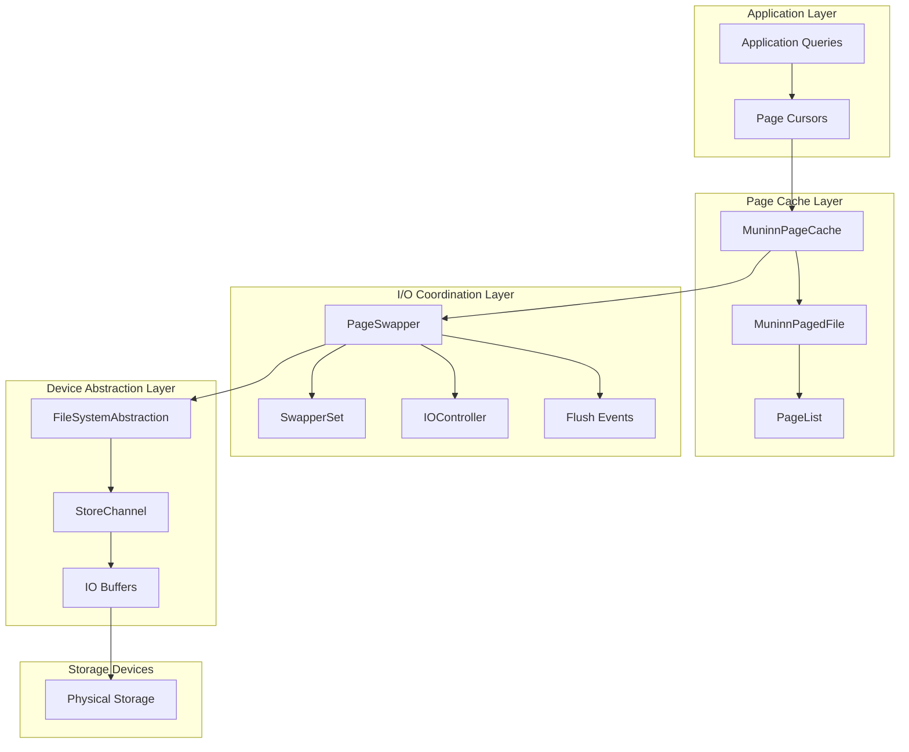

**Diagram sources**
- [MuninnPageCache.java](file://community/io/src/main/java/org/neo4j/io/pagecache/impl/muninn/MuninnPageCache.java#L123-L200)
- [MuninnPagedFile.java](file://community/io/src/main/java/org/neo4j/io/pagecache/impl/muninn/MuninnPagedFile.java#L58-L120)
- [SingleFilePageSwapper.java](file://community/io/src/main/java/org/neo4j/io/pagecache/impl/SingleFilePageSwapper.java#L61-L96)

## Core Components

### MuninnPageCache

The central orchestrator of I/O operations, managing the page cache lifecycle and coordinating between different components:

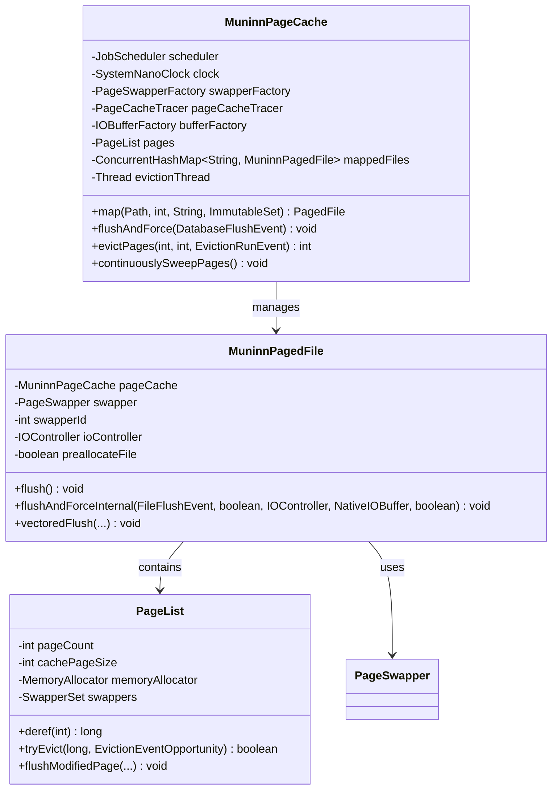

**Diagram sources**
- [MuninnPageCache.java](file://community/io/src/main/java/org/neo4j/io/pagecache/impl/muninn/MuninnPageCache.java#L123-L200)
- [MuninnPagedFile.java](file://community/io/src/main/java/org/neo4j/io/pagecache/impl/muninn/MuninnPagedFile.java#L58-L120)
- [PageList.java](file://community/io/src/main/java/org/neo4j/io/pagecache/impl/muninn/PageList.java#L51-L120)

**Section sources**
- [MuninnPageCache.java](file://community/io/src/main/java/org/neo4j/io/pagecache/impl/muninn/MuninnPageCache.java#L123-L200)
- [MuninnPagedFile.java](file://community/io/src/main/java/org/neo4j/io/pagecache/impl/muninn/MuninnPagedFile.java#L58-L120)
- [PageList.java](file://community/io/src/main/java/org/neo4j/io/pagecache/impl/muninn/PageList.java#L51-L120)

### PageSwapper and Device Abstraction

The PageSwapper provides a unified interface for I/O operations across different storage devices:

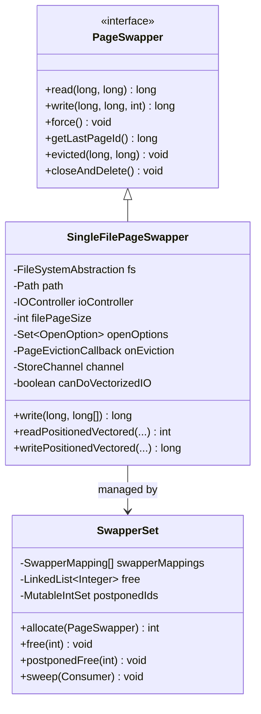

**Diagram sources**
- [PageSwapper.java](file://community/io/src/main/java/org/neo4j/io/pagecache/PageSwapper.java#L32-L162)
- [SingleFilePagePageSwapper.java](file://community/io/src/main/java/org/neo4j/io/pagecache/impl/SingleFilePageSwapper.java#L61-L96)
- [SwapperSet.java](file://community/io/src/main/java/org/neo4j/io/pagecache/impl/muninn/SwapperSet.java#L44-L152)

**Section sources**
- [PageSwapper.java](file://community/io/src/main/java/org/neo4j/io/pagecache/PageSwapper.java#L32-L162)
- [SingleFilePageSwapper.java](file://community/io/src/main/java/org/neo4j/io/pagecache/impl/SingleFilePageSwapper.java#L61-L96)
- [SwapperSet.java](file://community/io/src/main/java/org/neo4j/io/pagecache/impl/muninn/SwapperSet.java#L44-L152)

## I/O Operation Management

### Asynchronous I/O Handling

The system employs vectored I/O operations to maximize throughput by batching multiple pages into single I/O requests:

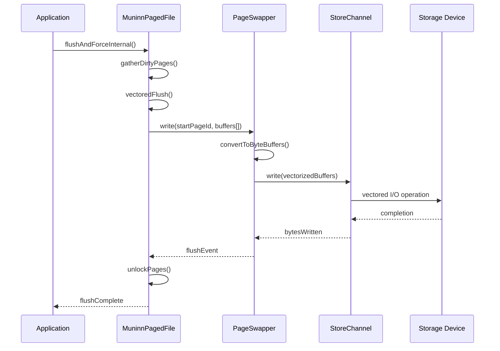

**Diagram sources**
- [MuninnPagedFile.java](file://community/io/src/main/java/org/neo4j/io/pagecache/impl/muninn/MuninnPagedFile.java#L527-L736)
- [SingleFilePageSwapper.java](file://community/io/src/main/java/org/neo4j/io/pagecache/impl/SingleFilePageSwapper.java#L292-L417)

### Batched Operations

The system groups multiple dirty pages into batches for efficient I/O processing:

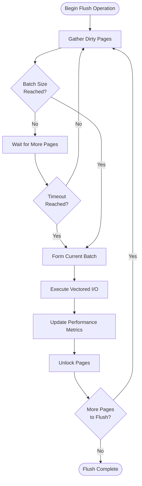

**Diagram sources**
- [MuninnPagedFile.java](file://community/io/src/main/java/org/neo4j/io/pagecache/impl/muninn/MuninnPagedFile.java#L527-L736)

**Section sources**
- [MuninnPagedFile.java](file://community/io/src/main/java/org/neo4j/io/pagecache/impl/muninn/MuninnPagedFile.java#L527-L736)
- [SingleFilePageSwapper.java](file://community/io/src/main/java/org/neo4j/io/pagecache/impl/SingleFilePageSwapper.java#L292-L417)

## Flush Event Coordination

### Domain Model Components

The I/O scheduler uses a hierarchical event model to coordinate flush operations:

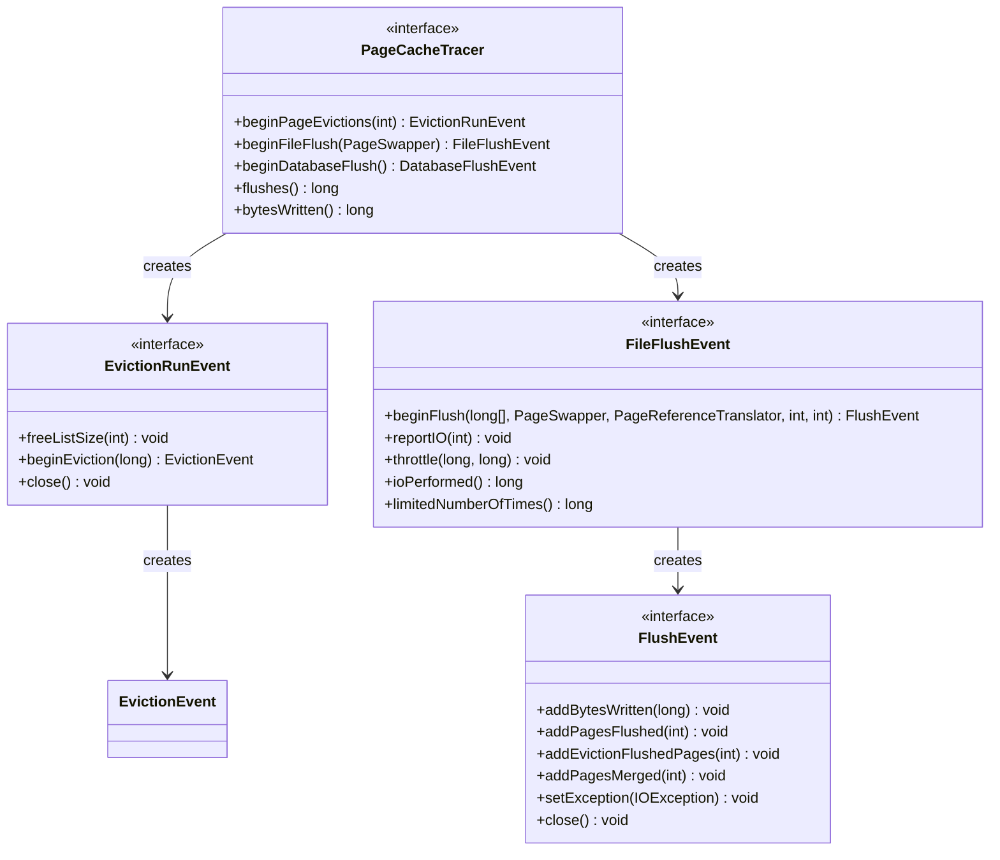

**Diagram sources**
- [PageCacheTracer.java](file://community/io/src/main/java/org/neo4j/io/pagecache/tracing/PageCacheTracer.java#L349-L403)
- [EvictionRunEvent.java](file://community/io/src/main/java/org/neo4j/io/pagecache/tracing/EvictionRunEvent.java#L26-L44)
- [FileFlushEvent.java](file://community/io/src/main/java/org/neo4j/io/pagecache/tracing/FileFlushEvent.java#L38-L97)
- [FlushEvent.java](file://community/io/src/main/java/org/neo4j/io/pagecache/tracing/FlushEvent.java#L26-L81)

### Event Lifecycle Management

The flush event system provides detailed tracking and monitoring capabilities:

| Event Type | Purpose | Scope | Duration |
|------------|---------|-------|----------|
| DatabaseFlushEvent | Coordinated flush across all files | Entire database | Transaction duration |
| FileFlushEvent | Flush for specific file | Individual file | File operation duration |
| EvictionRunEvent | Background eviction coordination | Page cache eviction cycle | Eviction cycle duration |
| FlushEvent | Individual page flush tracking | Single flush operation | I/O operation duration |

**Section sources**
- [PageCacheTracer.java](file://community/io/src/main/java/org/neo4j/io/pagecache/tracing/PageCacheTracer.java#L349-L403)
- [EvictionRunEvent.java](file://community/io/src/main/java/org/neo4j/io/pagecache/tracing/EvictionRunEvent.java#L26-L44)
- [FileFlushEvent.java](file://community/io/src/main/java/org/neo4j/io/pagecache/tracing/FileFlushEvent.java#L38-L97)
- [FlushEvent.java](file://community/io/src/main/java/org/neo4j/io/pagecache/tracing/FlushEvent.java#L26-L81)

## Background vs Forced Flushing

### Background Flushing

Background flushing operates continuously to maintain optimal performance:

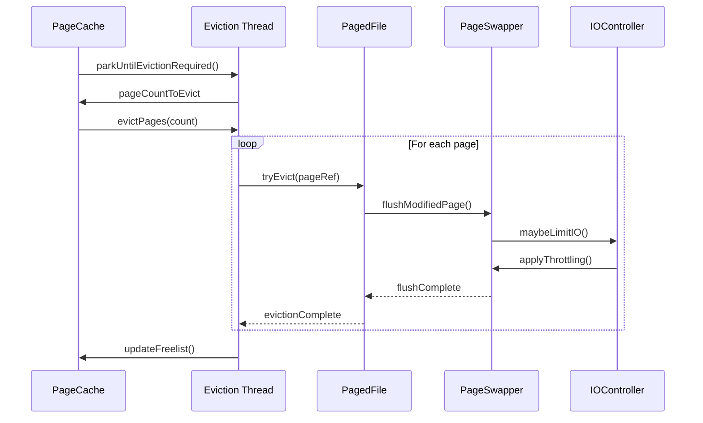

**Diagram sources**
- [MuninnPageCache.java](file://community/io/src/main/java/org/neo4j/io/pagecache/impl/muninn/MuninnPageCache.java#L1045-L1059)
- [MuninnPagedFile.java](file://community/io/src/main/java/org/neo4j/io/pagecache/impl/muninn/MuninnPagedFile.java#L333-L369)

### Forced Flushing

Forced flushing occurs during critical operations like shutdown or checkpoints:

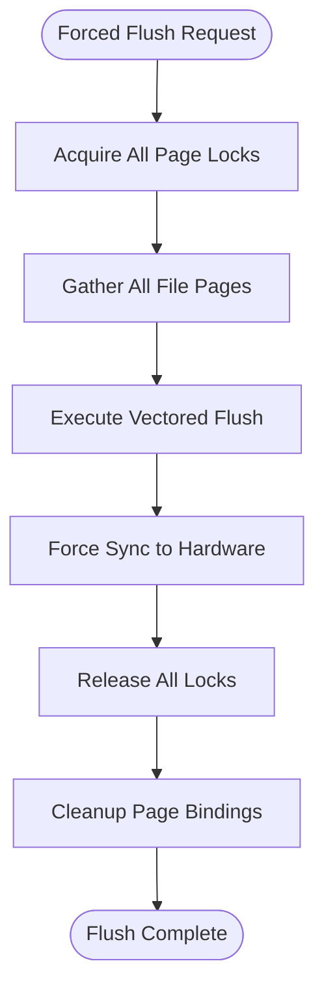

**Diagram sources**
- [MuninnPagedFile.java](file://community/io/src/main/java/org/neo4j/io/pagecache/impl/muninn/MuninnPagedFile.java#L384-L414)

**Section sources**
- [MuninnPageCache.java](file://community/io/src/main/java/org/neo4j/io/pagecache/impl/muninn/MuninnPageCache.java#L1045-L1059)
- [MuninnPagedFile.java](file://community/io/src/main/java/org/neo4j/io/pagecache/impl/muninn/MuninnPagedFile.java#L333-L414)

## Read-Ahead Operations

### Sequential Access Patterns

The system optimizes for sequential access patterns through intelligent read-ahead:

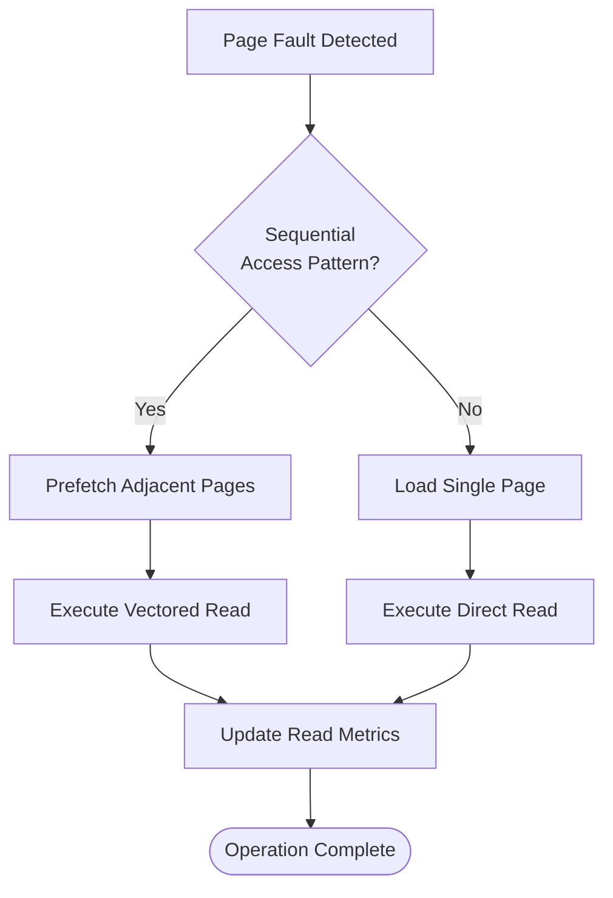

### Vectorized I/O Operations

The system employs vectorized I/O for both reads and writes:

| Operation Type | Vectorization Support | Benefits |
|----------------|----------------------|----------|
| Read Operations | Full support | Reduces syscall overhead, improves throughput |
| Write Operations | Conditional | Depends on device capabilities, reduces fragmentation |
| Mixed Operations | Adaptive | Balances read/write efficiency |

**Section sources**
- [MuninnPagedFile.java](file://community/io/src/main/java/org/neo4j/io/pagecache/impl/muninn/MuninnPagedFile.java#L527-L736)
- [SingleFilePageSwapper.java](file://community/io/src/main/java/org/neo4j/io/pagecache/impl/SingleFilePageSwapper.java#L292-L417)

## Dirty Page Tracking

### Page State Management

The system maintains precise tracking of page modification states:

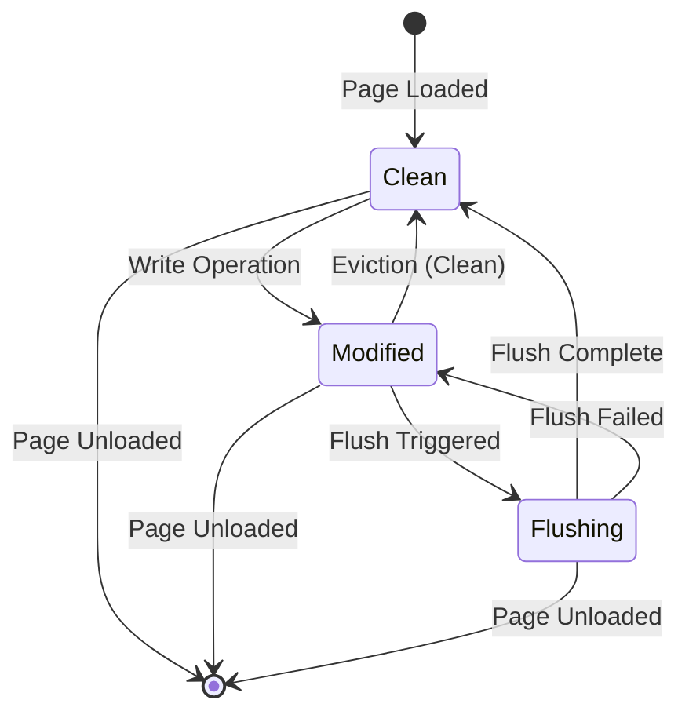

### Dirty Page Classification

| Page State | Description | Flush Priority | Memory Impact |
|------------|-------------|----------------|---------------|
| Clean | Unmodified since last flush | Low | Minimal |
| Modified | Recently modified | Medium | Moderate |
| Flushing | Currently being flushed | High | None |
| Evicted | Ready for eviction | Variable | None |

**Section sources**
- [PageList.java](file://community/io/src/main/java/org/neo4j/io/pagecache/impl/muninn/PageList.java#L480-L508)
- [OffHeapPageLock.java](file://community/io/src/main/java/org/neo4j/io/pagecache/impl/muninn/OffHeapPageLock.java#L30-L60)

## I/O Load Balancing

### Adaptive Flush Rates

The system adjusts flush rates based on system conditions:

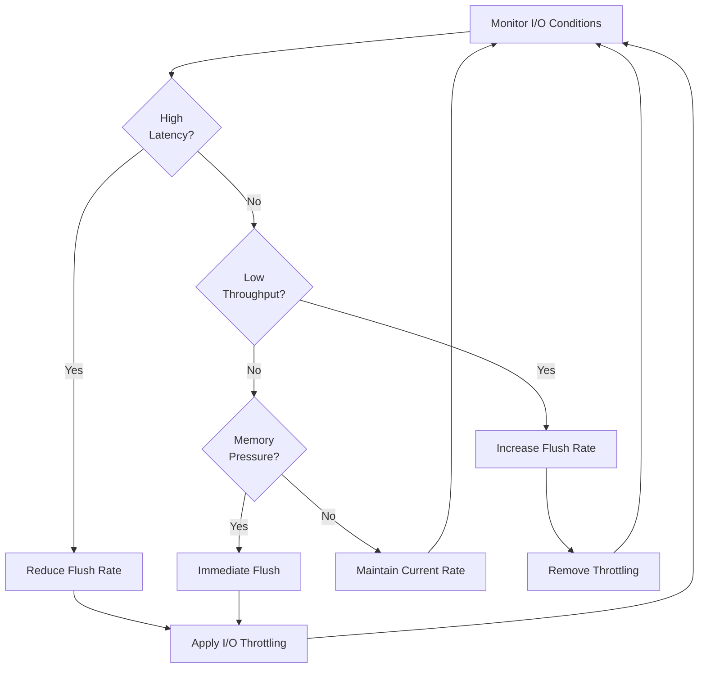

### I/O Throttling Mechanism

The IOController provides fine-grained control over I/O operations:

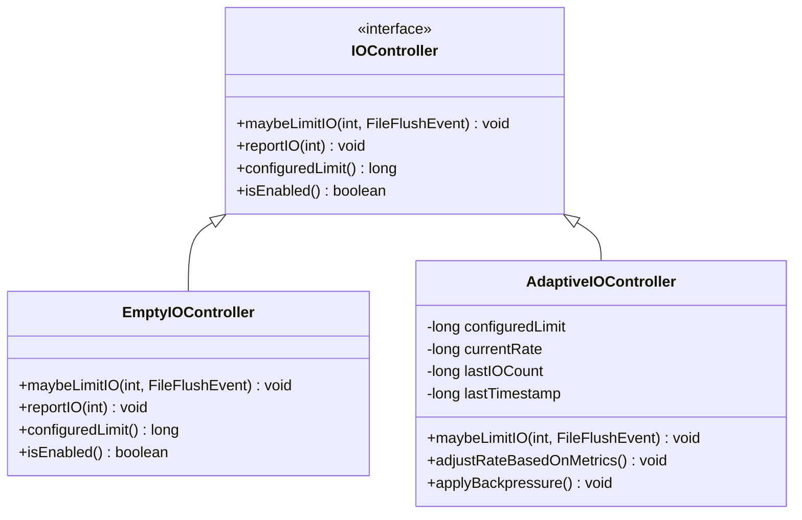

**Diagram sources**
- [IOController.java](file://community/io/src/main/java/org/neo4j/io/pagecache/IOController.java#L37-L76)
- [EmptyIOController.java](file://community/io/src/main/java/org/neo4j/io/pagecache/EmptyIOController.java#L24-L37)

**Section sources**
- [IOController.java](file://community/io/src/main/java/org/neo4j/io/pagecache/IOController.java#L37-L76)
- [EmptyIOController.java](file://community/io/src/main/java/org/neo4j/io/pagecache/EmptyIOController.java#L24-L37)

## Device-Specific Optimizations

### Sequential Write Optimization

The system optimizes for sequential write patterns commonly seen in database operations:

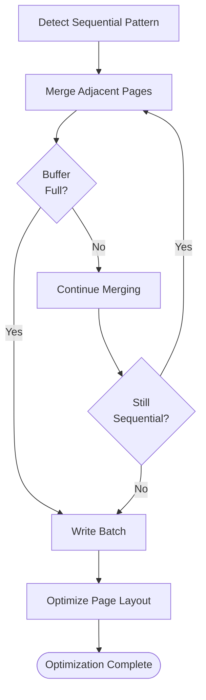

### Device Capability Detection

The system adapts to different storage device characteristics:

| Device Type | Optimization Strategy | Implementation |
|-------------|----------------------|----------------|
| SSD/HDD | Sequential write batching | Vectored I/O with page merging |
| NVMe | Parallel I/O channels | Multiple concurrent flush streams |
| Network Storage | Aggressive caching | Extended dirty page retention |
| Cloud Storage | Compression aware | Compressed page alignment |

**Section sources**
- [SingleFilePageSwapper.java](file://community/io/src/main/java/org/neo4j/io/pagecache/impl/SingleFilePageSwapper.java#L292-L417)

## Common Issues and Solutions

### I/O Storm Prevention

The system implements several mechanisms to prevent I/O storms:

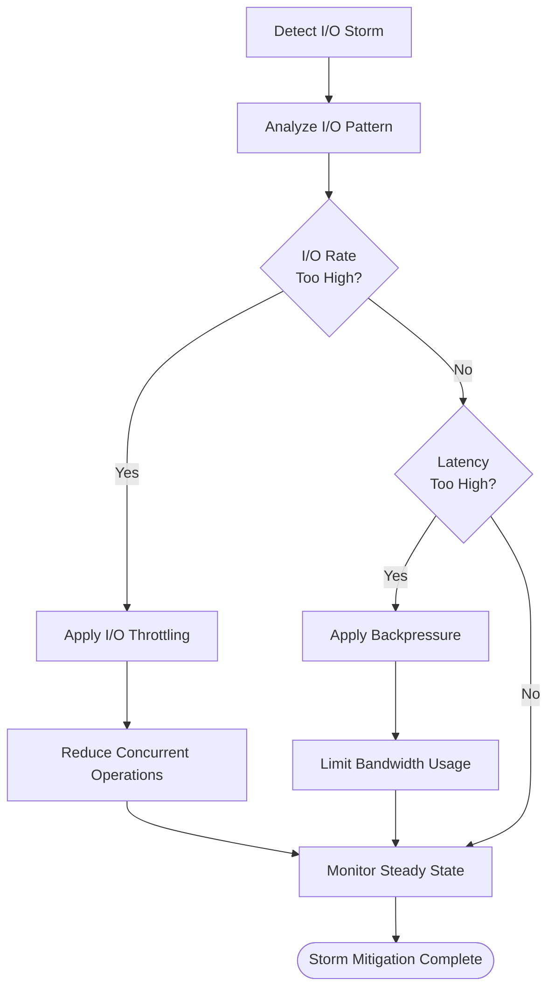

### Write Amplification Control

The system minimizes write amplification through intelligent page management:

| Technique | Purpose | Implementation |
|-----------|---------|----------------|
| Page Merging | Combine adjacent dirty pages | MERGE_PAGES_ON_FLUSH flag |
| Sequential Batching | Group sequential writes | Vectored I/O operations |
| Adaptive Flushing | Adjust flush timing | IOController feedback loops |
| Compression | Reduce physical writes | Page-level compression |

### Disk Saturation Prevention

The system monitors and prevents disk saturation:

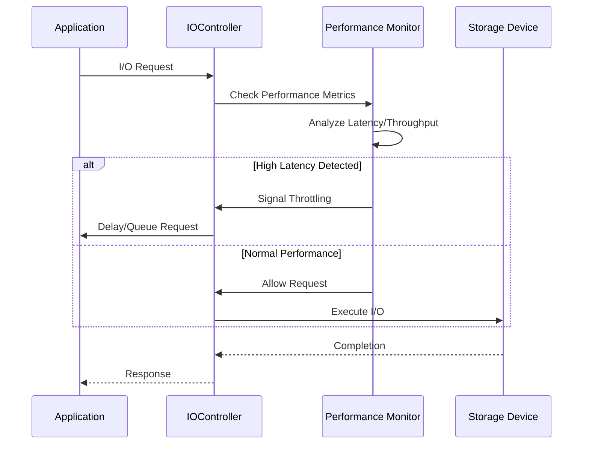

**Section sources**
- [IOController.java](file://community/io/src/main/java/org/neo4j/io/pagecache/IOController.java#L37-L76)
- [MuninnPagedFile.java](file://community/io/src/main/java/org/neo4j/io/pagecache/impl/muninn/MuninnPagedFile.java#L527-L736)

## Performance Monitoring

### Comprehensive Metrics Collection

The system provides extensive monitoring capabilities through the PageCacheTracer:

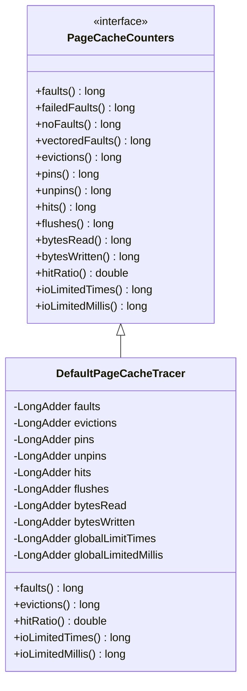

**Diagram sources**
- [PageCacheCounters.java](file://community/io/src/main/java/org/neo4j/io/pagecache/monitoring/PageCacheCounters.java#L26-L185)
- [DefaultPageCacheTracer.java](file://community/io/src/main/java/org/neo4j/io/pagecache/tracing/DefaultPageCacheTracer.java#L33-L256)

### Key Performance Indicators

| Metric Category | Key Indicators | Purpose |
|-----------------|----------------|---------|
| Throughput | Pages/second, Bytes/second | Measure I/O performance |
| Latency | Average/95th percentile I/O time | Monitor responsiveness |
| Efficiency | Hit ratio, Merge ratio | Evaluate optimization effectiveness |
| Resource Usage | Memory usage, CPU utilization | Monitor system impact |
| Reliability | Failure rate, Recovery time | Assess system stability |

**Section sources**
- [PageCacheCounters.java](file://community/io/src/main/java/org/neo4j/io/pagecache/monitoring/PageCacheCounters.java#L26-L185)
- [DefaultPageCacheTracer.java](file://community/io/src/main/java/org/neo4j/io/pagecache/tracing/DefaultPageCacheTracer.java#L33-L256)

## Troubleshooting Guide

### Common Performance Issues

#### High I/O Latency
**Symptoms:** Increased query response times, timeout errors
**Diagnosis:** Check I/O metrics, examine flush patterns
**Solution:** Adjust flush rates, optimize I/O scheduling

#### Memory Pressure
**Symptoms:** Frequent eviction cycles, high eviction rates
**Diagnosis:** Monitor memory usage, check page fault patterns
**Solution:** Increase cache size, adjust eviction policies

#### Disk Saturation
**Symptoms:** High I/O wait times, reduced throughput
**Diagnosis:** Monitor I/O queue depths, check device utilization
**Solution:** Implement I/O throttling, optimize write patterns

### Diagnostic Tools and Techniques

| Tool | Purpose | Usage |
|------|---------|-------|
| PageCacheTracer | Monitor I/O operations | Enable tracing for detailed metrics |
| IOController | Control I/O rates | Configure throttling parameters |
| Performance Counters | Track system metrics | Regular monitoring and alerting |
| Debug Logging | Detailed operation logs | Troubleshooting specific issues |

**Section sources**
- [PageCacheTracer.java](file://community/io/src/main/java/org/neo4j/io/pagecache/tracing/PageCacheTracer.java#L349-L403)
- [IOController.java](file://community/io/src/main/java/org/neo4j/io/pagecache/IOController.java#L37-L76)

## Conclusion

Neo4j's I/O Scheduling subsystem represents a sophisticated approach to managing I/O operations in high-performance database systems. Through its layered architecture, intelligent coordination mechanisms, and comprehensive monitoring capabilities, it achieves optimal throughput while maintaining low latency and preventing system overload.

The system's key strengths include:

- **Adaptive Behavior:** Automatic adjustment to system conditions and workload patterns
- **Hierarchical Coordination:** Well-defined event hierarchy for complex I/O operations
- **Device Awareness:** Adaptation to different storage device characteristics
- **Comprehensive Monitoring:** Extensive metrics for performance analysis and tuning
- **Robust Error Handling:** Graceful degradation and recovery mechanisms

Understanding these components and their interactions is crucial for optimizing Neo4j performance and troubleshooting I/O-related issues. The modular design allows for targeted improvements while maintaining system stability and reliability.