# Memory Management

<cite>
**Referenced Files in This Document**
- [MuninnPageCache.java](file://community/io/src/main/java/org/neo4j/io/pagecache/impl/muninn/MuninnPageCache.java)
- [PageList.java](file://community/io/src/main/java/org/neo4j/io/pagecache/impl/muninn/PageList.java)
- [MemoryTracker.java](file://community/common/src/main/java/org/neo4j/memory/MemoryTracker.java)
- [MemoryAllocator.java](file://community/io/src/main/java/org/neo4j/io/mem/MemoryAllocator.java)
- [VictimPageReference.java](file://community/io/src/main/java/org/neo4j/io/pagecache/impl/muninn/VictimPageReference.java)
- [LatchMap.java](file://community/io/src/main/java/org/neo4j/io/pagecache/impl/muninn/LatchMap.java)
- [EvictionTask.java](file://community/io/src/main/java/org/neo4j/io/pagecache/impl/muninn/EvictionTask.java)
- [BackgroundTask.java](file://community/io/src/main/java/org/neo4j/io/pagecache/impl/muninn/BackgroundTask.java)
- [SwapperSet.java](file://community/io/src/main/java/org/neo4j/io/pagecache/impl/muninn/SwapperSet.java)
- [UnsafeUtil.java](file://community/unsafe/src/main/java/org/neo4j/internal/unsafe/UnsafeUtil.java)
- [ByteBuffers.java](file://community/io/src/main/java/org/neo4j/io/memory/ByteBuffers.java)
- [ConfigurableIOBuffer.java](file://community/configuration/src/main/java/org/neo4j/configuration/pagecache/ConfigurableIOBuffer.java)
- [CachingOffHeapBlockAllocator.java](file://community/kernel/src/main/java/org/neo4j/kernel/impl/util/collection/CachingOffHeapBlockAllocator.java)
- [DefaultScopedMemoryTracker.java](file://community/common/src/main/java/org/neo4j/memory/DefaultScopedMemoryTracker.java)
- [HighWaterMarkMemoryPool.java](file://community/common/src/main/java/org/neo4j/memory/HighWaterMarkMemoryPool.java)
</cite>

## Table of Contents
1. [Introduction](#introduction)
2. [Architecture Overview](#architecture-overview)
3. [Core Memory Management Components](#core-memory-management-components)
4. [Memory Allocation Strategies](#memory-allocation-strategies)
5. [Page Caching Implementation](#page-caching-implementation)
6. [Memory Tracking and Monitoring](#memory-tracking-and-monitoring)
7. [Garbage Collection Optimization](#garbage-collection-optimization)
8. [Performance Considerations](#performance-considerations)
9. [Common Issues and Solutions](#common-issues-and-solutions)
10. [Best Practices](#best-practices)

## Introduction

Neo4j's Memory Management subsystem is a sophisticated implementation designed to handle large-scale data caching with minimal garbage collection overhead. The system centers around the MuninnPageCache, which provides efficient off-heap memory management for cached pages, direct byte buffers, and memory-mapped file operations.

The memory management architecture is built on several key principles:
- **Off-heap memory allocation** to avoid garbage collection pressure
- **Direct byte buffer access** for high-performance I/O operations  
- **Memory pooling** to reduce allocation overhead
- **Explicit memory management** to prevent memory leaks
- **NUMA-aware allocation** for optimal memory locality

## Architecture Overview

The memory management system follows a layered architecture with clear separation of concerns:

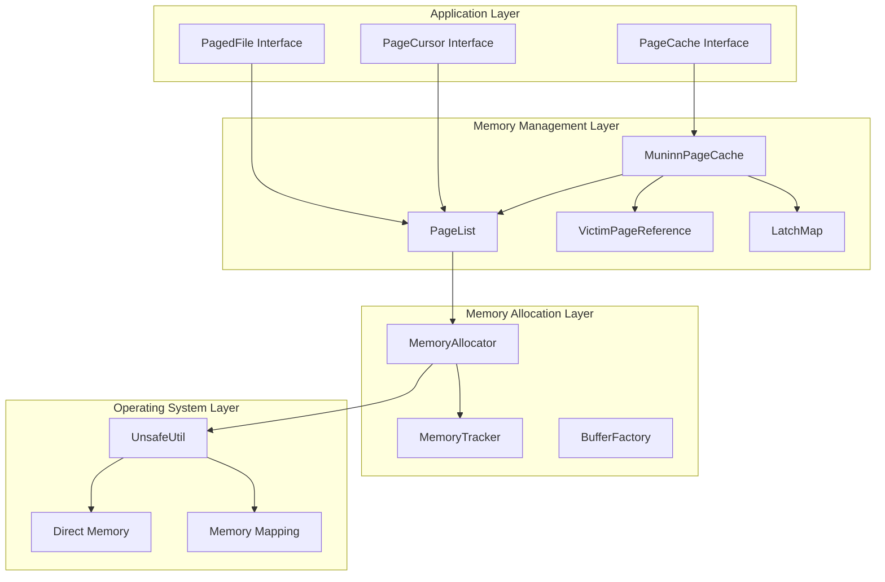

**Diagram sources**
- [MuninnPageCache.java](file://community/io/src/main/java/org/neo4j/io/pagecache/impl/muninn/MuninnPageCache.java#L123-L1223)
- [PageList.java](file://community/io/src/main/java/org/neo4j/io/pagecache/impl/muninn/PageList.java#L50-L515)
- [MemoryAllocator.java](file://community/io/src/main/java/org/neo4j/io/mem/MemoryAllocator.java#L26-L61)

## Core Memory Management Components

### MemoryTracker Interface

The MemoryTracker serves as the central interface for memory monitoring and allocation tracking:

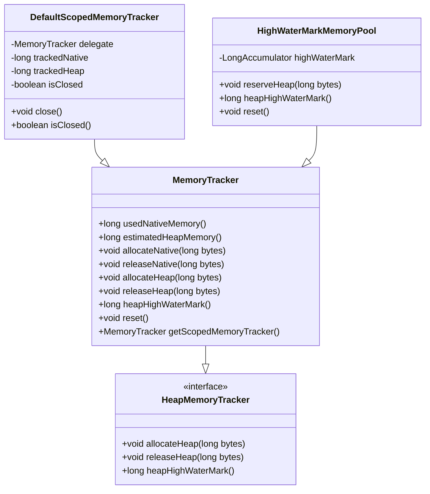

**Diagram sources**
- [MemoryTracker.java](file://community/common/src/main/java/org/neo4j/memory/MemoryTracker.java#L24-L87)
- [DefaultScopedMemoryTracker.java](file://community/common/src/main/java/org/neo4j/memory/DefaultScopedMemoryTracker.java#L27-L115)
- [HighWaterMarkMemoryPool.java](file://community/common/src/main/java/org/neo4j/memory/HighWaterMarkMemoryPool.java#L27-L50)

**Section sources**
- [MemoryTracker.java](file://community/common/src/main/java/org/neo4j/memory/MemoryTracker.java#L24-L87)
- [DefaultScopedMemoryTracker.java](file://community/common/src/main/java/org/neo4j/memory/DefaultScopedMemoryTracker.java#L27-L115)

### MemoryAllocator Interface

The MemoryAllocator provides controlled off-heap memory allocation with alignment guarantees:

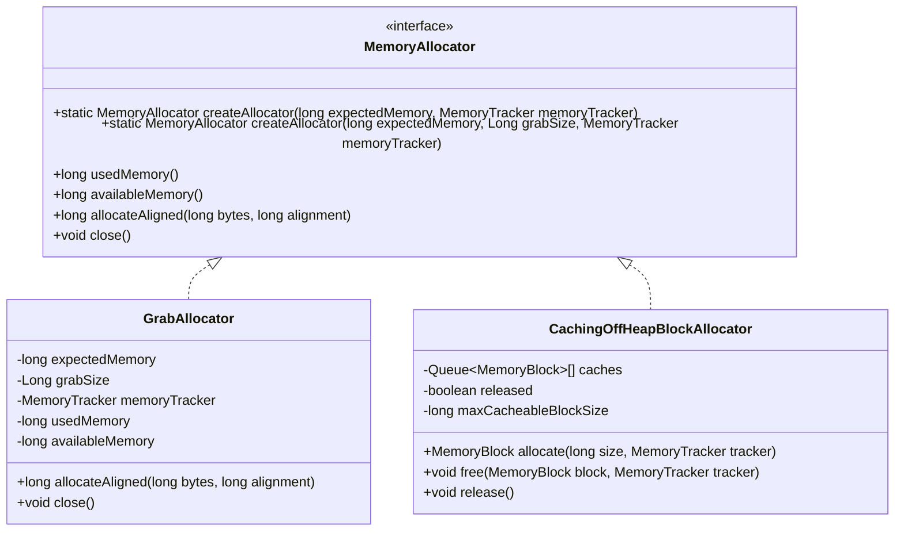

**Diagram sources**
- [MemoryAllocator.java](file://community/io/src/main/java/org/neo4j/io/mem/MemoryAllocator.java#L26-L61)
- [CachingOffHeapBlockAllocator.java](file://community/kernel/src/main/java/org/neo4j/kernel/impl/util/collection/CachingOffHeapBlockAllocator.java#L68-L150)

**Section sources**
- [MemoryAllocator.java](file://community/io/src/main/java/org/neo4j/io/mem/MemoryAllocator.java#L26-L61)
- [CachingOffHeapBlockAllocator.java](file://community/kernel/src/main/java/org/neo4j/kernel/impl/util/collection/CachingOffHeapBlockAllocator.java#L68-L150)

### PageList Management

The PageList manages off-heap metadata for cached pages with efficient memory layout:

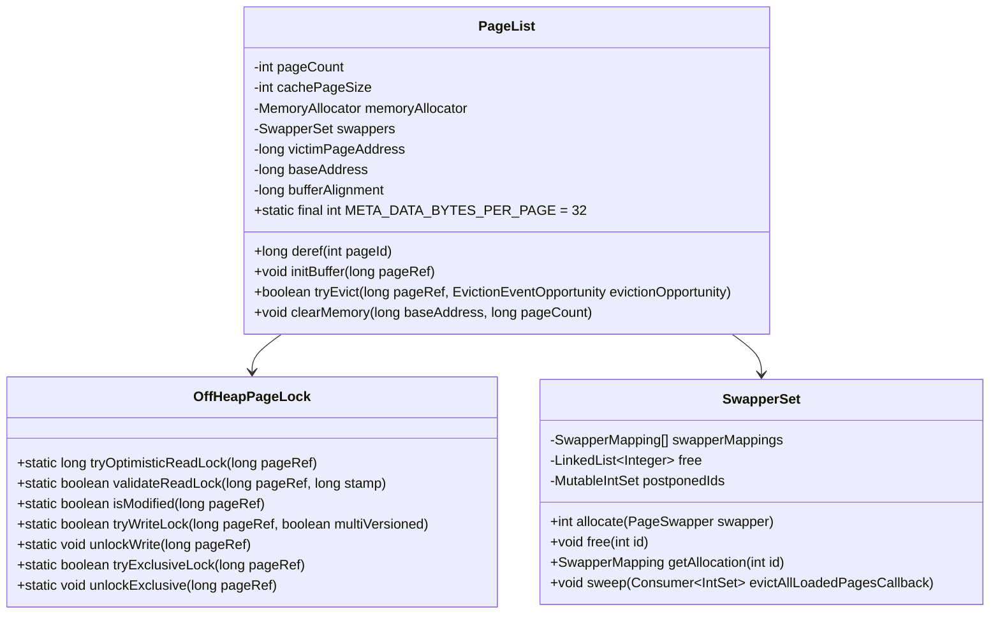

**Diagram sources**
- [PageList.java](file://community/io/src/main/java/org/neo4j/io/pagecache/impl/muninn/PageList.java#L50-L515)
- [SwapperSet.java](file://community/io/src/main/java/org/neo4j/io/pagecache/impl/muninn/SwapperSet.java#L45-L154)

**Section sources**
- [PageList.java](file://community/io/src/main/java/org/neo4j/io/pagecache/impl/muninn/PageList.java#L50-L515)
- [SwapperSet.java](file://community/io/src/main/java/org/neo4j/io/pagecache/impl/muninn/SwapperSet.java#L45-L154)

## Memory Allocation Strategies

### Direct Byte Buffer Management

Neo4j employs sophisticated direct byte buffer allocation strategies to minimize garbage collection pressure:

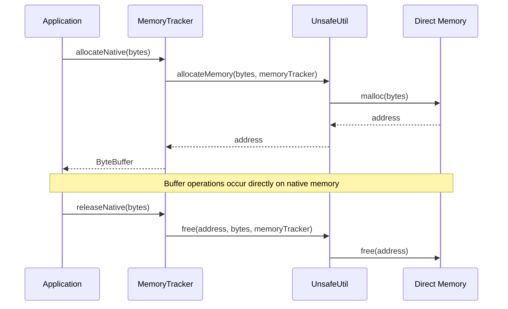

**Diagram sources**
- [UnsafeUtil.java](file://community/unsafe/src/main/java/org/neo4j/internal/unsafe/UnsafeUtil.java#L638-L729)
- [ByteBuffers.java](file://community/io/src/main/java/org/neo4j/io/memory/ByteBuffers.java#L36-L95)

### Memory Pooling and Reuse

The system implements intelligent memory pooling to reduce allocation overhead:

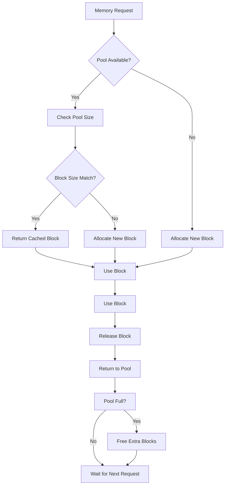

**Section sources**
- [CachingOffHeapBlockAllocator.java](file://community/kernel/src/main/java/org/neo4j/kernel/impl/util/collection/CachingOffHeapBlockAllocator.java#L68-L150)

### Buffer Alignment and Memory Layout

The system ensures optimal memory alignment for performance:

| Component | Alignment Requirement | Purpose |
|-----------|----------------------|---------|
| Page Buffers | Cache page size | Minimize TLB misses |
| Metadata | 8 bytes (long) | Atomic operations |
| IO Buffers | Page size or memory page size | Optimal I/O performance |
| Victim Pages | Cache page size | Safe fallback mechanism |

**Section sources**
- [PageList.java](file://community/io/src/main/java/org/neo4j/io/pagecache/impl/muninn/PageList.java#L53-L54)
- [VictimPageReference.java](file://community/io/src/main/java/org/neo4j/io/pagecache/impl/muninn/VictimPageReference.java#L24-L42)

## Page Caching Implementation

### MuninnPageCache Architecture

The MuninnPageCache implements a sophisticated page replacement algorithm with background eviction:

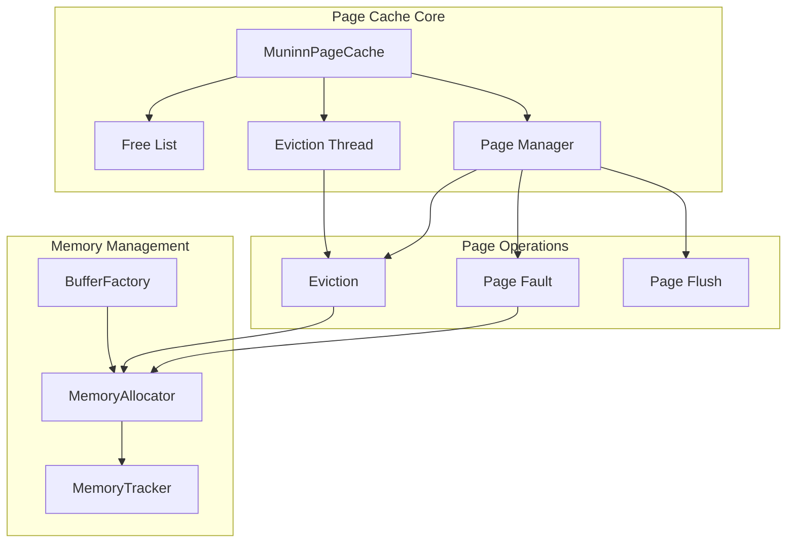

**Diagram sources**
- [MuninnPageCache.java](file://community/io/src/main/java/org/neo4j/io/pagecache/impl/muninn/MuninnPageCache.java#L123-L1223)
- [EvictionTask.java](file://community/io/src/main/java/org/neo4j/io/pagecache/impl/muninn/EvictionTask.java#L29-L39)

### Page Fault Handling

Page faults are handled efficiently with concurrent access control:

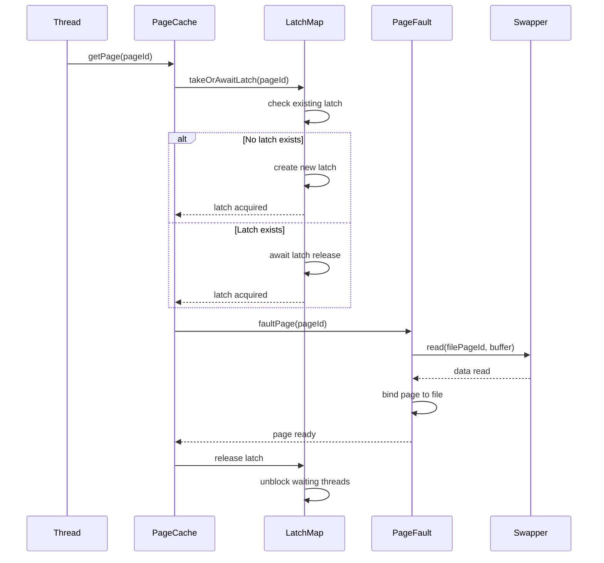

**Diagram sources**
- [LatchMap.java](file://community/io/src/main/java/org/neo4j/io/pagecache/impl/muninn/LatchMap.java#L78-L98)
- [MuninnPageCache.java](file://community/io/src/main/java/org/neo4j/io/pagecache/impl/muninn/MuninnPageCache.java#L898-L922)

**Section sources**
- [LatchMap.java](file://community/io/src/main/java/org/neo4j/io/pagecache/impl/muninn/LatchMap.java#L78-L98)
- [MuninnPageCache.java](file://community/io/src/main/java/org/neo4j/io/pagecache/impl/muninn/MuninnPageCache.java#L898-L922)

### Background Eviction Process

The eviction system operates asynchronously to maintain cache performance:

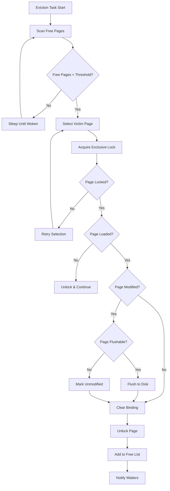

**Diagram sources**
- [EvictionTask.java](file://community/io/src/main/java/org/neo4j/io/pagecache/impl/muninn/EvictionTask.java#L29-L39)
- [BackgroundTask.java](file://community/io/src/main/java/org/neo4j/io/pagecache/impl/muninn/BackgroundTask.java#L25-L49)

**Section sources**
- [EvictionTask.java](file://community/io/src/main/java/org/neo4j/io/pagecache/impl/muninn/EvictionTask.java#L29-L39)
- [BackgroundTask.java](file://community/io/src/main/java/org/neo4j/io/pagecache/impl/muninn/BackgroundTask.java#L25-L49)

## Memory Tracking and Monitoring

### Scoped Memory Tracking

The system provides hierarchical memory tracking for precise resource management:

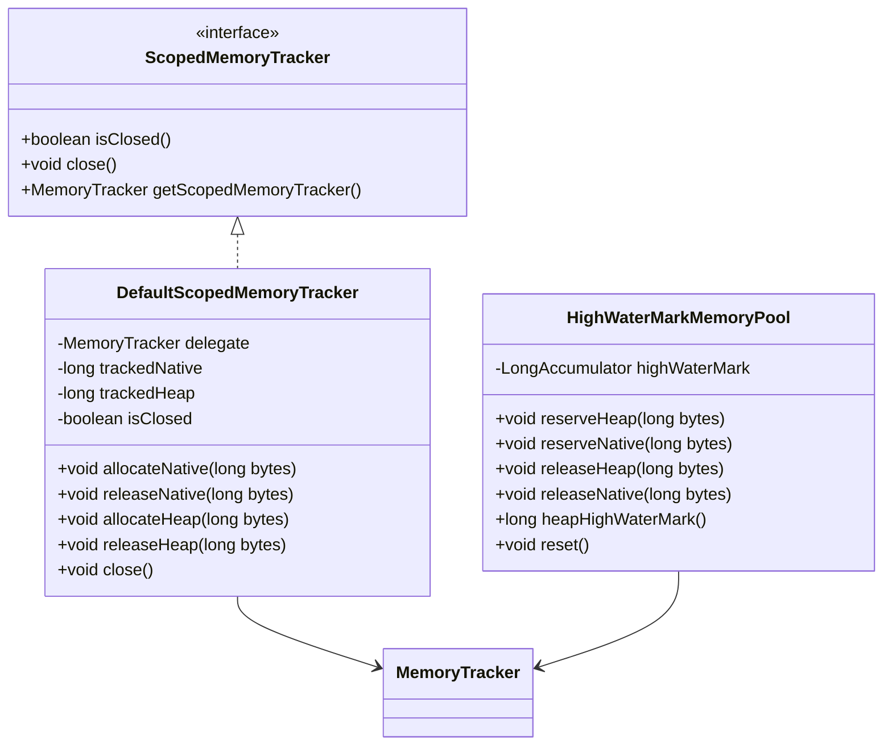

**Diagram sources**
- [DefaultScopedMemoryTracker.java](file://community/common/src/main/java/org/neo4j/memory/DefaultScopedMemoryTracker.java#L27-L115)
- [HighWaterMarkMemoryPool.java](file://community/common/src/main/java/org/neo4j/memory/HighWaterMarkMemoryPool.java#L27-L50)

### Memory Pressure Detection

The system monitors memory usage patterns to detect and respond to pressure:

| Metric | Purpose | Threshold |
|--------|---------|-----------|
| Native Memory Usage | Track off-heap consumption | Configurable limit |
| Heap High Water Mark | Monitor GC pressure | Runtime adaptive |
| Free Page Count | Cache availability | 5-50% of total pages |
| Allocation Rate | Detect memory leaks | Sliding window average |

**Section sources**
- [DefaultScopedMemoryTracker.java](file://community/common/src/main/java/org/neo4j/memory/DefaultScopedMemoryTracker.java#L27-L115)
- [HighWaterMarkMemoryPool.java](file://community/common/src/main/java/org/neo4j/memory/HighWaterMarkMemoryPool.java#L27-L50)

## Garbage Collection Optimization

### Off-Heap Memory Management

Neo4j minimizes garbage collection pressure through careful memory management:

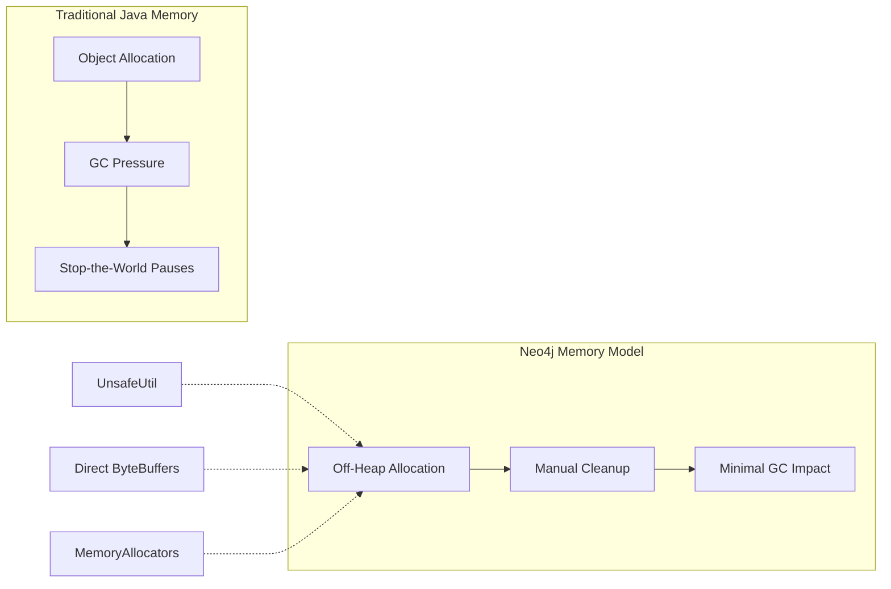

### Explicit Buffer Cleanup

The system ensures proper cleanup of native resources:

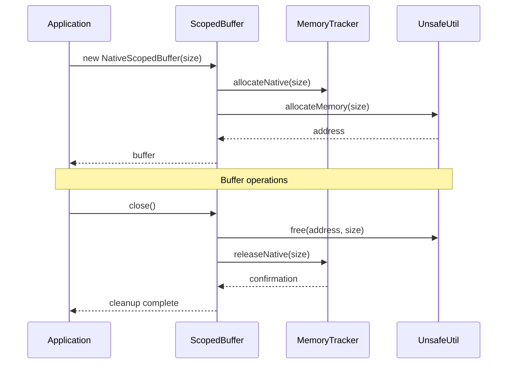

**Diagram sources**
- [ByteBuffers.java](file://community/io/src/main/java/org/neo4j/io/memory/ByteBuffers.java#L36-L95)
- [UnsafeUtil.java](file://community/unsafe/src/main/java/org/neo4j/internal/unsafe/UnsafeUtil.java#L638-L729)

**Section sources**
- [ByteBuffers.java](file://community/io/src/main/java/org/neo4j/io/memory/ByteBuffers.java#L36-L95)
- [UnsafeUtil.java](file://community/unsafe/src/main/java/org/neo4j/internal/unsafe/UnsafeUtil.java#L638-L729)

## Performance Considerations

### NUMA Awareness

The memory management system considers NUMA topology for optimal performance:

- **Memory Allocation Policy**: Allocates memory near CPU cores
- **Page Migration**: Moves pages to preferred NUMA nodes
- **Affinity Management**: Pins threads to specific NUMA domains

### Memory Locality Optimization

| Technique | Benefit | Implementation |
|-----------|---------|----------------|
| Cache Line Alignment | Reduced false sharing | 64-byte boundaries |
| Prefetching | Hidden latency | Hardware prefetch hints |
| Batch Operations | Improved throughput | Vectorized I/O operations |
| Memory Barriers | Correct ordering | VarHandle fences |

### I/O Optimization

The system optimizes I/O operations through buffering and batching:

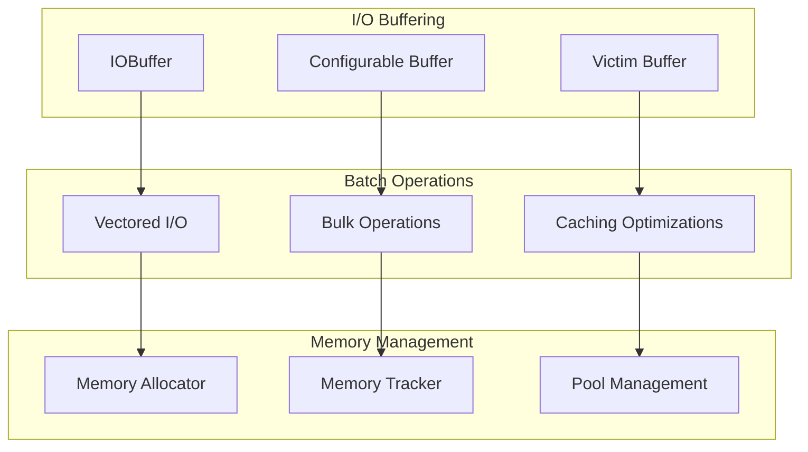

**Section sources**
- [ConfigurableIOBuffer.java](file://community/configuration/src/main/java/org/neo4j/configuration/pagecache/ConfigurableIOBuffer.java#L31-L86)

## Common Issues and Solutions

### Memory Leaks

Common causes and prevention strategies:

| Issue | Cause | Solution |
|-------|-------|----------|
| Unclosed Buffers | Missing close() calls | Use try-with-resources |
| Reference Retention | Stale page references | Proper eviction policies |
| Native Memory Exhaustion | Large page caches | Configurable limits |
| Buffer Overflows | Incorrect sizing | Bounds checking |

### Address Space Exhaustion

Mitigation strategies for large deployments:

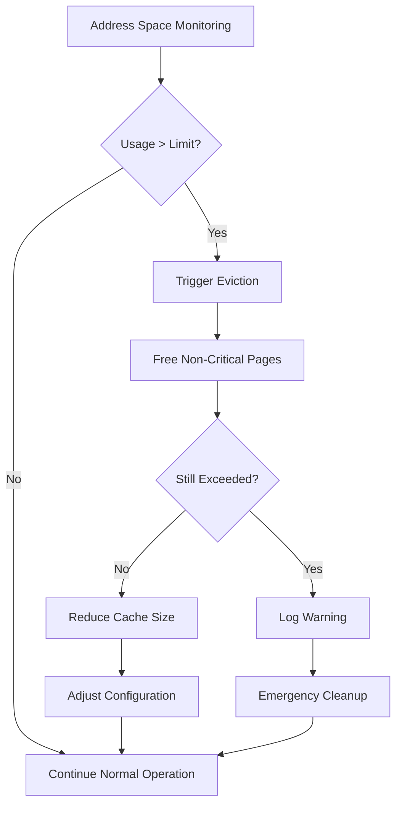

### Performance Degradation

Symptoms and resolution approaches:

- **High GC Pause Times**: Reduce off-heap allocation rate
- **Page Fault Spikes**: Increase cache size or improve prefetching
- **Memory Fragmentation**: Use memory compaction strategies
- **NUMA Imbalance**: Adjust thread affinity and memory placement

**Section sources**
- [MuninnPageCache.java](file://community/io/src/main/java/org/neo4j/io/pagecache/impl/muninn/MuninnPageCache.java#L127-L148)

## Best Practices

### Configuration Guidelines

Recommended settings for different deployment scenarios:

| Scenario | Cache Size | Buffer Size | Eviction Policy |
|----------|------------|-------------|-----------------|
| Development | 128MB | 8KB | Aggressive |
| Production | 1GB+ | 64KB | Balanced |
| Large Scale | 8GB+ | 256KB | Conservative |

### Monitoring and Maintenance

Essential metrics to monitor:

- **Memory Utilization**: Native and heap usage trends
- **Page Fault Rate**: Cache hit ratio indicators
- **Eviction Frequency**: Replacement policy effectiveness
- **I/O Throughput**: Disk operation efficiency

### Resource Management

Proper resource lifecycle management:

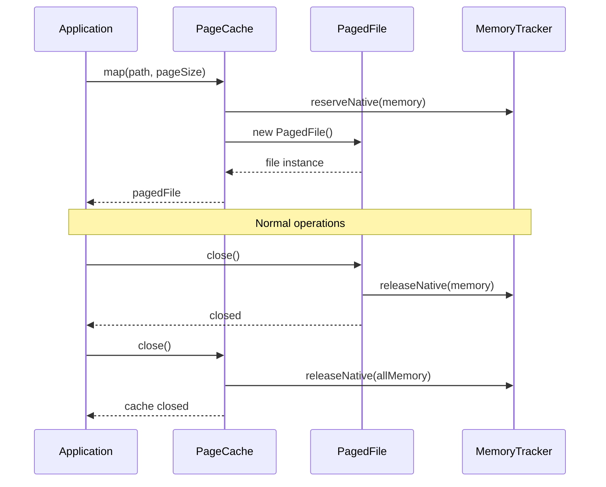

**Diagram sources**
- [MuninnPageCache.java](file://community/io/src/main/java/org/neo4j/io/pagecache/impl/muninn/MuninnPageCache.java#L735-L744)

### Troubleshooting Memory Issues

Diagnostic approaches for memory-related problems:

1. **Enable Memory Tracing**: Use detailed logging for allocation patterns
2. **Monitor Resource Usage**: Track memory consumption over time
3. **Profile Allocation Patterns**: Identify hot paths and bottlenecks
4. **Test Under Load**: Validate behavior with realistic workloads

**Section sources**
- [MuninnPageCache.java](file://community/io/src/main/java/org/neo4j/io/pagecache/impl/muninn/MuninnPageCache.java#L735-L744)