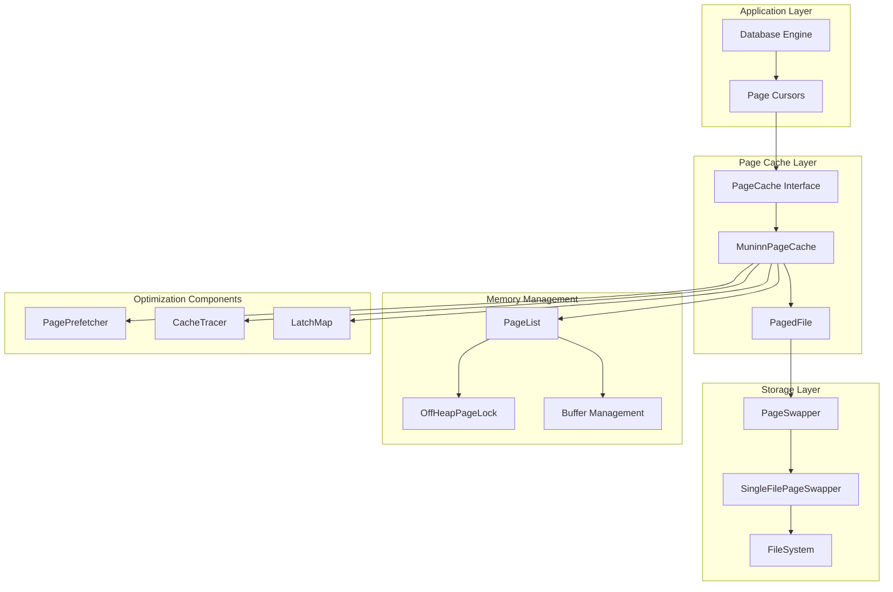
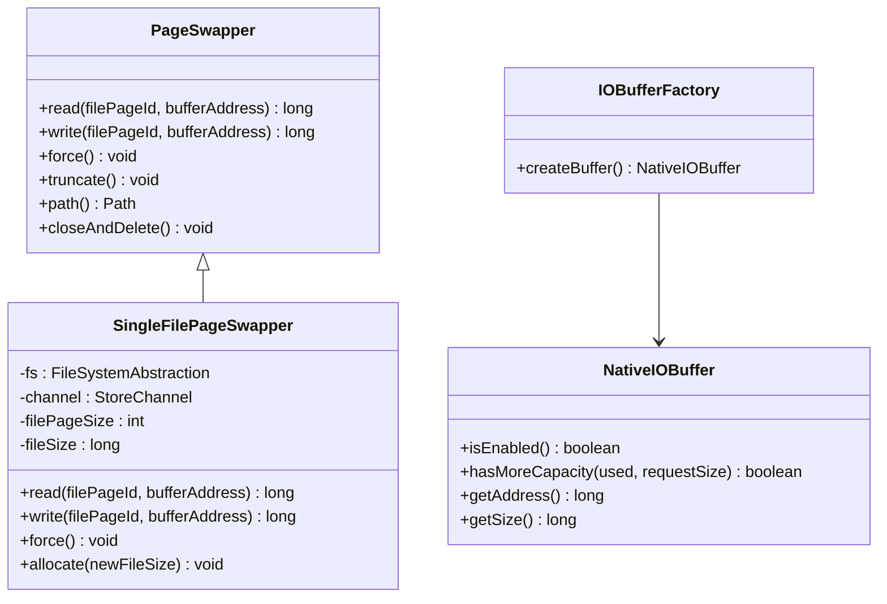
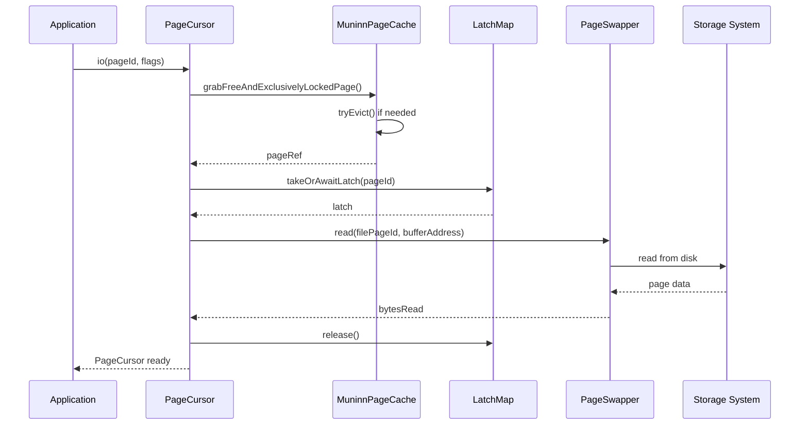
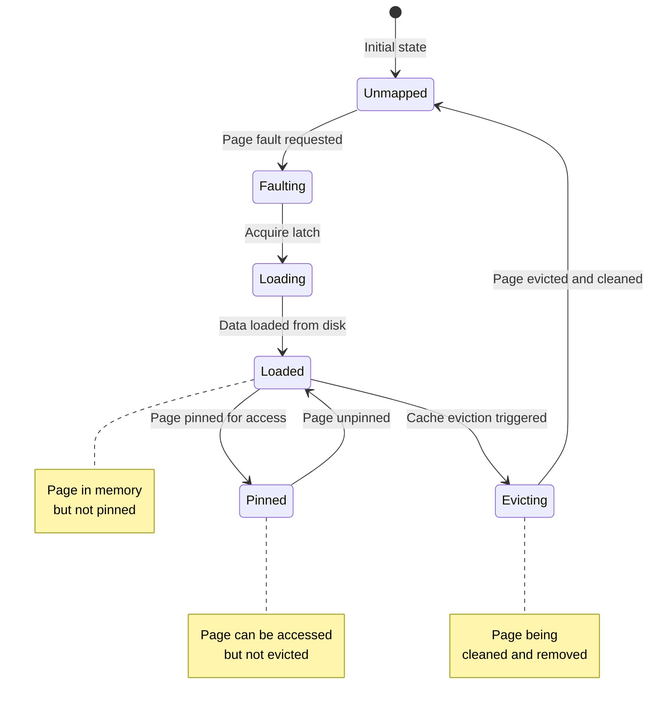
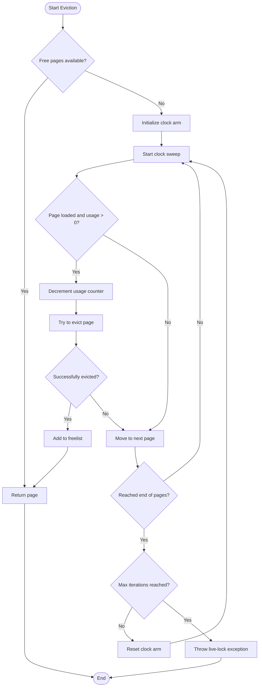
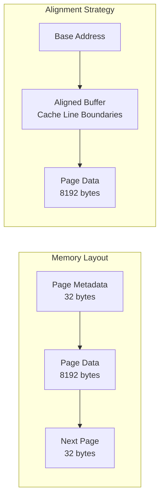
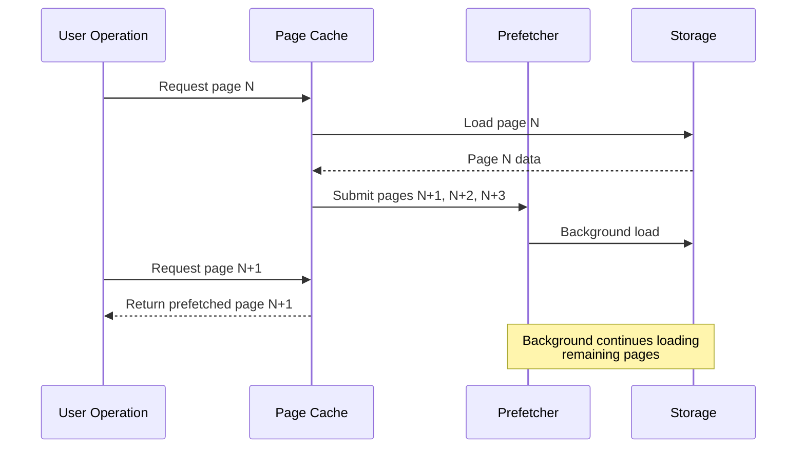
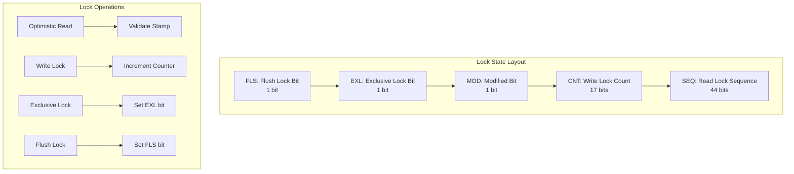
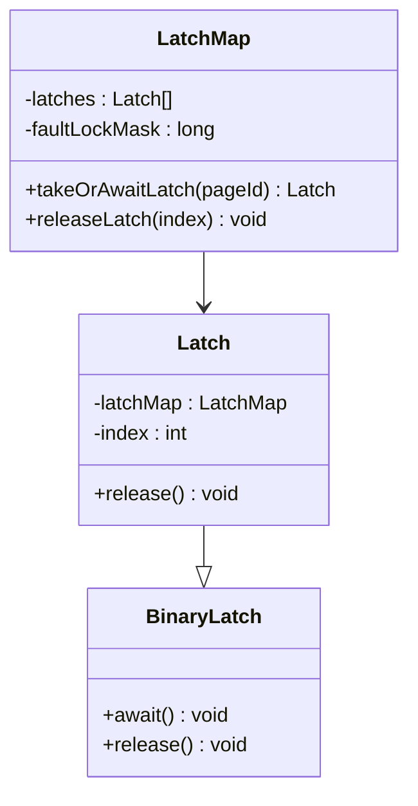
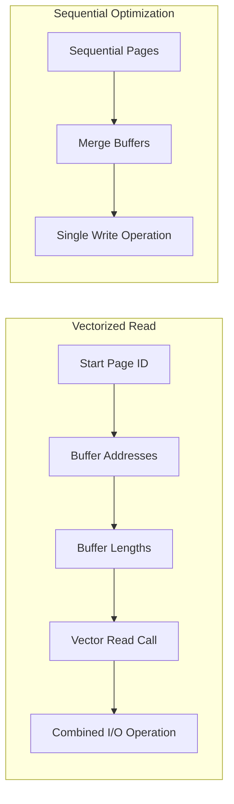

# Page Caching

<cite>
**Referenced Files in This Document**
- [PageCache.java](file://community/io/src/main/java/org/neo4j/io/pagecache/PageCache.java)
- [PagedFile.java](file://community/io/src/main/java/org/neo4j/io/pagecache/PagedFile.java)
- [MuninnPageCache.java](file://community/io/src/main/java/org/neo4j/io/pagecache/impl/muninn/MuninnPageCache.java)
- [MuninnPagedFile.java](file://community/io/src/main/java/org/neo4j/io/pagecache/impl/muninn/MuninnPagedFile.java)
- [PageSwapper.java](file://community/io/src/main/java/org/neo4j/io/pagecache/PageSwapper.java)
- [SingleFilePageSwapper.java](file://community/io/src/main/java/org/neo4j/io/pagecache/impl/SingleFilePageSwapper.java)
- [PageList.java](file://community/io/src/main/java/org/neo4j/io/pagecache/impl/muninn/PageList.java)
- [OffHeapPageLock.java](file://community/io/src/main/java/org/neo4j/io/pagecache/impl/muninn/OffHeapPageLock.java)
- [LatchMap.java](file://community/io/src/main/java/org/neo4j/io/pagecache/impl/muninn/LatchMap.java)
- [IOBufferFactory.java](file://community/io/src/main/java/org/neo4j/io/pagecache/buffer/IOBufferFactory.java)
- [PagePrefetcher.java](file://community/io/src/main/java/org/neo4j/io/pagecache/prefetch/PagePrefetcher.java)
- [DefaultPageCacheTracer.java](file://community/io/src/main/java/org/neo4j/io/pagecache/tracing/DefaultPageCacheTracer.java)
- [PageCursor.java](file://community/io/src/main/java/org/neo4j/io/pagecache/PageCursor.java)
- [MuninnPageCursor.java](file://community/io/src/main/java/org/neo4j/io/pagecache/impl/muninn/MuninnPageCursor.java)
</cite>

## Table of Contents
1. [Introduction](#introduction)
2. [System Architecture Overview](#system-architecture-overview)
3. [Core Components](#core-components)
4. [Domain Model](#domain-model)
5. [Page Fault Mechanism](#page-fault-mechanism)
6. [Cache Eviction Policies](#cache-eviction-policies)
7. [Memory Management](#memory-management)
8. [Read-Ahead and Prefetching](#read-ahead-and-prefetching)
9. [Lock-Free Data Structures](#lock-free-data-structures)
10. [Performance Optimization](#performance-optimization)
11. [Common Issues and Solutions](#common-issues-and-solutions)
12. [Troubleshooting Guide](#troubleshooting-guide)
13. [Conclusion](#conclusion)

## Introduction

Neo4j's Page Caching subsystem is a sophisticated memory-mapped file I/O system designed to optimize database performance through intelligent caching strategies. The implementation, named "Muninn" after the Norse mythological raven that brings information to Odin, provides high-performance access to database pages while managing memory efficiently and preventing cache thrashing.

The page cache serves as the primary interface between the database engine and persistent storage, handling the complex task of balancing memory usage, I/O operations, and cache performance. It employs advanced techniques including lock-free data structures, adaptive eviction algorithms, and intelligent prefetching to deliver optimal performance for both read-heavy and write-intensive workloads.

## System Architecture Overview

The page caching system follows a layered architecture that separates concerns between memory management, I/O operations, and cache coordination:

**Diagram sources**
- [PageCache.java](file://community/io/src/main/java/org/neo4j/io/pagecache/PageCache.java#L45-L228)
- [MuninnPageCache.java](file://community/io/src/main/java/org/neo4j/io/pagecache/impl/muninn/MuninnPageCache.java#L123-L200)
- [PagedFile.java](file://community/io/src/main/java/org/neo4j/io/pagecache/PagedFile.java#L33-L287)

## Core Components

### PageCache Interface

The [`PageCache`](file://community/io/src/main/java/org/neo4j/io/pagecache/PageCache.java#L45-L228) interface defines the primary contract for the page caching system. It provides methods for mapping files, managing page access, and coordinating cache operations.

Key responsibilities include:
- File mapping and unmapping
- Page fault handling
- Cache eviction coordination
- Memory allocation management
- I/O scheduling and throttling

### PagedFile Implementation

[`MuninnPagedFile`](file://community/io/src/main/java/org/neo4j/io/pagecache/impl/muninn/MuninnPagedFile.java#L58-L200) represents a file that has been mapped into the page cache. It maintains the translation table that maps file page IDs to cache page IDs and handles page-level operations.

### PageSwapper Abstraction

The [`PageSwapper`](file://community/io/src/main/java/org/neo4j/io/pagecache/PageSwapper.java#L32-L206) interface abstracts the underlying storage system, providing a unified interface for reading and writing pages regardless of the specific storage implementation.

**Section sources**
- [PageCache.java](file://community/io/src/main/java/org/neo4j/io/pagecache/PageCache.java#L45-L228)
- [MuninnPagedFile.java](file://community/io/src/main/java/org/neo4j/io/pagecache/impl/muninn/MuninnPagedFile.java#L58-L200)
- [PageSwapper.java](file://community/io/src/main/java/org/neo4j/io/pagecache/PageSwapper.java#L32-L206)

## Domain Model

The page caching system consists of several interconnected components that work together to provide efficient memory management:

### PageSwapper and Buffer Management

The [`SingleFilePageSwapper`](file://community/io/src/main/java/org/neo4j/io/pagecache/impl/SingleFilePageSwapper.java#L63-L200) implements the PageSwapper interface for single files, handling I/O operations with support for direct I/O and vectored I/O operations.

**Diagram sources**
- [PageSwapper.java](file://community/io/src/main/java/org/neo4j/io/pagecache/PageSwapper.java#L32-L206)
- [SingleFilePageSwapper.java](file://community/io/src/main/java/org/neo4j/io/pagecache/impl/SingleFilePageSwapper.java#L63-L200)
- [IOBufferFactory.java](file://community/io/src/main/java/org/neo4j/io/pagecache/buffer/IOBufferFactory.java#L28-L36)

### CacheTracer and Monitoring

The [`DefaultPageCacheTracer`](file://community/io/src/main/java/org/neo4j/io/pagecache/tracing/DefaultPageCacheTracer.java#L34-L200) provides comprehensive monitoring and tracing capabilities for cache operations, enabling performance analysis and optimization.

**Section sources**
- [SingleFilePageSwapper.java](file://community/io/src/main/java/org/neo4j/io/pagecache/impl/SingleFilePageSwapper.java#L63-L200)
- [IOBufferFactory.java](file://community/io/src/main/java/org/neo4j/io/pagecache/buffer/IOBufferFactory.java#L28-L36)
- [DefaultPageCacheTracer.java](file://community/io/src/main/java/org/neo4j/io/pagecache/tracing/DefaultPageCacheTracer.java#L34-L200)

## Page Fault Mechanism

Page faults are the fundamental mechanism by which pages are loaded from persistent storage into memory. The system employs a sophisticated fault handling process that ensures consistency and prevents race conditions.

### Fault Process Flow

**Diagram sources**
- [MuninnPageCache.java](file://community/io/src/main/java/org/neo4j/io/pagecache/impl/muninn/MuninnPageCache.java#L905-L958)
- [LatchMap.java](file://community/io/src/main/java/org/neo4j/io/pagecache/impl/muninn/LatchMap.java#L31-L69)
- [SingleFilePageSwapper.java](file://community/io/src/main/java/org/neo4j/io/pagecache/impl/SingleFilePageSwapper.java#L185-L200)

### Page Pinning and Unpinning

The system uses a pin-unpin mechanism to manage page lifecycle and prevent premature eviction:

**Section sources**
- [MuninnPageCache.java](file://community/io/src/main/java/org/neo4j/io/pagecache/impl/muninn/MuninnPageCache.java#L905-L958)
- [LatchMap.java](file://community/io/src/main/java/org/neo4j/io/pagecache/impl/muninn/LatchMap.java#L31-L69)

## Cache Eviction Policies

Neo4j implements a sophisticated eviction system that balances memory usage with performance requirements. The primary eviction policy is a combination of clock-based eviction with cooperative eviction for handling contention.

### Cooperative Eviction Algorithm

The [`cooperativelyEvict`](file://community/io/src/main/java/org/neo4j/io/pagecache/impl/muninn/MuninnPageCache.java#L970-L997) method implements a clock-based eviction algorithm that tries to find usable pages without blocking:

**Diagram sources**
- [MuninnPageCache.java](file://community/io/src/main/java/org/neo4j/io/pagecache/impl/muninn/MuninnPageCache.java#L970-L997)

### Adaptive Eviction Strategies

The system employs several adaptive mechanisms to optimize eviction decisions:

1. **Usage Counting**: Tracks page access frequency to prioritize frequently used pages
2. **Cooperative Eviction**: Attempts to find usable pages without blocking
3. **Live Lock Detection**: Prevents infinite loops during cooperative eviction
4. **Memory Pressure Handling**: Adjusts eviction aggressiveness based on memory availability

**Section sources**
- [MuninnPageCache.java](file://community/io/src/main/java/org/neo4j/io/pagecache/impl/muninn/MuninnPageCache.java#L970-L997)

## Memory Management

### Off-Heap Memory Allocation

The [`PageList`](file://community/io/src/main/java/org/neo4j/io/pagecache/impl/muninn/PageList.java#L51-L200) manages off-heap memory for page metadata, using a carefully structured layout to minimize memory overhead:

| Field | Size | Purpose |
|-------|------|---------|
| Sequence Lock Word | 8 bytes | Lock and modification tracking |
| Buffer Address | 8 bytes | Pointer to page data buffer |
| Last Transaction ID | 8 bytes | MVCC support in multi-versioned mode |
| Page Binding | 8 bytes | File page ID, swapper ID, and usage count |

### Buffer Management and Alignment

The system uses aligned memory allocation to optimize I/O performance and ensure proper cache line utilization. The [`initBuffer`](file://community/io/src/main/java/org/neo4j/io/pagecache/impl/muninn/PageList.java#L282-L289) method demonstrates the careful alignment strategy:

**Diagram sources**
- [PageList.java](file://community/io/src/main/java/org/neo4j/io/pagecache/impl/muninn/PageList.java#L51-L200)

### NUMA Awareness

While the current implementation focuses on lock-free algorithms, the memory allocation strategy considers NUMA topology through careful buffer placement and alignment to minimize cross-NUMA access patterns.

**Section sources**
- [PageList.java](file://community/io/src/main/java/org/neo4j/io/pagecache/impl/muninn/PageList.java#L51-L200)

## Read-Ahead and Prefetching

### Intelligent Prefetching

The [`PagePrefetcher`](file://community/io/src/main/java/org/neo4j/io/pagecache/prefetch/PagePrefetcher.java#L28-L54) interface enables background loading of pages that are likely to be accessed soon, reducing latency for subsequent operations.

### Read-Ahead Strategies

The system implements several read-ahead strategies:

1. **Sequential Scanning**: When reading pages in sequence, the system preloads adjacent pages
2. **Pattern Recognition**: Detects access patterns and adjusts prefetching accordingly
3. **Background Loading**: Uses dedicated threads to load pages without blocking user operations

**Diagram sources**
- [PagePrefetcher.java](file://community/io/src/main/java/org/neo4j/io/pagecache/prefetch/PagePrefetcher.java#L28-L54)
- [MuninnPageCache.java](file://community/io/src/main/java/org/neo4j/io/pagecache/impl/muninn/MuninnPageCache.java#L1210-L1216)

**Section sources**
- [PagePrefetcher.java](file://community/io/src/main/java/org/neo4j/io/pagecache/prefetch/PagePrefetcher.java#L28-L54)
- [MuninnPageCache.java](file://community/io/src/main/java/org/neo4j/io/pagecache/impl/muninn/MuninnPageCache.java#L1210-L1216)

## Lock-Free Data Structures

### Off-Heap Page Locks

The [`OffHeapPageLock`](file://community/io/src/main/java/org/neo4j/io/pagecache/impl/muninn/OffHeapPageLock.java#L65-L143) provides a sophisticated lock-free mechanism for page synchronization:

**Diagram sources**
- [OffHeapPageLock.java](file://community/io/src/main/java/org/neo4j/io/pagecache/impl/muninn/OffHeapPageLock.java#L65-L143)

### LatchMap for Page Fault Coordination

The [`LatchMap`](file://community/io/src/main/java/org/neo4j/io/pagecache/impl/muninn/LatchMap.java#L31-L69) ensures that only one thread faults in a particular page at a time, preventing redundant I/O operations:

**Diagram sources**
- [LatchMap.java](file://community/io/src/main/java/org/neo4j/io/pagecache/impl/muninn/LatchMap.java#L31-L69)

**Section sources**
- [OffHeapPageLock.java](file://community/io/src/main/java/org/neo4j/io/pagecache/impl/muninn/OffHeapPageLock.java#L65-L143)
- [LatchMap.java](file://community/io/src/main/java/org/neo4j/io/pagecache/impl/muninn/LatchMap.java#L31-L69)

## Performance Optimization

### Vectorized I/O Operations

The system supports vectorized I/O operations through the [`SingleFilePageSwapper`](file://community/io/src/main/java/org/neo4j/io/pagecache/impl/SingleFilePageSwapper.java#L259-L294), which can read/write multiple pages in a single operation:

**Diagram sources**
- [SingleFilePageSwapper.java](file://community/io/src/main/java/org/neo4j/io/pagecache/impl/SingleFilePageSwapper.java#L259-L294)

### Memory Barriers and Visibility

The implementation uses appropriate memory barriers to ensure proper visibility of cache state changes across threads, particularly important for lock-free algorithms.

### Adaptive Buffer Sizing

The system adapts buffer sizes based on workload characteristics and system memory availability, optimizing for both throughput and memory efficiency.

**Section sources**
- [SingleFilePageSwapper.java](file://community/io/src/main/java/org/neo4j/io/pagecache/impl/SingleFilePageSwapper.java#L259-L294)

## Common Issues and Solutions

### Cache Thrashing

**Problem**: Frequent page eviction and reloading causing poor performance.

**Solution**: 
- Increase cache size proportionally to working set size
- Tune eviction aggressiveness parameters
- Optimize query patterns to reduce random access

### Memory Pressure

**Problem**: System running out of memory due to excessive cache usage.

**Solution**:
- Implement memory pressure detection and adaptive cache sizing
- Use [`EvictionBouncer`](file://community/io/src/main/java/org/neo4j/io/pagecache/impl/muninn/EvictionBouncer.java) to control eviction aggressiveness
- Monitor memory usage through [`CacheTracer`](file://community/io/src/main/java/org/neo4j/io/pagecache/tracing/DefaultPageCacheTracer.java#L34-L200)

### I/O Bottlenecks

**Problem**: Slow disk I/O limiting cache performance.

**Solution**:
- Enable direct I/O for supported systems
- Use SSD storage with high IOPS capability
- Implement background prefetching to hide I/O latency
- Configure appropriate buffer sizes for sequential operations

### Live Lock Conditions

**Problem**: Cooperative eviction failing to find usable pages, causing infinite loops.

**Solution**:
- Monitor [`cooperativeEvictionLiveLockThreshold`](file://community/io/src/main/java/org/neo4j/io/pagecache/impl/muninn/MuninnPageCache.java#L136-L137)
- Implement timeout mechanisms for eviction operations
- Use [`EvictionRunEvent`](file://community/io/src/main/java/org/neo4j/io/pagecache/tracing/EvictionRunEvent.java) for monitoring and alerting

**Section sources**
- [MuninnPageCache.java](file://community/io/src/main/java/org/neo4j/io/pagecache/impl/muninn/MuninnPageCache.java#L136-L137)
- [DefaultPageCacheTracer.java](file://community/io/src/main/java/org/neo4j/io/pagecache/tracing/DefaultPageCacheTracer.java#L34-L200)

## Troubleshooting Guide

### Monitoring Cache Performance

Use the [`DefaultPageCacheTracer`](file://community/io/src/main/java/org/neo4j/io/pagecache/tracing/DefaultPageCacheTracer.java#L34-L200) to monitor cache metrics:

| Metric | Description | Typical Range |
|--------|-------------|---------------|
| faults | Total page faults | 1000-10000/sec |
| hits | Cache hits | 80-95% |
| evictions | Pages evicted | 100-1000/sec |
| bytes_read | Bytes read from disk | 1MB-100MB/sec |
| bytes_written | Bytes written to disk | 1MB-100MB/sec |

### Debugging Cache Issues

1. **High Fault Rate**: Indicates cache miss problems; consider increasing cache size or optimizing access patterns
2. **Low Hit Rate**: Suggests cache is too small for working set; increase cache allocation
3. **High Eviction Rate**: May indicate memory pressure or aggressive eviction settings
4. **I/O Bottlenecks**: Monitor bytes_read and bytes_written rates against disk capacity

### Configuration Tuning

Key parameters for performance tuning:

- `percentPagesToKeepFree`: Controls memory reserve for new page faults
- `cooperativeEvictionLiveLockThreshold`: Prevents infinite eviction loops
- Buffer sizes for vectored I/O operations
- Prefetch window sizes for read-ahead operations

**Section sources**
- [DefaultPageCacheTracer.java](file://community/io/src/main/java/org/neo4j/io/pagecache/tracing/DefaultPageCacheTracer.java#L34-L200)

## Conclusion

Neo4j's Page Caching subsystem represents a sophisticated approach to database I/O optimization, combining advanced lock-free algorithms with intelligent cache management strategies. The system's design emphasizes performance, scalability, and reliability through:

- **Lock-Free Architecture**: Eliminates contention bottlenecks through carefully designed off-heap synchronization
- **Adaptive Policies**: Automatically adjusts to workload characteristics and system conditions
- **Intelligent Prefetching**: Reduces I/O latency through predictive page loading
- **Comprehensive Monitoring**: Provides detailed insights into cache behavior and performance

The implementation demonstrates how modern database systems can achieve high performance through careful engineering of memory management, I/O scheduling, and concurrency control. While the system is complex, its modular design and extensive monitoring capabilities make it suitable for demanding production environments where database performance is critical.

Understanding these concepts is essential for database administrators, developers working with Neo4j, and anyone interested in the intersection of database systems and computer architecture. The page cache serves as a microcosm of broader systems design challenges, showing how seemingly simple abstractions can hide complex underlying mechanisms that are crucial for system performance and reliability.