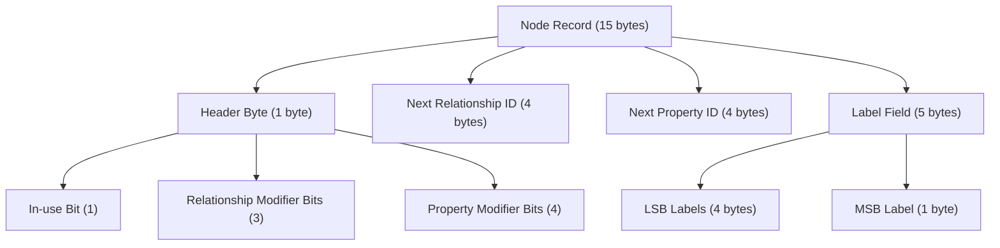
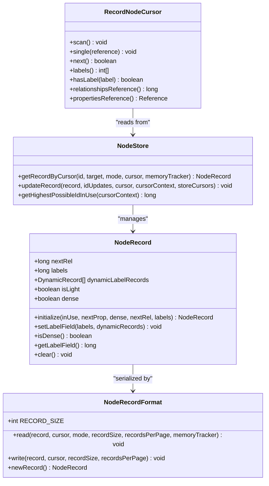
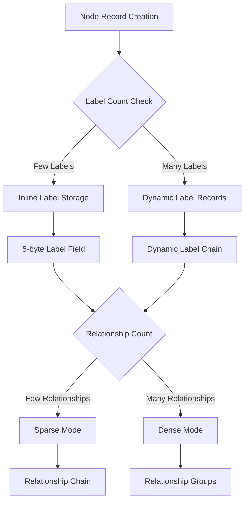
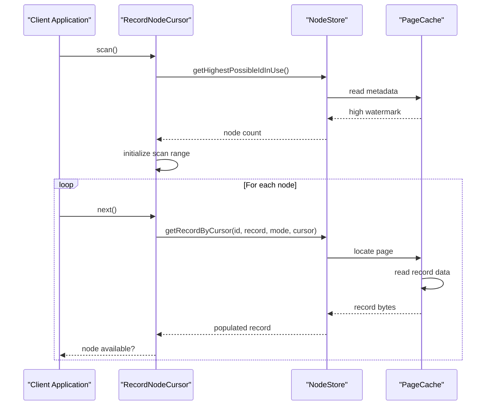
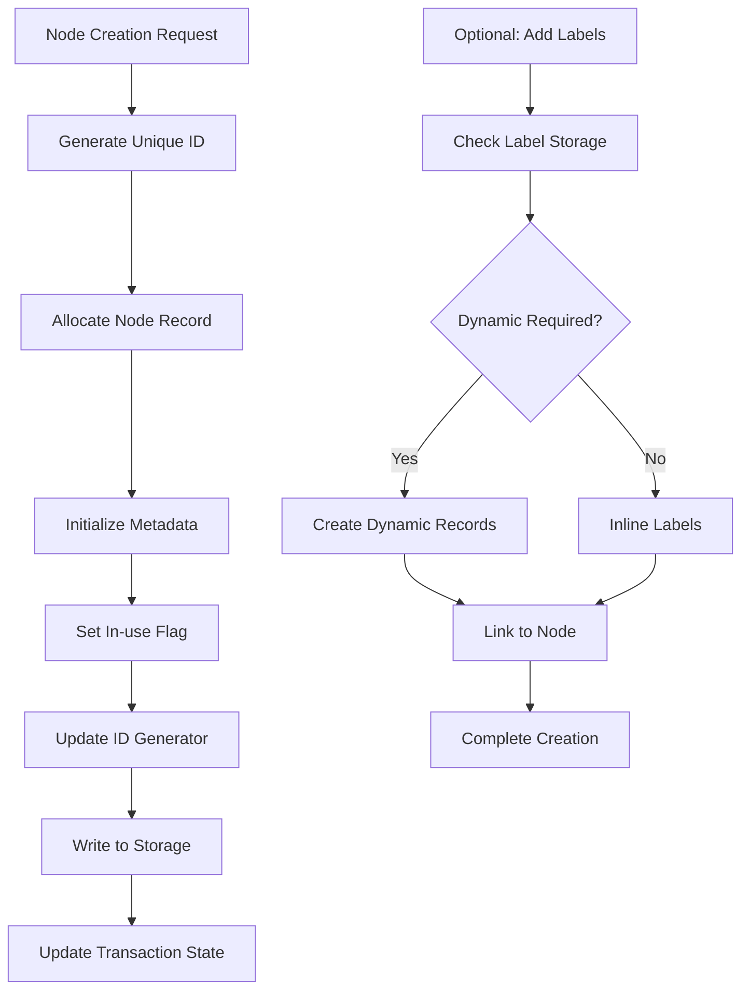
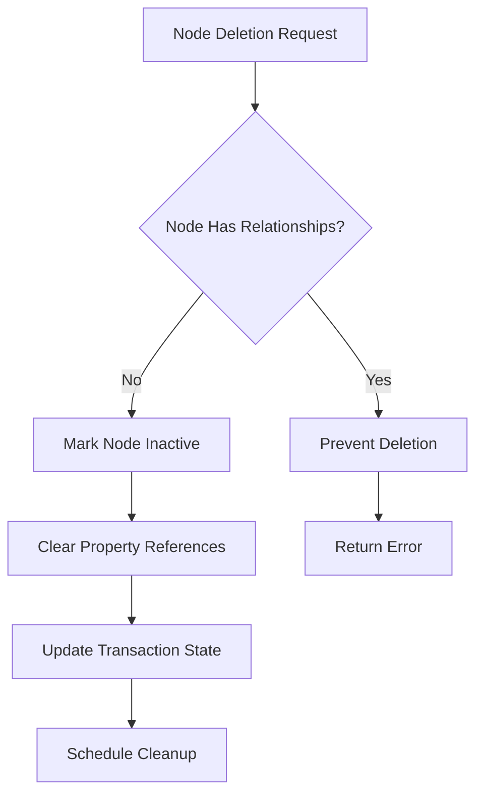
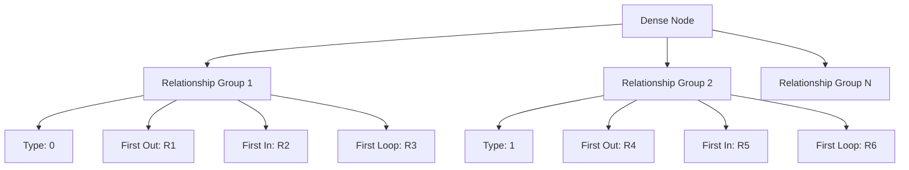

# Node Storage

<cite>
**Referenced Files in This Document**
- [NodeRecord.java](file://community/record-storage-engine/src/main/java/org/neo4j/kernel/impl/store/record/NodeRecord.java)
- [NodeRecordFormat.java](file://community/record-storage-engine/src/main/java/org/neo4j/kernel/impl/store/format/standard/NodeRecordFormat.java)
- [RecordNodeCursor.java](file://community/record-storage-engine/src/main/java/org/neo4j/internal/recordstorage/RecordNodeCursor.java)
- [RecordNodeScan.java](file://community/record-storage-engine/src/main/java/org/neo4j/internal/recordstorage/RecordNodeScan.java)
- [NodeStore.java](file://community/record-storage-engine/src/main/java/org/neo4j/kernel/impl/store/NodeStore.java)
- [NodeLabelsField.java](file://community/kernel/src/main/java/org/neo4j/kernel/impl/store/NodeLabelsField.java)
- [RelationshipGroupRecord.java](file://community/record-storage-engine/src/main/java/org/neo4j/kernel/impl/store/record/RelationshipGroupRecord.java)
- [RelationshipGroupStore.java](file://community/record-storage-engine/src/main/java/org/neo4j/kernel/impl/store/RelationshipGroupStore.java)
- [RelationshipCreator.java](file://community/record-storage-engine/src/main/java/org/neo4j/internal/recordstorage/RelationshipCreator.java)
- [TransactionRecordState.java](file://community/record-storage-engine/src/main/java/org/neo4j/internal/recordstorage/TransactionRecordState.java)
- [LogCommandSerializationV5_0.java](file://community/record-storage-engine/src/main/java/org/neo4j/internal/recordstorage/LogCommandSerializationV5_0.java)
- [RecordIdType.java](file://community/record-storage-engine/src/main/java/org/neo4j/internal/recordstorage/RecordIdType.java)
</cite>

## Table of Contents
1. [Introduction](#introduction)
2. [Node Record Structure](#node-record-structure)
3. [Domain Model Components](#domain-model-components)
4. [Storage Format and Encoding](#storage-format-and-encoding)
5. [Node Cursor Architecture](#node-cursor-architecture)
6. [Node Operations](#node-operations)
7. [Dense Nodes and Relationship Groups](#dense-nodes-and-relationship-groups)
8. [Common Issues and Solutions](#common-issues-and-solutions)
9. [Performance Considerations](#performance-considerations)
10. [Troubleshooting Guide](#troubleshooting-guide)
11. [Conclusion](#conclusion)

## Introduction

Neo4j's Node Storage subsystem is a fundamental component responsible for managing the persistent storage of graph nodes. It handles the complex task of storing node metadata, relationships, properties, and labels while optimizing for both performance and storage efficiency. The subsystem employs sophisticated encoding schemes, cursor-based access patterns, and specialized handling for dense nodes to provide optimal performance across different usage scenarios.

The node storage system operates at multiple abstraction levels, from low-level record format specifications to high-level cursor interfaces that provide convenient access patterns for graph operations. Understanding this subsystem is crucial for developers working with Neo4j's storage engine, database administrators managing large-scale deployments, and anyone interested in the inner workings of graph database storage mechanisms.

## Node Record Structure

### Fixed-Length Record Format

Each node in Neo4j is represented by a fixed-length record structure that optimizes both storage density and access performance. The standard node record format consists of 15 bytes organized as follows:

**Diagram sources**
- [NodeRecordFormat.java](file://community/record-storage-engine/src/main/java/org/neo4j/kernel/impl/store/format/standard/NodeRecordFormat.java#L31-L32)

### Bit-Level Encoding Details

The header byte contains critical metadata encoded in specific bit positions:

| Bit Position | Purpose | Description |
|--------------|---------|-------------|
| 0 | In-use Flag | Indicates whether the record is currently in use |
| 1-3 | Relationship Modifier | Higher bits for relationship ID storage |
| 4-7 | Property Modifier | Higher bits for property ID storage |

The label field uses a sophisticated encoding scheme that can store up to 5 bytes of label information inline or reference dynamic records for larger label sets.

**Section sources**
- [NodeRecordFormat.java](file://community/record-storage-engine/src/main/java/org/neo4j/kernel/impl/store/format/standard/NodeRecordFormat.java#L55-L81)

### Record Lifecycle Management

Node records undergo several states during their lifecycle:

1. **Uninitialized**: Created with default values
2. **Initialized**: Assigned initial metadata
3. **Active**: Fully populated with data
4. **Deleted**: Marked for removal but still accessible
5. **Reclaimed**: Physical space freed during cleanup

## Domain Model Components

### Core Classes Overview

The node storage subsystem is built around several key domain classes that represent different aspects of node storage:

**Diagram sources**
- [NodeRecord.java](file://community/record-storage-engine/src/main/java/org/neo4j/kernel/impl/store/record/NodeRecord.java#L31-L163)
- [NodeRecordFormat.java](file://community/record-storage-engine/src/main/java/org/neo4j/kernel/impl/store/format/standard/NodeRecordFormat.java#L29-L116)
- [RecordNodeCursor.java](file://community/record-storage-engine/src/main/java/org/neo4j/internal/recordstorage/RecordNodeCursor.java#L54-L456)
- [NodeStore.java](file://community/record-storage-engine/src/main/java/org/neo4j/kernel/impl/store/NodeStore.java#L32-L101)

### NodeRecord Properties

The NodeRecord class encapsulates all node metadata and maintains several critical properties:

- **nextRel**: Pointer to the first relationship in the node's relationship chain
- **labels**: Encoded label information (inline or reference to dynamic records)
- **dynamicLabelRecords**: Collection of dynamic records containing additional label information
- **isLight**: Indicates whether the record contains minimal label information
- **dense**: Flag indicating whether the node uses relationship groups

**Section sources**
- [NodeRecord.java](file://community/record-storage-engine/src/main/java/org/neo4j/kernel/impl/store/record/NodeRecord.java#L33-L38)

## Storage Format and Encoding

### Record Format Specifications

The node record format implements a compact encoding scheme that maximizes storage efficiency while maintaining fast access patterns. The format supports both sparse and dense node configurations:

**Diagram sources**
- [NodeLabelsField.java](file://community/kernel/src/main/java/org/neo4j/kernel/impl/store/NodeLabelsField.java#L32-L61)
- [NodeRecordFormat.java](file://community/record-storage-engine/src/main/java/org/neo4j/kernel/impl/store/format/standard/NodeRecordFormat.java#L69-L70)

### Label Storage Mechanism

Neo4j employs a hybrid label storage approach that balances storage efficiency with access performance:

| Storage Method | Use Case | Storage Size | Access Pattern |
|----------------|----------|--------------|----------------|
| Inline Labels | Few labels (< 5 bytes) | 5 bytes total | Direct access |
| Dynamic Records | Many labels | Variable | Chain traversal |
| Mixed Mode | Partial inline + dynamic | Optimized | Hybrid access |

The label field encoding uses the first byte as a header that indicates whether labels are stored inline or referenced via dynamic records.

**Section sources**
- [NodeLabelsField.java](file://community/kernel/src/main/java/org/neo4j/kernel/impl/store/NodeLabelsField.java#L32-L61)

### Relationship Chain Linkage

Nodes maintain relationships through two distinct linkage mechanisms:

1. **Sparse Mode**: Direct chaining of relationship records
2. **Dense Mode**: Group-based relationship organization

The choice between modes depends on the relationship count threshold configured for the database.

**Section sources**
- [RelationshipCreator.java](file://community/record-storage-engine/src/main/java/org/neo4j/internal/recordstorage/RelationshipCreator.java#L224-L226)

## Node Cursor Architecture

### Cursor Design Patterns

The node storage subsystem employs a cursor-based architecture that provides flexible and efficient access patterns for different use cases:

**Diagram sources**
- [RecordNodeCursor.java](file://community/record-storage-engine/src/main/java/org/neo4j/internal/recordstorage/RecordNodeCursor.java#L95-L120)
- [RecordNodeCursor.java](file://community/record-storage-engine/src/main/java/org/neo4j/internal/recordstorage/RecordNodeCursor.java#L338-L370)

### Cursor Types and Usage

The system provides different cursor types optimized for specific access patterns:

| Cursor Type | Purpose | Performance | Memory Usage |
|-------------|---------|-------------|--------------|
| Single Cursor | Access specific node | High | Low |
| Scan Cursor | Full database traversal | Medium | Medium |
| Batch Cursor | Range-based access | High | Medium |

**Section sources**
- [RecordNodeCursor.java](file://community/record-storage-engine/src/main/java/org/neo4j/internal/recordstorage/RecordNodeCursor.java#L109-L120)

### Cursor State Management

Node cursors maintain state information to support efficient iteration and resource management:

- **Current Position**: Tracks the next node to process
- **High Watermark**: Defines the scan boundary
- **Load Mode**: Controls record loading behavior
- **Resource Pool**: Manages cursor lifecycle

**Section sources**
- [RecordNodeCursor.java](file://community/record-storage-engine/src/main/java/org/neo4j/internal/recordstorage/RecordNodeCursor.java#L382-L389)

## Node Operations

### Node Creation Process

Node creation involves multiple steps that ensure data consistency and proper resource allocation:

**Diagram sources**
- [TransactionRecordState.java](file://community/record-storage-engine/src/main/java/org/neo4j/internal/recordstorage/TransactionRecordState.java#L511-L518)

### Node Modification Operations

Node modifications follow a transactional pattern that ensures consistency:

1. **Load Current State**: Retrieve existing node record
2. **Modify Metadata**: Update required fields
3. **Validate Changes**: Ensure data integrity
4. **Write Updates**: Persist changes to storage
5. **Update Indexes**: Maintain database indexes

**Section sources**
- [TransactionRecordState.java](file://community/record-storage-engine/src/main/java/org/neo4j/internal/recordstorage/TransactionRecordState.java#L483-L504)

### Node Deletion Handling

Node deletion requires careful handling of relationships and properties:

**Diagram sources**
- [LogCommandSerializationV5_0.java](file://community/record-storage-engine/src/main/java/org/neo4j/internal/recordstorage/LogCommandSerializationV5_0.java#L102-L125)

**Section sources**
- [LogCommandSerializationV5_0.java](file://community/record-storage-engine/src/main/java/org/neo4j/internal/recordstorage/LogCommandSerializationV5_0.java#L102-L125)

## Dense Nodes and Relationship Groups

### Dense Node Threshold

Neo4j automatically converts nodes to dense mode when they exceed the relationship threshold configured for the database. This threshold is typically set to optimize for different workload patterns.

### Relationship Group Structure

Dense nodes use relationship groups to organize relationships efficiently:

**Diagram sources**
- [RelationshipGroupRecord.java](file://community/record-storage-engine/src/main/java/org/neo4j/kernel/impl/store/record/RelationshipGroupRecord.java#L33-L70)
- [RelationshipGroupStore.java](file://community/record-storage-engine/src/main/java/org/neo4j/kernel/impl/store/RelationshipGroupStore.java#L32-L69)

### Group-Based Relationship Access

Dense nodes provide optimized access patterns through relationship groups:

| Access Pattern | Performance | Use Case |
|----------------|-------------|----------|
| Type-based Lookup | Excellent | Filter by relationship type |
| Directional Traversal | Good | Navigate specific directions |
| Degree Calculation | Excellent | Fast degree computation |

**Section sources**
- [RelationshipCreator.java](file://community/record-storage-engine/src/main/java/org/neo4j/internal/recordstorage/RelationshipCreator.java#L224-L311)

## Common Issues and Solutions

### Node Record Fragmentation

Fragmentation occurs when deleted nodes leave gaps in the node ID space, potentially impacting performance:

**Symptoms:**
- Increased scan times
- Higher memory usage during scans
- Reduced cache hit rates

**Solutions:**
- Regular defragmentation processes
- Automatic cleanup of unused records
- Intelligent ID allocation strategies

### High ID Management

Managing high IDs efficiently is crucial for performance:

**Best Practices:**
- Monitor ID growth patterns
- Configure appropriate ID reservation sizes
- Implement periodic ID compaction

### Storage Overhead Optimization

Several strategies minimize storage overhead:

| Technique | Benefit | Implementation |
|-----------|---------|----------------|
| Record Reuse | Reduces allocation overhead | Efficient cursor pooling |
| Label Compression | Minimizes label storage | Smart encoding schemes |
| Relationship Grouping | Optimizes relationship storage | Group-based organization |

**Section sources**
- [RecordIdType.java](file://community/record-storage-engine/src/main/java/org/neo4j/internal/recordstorage/RecordIdType.java#L24-L46)

## Performance Considerations

### Access Pattern Optimization

Different access patterns benefit from specific optimization strategies:

- **Sequential Scans**: Use dedicated scan cursors with prefetching
- **Random Access**: Leverage cursor caching and connection pooling
- **Bulk Operations**: Implement batch processing with reduced context switching

### Memory Management

Efficient memory usage is critical for node storage performance:

- **Record Pooling**: Reuse node record instances
- **Cursor Lifecycle**: Properly manage cursor allocation and deallocation
- **Buffer Management**: Optimize page cache utilization

### I/O Optimization

Storage I/O patterns significantly impact performance:

- **Sequential Access**: Group related operations
- **Prefetching**: Anticipate access patterns
- **Batch Operations**: Minimize individual I/O operations

## Troubleshooting Guide

### Common Problems and Solutions

**Problem: Slow Node Queries**
- **Cause**: Inefficient access patterns or excessive label filtering
- **Solution**: Review query patterns and consider index optimization

**Problem: High Memory Usage**
- **Cause**: Excessive cursor allocation or large label sets
- **Solution**: Implement cursor pooling and optimize label storage

**Problem: Storage Fragmentation**
- **Cause**: Frequent node creation/deletion cycles
- **Solution**: Enable automatic defragmentation and cleanup processes

### Diagnostic Tools

The system provides several diagnostic capabilities:

- **Cursor Statistics**: Track cursor usage patterns
- **Memory Profiling**: Monitor memory allocation patterns
- **I/O Metrics**: Analyze storage access patterns

### Performance Monitoring

Key metrics to monitor for node storage performance:

| Metric | Purpose | Normal Range |
|--------|---------|--------------|
| Cursor Allocation Rate | Resource usage | < 100/sec |
| Memory Usage | Memory pressure | < 80% of heap |
| I/O Latency | Storage performance | < 10ms avg |

## Conclusion

Neo4j's Node Storage subsystem represents a sophisticated approach to graph database storage that balances performance, scalability, and ease of use. Through careful design of record formats, cursor architectures, and access patterns, it provides efficient storage and retrieval of graph nodes while accommodating diverse usage scenarios from small development databases to large production deployments.

The subsystem's strength lies in its ability to adapt to different workload patterns through mechanisms like dense node conversion, hybrid label storage, and intelligent cursor management. Understanding these components and their interactions is essential for optimizing Neo4j deployments and troubleshooting performance issues.

Future developments in the node storage subsystem continue to focus on improving performance for large-scale deployments, enhancing storage efficiency, and providing better tooling for database administrators and developers working with Neo4j's powerful graph storage capabilities.