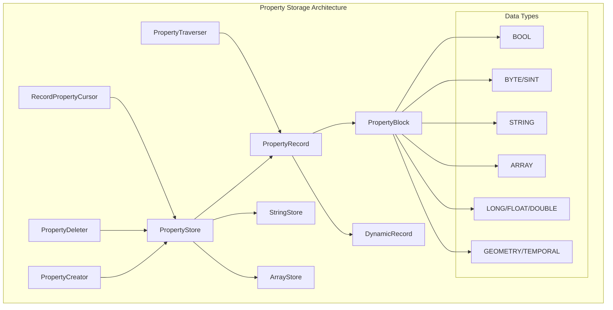
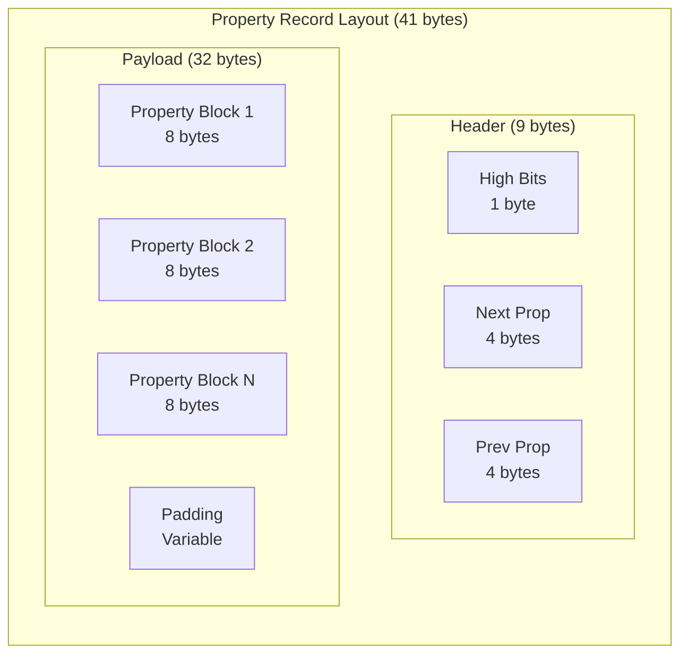
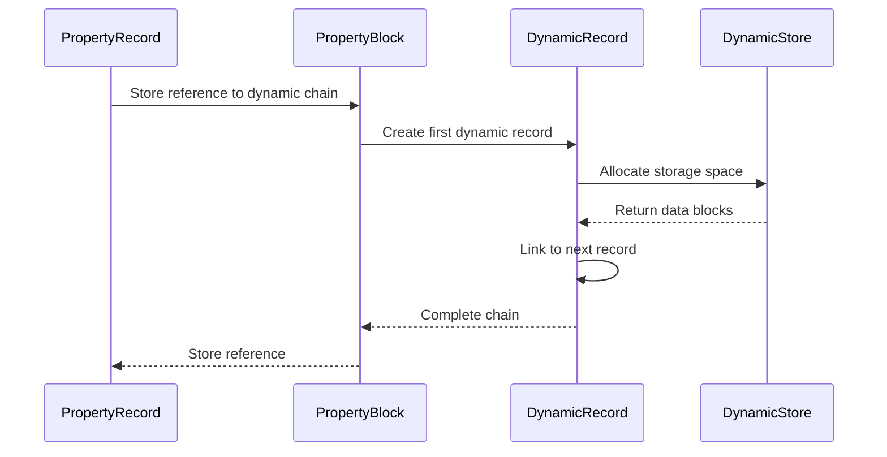
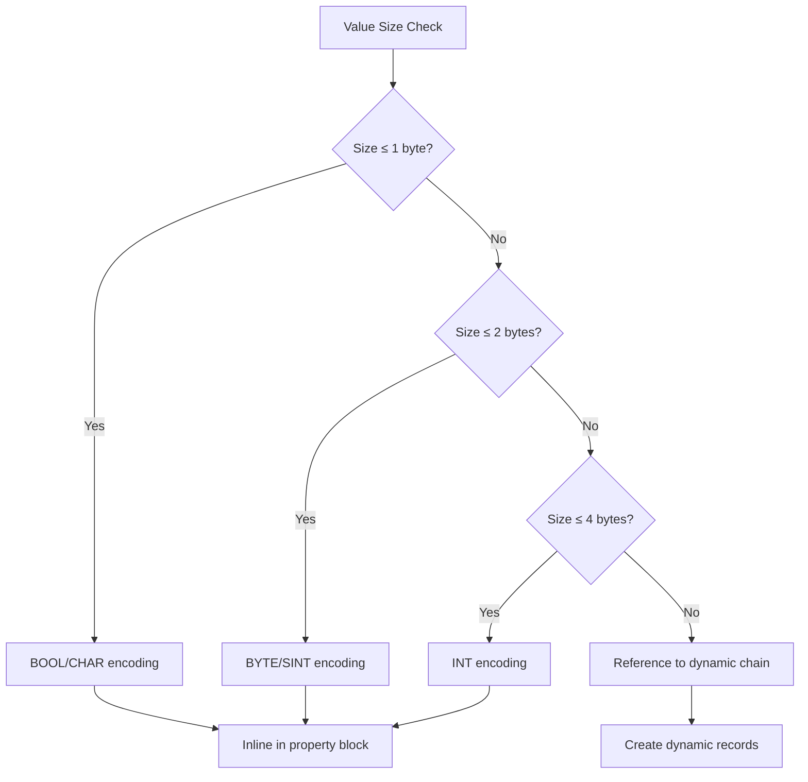
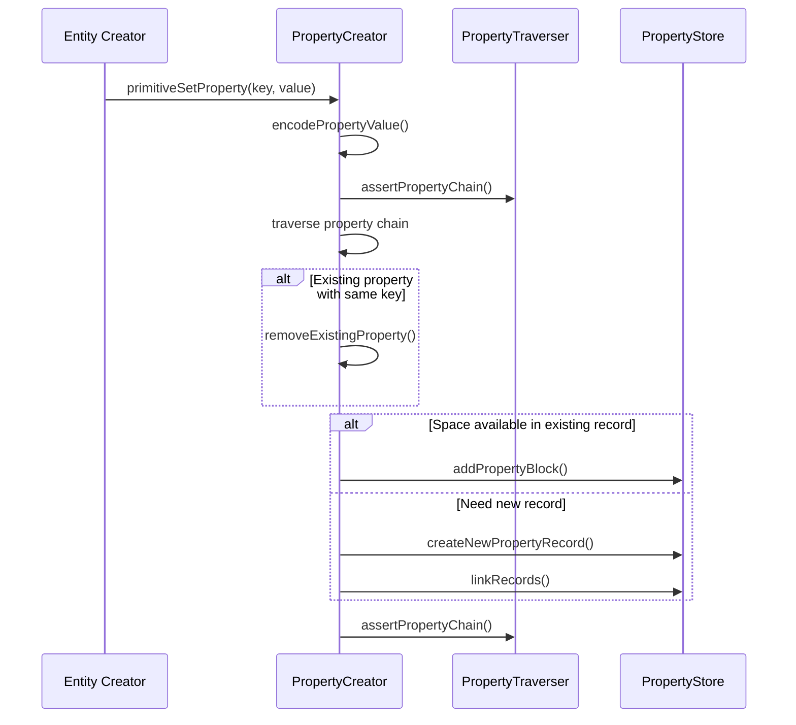
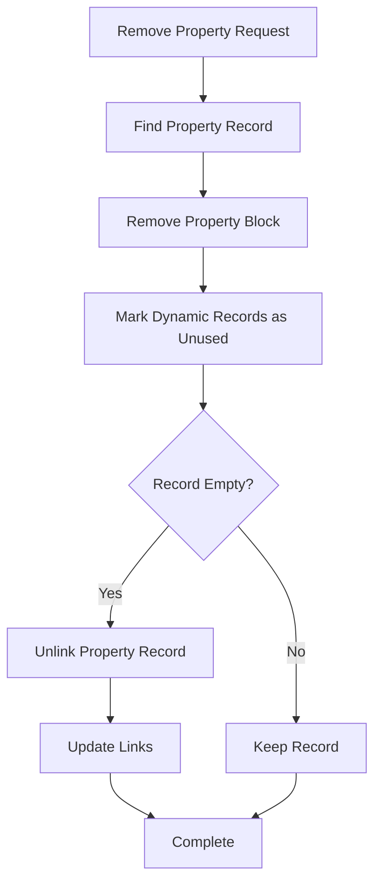
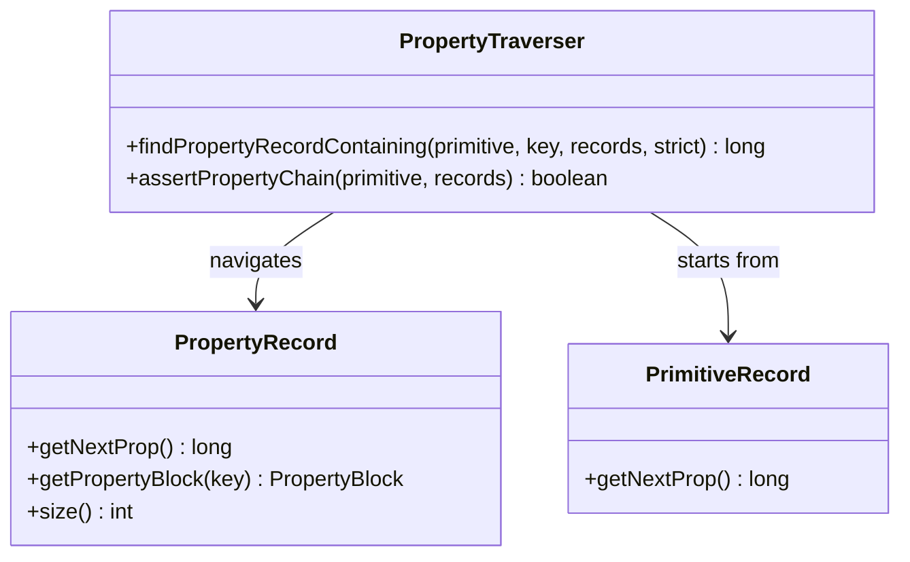
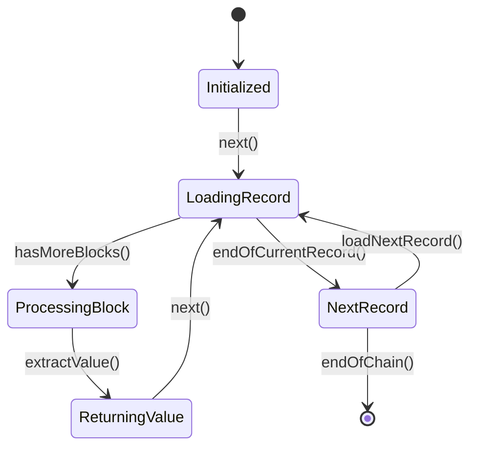
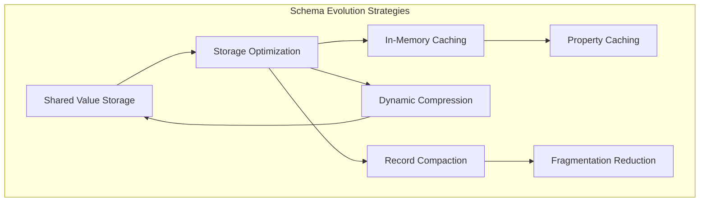

# Property Storage

<cite>
**Referenced Files in This Document**
- [PropertyRecord.java](file://community/record-storage-engine/src/main/java/org/neo4j/kernel/impl/store/record/PropertyRecord.java)
- [PropertyRecordFormat.java](file://community/record-storage-engine/src/main/java/org/neo4j/kernel/impl/store/format/standard/PropertyRecordFormat.java)
- [PropertyTraverser.java](file://community/record-storage-engine/src/main/java/org/neo4j/internal/recordstorage/PropertyTraverser.java)
- [RecordPropertyCursor.java](file://community/record-storage-engine/src/main/java/org/neo4j/internal/recordstorage/RecordPropertyCursor.java)
- [PropertyType.java](file://community/record-storage-engine/src/main/java/org/neo4j/kernel/impl/store/PropertyType.java)
- [PropertyCreator.java](file://community/record-storage-engine/src/main/java/org/neo4j/internal/recordstorage/PropertyCreator.java)
- [PropertyDeleter.java](file://community/record-storage-engine/src/main/java/org/neo4j/internal/recordstorage/PropertyDeleter.java)
- [PropertyBlock.java](file://community/record-storage-engine/src/main/java/org/neo4j/kernel/impl/store/record/PropertyBlock.java)
- [PropertyStore.java](file://community/record-storage-engine/src/main/java/org/neo4j/kernel/impl/store/PropertyStore.java)
- [DynamicRecord.java](file://community/record-storage-engine/src/main/java/org/neo4j/kernel/impl/store/record/DynamicRecord.java)
- [SchemaStorage.java](file://community/record-storage-engine/src/main/java/org/neo4j/internal/recordstorage/SchemaStorage.java)
</cite>

## Table of Contents
1. [Introduction](#introduction)
2. [Architecture Overview](#architecture-overview)
3. [Core Components](#core-components)
4. [Property Record Format](#property-record-format)
5. [Dynamic Record Chains](#dynamic-record-chains)
6. [Property Types and Encoding](#property-types-and-encoding)
7. [Property Operations](#property-operations)
8. [Access Patterns](#access-patterns)
9. [Schema Evolution and Optimization](#schema-evolution-and-optimization)
10. [Common Issues and Solutions](#common-issues-and-solutions)
11. [Performance Considerations](#performance-considerations)
12. [Conclusion](#conclusion)

## Introduction

Neo4j's Property Storage subsystem is a sophisticated mechanism for storing, accessing, and managing property key-value pairs associated with nodes and relationships. This system forms the foundation of Neo4j's ability to store rich metadata alongside graph entities, enabling complex queries and efficient property-based operations.

The property storage system employs a hybrid approach combining fixed-size property blocks with dynamic record chains to handle both small inlined values and large variable-length data efficiently. This design optimizes storage density while maintaining fast access patterns for common property operations.

## Architecture Overview

The Property Storage subsystem consists of several interconnected components that work together to provide efficient property management:

**Diagram sources**
- [PropertyRecord.java](file://community/record-storage-engine/src/main/java/org/neo4j/kernel/impl/store/record/PropertyRecord.java#L46-L426)
- [PropertyStore.java](file://community/record-storage-engine/src/main/java/org/neo4j/kernel/impl/store/PropertyStore.java#L154-L200)
- [PropertyType.java](file://community/record-storage-engine/src/main/java/org/neo4j/kernel/impl/store/PropertyType.java#L35-L287)

## Core Components

### PropertyRecord

The PropertyRecord serves as the primary container for property blocks, forming a doubly-linked list that connects multiple records together. Each PropertyRecord can hold one or more PropertyBlocks, with a maximum payload size determined by the record format.

**Key characteristics:**
- Fixed-size header containing linkage information
- Payload area for property blocks (default 32 bytes)
- Doubly-linked list structure for efficient traversal
- Lazy loading mechanism for property blocks

**Section sources**
- [PropertyRecord.java](file://community/record-storage-engine/src/main/java/org/neo4j/kernel/impl/store/record/PropertyRecord.java#L46-L426)

### PropertyBlock

PropertyBlock represents individual property key-value pairs within a PropertyRecord. Each block contains both the property key identifier and the encoded value, with different encoding strategies depending on value size and type.

**Key characteristics:**
- Contains property key and value data
- Supports multiple value types with different encoding strategies
- Can reference dynamic records for large values
- Implements lazy loading for heavy values

**Section sources**
- [PropertyBlock.java](file://community/record-storage-engine/src/main/java/org/neo4j/kernel/impl/store/record/PropertyBlock.java#L55-L310)

### PropertyStore

The PropertyStore manages the overall property storage system, coordinating between fixed-size property records and dynamic storage areas for large values. It provides the interface for property creation, deletion, and access operations.

**Key characteristics:**
- Manages property records and dynamic storage
- Handles value encoding and decoding
- Coordinates with string and array stores
- Provides transactional consistency

**Section sources**
- [PropertyStore.java](file://community/record-storage-engine/src/main/java/org/neo4j/kernel/impl/store/PropertyStore.java#L154-L697)

## Property Record Format

### Fixed-Length Header Structure

Property records use a compact fixed-length format optimized for storage efficiency:

**Diagram sources**
- [PropertyRecordFormat.java](file://community/record-storage-engine/src/main/java/org/neo4j/kernel/impl/store/format/standard/PropertyRecordFormat.java#L37-L40)

### Bit-Level Encoding

The property block header uses a sophisticated bit-level encoding scheme:

| Field | Size (bits) | Position | Description |
|-------|-------------|----------|-------------|
| Type | 4 | 24-27 | Property type identifier |
| Key | 20 | 4-23 | Property key index ID |
| Inline Flag | 1 | 28 | Indicates inlined vs reference value |
| Reserved | 3 | 29-31 | Reserved for future use |

**Section sources**
- [PropertyRecordFormat.java](file://community/record-storage-engine/src/main/java/org/neo4j/kernel/impl/store/format/standard/PropertyRecordFormat.java#L55-L171)

## Dynamic Record Chains

### Large Value Storage Strategy

For values that exceed the inline capacity of property blocks, Neo4j employs dynamic record chains:

**Diagram sources**
- [DynamicRecord.java](file://community/record-storage-engine/src/main/java/org/neo4j/kernel/impl/store/record/DynamicRecord.java#L31-L195)
- [PropertyStore.java](file://community/record-storage-engine/src/main/java/org/neo4j/kernel/impl/store/PropertyStore.java#L157-L160)

### Chain Management

Dynamic record chains provide several benefits:
- **Scalability**: Handle arbitrarily large values
- **Fragmentation Control**: Efficient memory utilization
- **Compression**: Shared storage for similar values
- **Garbage Collection**: Easy cleanup of unused chains

**Section sources**
- [DynamicRecord.java](file://community/record-storage-engine/src/main/java/org/neo4j/kernel/impl/store/record/DynamicRecord.java#L31-L195)

## Property Types and Encoding

### Supported Data Types

Neo4j supports a comprehensive set of property types, each with optimized encoding strategies:

| Type | Size | Encoding | Use Case |
|------|------|----------|----------|
| BOOL | 1 byte | Single bit | Boolean flags |
| BYTE | 1 byte | Signed integer | Small integers |
| SHORT | 2 bytes | Signed integer | Medium integers |
| INT | 4 bytes | Signed integer | Standard integers |
| LONG | 8/16 bytes | Variable | Large integers |
| FLOAT | 4 bytes | IEEE 754 | Floating-point |
| DOUBLE | 8 bytes | IEEE 754 | High precision |
| CHAR | 2 bytes | Unicode | Single characters |
| STRING | 8 bytes ref | Variable | Text data |
| ARRAY | 8 bytes ref | Variable | Collections |
| SHORT_STRING | 1-32 bytes | Inline | Short text |
| SHORT_ARRAY | 1-32 bytes | Inline | Small collections |
| GEOMETRY | Variable | Encoded | Spatial data |
| TEMPORAL | Variable | Encoded | Date/time data |

**Section sources**
- [PropertyType.java](file://community/record-storage-engine/src/main/java/org/neo4j/kernel/impl/store/PropertyType.java#L35-L287)

### Inlining Strategies

Small values are inlined directly into property blocks:

**Diagram sources**
- [PropertyType.java](file://community/record-storage-engine/src/main/java/org/neo4j/kernel/impl/store/PropertyType.java#L36-L112)

## Property Operations

### Property Creation

The PropertyCreator handles the complex process of adding properties to entities:

**Diagram sources**
- [PropertyCreator.java](file://community/record-storage-engine/src/main/java/org/neo4j/internal/recordstorage/PropertyCreator.java#L57-L194)

### Property Deletion

Property deletion involves careful cleanup of both property blocks and associated dynamic records:

**Diagram sources**
- [PropertyDeleter.java](file://community/record-storage-engine/src/main/java/org/neo4j/internal/recordstorage/PropertyDeleter.java#L204-L298)

**Section sources**
- [PropertyCreator.java](file://community/record-storage-engine/src/main/java/org/neo4j/internal/recordstorage/PropertyCreator.java#L57-L194)
- [PropertyDeleter.java](file://community/record/storage-engine/src/main/java/org/neo4j/internal/recordstorage/PropertyDeleter.java#L204-L298)

## Access Patterns

### PropertyTraverser

The PropertyTraverser provides efficient navigation through property chains:

**Diagram sources**
- [PropertyTraverser.java](file://community/record-storage-engine/src/main/java/org/neo4j/internal/recordstorage/PropertyTraverser.java#L29-L100)

### RecordPropertyCursor

The RecordPropertyCursor provides streaming access to property values with minimal memory overhead:

**Diagram sources**
- [RecordPropertyCursor.java](file://community/record-storage-engine/src/main/java/org/neo4j/internal/recordstorage/RecordPropertyCursor.java#L64-L435)

**Section sources**
- [PropertyTraverser.java](file://community/record-storage-engine/src/main/java/org/neo4j/internal/recordstorage/PropertyTraverser.java#L29-L100)
- [RecordPropertyCursor.java](file://community/record-storage-engine/src/main/java/org/neo4j/internal/recordstorage/RecordPropertyCursor.java#L64-L435)

## Schema Evolution and Optimization

### Schema-Aware Storage

Neo4j's property storage system adapts to schema changes through several mechanisms:

**Diagram sources**
- [SchemaStorage.java](file://community/record-storage-engine/src/main/java/org/neo4j/internal/recordstorage/SchemaStorage.java#L171-L339)

### Storage Optimization Techniques

The system employs several optimization strategies:

| Technique | Description | Benefit |
|-----------|-------------|---------|
| Property Compression | Deduplicate identical values | Reduced storage footprint |
| Record Compaction | Merge empty records | Improved access patterns |
| Value Sharing | Reuse dynamic records | Memory efficiency |
| Type-Specific Encoding | Optimized encodings per type | Better compression ratios |

**Section sources**
- [SchemaStorage.java](file://community/record-storage-engine/src/main/java/org/neo4j/internal/recordstorage/SchemaStorage.java#L171-L339)

## Common Issues and Solutions

### Property Fragmentation

**Problem**: Frequent property additions and deletions can lead to fragmented storage chains.

**Solution**: The system implements automatic compaction during maintenance windows and provides hints for manual optimization.

### Memory Overhead

**Problem**: Large property values can consume significant memory during access.

**Solution**: Lazy loading mechanisms and streaming cursors minimize memory usage while maintaining performance.

### Transaction Consistency

**Problem**: Concurrent modifications can lead to inconsistent property states.

**Solution**: The PropertyStore maintains transactional consistency through careful ordering and validation of operations.

**Section sources**
- [PropertyDeleter.java](file://community/record-storage-engine/src/main/java/org/neo4j/internal/recordstorage/PropertyDeleter.java#L111-L119)

## Performance Considerations

### Access Patterns Optimization

The property storage system optimizes for common access patterns:

- **Sequential Traversal**: Efficient iteration through property chains
- **Random Access**: Fast lookup by property key
- **Streaming Operations**: Minimal memory footprint for large properties
- **Batch Operations**: Optimized bulk property modifications

### Storage Efficiency

Several factors contribute to storage efficiency:

- **Inline Encoding**: Small values stored directly in records
- **Dynamic Chaining**: Large values shared across entities
- **Type-Specific Formats**: Optimized encodings for each data type
- **Compression Opportunities**: Identical values share storage

### Scalability Factors

The system scales effectively with:

- **Record Size**: Configurable payload sizes for different workloads
- **Chain Length**: Efficient handling of long property chains
- **Memory Management**: Careful buffer allocation and reuse
- **Concurrency**: Lock-free operations where possible

## Conclusion

Neo4j's Property Storage subsystem represents a sophisticated balance between storage efficiency, access performance, and functional flexibility. Through its hybrid approach of fixed-size property blocks and dynamic record chains, it provides optimal storage for both small inline values and large variable-length data.

The system's strength lies in its adaptive nature, automatically optimizing storage based on value characteristics while maintaining consistent access patterns. The separation of concerns between PropertyRecord, PropertyBlock, and DynamicRecord components enables both high performance and maintainable code.

Key advantages of this design include:
- **Efficient Storage**: Optimized for both small and large values
- **Fast Access**: Multiple access patterns for different use cases
- **Scalable Design**: Handles varying property densities and sizes
- **Transactional Safety**: Maintains consistency across concurrent operations
- **Evolutionary Flexibility**: Adapts to changing schema requirements

This architecture serves as a foundation for Neo4j's ability to support complex graph applications while maintaining excellent performance characteristics across diverse workloads.