# Record Storage

<cite>
**Referenced Files in This Document**
- [RecordStorageEngine.java](file://community/record-storage-engine/src/main/java/org/neo4j/internal/recordstorage/RecordStorageEngine.java)
- [RecordStorageReader.java](file://community/record-storage-engine/src/main/java/org/neo4j/internal/recordstorage/RecordStorageReader.java)
- [NodeRecord.java](file://community/record-storage-engine/src/main/java/org/neo4j/kernel/impl/store/record/NodeRecord.java)
- [PropertyRecord.java](file://community/record-storage-engine/src/main/java/org/neo4j/kernel/impl/store/record/PropertyRecord.java)
- [RelationshipRecord.java](file://community/record-storage-engine/src/main/java/org/neo4j/kernel/impl/store/record/RelationshipRecord.java)
- [DynamicRecord.java](file://community/record-storage-engine/src/main/java/org/neo4j/kernel/impl/store/record/DynamicRecord.java)
- [NodeRecordFormat.java](file://community/record-storage-engine/src/main/java/org/neo4j/kernel/impl/store/format/standard/NodeRecordFormat.java)
- [PropertyRecordFormat.java](file://community/record-storage-engine/src/main/java/org/neo4j/kernel/impl/store/format/standard/PropertyRecordFormat.java)
- [RelationshipRecordFormat.java](file://community/record-storage-engine/src/main/java/org/neo4j/kernel/impl/store/format/standard/RelationshipRecordFormat.java)
- [DynamicRecordFormat.java](file://community/record-storage-engine/src/main/java/org/neo4j/kernel/impl/store/format/standard/DynamicRecordFormat.java)
- [Record.java](file://community/record-storage-engine/src/main/java/org/neo4j/kernel/impl/store/record/Record.java)
- [AbstractDynamicStore.java](file://community/record-storage-engine/src/main/java/org/neo4j/kernel/impl/store/AbstractDynamicStore.java)
- [RecordStore.java](file://community/record-storage-engine/src/main/java/org/neo4j/kernel/impl/store/RecordStore.java)
- [RecordAccess.java](file://community/record-storage-engine/src/main/java/org/neo4j/internal/recordstorage/RecordAccess.java)
- [RecordFormats.java](file://community/record-storage-engine/src/main/java/org/neo4j/kernel/impl/store/format/RecordFormats.java)
- [RecordDatabaseLayout.java](file://community/layout/src/main/java/org/neo4j/io/layout/recordstorage/RecordDatabaseLayout.java)
- [RecordDatabaseFile.java](file://community/layout/src/main/java/org/neo4j/io/layout/recordstorage/RecordDatabaseFile.java)
- [RecordStorageMigrator.java](file://community/record-storage-engine/src/main/java/org/neo4j/kernel/impl/storemigration/RecordStorageMigrator.java)
</cite>

## Table of Contents
1. [Introduction](#introduction)
2. [System Architecture](#system-architecture)
3. [Core Components](#core-components)
4. [Record Formats and Layout](#record-formats-and-layout)
5. [Dynamic Record Chains](#dynamic-record-chains)
6. [Property Storage Strategies](#property-storage-strategies)
7. [Page Cache Integration](#page-cache-integration)
8. [Storage Engine Operations](#storage-engine-operations)
9. [Schema Evolution and Migration](#schema-evolution-and-migration)
10. [Performance Optimization](#performance-optimization)
11. [Common Issues and Solutions](#common-issues-and-solutions)
12. [Conclusion](#conclusion)

## Introduction

The Record Storage subsystem of Neo4j's Storage Engine provides a sophisticated, efficient mechanism for representing nodes, relationships, and properties on disk. This system implements a fixed-length record structure with intelligent overflow handling for variable-length data, enabling high-performance graph operations while maintaining data integrity and supporting schema evolution.

The subsystem operates on the principle of separating concerns between different types of data: fixed-size records for frequently accessed information (nodes, relationships) and dynamic records for variable-length data (large properties, extensive label lists). This design enables optimal memory usage patterns and efficient disk I/O operations.

## System Architecture

The Record Storage subsystem follows a layered architecture that separates storage concerns from business logic:

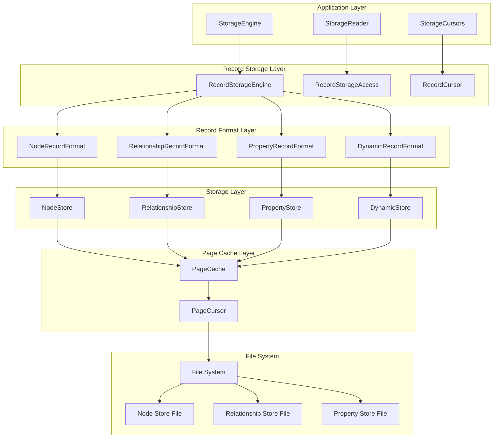

**Diagram sources**
- [RecordStorageEngine.java](file://community/record-storage-engine/src/main/java/org/neo4j/internal/recordstorage/RecordStorageEngine.java#L142-L200)
- [RecordStorageReader.java](file://community/record-storage-engine/src/main/java/org/neo4j/internal/recordstorage/RecordStorageReader.java#L60-L87)

**Section sources**
- [RecordStorageEngine.java](file://community/record-storage-engine/src/main/java/org/neo4j/internal/recordstorage/RecordStorageEngine.java#L142-L200)
- [RecordStorageReader.java](file://community/record-storage-engine/src/main/java/org/neo4j/internal/recordstorage/RecordStorageReader.java#L57-L87)

## Core Components

### RecordStorageEngine

The central orchestrator of the record storage system, managing all storage operations and coordinating between different store components.

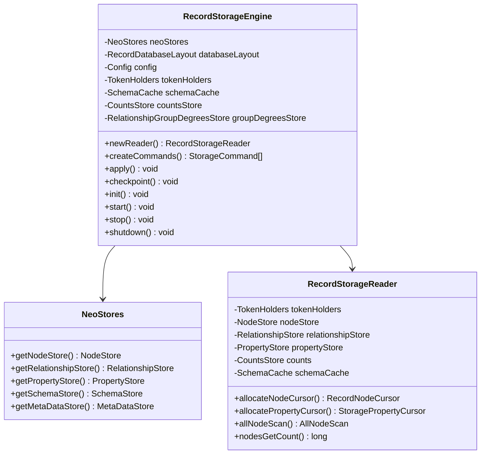

**Diagram sources**
- [RecordStorageEngine.java](file://community/record-storage-engine/src/main/java/org/neo4j/internal/recordstorage/RecordStorageEngine.java#L142-L200)
- [RecordStorageReader.java](file://community/record-storage-engine/src/main/java/org/neo4j/internal/recordstorage/RecordStorageReader.java#L60-L87)

### Domain Model Components

The system defines several key record types that represent different aspects of graph data:

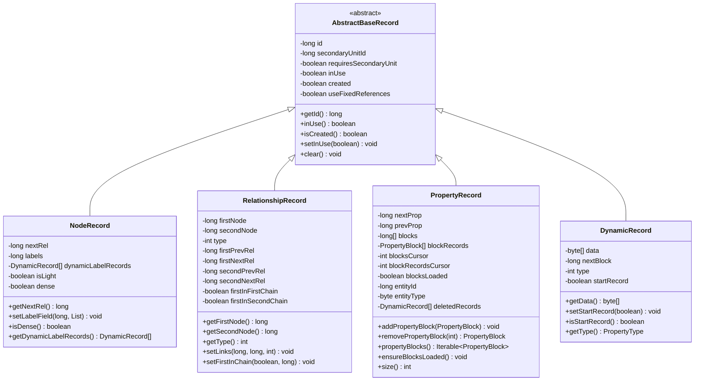

**Diagram sources**
- [NodeRecord.java](file://community/record-storage-engine/src/main/java/org/neo4j/kernel/impl/store/record/NodeRecord.java#L32-L42)
- [RelationshipRecord.java](file://community/record-storage-engine/src/main/java/org/neo4j/kernel/impl/store/record/RelationshipRecord.java#L29-L42)
- [PropertyRecord.java](file://community/record-storage-engine/src/main/java/org/neo4j/kernel/impl/store/record/PropertyRecord.java#L46-L82)
- [DynamicRecord.java](file://community/record-storage-engine/src/main/java/org/neo4j/kernel/impl/store/record/DynamicRecord.java#L33-L51)

**Section sources**
- [NodeRecord.java](file://community/record-storage-engine/src/main/java/org/neo4j/kernel/impl/store/record/NodeRecord.java#L32-L165)
- [RelationshipRecord.java](file://community/record-storage-engine/src/main/java/org/neo4j/kernel/impl/store/record/RelationshipRecord.java#L29-L289)
- [PropertyRecord.java](file://community/record-storage-engine/src/main/java/org/neo4j/kernel/impl/store/record/PropertyRecord.java#L46-L426)
- [DynamicRecord.java](file://community/record-storage-engine/src/main/java/org/neo4j/kernel/impl/store/record/DynamicRecord.java#L33-L79)

## Record Formats and Layout

### Fixed-Length Record Structure

Each record type implements a specific format optimized for its data characteristics:

| Record Type | Size | Purpose | Key Fields |
|-------------|------|---------|------------|
| NodeRecord | 15 bytes | Node metadata | nextRel, nextProp, labels, dense flag |
| RelationshipRecord | 34 bytes | Relationship metadata | firstNode, secondNode, type, chains |
| PropertyRecord | 41 bytes | Property containers | prevProp, nextProp, property blocks |
| DynamicRecord | Variable | Variable data | data payload, nextBlock |

### Bit-Level Encoding

The system employs sophisticated bit-level encoding to maximize storage efficiency:

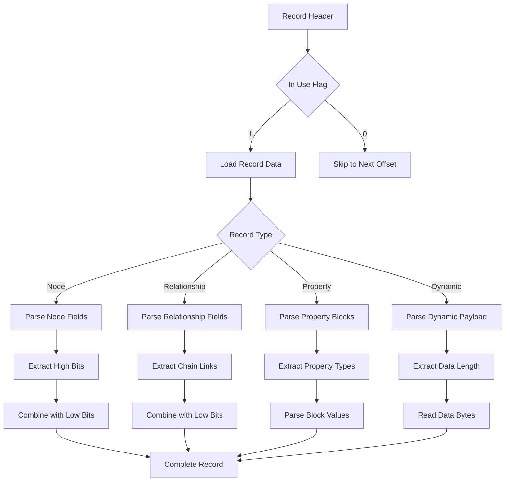

**Diagram sources**
- [NodeRecordFormat.java](file://community/record-storage-engine/src/main/java/org/neo4j/kernel/impl/store/format/standard/NodeRecordFormat.java#L47-L81)
- [RelationshipRecordFormat.java](file://community/record-storage-engine/src/main/java/org/neo4j/kernel/impl/store/format/standard/RelationshipRecordFormat.java#L55-L116)

### Secondary Unit Support

For records that exceed their fixed size, the system supports secondary units:

```mermaid
sequenceDiagram
participant App as Application
participant RS as RecordStorage
participant RF as RecordFormat
participant PC as PageCache
App->>RS : Request Large Property
RS->>RF : Check Record Capacity
RF->>RF : Calculate Required Units
alt Requires Secondary Unit
RF->>PC : Allocate Secondary Unit
PC-->>RF : Secondary Unit ID
RF->>RF : Set Secondary Unit Flags
end
RF-->>RS : Complete Record
RS-->>App : Record with Secondary Unit
```

**Diagram sources**
- [Record.java](file://community/record-storage-engine/src/main/java/org/neo4j/kernel/impl/store/record/Record.java#L38-L65)

**Section sources**
- [NodeRecordFormat.java](file://community/record-storage-engine/src/main/java/org/neo4j/kernel/impl/store/format/standard/NodeRecordFormat.java#L29-L116)
- [RelationshipRecordFormat.java](file://community/record-storage-engine/src/main/java/org/neo4j/kernel/impl/store/format/standard/RelationshipRecordFormat.java#L29-L186)
- [PropertyRecordFormat.java](file://community/record-storage-engine/src/main/java/org/neo4j/kernel/impl/store/format/standard/PropertyRecordFormat.java#L32-L171)
- [DynamicRecordFormat.java](file://community/record-storage-engine/src/main/java/org/neo4j/kernel/impl/store/format/standard/DynamicRecordFormat.java#L31-L164)

## Dynamic Record Chains

### Variable-Length Data Handling

Large properties and extensive label lists are stored using dynamic record chains:

```mermaid
graph LR
subgraph "Dynamic Record Chain"
DR1[DynamicRecord 1<br/>Start Record<br/>Type: STRING<br/>Data: "Hello World..."]
DR2[DynamicRecord 2<br/>Linked Record<br/>Type: STRING<br/>Data: "... continuation"]
DR3[DynamicRecord 3<br/>Linked Record<br/>Type: STRING<br/>Data: "... more data"]
DR1 --> |nextBlock| DR2
DR2 --> |nextBlock| DR3
DR3 --> |nextBlock| NULL[NULL Reference]
end
subgraph "Property Block"
PB[PropertyBlock<br/>Key: name<br/>Type: STRING<br/>Value: Reference to DR1]
end
PB -.-> DR1
```

**Diagram sources**
- [DynamicRecord.java](file://community/record-storage-engine/src/main/java/org/neo4j/kernel/impl/store/record/DynamicRecord.java#L33-L79)
- [AbstractDynamicStore.java](file://community/record-storage-engine/src/main/java/org/neo4j/kernel/impl/store/AbstractDynamicStore.java#L117-L209)

### Chain Management

The system maintains integrity through careful chain management:

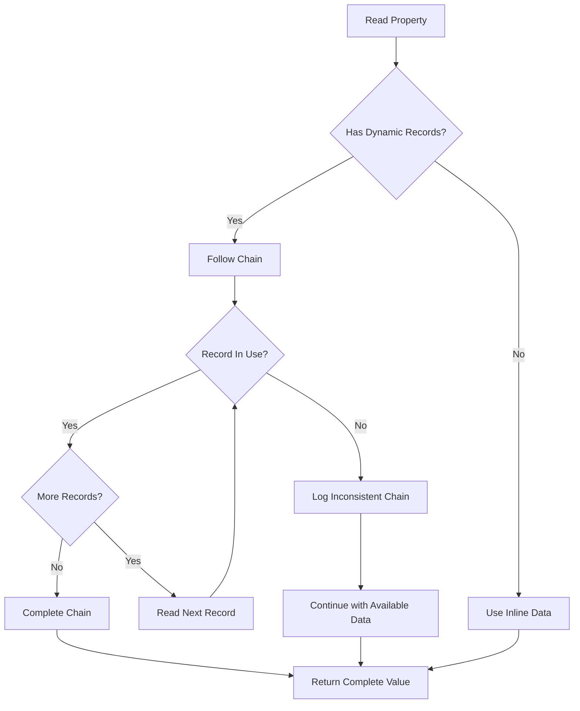

**Diagram sources**
- [AbstractDynamicStore.java](file://community/record-storage-engine/src/main/java/org/neo4j/kernel/impl/store/AbstractDynamicStore.java#L176-L209)

**Section sources**
- [DynamicRecord.java](file://community/record-storage-engine/src/main/java/org/neo4j/kernel/impl/store/record/DynamicRecord.java#L33-L79)
- [AbstractDynamicStore.java](file://community/record-storage-engine/src/main/java/org/neo4j/kernel/impl/store/AbstractDynamicStore.java#L117-L313)

## Property Storage Strategies

### Inlining vs Overflow

The system intelligently chooses between inline storage and dynamic overflow:

| Property Type | Inline Size | Storage Method | Use Case |
|---------------|-------------|----------------|----------|
| BOOLEAN | 8 bytes | Inline | Small boolean values |
| LONG | 8 bytes | Inline | Integer values |
| FLOAT | 8 bytes | Inline | Floating-point numbers |
| STRING | 23 bytes | Inline | Short strings |
| STRING | >23 bytes | Dynamic | Long strings |
| ARRAY | 120 bytes | Inline | Small arrays |
| ARRAY | >120 bytes | Dynamic | Large arrays |

### Property Block Organization

Property records contain multiple property blocks organized for efficient access:

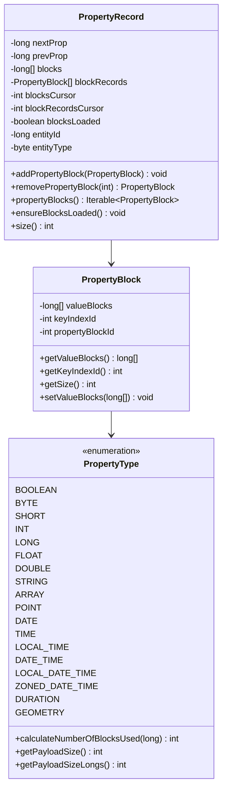

**Diagram sources**
- [PropertyRecord.java](file://community/record-storage-engine/src/main/java/org/neo4j/kernel/impl/store/record/PropertyRecord.java#L46-L82)

**Section sources**
- [PropertyRecord.java](file://community/record-storage-engine/src/main/java/org/neo4j/kernel/impl/store/record/PropertyRecord.java#L46-L426)
- [PropertyRecordFormat.java](file://community/record-storage-engine/src/main/java/org/neo4j/kernel/impl/store/format/standard/PropertyRecordFormat.java#L32-L171)

## Page Cache Integration

### Efficient Memory Management

The record storage system integrates seamlessly with Neo4j's page cache for optimal performance:

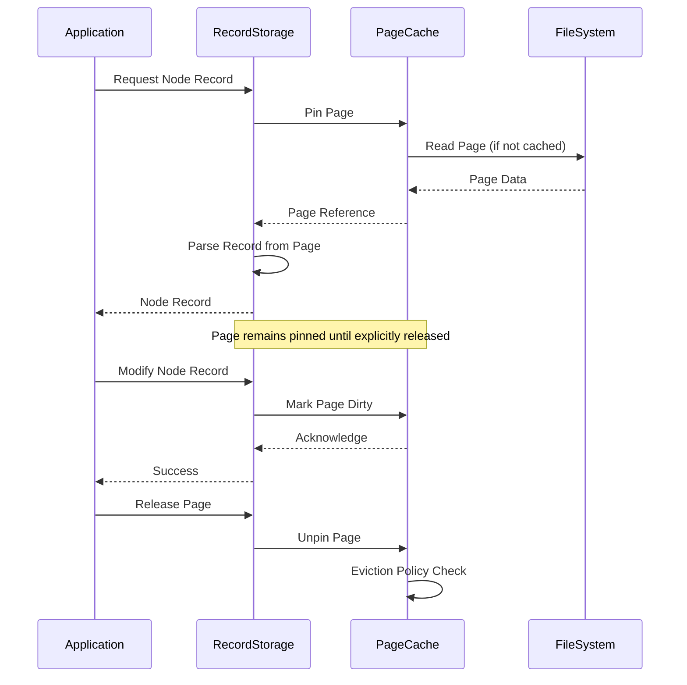

**Diagram sources**
- [RecordStore.java](file://community/record-storage-engine/src/main/java/org/neo4j/kernel/impl/store/RecordStore.java#L33-L176)

### Cursor-Based Access

The system provides cursor-based access for efficient record traversal:

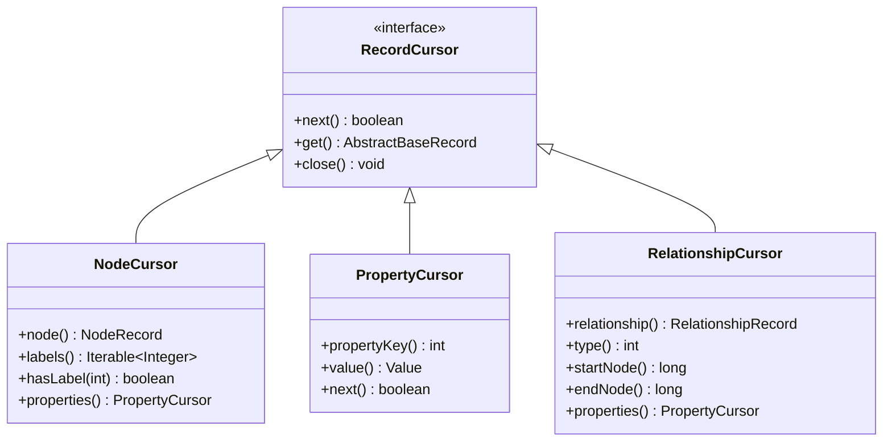

**Section sources**
- [RecordStore.java](file://community/record-storage-engine/src/main/java/org/neo4j/kernel/impl/store/RecordStore.java#L33-L176)

## Storage Engine Operations

### CRUD Operations

The RecordStorageEngine supports comprehensive CRUD operations:

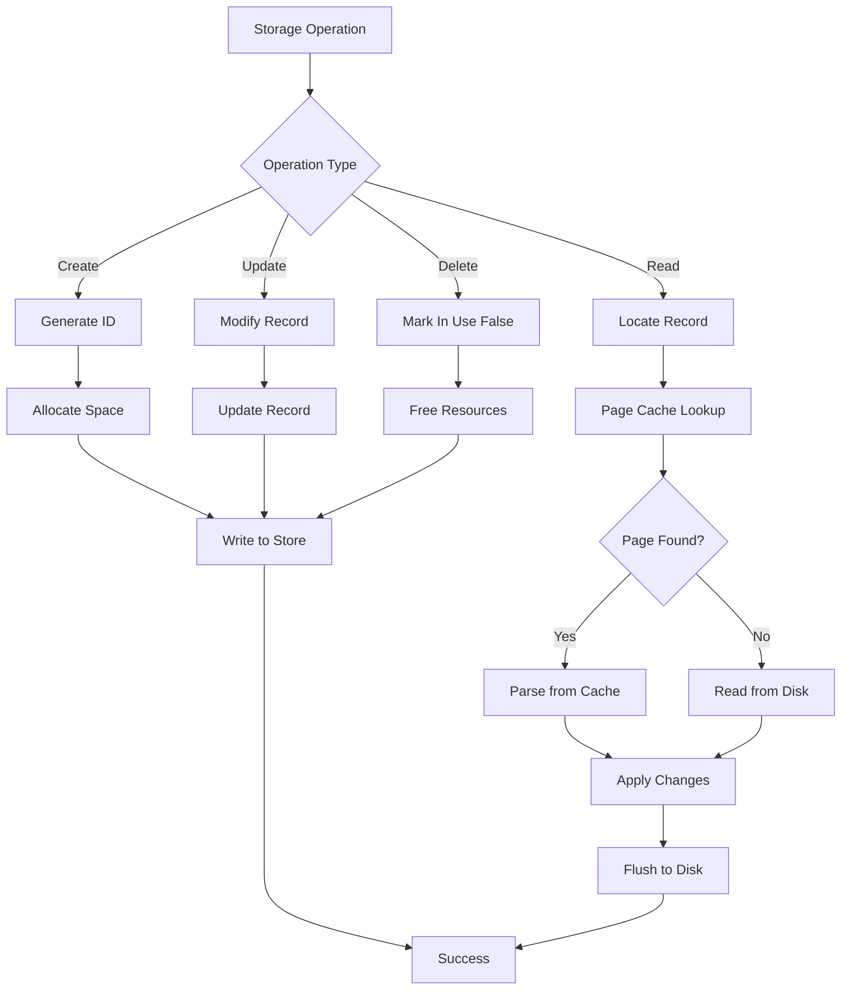

**Diagram sources**
- [RecordStorageEngine.java](file://community/record-storage-engine/src/main/java/org/neo4j/internal/recordstorage/RecordStorageEngine.java#L461-L528)

### Transaction Support

The system provides ACID guarantees through transactional operations:

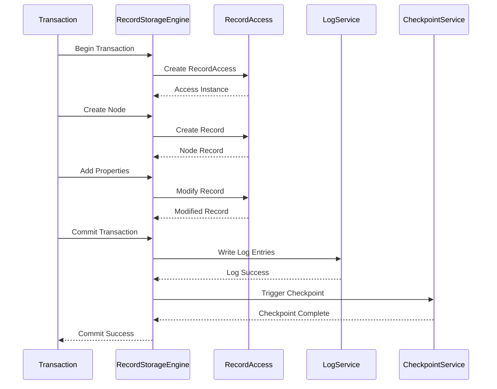

**Section sources**
- [RecordStorageEngine.java](file://community/record-storage-engine/src/main/java/org/neo4j/internal/recordstorage/RecordStorageEngine.java#L461-L528)
- [RecordAccess.java](file://community/record-storage-engine/src/main/java/org/neo4j/internal/recordstorage/RecordAccess.java#L32-L110)

## Schema Evolution and Migration

### Format Versioning

The system supports multiple record format versions with backward compatibility:

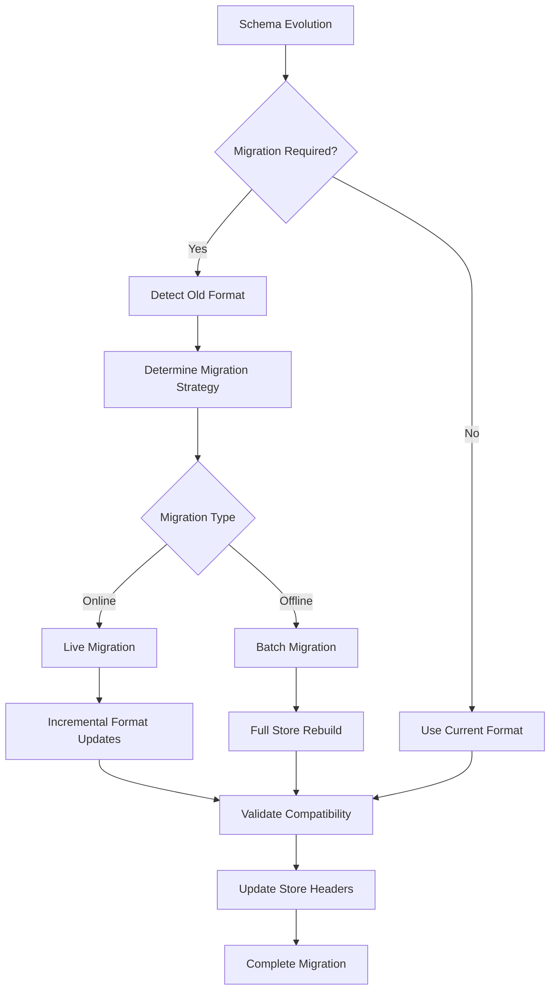

**Diagram sources**
- [RecordStorageMigrator.java](file://community/record-storage-engine/src/main/java/org/neo4j/kernel/impl/storemigration/RecordStorageMigrator.java#L149-L875)

### Capability-Based Migration

The system uses capability detection for intelligent migration decisions:

| Capability | Description | Migration Impact |
|------------|-------------|------------------|
| SECONDARY_RECORD_UNITS | Support for secondary units | May require format conversion |
| LITTLE_ENDIAN | Little-endian format support | Binary compatibility check |
| MULTI_VERSIONED | MVCC support | Transaction model change |
| RELATIONSHIP_TYPE_3BYTES | Extended relationship types | Schema definition update |

**Section sources**
- [RecordStorageMigrator.java](file://community/record-storage-engine/src/main/java/org/neo4j/kernel/impl/storemigration/RecordStorageMigrator.java#L149-L875)

## Performance Optimization

### Storage Efficiency Techniques

The system employs several optimization strategies:

1. **Bit Packing**: Compact representation of boolean flags and small integers
2. **Inline Storage**: Small values stored directly in record headers
3. **Compression**: Variable-length encoding for large numbers
4. **Caching**: Intelligent page caching with prefetching
5. **Batch Operations**: Bulk processing for improved throughput

### Memory Layout Optimization

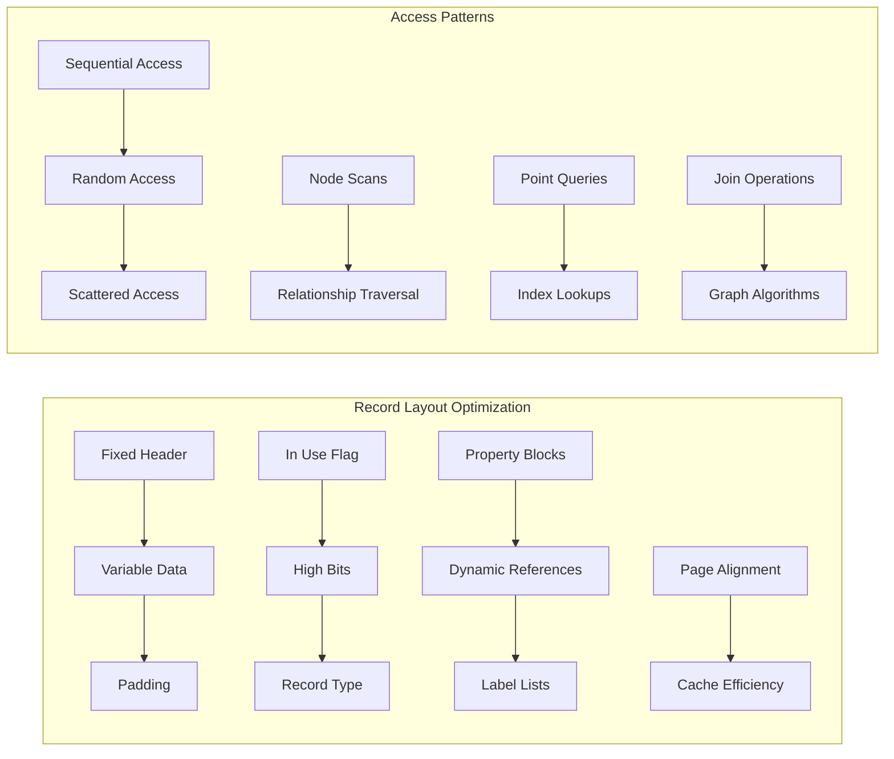

### Performance Monitoring

The system provides comprehensive performance metrics:

| Metric | Description | Optimization Target |
|--------|-------------|-------------------|
| Record Cache Hit Rate | Percentage of cache hits | >95% |
| Average Record Size | Mean size of stored records | Minimize fragmentation |
| Dynamic Chain Length | Average chain depth | <3 records |
| Page Fault Rate | Frequency of disk reads | Optimize access patterns |

## Common Issues and Solutions

### Record Fragmentation

**Problem**: Over time, records become fragmented due to frequent updates and deletions.

**Solution**: The system implements automatic compaction during checkpoints and idle periods.

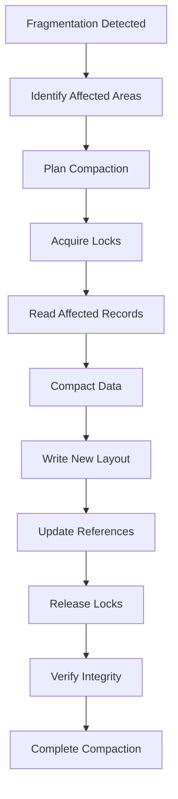

### Storage Overhead

**Problem**: Excessive storage overhead for small properties.

**Solution**: Automatic inlining of small values and intelligent threshold management.

### Schema Evolution Challenges

**Problem**: Maintaining compatibility during schema changes.

**Solution**: Capability-based migration with fallback strategies and validation.

### Performance Degradation

**Problem**: Slow performance due to inefficient access patterns.

**Solution**: Adaptive caching, prefetching, and query optimization.

**Section sources**
- [RecordStorageMigrator.java](file://community/record-storage-engine/src/main/java/org/neo4j/kernel/impl/storemigration/RecordStorageMigrator.java#L149-L875)

## Conclusion

The Record Storage subsystem of Neo4j's Storage Engine represents a sophisticated approach to graph data persistence. Through its combination of fixed-length records for frequently accessed data and dynamic record chains for variable-length content, it achieves an optimal balance between performance and flexibility.

Key strengths of the system include:

- **Efficient Storage**: Bit-level packing and intelligent inlining minimize storage overhead
- **Scalable Design**: Dynamic record chains handle arbitrarily large data while maintaining performance
- **Schema Evolution**: Capability-based migration ensures smooth upgrades and compatibility
- **Performance Optimization**: Advanced caching, prefetching, and batch operations maximize throughput
- **Reliability**: Comprehensive error handling and validation ensure data integrity

The modular architecture separates concerns effectively, making the system maintainable and extensible. The integration with Neo4j's page cache and transaction system provides enterprise-grade reliability and performance.

For developers working with Neo4j, understanding these storage mechanisms provides valuable insights into optimizing graph applications and troubleshooting performance issues. The system's design principles of efficiency, scalability, and reliability serve as excellent examples for building high-performance data storage systems.