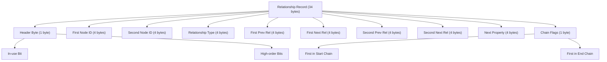
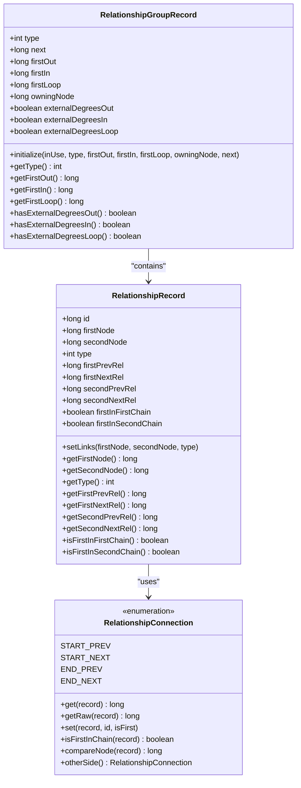
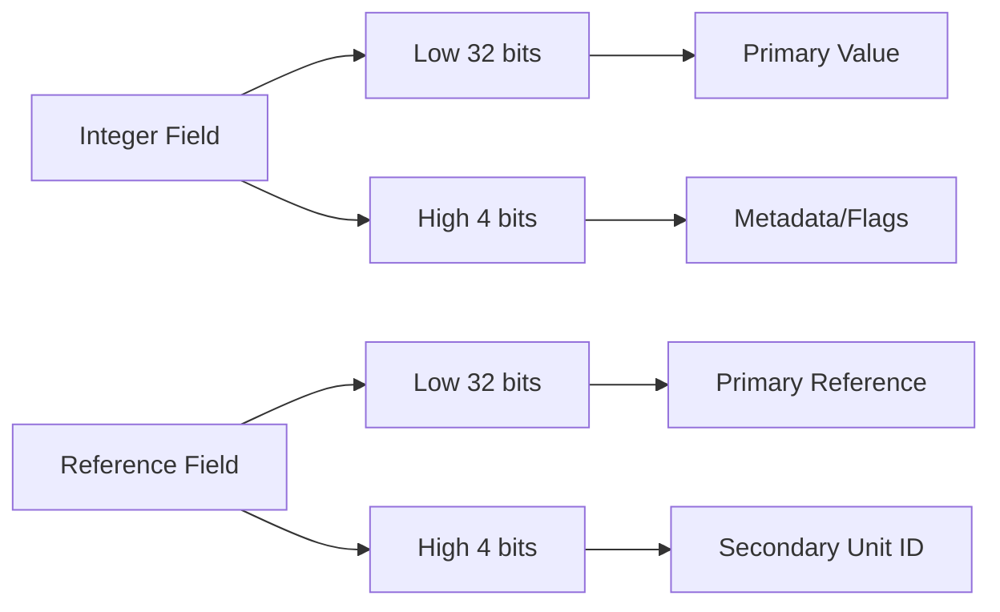
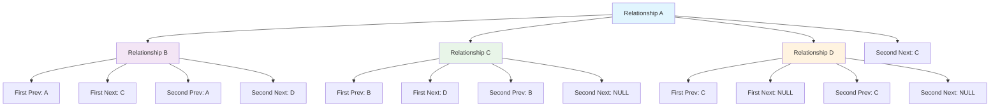
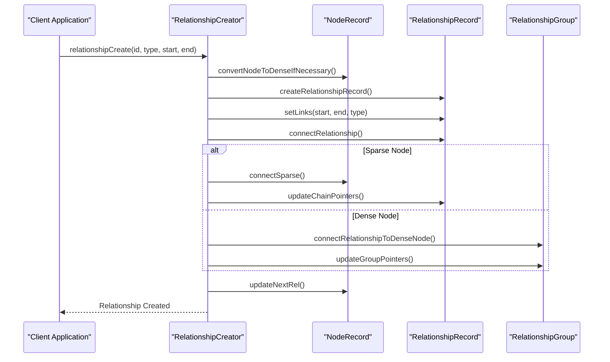
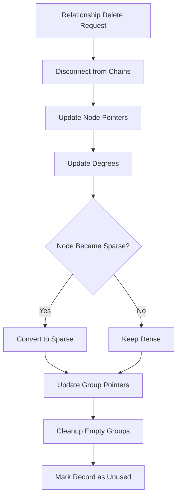
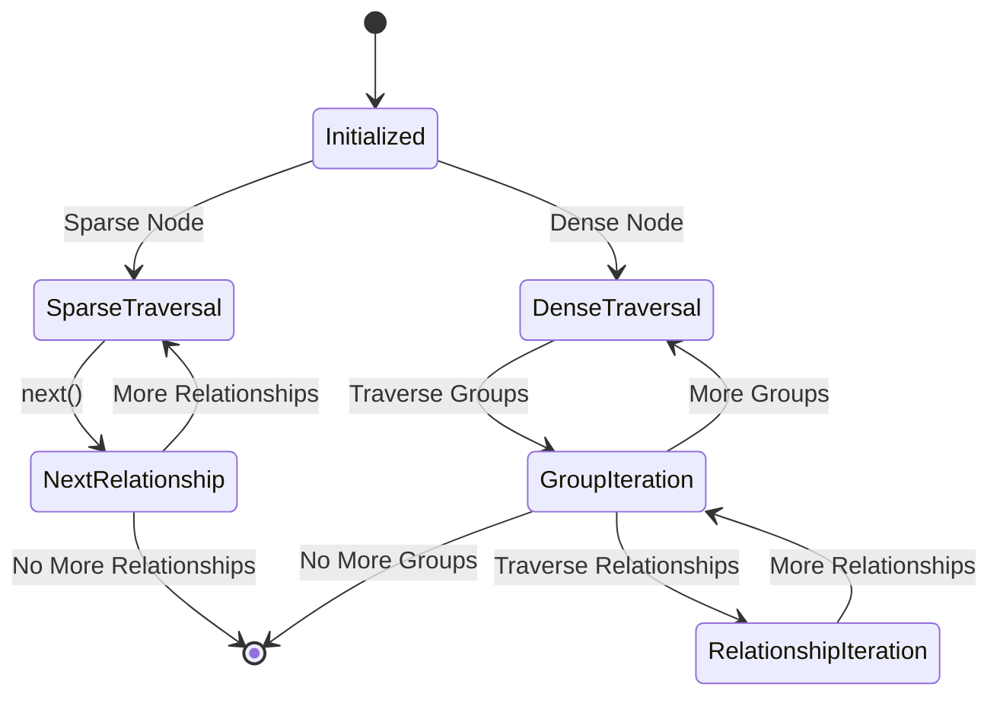
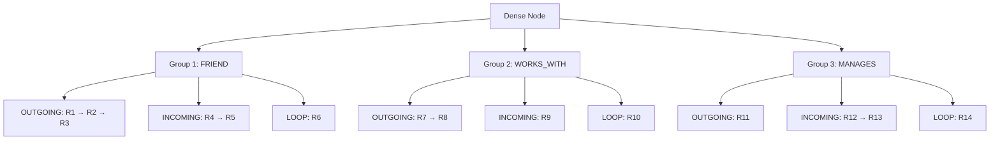
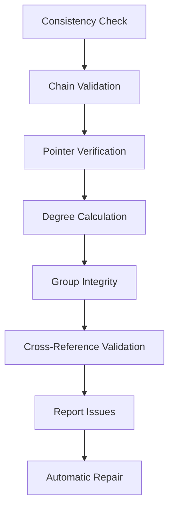

# Relationship Storage

<cite>
**Referenced Files in This Document**
- [RelationshipRecord.java](file://community/record-storage-engine/src/main/java/org/neo4j/kernel/impl/store/record/RelationshipRecord.java)
- [RelationshipRecordFormat.java](file://community/record-storage-engine/src/main/java/org/neo4j/kernel/impl/store/format/standard/RelationshipRecordFormat.java)
- [RelationshipConnection.java](file://community/record-storage-engine/src/main/java/org/neo4j/internal/recordstorage/RelationshipConnection.java)
- [RecordRelationshipTraversalCursor.java](file://community/record-storage-engine/src/main/java/org/neo4j/internal/recordstorage/RecordRelationshipTraversalCursor.java)
- [RelationshipCreator.java](file://community/record-storage-engine/src/main/java/org/neo4j/internal/recordstorage/RelationshipCreator.java)
- [RelationshipDeleter.java](file://community/record-storage-engine/src/main/java/org/neo4j/internal/recordstorage/RelationshipDeleter.java)
- [RelationshipGroupRecord.java](file://community/record-storage-engine/src/main/java/org/neo4j/kernel/impl/store/record/RelationshipGroupRecord.java)
- [RelationshipGroupRecordFormat.java](file://community/record-storage-engine/src/main/java/org/neo4j/kernel/impl/store/format/standard/RelationshipGroupRecordFormat.java)
- [RelationshipGroupGetter.java](file://community/record-storage-engine/src/main/java/org/neo4j/internal/recordstorage/RelationshipGroupGetter.java)
- [LogCommandSerializationV4_2.java](file://community/record-storage-engine/src/main/java/org/neo4j/internal/recordstorage/LogCommandSerializationV4_2.java)
- [LogCommandSerializationV5_0.java](file://community/record-storage-engine/src/main/java/org/neo4j/internal/recordstorage/LogCommandSerializationV5_0.java)
- [Record.java](file://community/record-storage-engine/src/main/java/org/neo4j/kernel/impl/store/record/Record.java)
- [RelationshipChainChecker.java](file://community/record-storage-engine/src/main/java/org/neo4j/consistency/checker/RelationshipChainChecker.java)
</cite>

## Table of Contents
1. [Introduction](#introduction)
2. [Relationship Record Structure](#relationship-record-structure)
3. [Domain Model](#domain-model)
4. [Storage Format and Encoding](#storage-format-and-encoding)
5. [Bidirectional Chaining Mechanism](#bidirectional-chaining-mechanism)
6. [Relationship Creation and Deletion](#relationship-creation-and-deletion)
7. [Traversal and Access Patterns](#traversal-and-access-patterns)
8. [High-Degree Nodes and Performance Optimization](#high-degree-nodes-and-performance-optimization)
9. [Storage Overhead and Indexing](#storage-overhead-and-indexing)
10. [Common Issues and Solutions](#common-issues-and-solutions)
11. [Conclusion](#conclusion)

## Introduction

Neo4j's Relationship Storage subsystem is a sophisticated component responsible for managing the persistence and retrieval of relationship data in the graph database. This system handles the complex task of storing relationships between nodes while maintaining efficient access patterns for graph traversal operations. The subsystem employs a dual-mode approach, supporting both traditional sparse relationships and high-performance dense node storage for nodes with many relationships.

The relationship storage system is built around several key concepts: fixed-length record structures, bidirectional chaining for efficient traversal, relationship groups for high-degree nodes, and sophisticated indexing mechanisms. These components work together to provide optimal performance for both sparse and dense graph scenarios.

## Relationship Record Structure

### Fixed-Length Record Format

Relationship records in Neo4j use a fixed-length structure that optimizes both storage efficiency and access performance. The standard relationship record format occupies 34 bytes of storage space, with each field carefully positioned to minimize memory usage while maximizing access speed.

**Diagram sources**
- [RelationshipRecordFormat.java](file://community/record-storage-engine/src/main/java/org/neo4j/kernel/impl/store/format/standard/RelationshipRecordFormat.java#L31-L35)

### Record Header and Flags

The relationship record begins with a header byte that encodes multiple flags and metadata:

| Bit Position | Flag Name | Purpose |
|--------------|-----------|---------|
| 0 | IN_USE | Indicates if the record is currently in use |
| 1 | CREATED_IN_TX | Marks if the relationship was created in the current transaction |
| 2 | REQUIRE_SECONDARY_UNIT | Signals need for secondary storage unit |
| 3 | HAS_SECONDARY_UNIT | Indicates presence of secondary storage unit |
| 4 | USES_FIXED_REFERENCE_FORMAT | Enables fixed reference format optimization |
| 5 | ADDITIONAL_FLAG_1 | General-purpose flag (relationship group external degrees) |
| 6 | ADDITIONAL_FLAG_2 | General-purpose flag (relationship property ownership) |
| 7 | ADDITIONAL_FLAG_3 | General-purpose flag (relationship property ownership) |

**Section sources**
- [Record.java](file://community/record-storage-engine/src/main/java/org/neo4j/kernel/impl/store/record/Record.java#L45-L65)
- [RelationshipRecordFormat.java](file://community/record-storage-engine/src/main/java/org/neo4j/kernel/impl/store/format/standard/RelationshipRecordFormat.java#L62-L186)

## Domain Model

### Core Components

The relationship storage system is built around several interconnected domain objects that represent different aspects of relationship management:

**Diagram sources**
- [RelationshipRecord.java](file://community/record-storage-engine/src/main/java/org/neo4j/kernel/impl/store/record/RelationshipRecord.java#L28-L287)
- [RelationshipGroupRecord.java](file://community/record-storage-engine/src/main/java/org/neo4j/kernel/impl/store/record/RelationshipGroupRecord.java#L28-L170)
- [RelationshipConnection.java](file://community/record-storage-engine/src/main/java/org/neo4j/internal/recordstorage/RelationshipConnection.java#L24-L207)

### RelationshipRecord Properties

The RelationshipRecord class encapsulates all the essential properties of a relationship:

- **Node References**: Stores references to both the start and end nodes
- **Type Information**: Contains the relationship type identifier
- **Chaining Links**: Maintains bidirectional pointers for relationship chains
- **Chain Position Flags**: Tracks whether the relationship is first in its respective chain
- **Property Chain**: Links to associated property records

**Section sources**
- [RelationshipRecord.java](file://community/record-storage-engine/src/main/java/org/neo4j/kernel/impl/store/record/RelationshipRecord.java#L28-L287)

## Storage Format and Encoding

### Bit-Level Encoding

Neo4j employs sophisticated bit-level encoding to maximize storage efficiency. The relationship record format uses several encoding strategies:

1. **High-Order Bit Encoding**: Utilizes unused bits in integer fields to store additional metadata
2. **Variable-Length References**: Employs fixed reference format for frequently accessed relationships
3. **Compact Type Storage**: Uses 16-bit integers for relationship types to save space

**Diagram sources**
- [RelationshipRecordFormat.java](file://community/record-storage-engine/src/main/java/org/neo4j/kernel/impl/store/format/standard/RelationshipRecordFormat.java#L69-L186)

### Format Versioning

The relationship storage system supports multiple format versions to accommodate evolving requirements:

| Format Version | Key Features | Compatibility |
|----------------|--------------|---------------|
| V4.2 | Basic relationship storage, fixed-length records | Backward compatible |
| V4.3 | Enhanced checksum support, improved encoding | Forward compatible |
| V5.0+ | Relationship groups, external degrees, fixed references | Modern features |

**Section sources**
- [LogCommandSerializationV4_2.java](file://community/record-storage-engine/src/main/java/org/neo4j/internal/recordstorage/LogCommandSerializationV4_2.java#L496-L538)
- [LogCommandSerializationV5_0.java](file://community/record-storage-engine/src/main/java/org/neo4j/internal/recordstorage/LogCommandSerializationV5_0.java#L692-L735)

## Bidirectional Chaining Mechanism

### Chain Structure

The relationship storage system implements a sophisticated bidirectional chaining mechanism that enables efficient traversal in both directions. Each relationship maintains four pointers that form two separate chains:

**Diagram sources**
- [RelationshipConnection.java](file://community/record-storage-engine/src/main/java/org/neo4j/internal/recordstorage/RelationshipConnection.java#L24-L207)

### Chain Management

The RelationshipConnection enumeration manages the four directional pointers:

- **START_PREV**: Previous relationship in the start node's chain
- **START_NEXT**: Next relationship in the start node's chain  
- **END_PREV**: Previous relationship in the end node's chain
- **END_NEXT**: Next relationship in the end node's chain

Each connection type knows how to navigate its specific chain and can determine if it's the first relationship in that chain.

**Section sources**
- [RelationshipConnection.java](file://community/record-storage-engine/src/main/java/org/neo4j/internal/recordstorage/RelationshipConnection.java#L24-L207)

## Relationship Creation and Deletion

### Relationship Creation Process

The relationship creation process involves several coordinated steps to maintain consistency and optimize performance:

**Diagram sources**
- [RelationshipCreator.java](file://community/record-storage-engine/src/main/java/org/neo4j/internal/recordstorage/RelationshipCreator.java#L113-L132)

### Creation Strategies

The system employs different strategies based on node characteristics:

1. **Sparse Nodes**: Traditional chaining with degree counting in first relationship
2. **Dense Nodes**: Relationship groups with external degree counters
3. **Mixed Scenarios**: Automatic conversion when thresholds are reached

**Section sources**
- [RelationshipCreator.java](file://community/record-storage-engine/src/main/java/org/neo4j/internal/recordstorage/RelationshipCreator.java#L113-L429)

### Relationship Deletion Process

Relationship deletion requires careful cleanup to maintain chain integrity:

**Diagram sources**
- [RelationshipDeleter.java](file://community/record-storage-engine/src/main/java/org/neo4j/internal/recordstorage/RelationshipDeleter.java#L83-L92)

**Section sources**
- [RelationshipDeleter.java](file://community/record-storage-engine/src/main/java/org/neo4j/internal/recordstorage/RelationshipDeleter.java#L83-L281)

## Traversal and Access Patterns

### RecordRelationshipTraversalCursor

The RecordRelationshipTraversalCursor provides efficient traversal capabilities for both sparse and dense nodes:

**Diagram sources**
- [RecordRelationshipTraversalCursor.java](file://community/record-storage-engine/src/main/java/org/neo4j/internal/recordstorage/RecordRelationshipTraversalCursor.java#L40-L329)

### Traversal Modes

The cursor supports multiple traversal modes:

1. **Sparse Traversal**: Direct chain navigation for nodes with few relationships
2. **Dense Traversal**: Group-based navigation for high-degree nodes
3. **Mixed Selection**: Filtering by relationship type and direction

**Section sources**
- [RecordRelationshipTraversalCursor.java](file://community/record-storage-engine/src/main/java/org/neo4j/internal/recordstorage/RecordRelationshipTraversalCursor.java#L40-L329)

## High-Degree Nodes and Performance Optimization

### Dense Node Threshold

Neo4j automatically converts sparse nodes to dense nodes when the relationship count exceeds a configured threshold. This optimization improves performance for high-degree nodes by:

- Reducing cache misses through relationship grouping
- Enabling parallel degree updates
- Simplifying chain maintenance operations

### Relationship Groups

Dense nodes use relationship groups to organize relationships by type and direction:

**Diagram sources**
- [RelationshipGroupRecordFormat.java](file://community/record-storage-engine/src/main/java/org/neo4j/kernel/impl/store/format/standard/RelationshipGroupRecordFormat.java#L31-L157)

### External Degree Counters

For high-degree nodes, Neo4j implements external degree counters to improve concurrency:

- **Internal Degrees**: Stored in the first relationship of each chain
- **External Degrees**: Stored separately in relationship groups
- **Automatic Switching**: Nodes automatically switch to external degrees when thresholds are exceeded

**Section sources**
- [RelationshipGroupGetter.java](file://community/record-storage-engine/src/main/java/org/neo4j/internal/recordstorage/RelationshipGroupGetter.java#L1-L223)

## Storage Overhead and Indexing

### Storage Efficiency

The relationship storage system minimizes overhead through several techniques:

1. **Fixed-Length Records**: Eliminates variable-length encoding overhead
2. **Bit-Packing**: Uses unused bits for additional metadata
3. **Reference Compression**: Employs 32-bit references with high-order bit encoding
4. **Group Indexing**: Relationship groups provide efficient type-based access

### Indexing Strategies

The system employs multiple indexing approaches:

| Index Type | Use Case | Performance | Storage Overhead |
|------------|----------|-------------|------------------|
| Chain Index | Sequential traversal | Excellent | Low |
| Group Index | Type-based access | Good | Medium |
| Property Index | Property lookups | Good | Medium |
| Secondary Units | Large properties | Variable | High |

**Section sources**
- [RelationshipGroupRecordFormat.java](file://community/record-storage-engine/src/main/java/org/neo4j/kernel/impl/store/format/standard/RelationshipGroupRecordFormat.java#L31-L157)

## Common Issues and Solutions

### Relationship Chain Fragmentation

**Problem**: Frequent relationship creation/deletion can fragment chains, reducing traversal performance.

**Solution**: The system employs several strategies:
- Automatic chain compaction during maintenance operations
- Relationship group consolidation for dense nodes
- Efficient insertion/deletion algorithms that minimize fragmentation

### Traversal Performance

**Problem**: Poor performance when traversing large relationship chains.

**Solution**: Optimizations include:
- Relationship group indexing for high-degree nodes
- Bidirectional chaining for efficient reverse traversal
- Caching frequently accessed relationship chains

### Storage Fragmentation

**Problem**: Inefficient storage utilization due to frequent modifications.

**Solution**: Mitigation strategies:
- Relationship group defragmentation
- Automatic conversion between sparse and dense storage modes
- Periodic maintenance operations to consolidate storage

### Consistency Validation

The system includes comprehensive consistency checking to detect and resolve issues:

**Diagram sources**
- [RelationshipChainChecker.java](file://community/record-storage-engine/src/main/java/org/neo4j/consistency/checker/RelationshipChainChecker.java#L80-L426)

**Section sources**
- [RelationshipChainChecker.java](file://community/record-storage-engine/src/main/java/org/neo4j/consistency/checker/RelationshipChainChecker.java#L80-L426)

## Conclusion

Neo4j's Relationship Storage subsystem represents a sophisticated approach to graph data persistence that balances performance, scalability, and maintainability. Through its dual-mode architecture, efficient bit-level encoding, and intelligent optimization strategies, the system provides excellent performance across a wide range of graph patterns and sizes.

The key strengths of this system include:

- **Scalability**: Automatic adaptation between sparse and dense storage modes
- **Performance**: Optimized traversal patterns and indexing strategies  
- **Reliability**: Comprehensive consistency checking and error recovery
- **Flexibility**: Support for various graph patterns and access patterns

Understanding these concepts provides valuable insights into Neo4j's internal workings and helps database administrators and developers make informed decisions about graph database design and optimization. The relationship storage subsystem exemplifies how careful engineering can create a system that performs well across diverse use cases while maintaining simplicity and reliability.