# Storage Engine

<cite>
**Referenced Files in This Document**
- [RecordStorageEngine.java](file://community/record-storage-engine/src/main/java/org/neo4j/internal/recordstorage/RecordStorageEngine.java)
- [StorageEngine.java](file://community/kernel-api/src/main/java/org/neo4j/storageengine/api/StorageEngine.java)
- [PageCache.java](file://community/io/src/main/java/org/neo4j/io/pagecache/PageCache.java)
- [LogCommandSerialization.java](file://community/record-storage-engine/src/main/java/org/neo4j/internal/recordstorage/LogCommandSerialization.java)
- [NeoStores.java](file://community/record-storage-engine/src/main/java/org/neo4j/kernel/impl/store/NeoStores.java)
- [Recovery.java](file://community/kernel/src/main/java/org/neo4j/kernel/recovery/Recovery.java)
- [TransactionLogsRecovery.java](file://community/kernel/src/main/java/org/neo4j/kernel/recovery/TransactionLogsRecovery.java)
- [RecordStorageEngineFactory.java](file://community/record-storage-engine/src/main/java/org/neo4j/internal/recordstorage/RecordStorageEngineFactory.java)
- [StoreVersion.java](file://community/record-storage-engine/src/main/java/org/neo4j/kernel/impl/store/format/StoreVersion.java)
- [PageCacheTracer.java](file://community/io/src/main/java/org/neo4j/io/pagecache/tracing/PageCacheTracer.java)
- [DatabaseFlushEvent.java](file://community/io/src/main/java/org/neo4j/io/pagecache/tracing/DatabaseFlushEvent.java)
- [BackupDescription.java](file://community/dbms/src/main/java/org/neo4j/dbms/archive/backup/BackupDescription.java)
- [StorageEngineFactory.java](file://community/kernel-api/src/main/java/org/neo4j/storageengine/api/StorageEngineFactory.java)
</cite>

## Table of Contents
1. [Introduction](#introduction)
2. [System Architecture Overview](#system-architecture-overview)
3. [Core Components](#core-components)
4. [Record-Based Storage Architecture](#record-based-storage-architecture)
5. [Transaction Log Management](#transaction-log-management)
6. [Page Cache System](#page-cache-system)
7. [Index Subsystem](#index-subsystem)
8. [Storage Format and Versioning](#storage-format-and-versioning)
9. [Recovery and Durability](#recovery-and-durability)
10. [Performance and Scalability](#performance-and-scalability)
11. [High Availability Deployment](#high-availability-deployment)
12. [Monitoring and Observability](#monitoring-and-observability)
13. [Security Considerations](#security-considerations)
14. [Disaster Recovery](#disaster-recovery)
15. [Conclusion](#conclusion)

## Introduction

The Neo4j Storage Engine represents a sophisticated persistent storage system designed specifically for graph data management. Built on a record-based architecture, it provides robust transactional guarantees while optimizing for the unique access patterns of graph databases. The storage engine serves as the foundation for Neo4j's ability to efficiently manage nodes, relationships, properties, and indexes on disk.

This document explores the intricate design decisions, technical implementations, and operational considerations that make the Neo4j Storage Engine a powerful solution for graph data persistence. The architecture emphasizes durability, performance, and scalability while maintaining the ACID properties essential for reliable graph database operations.

## System Architecture Overview

The Neo4j Storage Engine follows a layered architecture that separates concerns between transaction management, storage operations, and durability guarantees. The system is designed around several key architectural principles:

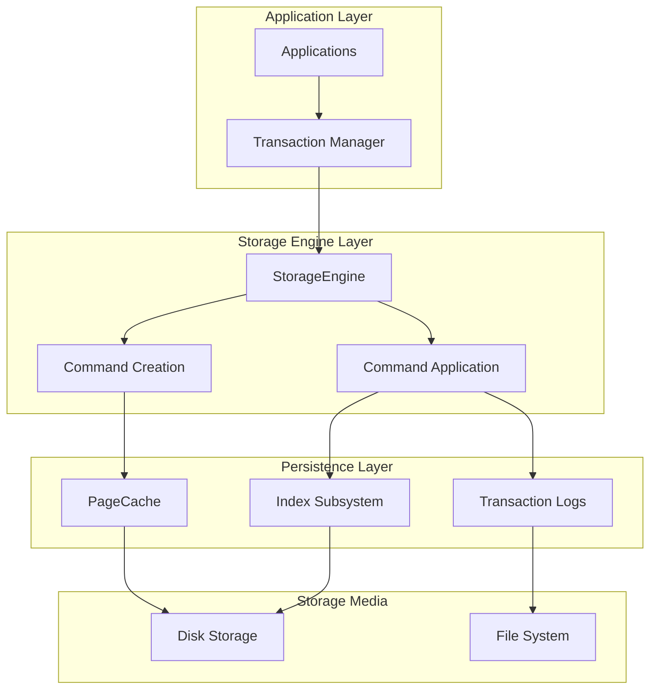

**Diagram sources**
- [RecordStorageEngine.java](file://community/record-storage-engine/src/main/java/org/neo4j/internal/recordstorage/RecordStorageEngine.java#L142-L200)
- [StorageEngine.java](file://community/kernel-api/src/main/java/org/neo4j/storageengine/api/StorageEngine.java#L51-L247)

The architecture demonstrates clear separation of responsibilities:
- **StorageEngine**: Orchestrates storage operations and maintains transactional consistency
- **PageCache**: Manages memory-mapped disk pages for efficient I/O operations
- **Transaction Logs**: Provides write-ahead logging for durability guarantees
- **Index Subsystem**: Handles graph indices for fast query performance

**Section sources**
- [RecordStorageEngine.java](file://community/record-storage-engine/src/main/java/org/neo4j/internal/recordstorage/RecordStorageEngine.java#L142-L200)
- [StorageEngine.java](file://community/kernel-api/src/main/java/org/neo4j/storageengine/api/StorageEngine.java#L51-L247)

## Core Components

### StorageEngine Interface

The StorageEngine serves as the primary interface for storage operations, implementing both readable and writable capabilities:

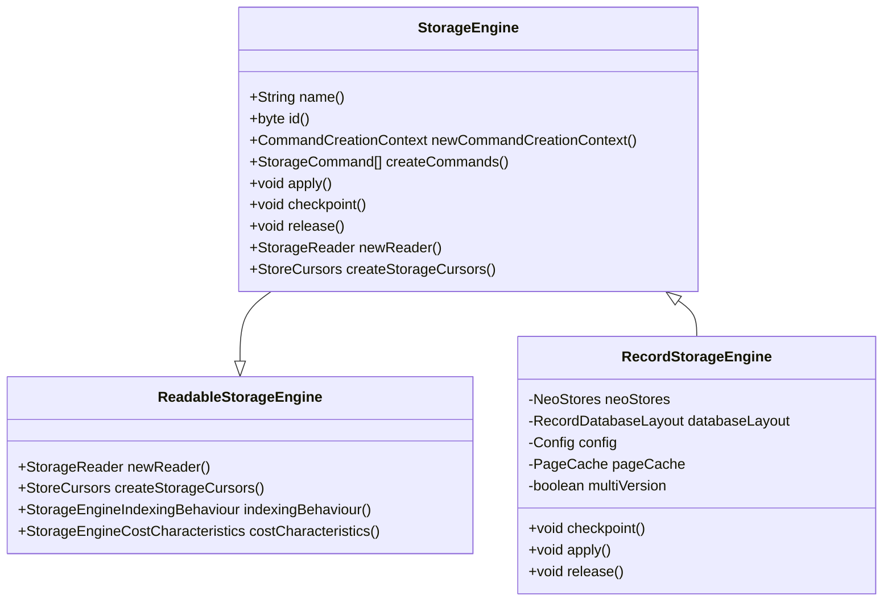

**Diagram sources**
- [StorageEngine.java](file://community/kernel-api/src/main/java/org/neo4j/storageengine/api/StorageEngine.java#L51-L247)
- [RecordStorageEngine.java](file://community/record-storage-engine/src/main/java/org/neo4j/internal/recordstorage/RecordStorageEngine.java#L142-L200)

### Command System

The storage engine employs a sophisticated command system for managing changes:

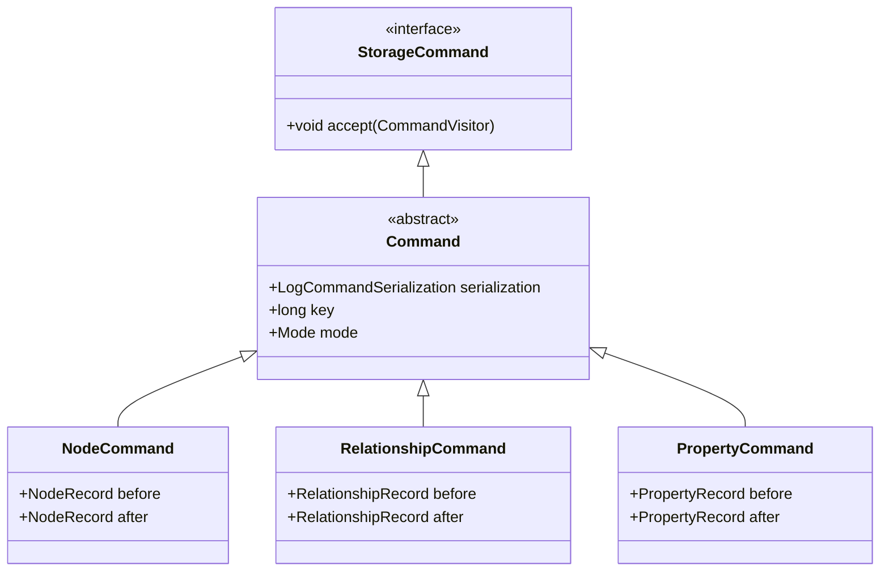

**Diagram sources**
- [Command.java](file://community/record-storage-engine/src/main/java/org/neo4j/internal/recordstorage/Command.java#L58-L98)

**Section sources**
- [StorageEngine.java](file://community/kernel-api/src/main/java/org/neo4j/storageengine/api/StorageEngine.java#L51-L247)
- [RecordStorageEngine.java](file://community/record-storage-engine/src/main/java/org/neo4j/internal/recordstorage/RecordStorageEngine.java#L142-L200)

## Record-Based Storage Architecture

### Record Structure and Organization

Neo4j's storage engine organizes data into discrete records, each representing a fundamental unit of information:

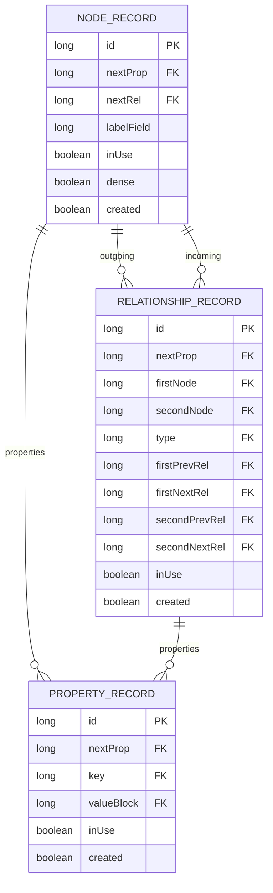

**Diagram sources**
- [NeoStores.java](file://community/record-storage-engine/src/main/java/org/neo4j/kernel/impl/store/NeoStores.java#L382-L414)

### Store Types and Management

The storage engine manages multiple specialized stores, each optimized for different data types:

| Store Type | Purpose | Key Features |
|------------|---------|--------------|
| NodeStore | Stores node records | Dense node detection, relationship chains |
| RelationshipStore | Stores relationship records | Bidirectional relationship tracking |
| PropertyStore | Stores property key-value pairs | Dynamic sizing, reference counting |
| SchemaStore | Stores schema definitions | Constraints, indexes, tokens |
| IndexStore | Maintains graph indices | B+Tree structures, range queries |

**Section sources**
- [NeoStores.java](file://community/record-storage-engine/src/main/java/org/neo4j/kernel/impl/store/NeoStores.java#L382-L414)

## Transaction Log Management

### Write-Ahead Logging Architecture

The storage engine implements a sophisticated write-ahead logging (WAL) system that ensures durability and recovery capabilities:

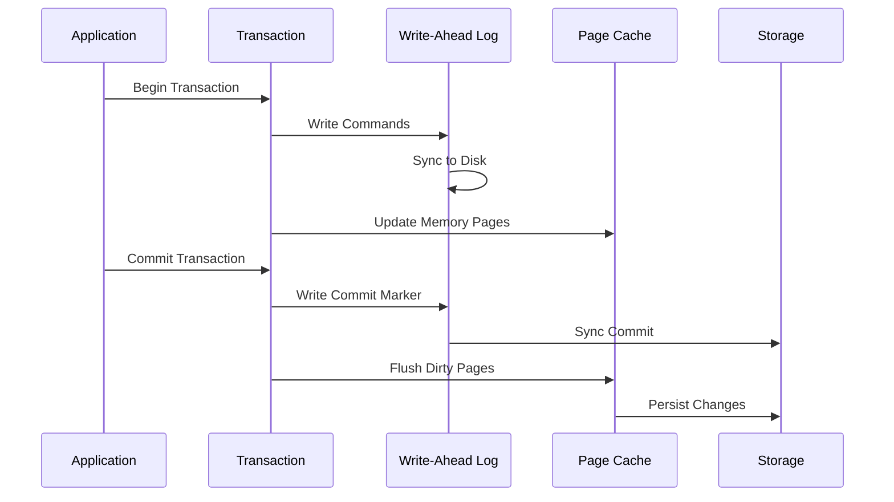

**Diagram sources**
- [LogCommandSerialization.java](file://community/record-storage-engine/src/main/java/org/neo4j/internal/recordstorage/LogCommandSerialization.java#L28-L291)

### Log Command Serialization

The storage engine uses a flexible serialization system for log commands:

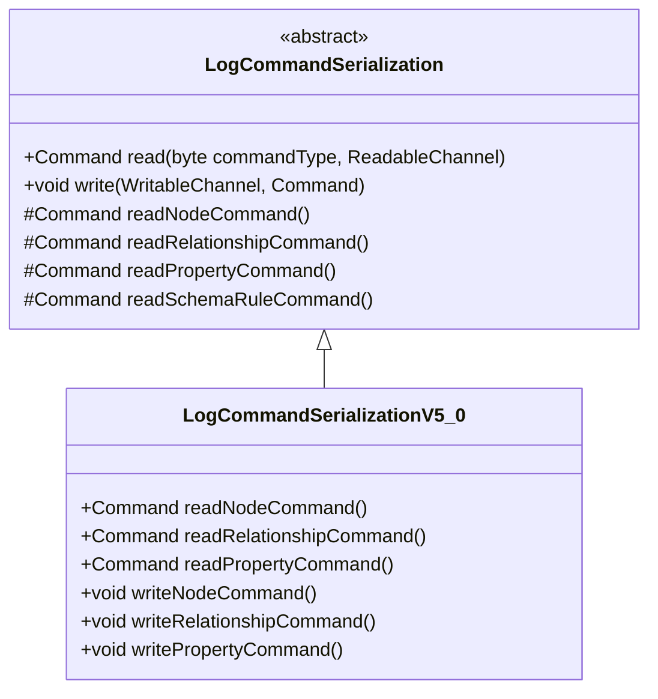

**Diagram sources**
- [LogCommandSerialization.java](file://community/record-storage-engine/src/main/java/org/neo4j/internal/recordstorage/LogCommandSerialization.java#L28-L291)

**Section sources**
- [LogCommandSerialization.java](file://community/record-storage-engine/src/main/java/org/neo4j/internal/recordstorage/LogCommandSerialization.java#L28-L291)

## Page Cache System

### Memory Management Architecture

The page cache provides intelligent memory management for efficient disk I/O:

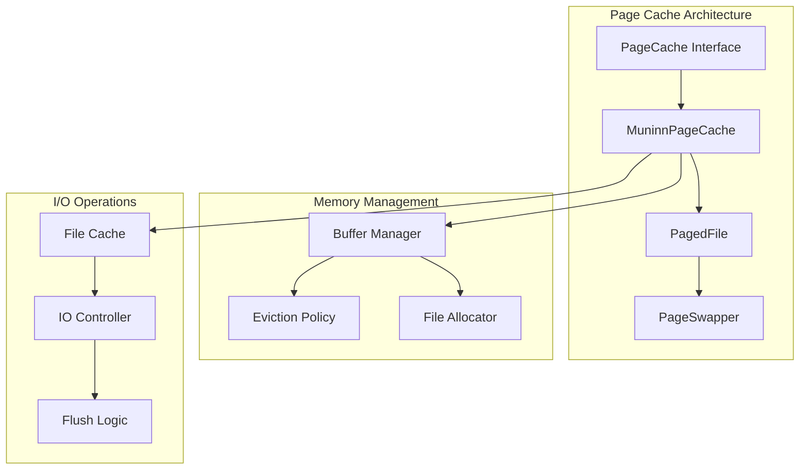

**Diagram sources**
- [PageCache.java](file://community/io/src/main/java/org/neo4j/io/pagecache/PageCache.java#L45-L228)

### Performance Metrics and Monitoring

The page cache provides comprehensive monitoring capabilities:

| Metric Category | Key Measurements | Purpose |
|-----------------|------------------|---------|
| Cache Performance | Hit ratio, eviction rate | Optimize memory usage |
| I/O Operations | Page faults, flushes | Monitor disk activity |
| Memory Usage | Resident pages, free pages | Track memory consumption |
| Throttling | IO limits, pause duration | Control system load |

**Section sources**
- [PageCache.java](file://community/io/src/main/java/org/neo4j/io/pagecache/PageCache.java#L45-L228)
- [PageCacheTracer.java](file://community/io/src/main/java/org/neo4j/io/pagecache/tracing/PageCacheTracer.java#L261-L543)

## Index Subsystem

### Index Architecture and Implementation

The index subsystem provides fast access to graph data through various indexing strategies:

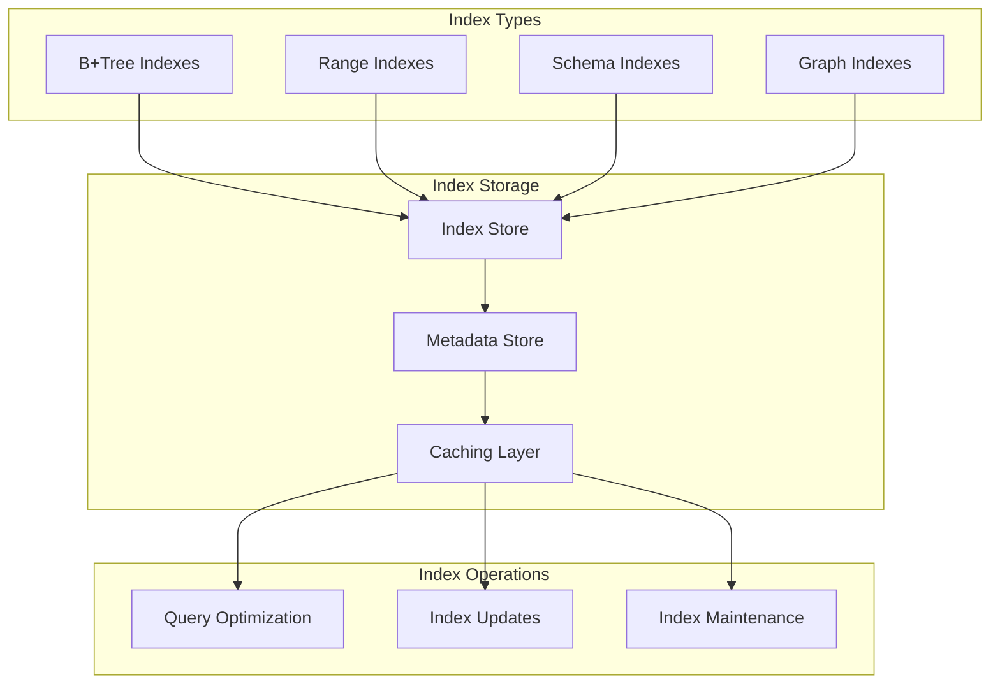

### Index Update Pipeline

The index subsystem handles updates through a coordinated pipeline:

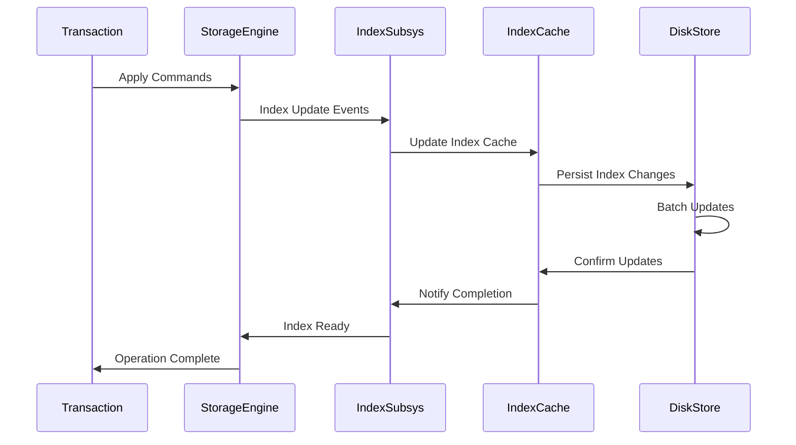

**Section sources**
- [RecordStorageEngine.java](file://community/record-storage-engine/src/main/java/org/neo4j/internal/recordstorage/RecordStorageEngine.java#L175-L205)

## Storage Format and Versioning

### Format Evolution and Compatibility

The storage engine supports multiple format versions to enable evolution while maintaining backward compatibility:

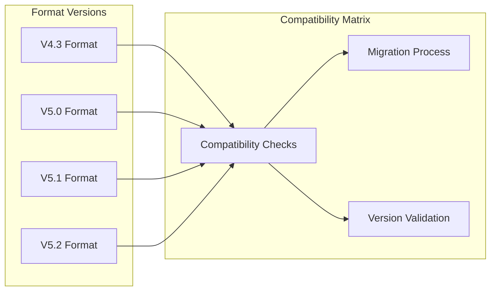

**Diagram sources**
- [StoreVersion.java](file://community/record-storage-engine/src/main/java/org/neo4j/kernel/impl/store/format/StoreVersion.java#L35-L75)

### Migration Strategies

The storage engine implements sophisticated migration strategies for format evolution:

| Migration Type | Scope | Complexity | Risk Level |
|---------------|-------|------------|------------|
| Minor Version | Record format tweaks | Low | Minimal |
| Major Version | Structural changes | Medium | Moderate |
| Format Family | Complete rewrite | High | High |
| Cross-Version | Multi-version migration | Variable | Variable |

**Section sources**
- [StoreVersion.java](file://community/record-storage-engine/src/main/java/org/neo4j/kernel/impl/store/format/StoreVersion.java#L35-L75)
- [RecordStorageEngineFactory.java](file://community/record-storage-engine/src/main/java/org/neo4j/internal/recordstorage/RecordStorageEngineFactory.java#L147-L359)

## Recovery and Durability

### Recovery Process Architecture

The storage engine implements a comprehensive recovery system that ensures data consistency after failures:

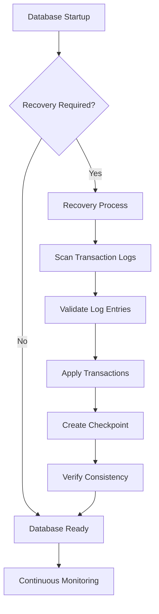

**Diagram sources**
- [Recovery.java](file://community/kernel/src/main/java/org/neo4j/kernel/recovery/Recovery.java#L410-L876)

### Recovery Modes and Strategies

The storage engine supports different recovery modes based on system state:

| Recovery Mode | Use Case | Approach | Performance Impact |
|---------------|----------|----------|-------------------|
| Forward Recovery | Normal operation | Replay committed transactions | Minimal |
| Full Recovery | Corrupted state | Rebuild from scratch | Significant |
| Point-in-Time | Specific recovery | Stop at target transaction | Variable |
| Parallel Recovery | Large datasets | Multi-threaded processing | High |

**Section sources**
- [Recovery.java](file://community/kernel/src/main/java/org/neo4j/kernel/recovery/Recovery.java#L410-L876)
- [TransactionLogsRecovery.java](file://community/kernel/src/main/java/org/neo4j/kernel/recovery/TransactionLogsRecovery.java#L108-L462)

## Performance and Scalability

### Infrastructure Requirements

The storage engine's performance depends on several infrastructure factors:

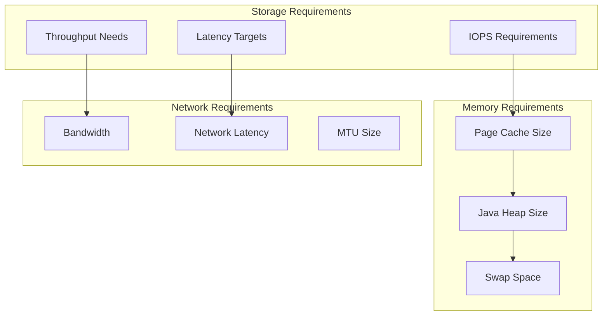

### Scalability Considerations

| Scale Dimension | Bottlenecks | Mitigation Strategies |
|-----------------|-------------|----------------------|
| Data Volume | Disk I/O saturation | SSD storage, RAID arrays |
| Concurrent Operations | Memory contention | Memory tuning, connection pooling |
| Query Complexity | CPU utilization | Index optimization, query planning |
| Network Operations | Bandwidth limitations | Compression, batching |

### Performance Optimization Strategies

The storage engine employs several optimization techniques:

- **Write Coalescing**: Batches multiple small writes into larger operations
- **Read Prefetching**: Anticipates future read patterns
- **Compression**: Reduces storage footprint and I/O overhead
- **Parallel Processing**: Utilizes multiple cores for I/O operations

## High Availability Deployment

### Deployment Topologies

The storage engine supports various high-availability configurations:

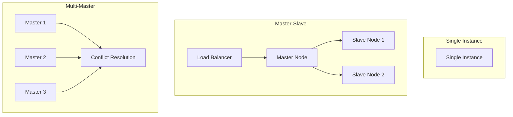

### Cluster Coordination

The storage engine integrates with Neo4j's clustering capabilities:

| Component | Responsibility | Coordination Method |
|-----------|----------------|-------------------|
| Raft Protocol | Leader election | Consensus algorithm |
| State Machine | Data replication | Log-based replication |
| Membership | Node management | Heartbeat monitoring |
| Failover | Service continuity | Automatic recovery |

## Monitoring and Observability

### Metrics and Monitoring

The storage engine provides comprehensive monitoring capabilities:

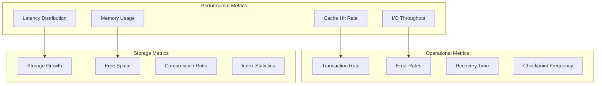

### Diagnostic Tools

The storage engine includes built-in diagnostic capabilities:

| Tool | Purpose | Output Format |
|------|---------|---------------|
| Store Info | Database status | JSON/XML |
| Recovery Status | Recovery progress | Text/JSON |
| Performance Profiling | Bottleneck identification | CSV/Graph |
| Health Checks | System status | Boolean/JSON |

**Section sources**
- [DatabaseFlushEvent.java](file://community/io/src/main/java/org/neo4j/io/pagecache/tracing/DatabaseFlushEvent.java#L35-L94)

## Security Considerations

### Data Encryption

While the storage engine itself focuses on data persistence, security considerations include:

- **At-Rest Encryption**: File system level encryption
- **Transport Security**: Network encryption for backups
- **Access Control**: File system permissions
- **Audit Logging**: Change tracking and compliance

### Security Best Practices

| Security Aspect | Recommendation | Implementation |
|-----------------|----------------|----------------|
| Encryption | Enable transparent encryption | File system or volume encryption |
| Access Control | Principle of least privilege | OS-level permissions |
| Audit Trail | Comprehensive logging | Built-in audit capabilities |
| Backup Security | Encrypt backup files | Encryption at backup destination |

## Disaster Recovery

### Backup Strategies

The storage engine supports multiple backup approaches:

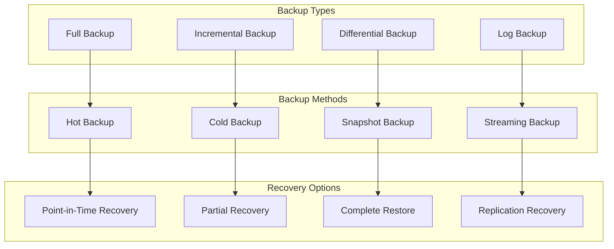

**Diagram sources**
- [BackupDescription.java](file://community/dbms/src/main/java/org/neo4j/dbms/archive/backup/BackupDescription.java#L34-L165)

### Recovery Procedures

The storage engine provides automated recovery procedures:

| Recovery Scenario | Procedure | RTO Target |
|-------------------|-----------|------------|
| Hardware Failure | Restore from backup | Hours to days |
| Data Corruption | Point-in-time recovery | Minutes to hours |
| Accidental Deletion | Snapshot recovery | Minutes |
| Natural Disaster | Cross-region recovery | Days to weeks |

**Section sources**
- [BackupDescription.java](file://community/dbms/src/main/java/org/neo4j/dbms/archive/backup/BackupDescription.java#L34-L165)

## Conclusion

The Neo4j Storage Engine represents a sophisticated approach to graph data persistence that balances performance, reliability, and scalability. Its record-based architecture, combined with write-ahead logging and comprehensive recovery mechanisms, provides a solid foundation for graph database operations.

Key strengths of the storage engine include:

- **Robust Transactional Guarantees**: ACID compliance with sophisticated recovery mechanisms
- **Optimized for Graph Patterns**: Specialized storage layouts for nodes, relationships, and properties
- **Flexible Architecture**: Modular design supporting multiple format versions and deployment topologies
- **Comprehensive Monitoring**: Built-in observability and diagnostic capabilities
- **Scalability**: Support for various infrastructure requirements and growth patterns

The storage engine's design decisions reflect years of experience with graph database workloads, resulting in a system that efficiently handles the unique challenges of graph data management while maintaining the reliability expectations of production systems.

Future developments in the storage engine continue to focus on performance optimization, enhanced security features, and improved operational simplicity, ensuring that Neo4j remains a leading platform for graph database applications.