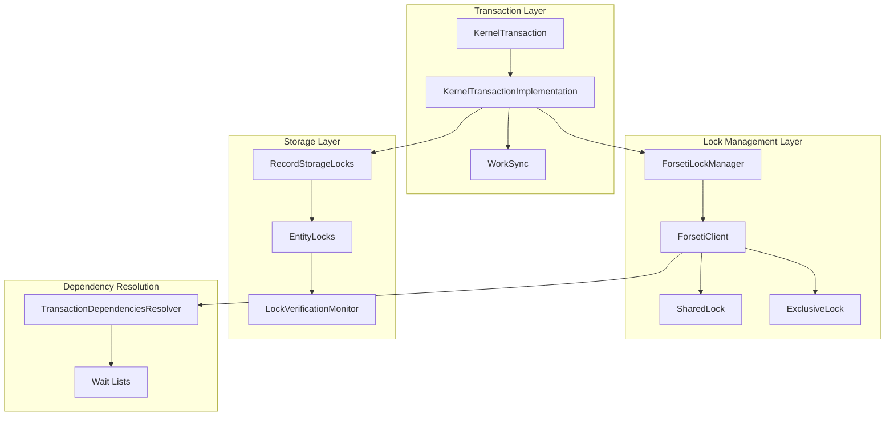
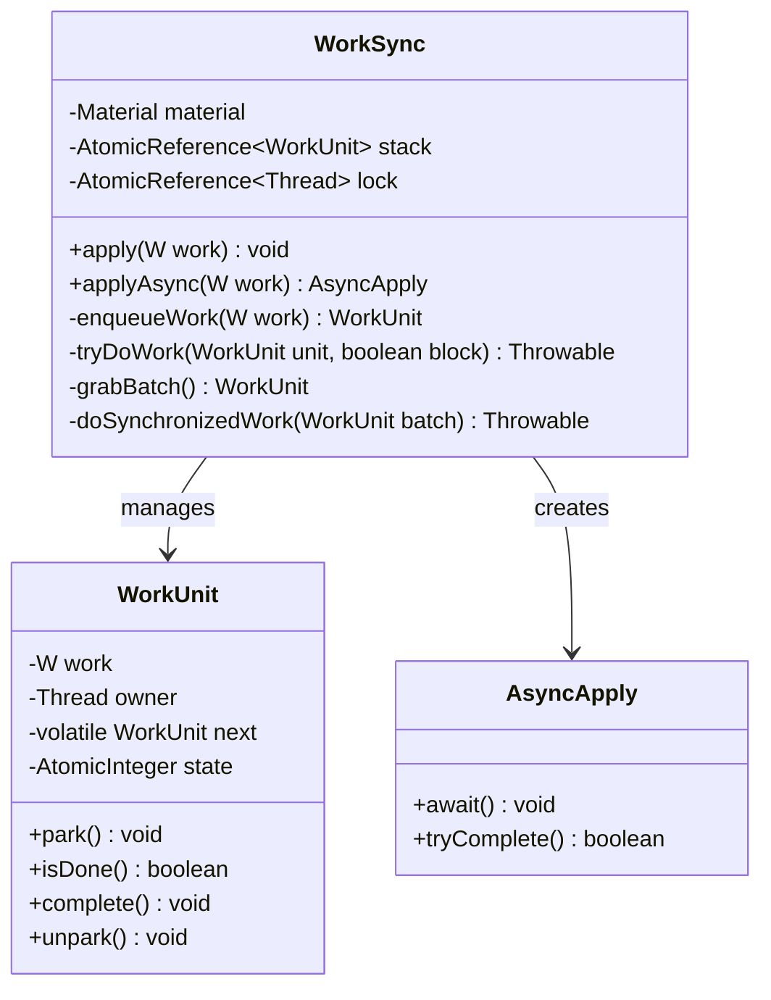
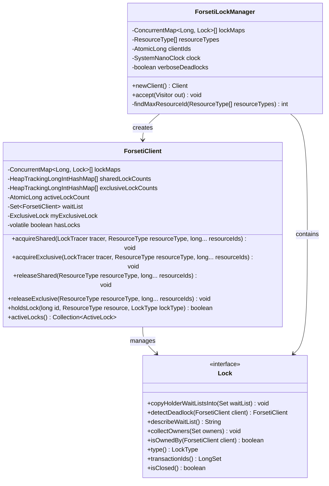
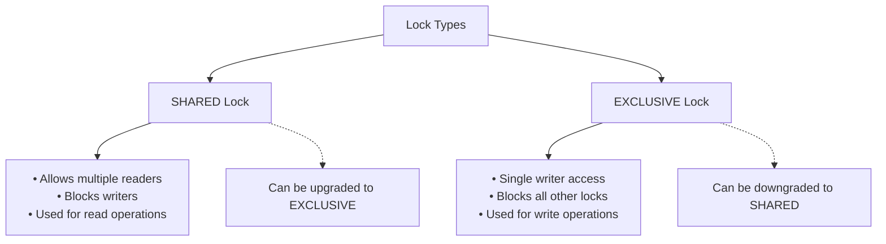
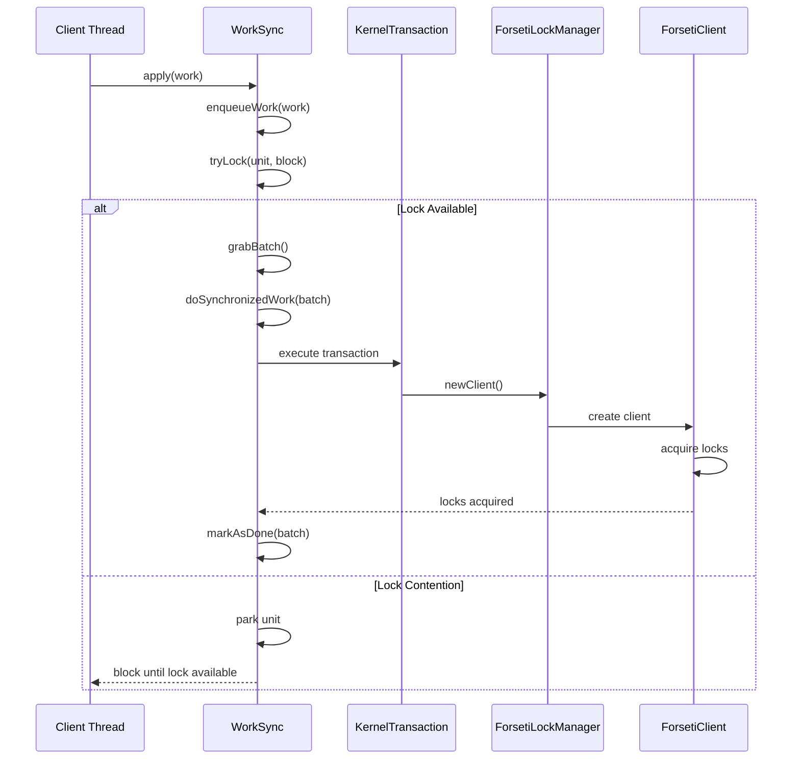
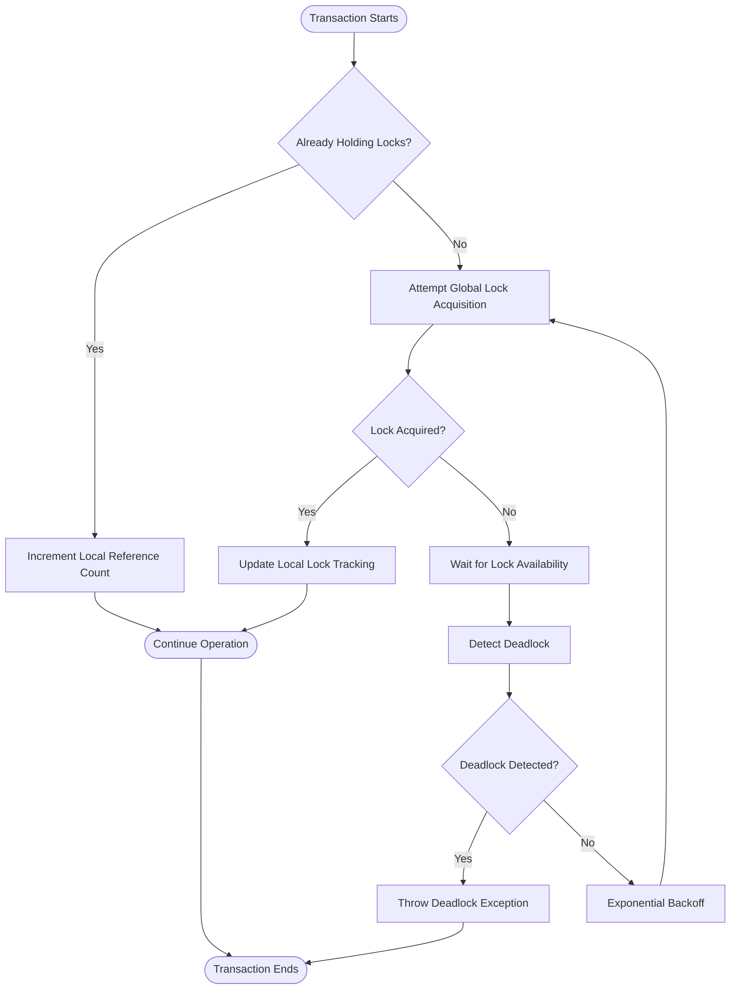
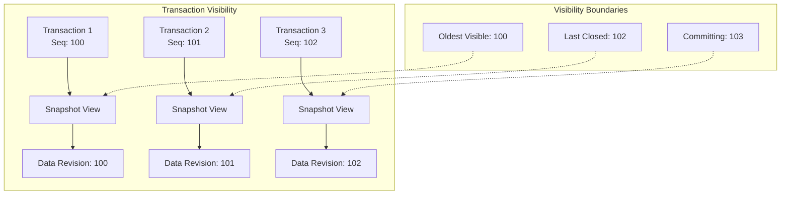
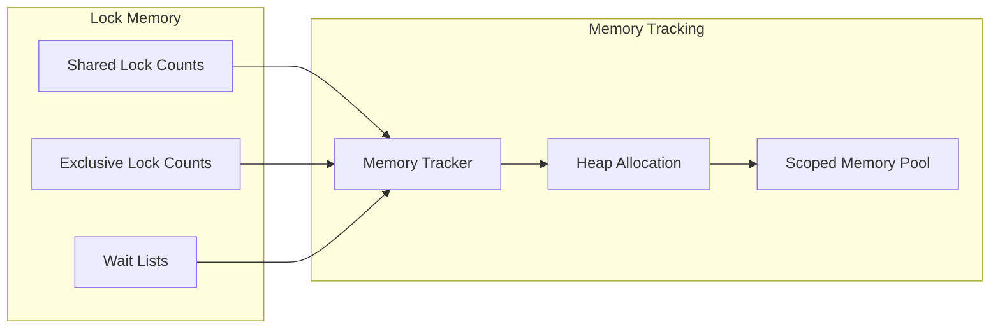
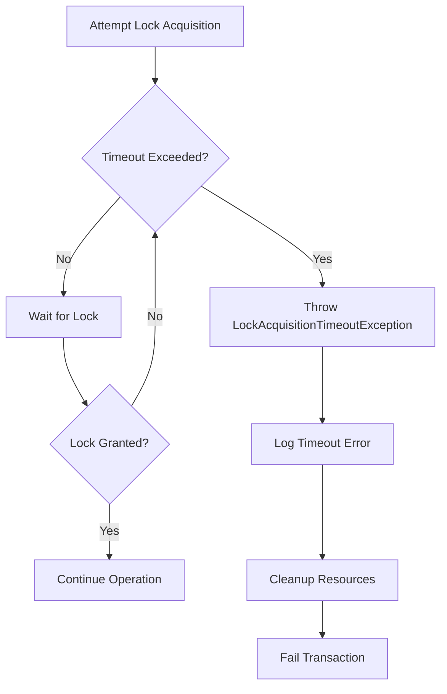

# Concurrency Control

<cite>
**Referenced Files in This Document**
- [WorkSync.java](file://community/concurrent/src/main/java/org/neo4j/util/concurrent/WorkSync.java)
- [ForsetiLockManager.java](file://community/lock/src/main/java/org/neo4j/kernel/impl/locking/forseti/ForsetiLockManager.java)
- [ForsetiClient.java](file://community/lock/src/main/java/org/neo4j/kernel/impl/locking/forseti/ForsetiClient.java)
- [SharedLock.java](file://community/lock/src/main/java/org/neo4j/kernel/impl/locking/forseti/SharedLock.java)
- [ExclusiveLock.java](file://community/lock/src/main/java/org/neo4j/kernel/impl/locking/forseti/ExclusiveLock.java)
- [LockType.java](file://community/lock/src/main/java/org/neo4j/lock/LockType.java)
- [ResourceType.java](file://community/lock/src/main/java/org/neo4j/lock/ResourceType.java)
- [KernelTransactionImplementation.java](file://community/kernel/src/main/java/org/neo4j/kernel/impl/api/KernelTransactionImplementation.java)
- [RecordStorageLocks.java](file://community/record-storage-engine/src/main/java/org/neo4j/internal/recordstorage/RecordStorageLocks.java)
- [TransactionDependenciesResolver.java](file://community/cypher/runtime-util/src/main/java/org/neo4j/internal/kernel/api/helpers/TransactionDependenciesResolver.java)
- [LockAcquisitionTimeoutException.java](file://community/lock/src/main/java/org/neo4j/kernel/impl/locking/LockAcquisitionTimeoutException.java)
- [LockManager.java](file://community/lock/src/main/java/org/neo4j/kernel/impl/locking/LockManager.java)
- [EntityLocks.java](file://community/kernel-api/src/main/java/org/neo4j/internal/kernel/api/EntityLocks.java)
- [LockVerificationMonitor.java](file://community/record-storage-engine/src/main/java/org/neo4j/internal/recordstorage/LockVerificationMonitor.java)
</cite>

## Table of Contents
1. [Introduction](#introduction)
2. [System Architecture Overview](#system-architecture-overview)
3. [Core Components](#core-components)
4. [Lock Types and Granularity](#lock-types-and-granularity)
5. [Transaction Execution Coordination](#transaction-execution-coordination)
6. [Deadlock Detection and Resolution](#deadlock-detection-and-resolution)
7. [Isolation Levels and Visibility Rules](#isolation-levels-and-visibility-rules)
8. [Performance Considerations](#performance-considerations)
9. [Common Issues and Solutions](#common-issues-and-solutions)
10. [Best Practices](#best-practices)

## Introduction

Neo4j's Concurrency Control system ensures safe access to graph data when multiple transactions operate concurrently. The system implements sophisticated locking mechanisms, deadlock detection, and isolation guarantees to maintain data consistency while maximizing throughput. At its core, the system coordinates access to graph entities (nodes, relationships, schema) through a hierarchical locking strategy that prevents conflicts while allowing optimal parallelism.

The concurrency control system operates on multiple levels:
- **Transaction Level**: Manages transaction lifecycle and coordination
- **Lock Management**: Provides fine-grained locking for graph entities
- **Deadlock Detection**: Prevents and resolves circular wait dependencies
- **Isolation Enforcement**: Maintains ACID properties through MVCC and visibility rules

## System Architecture Overview

The concurrency control system follows a layered architecture that separates concerns between transaction management, lock coordination, and deadlock prevention.



**Diagram sources**
- [KernelTransactionImplementation.java](file://community/kernel/src/main/java/org/neo4j/kernel/impl/api/KernelTransactionImplementation.java#L188-L200)
- [ForsetiLockManager.java](file://community/lock/src/main/java/org/neo4j/kernel/impl/locking/forseti/ForsetiLockManager.java#L106-L154)
- [WorkSync.java](file://community/concurrent/src/main/java/org/neo4j/util/concurrent/WorkSync.java#L48-L66)

## Core Components

### WorkSync: Coordinating Concurrent Operations

WorkSync serves as the primary mechanism for coordinating concurrent operations in a thread-safe manner. It transforms multiple concurrent requests into serialized batches, reducing contention and improving overall throughput.



**Diagram sources**
- [WorkSync.java](file://community/concurrent/src/main/java/org/neo4j/util/concurrent/WorkSync.java#L48-L279)

**Section sources**
- [WorkSync.java](file://community/concurrent/src/main/java/org/neo4j/util/concurrent/WorkSync.java#L1-L279)

### ForsetiLockManager: Advanced Lock Coordination

The ForsetiLockManager implements a sophisticated lock management system with integrated deadlock detection using the Dreadlocks algorithm. This system provides optimal scalability for high-concurrency scenarios.



**Diagram sources**
- [ForsetiLockManager.java](file://community/lock/src/main/java/org/neo4j/kernel/impl/locking/forseti/ForsetiLockManager.java#L106-L231)
- [ForsetiClient.java](file://community/lock/src/main/java/org/neo4j/kernel/impl/locking/forseti/ForsetiClient.java#L75-L200)

**Section sources**
- [ForsetiLockManager.java](file://community/lock/src/main/java/org/neo4j/kernel/impl/locking/forseti/ForsetiLockManager.java#L1-L231)
- [ForsetiClient.java](file://community/lock/src/main/java/org/neo4j/kernel/impl/locking/forseti/ForsetiClient.java#L1-L200)

## Lock Types and Granularity

Neo4j implements a hierarchical locking system with different granularities to balance between concurrency and consistency.

### Lock Types



**Diagram sources**
- [LockType.java](file://community/lock/src/main/java/org/neo4j/lock/LockType.java#L22-L36)

### Resource Types and Lock Hierarchy

The system organizes locks in a strict hierarchy to prevent deadlocks:

| Priority | Resource Type | Description | Lock Scope |
|----------|---------------|-------------|------------|
| 1 | LABEL | Schema locks for labels | Single label |
| 2 | RELATIONSHIP_TYPE | Schema locks for relationship types | Single relationship type |
| 3 | SCHEMA_NAME | Schema name locks | Hashed schema name |
| 4 | NODE_RELATIONSHIP_GROUP_DELETE | Node delete locks | Single node |
| 5 | NODE | Node data locks | Single node |
| 6 | DEGREES | Degree calculation locks | Single node |
| 7 | RELATIONSHIP_DELETE | Relationship delete locks | Single relationship |
| 8 | RELATIONSHIP_GROUP | Relationship group locks | Single node |
| 9 | RELATIONSHIP | Relationship data locks | Single relationship |

**Section sources**
- [ResourceType.java](file://community/lock/src/main/java/org/neo4j/lock/ResourceType.java#L1-L92)
- [RecordStorageLocks.java](file://community/record-storage-engine/src/main/java/org/neo4j/internal/recordstorage/RecordStorageLocks.java#L34-L70)

## Transaction Execution Coordination

### Transaction Lifecycle and Lock Acquisition

The transaction execution process involves careful coordination between WorkSync and LockService to ensure proper ordering and conflict resolution.



**Diagram sources**
- [WorkSync.java](file://community/concurrent/src/main/java/org/neo4j/util/concurrent/WorkSync.java#L78-L156)
- [ForsetiClient.java](file://community/lock/src/main/java/org/neo4j/kernel/impl/locking/forseti/ForsetiClient.java#L175-L325)

### Lock Acquisition Patterns

The system implements several lock acquisition patterns to optimize performance and prevent deadlocks:



**Diagram sources**
- [ForsetiClient.java](file://community/lock/src/main/java/org/neo4j/kernel/impl/locking/forseti/ForsetiClient.java#L302-L400)

**Section sources**
- [ForsetiClient.java](file://community/lock/src/main/java/org/neo4j/kernel/impl/locking/forseti/ForsetiClient.java#L175-L503)
- [KernelTransactionImplementation.java](file://community/kernel/src/main/java/org/neo4j/kernel/impl/api/KernelTransactionImplementation.java#L591-L608)

## Deadlock Detection and Resolution

### Dreadlocks Algorithm Implementation

Neo4j uses the Dreadlocks algorithm for efficient deadlock detection with O(1) complexity. The algorithm maintains wait lists that propagate through the dependency graph.

```mermaid
graph TD
subgraph "Wait List Propagation"
A[Client A] --> B[Client B]
B --> C[Client C]
C --> A
A -.-> A_WAIT[A.waitList = [A]]
B -.-> B_WAIT[B.waitList = [B]]
C -.-> C_WAIT[C.waitList = [C]]
A -.-> UNION[Union Wait Lists]
B -.-> UNION
C -.-> UNION
UNION --> NEW_WAIT[New Wait List]
NEW_WAIT --> DETECT_CYCLE[Detect Cycle]
end
subgraph "Deadlock Verification"
DETECT_CYCLE --> REAL_DETECTION{Real Deadlock?}
REAL_DETECTION --> |Yes| THROW_DEADLOCK[Throw DeadlockDetectedException]
REAL_DETECTION --> |No| CONTINUE[Continue Waiting]
end
```

**Diagram sources**
- [ForsetiLockManager.java](file://community/lock/src/main/java/org/neo4j/kernel/impl/locking/forseti/ForsetiLockManager.java#L62-L105)
- [ForsetiClient.java](file://community/lock/src/main/java/org/neo4j/kernel/impl/locking/forseti/ForsetiClient.java#L813-L943)

### Deadlock Resolution Strategies

The system implements multiple strategies for resolving deadlocks:

1. **Priority-Based Resolution**: Transactions with higher sequence numbers are prioritized
2. **Timeout-Based Resolution**: Transactions exceeding lock acquisition timeout are terminated
3. **Random Selection**: When priorities are equal, one transaction is randomly selected for rollback

**Section sources**
- [ForsetiClient.java](file://community/lock/src/main/java/org/neo4j/kernel/impl/locking/forseti/ForsetiClient.java#L813-L943)
- [LockAcquisitionTimeoutException.java](file://community/lock/src/main/java/org/neo4j/kernel/impl/locking/LockAcquisitionTimeoutException.java)

## Isolation Levels and Visibility Rules

### Multi-Version Concurrency Control (MVCC)

Neo4j implements MVCC to provide snapshot isolation without blocking readers. Each transaction sees a consistent snapshot of the database state.



### Transaction State Tracking

The system maintains detailed transaction state to enforce isolation:

| State | Description | Visibility Rules |
|-------|-------------|------------------|
| Active | Transaction is running | Can see committed data and own uncommitted changes |
| Preparing | Transaction is preparing to commit | Cannot see uncommitted changes from other transactions |
| Committed | Transaction has been committed | Other transactions can see committed changes |
| Rolled Back | Transaction was rolled back | Other transactions cannot see rolled-back changes |

**Section sources**
- [KernelTransactionImplementation.java](file://community/kernel/src/main/java/org/neo4j/kernel/impl/api/KernelTransactionImplementation.java#L1560-L1563)

## Performance Considerations

### Lock Contention Optimization

The system implements several optimization strategies to minimize lock contention:

1. **Lock Ordering**: Resources are always acquired in predefined order to prevent deadlocks
2. **Lock Granularity**: Fine-grained locking reduces contention while maintaining consistency
3. **Lock Escalation**: Shared locks can be upgraded to exclusive locks atomically
4. **Lock Caching**: Local lock tracking reduces global lock map lookups

### Memory Management

The concurrency control system carefully manages memory allocation:



**Diagram sources**
- [ForsetiClient.java](file://community/lock/src/main/java/org/neo4j/kernel/impl/locking/forseti/ForsetiClient.java#L145-L160)

**Section sources**
- [ForsetiClient.java](file://community/lock/src/main/java/org/neo4j/kernel/impl/locking/forseti/ForsetiClient.java#L145-L172)

## Common Issues and Solutions

### Deadlock Scenarios

Common deadlock scenarios and their solutions:

| Scenario | Cause | Solution |
|----------|-------|----------|
| Circular Dependencies | Transactions acquire locks in different orders | Enforce strict lock ordering |
| Long-Running Transactions | Hold locks for extended periods | Implement timeouts and early lock release |
| High Contention | Many transactions competing for same resources | Optimize query patterns and reduce lock scope |
| Nested Transactions | Inner transactions hold locks unexpectedly | Proper cleanup in inner transaction handlers |

### Lock Timeout Handling

The system provides configurable timeout mechanisms:



**Diagram sources**
- [ForsetiClient.java](file://community/lock/src/main/java/org/neo4j/kernel/impl/locking/forseti/ForsetiClient.java#L854-L870)

### Long-Running Transaction Impacts

Long-running transactions can impact system performance:

1. **Visibility Boundaries**: Extend the oldest visible transaction boundary
2. **Lock Contention**: Hold locks for extended periods, blocking other transactions
3. **Memory Usage**: Accumulate transaction state and undo logs
4. **Checkpoint Impact**: Delay checkpoint operations due to active transactions

**Section sources**
- [LockAcquisitionTimeoutException.java](file://community/lock/src/main/java/org/neo4j/kernel/impl/locking/LockAcquisitionTimeoutException.java)
- [KernelTransactionImplementation.java](file://community/kernel/src/main/java/org/neo4j/kernel/impl/api/KernelTransactionImplementation.java#L743-L776)

## Best Practices

### Lock Acquisition Patterns

1. **Always Acquire Locks in Order**: Follow the predefined resource hierarchy
2. **Minimize Lock Hold Time**: Release locks as soon as possible
3. **Use Appropriate Lock Types**: Prefer shared locks for read operations
4. **Handle Deadlocks Gracefully**: Implement retry logic for deadlock scenarios

### Transaction Design Guidelines

1. **Keep Transactions Short**: Minimize the duration of transaction execution
2. **Batch Operations**: Use WorkSync to batch related operations
3. **Monitor Lock Metrics**: Track lock acquisition times and contention
4. **Configure Timeouts Appropriately**: Set reasonable timeouts for different operation types

### Performance Tuning

1. **Optimize Query Patterns**: Reduce the number of entities accessed in a transaction
2. **Use Indexes Effectively**: Leverage indexes to reduce lock scope
3. **Monitor System Metrics**: Track transaction throughput and lock contention
4. **Adjust Memory Settings**: Configure appropriate memory limits for transaction state

The concurrency control system in Neo4j provides a robust foundation for handling concurrent access to graph data while maintaining strong consistency guarantees. By understanding the underlying mechanisms and following established best practices, developers can build highly scalable applications that efficiently utilize Neo4j's concurrency capabilities.