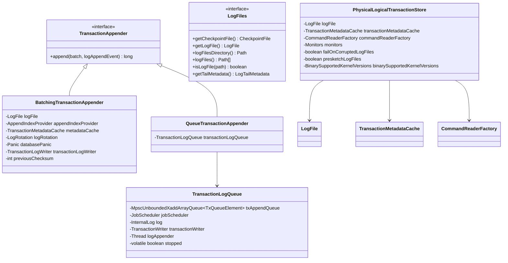
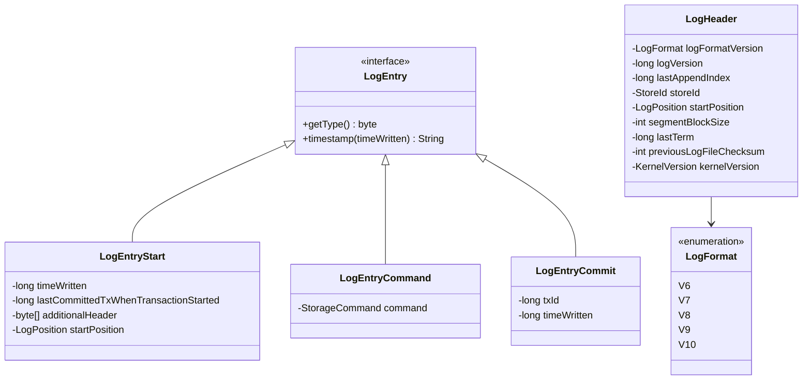
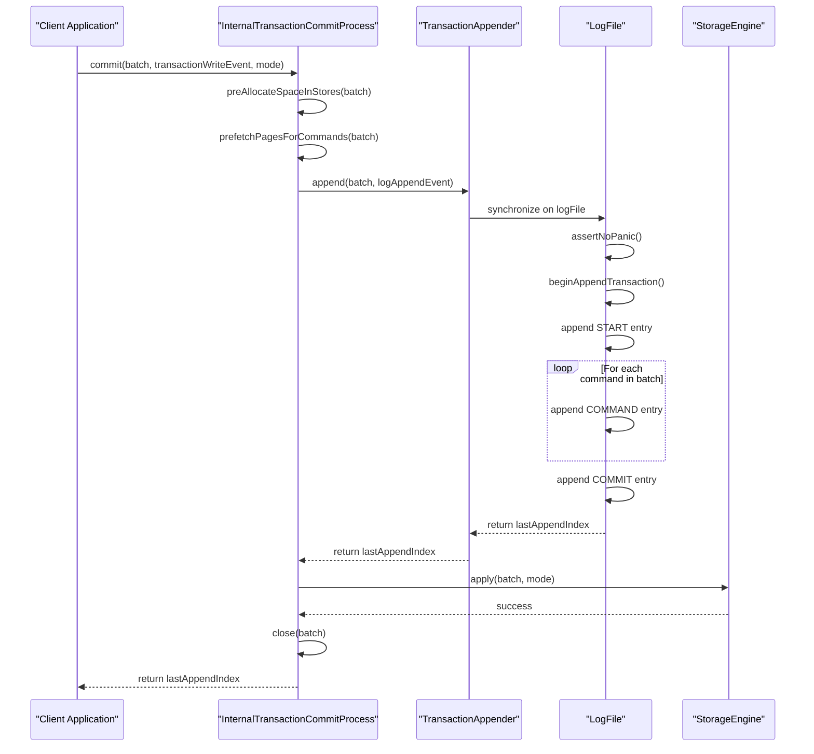
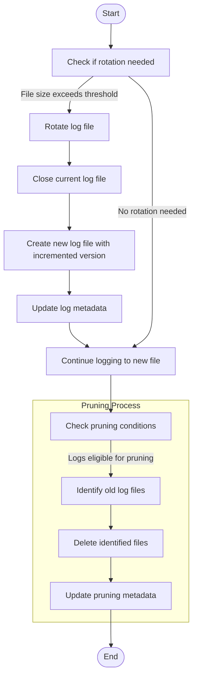
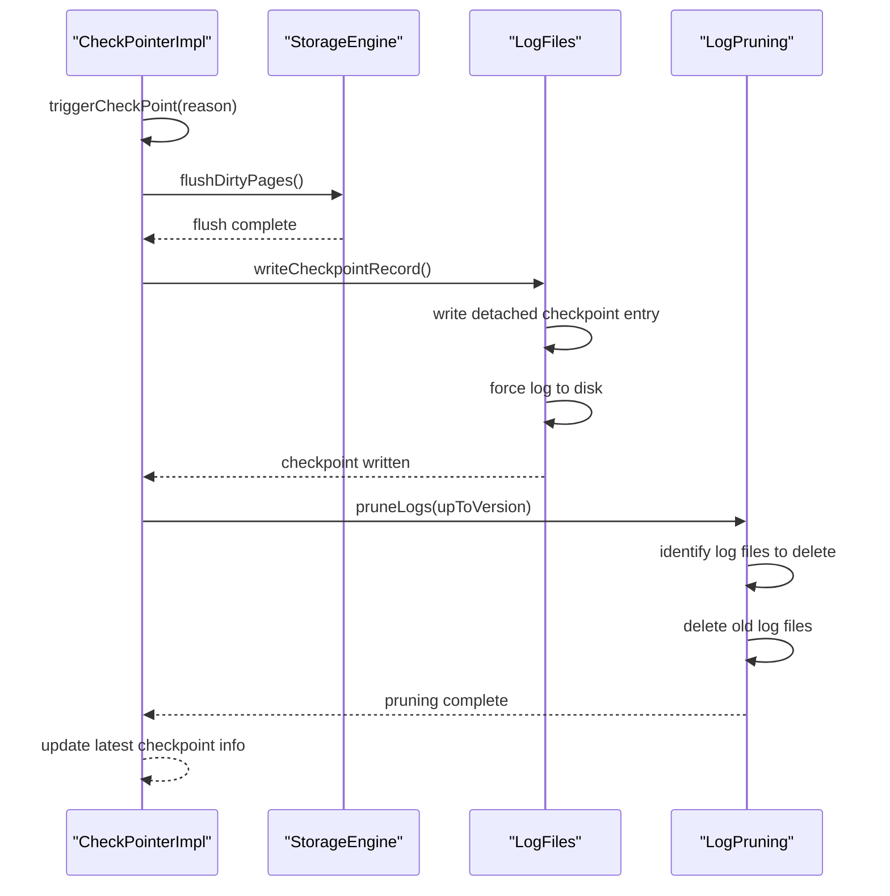
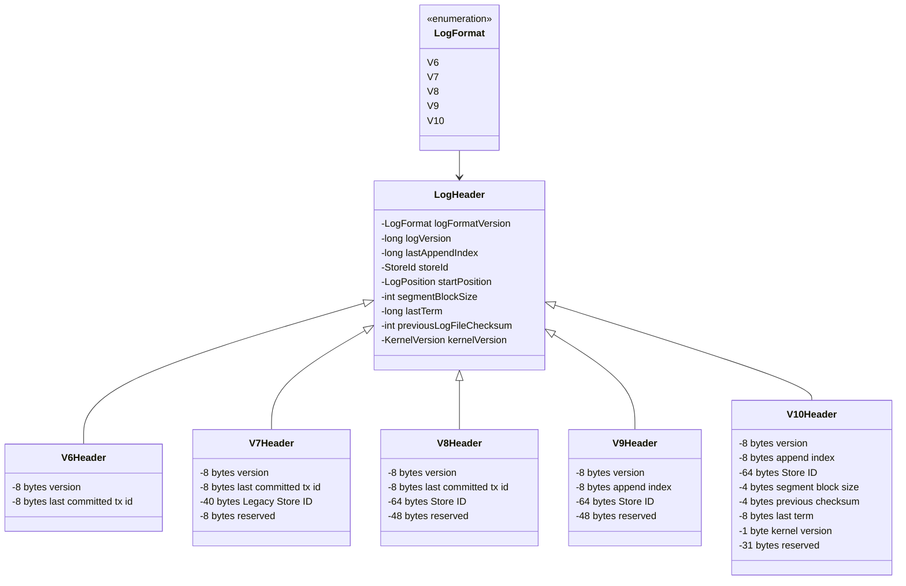
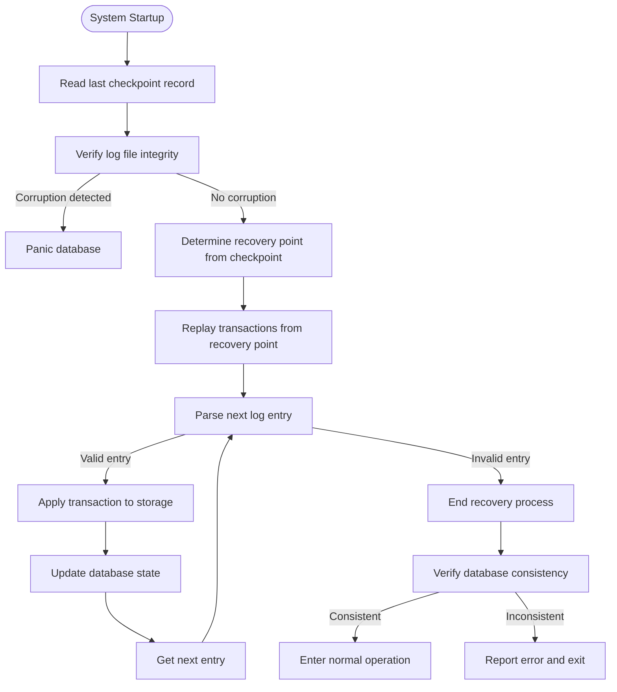
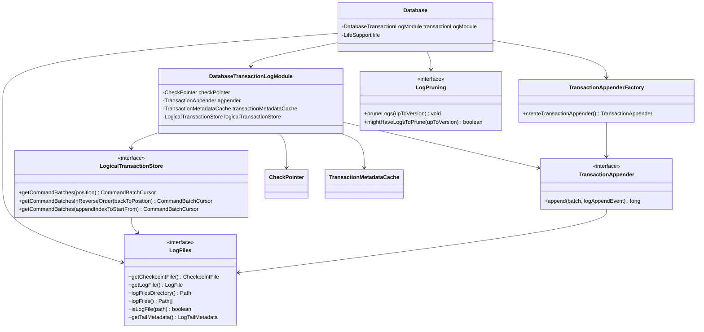

# Transaction Logging

<cite>
**Referenced Files in This Document**   
- [TransactionAppenderFactory.java](file://community\kernel\src\main\java\org\neo4j\kernel\impl\transaction\log\TransactionAppenderFactory.java)
- [BatchingTransactionAppender.java](file://community\kernel\src\main\java\org\neo4j\kernel\impl\transaction\log\BatchingTransactionAppender.java)
- [TransactionAppender.java](file://community\kernel\src\main\java\org\neo4j\kernel\impl\transaction\log\TransactionAppender.java)
- [QueueTransactionAppender.java](file://community\kernel\src\main\java\org\neo4j\kernel\impl\transaction\log\QueueTransactionAppender.java)
- [TransactionLogQueue.java](file://community\kernel\src\main\java\org\neo4j\kernel\impl\transaction\log\TransactionLogQueue.java)
- [LogFiles.java](file://community\kernel\src\main\java\org\neo4j\kernel\impl\transaction\log\files\LogFiles.java)
- [TransactionLogFile.java](file://community\kernel\src\main\java\org\neo4j\kernel\impl\transaction\log\files\TransactionLogFile.java)
- [PhysicalLogicalTransactionStore.java](file://community\kernel\src\main\java\org\neo4j\kernel\impl\transaction\log\PhysicalLogicalTransactionStore.java)
- [LogPruningImpl.java](file://community\kernel\src\main\java\org\neo4j\kernel\impl\transaction\log\pruning\LogPruningImpl.java)
- [CheckPointerImpl.java](file://community\kernel\src\main\java\org\neo4j\kernel\impl\transaction\log\checkpoint\CheckPointerImpl.java)
- [LogFormat.java](file://community\wal\src\main\java\org\neo4j\kernel\impl\transaction\log\entry\LogFormat.java)
- [LogHeader.java](file://community\wal\src\main\java\org\neo4j\kernel\impl\transaction\log\entry\LogHeader.java)
- [LogEntry.java](file://community\wal\src\main\java\org\neo4j\kernel\impl\transaction\log\entry\LogEntry.java)
- [LogEntryStart.java](file://community\wal\src\main\java\org\neo4j\kernel\impl\transaction\log\entry\LogEntryStart.java)
- [LogEntryCommand.java](file://community\wal\src\main\java\org\neo4j\kernel\impl\transaction\log\entry\LogEntryCommand.java)
- [LogEntryCommit.java](file://community\wal\src\main\java\org\neo4j\kernel\impl\transaction\log\entry\LogEntryCommit.java)
- [VersionAwareLogEntryReader.java](file://community\wal\src\main\java\org\neo4j\kernel\impl\transaction\log\entry\VersionAwareLogEntryReader.java)
- [InternalTransactionCommitProcess.java](file://community\kernel\src\main\java\org\neo4j\kernel\impl\api\InternalTransactionCommitProcess.java)
- [Database.java](file://community\kernel\src\main\java\org\neo4j\kernel\database\Database.java)
- [DatabaseTransactionLogModule.java](file://community\kernel\src\main\java\org\neo4j\kernel\database\DatabaseTransactionLogModule.java)
</cite>

## Table of Contents
1. [Introduction](#introduction)
2. [Write-Ahead Logging Fundamentals](#write-ahead-logging-fundamentals)
3. [Core Components](#core-components)
4. [Transaction Log Structure](#transaction-log-structure)
5. [Transaction Appending Process](#transaction-appending-process)
6. [Log Rotation and Pruning](#log-rotation-and-pruning)
7. [Checkpointing Mechanism](#checkpointing-mechanism)
8. [Log Versioning and Header Encoding](#log-versioning-and-header-encoding)
9. [Failure Detection and Recovery](#failure-detection-and-recovery)
10. [Component Relationships](#component-relationships)

## Introduction

The Transaction Logging subsystem in Neo4j's Storage Engine implements a Write-Ahead Logging (WAL) mechanism to ensure data durability and enable crash recovery. This documentation provides a comprehensive analysis of the WAL implementation, covering the structure of transaction logs, the transaction appending process, log rotation, pruning strategies, and checkpointing mechanisms. The system is designed to provide high throughput while maintaining data integrity through careful coordination of transaction logging, storage engine updates, and periodic checkpoints.

**Section sources**
- [TransactionAppenderFactory.java](file://community\kernel\src\main\java\org\neo4j\kernel\impl\transaction\log\TransactionAppenderFactory.java#L33-L59)
- [Database.java](file://community\kernel\src\main\java\org\neo4j\kernel\database\Database.java#L893-L922)

## Write-Ahead Logging Fundamentals

Write-Ahead Logging is a fundamental technique used in database systems to ensure durability and atomicity of transactions. In Neo4j's implementation, all modifications to the database must first be recorded in the transaction log before they are applied to the actual storage. This ensures that in the event of a system crash, any committed transactions that were not yet written to the main storage can be recovered by replaying the transaction log.

The WAL protocol follows the principle that log records must be written to persistent storage before the corresponding data pages are updated. This ordering guarantee ensures that during recovery, the database can reconstruct its state by applying all transactions recorded in the log that occurred after the last checkpoint. The transaction log serves as the system of record for all changes, providing a sequential history of database modifications that can be replayed to restore the database to a consistent state.

**Section sources**
- [TransactionAppender.java](file://community\kernel\src\main\java\org\neo4j\kernel\impl\transaction\log\TransactionAppender.java#L32-L47)
- [InternalTransactionCommitProcess.java](file://community\kernel\src\main\java\org\neo4j\kernel\impl\api\InternalTransactionCommitProcess.java#L58-L93)

## Core Components

The Transaction Logging subsystem consists of several key components that work together to manage transaction logging. The TransactionAppender interface is responsible for appending transactions to the log, with different implementations providing various concurrency and performance characteristics. The LogicalTransactionStore provides access to transaction logs for reading and replay operations, while the LogFiles component manages the physical log files on disk.

The system employs a factory pattern through TransactionAppenderFactory to create appropriate TransactionAppender instances based on configuration settings. When the dedicated_transaction_appender setting is enabled or when using the multiversion database format, a QueueTransactionAppender is created that uses a dedicated thread for log writing. Otherwise, a BatchingTransactionAppender is used, which coordinates log writes in batches for higher throughput in concurrent scenarios.

**Diagram sources **
- [TransactionAppender.java](file://community\kernel\src\main\java\org\neo4j\kernel\impl\transaction\log\TransactionAppender.java#L32-L47)
- [BatchingTransactionAppender.java](file://community\kernel\src\main\java\org\neo4j\kernel\impl\transaction\log\BatchingTransactionAppender.java#L39-L63)
- [QueueTransactionAppender.java](file://community\kernel\src\main\java\org\neo4j\kernel\impl\transaction\log\QueueTransactionAppender.java#L32-L59)
- [TransactionLogQueue.java](file://community\kernel\src\main\java\org\neo4j\kernel\impl\transaction\log\TransactionLogQueue.java#L59-L130)
- [LogFiles.java](file://community\kernel\src\main\java\org\neo4j\kernel\impl\transaction\log\files\LogFiles.java#L34-L47)
- [PhysicalLogicalTransactionStore.java](file://community\kernel\src\main\java\org\neo4j\kernel\impl\transaction\log\PhysicalLogicalTransactionStore.java#L36-L59)

**Section sources**
- [TransactionAppenderFactory.java](file://community\kernel\src\main\java\org\neo4j\kernel\impl\transaction\log\TransactionAppenderFactory.java#L33-L59)
- [BatchingTransactionAppender.java](file://community\kernel\src\main\java\org\neo4j\kernel\impl\transaction\log\BatchingTransactionAppender.java#L39-L63)
- [QueueTransactionAppender.java](file://community\kernel\src\main\java\org\neo4j\kernel\impl\transaction\log\QueueTransactionAppender.java#L32-L59)
- [TransactionLogQueue.java](file://community\kernel\src\main\java\org\neo4j\kernel\impl\transaction\log\TransactionLogQueue.java#L59-L130)
- [PhysicalLogicalTransactionStore.java](file://community\kernel\src\main\java\org\neo4j\kernel\impl\transaction\log\PhysicalLogicalTransactionStore.java#L36-L59)

## Transaction Log Structure

The transaction log in Neo4j is structured as a sequence of log entries, each representing a specific operation or event in the transaction lifecycle. The log entries are organized into physical files that are managed by the LogFiles component. Each log file begins with a header that contains metadata about the log, including the log version, the last committed transaction ID, and store identification information.

The log entries themselves follow a specific format defined by the LogFormat enum, which supports multiple versions to accommodate schema evolution over time. The current implementation supports several log format versions (V6 through V10), each with different header structures and capabilities. The header size varies between formats, with newer versions including additional metadata such as store IDs, segment block sizes, and kernel version information to support advanced features like log segmentation and version compatibility.

**Diagram sources **
- [LogEntry.java](file://community\wal\src\main\java\org\neo4j\kernel\impl\transaction\log\entry\LogEntry.java#L24-L29)
- [LogEntryStart.java](file://community\wal\src\main\java\org\neo4j\kernel\impl\transaction\log\entry\LogEntryStart.java#L30-L49)
- [LogEntryCommand.java](file://community\wal\src\main\java\org\neo4j\kernel\impl\transaction\log\entry\LogEntryCommand.java#L27-L33)
- [LogEntryCommit.java](file://community\wal\src\main\java\org\neo4j\kernel\impl\transaction\log\entry\LogEntryCommit.java#L28-L36)
- [LogHeader.java](file://community\wal\src\main\java\org\neo4j\kernel\impl\transaction\log\entry\LogHeader.java#L29-L58)
- [LogFormat.java](file://community\wal\src\main\java\org\neo4j\kernel\impl\transaction\log\entry\LogFormat.java#L42-L364)

**Section sources**
- [LogFormat.java](file://community\wal\src\main\java\org\neo4j\kernel\impl\transaction\log\entry\LogFormat.java#L42-L364)
- [LogHeader.java](file://community\wal\src\main\java\org\neo4j\kernel\impl\transaction\log\entry\LogHeader.java#L29-L58)
- [LogEntryStart.java](file://community\wal\src\main\java\org\neo4j\kernel\impl\transaction\log\entry\LogEntryStart.java#L30-L49)
- [LogEntryCommand.java](file://community\wal\src\main\java\org\neo4j\kernel\impl\transaction\log\entry\LogEntryCommand.java#L27-L33)
- [LogEntryCommit.java](file://community\wal\src\main\java\org\neo4j\kernel\impl\transaction\log\entry\LogEntryCommit.java#L28-L36)

## Transaction Appending Process

The transaction appending process in Neo4j involves several coordinated steps to ensure durability while maintaining performance. When a transaction is committed, it is first appended to the transaction log through the TransactionAppender interface. The BatchingTransactionAppender implementation synchronizes access to the log file to coordinate log rotation and ensure atomicity of the append operation.

During the append process, the transaction is serialized into a sequence of log entries, including a START entry, one or more COMMAND entries representing the individual operations, and a COMMIT entry. The entries are written to the log file with checksums to detect corruption, and the append operation is coordinated with potential log rotation when the file reaches its maximum size. After successful appending, the transaction is marked as committed in the storage engine, ensuring the atomicity of the operation.

**Diagram sources **
- [InternalTransactionCommitProcess.java](file://community\kernel\src\main\java\org\neo4j\kernel\impl\api\InternalTransactionCommitProcess.java#L58-L93)
- [BatchingTransactionAppender.java](file://community\kernel\src\main\java\org\neo4j\kernel\impl\transaction\log\BatchingTransactionAppender.java#L69-L137)
- [TransactionLogFile.java](file://community\kernel\src\main\java\org\neo4j\kernel\impl\transaction\log\files\TransactionLogFile.java#L337-L370)

**Section sources**
- [InternalTransactionCommitProcess.java](file://community\kernel\src\main\java\org\neo4j\kernel\impl\api\InternalTransactionCommitProcess.java#L58-L93)
- [BatchingTransactionAppender.java](file://community\kernel\src\main\java\org\neo4j\kernel\impl\transaction\log\BatchingTransactionAppender.java#L69-L137)

## Log Rotation and Pruning

Log rotation and pruning are essential mechanisms for managing the size and lifecycle of transaction logs in Neo4j. Log rotation occurs when a transaction log file reaches its configured maximum size, typically 256MB by default. When rotation is triggered, the current log file is closed and a new one is created with an incremented version number. This allows older log files to be archived or deleted while preserving the transaction history needed for recovery.

The pruning process is managed by the LogPruningImpl component, which removes old log files based on configurable retention policies. The retention policy can be configured to keep logs for a certain time period, up to a certain number of transactions, or based on checkpoint intervals. The pruning process is coordinated with checkpointing to ensure that only log files containing transactions that have been checkpointed to disk are eligible for removal, preserving the ability to recover from the last checkpoint.

**Diagram sources **
- [TransactionLogFile.java](file://community\kernel\src\main\java\org\neo4j\kernel\impl\transaction\log\files\TransactionLogFile.java#L338-L362)
- [LogPruningImpl.java](file://community\kernel\src\main\java\org\neo4j\kernel\impl\transaction\log\pruning\LogPruningImpl.java#L84-L104)

**Section sources**
- [TransactionLogFile.java](file://community\kernel\src\main\java\org\neo4j\kernel\impl\transaction\log\files\TransactionLogFile.java#L338-L362)
- [LogPruningImpl.java](file://community\kernel\src\main\java\org\neo4j\kernel\impl\transaction\log\pruning\LogPruningImpl.java#L84-L104)

## Checkpointing Mechanism

The checkpointing mechanism in Neo4j's Storage Engine is responsible for periodically flushing dirty pages from memory to disk and creating a recovery point in the transaction log. Checkpoints are triggered either by a volume threshold (amount of data written since the last checkpoint), a time interval, or explicitly during database shutdown. The checkpoint process ensures that the database can recover quickly by reducing the amount of transaction log that needs to be replayed during startup.

During a checkpoint, the system first ensures that all pending transactions have been written to the transaction log and flushed to disk. It then instructs the storage engine to flush all modified pages to their respective storage files. Once the storage flush is complete, a checkpoint record is written to a separate checkpoint log file, containing metadata about the checkpoint including the log position, timestamp, and reason for the checkpoint. This checkpoint record serves as a recovery marker, indicating that all transactions up to that point have been safely persisted to disk.

**Diagram sources **
- [CheckPointerImpl.java](file://community\kernel\src\main\java\org\neo4j\kernel\impl\transaction\log\checkpoint\CheckPointerImpl.java#L264-L289)
- [DetachedCheckpointAppender.java](file://community\kernel\src\main\java\org\neo4j\kernel\impl\transaction\log\checkpoint\DetachedCheckpointAppender.java#L181-L259)

**Section sources**
- [CheckPointerImpl.java](file://community\kernel\src\main\java\org\neo4j\kernel\impl\transaction\log\checkpoint\CheckPointerImpl.java#L264-L289)
- [DetachedCheckpointAppender.java](file://community\kernel\src\main\java\org\neo4j\kernel\impl\transaction\log\checkpoint\DetachedCheckpointAppender.java#L181-L259)

## Log Versioning and Header Encoding

Neo4j's transaction log supports multiple versions to accommodate schema evolution and feature additions over time. The LogFormat enum defines several log format versions (V6 through V10), each with different capabilities and header structures. The versioning system allows the database to read and write logs in different formats, enabling smooth upgrades between Neo4j versions while maintaining backward compatibility.

The log header encoding varies between versions, with newer formats including additional metadata to support advanced features. Format V6 includes only the log version and last committed transaction ID, while V7 adds legacy store ID information. V8 introduces the full store ID, and V9 enhances the header with append index information. The latest format, V10, includes comprehensive metadata such as segment block size, previous file checksum, last term, and kernel version, enabling features like log segmentation and improved crash recovery.

**Diagram sources **
- [LogFormat.java](file://community\wal\src\main\java\org\neo4j\kernel\impl\transaction\log\entry\LogFormat.java#L42-L364)
- [LogHeader.java](file://community\wal\src\main\java\org\neo4j\kernel\impl\transaction\log\entry\LogHeader.java#L29-L58)

**Section sources**
- [LogFormat.java](file://community\wal\src\main\java\org\neo4j\kernel\impl\transaction\log\entry\LogFormat.java#L42-L364)
- [LogHeader.java](file://community\wal\src\main\java\org\neo4j\kernel\impl\transaction\log\entry\LogHeader.java#L29-L58)

## Failure Detection and Recovery

The Transaction Logging subsystem includes comprehensive failure detection and recovery mechanisms to ensure data integrity in the event of system crashes or other failures. The system uses checksums to detect corruption in the transaction log, with each log entry and file header including checksum information that is verified during read operations. If corruption is detected, the system can panic the database to prevent further damage and initiate recovery procedures.

During recovery, the system reads the transaction log from the last checkpoint position, replaying all transactions that occurred after the checkpoint. The VersionAwareLogEntryReader is responsible for parsing log entries of different versions, handling version transitions within the log, and verifying the integrity of the log chain. The recovery process ensures that all committed transactions are applied to the storage engine, while uncommitted transactions are rolled back, restoring the database to a consistent state.

**Diagram sources **
- [VersionAwareLogEntryReader.java](file://community\wal\src\main\java\org\neo4j\kernel\impl\transaction\log\entry\VersionAwareLogEntryReader.java#L71-L103)
- [LogHeader.java](file://community\wal\src\main\java\org\neo4j\kernel\impl\transaction\log\entry\LogHeader.java#L29-L58)

**Section sources**
- [VersionAwareLogEntryReader.java](file://community\wal\src\main\java\org\neo4j\kernel\impl\transaction\log\entry\VersionAwareLogEntryReader.java#L71-L103)
- [LogHeader.java](file://community\wal\src\main\java\org\neo4j\kernel\impl\transaction\log\entry\LogHeader.java#L29-L58)

## Component Relationships

The Transaction Logging subsystem components are tightly integrated with the broader Neo4j Storage Engine architecture. The Database class orchestrates the initialization of transaction logging components, creating the TransactionAppender, LogicalTransactionStore, and checkpointing infrastructure during database startup. The DatabaseTransactionLogModule encapsulates these components and provides access to them throughout the system.

The TransactionAppender is responsible for writing transactions to the log, while the LogicalTransactionStore provides read access to transaction logs for recovery and replication purposes. The LogFiles component manages the physical log files on disk, coordinating with the TransactionAppender for log rotation and with the LogPruning component for log file cleanup. This modular design allows for flexible configuration and extension of the transaction logging system while maintaining clear separation of responsibilities.

**Diagram sources **
- [Database.java](file://community\kernel\src\main\java\org\neo4j\kernel\database\Database.java#L893-L922)
- [DatabaseTransactionLogModule.java](file://community\kernel\src\main\java\org\neo4j\kernel\database\DatabaseTransactionLogModule.java#L31-L59)
- [TransactionAppenderFactory.java](file://community\kernel\src\main\java\org\neo4j\kernel\impl\transaction\log\TransactionAppenderFactory.java#L33-L59)

**Section sources**
- [Database.java](file://community\kernel\src\main\java\org\neo4j\kernel\database\Database.java#L893-L922)
- [DatabaseTransactionLogModule.java](file://community\kernel\src\main\java\org\neo4j\kernel\database\DatabaseTransactionLogModule.java#L31-L59)
- [TransactionAppenderFactory.java](file://community\kernel\src\main\java\org\neo4j\kernel\impl\transaction\log\TransactionAppenderFactory.java#L33-L59)