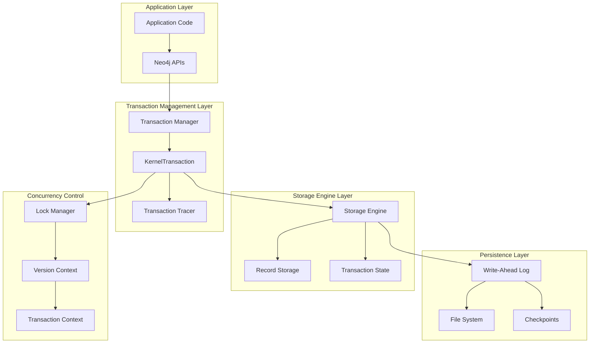
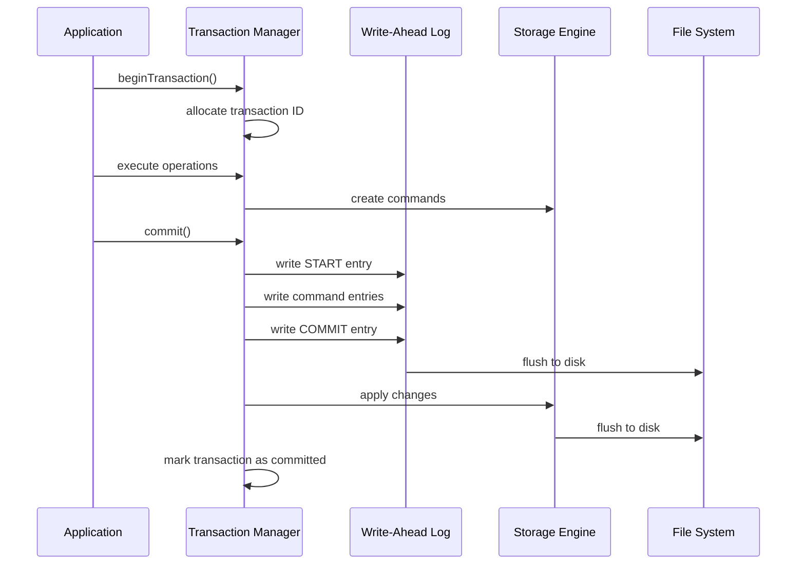
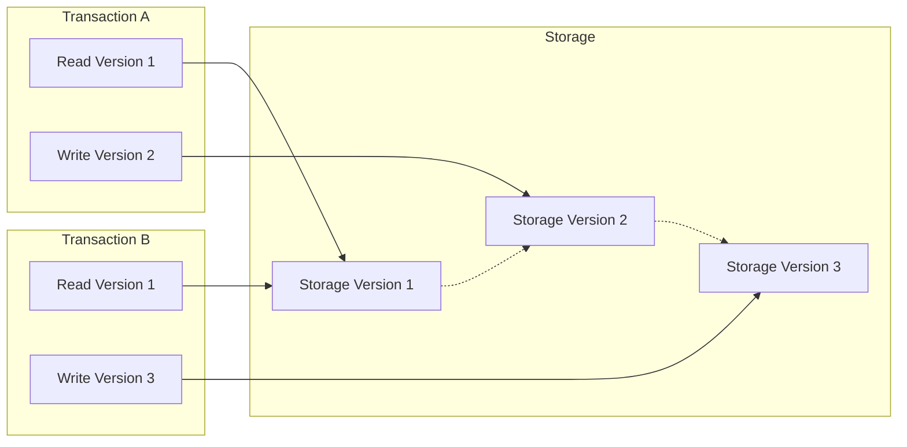
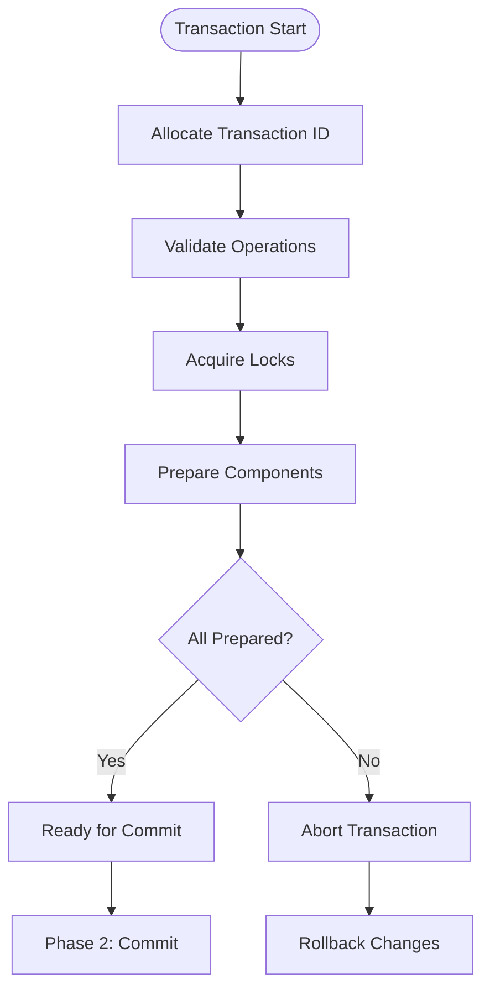
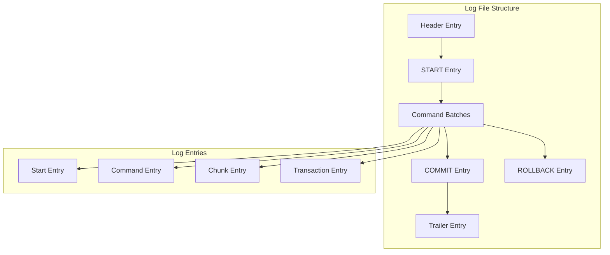
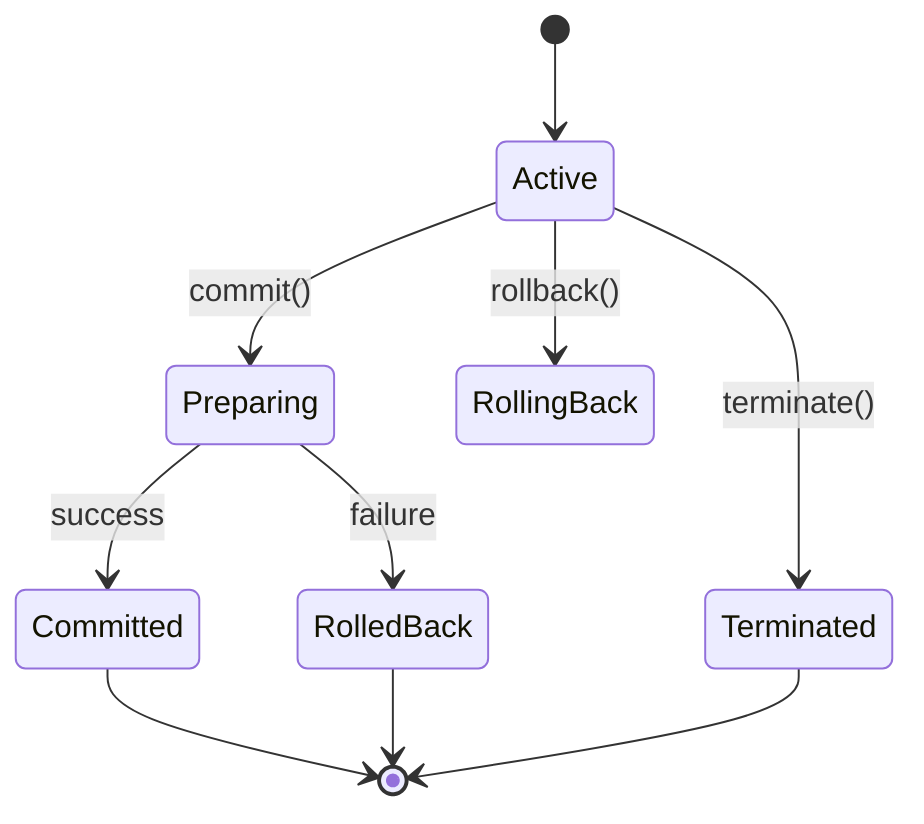
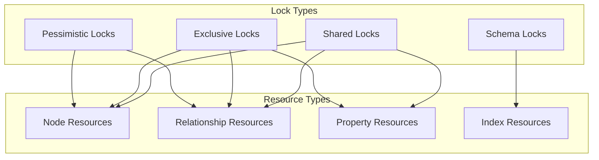
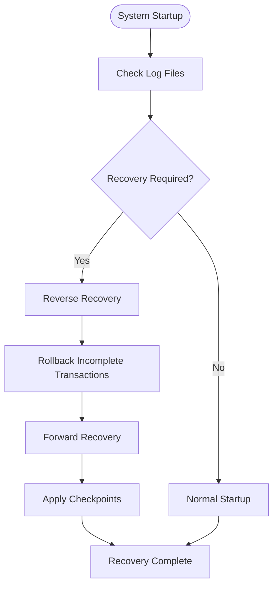
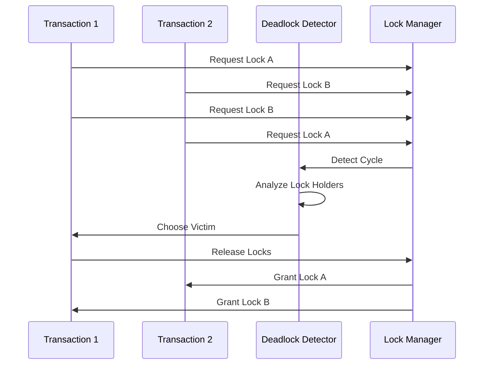
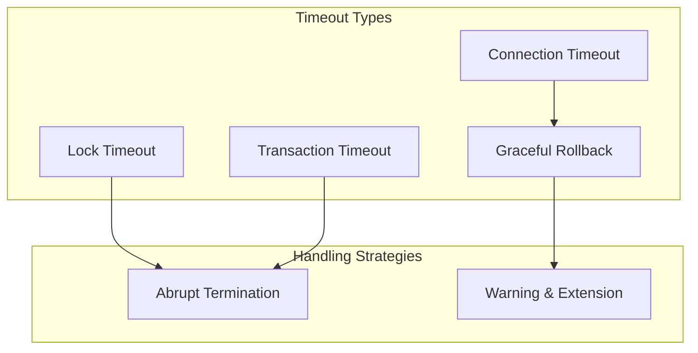

# Transaction Management

<cite>
**Referenced Files in This Document**
- [KernelTransactionImplementation.java](file://community/kernel/src/main/java/org/neo4j/kernel/impl/transaction/KernelTransactionImplementation.java)
- [TransactionLogQueue.java](file://community/kernel/src/main/java/org/neo4j/kernel/impl/transaction/log/TransactionLogQueue.java)
- [PhysicalLogicalTransactionStore.java](file://community/kernel/src/main/java/org/neo4j/kernel/impl/transaction/log/PhysicalLogicalTransactionStore.java)
- [TransactionLogWriter.java](file://community/kernel/src/main/java/org/neo4j/kernel/impl/transaction/log/TransactionLogWriter.java)
- [TransactionCommitment.java](file://community/kernel/src/main/java/org/neo4j/kernel/impl/transaction/log/TransactionCommitment.java)
- [Recovery.java](file://community/kernel/src/main/java/org/neo4j/kernel/recovery/Recovery.java)
- [TransactionLogsRecovery.java](file://community/kernel/src/main/java/org/neo4j/kernel/recovery/TransactionLogsRecovery.java)
- [TransactionCommandValidator.java](file://community/record-storage-engine/src/main/java/org/neo4j/internal/recordstorage/validation/TransactionCommandValidator.java)
- [TransactionConflictException.java](file://community/kernel-api/src/main/java/org/neo4j/storageengine/api/txstate/validation/TransactionConflictException.java)
- [TransactionMonitor.java](file://community/kernel/src/main/java/org/neo4j/kernel/impl/api/transaction/monitor/TransactionMonitor.java)
- [DeadlockDetectedException.java](file://community/lock/src/main/Java/org/neo4j/kernel/DeadlockDetectedException.java)
- [LockAcquisitionTimeoutException.java](file://community/lock/src/main/Java/org/neo4j/kernel/impl/locking/LockAcquisitionTimeoutException.java)
- [RecordStorageEngine.java](file://community/record-storage-engine/src/main/java/org/neo4j/internal/recordstorage/RecordStorageEngine.java)
- [TxState.java](file://community/kernel/src/main/java/org/neo4j/kernel/impl/api/state/TxState.java)
- [TransactionIdStore.java](file://community/kernel-api/src/main/java/org/neo4j/storageengine/api/TransactionIdStore.java)
- [TransactionEvent.java](file://community/kernel/src/main/java/org/neo4j/kernel/impl/transaction/tracing/TransactionEvent.java)
</cite>

## Table of Contents
1. [Introduction](#introduction)
2. [Transaction Management Architecture](#transaction-management-architecture)
3. [ACID Properties Implementation](#acid-properties-implementation)
4. [Two-Phase Commit Protocol](#two-phase-commit-protocol)
5. [Transaction Isolation Levels](#transaction-isolation-levels)
6. [Write-Ahead Logging (WAL)](#write-ahead-logging-wal)
7. [Transaction State Management](#transaction-state-management)
8. [Concurrency Control and Locking](#concurrency-control-and-locking)
9. [Transaction Recovery](#transaction-recovery)
10. [Deadlock Detection and Resolution](#deadlock-detection-and-resolution)
11. [Transaction Timeout and Long-Running Transactions](#transaction-timeout-and-long-running-transactions)
12. [Performance Considerations](#performance-considerations)
13. [Troubleshooting Guide](#troubleshooting-guide)
14. [Conclusion](#conclusion)

## Introduction

Neo4j's Transaction Management subsystem is a sophisticated system that ensures ACID (Atomicity, Consistency, Isolation, Durability) compliance in a graph database context. This system manages concurrent access to graph data, maintains data consistency, and provides robust recovery mechanisms after system failures.

The transaction management system operates at multiple levels:
- **Kernel Level**: Core transaction coordination and lifecycle management
- **Storage Engine Level**: Low-level record management and persistence
- **WAL Layer**: Write-ahead logging for durability and recovery
- **Concurrency Control**: Locking mechanisms and isolation enforcement

## Transaction Management Architecture

The transaction management architecture in Neo4j follows a layered approach with clear separation of concerns:

**Diagram sources**
- [KernelTransactionImplementation.java](file://community/kernel/src/main/java/org/neo4j/kernel/impl/transaction/KernelTransactionImplementation.java#L192-L210)
- [RecordStorageEngine.java](file://community/record-storage-engine/src/main/java/org/neo4j/internal/recordstorage/RecordStorageEngine.java#L142-L180)

**Section sources**
- [KernelTransactionImplementation.java](file://community/kernel/src/main/java/org/neo4j/kernel/impl/transaction/KernelTransactionImplementation.java#L192-L210)
- [RecordStorageEngine.java](file://community/record-storage-engine/src/main/java/org/neo4j/internal/recordstorage/RecordStorageEngine.java#L142-L180)

## ACID Properties Implementation

### Atomicity

Neo4j ensures atomicity through the two-phase commit protocol and write-ahead logging:

**Diagram sources**
- [TransactionLogWriter.java](file://community/kernel/src/main/java/org/neo4j/kernel/impl/transaction/log/TransactionLogWriter.java#L84-L130)
- [TransactionCommitment.java](file://community/kernel/src/main/java/org/neo4j/kernel/impl/transaction/log/TransactionCommitment.java#L50-L72)

### Consistency

Consistency is maintained through:
- **Schema Constraints**: Enforced during transaction execution
- **Data Validation**: Checked before applying changes
- **Transaction Validation**: Conflicts detected and resolved

### Isolation

Neo4j provides multiple isolation levels through MVCC (Multi-Version Concurrency Control):

**Diagram sources**
- [TransactionVersionContext.java](file://community/kernel/src/main/java/org/neo4j/kernel/impl/context/TransactionVersionContext.java#L119-L141)

### Durability

Durability is ensured through:
- **Write-Ahead Logging**: All changes are logged before being applied
- **Checkpoint Mechanism**: Periodic snapshots of the database state
- **Atomic Writes**: All-or-nothing semantics for log entries

**Section sources**
- [TransactionLogWriter.java](file://community/kernel/src/main/java/org/neo4j/kernel/impl/transaction/log/TransactionLogWriter.java#L84-L130)
- [TransactionCommitment.java](file://community/kernel/src/main/java/org/neo4j/kernel/impl/transaction/log/TransactionCommitment.java#L50-L72)

## Two-Phase Commit Protocol

Neo4j implements a two-phase commit protocol to ensure consistency across distributed operations:

### Phase 1: Prepare Phase

During the prepare phase, the transaction coordinator:
1. Allocates a transaction ID
2. Validates all operations
3. Acquires necessary locks
4. Prepares all involved components

**Diagram sources**
- [KernelTransactionImplementation.java](file://community/kernel/src/main/java/org/neo4j/kernel/impl/transaction/KernelTransactionImplementation.java#L640-L642)

### Phase 2: Commit Phase

The commit phase involves:
1. Writing the commit log entry
2. Applying changes to storage
3. Releasing locks
4. Marking transaction as committed

**Section sources**
- [KernelTransactionImplementation.java](file://community/kernel/src/main/java/org/neo4j/kernel/impl/transaction/KernelTransactionImplementation.java#L640-L642)

## Transaction Isolation Levels

Neo4j supports multiple isolation levels through its MVCC implementation:

### Read Committed

The default isolation level where:
- Transactions see only committed data
- No dirty reads occur
- Non-repeatable reads may occur

### Serializable

Achieved through:
- Strict locking mechanisms
- Serialization order enforcement
- Prevents phantom reads

### Snapshot Isolation

Implemented via:
- MVCC with versioned data
- Consistent reads across transaction
- No write skew anomalies

**Section sources**
- [TransactionVersionContext.java](file://community/kernel/src/main/java/org/neo4j/kernel/impl/context/TransactionVersionContext.java#L119-L141)

## Write-Ahead Logging (WAL)

The Write-Ahead Logging system ensures durability and recovery capability:

### WAL Structure

**Diagram sources**
- [TransactionLogWriter.java](file://community/kernel/src/main/java/org/neo4j/kernel/impl/transaction/log/TransactionLogWriter.java#L84-L130)

### WAL Operations

The WAL handles several types of operations:
- **Start Entries**: Mark transaction beginning
- **Command Entries**: Contain actual data modifications
- **Commit Entries**: Indicate successful completion
- **Rollback Entries**: Handle transaction cancellation

**Section sources**
- [TransactionLogWriter.java](file://community/kernel/src/main/java/org/neo4j/kernel/impl/transaction/log/TransactionLogWriter.java#L84-L130)

## Transaction State Management

Transaction state is managed through multiple components:

### Transaction State Machine

**Diagram sources**
- [KernelTransactionImplementation.java](file://community/kernel/src/main/java/org/neo4j/kernel/impl/transaction/KernelTransactionImplementation.java#L640-L642)

### State Tracking Components

- **Transaction ID Store**: Tracks committed and uncommitted transactions
- **Transaction Metadata Cache**: Caches transaction metadata for performance
- **Transaction Event Listeners**: Monitor transaction lifecycle events

**Section sources**
- [KernelTransactionImplementation.java](file://community/kernel/src/main/java/org/neo4j/kernel/impl/transaction/KernelTransactionImplementation.java#L640-L642)
- [TransactionIdStore.java](file://community/kernel-api/src/main/java/org/neo4j/storageengine/api/TransactionIdStore.java#L32-L57)

## Concurrency Control and Locking

Neo4j employs a sophisticated locking mechanism to manage concurrent access:

### Lock Types

**Diagram sources**
- [LockAcquisitionTimeoutException.java](file://community/lock/src/main/Java/org/neo4j/kernel/impl/locking/LockAcquisitionTimeoutException.java#L34-L62)

### Lock Acquisition Strategy

The system uses a timeout-based approach:
1. Attempt to acquire lock immediately
2. Wait with exponential backoff
3. Throw timeout exception if acquisition fails

**Section sources**
- [LockAcquisitionTimeoutException.java](file://community/lock/src/main/Java/org/neo4j/kernel/impl/locking/LockAcquisitionTimeoutException.java#L34-L62)

## Transaction Recovery

Transaction recovery ensures database consistency after crashes:

### Recovery Process

**Diagram sources**
- [TransactionLogsRecovery.java](file://community/kernel/src/main/java/org/neo4j/kernel/recovery/TransactionLogsRecovery.java#L78-L363)

### Recovery Modes

- **Full Recovery**: Complete log replay
- **Partial Recovery**: Based on recovery predicates
- **Point-in-Time Recovery**: Recovery to specific timestamp

**Section sources**
- [TransactionLogsRecovery.java](file://community/kernel/src/main/java/org/neo4j/kernel/recovery/TransactionLogsRecovery.java#L78-L363)
- [Recovery.java](file://community/kernel/src/main/java/org/neo4j/kernel/recovery/Recovery.java#L229-L876)

## Deadlock Detection and Resolution

Neo4j implements deadlock detection to prevent circular waits:

### Deadlock Detection Algorithm

**Diagram sources**
- [DeadlockDetectedException.java](file://community/lock/src/main/Java/org/neo4j/kernel/DeadlockDetectedException.java#L32-L55)

### Deadlock Resolution Strategy

The system uses a priority-based approach:
1. Count held locks (fewer is better)
2. Compare transaction IDs (lower is better)
3. Abort the transaction with fewer locks or lower ID

**Section sources**
- [DeadlockDetectedException.java](file://community/lock/src/main/Java/org/neo4j/kernel/DeadlockDetectedException.java#L32-L55)

## Transaction Timeout and Long-Running Transactions

### Timeout Mechanisms

Neo4j provides multiple timeout mechanisms:

**Diagram sources**
- [TransactionMonitor.java](file://community/kernel/src/main/java/org/neo4j/kernel/impl/api/transaction/monitor/TransactionMonitor.java#L33-L66)

### Long-Running Transaction Management

For long-running transactions:
1. **Progress Monitoring**: Track transaction progress
2. **Resource Limits**: Enforce memory and CPU limits
3. **Checkpoint Strategy**: Use frequent checkpoints
4. **Timeout Extensions**: Allow manual extensions

**Section sources**
- [TransactionMonitor.java](file://community/kernel/src/main/java/org/neo4j/kernel/impl/api/transaction/monitor/TransactionMonitor.java#L33-L66)

## Performance Considerations

### Transaction Performance Optimization

Key factors affecting transaction performance:

| Factor | Impact | Optimization Strategy |
|--------|--------|----------------------|
| Lock Contention | High | Reduce lock granularity |
| WAL Size | Medium | Optimize batch sizes |
| Checkpoint Frequency | Medium | Balance safety vs performance |
| Index Updates | High | Batch index operations |
| Memory Usage | Medium | Tune heap allocation |

### Monitoring and Metrics

Transaction performance is monitored through:
- **Transaction Throughput**: Transactions per second
- **Lock Wait Time**: Average lock acquisition time
- **WAL Flush Frequency**: Log write performance
- **Recovery Time**: Crash recovery duration

**Section sources**
- [TransactionEvent.java](file://community/kernel/src/main/java/org/neo4j/kernel/impl/transaction/tracing/TransactionEvent.java#L35-L103)

## Troubleshooting Guide

### Common Transaction Issues

#### Transaction Timeout

**Symptoms**: Transactions failing with timeout errors
**Causes**: 
- Long-running queries
- Lock contention
- Network latency
- Resource exhaustion

**Solutions**:
1. Increase timeout values
2. Optimize query performance
3. Reduce transaction scope
4. Monitor resource usage

#### Deadlock Detection

**Symptoms**: Transactions failing with deadlock errors
**Causes**:
- Circular lock dependencies
- Poor transaction ordering
- Long-held locks

**Solutions**:
1. Implement consistent lock ordering
2. Reduce transaction duration
3. Use optimistic concurrency
4. Review application logic

#### Recovery Failures

**Symptoms**: Database fails to start after crash
**Causes**:
- Corrupted log files
- Insufficient disk space
- Hardware failures

**Solutions**:
1. Restore from backup
2. Repair corrupted logs
3. Clean log files
4. Verify hardware health

**Section sources**
- [TransactionConflictException.java](file://community/kernel-api/src/main/java/org/neo4j/storageengine/api/txstate/validation/TransactionConflictException.java#L30-L110)
- [TransactionCommandValidator.java](file://community/record-storage-engine/src/main/java/org/neo4j/internal/recordstorage/validation/TransactionCommandValidator.java#L56-L143)

## Conclusion

Neo4j's Transaction Management subsystem provides a robust foundation for ACID-compliant operations in a graph database environment. The system's layered architecture, sophisticated concurrency control mechanisms, and comprehensive recovery capabilities ensure data consistency and reliability.

Key strengths of the system include:

- **ACID Compliance**: Full support for atomicity, consistency, isolation, and durability
- **MVCC Implementation**: Efficient concurrency control with minimal blocking
- **Robust Recovery**: Comprehensive crash recovery with multiple recovery modes
- **Deadlock Prevention**: Automatic deadlock detection and resolution
- **Performance Optimization**: Various strategies for optimizing transaction performance

The transaction management system continues to evolve with new features and optimizations, making it suitable for demanding enterprise applications requiring high availability and strong consistency guarantees.

Understanding these concepts and mechanisms enables developers to write efficient, reliable applications that leverage Neo4j's powerful transaction capabilities while avoiding common pitfalls and performance bottlenecks.