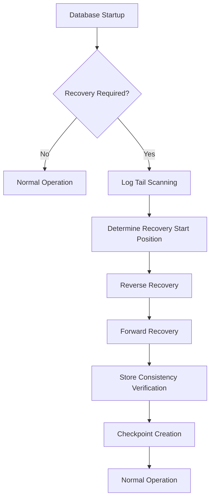
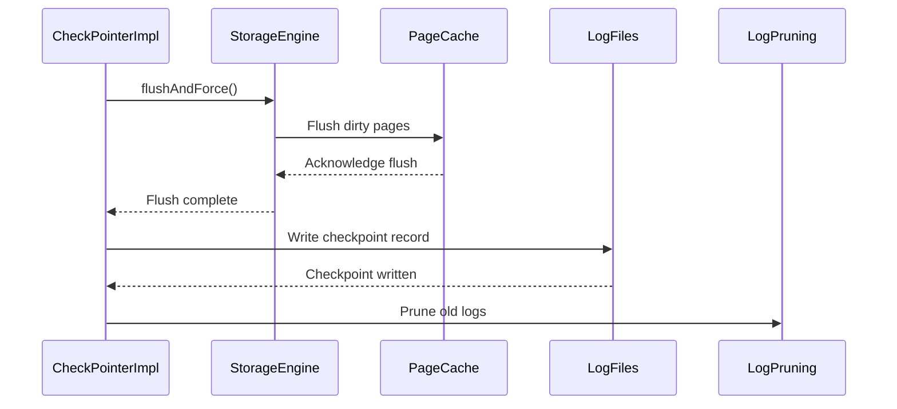
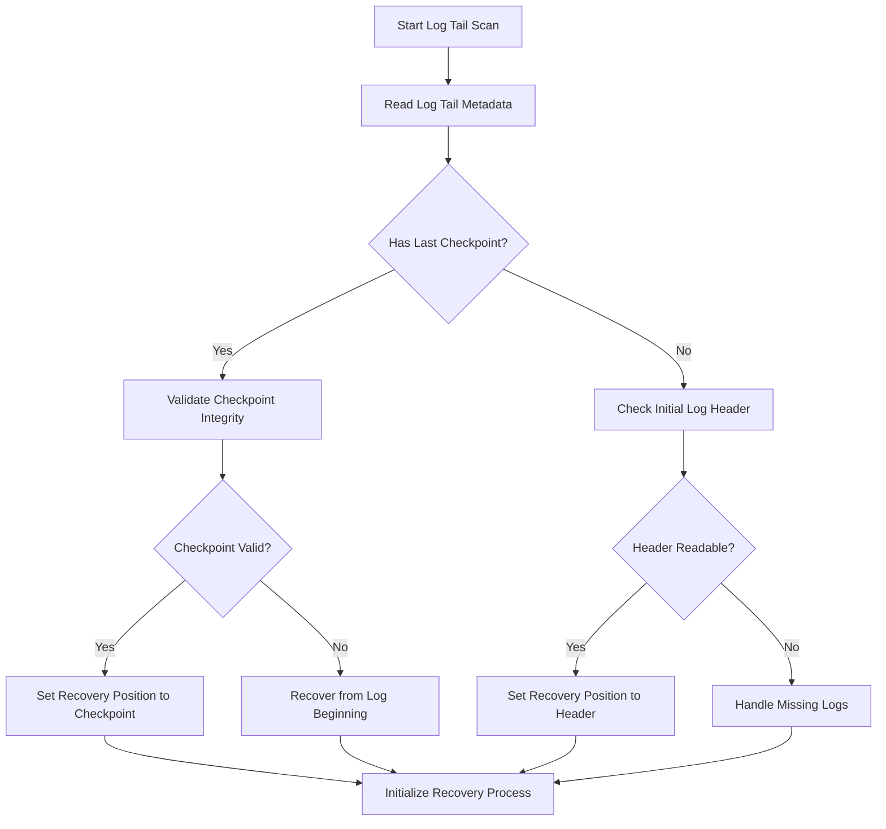
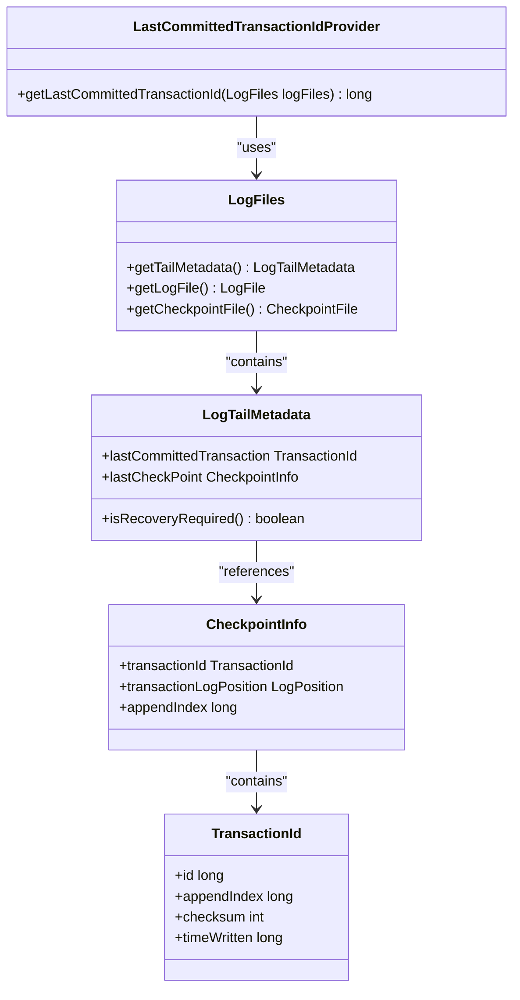
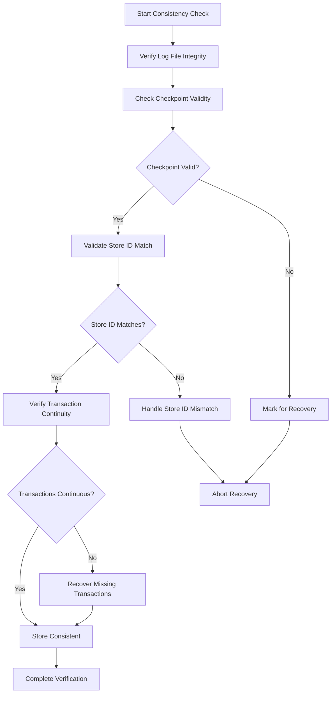
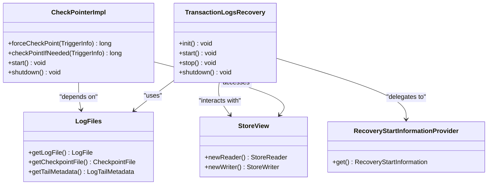
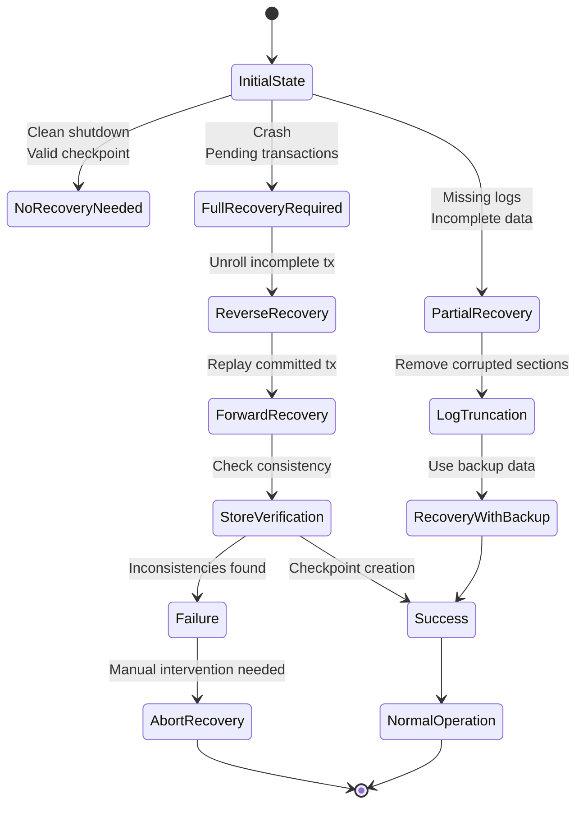
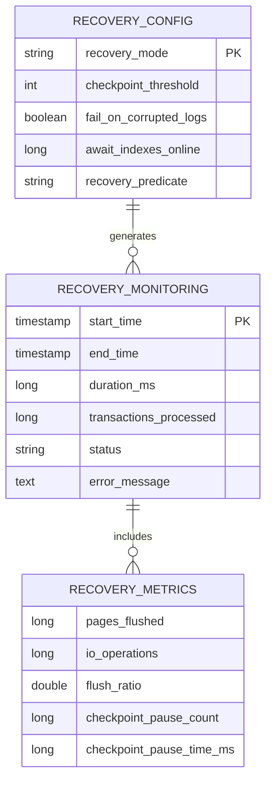

# Transaction Recovery

<cite>
**Referenced Files in This Document**   
- [Recovery.java](file://community/kernel/src/main/java/org/neo4j/kernel/recovery/Recovery.java)
- [CheckPointerImpl.java](file://community/kernel/src/main/java/org/neo4j/kernel/impl/transaction/log/checkpoint/CheckPointerImpl.java)
- [TransactionLogsRecovery.java](file://community/kernel/src/main/java/org/neo4j/kernel/recovery/TransactionLogsRecovery.java)
- [RecoveryStartInformationProvider.java](file://community/kernel/src/main/java/org/neo4j/kernel/recovery/RecoveryStartInformationProvider.java)
- [CorruptedLogsTruncator.java](file://community/kernel/src/main/java/org/neo4j/kernel/recovery/CorruptedLogsTruncator.java)
- [CheckpointLogFile.java](file://community/kernel/src/main/java/org/neo4j/kernel/impl/transaction/log/files/checkpoint/CheckpointLogFile.java)
- [DetachedLogTailScanner.java](file://community/kernel/src/main/java/org/neo4j/kernel/impl/transaction/log/files/checkpoint/DetachedLogTailScanner.java)
- [DefaultRecoveryService.java](file://community/kernel/src/main/java/org/neo4j/kernel/recovery/DefaultRecoveryService.java)
- [RecoveryContextTracker.java](file://community/kernel/src/main/java/org/neo4j/kernel/recovery/RecoveryContextTracker.java)
- [RecoveryStartInformation.java](file://community/kernel/src/main/java/org/neo4j/kernel/recovery/RecoveryStartInformation.java)
</cite>

## Table of Contents
1. [Introduction](#introduction)
2. [Recovery Process Overview](#recovery-process-overview)
3. [Checkpointing Mechanism](#checkpointing-mechanism)
4. [Log Tail Scanning and Recovery Initialization](#log-tail-scanning-and-recovery-initialization)
5. [Last Committed Transaction Identification](#last-committed-transaction-identification)
6. [Store Consistency Verification](#store-consistency-verification)
7. [Component Interactions](#component-interactions)
8. [Failure Modes and Recovery Scenarios](#failure-modes-and-recovery-scenarios)
9. [Recovery Monitoring and Configuration](#recovery-monitoring-and-configuration)
10. [Conclusion](#conclusion)

## Introduction
Transaction recovery in Neo4j's storage engine ensures database consistency after crashes by leveraging checkpointing and transaction logs. This mechanism guarantees ACID properties by restoring the database to a consistent state through systematic recovery processes. The recovery system analyzes transaction logs and checkpoints to determine the recovery starting point, replay transactions, and verify store consistency. Key components include CheckPointerImpl for managing checkpoints, LogFiles for handling log initialization, and various recovery coordinators that work together to ensure reliable database restoration. The system is designed to handle various failure scenarios while maintaining data integrity and providing monitoring capabilities for recovery operations.

**Section sources**
- [Recovery.java](file://community/kernel/src/main/java/org/neo4j/kernel/recovery/Recovery.java#L154-L160)
- [CheckPointerImpl.java](file://community/kernel/src/main/java/org/neo4j/kernel/impl/transaction/log/checkpoint/CheckPointerImpl.java#L48-L50)

## Recovery Process Overview
The transaction recovery process in Neo4j begins during database startup when the system determines if recovery is required. The process follows a systematic approach to restore database consistency after crashes or unexpected shutdowns. First, the system scans the log tail to identify the last checkpoint and determine the recovery starting position. If no checkpoint is found, recovery starts from the beginning of the transaction logs. The recovery process then replays transactions from the determined starting position, applying changes to bring the database to a consistent state.

The recovery mechanism operates in phases: reverse recovery and forward recovery. Reverse recovery unrolls incomplete transactions that were active at the time of the crash, while forward recovery reapplies committed transactions that occurred after the last checkpoint. This two-phase approach ensures that the database reaches a state equivalent to what it would have been had the crash not occurred. Throughout the process, the system maintains transaction id tracking and monitors progress to ensure all necessary transactions are properly handled.

**Diagram sources**
- [Recovery.java](file://community/kernel/src/main/java/org/neo4j/kernel/recovery/Recovery.java#L479-L780)
- [TransactionLogsRecovery.java](file://community/kernel/src/main/java/org/neo4j/kernel/recovery/TransactionLogsRecovery.java#L119-L438)

**Section sources**
- [Recovery.java](file://community/kernel/src/main/java/org/neo4j/kernel/recovery/Recovery.java#L479-L780)
- [TransactionLogsRecovery.java](file://community/kernel/src/main/java/org/neo4j/kernel/recovery/TransactionLogsRecovery.java#L119-L438)

## Checkpointing Mechanism
The checkpointing mechanism in Neo4j's storage engine serves as a critical component for efficient recovery operations. Checkpoints mark specific points in the transaction log where the database has reached a consistent state, allowing recovery to start from these points rather than processing the entire transaction log. The CheckPointerImpl class coordinates checkpoint creation, determining when to trigger checkpoints based on various thresholds such as transaction count, time elapsed, or log size.

Checkpoints are created through a multi-step process that ensures data consistency. First, the system flushes all pending changes from memory to disk, ensuring all modifications are durably stored. Then, a checkpoint record is written to the transaction log, containing metadata about the checkpoint including the position in the log, transaction id, and timestamp. This record serves as a recovery marker during subsequent startup operations. The checkpointing process is designed to minimize performance impact by coordinating with the page cache and storage engine to optimize I/O operations.

**Diagram sources**
- [CheckPointerImpl.java](file://community/kernel/src/main/java/org/neo4j/kernel/impl/transaction/log/checkpoint/CheckPointerImpl.java#L210-L281)
- [Recovery.java](file://community/kernel/src/main/java/org/neo4j/kernel/recovery/Recovery.java#L735-L753)

**Section sources**
- [CheckPointerImpl.java](file://community/kernel/src/main/java/org/neo4j/kernel/impl/transaction/log/checkpoint/CheckPointerImpl.java#L210-L281)
- [CheckpointLogFile.java](file://community/kernel/src/main/java/org/neo4j/kernel/impl/transaction/log/files/checkpoint/CheckpointLogFile.java#L85-L107)

## Log Tail Scanning and Recovery Initialization
Log tail scanning is the initial phase of the recovery process where the system examines the end of transaction logs to determine the recovery starting point. The RecoveryStartInformationProvider component performs this scanning by analyzing the log tail metadata to identify the last checkpoint and assess whether recovery is required. This process involves reading the log header information and checkpoint records to establish the database's state at the time of shutdown.

The recovery initialization process begins by collecting metadata about the transaction logs, including the highest and lowest log versions, last committed transaction information, and checkpoint details. This information is used to create a RecoveryStartInformation object that guides the subsequent recovery operations. If the log tail indicates that recovery is needed, the system determines the exact log position from which to start replaying transactions. The scanning process also verifies log integrity and handles cases where logs may be missing or corrupted.

**Diagram sources**
- [RecoveryStartInformationProvider.java](file://community/kernel/src/main/java/org/neo4j/kernel/recovery/RecoveryStartInformationProvider.java#L80-L147)
- [Recovery.java](file://community/kernel/src/main/java/org/neo4j/kernel/recovery/Recovery.java#L585-L593)

**Section sources**
- [RecoveryStartInformationProvider.java](file://community/kernel/src/main/java/org/neo4j/kernel/recovery/RecoveryStartInformationProvider.java#L80-L147)
- [DetachedLogTailScanner.java](file://community/kernel/src/main/java/org/neo4j/kernel/impl/transaction/log/files/checkpoint/DetachedLogTailScanner.java#L227-L301)

## Last Committed Transaction Identification
Identifying the last committed transaction is crucial for establishing the database's consistent state during recovery. The system uses the LastCommittedTransactionIdProvider component to determine the highest transaction id that was successfully committed before the crash. This information is stored in the checkpoint records and log tail metadata, allowing the recovery process to accurately identify the point from which to resume normal operations.

The identification process involves analyzing the transaction log entries to find the most recent commit record that precedes the last checkpoint. The system examines the log position, transaction id, and append index to ensure accurate identification. During recovery, this information is used to initialize the transaction id store and ensure that subsequent transactions are assigned appropriate ids. The process also verifies the integrity of the identified transaction by checking its checksum and timestamp against stored metadata.

**Diagram sources**
- [RecoveryStartInformation.java](file://community/kernel/src/main/java/org/neo4j/kernel/recovery/RecoveryStartInformation.java#L33-L57)
- [DefaultRecoveryService.java](file://community/kernel/src/main/java/org/neo4j/kernel/recovery/DefaultRecoveryService.java#L113-L120)

**Section sources**
- [RecoveryStartInformation.java](file://community/kernel/src/main/java/org/neo4j/kernel/recovery/RecoveryStartInformation.java#L33-L57)
- [DefaultRecoveryService.java](file://community/kernel/src/main/java/org/neo4j/kernel/recovery/DefaultRecoveryService.java#L113-L120)

## Store Consistency Verification
Store consistency verification ensures that the database reaches a valid state after recovery operations. This process involves multiple validation steps to confirm that all transactions have been properly applied and that the store files are in a consistent condition. The system verifies the integrity of transaction logs, checkpoint files, and store data files to detect and handle any corruption that may have occurred.

The verification process begins by checking the alignment between the transaction log position and the last committed transaction id. It then validates that all expected log files exist and contain valid data. For checkpoint files, the system verifies that the checkpoint record points to a valid location in the transaction log and that the store id matches across components. If any inconsistencies are detected, the system may truncate corrupted log sections or initiate additional recovery procedures to restore consistency.

**Diagram sources**
- [CorruptedLogsTruncator.java](file://community/kernel/src/main/java/org/neo4j/kernel/recovery/CorruptedLogsTruncator.java#L106-L133)
- [Recovery.java](file://community/kernel/src/main/java/org/neo4j/kernel/recovery/Recovery.java#L693-L694)

**Section sources**
- [CorruptedLogsTruncator.java](file://community/kernel/src/main/java/org/neo4j/kernel/recovery/CorruptedLogsTruncator.java#L106-L133)
- [Recovery.java](file://community/kernel/src/main/java/org/neo4j/kernel/recovery/Recovery.java#L693-L694)

## Component Interactions
The transaction recovery mechanism in Neo4j involves coordinated interactions between multiple components that work together to ensure reliable database restoration. The CheckPointerImpl coordinates checkpoint creation and works with the LogFiles component to manage transaction log files. The RecoveryStartInformationProvider analyzes log metadata to determine recovery requirements, while the TransactionLogsRecovery component executes the actual recovery process.

These components interact through well-defined interfaces and dependency injection. The CheckPointerImpl depends on the LogFiles component to access transaction logs and checkpoint files, while the recovery process relies on the CheckPointerImpl to establish consistent recovery points. The StoreView component provides a consistent view of the store state during recovery, allowing other components to safely read and modify data. This modular design enables independent development and testing of recovery components while ensuring they work together seamlessly.

**Diagram sources**
- [Recovery.java](file://community/kernel/src/main/java/org/neo4j/kernel/recovery/Recovery.java#L735-L753)
- [TransactionLogsRecovery.java](file://community/kernel/src/main/java/org/neo4j/kernel/recovery/TransactionLogsRecovery.java#L85-L117)

**Section sources**
- [Recovery.java](file://community/kernel/src/main/java/org/neo4j/kernel/recovery/Recovery.java#L735-L753)
- [TransactionLogsRecovery.java](file://community/kernel/src/main/java/org/neo4j/kernel/recovery/TransactionLogsRecovery.java#L85-L117)

## Failure Modes and Recovery Scenarios
The transaction recovery system in Neo4j handles various failure modes and recovery scenarios to ensure database reliability. Common scenarios include clean shutdown recovery, crash recovery, and recovery with missing logs. In clean shutdown cases, the system may determine that no recovery is needed if the last checkpoint is valid and no pending transactions exist. For crash recovery, the system must replay transactions from the last checkpoint to restore consistency.

The system handles several failure modes during recovery, including corrupted log files, missing checkpoint records, and inconsistent store states. When log corruption is detected, the CorruptedLogsTruncator component removes the corrupted sections while preserving valid data. If checkpoint files are missing or invalid, the system falls back to scanning transaction logs from the beginning. The recovery process is designed to be resilient, with mechanisms to handle partial failures and continue recovery when possible.

**Diagram sources**
- [CorruptedLogsTruncator.java](file://community/kernel/src/main/java/org/neo4j/kernel/recovery/CorruptedLogsTruncator.java#L106-L133)
- [Recovery.java](file://community/kernel/src/main/java/org/neo4j/kernel/recovery/Recovery.java#L760-L779)

**Section sources**
- [CorruptedLogsTruncator.java](file://community/kernel/src/main/java/org/neo4j/kernel/recovery/CorruptedLogsTruncator.java#L106-L133)
- [Recovery.java](file://community/kernel/src/main/java/org/neo4j/kernel/recovery/Recovery.java#L760-L779)

## Recovery Monitoring and Configuration
Recovery monitoring and configuration provide visibility into the recovery process and allow tuning of recovery behavior. The system includes monitoring capabilities through the RecoveryMonitor interface, which reports key events such as recovery start, completion, and any failures encountered. These events are logged and can be integrated with external monitoring systems for operational oversight.

Configuration options allow administrators to control various aspects of the recovery process, including checkpoint thresholds, log pruning strategies, and recovery behavior. The system supports different recovery modes, such as full recovery and forward-only recovery, which can be selected based on operational requirements. Monitoring data includes recovery duration, number of transactions processed, and resource utilization, providing insights into recovery performance and potential bottlenecks.

**Diagram sources**
- [Recovery.java](file://community/kernel/src/main/java/org/neo4j/kernel/recovery/Recovery.java#L709-L710)
- [CheckPointerImpl.java](file://community/kernel/src/main/java/org/neo4j/kernel/impl/transaction/log/checkpoint/CheckPointerImpl.java#L283-L295)

**Section sources**
- [Recovery.java](file://community/kernel/src/main/java/org/neo4j/kernel/recovery/Recovery.java#L709-L710)
- [CheckPointerImpl.java](file://community/kernel/src/main/java/org/neo4j/kernel/impl/transaction/log/checkpoint/CheckPointerImpl.java#L283-L295)

## Conclusion
The transaction recovery mechanism in Neo4j's storage engine provides a robust solution for maintaining database consistency after crashes or unexpected shutdowns. By combining checkpointing with transaction log replay, the system ensures that databases can reliably recover to a consistent state. The architecture leverages multiple coordinated components, including CheckPointerImpl for managing checkpoints, LogFiles for handling log initialization, and specialized recovery services for executing the recovery process.

Key strengths of the recovery system include its ability to handle various failure modes, its modular design that enables independent component development, and its comprehensive monitoring capabilities. The system efficiently balances performance and reliability by using checkpoints to minimize recovery time while ensuring data integrity through thorough consistency verification. For developers and administrators, understanding the recovery process provides valuable insights into database resilience and helps in designing systems that can withstand unexpected failures while maintaining data consistency.

**Section sources**
- [Recovery.java](file://community/kernel/src/main/java/org/neo4j/kernel/recovery/Recovery.java#L760-L779)
- [CheckPointerImpl.java](file://community/kernel/src/main/java/org/neo4j/kernel/impl/transaction/log/checkpoint/CheckPointerImpl.java#L210-L281)