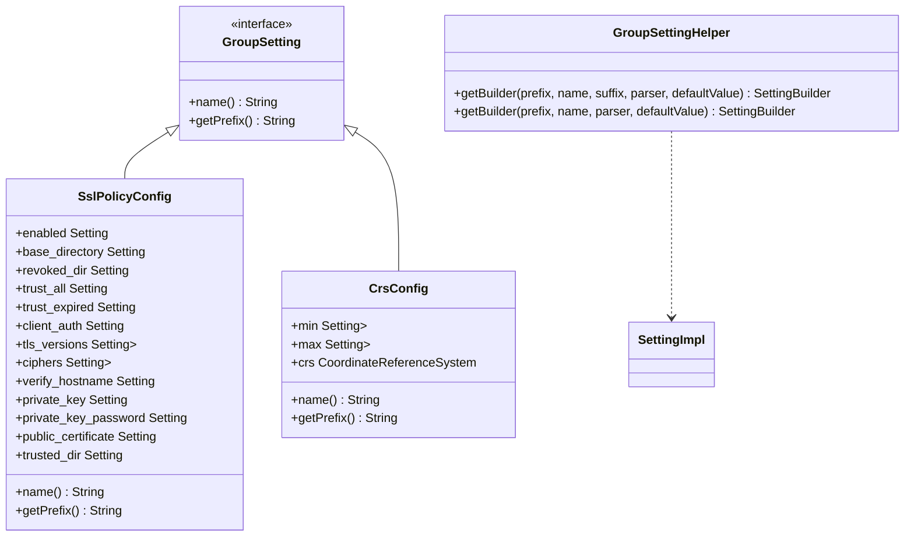
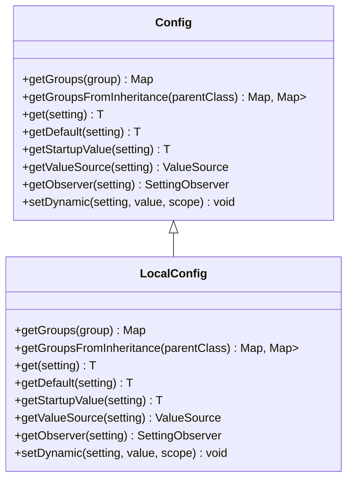
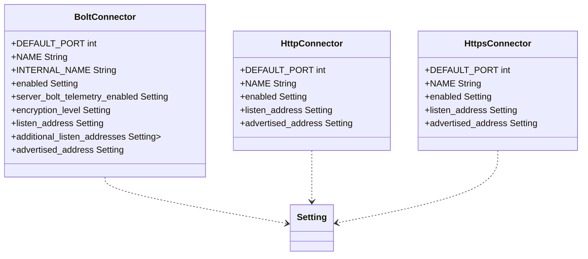
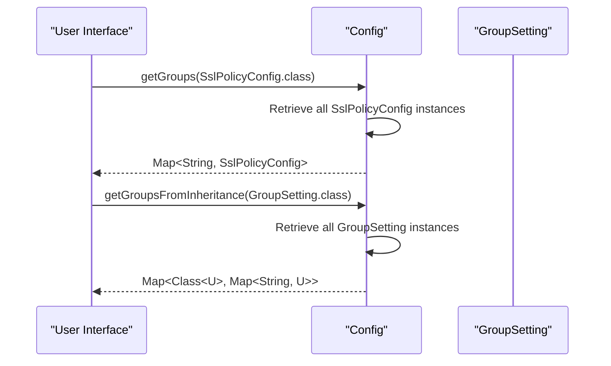
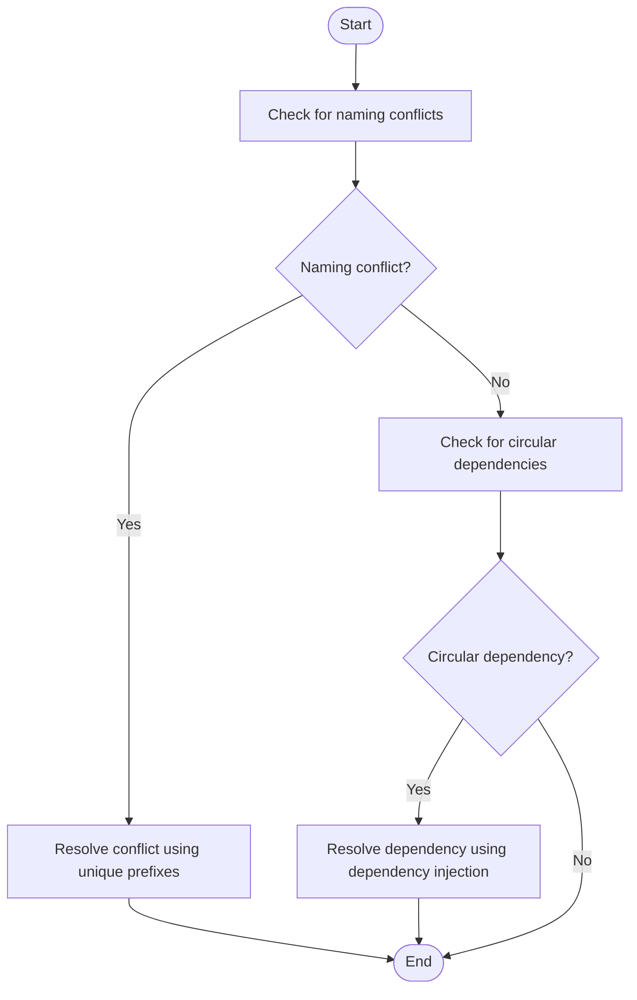
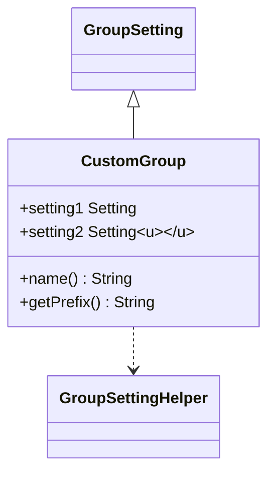

# Configuration Groups

<cite>
**Referenced Files in This Document**   
- [GroupSetting.java](file://community/configuration/src/main/java/org/neo4j/configuration/GroupSetting.java)
- [GroupSettingHelper.java](file://community/configuration/src/main/java/org/neo4j/configuration/GroupSettingHelper.java)
- [BoltConnector.java](file://community/configuration/src/main/java/org/neo4j/configuration/connectors/BoltConnector.java)
- [HttpConnector.java](file://community/configuration/src/main/java/org/neo4j/configuration/connectors/HttpConnector.java)
- [SslPolicyConfig.java](file://community/configuration/src/main/java/org/neo4j/configuration/ssl/SslPolicyConfig.java)
- [CrsConfig.java](file://community/kernel/src/main/java/org/neo4j/kernel/impl/index/schema/config/CrsConfig.java)
- [Config.java](file://community/configuration/src/main/java/org/neo4j/configuration/Config.java)
- [LocalConfig.java](file://community/configuration/src/main/java/org/neo4j/configuration/LocalConfig.java)
</cite>

## Table of Contents
1. [Introduction](#introduction)
2. [Domain Model](#domain-model)
3. [Core Components](#core-components)
4. [Implementation Examples](#implementation-examples)
5. [Configuration Loading and UI Presentation](#configuration-loading-and-ui-presentation)
6. [Common Issues and Solutions](#common-issues-and-solutions)
7. [Creating Custom Configuration Groups](#creating-custom-configuration-groups)
8. [Conclusion](#conclusion)

## Introduction
Configuration groups in Neo4j provide a structured approach to organizing related settings into logical units such as database, connectors, or storage. This organizational pattern enhances configuration management by grouping related parameters under a common prefix and name, enabling better maintainability and clarity. The implementation leverages the `GroupSetting` interface as a container for related settings and utilizes `GroupSettingHelper` for utility operations. This document explores the domain model, implementation examples, and practical considerations for working with configuration groups in Neo4j.

## Domain Model
The domain model for configuration groups in Neo4j centers around the `GroupSetting` interface, which serves as the foundation for organizing related settings. Each group is identified by a unique name and shares a common prefix, allowing for hierarchical organization of configuration parameters. The `GroupSettingHelper` class provides utility methods for creating settings within a group, simplifying the process of defining configuration options. This model supports both simple and complex hierarchical settings, enabling developers to create flexible and scalable configuration structures.

**Diagram sources**
- [GroupSetting.java](file://community/configuration/src/main/java/org/neo4j/configuration/GroupSetting.java)
- [GroupSettingHelper.java](file://community/configuration/src/main/java/org/neo4j/configuration/GroupSettingHelper.java)
- [SslPolicyConfig.java](file://community/configuration/src/main/java/org/neo4j/configuration/ssl/SslPolicyConfig.java)
- [CrsConfig.java](file://community/kernel/src/main/java/org/neo4j/kernel/impl/index/schema/config/CrsConfig.java)

**Section sources**
- [GroupSetting.java](file://community/configuration/src/main/java/org/neo4j/configuration/GroupSetting.java)
- [GroupSettingHelper.java](file://community/configuration/src/main/java/org/neo4j/configuration/GroupSettingHelper.java)

## Core Components
The core components of the configuration groups system in Neo4j include the `GroupSetting` interface, which defines the contract for configuration groups, and the `GroupSettingHelper` class, which provides utility methods for creating settings within a group. The `Config` class manages the lifecycle of configuration instances and provides methods for retrieving groups of settings. The `LocalConfig` class extends the functionality of `Config` by adding support for local configuration overrides and listeners.

**Diagram sources**
- [Config.java](file://community/configuration/src/main/java/org/neo4j/configuration/Config.java)
- [LocalConfig.java](file://community/configuration/src/main/java/org/neo4j/configuration/LocalConfig.java)

**Section sources**
- [Config.java](file://community/configuration/src/main/java/org/neo4j/configuration/Config.java)
- [LocalConfig.java](file://community/configuration/src/main/java/org/neo4j/configuration/LocalConfig.java)

## Implementation Examples
The implementation of configuration groups in Neo4j is exemplified by the `BoltConnector` and `HttpConnector` classes, which group their respective settings under common prefixes. The `BoltConnector` class defines settings such as `enabled`, `listen_address`, and `advertised_address`, while the `HttpConnector` class defines similar settings for HTTP connectivity. These examples demonstrate how configuration groups can be used to organize related settings in a logical and maintainable manner.

**Diagram sources**
- [BoltConnector.java](file://community/configuration/src/main/java/org/neo4j/configuration/connectors/BoltConnector.java)
- [HttpConnector.java](file://community/configuration/src/main/java/org/neo4j/configuration/connectors/HttpConnector.java)
- [HttpsConnector.java](file://community/configuration/src/main/java/org/neo4j/configuration/connectors/HttpsConnector.java)

**Section sources**
- [BoltConnector.java](file://community/configuration/src/main/java/org/neo4j/configuration/connectors/BoltConnector.java)
- [HttpConnector.java](file://community/configuration/src/main/java/org/neo4j/configuration/connectors/HttpConnector.java)

## Configuration Loading and UI Presentation
Configuration groups in Neo4j are loaded through the `Config` class, which manages the lifecycle of configuration instances and provides methods for retrieving groups of settings. The `getGroups` method allows for the retrieval of all instances of a specific group, while the `getGroupsFromInheritance` method enables the retrieval of groups based on inheritance relationships. This functionality supports both programmatic access to configuration data and integration with user interfaces for configuration management.

**Diagram sources**
- [Config.java](file://community/configuration/src/main/java/org/neo4j/configuration/Config.java)
- [SslPolicyConfig.java](file://community/configuration/src/main/java/org/neo4j/configuration/ssl/SslPolicyConfig.java)

**Section sources**
- [Config.java](file://community/configuration/src/main/java/org/neo4j/configuration/Config.java)

## Common Issues and Solutions
Common issues when working with configuration groups in Neo4j include naming conflicts and circular dependencies. Naming conflicts can occur when multiple groups define settings with the same name, leading to ambiguity in configuration resolution. Circular dependencies can arise when groups reference each other in a way that creates an infinite loop. These issues can be mitigated by using unique prefixes for each group and carefully managing dependencies between groups.

**Diagram sources**
- [Config.java](file://community/configuration/src/main/java/org/neo4j/configuration/Config.java)

**Section sources**
- [Config.java](file://community/configuration/src/main/java/org/neo4j/configuration/Config.java)

## Creating Custom Configuration Groups
Creating custom configuration groups in Neo4j involves implementing the `GroupSetting` interface and defining settings using the `GroupSettingHelper` class. Developers can create groups for specific domains such as database, connectors, or storage, and organize related settings under a common prefix. This approach promotes modularity and reusability, enabling the creation of flexible and scalable configuration structures.

**Diagram sources**
- [GroupSetting.java](file://community/configuration/src/main/java/org/neo4j/configuration/GroupSetting.java)
- [GroupSettingHelper.java](file://community/configuration/src/main/java/org/neo4j/configuration/GroupSettingHelper.java)

**Section sources**
- [GroupSetting.java](file://community/configuration/src/main/java/org/neo4j/configuration/GroupSetting.java)
- [GroupSettingHelper.java](file://community/configuration/src/main/java/org/neo4j/configuration/GroupSettingHelper.java)

## Conclusion
Configuration groups in Neo4j provide a powerful mechanism for organizing related settings into logical units, enhancing configuration management and maintainability. By leveraging the `GroupSetting` interface and `GroupSettingHelper` class, developers can create flexible and scalable configuration structures that support both simple and complex hierarchical settings. This document has explored the domain model, implementation examples, and practical considerations for working with configuration groups, providing a comprehensive guide for both beginners and experienced developers.