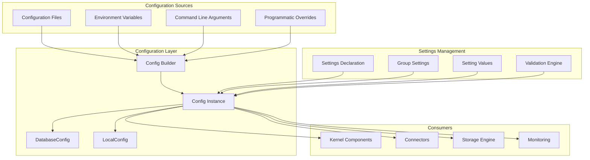
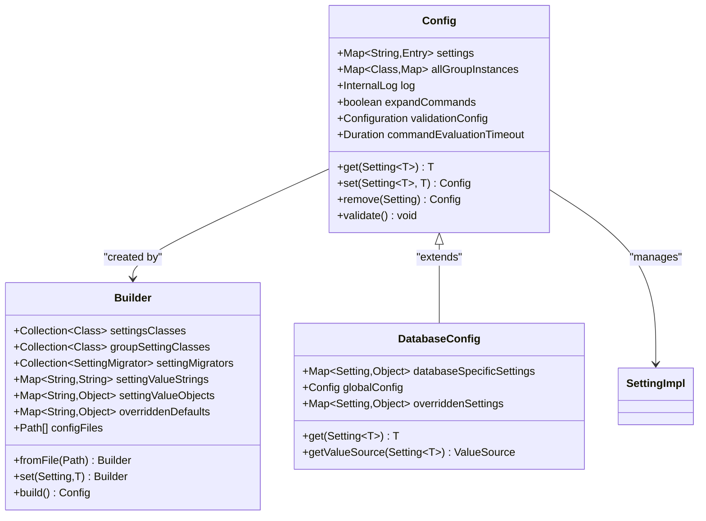
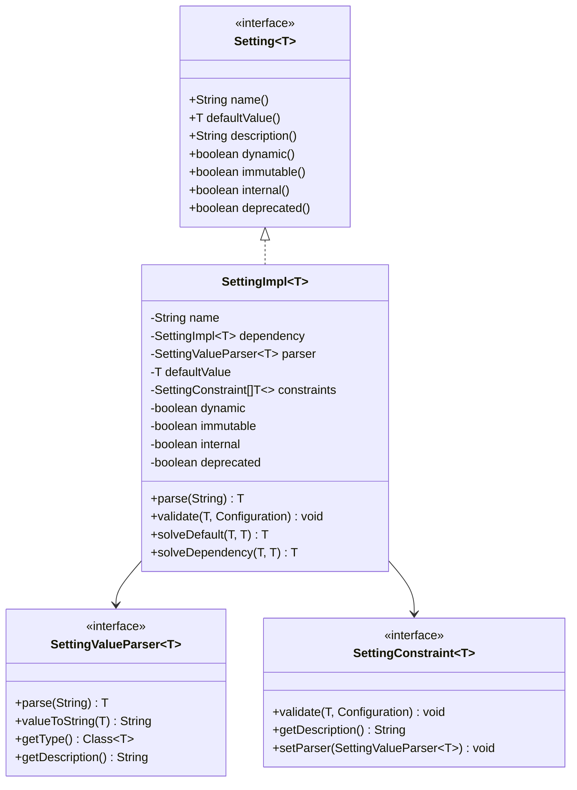
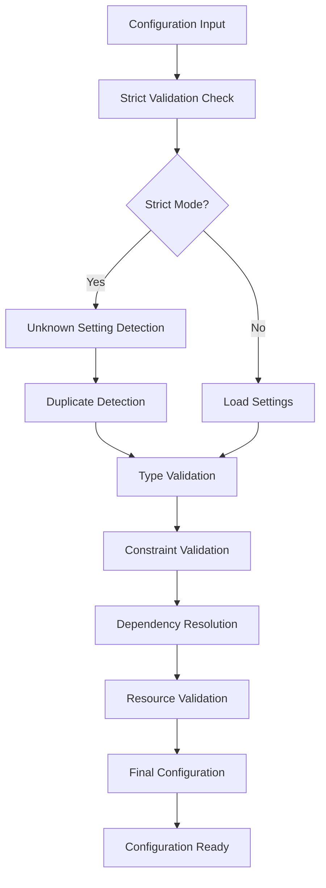
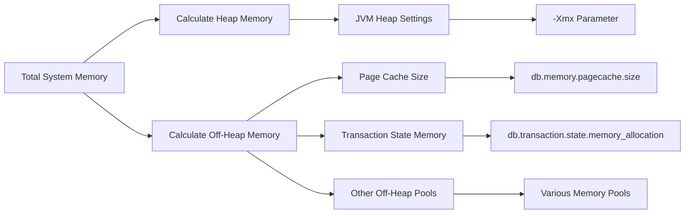
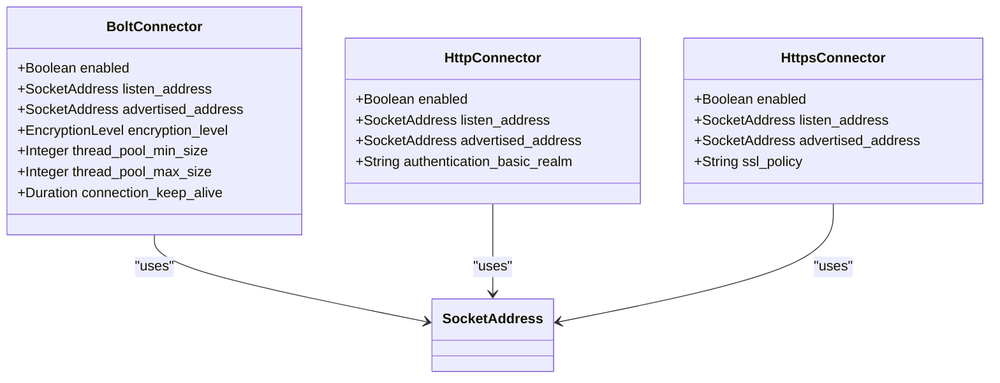

# Configuration Management

<cite>
**Referenced Files in This Document**
- [Config.java](file://community/configuration/src/main/java/org/neo4j/configuration/Config.java)
- [DatabaseConfig.java](file://community/configuration/src/main/java/org/neo4j/configuration/DatabaseConfig.java)
- [ConfigUtils.java](file://community/configuration/src/main/java/org/neo4j/configuration/ConfigUtils.java)
- [GraphDatabaseSettings.java](file://community/configuration/src/main/java/org/neo4j/configuration/GraphDatabaseSettings.java)
- [BoltConnector.java](file://community/configuration/src/main/java/org/neo4j/configuration/connectors/BoltConnector.java)
- [GroupSetting.java](file://community/configuration/src/main/java/org/neo4j/configuration/GroupSetting.java)
- [SettingImpl.java](file://community/configuration/src/main/java/org/neo4j/configuration/SettingImpl.java)
- [SettingValueParsers.java](file://community/configuration/src/main/java/org/neo4j/configuration/SettingValueParsers.java)
- [SettingConstraints.java](file://community/configuration/src/main/java/org/neo4j/configuration/SettingConstraints.java)
- [LocalConfig.java](file://community/configuration/src/main/java/org/neo4j/configuration/LocalConfig.java)
</cite>

## Table of Contents
1. [Introduction](#introduction)
2. [Architecture Overview](#architecture-overview)
3. [Core Components](#core-components)
4. [Configuration Sources](#configuration-sources)
5. [Type-Safe Configuration Model](#type-safe-configuration-model)
6. [Configuration Validation](#configuration-validation)
7. [Practical Examples](#practical-examples)
8. [Advanced Features](#advanced-features)
9. [Best Practices](#best-practices)
10. [Troubleshooting](#troubleshooting)

## Introduction

Neo4j's configuration management system provides a centralized, hierarchical approach to managing database settings across all components. The system serves as the foundation for configuring everything from memory allocation and connector settings to logging and security parameters. Built around the principle of type safety and validation, it ensures consistent behavior across different deployment environments while maintaining flexibility for various use cases.

The configuration system operates on multiple levels, supporting file-based configuration, environment variables, command-line arguments, and programmatic overrides. This multi-source approach enables administrators to manage Neo4j deployments consistently across development, testing, and production environments.

## Architecture Overview

The configuration management system follows a layered architecture with clear separation of concerns:

**Diagram sources**
- [Config.java](file://community/configuration/src/main/java/org/neo4j/configuration/Config.java#L79-L130)
- [DatabaseConfig.java](file://community/configuration/src/main/java/org/neo4j/configuration/DatabaseConfig.java#L28-L42)
- [LocalConfig.java](file://community/configuration/src/main/java/org/neo4j/configuration/LocalConfig.java#L65-L112)

The architecture consists of four primary layers:

1. **Configuration Sources Layer**: Multiple input mechanisms for configuration data
2. **Configuration Layer**: Centralized management and merging of configuration values
3. **Settings Management Layer**: Type-safe definition and validation of configuration options
4. **Consumer Layer**: Components that utilize configuration values

**Section sources**
- [Config.java](file://community/configuration/src/main/java/org/neo4j/configuration/Config.java#L79-L130)
- [DatabaseConfig.java](file://community/configuration/src/main/java/org/neo4j/configuration/DatabaseConfig.java#L28-L42)

## Core Components

### Config Class

The [`Config`](file://community/configuration/src/main/java/org/neo4j/configuration/Config.java) class serves as the central hub for configuration management. It implements the `Configuration` interface and provides a comprehensive framework for loading, merging, and validating configuration settings from multiple sources.

Key responsibilities include:
- **Multi-source Loading**: Supports configuration files, environment variables, and command-line arguments
- **Hierarchical Merging**: Combines settings from different sources with proper precedence rules
- **Dependency Resolution**: Handles inter-setting dependencies and evaluates settings in the correct order
- **Validation**: Enforces type safety and constraint validation
- **Dynamic Updates**: Supports runtime configuration changes where appropriate

The Config class uses a sophisticated builder pattern that allows for flexible configuration construction:

**Diagram sources**
- [Config.java](file://community/configuration/src/main/java/org/neo4j/configuration/Config.java#L79-L130)
- [DatabaseConfig.java](file://community/configuration/src/main/java/org/neo4j/configuration/DatabaseConfig.java#L28-L42)
- [SettingImpl.java](file://community/configuration/src/main/java/org/neo4j/configuration/SettingImpl.java#L33-L63)

### DatabaseConfig Class

[`DatabaseConfig`](file://community/configuration/src/main/java/org/neo4j/configuration/DatabaseConfig.java) extends the base Config class to provide database-specific configuration management. It maintains a separation between global configuration settings and database-specific overrides, enabling fine-grained control over individual databases while inheriting common settings from the global configuration.

Features include:
- **Database Isolation**: Separate configuration space for each database
- **Override Mechanism**: Allows database-specific settings to override global defaults
- **Lifecycle Management**: Implements the Lifecycle interface for proper initialization
- **Value Source Tracking**: Provides insight into where configuration values originate

**Section sources**
- [Config.java](file://community/configuration/src/main/java/org/neo4j/configuration/Config.java#L79-L130)
- [DatabaseConfig.java](file://community/configuration/src/main/java/org/neo4j/configuration/DatabaseConfig.java#L28-L42)

### GroupSetting Interface

The [`GroupSetting`](file://community/configuration/src/main/java/org/neo4j/configuration/GroupSetting.java) interface enables the creation of configurable groups of settings, particularly useful for connectors and policies that require multiple related configuration options.

Key characteristics:
- **Instance-Based**: Each group creates named instances with their own setting values
- **Prefix-Based**: Settings within a group share a common prefix
- **Flexible Naming**: Instances can be named arbitrarily within naming constraints
- **Service Discovery**: Automatically discovered through the service provider mechanism

**Section sources**
- [GroupSetting.java](file://community/configuration/src/main/java/org/neo4j/configuration/GroupSetting.java#L25-L45)

## Configuration Sources

Neo4j's configuration system supports multiple configuration sources with a well-defined precedence hierarchy:

### File-Based Configuration

Configuration files are loaded using the [`Builder.fromFile()`](file://community/configuration/src/main/java/org/neo4j/configuration/Config.java#L272-L329) method, supporting both individual files and directory structures:

- **Individual Files**: Standard `.conf` files containing key-value pairs
- **Directory Trees**: Recursive directory scanning with filtering
- **Environment-Specific Files**: Support for environment-specific configuration overlays
- **Wildcard Support**: Pattern-based file inclusion/exclusion

### Environment Variables

Environment variables provide a powerful way to inject configuration values, particularly useful in containerized deployments:

- **Namespace Prefixing**: Variables prefixed with `NEO4J_` are automatically mapped
- **Type Conversion**: Automatic parsing of string values to appropriate types
- **Override Priority**: Higher precedence than configuration files
- **Security Considerations**: Sensitive values can be safely injected via environment variables

### Command-Line Arguments

Command-line arguments offer immediate configuration overrides for operational scenarios:

- **Direct Override**: Highest precedence for immediate effect
- **Dynamic Updates**: Some settings can be changed without restart
- **Validation**: Full validation occurs before applying changes
- **Scope Limitations**: Only affects the current Neo4j instance

### Programmatic Configuration

The builder pattern enables programmatic configuration construction:

- **Type Safety**: Compile-time type checking for setting names and values
- **Fluent API**: Intuitive method chaining for configuration assembly
- **Override Capabilities**: Programmatic overrides of loaded configurations
- **Testing Support**: Easy configuration setup for unit and integration tests

**Section sources**
- [Config.java](file://community/configuration/src/main/java/org/neo4j/configuration/Config.java#L272-L329)

## Type-Safe Configuration Model

Neo4j's configuration system enforces type safety through a sophisticated model that prevents configuration errors at compile time and runtime.

### Setting Definition

Settings are defined using the [`SettingBuilder`](file://community/configuration/src/main/java/org/neo4j/configuration/SettingImpl.java#L65-L67) pattern, which provides compile-time type safety:

**Diagram sources**
- [SettingImpl.java](file://community/configuration/src/main/java/org/neo4j/configuration/SettingImpl.java#L33-L63)
- [SettingValueParsers.java](file://community/configuration/src/main/java/org/neo4j/configuration/SettingValueParsers.java#L61-L100)

### Type Parsing and Validation

The [`SettingValueParsers`](file://community/configuration/src/main/java/org/neo4j/configuration/SettingValueParsers.java) provide comprehensive type conversion and validation:

- **Primitive Types**: String, boolean, integer, long, byte
- **Complex Types**: Duration, path, socket address, secure string
- **Collection Types**: Lists, sets, maps with type-specific parsers
- **Custom Types**: IP addresses, database names, timezone identifiers
- **Unit Support**: Human-readable units for memory and duration values

### Constraints and Validation

Settings can define multiple constraints that enforce business rules:

- **Range Constraints**: Minimum and maximum value limits
- **Enumeration Constraints**: Allowed values from predefined sets
- **Format Constraints**: Regular expression-based validation
- **Dependency Constraints**: Settings that depend on other settings
- **Custom Constraints**: Application-specific validation logic

**Section sources**
- [SettingImpl.java](file://community/configuration/src/main/java/org/neo4j/configuration/SettingImpl.java#L33-L63)
- [SettingValueParsers.java](file://community/configuration/src/main/java/org/neo4j/configuration/SettingValueParsers.java#L61-L100)
- [SettingConstraints.java](file://community/configuration/src/main/java/org/neo4j/configuration/SettingConstraints.java#L163-L234)

## Configuration Validation

The configuration system implements comprehensive validation at multiple levels to ensure system stability and prevent misconfiguration.

### Strict Validation Mode

Neo4j supports strict validation mode through the [`strict_config_validation`](file://community/configuration/src/main/java/org/neo4j/configuration/GraphDatabaseSettings.java#L176-L178) setting, which provides enhanced safety:

- **Unknown Setting Detection**: Prevents accidental configuration of non-existent settings
- **Duplicate Declaration Prevention**: Detects and rejects multiple declarations of the same setting
- **Type Safety**: Ensures values match expected types
- **Constraint Enforcement**: Validates all defined constraints

### Dynamic Validation

Some settings support dynamic validation that occurs at runtime:

- **Dependency Resolution**: Validates settings against their dependencies
- **Resource Availability**: Checks for required system resources
- **Inter-Setting Consistency**: Validates relationships between related settings
- **Runtime Conditions**: Adapts validation based on current system state

### Validation Pipeline

The validation process follows a structured pipeline:

**Diagram sources**
- [Config.java](file://community/configuration/src/main/java/org/neo4j/configuration/Config.java#L627-L671)

**Section sources**
- [Config.java](file://community/configuration/src/main/java/org/neo4j/configuration/Config.java#L627-L671)
- [GraphDatabaseSettings.java](file://community/configuration/src/main/java/org/neo4j/configuration/GraphDatabaseSettings.java#L176-L178)

## Practical Examples

### Memory Configuration

Memory settings represent one of the most critical configuration areas in Neo4j:

**Diagram sources**
- [Config.java](file://community/configuration/src/main/java/org/neo4j/configuration/Config.java#L627-L671)

Common memory configuration scenarios:
- **Development Systems**: Conservative settings with focus on simplicity
- **Production Systems**: Optimized settings based on workload analysis
- **Container Deployments**: Dynamic sizing based on available resources
- **High-Availability Clusters**: Balanced settings across multiple nodes

### Connector Configuration

Network connectivity is managed through the connector configuration system:

**Diagram sources**
- [BoltConnector.java](file://community/configuration/src/main/java/org/neo4j/configuration/connectors/BoltConnector.java#L52-L228)

### Logging Configuration

Logging configuration controls diagnostic output and monitoring:

- **Log Levels**: DEBUG, INFO, WARN, ERROR with per-package granularity
- **Log Rotation**: Automatic rotation based on size or time
- **Log Formats**: Structured JSON or traditional log formats
- **Log Destinations**: Console, file, or external logging systems

**Section sources**
- [BoltConnector.java](file://community/configuration/src/main/java/org/neo4j/configuration/connectors/BoltConnector.java#L52-L228)
- [GraphDatabaseSettings.java](file://community/configuration/src/main/java/org/neo4j/configuration/GraphDatabaseSettings.java#L176-L178)

## Advanced Features

### Dynamic Configuration Updates

Some configuration settings support dynamic updates without requiring a system restart:

- **Thread Pool Sizes**: Adjusted immediately for connection handling
- **Logging Levels**: Changed at runtime for debugging
- **Connection Limits**: Modified based on load patterns
- **Cache Sizes**: Tuned dynamically based on usage

### Configuration Migration

The system includes migration capabilities for handling configuration changes across Neo4j versions:

- **Automatic Migration**: Known configuration changes are handled transparently
- **Backward Compatibility**: Older configuration formats are supported
- **Migration Validation**: Ensures migrated configurations remain valid
- **Rollback Support**: Ability to revert problematic migrations

### Group Settings

Group settings enable configuration of related components:

- **SSL Policies**: Configure multiple SSL settings as a group
- **Database Policies**: Apply consistent settings across databases
- **Connector Groups**: Manage multiple connectors with shared configuration
- **Custom Groups**: Application-specific grouped settings

**Section sources**
- [GroupSetting.java](file://community/configuration/src/main/java/org/neo4j/configuration/GroupSetting.java#L25-L45)
- [Config.java](file://community/configuration/src/main/java/org/neo4j/configuration/Config.java#L743-L806)

## Best Practices

### Configuration Organization

- **Environment Separation**: Use separate configuration files for different environments
- **Layered Configuration**: Leverage the precedence hierarchy effectively
- **Documentation**: Document custom settings and their purposes
- **Version Control**: Track configuration changes alongside code changes

### Security Considerations

- **Sensitive Data**: Use environment variables or encrypted configuration files
- **Access Control**: Restrict file permissions on configuration files
- **Validation**: Enable strict validation in production environments
- **Audit Logging**: Log configuration changes for security auditing

### Performance Optimization

- **Memory Allocation**: Balance heap and off-heap memory appropriately
- **Connection Limits**: Tune thread pool sizes based on workload
- **Cache Configuration**: Optimize cache sizes for typical query patterns
- **Monitoring Integration**: Configure monitoring to track configuration impacts

### Deployment Strategies

- **Gradual Rollouts**: Test configuration changes in staging environments
- **Backup Configuration**: Maintain backups of working configurations
- **Automated Testing**: Include configuration validation in CI/CD pipelines
- **Disaster Recovery**: Document configuration restoration procedures

## Troubleshooting

### Common Configuration Issues

**Invalid Setting Names**
- Symptoms: Configuration fails to load with "unknown setting" errors
- Solution: Verify setting names against official documentation
- Prevention: Enable strict validation mode

**Type Conversion Errors**
- Symptoms: "Invalid value" errors during configuration loading
- Solution: Check value format against setting documentation
- Prevention: Use IDE autocomplete for setting names

**Memory Configuration Problems**
- Symptoms: OutOfMemoryError or poor performance
- Solution: Review memory allocation ratios and system constraints
- Prevention: Use memory recommendation tools

**Connector Configuration Issues**
- Symptoms: Network connectivity problems or authentication failures
- Solution: Verify address binding and SSL configuration
- Prevention: Test connectivity before production deployment

### Diagnostic Tools

The configuration system provides several diagnostic capabilities:

- **Configuration Validation**: Built-in validation with detailed error messages
- **Value Source Tracking**: Identify where configuration values come from
- **Dependency Analysis**: Understand setting interdependencies
- **Migration History**: Track configuration changes over time

### Debugging Configuration Issues

1. **Enable Verbose Logging**: Increase log levels for configuration-related messages
2. **Check Configuration Sources**: Verify all expected configuration sources are present
3. **Validate Individual Settings**: Test settings in isolation
4. **Review Dependencies**: Ensure dependent settings are properly configured
5. **Test in Controlled Environment**: Reproduce issues in a safe testing environment

**Section sources**
- [Config.java](file://community/configuration/src/main/java/org/neo4j/configuration/Config.java#L627-L671)
- [ConfigUtils.java](file://community/configuration/src/main/java/org/neo4j/configuration/ConfigUtils.java#L26-L41)