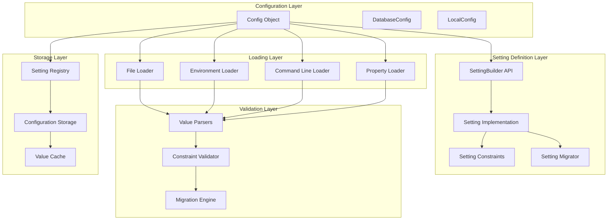
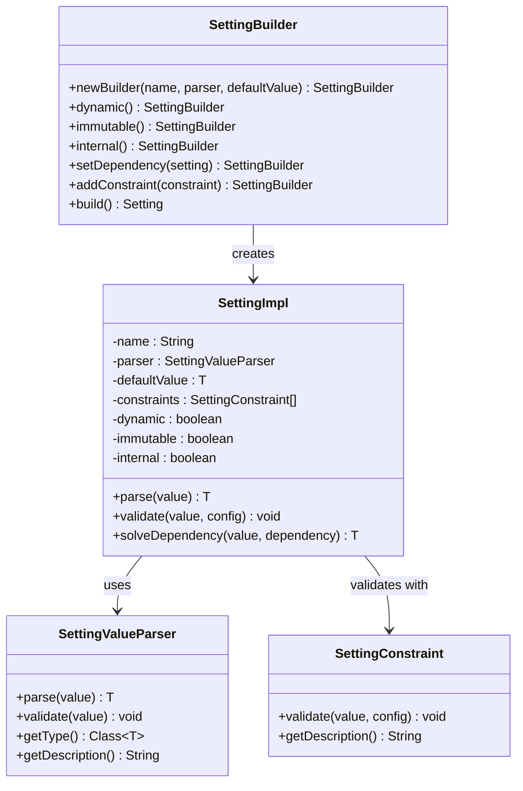
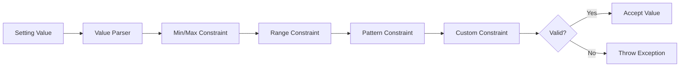
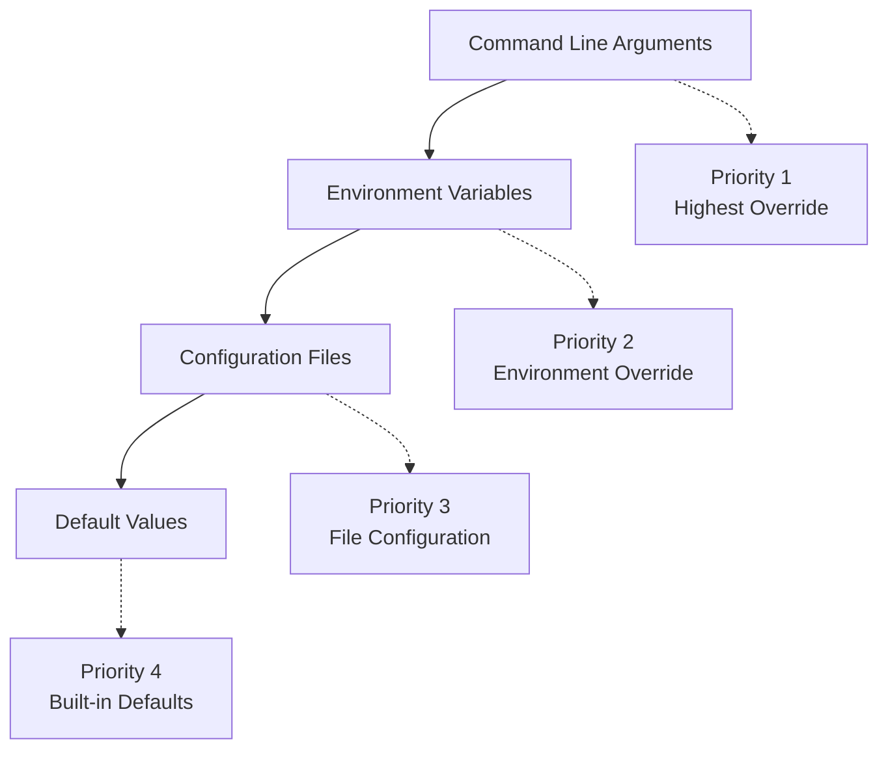
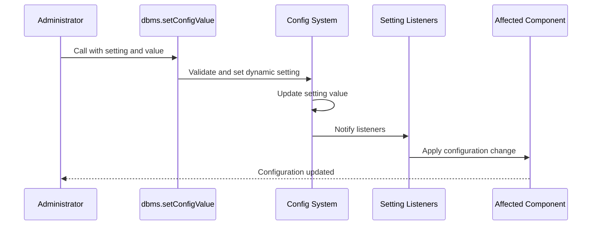
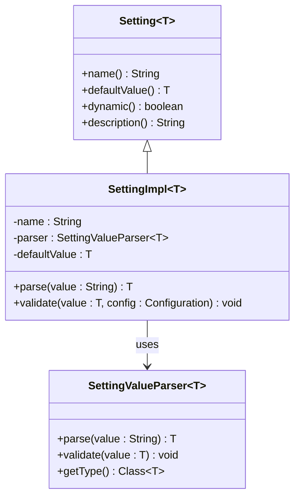
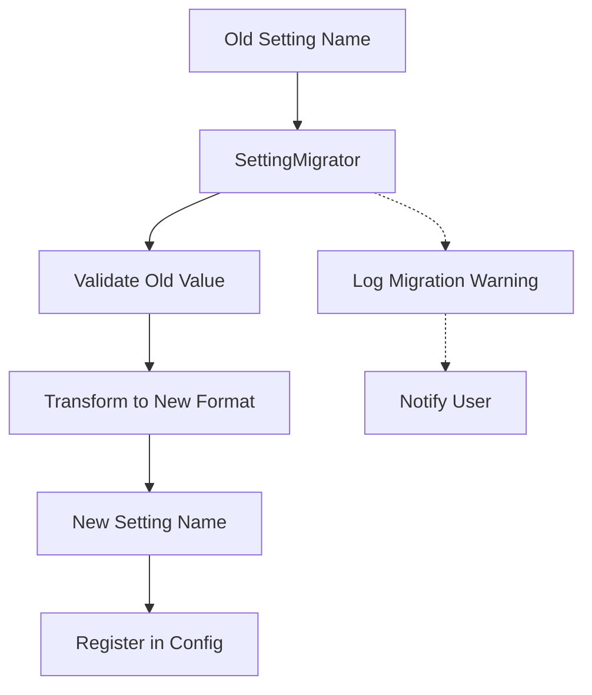

# Configuration System

<cite>
**Referenced Files in This Document**
- [Config.java](file://community/configuration/src/main/java/org/neo4j/configuration/Config.java)
- [DatabaseConfig.java](file://community/configuration/src/main/java/org/neo4j/configuration/DatabaseConfig.java)
- [SettingBuilder.java](file://community/configuration/src/main/java/org/neo4j/configuration/SettingBuilder.java)
- [SettingMigrator.java](file://community/configuration/src/main/java/org/neo4j/configuration/SettingMigrator.java)
- [GraphDatabaseSettings.java](file://community/configuration/src/main/java/org/neo4j/configuration/GraphDatabaseSettings.java)
- [SettingImpl.java](file://community/configuration/src/main/java/org/neo4j/configuration/SettingImpl.java)
- [SettingValueParsers.java](file://community/configuration/src/main/java/org/neo4j/configuration/SettingValueParsers.java)
- [SettingConstraints.java](file://community/configuration/src/main/java/org/neo4j/configuration/SettingConstraints.java)
- [LocalConfig.java](file://community/configuration/src/main/java/org/neo4j/configuration/LocalConfig.java)
- [ConnectorDefaults.java](file://community/configuration/src/main/java/org/neo4j/configuration/connectors/ConnectorDefaults.java)
- [BoltConnector.java](file://community/configuration/src/main/java/org/neo4j/configuration/connectors/BoltConnector.java)
- [CommonConnectorConfig.java](file://community/configuration/src/main/java/org/neo4j/configuration/connectors/CommonConnectorConfig.java)
</cite>

## Table of Contents
1. [Introduction](#introduction)
2. [Architecture Overview](#architecture-overview)
3. [Core Components](#core-components)
4. [Setting Definition System](#setting-definition-system)
5. [Configuration Loading Mechanisms](#configuration-loading-mechanisms)
6. [Dynamic Configuration Management](#dynamic-configuration-management)
7. [Type-Safe Configuration](#type-safe-configuration)
8. [Practical Examples](#practical-examples)
9. [Advanced Features](#advanced-features)
10. [Best Practices](#best-practices)
11. [Troubleshooting](#troubleshooting)

## Introduction

Neo4j's configuration system provides a centralized, type-safe mechanism for managing database settings across the entire Neo4j ecosystem. This system serves as the foundation for controlling everything from memory allocation and connector configurations to logging and security settings. The configuration system is designed around the principle of declarative setting definitions, automatic validation, and support for dynamic configuration changes during runtime.

The configuration system consists of several key components that work together to provide a robust, flexible, and maintainable approach to database configuration management. At its core, the system uses a builder pattern for setting definitions, supports multiple configuration sources, and provides comprehensive validation and migration capabilities.

## Architecture Overview

The Neo4j configuration system follows a layered architecture that separates concerns between setting definition, configuration loading, validation, and runtime management.



**Diagram sources**
- [Config.java](file://community/configuration/src/main/java/org/neo4j/configuration/Config.java#L79-L130)
- [SettingBuilder.java](file://community/configuration/src/main/java/org/neo4j/configuration/SettingBuilder.java#L27-L86)
- [SettingImpl.java](file://community/configuration/src/main/java/org/neo4j/configuration/SettingImpl.java#L33-L67)

**Section sources**
- [Config.java](file://community/configuration/src/main/java/org/neo4j/configuration/Config.java#L79-L130)
- [DatabaseConfig.java](file://community/configuration/src/main/java/org/neo4j/configuration/DatabaseConfig.java#L28-L85)

## Core Components

### Config Class

The [`Config`](file://community/configuration/src/main/java/org/neo4j/configuration/Config.java) class serves as the central hub for configuration management. It acts as a registry for all settings, handles configuration loading from multiple sources, and provides type-safe access to configuration values.

Key responsibilities of the Config class include:
- **Setting Registration**: Maintains a registry of all available settings
- **Configuration Loading**: Supports loading from files, environment variables, and command line arguments
- **Validation**: Ensures configuration values meet defined constraints
- **Dependency Resolution**: Handles inter-setting dependencies and cascading updates
- **Dynamic Updates**: Supports runtime modification of dynamic settings

### DatabaseConfig Class

[`DatabaseConfig`](file://community/configuration/src/main/java/org/neo4j/configuration/DatabaseConfig.java) extends the base Config class to provide database-specific configuration management. It maintains a separation between global and database-specific settings while inheriting global configuration values.

### Setting System

The setting system provides a type-safe, extensible framework for defining configuration options:



**Diagram sources**
- [SettingBuilder.java](file://community/configuration/src/main/java/org/neo4j/configuration/SettingBuilder.java#L27-L86)
- [SettingImpl.java](file://community/configuration/src/main/java/org/neo4j/configuration/SettingImpl.java#L33-L67)
- [SettingValueParsers.java](file://community/configuration/src/main/java/org/neo4j/configuration/SettingValueParsers.java#L61-L880)

**Section sources**
- [Config.java](file://community/configuration/src/main/java/org/neo4j/configuration/Config.java#L79-L130)
- [DatabaseConfig.java](file://community/configuration/src/main/java/org/neo4j/configuration/DatabaseConfig.java#L28-L85)
- [SettingBuilder.java](file://community/configuration/src/main/java/org/neo4j/configuration/SettingBuilder.java#L27-L86)
- [SettingImpl.java](file://community/configuration/src/main/java/org/neo4j/configuration/SettingImpl.java#L33-L67)

## Setting Definition System

### SettingBuilder API

The SettingBuilder API provides a fluent interface for defining configuration settings. It supports various setting types, constraints, and behavioral modifiers.

```mermaid
flowchart TD
Start([Setting Definition]) --> Builder[SettingBuilder.newBuilder]
Builder --> Type[Set Type & Parser]
Type --> DefaultValue[Set Default Value]
DefaultValue --> Dynamic{Dynamic Setting?}
Dynamic --> |Yes| EnableDynamic[Call .dynamic()]
Dynamic --> |No| Immutable{Immutable?}
EnableDynamic --> Immutable
Immutable --> |Yes| SetImmutable[Call .immutable()]
Immutable --> |No| Internal{Internal Setting?}
SetImmutable --> Internal
Internal --> |Yes| SetInternal[Call .internal()]
Internal --> |No| Dependencies{Has Dependencies?}
SetInternal --> Dependencies
Dependencies --> |Yes| SetDep[Call .setDependency]
Dependencies --> |No| Constraints{Has Constraints?}
SetDep --> Constraints
Constraints --> |Yes| AddConst[Call .addConstraint]
Constraints --> |No| Build[Call .build]
AddConst --> Build
Build --> Setting[Setting Instance]
```

**Diagram sources**
- [SettingBuilder.java](file://community/configuration/src/main/java/org/neo4j/configuration/SettingBuilder.java#L38-L85)

### Setting Types and Parsers

The configuration system supports numerous built-in setting types through specialized parsers:

| Setting Type | Parser | Description | Example |
|--------------|--------|-------------|---------|
| String | STRING | Plain text values | `"hello world"` |
| Boolean | BOOL | True/false values | `true`, `false` |
| Integer | INT | 32-bit signed integers | `42`, `-100` |
| Long | LONG | 64-bit signed integers | `1000000000` |
| Double | DOUBLE | Floating-point numbers | `3.14159` |
| Duration | DURATION | Time durations | `30s`, `5m`, `1h` |
| Bytes | BYTES | Size in bytes | `1GB`, `512MB` |
| Path | PATH | File system paths | `/var/lib/neo4j/data` |
| SocketAddress | SOCKET_ADDRESS | Network addresses | `localhost:7687` |
| Enum | ofEnum | Enumeration values | `PERIODIC`, `CONTINUOUS` |

### Constraints and Validation

Setting constraints provide comprehensive validation capabilities:



**Diagram sources**
- [SettingConstraints.java](file://community/configuration/src/main/java/org/neo4j/configuration/SettingConstraints.java#L44-L520)

**Section sources**
- [SettingBuilder.java](file://community/configuration/src/main/java/org/neo4j/configuration/SettingBuilder.java#L38-L85)
- [SettingValueParsers.java](file://community/configuration/src/main/java/org/neo4j/configuration/SettingValueParsers.java#L61-L880)
- [SettingConstraints.java](file://community/configuration/src/main/java/org/neo4j/configuration/SettingConstraints.java#L44-L520)

## Configuration Loading Mechanisms

### Configuration Sources

Neo4j's configuration system supports multiple configuration sources with a well-defined precedence order:



### File-Based Configuration

Configuration files support multiple formats and locations:

| Location | Format | Description |
|----------|--------|-------------|
| `neo4j.conf` | Properties | Main configuration file |
| Directory | Multiple files | Each file defines one setting |
| Environment Variable | Single value | Configuration as environment variable |

### Environment Variable Support

The system automatically recognizes environment variables with specific naming conventions:
- `NEO4J_*` variables are mapped to corresponding configuration settings
- Nested settings use underscore notation (e.g., `NEO4J_dbms_memory_pagecache_size`)
- Boolean values are recognized as `true`/`false` strings

### Command Line Configuration

Command-line arguments provide immediate configuration overrides:
- `-c key=value` syntax for setting overrides
- Multiple `-c` arguments can be specified
- Arguments take precedence over file and environment configurations

**Section sources**
- [Config.java](file://community/configuration/src/main/java/org/neo4j/configuration/Config.java#L265-L486)

## Dynamic Configuration Management

### Runtime Configuration Changes

Neo4j supports dynamic configuration changes through the `dbms.setConfigValue` procedure, allowing administrators to modify settings without restarting the database.



**Diagram sources**
- [Config.java](file://community/configuration/src/main/java/org/neo4j/configuration/Config.java#L1003-L1020)

### Setting Lifecycle

Dynamic settings follow a specific lifecycle managed by the configuration system:

| Phase | Description | Behavior |
|-------|-------------|----------|
| Declaration | Setting defined as dynamic | Can be modified at runtime |
| Initialization | Setting loaded from configuration | Uses configured value |
| Runtime Modification | Setting changed via procedure | Triggers notifications |
| Persistence | Setting saved to configuration | Persists across restarts |

### Change Notifications

The configuration system provides comprehensive change notification mechanisms:
- **Setting Listeners**: Components can register for specific setting changes
- **Bulk Notifications**: Groups of related settings can be monitored
- **Value Sources**: Track where setting values originate
- **Change Auditing**: Log configuration modifications for compliance

**Section sources**
- [Config.java](file://community/configuration/src/main/java/org/neo4j/configuration/Config.java#L1003-L1020)
- [LocalConfig.java](file://community/configuration/src/main/java/org/neo4j/configuration/LocalConfig.java#L34-L161)

## Type-Safe Configuration

### Generic Type System

The configuration system uses Java generics to ensure type safety at compile time:



**Diagram sources**
- [SettingImpl.java](file://community/configuration/src/main/java/org/neo4j/configuration/SettingImpl.java#L33-L67)

### Automatic Type Conversion

The system provides seamless type conversion between string representations and typed values:

| Input Format | Output Type | Example |
|--------------|-------------|---------|
| `"true"` | `Boolean` | `true` |
| `"42"` | `Integer` | `42` |
| `"1GB"` | `Long` | `1073741824` |
| `"30s"` | `Duration` | `30 seconds` |
| `"localhost:7687"` | `SocketAddress` | `SocketAddress(host=localhost, port=7687)` |

### Null Safety

The configuration system handles null values gracefully:
- Null values are supported for nullable settings
- Default values are provided for missing configuration
- Null checks are performed during validation
- Null-safe operations prevent runtime exceptions

**Section sources**
- [SettingImpl.java](file://community/configuration/src/main/java/org/neo4j/configuration/SettingImpl.java#L33-L67)
- [SettingValueParsers.java](file://community/configuration/src/main/java/org/neo4j/configuration/SettingValueParsers.java#L61-L880)

## Practical Examples

### Memory Configuration

Memory settings are critical for database performance and stability:

```java
// Example: Page cache memory configuration
Setting<Long> pagecache_memory = SettingBuilder.newBuilder(
    "server.memory.pagecache.size", BYTES, null)
    .build();

// Example: JVM heap size configuration
Setting<Long> dbms_memory_heap_max_size = SettingBuilder.newBuilder(
    "server.memory.heap.max_size", BYTES, ByteUnit.gibiBytes(4))
    .addConstraint(min(ByteUnit.mebiBytes(512)))
    .build();
```

### Connector Configuration

Network connectors require careful configuration for security and performance:

```java
// Example: Bolt connector configuration
Setting<Boolean> bolt_enabled = SettingBuilder.newBuilder(
    "server.bolt.enabled", BOOL, true)
    .build();

Setting<SocketAddress> bolt_listen_address = SettingBuilder.newBuilder(
    "server.bolt.listen_address", SOCKET_ADDRESS, 
    new SocketAddress(7687))
    .setDependency(default_listen_address)
    .build();

Setting<EncryptionLevel> bolt_tls_level = SettingBuilder.newBuilder(
    "server.bolt.tls_level", ofEnum(EncryptionLevel.class), 
    EncryptionLevel.DISABLED)
    .build();
```

### Logging Configuration

Logging settings control diagnostic and operational logging:

```java
// Example: Query logging configuration
Setting<LogQueryLevel> log_queries = SettingBuilder.newBuilder(
    "db.logs.query.enabled", ofEnum(LogQueryLevel.class), 
    LogQueryLevel.VERBOSE)
    .dynamic()
    .build();

Setting<Boolean> debug_log_enabled = SettingBuilder.newBuilder(
    "server.logs.debug.enabled", BOOL, true)
    .build();
```

### Advanced Configuration Patterns

The configuration system supports sophisticated patterns for complex scenarios:

```java
// Example: Dependent settings
Setting<Integer> worker_threads = SettingBuilder.newBuilder(
    "server.cypher.parallel.worker_limit", INT, 0)
    .build();

Setting<Integer> parallel_workers = SettingBuilder.newBuilder(
    "server.memory.pagecache.scan.prefetchers", INT, 4)
    .setDependency(worker_threads)
    .build();

// Example: Conditional constraints
SettingConstraint<String> conditionalConstraint = SettingConstraints.dependency(
    SettingConstraints.min(100), // If condition met
    SettingConstraints.min(10),  // Otherwise
    worker_threads,              // Dependency
    SettingConstraints.is(0)     // Condition
);
```

**Section sources**
- [GraphDatabaseSettings.java](file://community/configuration/src/main/java/org/neo4j/configuration/GraphDatabaseSettings.java#L104-L800)
- [BoltConnector.java](file://community/configuration/src/main/java/org/neo4j/configuration/connectors/BoltConnector.java#L29-L81)
- [SettingConstraints.java](file://community/configuration/src/main/java/org/neo4j/configuration/SettingConstraints.java#L346-L382)

## Advanced Features

### Setting Migration

The migration system handles backward compatibility and setting evolution:



**Diagram sources**
- [SettingMigrator.java](file://community/configuration/src/main/java/org/neo4j/configuration/SettingMigrator.java#L27-L42)

### Group Settings

The system supports grouped settings for related configuration options:

```java
// Example: SSL policy settings
Setting<String> ssl_policy_key = SettingBuilder.newBuilder(
    "dbms.ssl.policy.*.key", STRING, "")
    .build();

Setting<String> ssl_policy_cert = SettingBuilder.newBuilder(
    "dbms.ssl.policy.*.cert", STRING, "")
    .build();
```

### Custom Validators

Advanced validation can be implemented through custom constraint classes:

```java
// Example: Custom constraint for related settings
SettingConstraint<Integer> greaterThanOther = 
    SettingConstraints.greaterThanOrEqual(otherSetting);

SettingConstraint<Long> lessThanOther = 
    SettingConstraints.lessThanOrEqualLong(otherSetting);
```

**Section sources**
- [SettingMigrator.java](file://community/configuration/src/main/java/org/neo4j/configuration/SettingMigrator.java#L27-L42)
- [SettingConstraints.java](file://community/configuration/src/main/java/org/neo4j/configuration/SettingConstraints.java#L397-L478)

## Best Practices

### Setting Design Guidelines

1. **Clear Naming Conventions**: Use hierarchical names with dots (e.g., `dbms.memory.pagecache.size`)
2. **Descriptive Descriptions**: Provide comprehensive descriptions for all settings
3. **Reasonable Defaults**: Choose sensible default values for all settings
4. **Type Safety**: Use appropriate types for each setting
5. **Validation**: Implement comprehensive validation constraints

### Configuration Management

1. **Environment Separation**: Use different configurations for development, testing, and production
2. **Documentation**: Document all custom settings and their effects
3. **Monitoring**: Monitor configuration changes and their impact
4. **Backup**: Maintain backups of configuration files
5. **Testing**: Test configuration changes in staging environments

### Performance Considerations

1. **Memory Settings**: Allocate sufficient memory for page cache and heap
2. **I/O Configuration**: Optimize I/O settings for storage subsystem
3. **Network Tuning**: Configure network settings for expected load
4. **Resource Limits**: Set appropriate limits for concurrent operations

## Troubleshooting

### Common Configuration Issues

| Issue | Symptoms | Solution |
|-------|----------|----------|
| Invalid Setting Value | Startup failure | Check setting constraints and value format |
| Missing Configuration File | Default values used | Verify file path and permissions |
| Permission Denied | Access denied errors | Check file and directory permissions |
| Circular Dependencies | Stack overflow | Review setting dependencies |
| Type Mismatch | Parsing errors | Verify value type and format |

### Debugging Configuration Problems

1. **Enable Debug Logging**: Set `server.logs.debug.enabled=true`
2. **Check Configuration**: Use `SHOW CONFIGURATION` procedure
3. **Validate Settings**: Review setting constraints and dependencies
4. **Test Changes**: Validate changes in isolated environment
5. **Monitor Impact**: Observe system behavior after changes

### Recovery Procedures

1. **Restore Backup**: Use previous configuration backup
2. **Reset to Defaults**: Clear problematic settings
3. **Incremental Changes**: Apply changes gradually
4. **Rollback Plan**: Prepare rollback procedures
5. **Documentation**: Maintain change documentation

**Section sources**
- [Config.java](file://community/configuration/src/main/java/org/neo4j/configuration/Config.java#L971-L1295)