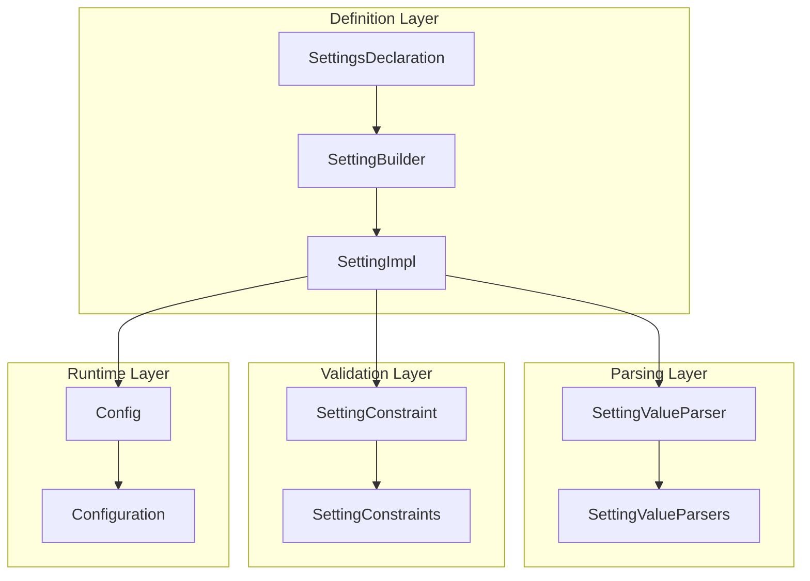
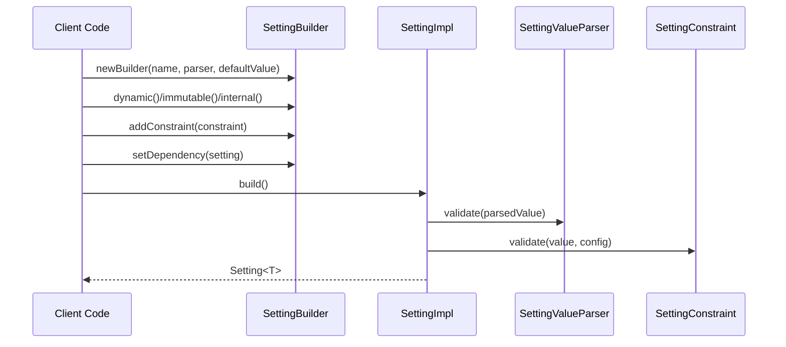
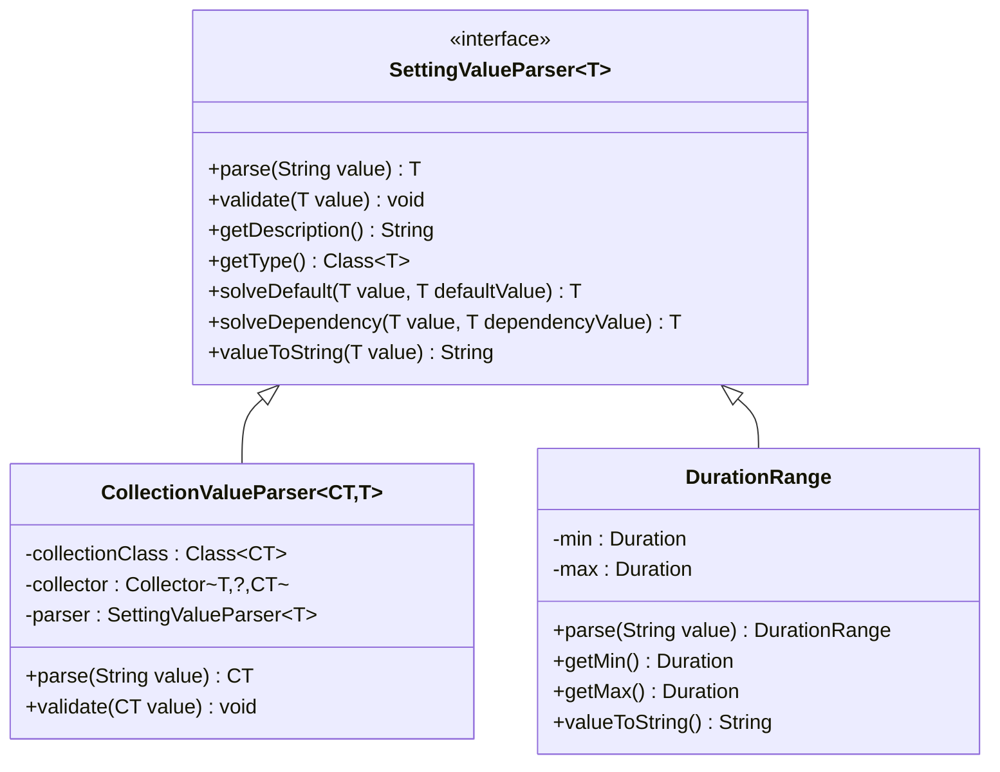
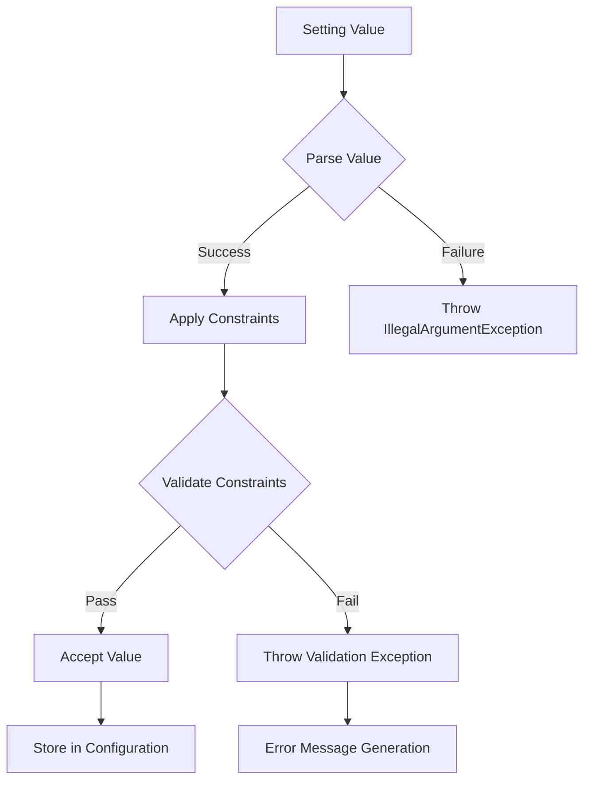
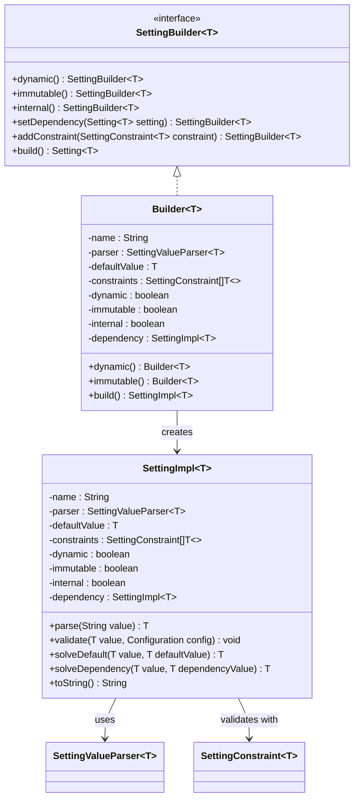
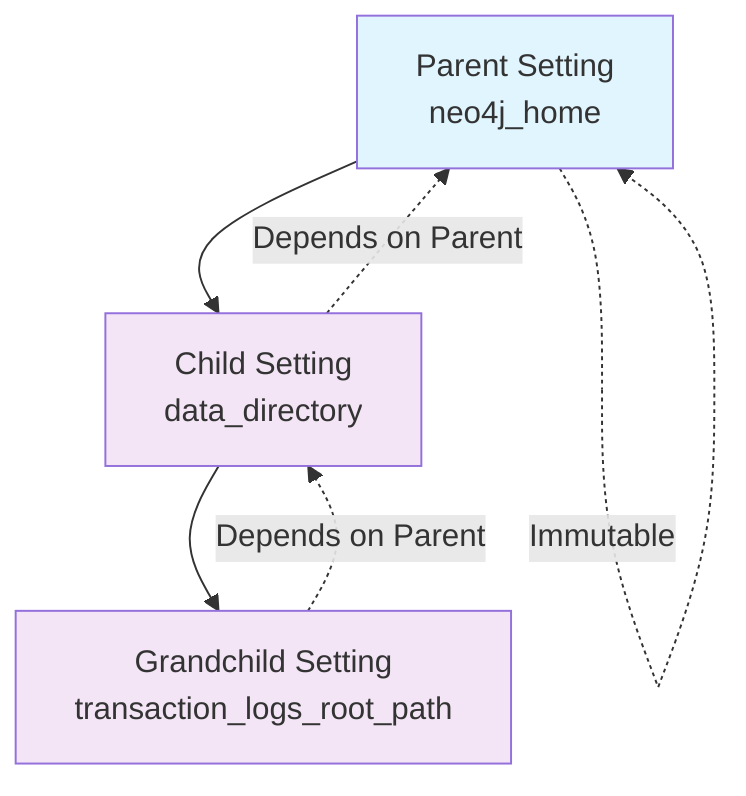
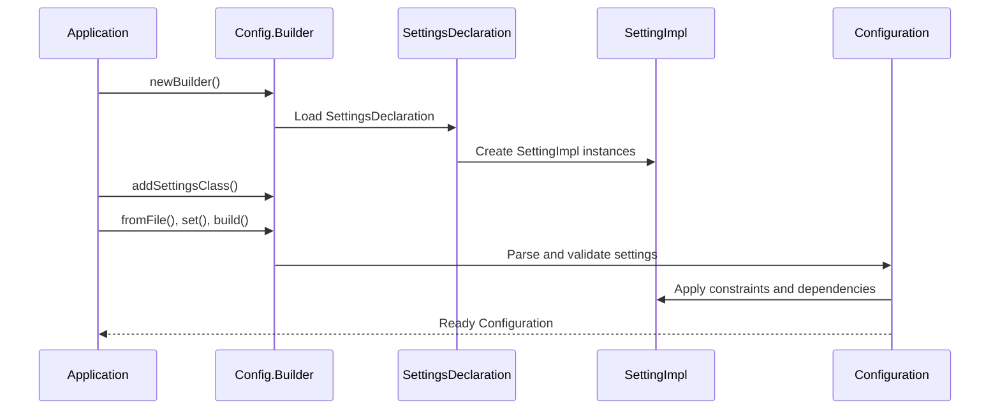
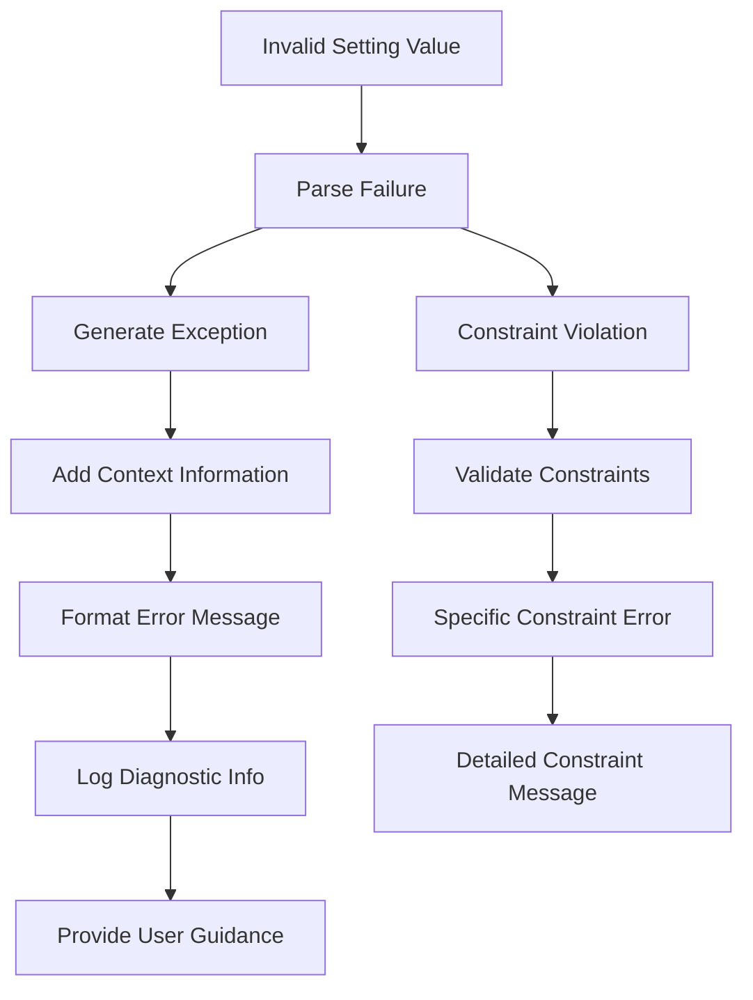
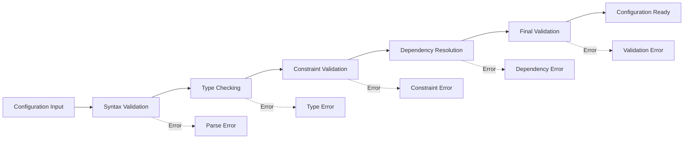

# Settings Definition

<cite>
**Referenced Files in This Document**
- [SettingBuilder.java](file://community/configuration/src/main/java/org/neo4j/configuration/SettingBuilder.java)
- [SettingImpl.java](file://community/configuration/src/main/java/org/neo4j/configuration/SettingImpl.java)
- [SettingValueParsers.java](file://community/configuration/src/main/java/org/neo4j/configuration/SettingValueParsers.java)
- [SettingConstraints.java](file://community/configuration/src/main/java/org/neo4j/configuration/SettingConstraints.java)
- [SettingValueParser.java](file://community/configuration/src/main/java/org/neo4j/configuration/SettingValueParser.java)
- [GraphDatabaseSettings.java](file://community/configuration/src/main/java/org/neo4j/configuration/GraphDatabaseSettings.java)
- [SettingsDeclaration.java](file://community/configuration/src/main/java/org/neo4j/configuration/SettingsDeclaration.java)
- [DurationRange.java](file://community/configuration/src/main/java/org/neo4j/configuration/helpers/DurationRange.java)
- [Config.java](file://community/configuration/src/main/java/org/neo4j/configuration/Config.java)
</cite>

## Table of Contents
1. [Introduction](#introduction)
2. [Core Architecture](#core-architecture)
3. [SettingBuilder Implementation](#settingbuilder-implementation)
4. [Setting Value Parsers](#setting-value-parsers)
5. [Setting Constraints](#setting-constraints)
6. [Domain Model](#domain-model)
7. [Practical Examples](#practical-examples)
8. [Configuration Loading and Runtime](#configuration-loading-and-runtime)
9. [Error Handling and Validation](#error-handling-and-validation)
10. [Best Practices](#best-practices)
11. [Troubleshooting Guide](#troubleshooting-guide)

## Introduction

Neo4j's settings definition system provides a robust, type-safe framework for defining and managing configuration parameters. The system ensures that all settings are validated, constrained, and properly typed from the moment they are defined until they are consumed at runtime. This comprehensive approach prevents configuration errors and provides clear documentation for all available settings.

The settings system is built around several key components:
- **SettingBuilder**: The primary interface for creating type-safe settings
- **SettingValueParsers**: Convert string values to typed objects
- **SettingConstraints**: Define validation rules and limits
- **SettingImpl**: The core representation of a setting
- **SettingsDeclaration**: Service-loaded interface for organizing settings

## Core Architecture

The Neo4j settings system follows a layered architecture that separates concerns between definition, parsing, validation, and consumption:



**Diagram sources**
- [SettingBuilder.java](file://community/configuration/src/main/java/org/neo4j/configuration/SettingBuilder.java#L27-L86)
- [SettingImpl.java](file://community/configuration/src/main/java/org/neo4j/configuration/SettingImpl.java#L33-L287)
- [SettingValueParsers.java](file://community/configuration/src/main/java/org/neo4j/configuration/SettingValueParsers.java#L61-L880)
- [SettingConstraints.java](file://community/configuration/src/main/java/org/neo4j/configuration/SettingConstraints.java#L44-L520)

## SettingBuilder Implementation

The [`SettingBuilder`](file://community/configuration/src/main/java/org/neo4j/configuration/SettingBuilder.java) interface serves as the primary entry point for creating settings. It provides a fluent API for defining settings with various attributes and constraints.

### Basic Building Process

The SettingBuilder follows a builder pattern that allows for method chaining:



**Diagram sources**
- [SettingBuilder.java](file://community/configuration/src/main/java/org/neo4j/configuration/SettingBuilder.java#L38-L85)
- [SettingImpl.java](file://community/configuration/src/main/java/org/neo4j/configuration/SettingImpl.java#L275-L284)

### Builder Methods and Their Purposes

| Method | Purpose | Usage |
|--------|---------|-------|
| `dynamic()` | Allows runtime modification | Settings that can be changed via procedures |
| `immutable()` | Prevents runtime modification | Settings only configurable during initialization |
| `internal()` | Marks as internal | Settings not exposed to users |
| `setDependency(setting)` | Establishes parent-child relationship | Settings that inherit values from others |
| `addConstraint(constraint)` | Adds validation rules | Type-specific validation logic |

**Section sources**
- [SettingBuilder.java](file://community/configuration/src/main/java/org/neo4j/configuration/SettingBuilder.java#L47-L85)

## Setting Value Parsers

SettingValueParsers handle the conversion of string configuration values into typed objects. The system provides both predefined parsers for common types and extensible infrastructure for custom types.

### Predefined Parser Types

The [`SettingValueParsers`](file://community/configuration/src/main/java/org/neo4j/configuration/SettingValueParsers.java) class provides numerous built-in parsers:

| Parser | Type | Description | Example |
|--------|------|-------------|---------|
| `STRING` | `String` | Simple string parsing with trimming | `"hello world"` |
| `BOOL` | `Boolean` | Case-insensitive boolean parsing | `"true"`, `"false"` |
| `INT` | `Integer` | Integer parsing with validation | `"42"` |
| `LONG` | `Long` | Long integer parsing | `"1000000"` |
| `DOUBLE` | `Double` | Floating-point parsing | `"3.14"` |
| `BYTES` | `Long` | Byte size parsing with units | `"1GB"`, `"512MB"` |
| `DURATION` | `Duration` | Time duration parsing | `"30s"`, `"5m"` |
| `PATH` | `Path` | File system path parsing | `"/var/lib/neo4j/data"` |
| `SOCKET_ADDRESS` | `SocketAddress` | Network address parsing | `"localhost:7687"` |

### Custom Parser Implementation

Custom parsers implement the [`SettingValueParser`](file://community/configuration/src/main/java/org/neo4j/configuration/SettingValueParser.java) interface:



**Diagram sources**
- [SettingValueParser.java](file://community/configuration/src/main/java/org/neo4j/configuration/SettingValueParser.java#L29-L115)
- [SettingValueParsers.java](file://community/configuration/src/main/java/org/neo4j/configuration/SettingValueParsers.java#L342-L392)
- [DurationRange.java](file://community/configuration/src/main/java/org/neo4j/configuration/helpers/DurationRange.java#L32-L100)

**Section sources**
- [SettingValueParsers.java](file://community/configuration/src/main/java/org/neo4j/configuration/SettingValueParsers.java#L61-L880)
- [SettingValueParser.java](file://community/configuration/src/main/java/org/neo4j/configuration/SettingValueParser.java#L29-L115)

## Setting Constraints

SettingConstraints provide validation rules that ensure setting values meet specific criteria. The system supports both simple constraints and complex conditional validation.

### Constraint Categories

| Category | Examples | Purpose |
|----------|----------|---------|
| **Range Constraints** | `min()`, `max()`, `range()` | Numeric bounds checking |
| **Enumeration Constraints** | `is()`, `any()`, `except()` | Allowed value lists |
| **Pattern Constraints** | `matches()` | Regular expression validation |
| **Size Constraints** | `size()`, `minSize()`, `noDuplicates()` | Collection validation |
| **Dependency Constraints** | `dependency()` | Conditional validation |
| **Specialized Constraints** | `POWER_OF_2`, `HOSTNAME_ONLY` | Domain-specific rules |

### Constraint Implementation Pattern



**Diagram sources**
- [SettingConstraints.java](file://community/configuration/src/main/java/org/neo4j/configuration/SettingConstraints.java#L44-L520)
- [SettingImpl.java](file://community/configuration/src/main/java/org/neo4j/configuration/SettingImpl.java#L97-L117)

**Section sources**
- [SettingConstraints.java](file://community/configuration/src/main/java/org/neo4j/configuration/SettingConstraints.java#L44-L520)

## Domain Model

The core domain model consists of several interconnected classes that represent different aspects of the settings system.

### SettingImpl Architecture

The [`SettingImpl`](file://community/configuration/src/main/java/org/neo4j/configuration/SettingImpl.java) class serves as the central representation of a setting:



**Diagram sources**
- [SettingImpl.java](file://community/configuration/src/main/java/org/neo4j/configuration/SettingImpl.java#L33-L287)
- [SettingBuilder.java](file://community/configuration/src/main/java/org/neo4j/configuration/SettingBuilder.java#L27-L86)

### Dependency Management

Settings can establish hierarchical relationships through dependencies:



**Diagram sources**
- [SettingImpl.java](file://community/configuration/src/main/java/org/neo4j/configuration/SettingImpl.java#L56-L63)

**Section sources**
- [SettingImpl.java](file://community/configuration/src/main/java/org/neo4j/configuration/SettingImpl.java#L33-L287)

## Practical Examples

### Basic String Setting

Creating a simple string setting with constraints:

```java
// Example from GraphDatabaseSettings
public static final Setting<String> initial_default_database = newBuilder(
    "initial.dbms.default_database", 
    DATABASENAME, 
    DEFAULT_DATABASE_NAME)
    .build();
```

### Numeric Setting with Range Constraints

```java
// Example from GraphDatabaseSettings
public static final Setting<Integer> cypher_worker_limit =
    newBuilder("server.cypher.parallel.worker_limit", INT, 0)
    .build();
```

### Duration Setting with Validation

```java
// Example from GraphDatabaseSettings
public static final Setting<Duration> transaction_timeout = newBuilder(
    "db.transaction.timeout", 
    DURATION, 
    Duration.ZERO)
    .dynamic()
    .build();
```

### Collection Setting with Element Validation

```java
// Example from GraphDatabaseSettings
public static final Setting<Set<String>> read_only_databases = newBuilder(
    "server.databases.read_only", 
    setOf(DATABASENAME), 
    emptySet())
    .dynamic()
    .build();
```

### Enum Setting with Custom Values

```java
// Example from GraphDatabaseSettings
public enum CypherPlanner {
    DEFAULT, 
    COST
}

public static final Setting<CypherPlanner> cypher_planner = newBuilder(
    "dbms.cypher.planner", 
    ofEnum(CypherPlanner.class), 
    CypherPlanner.DEFAULT)
    .build();
```

**Section sources**
- [GraphDatabaseSettings.java](file://community/configuration/src/main/java/org/neo4j/configuration/GraphDatabaseSettings.java#L111-L600)

## Configuration Loading and Runtime

The [`Config`](file://community/configuration/src/main/java/org/neo4j/configuration/Config.java) class manages the loading and runtime consumption of settings.

### Configuration Lifecycle



**Diagram sources**
- [Config.java](file://community/configuration/src/main/java/org/neo4j/configuration/Config.java#L552-L561)
- [SettingsDeclaration.java](file://community/configuration/src/main/java/org/neo4j/configuration/SettingsDeclaration.java#L26-L33)

### Runtime Consumption Patterns

Settings are consumed through the Configuration interface:

| Access Pattern | Use Case | Example |
|----------------|----------|---------|
| `config.get(setting)` | Direct value access | `config.get(GraphDatabaseSettings.initial_default_database)` |
| `config.hasSetting(name)` | Existence checking | `config.hasSetting("db.transaction.timeout")` |
| `config.entrySet()` | Iteration over settings | Configuration reporting |

**Section sources**
- [Config.java](file://community/configuration/src/main/java/org/neo4j/configuration/Config.java#L552-L1134)

## Error Handling and Validation

The settings system provides comprehensive error handling with detailed diagnostic information.

### Validation Error Flow



**Diagram sources**
- [SettingImpl.java](file://community/configuration/src/main/java/org/neo4j/configuration/SettingImpl.java#L97-L117)

### Common Error Scenarios

| Error Type | Cause | Solution |
|------------|-------|----------|
| **Parse Error** | Invalid string format | Check parser requirements |
| **Constraint Violation** | Value outside allowed range | Review constraint definitions |
| **Dependency Error** | Circular dependencies | Reorganize setting hierarchy |
| **Type Mismatch** | Wrong value type | Verify parser assignment |

### Error Message Examples

The system generates human-readable error messages:

- **Parse Error**: `"Failed to parse 'invalid_value' for 'db.transaction.timeout': 'invalid_value' is not a valid duration"`
- **Constraint Violation**: `"Failed to validate '100' for 'db.checkpoint.interval.tx': minimum allowed value is 1"`
- **Type Mismatch**: `"Setting 'db.transaction.timeout' can not have value 'null'. Should be of type 'Duration', but is 'null'"`

**Section sources**
- [SettingImpl.java](file://community/configuration/src/main/java/org/neo4j/configuration/SettingImpl.java#L97-L117)

## Best Practices

### Setting Definition Guidelines

1. **Use Descriptive Names**: Follow the dot-notation convention (`namespace.setting_name`)
2. **Provide Clear Defaults**: Choose sensible default values
3. **Document Thoroughly**: Use `@Description` annotations extensively
4. **Consider Dependencies**: Establish appropriate parent-child relationships
5. **Validate Early**: Use constraints to catch errors during configuration

### Performance Considerations

1. **Lazy Initialization**: Settings are parsed only when accessed
2. **Constraint Ordering**: Place cheapest constraints first
3. **Dependency Resolution**: Minimize complex dependency chains
4. **Caching**: Parsed values are cached for subsequent accesses

### Extensibility Patterns

1. **Custom Parsers**: Extend `SettingValueParser` for specialized types
2. **Composite Constraints**: Combine multiple constraints for complex validation
3. **Hierarchical Settings**: Use dependencies to create configuration hierarchies
4. **Dynamic Settings**: Enable runtime modification for operational flexibility

## Troubleshooting Guide

### Common Issues and Solutions

| Issue | Symptoms | Solution |
|-------|----------|----------|
| **Setting Not Found** | `IllegalArgumentException` during access | Verify setting registration in SettingsDeclaration |
| **Invalid Value Format** | Parse exceptions during startup | Check value format against parser requirements |
| **Constraint Violation** | Validation failures | Review constraint definitions and value ranges |
| **Circular Dependencies** | Build-time errors | Reorganize setting dependencies |
| **Type Mismatches** | Runtime casting errors | Verify parser type assignments |

### Debugging Techniques

1. **Enable Verbose Logging**: Check configuration loading logs
2. **Inspect Setting Descriptions**: Use `setting.toString()` for validation info
3. **Test Constraints Individually**: Isolate constraint validation issues
4. **Verify Parser Behavior**: Test value parsing independently
5. **Check Dependency Chains**: Trace setting relationships

### Configuration Validation

The system performs comprehensive validation during configuration loading:



**Diagram sources**
- [Config.java](file://community/configuration/src/main/java/org/neo4j/configuration/Config.java#L742-L748)

**Section sources**
- [Config.java](file://community/configuration/src/main/java/org/neo4j/configuration/Config.java#L742-L863)