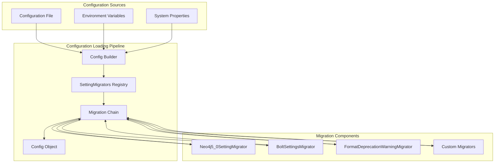
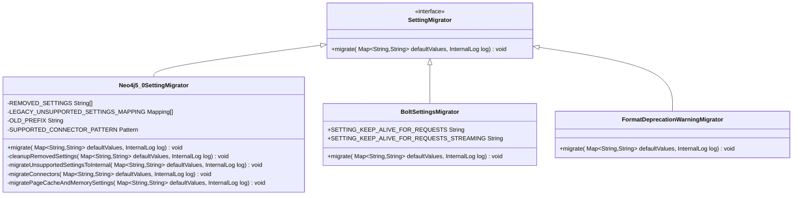
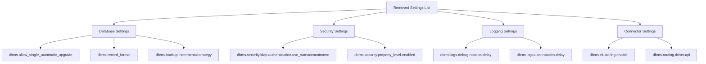
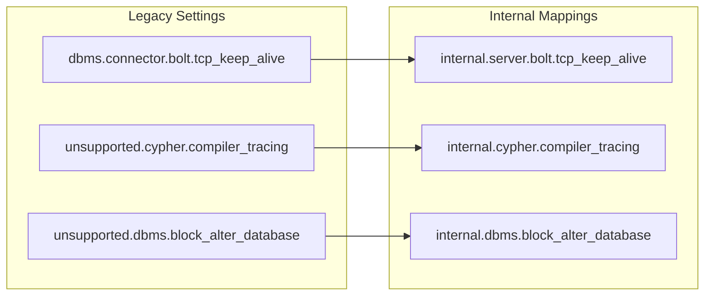
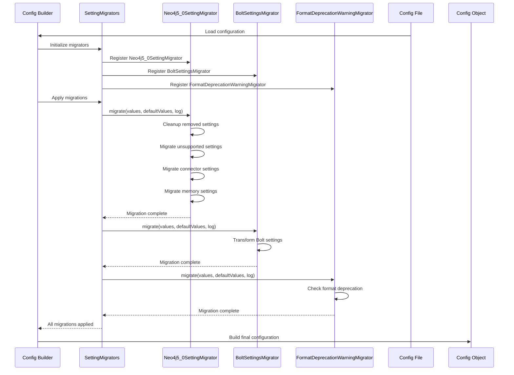
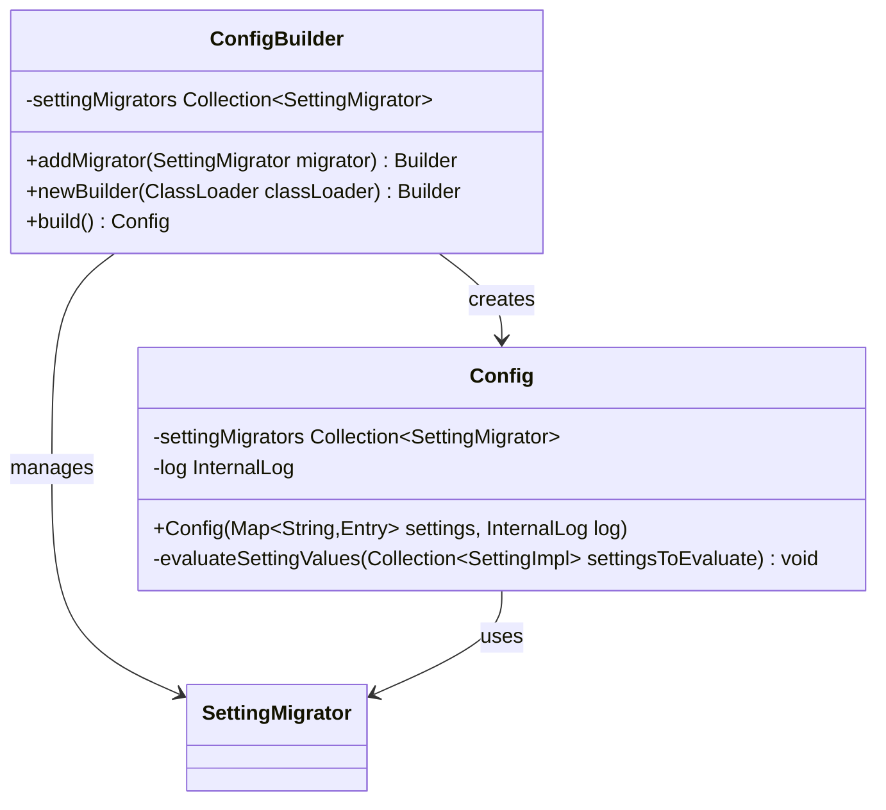
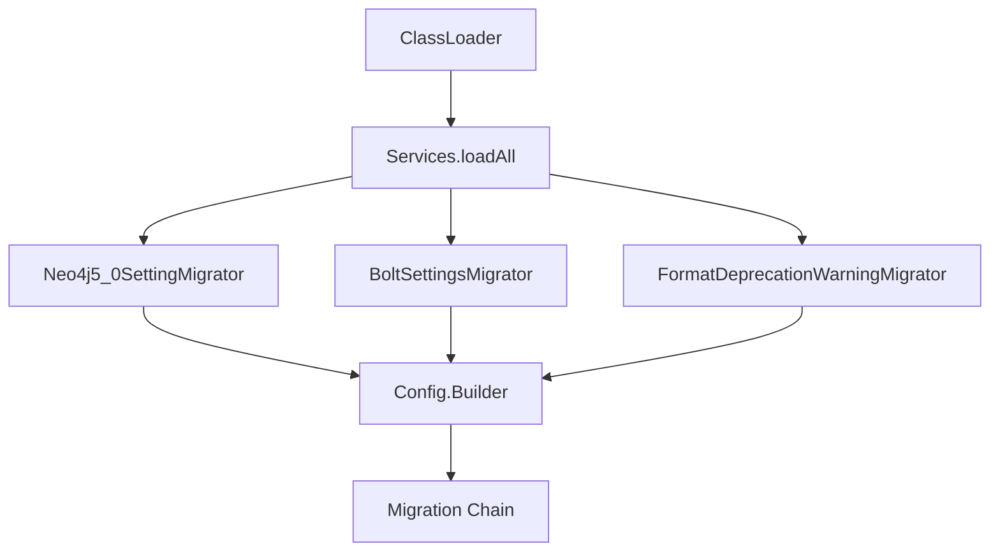
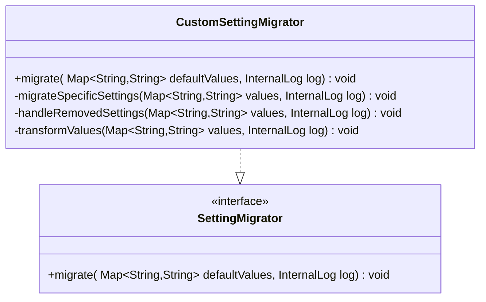
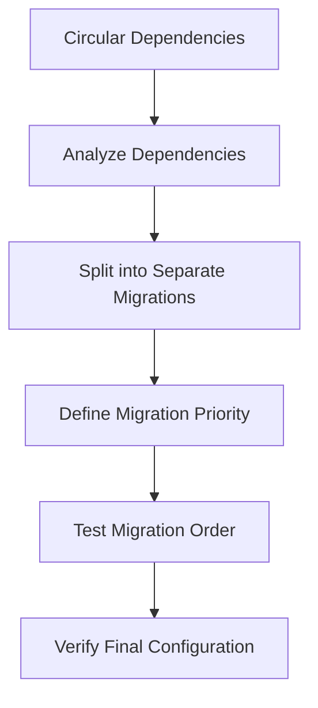
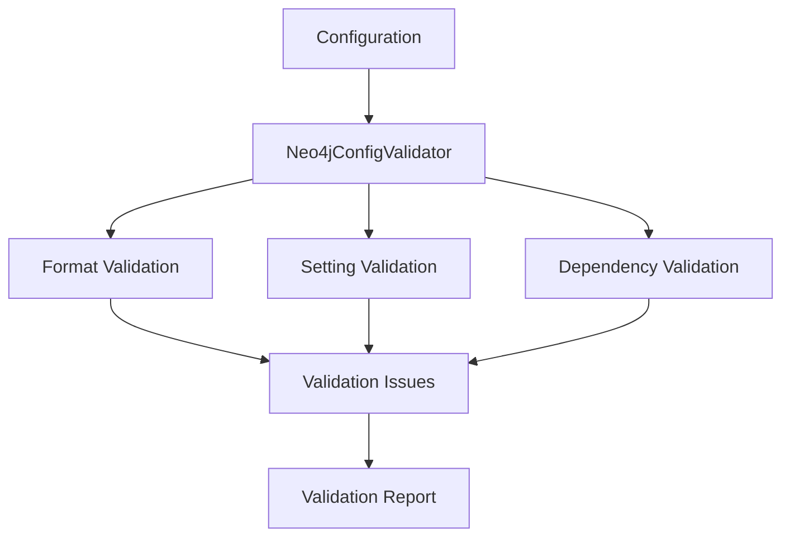

# Settings Migration

<cite>
**Referenced Files in This Document**
- [SettingMigrator.java](file://community/configuration/src/main/java/org/neo4j/configuration/SettingMigrator.java)
- [SettingMigrators.java](file://community/configuration/src/main/java/org/neo4j/configuration/SettingMigrators.java)
- [Config.java](file://community/configuration/src/main/java/org/neo4j/configuration/Config.java)
- [LocalConfig.java](file://community/configuration/src/main/java/org/neo4j/configuration/LocalConfig.java)
- [GraphDatabaseSettings.java](file://community/configuration/src/main/java/org/neo4j/configuration/GraphDatabaseSettings.java)
- [BoltSettingsMigrator.java](file://community/bolt/src/main/java/org/neo4j/bolt/BoltSettingsMigrator.java)
- [DeprecatedFormatWarning.java](file://community/kernel-api/src/main/java/org/neo4j/storageengine/api/DeprecatedFormatWarning.java)
- [ConfigFileMigrator.java](file://community/dbms/src/main/java/org/neo4j/commandline/dbms/ConfigFileMigrator.java)
- [FormatOverrideMigrator.java](file://community/test/format/FormatOverrideMigrator.java)
- [Neo4jConfigValidator.java](file://community/neo4j/src/main/java/org/neo4j/server/startup/validation/Neo4jConfigValidator.java)
</cite>

## Table of Contents
1. [Introduction](#introduction)
2. [Architecture Overview](#architecture-overview)
3. [Core Components](#core-components)
4. [SettingMigrator Interface](#settingmigrator-interface)
5. [Built-in Migration Rules](#built-in-migration-rules)
6. [Migration Process Flow](#migration-process-flow)
7. [Integration with Configuration Loading](#integration-with-configuration-loading)
8. [Custom Migration Implementation](#custom-migration-implementation)
9. [Common Issues and Solutions](#common-issues-and-solutions)
10. [Best Practices](#best-practices)
11. [Troubleshooting Guide](#troubleshooting-guide)

## Introduction

Neo4j's settings migration system provides a robust mechanism for handling deprecated configuration settings and evolving configuration schemas across different versions. This system ensures backward compatibility while guiding users toward modern configuration patterns through automated migration and clear warning messages.

The migration system operates as a layered approach where deprecated settings are automatically transformed into their modern equivalents, removed settings are handled gracefully, and unsupported configurations are flagged appropriately. This prevents configuration breakage during upgrades while maintaining transparency about the migration process.

## Architecture Overview

The settings migration system follows a modular architecture centered around the `SettingMigrator` interface and a registry pattern for managing migration rules.

**Diagram sources**
- [Config.java](file://community/configuration/src/main/java/org/neo4j/configuration/Config.java#L552-L604)
- [SettingMigrators.java](file://community/configuration/src/main/java/org/neo4j/configuration/SettingMigrators.java#L132-L631)

## Core Components

### SettingMigrator Interface

The `SettingMigrator` interface serves as the foundation for all migration operations. It defines a contract for transforming deprecated configuration settings into their modern equivalents.

**Diagram sources**
- [SettingMigrator.java](file://community/configuration/src/main/java/org/neo4j/configuration/SettingMigrator.java#L30-L41)
- [SettingMigrators.java](file://community/configuration/src/main/java/org/neo4j/configuration/SettingMigrators.java#L133-L631)
- [BoltSettingsMigrator.java](file://community/bolt/src/main/java/org/neo4j/bolt/BoltSettingsMigrator.java#L27-L35)
- [DeprecatedFormatWarning.java](file://community/kernel-api/src/main/java/org/neo4j/storageengine/api/DeprecatedFormatWarning.java#L47-L56)

### SettingMigrators Registry

The `SettingMigrators` class acts as a centralized registry containing comprehensive migration rules for Neo4j 5.0 and later versions. It handles:

- **Removed Settings**: Settings that no longer exist in newer versions
- **Renamed Settings**: Settings that have been renamed or reorganized
- **Deprecated Settings**: Settings that still work but have modern alternatives
- **Group Settings**: Settings that have been moved to different groups
- **Connector Migrations**: Bolt connector configuration transformations

**Section sources**
- [SettingMigrators.java](file://community/configuration/src/main/java/org/neo4j/configuration/SettingMigrators.java#L133-L631)

## SettingMigrator Interface

The `SettingMigrator` interface defines the contract for all migration operations. Each implementation receives three parameters:

- **values**: Current configuration values that may contain deprecated settings
- **defaultValues**: Default values that can be populated during migration
- **log**: Logger for reporting migration warnings and issues

### Migration Methods

Each migrator implements the `migrate()` method to transform configuration settings according to predefined rules. The method signature ensures that:

1. **Deprecated values are removed** from the values map
2. **Replacement values are added** to either the values or defaultValues map
3. **Warnings are logged** for deprecated settings usage

**Section sources**
- [SettingMigrator.java](file://community/configuration/src/main/java/org/neo4j/configuration/SettingMigrator.java#L30-L41)

## Built-in Migration Rules

### Neo4j 5.0 Migration Rules

The `Neo4j5_0SettingMigrator` handles the most comprehensive migration scenarios, including:

#### Removed Settings
Settings that were deprecated in earlier versions and completely removed in Neo4j 5.0:

**Diagram sources**
- [SettingMigrators.java](file://community/configuration/src/main/java/org/neo4j/configuration/SettingMigrators.java#L137-L249)

#### Renamed Settings
Settings that have been renamed or reorganized:

| Old Setting | New Setting | Migration Method |
|-------------|-------------|------------------|
| `dbms.memory.pagecache.size` | `server.memory.pagecache.max_size` | `migrateSettingNameChange()` |
| `dbms.memory.heap.max_size` | `server.jvm.heap.max_size` | `migrateSettingNameChange()` |
| `dbms.tx_log.buffer.size` | `server.transaction.log.buffer_size` | `migrateSettingNameChange()` |
| `dbms.connector.bolt.type` | `server.bolt.enabled` | Manual mapping |

#### Unsupported to Internal Mappings
Legacy unsupported settings that have been moved to internal settings:

**Diagram sources**
- [SettingMigrators.java](file://community/configuration/src/main/java/org/neo4j/configuration/SettingMigrators.java#L251-L591)

**Section sources**
- [SettingMigrators.java](file://community/configuration/src/main/java/org/neo4j/configuration/SettingMigrators.java#L137-L591)

### Bolt Connector Migration

The `BoltSettingsMigrator` handles specific Bolt connector configuration transformations:

- **Connection Keep-Alive**: Modernizes keep-alive configuration
- **Thread Pool Settings**: Updates thread pool configuration parameters
- **Unauthenticated Connections**: Transforms unauthenticated connection settings

**Section sources**
- [BoltSettingsMigrator.java](file://community/bolt/src/main/java/org/neo4j/bolt/BoltSettingsMigrator.java#L27-L35)

### Format Deprecation Warnings

The `FormatDeprecationWarningMigrator` provides warnings for deprecated storage formats:

- **Database Format Warnings**: Warns when deprecated database formats are detected
- **Target Format Warnings**: Alerts when target formats are deprecated
- **Configuration Format Warnings**: Flags deprecated format settings in configuration

**Section sources**
- [DeprecatedFormatWarning.java](file://community/kernel-api/src/main/java/org/neo4j/storageengine/api/DeprecatedFormatWarning.java#L47-L56)

## Migration Process Flow

The migration process follows a specific sequence during configuration loading:

**Diagram sources**
- [Config.java](file://community/configuration/src/main/java/org/neo4j/configuration/Config.java#L599-L604)
- [SettingMigrators.java](file://community/configuration/src/main/java/org/neo4j/configuration/SettingMigrators.java#L593-L631)

### Migration Execution Order

The migration system executes migrators in a specific order:

1. **Neo4j5_0SettingMigrator**: Handles the most comprehensive migrations
2. **BoltSettingsMigrator**: Manages Bolt connector migrations
3. **FormatDeprecationWarningMigrator**: Provides format deprecation warnings
4. **Custom Migrators**: Additional migrators loaded via service provider

**Section sources**
- [Config.java](file://community/configuration/src/main/java/org/neo4j/configuration/Config.java#L599-L604)

## Integration with Configuration Loading

### Config Builder Integration

The `Config.Builder` class integrates migration functionality through the `addMigrator()` method:

**Diagram sources**
- [Config.java](file://community/configuration/src/main/java/org/neo4j/configuration/Config.java#L244-L247)
- [Config.java](file://community/configuration/src/main/java/org/neo4j/configuration/Config.java#L599-L604)

### Service Provider Registration

Migration components are automatically discovered and registered using the `@ServiceProvider` annotation:

**Diagram sources**
- [Config.java](file://community/configuration/src/main/java/org/neo4j/configuration/Config.java#L559)

**Section sources**
- [Config.java](file://community/configuration/src/main/java/org/neo4j/configuration/Config.java#L244-L247)
- [Config.java](file://community/configuration/src/main/java/org/neo4j/configuration/Config.java#L559-L560)

## Custom Migration Implementation

### Creating Custom Migrators

To create a custom migration, implement the `SettingMigrator` interface:

### Migration Helper Methods

The `SettingMigrators` class provides several helper methods for common migration patterns:

| Method | Purpose | Usage Example |
|--------|---------|---------------|
| `migrateSettingNameChange()` | Rename settings | `migrateSettingNameChange(values, log, "old.setting", newSetting)` |
| `migrateSettingRemoval()` | Remove settings | `migrateSettingRemoval(values, log, "removed.setting", "Reason")` |
| `cleanupRemovedSettings()` | Clean up multiple removed settings | Bulk removal of deprecated settings |
| `migrateGroupSettingPrefixChange()` | Move group settings | Moving settings from one group to another |

### Best Practices for Custom Migrators

1. **Preserve Values**: Always preserve the original values when migrating
2. **Log Warnings**: Provide clear warnings for deprecated settings
3. **Handle Edge Cases**: Consider scenarios where both old and new settings are present
4. **Test Thoroughly**: Test migration with various configuration combinations

**Section sources**
- [SettingMigrators.java](file://community/configuration/src/main/java/org/neo4j/configuration/SettingMigrators.java#L1017-L1049)

## Common Issues and Solutions

### Missing Migration Paths

**Problem**: Configuration settings that don't have migration paths defined.

**Solution**: 
1. Check if the setting is intentionally removed
2. Implement custom migration logic
3. Use the `strict_config_validation` setting to control validation behavior

### Circular Dependencies

**Problem**: Settings that depend on each other during migration.

**Solution**:

### Configuration Validation Failures

**Problem**: Migrated configuration fails validation.

**Solution**:
1. Review migration logic for completeness
2. Check for conflicting settings
3. Verify that all dependencies are satisfied
4. Use the validation framework to identify issues

### Performance Impact

**Problem**: Migration process affecting startup performance.

**Solution**:
1. Minimize migration complexity
2. Use efficient data structures
3. Batch related migrations
4. Profile migration performance

**Section sources**
- [Config.java](file://community/configuration/src/main/java/org/neo4j/configuration/Config.java#L730-L739)

## Best Practices

### Migration Design Principles

1. **Backward Compatibility**: Always support old settings gracefully
2. **Clear Warnings**: Provide informative migration warnings
3. **Atomic Operations**: Ensure migration either succeeds completely or fails cleanly
4. **Testing Coverage**: Test all migration scenarios thoroughly

### Configuration Management

1. **Version Awareness**: Track Neo4j version for appropriate migrations
2. **Fallback Handling**: Provide fallback values when needed
3. **Validation Integration**: Integrate with configuration validation
4. **Documentation**: Document migration rules clearly

### Error Handling

1. **Graceful Degradation**: Continue operation even if migration fails
2. **Detailed Logging**: Log migration steps and decisions
3. **User Communication**: Inform users about migration status
4. **Recovery Options**: Provide ways to recover from migration failures

## Troubleshooting Guide

### Diagnostic Tools

The migration system provides several diagnostic capabilities:

#### Configuration Validation
The `Neo4jConfigValidator` validates migrated configurations and reports issues:

**Diagram sources**
- [Neo4jConfigValidator.java](file://community/neo4j/src/main/java/org/neo4j/server/startup/validation/Neo4jConfigValidator.java#L46-L75)

#### Migration Logging
Migration warnings are logged through the internal logging system:

- **Deprecated Settings**: Warnings when deprecated settings are used
- **Removed Settings**: Notifications when settings are removed
- **Migration Failures**: Errors when migration cannot be completed
- **Validation Issues**: Problems detected during configuration validation

### Common Troubleshooting Scenarios

#### Scenario 1: Unknown Setting After Migration
**Symptoms**: Configuration loads but reports unknown settings
**Solution**: 
1. Check if the setting was intentionally removed
2. Verify migration rules are complete
3. Review configuration file for typos

#### Scenario 2: Migration Timeout
**Symptoms**: Long startup times during migration
**Solution**:
1. Optimize migration logic
2. Reduce migration complexity
3. Consider batch processing

#### Scenario 3: Conflicting Settings
**Symptoms**: Configuration conflicts after migration
**Solution**:
1. Understand migration precedence rules
2. Review setting dependencies
3. Test migration with realistic configurations

**Section sources**
- [Neo4jConfigValidator.java](file://community/neo4j/src/main/java/org/neo4j/server/startup/validation/Neo4jConfigValidator.java#L46-L75)
- [ConfigFileMigrator.java](file://community/dbms/src/main/java/org/neo4j/commandline/dbms/ConfigFileMigrator.java#L338-L350)

### Migration Testing Strategies

1. **Unit Testing**: Test individual migration rules
2. **Integration Testing**: Test complete migration pipelines
3. **Compatibility Testing**: Verify backward compatibility
4. **Performance Testing**: Measure migration impact
5. **Edge Case Testing**: Test unusual configuration scenarios

The settings migration system in Neo4j provides a robust foundation for handling configuration evolution while maintaining backward compatibility and providing clear guidance to users. By understanding the architecture, implementation patterns, and best practices outlined in this documentation, developers can effectively manage configuration migrations and create custom migration rules when needed.