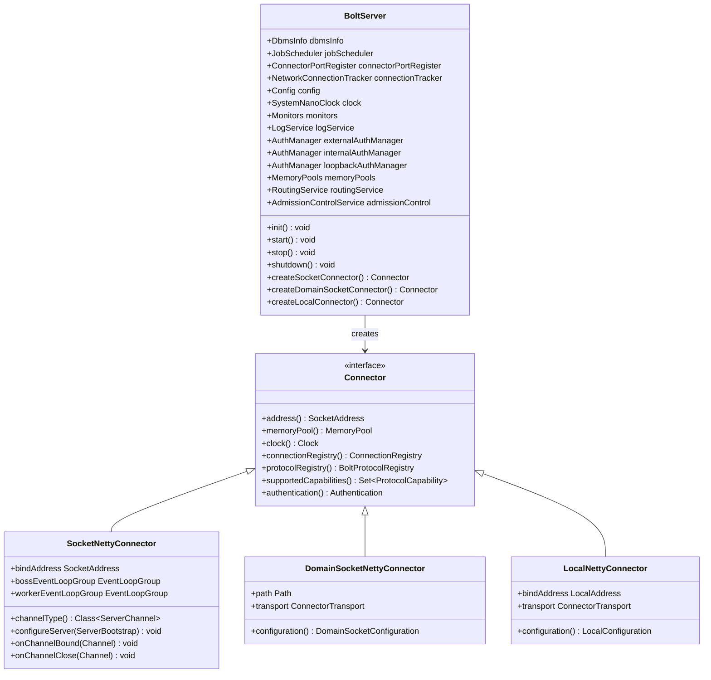
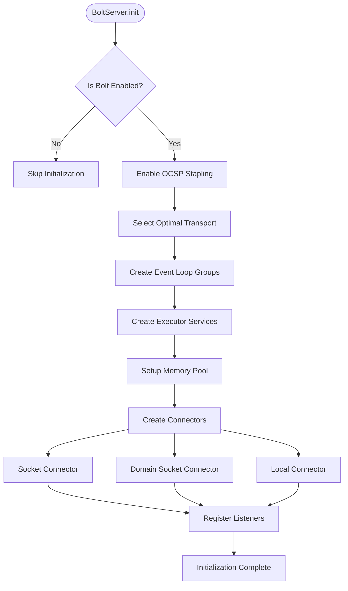
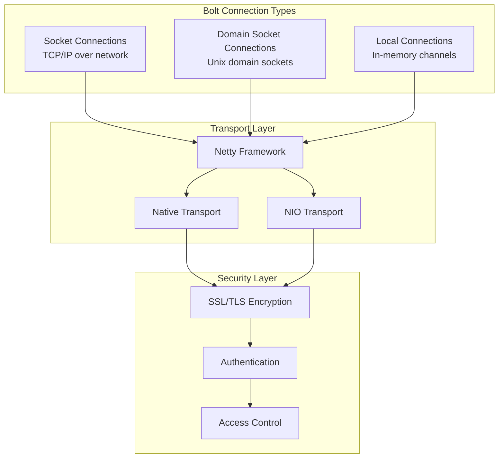
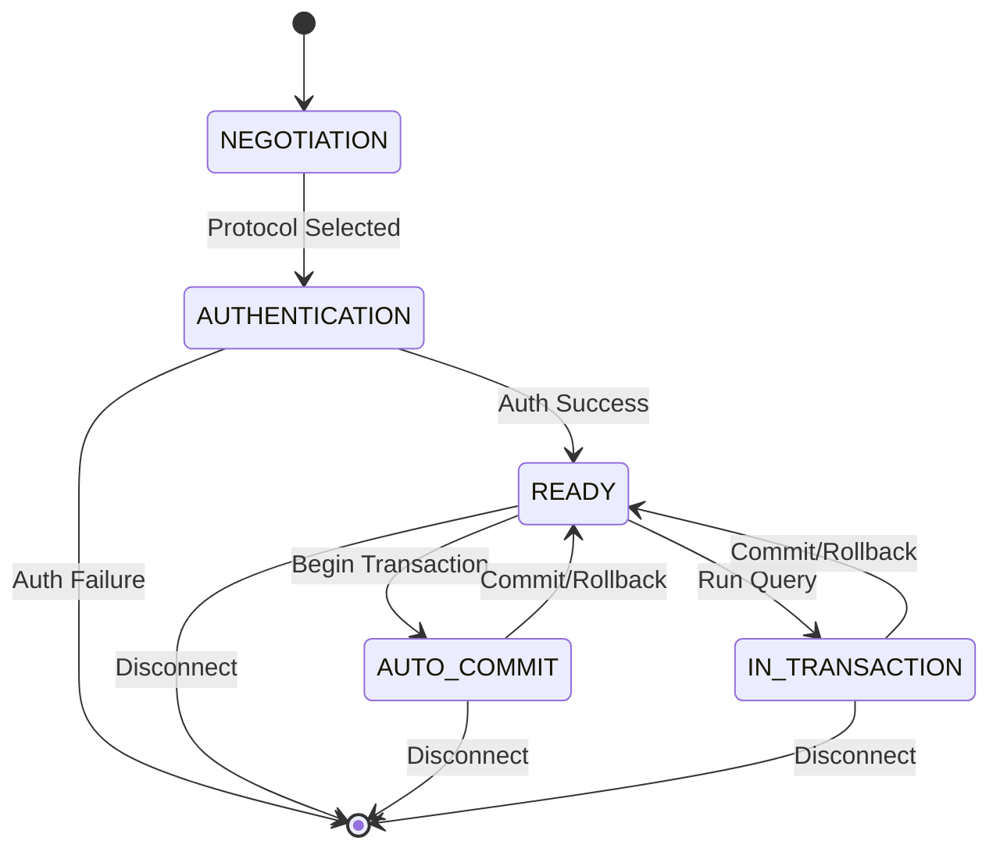
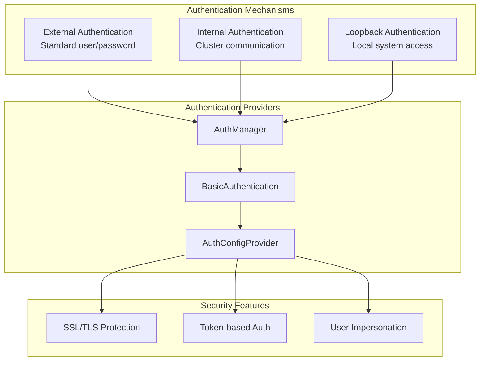
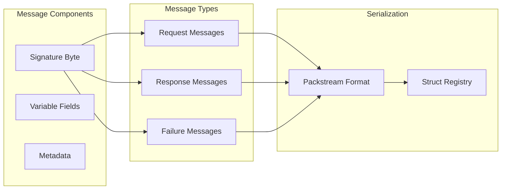
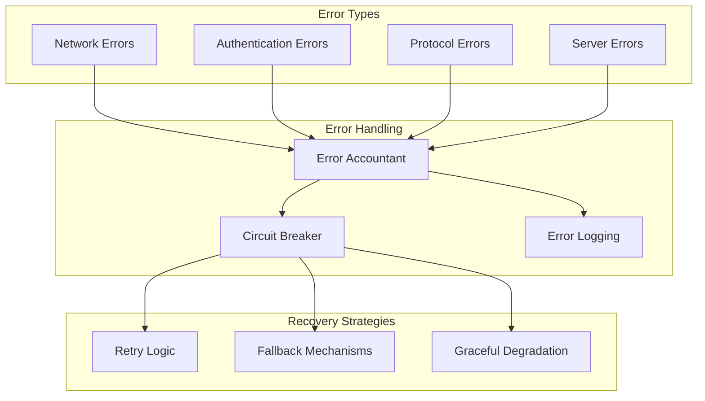
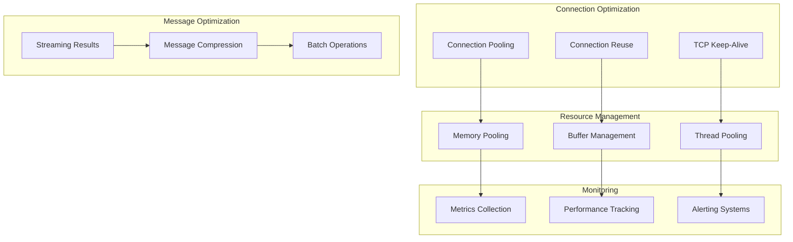
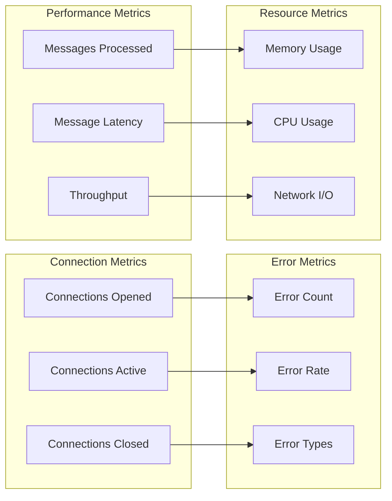
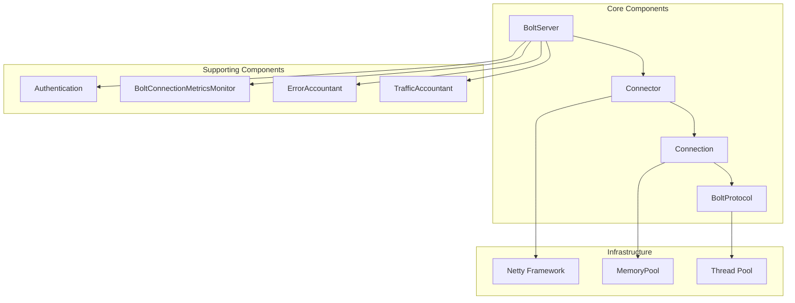

# Bolt Protocol

<cite>
**Referenced Files in This Document**
- [BoltServer.java](file://community/bolt/src/main/java/org/neo4j/bolt/BoltServer.java)
- [Connection.java](file://community/bolt/src/main/java/org/neo4j/bolt/protocol/common/connector/connection/Connection.java)
- [AbstractConnection.java](file://community/bolt/src/main/java/org/neo4j/bolt/protocol/common/connector/connection/AbstractConnection.java)
- [BoltConnector.java](file://community/configuration/src/main/java/org/neo4j/configuration/connectors/BoltConnector.java)
- [BoltConnectorInternalSettings.java](file://community/configuration/src/main/java/org/neo4j/configuration/connectors/BoltConnectorInternalSettings.java)
- [BoltProtocol.java](file://community/bolt/src/main/java/org/neo4j/bolt/protocol/common/BoltProtocol.java)
- [AbstractBoltProtocol.java](file://community/bolt/src/main/java/org/neo4j/bolt/protocol/AbstractBoltProtocol.java)
- [SocketNettyConnector.java](file://community/bolt/src/main/java/org/neo4j/bolt/protocol/common/connector/netty/SocketNettyConnector.java)
- [DomainSocketNettyConnector.java](file://community/bolt/src/main/java/org/neo4j/bolt/protocol/common/connector/netty/DomainSocketNettyConnector.java)
- [LocalNettyConnector.java](file://community/bolt/src/main/java/org/neo4j/bolt/protocol/common/connector/netty/LocalNettyConnector.java)
- [Authentication.java](file://community/bolt/src/main/java/org/neo4j/bolt/security/Authentication.java)
- [BasicAuthentication.java](file://community/bolt/src/main/java/org/neo4j/bolt/security/basic/BasicAuthentication.java)
- [BoltConnectionMetricsMonitor.java](file://community/bolt/src/main/java/org/neo4j/bolt/protocol/common/connection/BoltConnectionMetricsMonitor.java)
- [ErrorAccountant.java](file://community/bolt/src/main/java/org/neo4j/bolt/protocol/common/connector/accounting/error/ErrorAccountant.java)
- [TrafficAccountant.java](file://community/bolt/src/main/java/org/neo4j/bolt/protocol/common/connector/accounting/traffic/TrafficAccountant.java)
- [BoltException.java](file://community/bolt/src/main/java/org/neo4j/bolt/fsm/error/BoltException.java)
- [States.java](file://community/bolt/src/main/java/org/neo4j/bolt/protocol/common/fsm/States.java)
- [PackstreamStructDecoder.java](file://community/bolt/src/main/java/org/neo4j/packstream/codec/PackstreamStructDecoder.java)
</cite>

## Table of Contents
1. [Introduction](#introduction)
2. [BoltServer Architecture](#boltservice-architecture)
3. [Lifecycle Management](#lifecycle-management)
4. [Connection Handling](#connection-handling)
5. [Protocol Implementation](#protocol-implementation)
6. [Authentication Mechanisms](#authentication-mechanisms)
7. [Message Formats](#message-formats)
8. [Error Handling](#error-handling)
9. [Security Considerations](#security-considerations)
10. [Performance Optimization](#performance-optimization)
11. [Monitoring and Debugging](#monitoring-and-debugging)
12. [Migration and Compatibility](#migration-and-compatibility)
13. [Component Relationships](#component-relationships)

## Introduction

The Neo4j Bolt Protocol is a binary communication protocol designed for efficient, low-latency interaction between Neo4j clients and servers. It provides a robust foundation for database operations through a stateful connection model that supports transactions, streaming results, and real-time interaction patterns.

The Bolt protocol operates over TCP/IP connections and uses the Packstream serialization format for data exchange. It implements a sophisticated state machine architecture that manages connection lifecycle, authentication, and transaction handling through distinct protocol versions (v4.0, v4.1, v4.2, v4.3, v4.4, v5.0, v5.1, v5.2, v5.3, v5.4).

## BoltServer Architecture

The [`BoltServer`](file://community/bolt/src/main/java/org/neo4j/bolt/BoltServer.java) class serves as the primary entry point for Bolt connections, implementing the `LifecycleAdapter` pattern to manage the complete lifecycle of Bolt protocol instances.

**Diagram sources**
- [BoltServer.java](file://community/bolt/src/main/java/org/neo4j/bolt/BoltServer.java#L114-L817)
- [SocketNettyConnector.java](file://community/bolt/src/main/java/org/neo4j/bolt/protocol/common/connector/netty/SocketNettyConnector.java#L125-L171)
- [DomainSocketNettyConnector.java](file://community/bolt/src/main/java/org/neo4j/bolt/protocol/common/connector/netty/DomainSocketNettyConnector.java#L59-L105)
- [LocalNettyConnector.java](file://community/bolt/src/main/java/org/neo4j/bolt/protocol/common/connector/netty/LocalNettyConnector.java#L59-L105)

**Section sources**
- [BoltServer.java](file://community/bolt/src/main/java/org/neo4j/bolt/BoltServer.java#L114-L817)

## Lifecycle Management

The BoltServer implements a comprehensive lifecycle management system that ensures proper initialization, startup, graceful shutdown, and resource cleanup.

### Initialization Phase

During initialization, the BoltServer sets up multiple connector instances for different connection types:

**Diagram sources**
- [BoltServer.java](file://community/bolt/src/main/java/org/neo4j/bolt/BoltServer.java#L238-L382)

### Startup and Shutdown Procedures

The BoltServer follows a structured approach for startup and shutdown operations:

| Operation | Method | Description | Resources Affected |
|-----------|--------|-------------|-------------------|
| Initialization | `init()` | Sets up connectors, memory pools, and event loops | Network ports, memory allocation |
| Startup | `start()` | Activates all connectors and begins accepting connections | Active connections, thread pools |
| Stop | `stop()` | Gracefully stops accepting new connections | Pending connections, active sessions |
| Shutdown | `shutdown()` | Performs complete cleanup and resource deallocation | All network resources, memory pools |

**Section sources**
- [BoltServer.java](file://community/bolt/src/main/java/org/neo4j/bolt/BoltServer.java#L384-L465)

## Connection Handling

The Bolt protocol supports multiple connection types, each optimized for specific use cases and environments.

### Connection Types

**Diagram sources**
- [SocketNettyConnector.java](file://community/bolt/src/main/java/org/neo4j/bolt/protocol/common/connector/netty/SocketNettyConnector.java#L125-L171)
- [DomainSocketNettyConnector.java](file://community/bolt/src/main/java/org/neo4j/bolt/protocol/common/connector/netty/DomainSocketNettyConnector.java#L59-L105)
- [LocalNettyConnector.java](file://community/bolt/src/main/java/org/neo4j/bolt/protocol/common/connector/netty/LocalNettyConnector.java#L59-L105)

### Connection Establishment Process

The connection establishment follows a multi-stage process:

1. **Network Acceptance**: Incoming connections are accepted through the appropriate connector
2. **Protocol Negotiation**: Version and capability negotiation occurs
3. **Authentication**: User authentication is performed
4. **Connection Activation**: Connection becomes ready for database operations

**Section sources**
- [AbstractConnection.java](file://community/bolt/src/main/java/org/neo4j/bolt/protocol/common/connector/connection/AbstractConnection.java#L84-L116)

## Protocol Implementation

The Bolt protocol implementation supports multiple protocol versions, each with specific features and capabilities.

### Protocol Version Support

| Version | Features | Authentication | Transaction Model |
|---------|----------|----------------|-------------------|
| v4.0 | Basic CRUD operations | Pre-negotiation | Session-based |
| v4.1 | Streaming improvements | Pre-negotiation | Session-based |
| v4.2 | Batch operations | Pre-negotiation | Session-based |
| v4.3 | Result buffering | Pre-negotiation | Session-based |
| v4.4 | Enhanced streaming | Pre-negotiation | Session-based |
| v5.0 | Post-negotiation auth | Post-negotiation | Transaction-based |
| v5.1 | Improved telemetry | Post-negotiation | Transaction-based |
| v5.2 | Enhanced features | Post-negotiation | Transaction-based |
| v5.3 | UTC datetime support | Post-negotiation | Transaction-based |
| v5.4 | Latest enhancements | Post-negotiation | Transaction-based |

### State Machine Architecture

The protocol uses a sophisticated state machine to manage connection states:

**Diagram sources**
- [States.java](file://community/bolt/src/main/java/org/neo4j/bolt/protocol/common/fsm/States.java#L27-L34)

**Section sources**
- [AbstractBoltProtocol.java](file://community/bolt/src/main/java/org/neo4j/bolt/protocol/AbstractBoltProtocol.java#L57-L89)

## Authentication Mechanisms

The Bolt protocol supports multiple authentication mechanisms tailored to different security requirements and deployment scenarios.

### Authentication Types

**Diagram sources**
- [BasicAuthentication.java](file://community/bolt/src/main/java/org/neo4j/bolt/security/basic/BasicAuthentication.java)
- [Authentication.java](file://community/bolt/src/main/java/org/neo4j/bolt/security/Authentication.java)

### Authentication Flow

The authentication process varies by protocol version:

- **Pre-negotiation Authentication** (v4.x): Authentication occurs during protocol negotiation
- **Post-negotiation Authentication** (v5.x): Authentication occurs after protocol selection

**Section sources**
- [BasicAuthentication.java](file://community/bolt/src/main/java/org/neo4j/bolt/security/basic/BasicAuthentication.java)

## Message Formats

The Bolt protocol uses Packstream for efficient binary serialization of messages between client and server.

### Message Structure

**Diagram sources**
- [PackstreamStructDecoder.java](file://community/bolt/src/main/java/org/neo4j/packstream/codec/PackstreamStructDecoder.java#L32-L53)

### Supported Message Types

| Message Category | Examples | Purpose |
|------------------|----------|---------|
| Authentication | HELLO, LOGON | User authentication and session setup |
| Transaction | BEGIN, COMMIT, ROLLBACK | Transaction management |
| Query | RUN, DISCARD, PULL | Query execution and result streaming |
| Streaming | RECORD, SUCCESS, FAILURE | Result streaming and completion |

**Section sources**
- [PackstreamStructDecoder.java](file://community/bolt/src/main/java/org/neo4j/packstream/codec/PackstreamStructDecoder.java#L32-L53)

## Error Handling

The Bolt protocol implements comprehensive error handling mechanisms to ensure robust operation and meaningful error reporting.

### Error Categories

**Diagram sources**
- [ErrorAccountant.java](file://community/bolt/src/main/java/org/neo4j/bolt/protocol/common/connector/accounting/error/ErrorAccountant.java)

### Error Reporting

The protocol provides detailed error information through structured error messages:

- **Status Codes**: Standardized error classification
- **Error Messages**: Human-readable descriptions
- **Stack Traces**: Debugging information (when enabled)
- **Recovery Information**: Suggestions for error resolution

**Section sources**
- [BoltException.java](file://community/bolt/src/main/java/org/neo4j/bolt/fsm/error/BoltException.java#L34-L117)

## Security Considerations

The Bolt protocol implements multiple layers of security to protect against various attack vectors and ensure data confidentiality and integrity.

### Security Features

| Feature | Description | Configuration |
|---------|-------------|---------------|
| SSL/TLS Encryption | Transport layer security | `server.bolt.tls_level` |
| Authentication | User credential verification | `server.bolt.auth_enabled` |
| Authorization | Role-based access control | Database-level permissions |
| Connection Limits | Rate limiting and throttling | Thread pool configuration |
| Traffic Accounting | Bandwidth monitoring | `server.bolt.traffic_accounting_*` |

### SSL/TLS Configuration

The protocol supports comprehensive SSL/TLS configuration:

- **Cipher Suites**: Configurable cipher suite selection
- **TLS Versions**: Support for modern TLS versions
- **Certificate Validation**: Hostname verification and certificate chain validation
- **OCSP Stapling**: Online Certificate Status Protocol support

**Section sources**
- [BoltConnector.java](file://community/configuration/src/main/java/org/neo4j/configuration/connectors/BoltConnector.java#L65-L68)

## Performance Optimization

The Bolt protocol includes numerous performance optimization features designed to maximize throughput and minimize latency.

### Performance Features

### Configuration Tuning

Key performance parameters include:

- **Thread Pool Size**: `server.bolt.thread_pool_max_size`
- **Connection Limits**: Maximum concurrent connections
- **Buffer Sizes**: Network buffer configuration
- **Keep-Alive Settings**: Connection persistence tuning

**Section sources**
- [BoltConnector.java](file://community/configuration/src/main/java/org/neo4j/configuration/connectors/BoltConnector.java#L117-L128)

## Monitoring and Debugging

The Bolt protocol provides extensive monitoring and debugging capabilities for operational visibility and troubleshooting.

### Monitoring Metrics

**Diagram sources**
- [BoltConnectionMetricsMonitor.java](file://community/bolt/src/main/java/org/neo4j/bolt/protocol/common/connection/BoltConnectionMetricsMonitor.java#L24-L48)

### Debugging Tools

The protocol supports various debugging and diagnostic features:

- **Protocol Logging**: Wire-level message inspection
- **Traffic Capture**: Network packet capture
- **Performance Profiling**: Execution time analysis
- **State Inspection**: Connection state monitoring

**Section sources**
- [BoltConnectionMetricsMonitor.java](file://community/bolt/src/main/java/org/neo4j/bolt/protocol/common/connection/BoltConnectionMetricsMonitor.java#L24-L48)

## Migration and Compatibility

The Bolt protocol maintains backward compatibility while introducing new features and improvements across protocol versions.

### Version Compatibility Matrix

| Client Version | Server Compatibility | Migration Notes |
|----------------|---------------------|-----------------|
| v4.0 | v4.0+ | Full compatibility |
| v4.1 | v4.0+ | Minor feature additions |
| v4.2 | v4.0+ | Enhanced streaming |
| v4.3 | v4.0+ | Improved buffering |
| v4.4 | v4.0+ | Transaction improvements |
| v5.0+ | v5.0+ | Post-negotiation auth |

### Migration Strategies

- **Gradual Upgrade**: Deploy new protocol versions alongside existing ones
- **Feature Detection**: Client-side feature capability detection
- **Fallback Mechanisms**: Automatic fallback to compatible versions
- **Testing Protocols**: Comprehensive testing during migration phases

**Section sources**
- [BoltConnectorInternalSettings.java](file://community/configuration/src/main/java/org/neo4j/configuration/connectors/BoltConnectorInternalSettings.java#L58-L92)

## Component Relationships

The Bolt protocol architecture demonstrates strong separation of concerns through well-defined component relationships.

### Component Interactions

**Diagram sources**
- [BoltServer.java](file://community/bolt/src/main/java/org/neo4j/bolt/BoltServer.java#L114-L817)
- [Connection.java](file://community/bolt/src/main/java/org/neo4j/bolt/protocol/common/connector/connection/Connection.java#L48-L200)

### Integration Points

The Bolt protocol integrates with several Neo4j subsystems:

- **Transaction Manager**: Manages transaction lifecycle
- **Routing Service**: Handles cluster routing decisions
- **Memory Pools**: Optimizes memory allocation
- **Job Scheduler**: Coordinates background tasks
- **Log Service**: Provides structured logging

**Section sources**
- [BoltServer.java](file://community/bolt/src/main/java/org/neo4j/bolt/BoltServer.java#L153-L170)