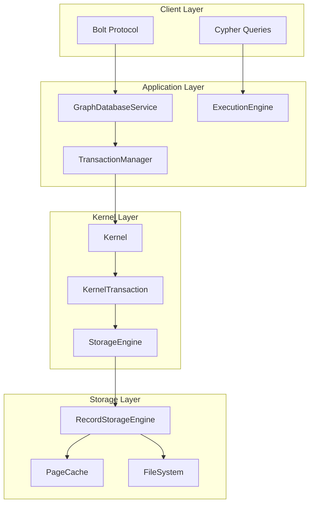
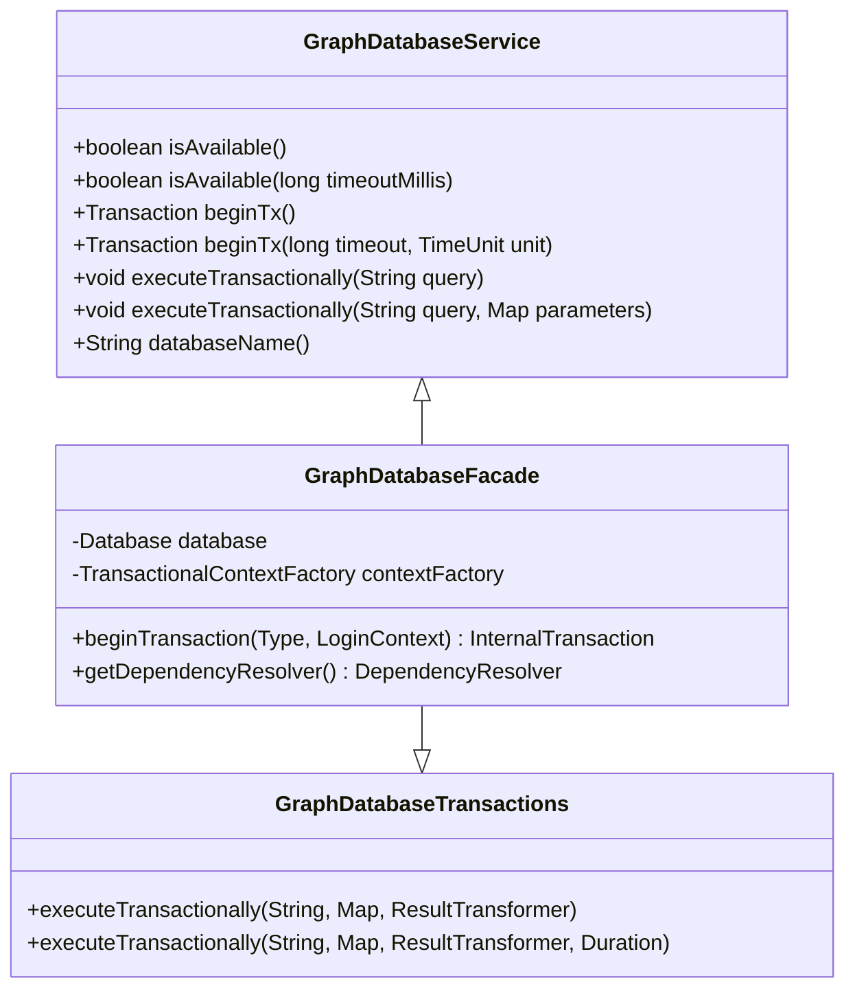
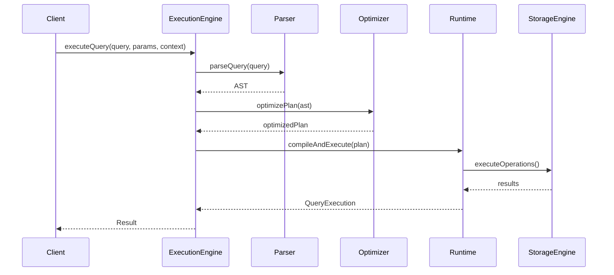
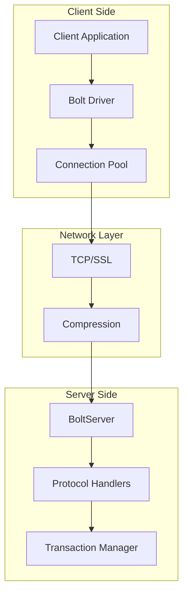
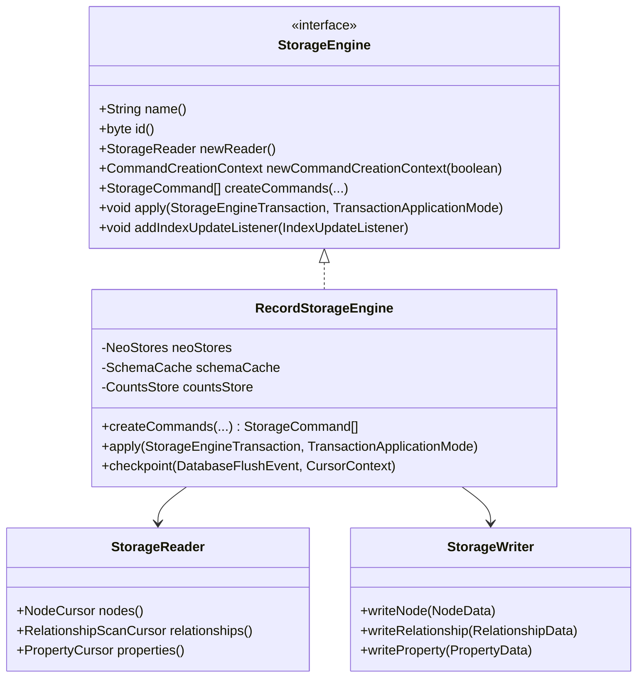
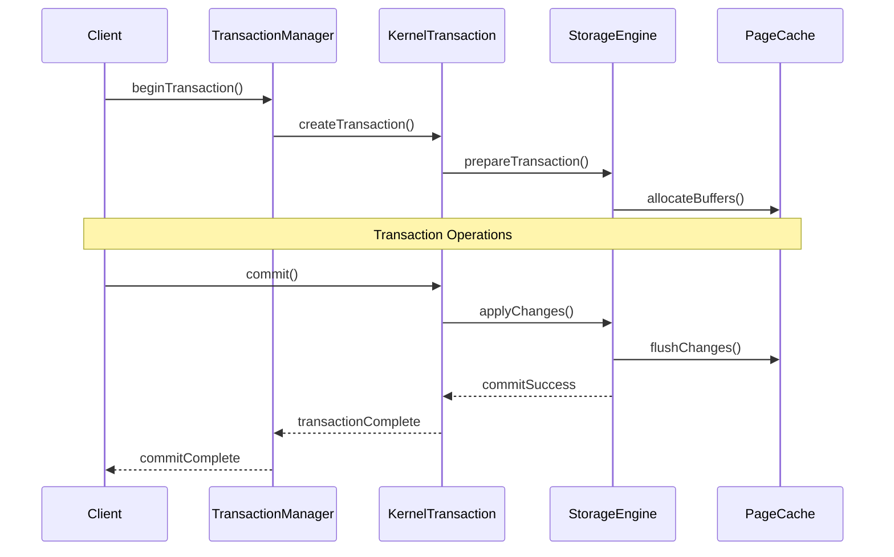
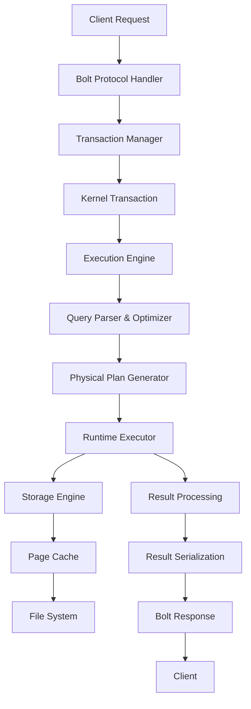
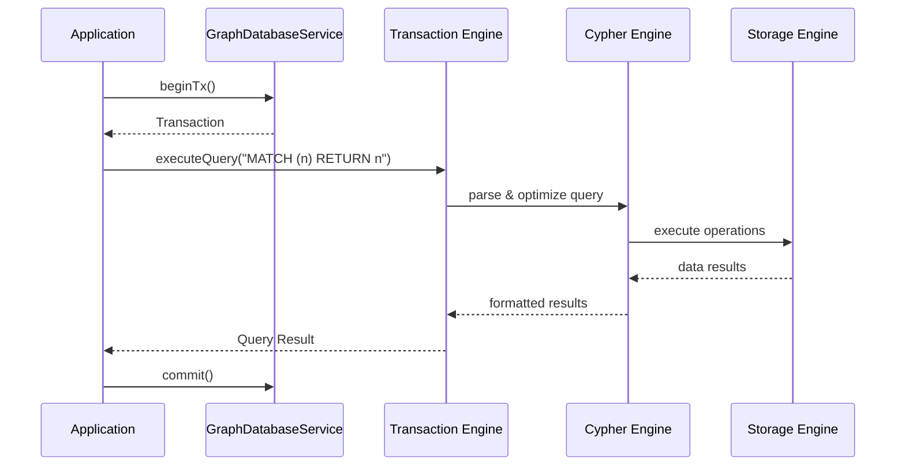
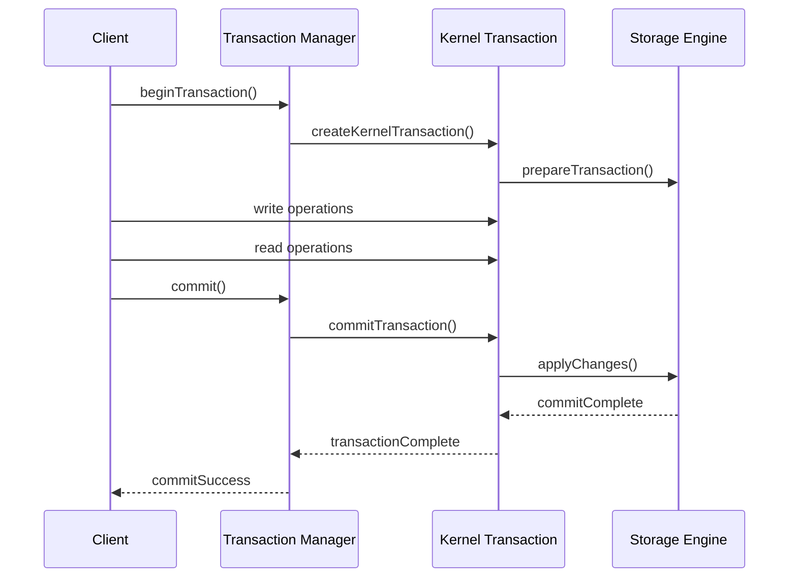

# Core Components

<cite>
**Referenced Files in This Document**
- [GraphDatabaseService.java](file://community/graphdb-api/src/main/java/org/neo4j/graphdb/GraphDatabaseService.java)
- [ExecutionEngine.java](file://community/cypher/cypher/src/main/java/org/neo4j/cypher/internal/javacompat/ExecutionEngine.java)
- [BoltServer.java](file://community/bolt/src/main/java/org/neo4j/bolt/BoltServer.java)
- [RecordStorageEngine.java](file://community/record-storage-engine/src/main/java/org/neo4j/internal/recordstorage/RecordStorageEngine.java)
- [Kernel.java](file://community/kernel-api/src/main/java/org/neo4j/kernel/api/Kernel.java)
- [KernelTransaction.java](file://community/kernel-api/src/main/java/org/neo4j/kernel/api/KernelTransaction.java)
- [StorageEngine.java](file://community/kernel-api/src/main/java/org/neo4j/storageengine/api/StorageEngine.java)
- [GraphDatabaseQueryService.java](file://community/kernel/src/main/java/org/neo4j/kernel/GraphDatabaseQueryService.java)
- [TransactionManagerImpl.java](file://community/bolt/src/main/java/org/neo4j/bolt/tx/TransactionManagerImpl.java)
- [BoltGraphDatabaseServiceSPI.java](file://community/bolt/src/main/java/org/neo4j/bolt/dbapi/BoltGraphDatabaseServiceSPI.java)
- [FabricTransactionImpl.java](file://community/fabric/fabric/src\main\java\org\neo4j\fabric\transaction\FabricTransactionImpl.java)
- [FabricKernelTransaction.java](file://community/fabric\fabric/src\main\java\org\neo4j\fabric\executor\FabricKernelTransaction.java)
</cite>

## Table of Contents
1. [Introduction](#introduction)
2. [System Architecture Overview](#system-architecture-overview)
3. [Graph Database Engine](#graph-database-engine)
4. [Cypher Query Engine](#cypher-query-engine)
5. [Bolt Protocol](#bolt-protocol)
6. [Storage Engine](#storage-engine)
7. [Transaction Management](#transaction-management)
8. [Component Interactions](#component-interactions)
9. [Practical Examples](#practical-examples)
10. [Performance Considerations](#performance-considerations)
11. [Troubleshooting Guide](#troubleshooting-guide)
12. [Conclusion](#conclusion)

## Introduction

Neo4j's core components form the foundation of its graph database architecture, working together to provide a robust, scalable, and efficient system for storing and querying graph data. This document explores the major components that make up Neo4j's architecture, from the high-level Graph Database Engine down to the low-level Storage Engine, explaining their purposes, relationships, and internal workings.

Each component serves a specific role in the overall system, with clear separation of concerns that enables modularity, maintainability, and extensibility. Understanding these components is essential for both beginners seeking to grasp Neo4j's architecture and experienced developers working with its internals.

## System Architecture Overview

Neo4j's architecture follows a layered approach with clear boundaries between components. The system can be visualized as a stack of interconnected layers, each responsible for specific aspects of database operations.

**Diagram sources**
- [BoltServer.java](file://community/bolt/src/main/java/org/neo4j/bolt/BoltServer.java#L113-L177)
- [ExecutionEngine.java](file://community/cypher/cypher/src/main/java/org/neo4j/cypher/internal/javacompat/ExecutionEngine.java#L60-L82)
- [Kernel.java](file://community/kernel-api/src/main/java/org/neo4j/kernel/api/Kernel.java#L40-L58)

The architecture demonstrates several key principles:

- **Layered Separation**: Clear boundaries between client protocols, application logic, kernel operations, and storage mechanisms
- **Interface Abstraction**: Well-defined interfaces that allow components to interact without tight coupling
- **Modular Design**: Independent components that can be developed, tested, and maintained separately
- **Extensibility**: Plugin-like architecture that supports different storage engines and protocols

**Section sources**
- [BoltServer.java](file://community/bolt/src/main/java/org/neo4j/bolt/BoltServer.java#L113-L815)
- [ExecutionEngine.java](file://community/cypher/cypher/src/main/java/org/neo4j/cypher/internal/javacompat/ExecutionEngine.java#L60-L216)

## Graph Database Engine

The Graph Database Engine serves as the primary interface between applications and the Neo4j database system. It provides the main entry point for database operations and manages the lifecycle of database connections and transactions.

### Purpose and Responsibilities

The Graph Database Engine acts as a facade that simplifies database interactions for application developers. It encapsulates the complexity of the underlying storage and query systems, providing a clean API for common database operations.

Key responsibilities include:
- **Database Lifecycle Management**: Starting, stopping, and maintaining database availability
- **Transaction Creation**: Providing methods for creating new transactions with various configurations
- **Resource Management**: Ensuring proper cleanup of database resources and connections
- **Availability Monitoring**: Checking and reporting database health and availability status

### Implementation Details

The engine implements the [`GraphDatabaseService`](file://community/graphdb-api/src/main/java/org/neo4j/graphdb/GraphDatabaseService.java#L33-L135) interface, which defines the contract for database operations. This interface provides methods for transaction management, availability checking, and query execution.

**Diagram sources**
- [GraphDatabaseService.java](file://community/graphdb-api/src/main/java/org/neo4j/graphdb/GraphDatabaseService.java#L33-L135)
- [GraphDatabaseFacade.java](file://community/kernel/src/main/java/org/neo4j/kernel/impl/factory/GraphDatabaseFacade.java#L55-L57)

### Technical Internals

Internally, the Graph Database Engine coordinates with several subsystems:

- **Dependency Resolution**: Uses a dependency injection system to access other components
- **Transaction Factory**: Creates appropriate transaction instances based on configuration
- **Context Management**: Maintains transactional contexts for query execution
- **Resource Tracking**: Monitors and manages database resources to prevent leaks

**Section sources**
- [GraphDatabaseService.java](file://community/graphdb-api/src/main/java/org/neo4j/graphdb/GraphDatabaseService.java#L33-L135)
- [GraphDatabaseFacade.java](file://community/kernel/src/main/java/org/neo4j/kernel/impl/factory/GraphDatabaseFacade.java#L55-L57)

## Cypher Query Engine

The Cypher Query Engine is responsible for parsing, optimizing, and executing Cypher queries. It transforms human-readable Cypher queries into executable operations that can be processed by the storage engine.

### Purpose and Architecture

The Cypher Query Engine serves as the bridge between high-level query language and low-level database operations. It handles query compilation, optimization, and execution, providing a powerful and flexible query processing system.

**Diagram sources**
- [ExecutionEngine.java](file://community/cypher/cypher/src/main/java/org/neo4j/cypher/internal/javacompat/ExecutionEngine.java#L107-L171)
- [DefaultExecutionEngine.scala](file://community/cypher/cypher/src/main/scala/org/neo4j/cypher/internal/DefaultExecutionEngine.scala#L34-L57)

### Core Components

The Cypher Query Engine consists of several key components:

#### ExecutionEngine Class
The [`ExecutionEngine`](file://community/cypher/cypher/src/main/java/org/neo4j/cypher/internal/javacompat/ExecutionEngine.java#L60-L82) is the main entry point for query execution. It manages the compilation and execution pipeline, handling query caching and optimization.

Key features:
- **Query Compilation**: Transforms Cypher queries into executable plans
- **Caching Mechanism**: Stores compiled queries to improve performance
- **Parameter Validation**: Ensures query parameters are valid and secure
- **Error Handling**: Provides detailed error information for query failures

#### Query Processing Pipeline
The engine implements a sophisticated query processing pipeline:

1. **Parsing**: Converts Cypher text into an abstract syntax tree (AST)
2. **Semantic Analysis**: Validates the query structure and semantics
3. **Optimization**: Applies various optimization techniques to improve performance
4. **Code Generation**: Produces executable bytecode or intermediate representations
5. **Execution**: Runs the compiled query against the storage engine

### Advanced Features

The Cypher Query Engine includes several advanced features:

- **Query Caching**: Automatically caches frequently used queries to reduce compilation overhead
- **Parallel Execution**: Supports concurrent query execution for improved throughput
- **Memory Management**: Tracks and manages memory usage during query execution
- **Monitoring Integration**: Provides detailed metrics and tracing for performance analysis

**Section sources**
- [ExecutionEngine.java](file://community/cypher/cypher/src/main/java/org/neo4j/cypher/internal/javacompat/ExecutionEngine.java#L60-L216)
- [DefaultExecutionEngine.scala](file://community/cypher/cypher/src/main/scala/org/neo4j/cypher/internal/DefaultExecutionEngine.scala#L34-L57)

## Bolt Protocol

The Bolt Protocol provides a binary communication protocol for clients to connect to Neo4j databases. It enables efficient, low-latency communication between client applications and the database server.

### Purpose and Design Philosophy

Bolt is designed to provide a fast, efficient, and reliable way for applications to interact with Neo4j databases. It uses a binary protocol format that reduces overhead compared to text-based protocols like HTTP.

Key design principles:
- **Binary Protocol**: Uses binary encoding for reduced bandwidth and faster parsing
- **Streaming Support**: Enables efficient streaming of large result sets
- **Connection Pooling**: Supports connection reuse for improved performance
- **Security**: Provides encryption and authentication mechanisms

### Protocol Architecture

**Diagram sources**
- [BoltServer.java](file://community/bolt/src/main/java/org/neo4j/bolt/BoltServer.java#L113-L177)
- [TransactionManagerImpl.java](file://community/bolt/src/main/java/org/neo4j/bolt/tx/TransactionManagerImpl.java#L44-L62)

### Core Components

#### BoltServer Class
The [`BoltServer`](file://community/bolt/src/main/java/org/neo4j/bolt/BoltServer.java#L113-L177) manages incoming client connections and protocol negotiation. It handles connection establishment, authentication, and message routing.

Key responsibilities:
- **Connection Management**: Accepts and manages client connections
- **Protocol Negotiation**: Determines compatible protocol versions with clients
- **Authentication**: Validates client credentials and permissions
- **Message Routing**: Routes messages to appropriate handlers

#### Transaction Management
The Bolt protocol integrates closely with Neo4j's transaction system through the [`TransactionManager`](file://community/bolt/src/main/java/org/neo4j/bolt/tx/TransactionManagerImpl.java#L44-L62):

- **Transaction Lifecycle**: Manages transaction creation, execution, and completion
- **Connection Association**: Links transactions to specific client connections
- **Timeout Handling**: Enforces transaction timeouts and cleanup
- **Error Propagation**: Handles errors and communicates them to clients

### Protocol Features

The Bolt protocol supports several advanced features:

- **Streaming Results**: Efficiently sends large result sets to clients
- **Transaction Control**: Supports BEGIN, COMMIT, and ROLLBACK operations
- **Parameter Binding**: Allows parameterized queries for security and performance
- **Metadata Exchange**: Provides information about query execution and database state

**Section sources**
- [BoltServer.java](file://community/bolt/src/main/java/org/neo4j/bolt/BoltServer.java#L113-L815)
- [TransactionManagerImpl.java](file://community/bolt/src/main/java/org/neo4j/bolt/tx/TransactionManagerImpl.java#L44-L123)

## Storage Engine

The Storage Engine is responsible for persisting graph data to disk and retrieving it efficiently. It provides an abstraction layer between the database system and the underlying storage mechanisms.

### Purpose and Architecture

The Storage Engine manages the physical storage of graph data, including nodes, relationships, properties, and schema information. It provides a unified interface for data access regardless of the underlying storage format.

**Diagram sources**
- [StorageEngine.java](file://community/kernel-api/src/main/java/org/neo4j/storageengine/api/StorageEngine.java#L60-L86)
- [RecordStorageEngine.java](file://community/record-storage-engine/src/main/java/org/neo4j/internal/recordstorage/RecordStorageEngine.java#L141-L205)

### Core Components

#### RecordStorageEngine
The [`RecordStorageEngine`](file://community/record-storage-engine/src/main/java/org/neo4j/internal/recordstorage/RecordStorageEngine.java#L141-L205) is the primary implementation of the Storage Engine interface. It manages the physical storage of graph data using a record-based approach.

Key features:
- **Multi-Version Support**: Supports both single-version and multi-version concurrency control
- **Command-Based Operations**: Uses commands to represent changes for efficient batching
- **Index Integration**: Coordinates with index systems for efficient data retrieval
- **Consistency Management**: Ensures data consistency across concurrent operations

#### Data Organization
The storage engine organizes data in several key areas:

- **Node Records**: Store node metadata and property information
- **Relationship Records**: Store relationship information and directionality
- **Property Records**: Manage property values and references
- **Schema Records**: Store indexes, constraints, and other schema information

### Storage Formats

The storage engine supports different storage formats optimized for various use cases:

- **Record Format**: Traditional record-based storage for general-purpose use
- **Columnar Format**: Optimized for analytical workloads and bulk operations
- **Hybrid Format**: Combines benefits of different approaches for mixed workloads

**Section sources**
- [RecordStorageEngine.java](file://community/record-storage-engine/src/main/java/org/neo4j/internal/recordstorage/RecordStorageEngine.java#L141-L862)
- [StorageEngine.java](file://community/kernel-api/src/main/java/org/neo4j/storageengine/api/StorageEngine.java#L60-L86)

## Transaction Management

Transaction management is a critical component that ensures data consistency, isolation, and durability in Neo4j. It coordinates between the application layer and the storage engine to provide ACID guarantees.

### Purpose and Guarantees

Transaction management provides the foundation for reliable database operations by ensuring:
- **Atomicity**: All operations in a transaction succeed or fail together
- **Consistency**: Database remains in a valid state before and after transactions
- **Isolation**: Transactions don't interfere with each other
- **Durability**: Once committed, transactions survive system failures

### Architecture Overview

**Diagram sources**
- [TransactionManagerImpl.java](file://community/bolt/src/main/java/org/neo4j/bolt/tx/TransactionManagerImpl.java#L68-L123)
- [KernelTransaction.java](file://community/kernel-api/src/main/java/org/neo4j/kernel/api/KernelTransaction.java#L139-L181)

### Core Components

#### TransactionManager
The [`TransactionManager`](file://community/bolt/src/main/java/org/neo4j/bolt/tx/TransactionManagerImpl.java#L44-L62) orchestrates transaction lifecycle and coordination:

- **Transaction Creation**: Initializes new transactions with appropriate settings
- **Resource Allocation**: Manages memory and other resources for transactions
- **Timeout Management**: Enforces transaction timeouts and cleanup
- **Error Handling**: Manages transaction failures and rollbacks

#### KernelTransaction
The [`KernelTransaction`](file://community/kernel-api/src/main/java/org/neo4j/kernel/api/KernelTransaction.java#L139-L181) represents a single database transaction:

- **Operation Interface**: Provides methods for reading and writing data
- **Isolation Level**: Controls transaction isolation behavior
- **Lock Management**: Coordinates with the locking system
- **State Tracking**: Maintains transaction state and progress

### Transaction Types

Neo4j supports different types of transactions:

- **Explicit Transactions**: Created and controlled by applications
- **Implicit Transactions**: Automatically created for single operations
- **Read Transactions**: Optimized for read-only operations
- **Write Transactions**: Optimized for write operations

**Section sources**
- [TransactionManagerImpl.java](file://community/bolt/src/main/java/org/neo4j/bolt/tx/TransactionManagerImpl.java#L44-L123)
- [KernelTransaction.java](file://community/kernel-api/src/main/java/org/neo4j/kernel/api/KernelTransaction.java#L139-L225)

## Component Interactions

Understanding how Neo4j's core components interact is crucial for comprehending the system's behavior and performance characteristics.

### Query Execution Flow

**Diagram sources**
- [BoltServer.java](file://community/bolt/src/main/java/org/neo4j/bolt/BoltServer.java#L113-L177)
- [ExecutionEngine.java](file://community/cypher/cypher/src/main/java/org/neo4j/cypher/internal/javacompat/ExecutionEngine.java#L107-L171)
- [RecordStorageEngine.java](file://community/record-storage-engine/src/main/java/org/neo4j/internal/recordstorage/RecordStorageEngine.java#L461-L528)

### Data Modification Workflow

When data is modified, the system follows a specific workflow:

1. **Command Generation**: The Execution Engine generates storage commands
2. **Transaction Preparation**: Commands are bundled into a transaction
3. **Lock Acquisition**: Necessary locks are acquired for data consistency
4. **Storage Application**: Commands are applied to the storage engine
5. **Index Updates**: Related indexes are updated
6. **Commit**: Changes are finalized and made visible

### Error Handling and Recovery

The system implements comprehensive error handling:

- **Transaction Rollback**: Automatic rollback on errors
- **Deadlock Detection**: Prevention and resolution of deadlocks
- **Consistency Checks**: Validation of data integrity
- **Recovery Procedures**: Restoration after failures

**Section sources**
- [FabricKernelTransaction.java](file://community/fabric/fabric/src\main\java\org\neo4j\fabric\executor\FabricKernelTransaction.java#L50-L87)
- [FabricTransactionImpl.java](file://community/fabric\fabric/src\main\java\org\neo4j\fabric\transaction\FabricTransactionImpl.java#L33-L58)

## Practical Examples

### Basic Query Execution

Here's how a typical query execution works through the Neo4j components:

### Transaction Management Example

**Section sources**
- [GraphDatabaseService.java](file://community/graphdb-api/src/main/java/org/neo4j/graphdb/GraphDatabaseService.java#L52-L82)
- [TransactionManagerImpl.java](file://community/bolt/src/main/java/org/neo4j/bolt/tx/TransactionManagerImpl.java#L68-L123)

## Performance Considerations

### Query Optimization

The Cypher Query Engine implements several optimization techniques:

- **Query Planning**: Generates efficient execution plans
- **Index Usage**: Automatically selects appropriate indexes
- **Join Reordering**: Optimizes join order for better performance
- **Predicate Pushdown**: Moves filters as early as possible

### Memory Management

Effective memory management is crucial for performance:

- **Buffer Pools**: Efficient allocation and reuse of buffers
- **Caching Strategies**: Intelligent caching of frequently accessed data
- **Garbage Collection**: Minimizing GC impact through careful allocation patterns

### Concurrency Control

Neo4j uses sophisticated concurrency control mechanisms:

- **MVCC**: Multi-Version Concurrency Control for high concurrency
- **Lock-Free Operations**: Where possible, to reduce contention
- **Batch Processing**: Efficient handling of bulk operations

## Troubleshooting Guide

### Common Issues and Solutions

#### Transaction Timeouts
- **Symptoms**: Transactions failing with timeout errors
- **Causes**: Long-running queries or resource contention
- **Solutions**: Increase timeout values, optimize queries, reduce transaction scope

#### Memory Pressure
- **Symptoms**: OutOfMemoryErrors or slow performance
- **Causes**: Large result sets or inefficient queries
- **Solutions**: Use streaming results, optimize queries, increase heap size

#### Deadlocks
- **Symptoms**: Transactions hanging indefinitely
- **Causes**: Conflicting lock acquisition order
- **Solutions**: Retry logic, consistent lock ordering, shorter transactions

### Monitoring and Diagnostics

Key metrics to monitor:

- **Query Execution Time**: Track slow queries
- **Transaction Throughput**: Monitor transaction rates
- **Memory Usage**: Watch for memory leaks or excessive consumption
- **Lock Contention**: Identify bottlenecks in concurrent access

**Section sources**
- [RecordStorageEngine.java](file://community/record-storage-engine/src/main/java/org/neo4j/internal/recordstorage/RecordStorageEngine.java#L670-L688)

## Conclusion

Neo4j's core components work together to provide a robust, scalable, and efficient graph database system. Each component has a specific role and responsibility, contributing to the overall reliability and performance of the system.

The Graph Database Engine provides the primary interface for applications, the Cypher Query Engine handles complex query processing, the Bolt Protocol enables efficient client-server communication, and the Storage Engine manages persistent data storage. Together, these components create a cohesive system that can handle diverse workloads and use cases.

Understanding these components is essential for:
- **Application Development**: Building efficient applications that leverage Neo4j's capabilities
- **Performance Tuning**: Optimizing queries and system configuration
- **Troubleshooting**: Diagnosing and resolving issues effectively
- **System Administration**: Managing Neo4j deployments and monitoring performance

The modular design and clear separation of concerns make Neo4j highly maintainable and extensible, allowing for continuous improvement and adaptation to new requirements and technologies.