# Cypher Query Engine

<cite>
**Referenced Files in This Document**
- [ExecutionEngine.scala](file://community/cypher/cypher/src/main/scala/org/neo4j/cypher/internal/ExecutionEngine.scala)
- [DefaultExecutionEngine.scala](file://community/cypher/cypher/src/main/scala/org/neo4j/cypher/internal/DefaultExecutionEngine.scala)
- [ExecutionEngine.java](file://community/cypher/cypher/src/main/java/org/neo4j/cypher/internal/javacompat/ExecutionEngine.java)
- [SystemExecutionEngine.java](file://community/cypher/cypher/src/main/java/org/neo4j/cypher/internal/javacompat/SystemExecutionEngine.java)
- [CypherQueryCaches.scala](file://community/cypher/cypher/src/main/scala/org/neo4j/cypher/internal/cache/CypherQueryCaches.scala)
- [CompilerFactory.scala](file://community/cypher/cypher/src/main/scala/org/neo4j/cypher/internal/CompilerFactory.scala)
- [MasterCompiler.scala](file://community/cypher/cypher/src/main/scala/org/neo4j/cypher/internal/MasterCompiler.scala)
- [CompilerLibrary.scala](file://community/cypher/cypher/src/main/scala/org/neo4j/cypher/internal/CompilerLibrary.scala)
- [InputQuery.scala](file://community/cypher/cypher/src/main/scala/org/neo4j/cypher/internal/InputQuery.scala)
- [CachingPreParser.scala](file://community/cypher/cypher/src/main/scala/org/neo4j/cypher/internal/CachingPreParser.scala)
- [SchemaHelper.scala](file://community/cypher/cypher/src/main/scala/org/neo4j/cypher/internal/SchemaHelper.scala)
- [ResultSubscriber.java](file://community/cypher/cypher/src/main/java/org/neo4j/cypher/internal/javacompat/ResultSubscriber.java)
- [TransactionalContext.java](file://community/kernel/src/main/java/org/neo4j/kernel/impl/query/TransactionalContext.java)
</cite>

## Table of Contents
1. [Introduction](#introduction)
2. [Architecture Overview](#architecture-overview)
3. [Core Components](#core-components)
4. [ExecutionEngine Implementation](#executionengine-implementation)
5. [Query Processing Pipeline](#query-processing-pipeline)
6. [Caching Mechanisms](#caching-mechanisms)
7. [Domain Model](#domain-model)
8. [Performance Optimization](#performance-optimization)
9. [Error Handling and Troubleshooting](#error-handling-and-troubleshooting)
10. [Configuration and Parameters](#configuration-and-parameters)
11. [Best Practices](#best-practices)

## Introduction

The Neo4j Cypher Query Engine is a sophisticated system responsible for parsing, compiling, optimizing, and executing Cypher queries. Built on a layered architecture, it provides efficient query processing capabilities with extensive caching mechanisms, query optimization, and robust error handling. The engine serves as the core component that bridges the gap between user queries and the underlying graph storage system.

The Cypher Query Engine operates through several key phases: query preprocessing, parsing, compilation, optimization, and execution. Each phase is designed to maximize performance while maintaining correctness and providing detailed feedback for query analysis and debugging.

## Architecture Overview

The Cypher Query Engine follows a modular architecture with clear separation of concerns:

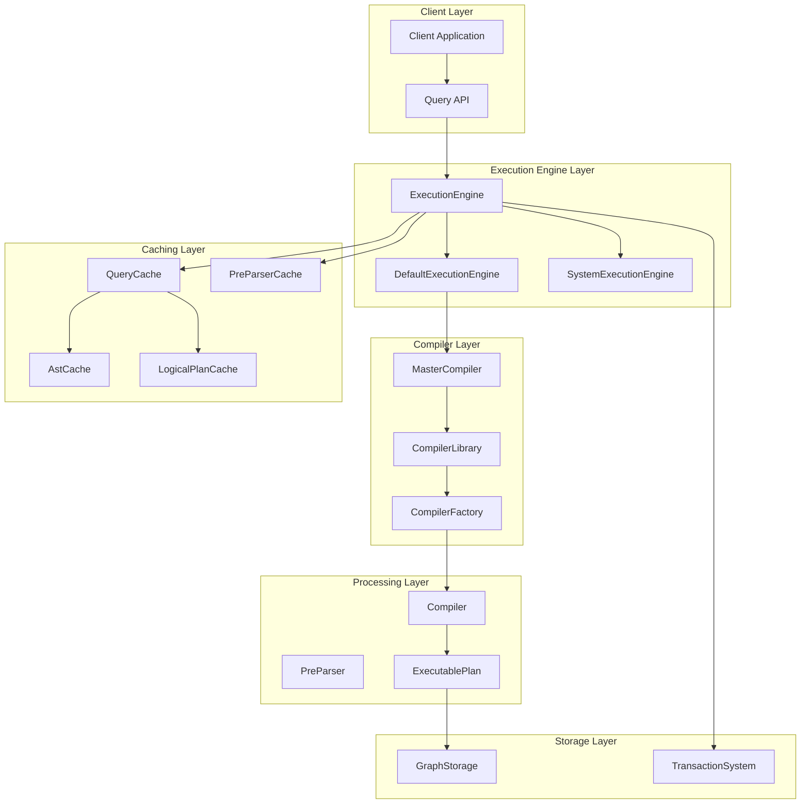

**Diagram sources**
- [ExecutionEngine.scala](file://community/cypher/cypher/src/main/scala/org/neo4j/cypher/internal/ExecutionEngine.scala#L66-L75)
- [DefaultExecutionEngine.scala](file://community/cypher/cypher/src/main/scala/org/neo4j/cypher/internal/DefaultExecutionEngine.scala#L35-L53)
- [MasterCompiler.scala](file://community/cypher/cypher/src/main/scala/org/neo4j/cypher/internal/MasterCompiler.scala#L36-L71)

## Core Components

### ExecutionEngine Classes

The ExecutionEngine serves as the primary interface for query execution, with multiple implementations to handle different scenarios:

#### Abstract ExecutionEngine
The base abstract class defines the core contract and shared functionality:

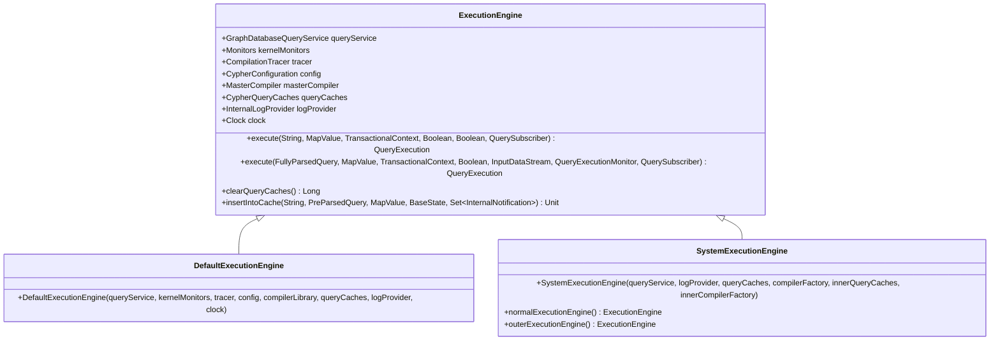

**Diagram sources**
- [ExecutionEngine.scala](file://community/cypher/cypher/src/main/scala/org/neo4j/cypher/internal/ExecutionEngine.scala#L66-L75)
- [DefaultExecutionEngine.scala](file://community/cypher/cypher/src/main/scala/org/neo4j/cypher/internal/DefaultExecutionEngine.scala#L35-L53)
- [SystemExecutionEngine.java](file://community/cypher/cypher/src/main/java/org/neo4j/cypher/internal/javacompat/SystemExecutionEngine.java#L30-L76)

#### Java Compatibility Layer
The Java compatibility layer provides a bridge between Java APIs and the Scala-based core engine:

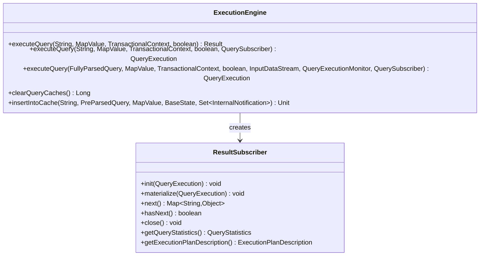

**Diagram sources**
- [ExecutionEngine.java](file://community/cypher/cypher/src/main/java/org/neo4j/cypher/internal/javacompat/ExecutionEngine.java#L61-L215)
- [ResultSubscriber.java](file://community/cypher/cypher/src/main/java/org/neo4j/cypher/internal/javacompat/ResultSubscriber.java#L61-L217)

**Section sources**
- [ExecutionEngine.scala](file://community/cypher/cypher/src/main/scala/org/neo4j/cypher/internal/ExecutionEngine.scala#L66-L75)
- [DefaultExecutionEngine.scala](file://community/cypher/cypher/src/main/scala/org/neo4j/cypher/internal/DefaultExecutionEngine.scala#L35-L53)
- [ExecutionEngine.java](file://community/cypher/cypher/src/main/java/org/neo4j/cypher/internal/javacompat/ExecutionEngine.java#L61-L215)

### MasterCompiler and CompilerFactory

The MasterCompiler orchestrates the compilation process by selecting appropriate compilers based on query characteristics:

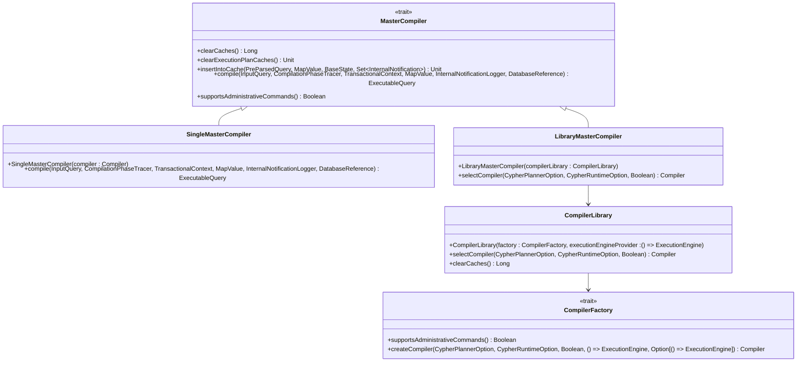

**Diagram sources**
- [MasterCompiler.scala](file://community/cypher/cypher/src/main/scala/org/neo4j/cypher/internal/MasterCompiler.scala#L36-L71)
- [CompilerFactory.scala](file://community/cypher/cypher/src/main/scala/org/neo4j/cypher/internal/CompilerFactory.scala#L28-L38)
- [CompilerLibrary.scala](file://community/cypher/cypher/src/main/scala/org/neo4j/cypher/internal/CompilerLibrary.scala#L38-L95)

**Section sources**
- [MasterCompiler.scala](file://community/cypher/cypher/src/main/scala/org/neo4j/cypher/internal/MasterCompiler.scala#L36-L71)
- [CompilerFactory.scala](file://community/cypher/cypher/src/main/scala/org/neo4j/cypher/internal/CompilerFactory.scala#L28-L38)
- [CompilerLibrary.scala](file://community/cypher/cypher/src/main/scala/org/neo4j/cypher/internal/CompilerLibrary.scala#L38-L95)

## ExecutionEngine Implementation

### Core Execution Methods

The ExecutionEngine provides several overloaded methods for query execution, each serving different use cases:

#### String Query Execution
The simplest form accepts a Cypher query string and executes it immediately:

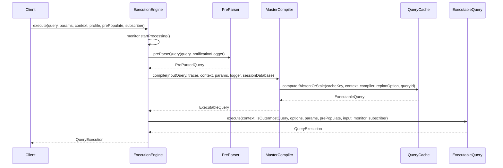

**Diagram sources**
- [ExecutionEngine.scala](file://community/cypher/cypher/src/main/scala/org/neo4j/cypher/internal/ExecutionEngine.scala#L101-L111)

#### Fully Parsed Query Execution
For applications that need to parse queries separately from execution:

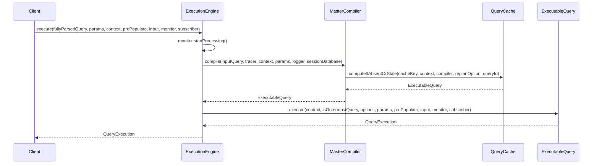

**Diagram sources**
- [ExecutionEngine.scala](file://community/cypher/cypher/src/main/scala/org/neo4j/cypher/internal/ExecutionEngine.scala#L126-L133)

### Query Compilation Process

The compilation process involves multiple stages with extensive caching and optimization:

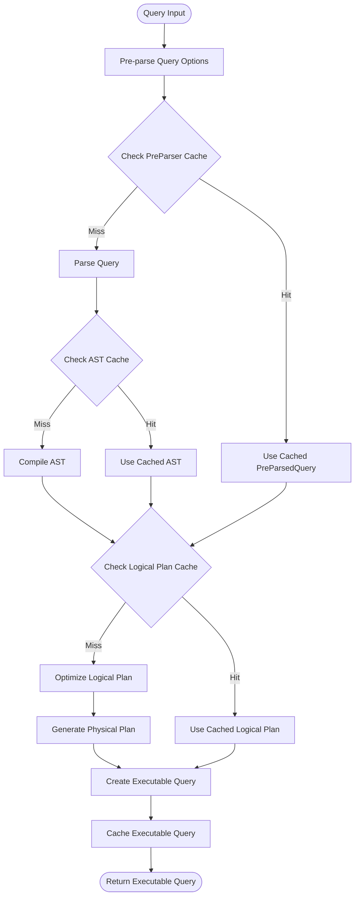

**Diagram sources**
- [ExecutionEngine.scala](file://community/cypher/cypher/src/main/scala/org/neo4j/cypher/internal/ExecutionEngine.scala#L347-L449)
- [CachingPreParser.scala](file://community/cypher/cypher/src/main/scala/org/neo4j/cypher/internal/CachingPreParser.scala#L90-L101)

**Section sources**
- [ExecutionEngine.scala](file://community/cypher/cypher/src/main/scala/org/neo4j/cypher/internal/ExecutionEngine.scala#L101-L176)
- [ExecutionEngine.scala](file://community/cypher/cypher/src/main/scala/org/neo4j/cypher/internal/ExecutionEngine.scala#L126-L133)

## Query Processing Pipeline

### InputQuery Types

The system supports different types of input queries, each optimized for specific use cases:

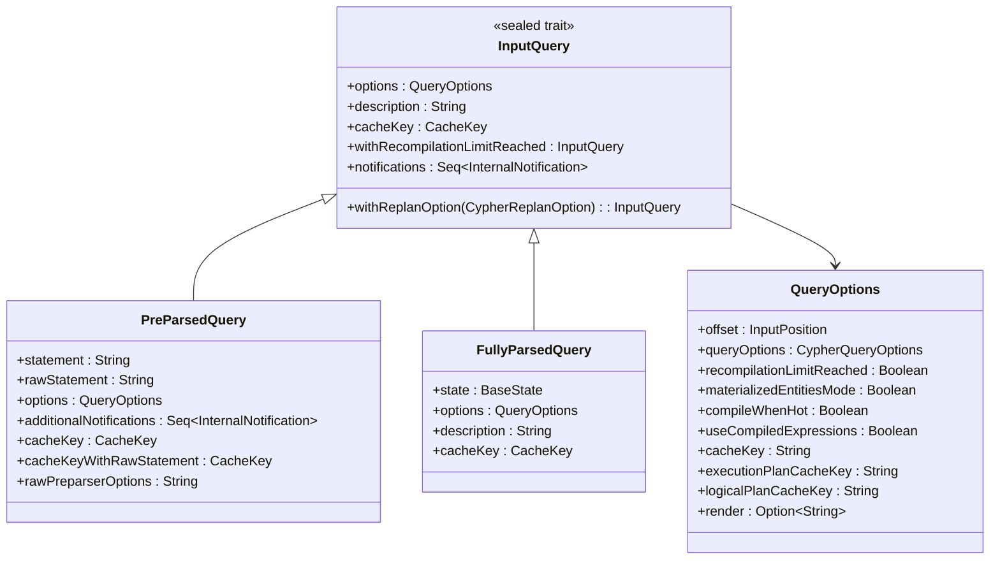

**Diagram sources**
- [InputQuery.scala](file://community/cypher/cypher/src/main/scala/org/neo4j/cypher/internal/InputQuery.scala#L35-L58)
- [InputQuery.scala](file://community/cypher/cypher/src/main/scala/org/neo4j/cypher/internal/InputQuery.scala#L72-L95)
- [InputQuery.scala](file://community/cypher/cypher/src/main/scala/org/neo4j/cypher/internal/InputQuery.scala#L98-L111)

### Query Execution Flow

The query execution follows a structured flow with multiple phases:

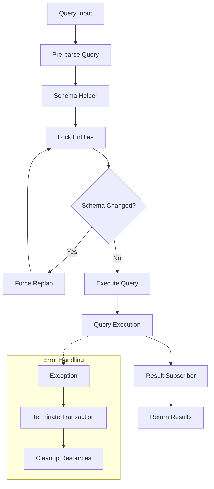

**Diagram sources**
- [ExecutionEngine.scala](file://community/cypher/cypher/src/main/scala/org/neo4j/cypher/internal/ExecutionEngine.scala#L430-L449)
- [SchemaHelper.scala](file://community/cypher/cypher/src/main/scala/org/neo4j/cypher/internal/SchemaHelper.scala#L52-L67)

**Section sources**
- [InputQuery.scala](file://community/cypher/cypher/src/main/scala/org/neo4j/cypher/internal/InputQuery.scala#L35-L182)
- [ExecutionEngine.scala](file://community/cypher/cypher/src/main/scala/org/neo4j/cypher/internal/ExecutionEngine.scala#L430-L449)

## Caching Mechanisms

### CypherQueryCaches Architecture

The CypherQueryCaches provides a comprehensive caching system with multiple cache tiers:

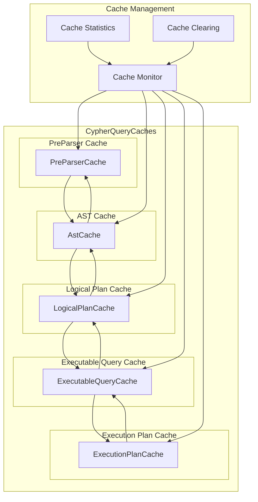

**Diagram sources**
- [CypherQueryCaches.scala](file://community/cypher/cypher/src/main/scala/org/neo4j/cypher/internal/cache/CypherQueryCaches.scala#L461-L596)

### Cache Configuration

The caching system supports various configuration options:

| Cache Type | Purpose | Size Configuration | Staleness Policy |
|------------|---------|-------------------|------------------|
| PreParser Cache | Store pre-parsed queries | Dynamic | TTL-based |
| AST Cache | Store parsed abstract syntax trees | Dynamic | Transaction-based |
| Logical Plan Cache | Store optimized logical plans | Dynamic | Statistics divergence |
| Executable Query Cache | Store compiled executable queries | Dynamic/SOFT | Transaction-based |
| Execution Plan Cache | Store runtime execution plans | Configurable | Disabled/Default/Sized |

**Section sources**
- [CypherQueryCaches.scala](file://community/cypher/cypher/src/main/scala/org/neo4j/cypher/internal/cache/CypherQueryCaches.scala#L430-L607)

## Domain Model

### Core Domain Objects

The Cypher Query Engine operates on several key domain objects that represent different aspects of query processing:

#### TransactionalContext
Provides the execution context for queries within a transaction:

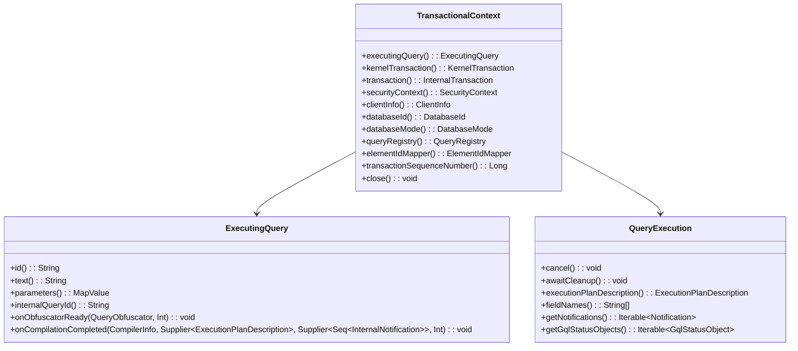

**Diagram sources**
- [TransactionalContext.java](file://community/kernel/src/main/java/org/neo4j/kernel/impl/query/TransactionalContext.java#L122-L159)

#### ResultSubscriber
Handles the streaming of query results to clients:

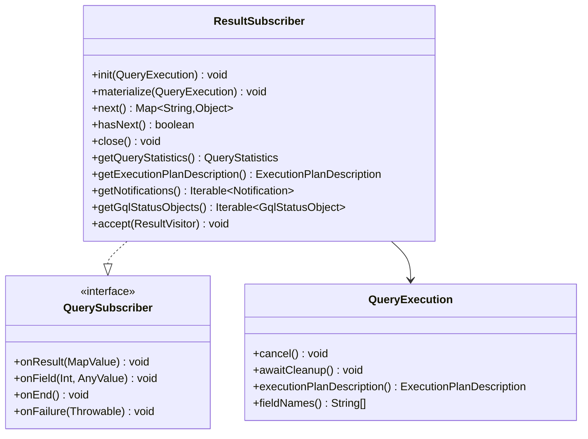

**Diagram sources**
- [ResultSubscriber.java](file://community/cypher/cypher/src/main/java/org/neo4j/cypher/internal/javacompat/ResultSubscriber.java#L61-L217)

**Section sources**
- [TransactionalContext.java](file://community/kernel/src/main/java/org/neo4j/kernel/impl/query/TransactionalContext.java#L122-L159)
- [ResultSubscriber.java](file://community/cypher/cypher/src/main/java/org/neo4j/cypher/internal/javacompat/ResultSubscriber.java#L61-L217)

## Performance Optimization

### Query Compilation Optimization

The system employs several optimization strategies during query compilation:

#### Expression Code Generation
The ExecutionEngine supports both interpreted and compiled expressions:

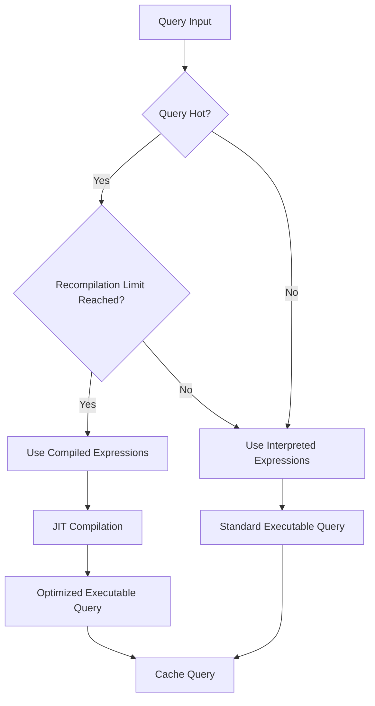

**Diagram sources**
- [ExecutionEngine.scala](file://community/cypher/cypher/src/main/scala/org/neo4j/cypher/internal/ExecutionEngine.scala#L289-L344)

#### Schema Locking Optimization
The SchemaHelper optimizes entity locking to minimize contention:

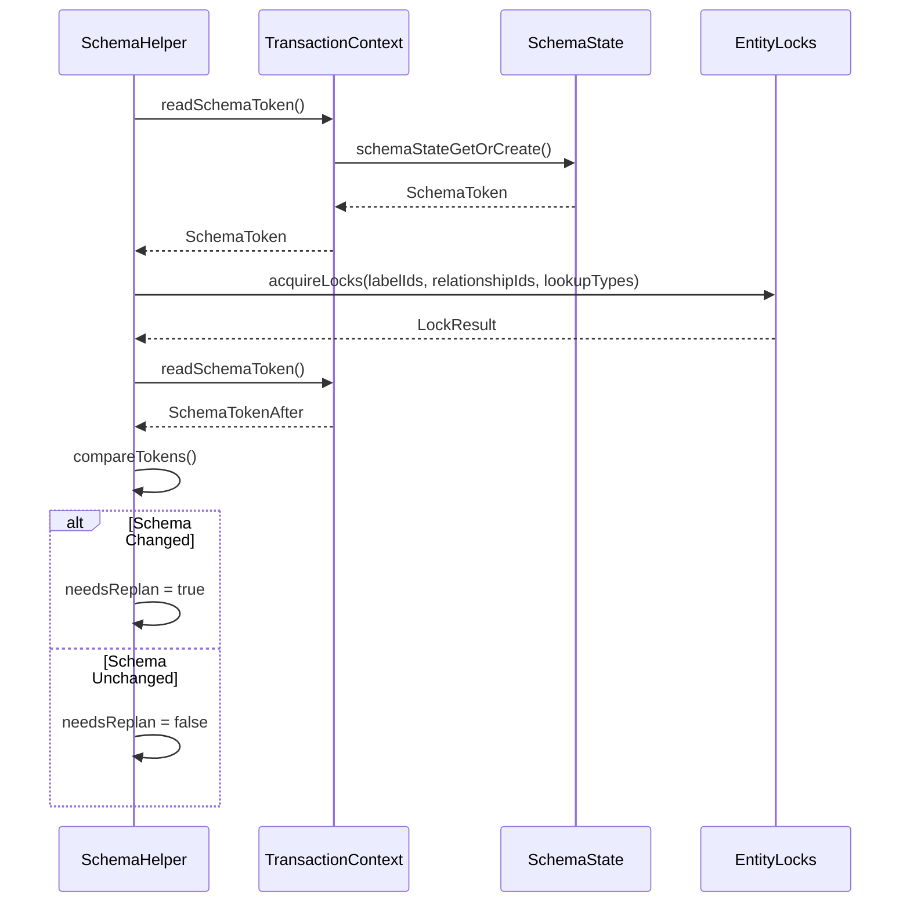

**Diagram sources**
- [SchemaHelper.scala](file://community/cypher/cypher/src/main/scala/org/neo4j/cypher/internal/SchemaHelper.scala#L52-L67)

### Performance Monitoring

The system provides comprehensive monitoring capabilities:

| Metric Category | Metrics | Purpose |
|----------------|---------|---------|
| Compilation Time | Parse time, Compile time, Optimization time | Query performance analysis |
| Cache Hit Rates | PreParser, AST, Logical Plan, Executable Query | Cache effectiveness |
| Memory Usage | Query cache size, Compilation memory | Resource utilization |
| Lock Contention | Schema lock waits, Entity lock conflicts | Concurrency analysis |

**Section sources**
- [ExecutionEngine.scala](file://community/cypher/cypher/src/main/scala/org/neo4j/cypher/internal/ExecutionEngine.scala#L289-L344)
- [SchemaHelper.scala](file://community/cypher/cypher/src/main/scala/org/neo4j/cypher/internal/SchemaHelper.scala#L52-L67)

## Error Handling and Troubleshooting

### Common Query Execution Issues

#### Query Compilation Errors
The system provides detailed error reporting for compilation issues:

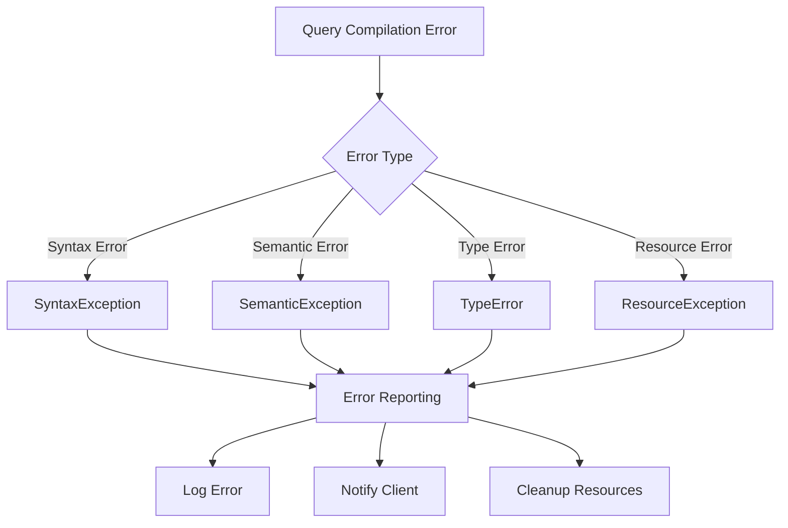

#### Schema Change Handling
The system handles frequent schema changes gracefully:

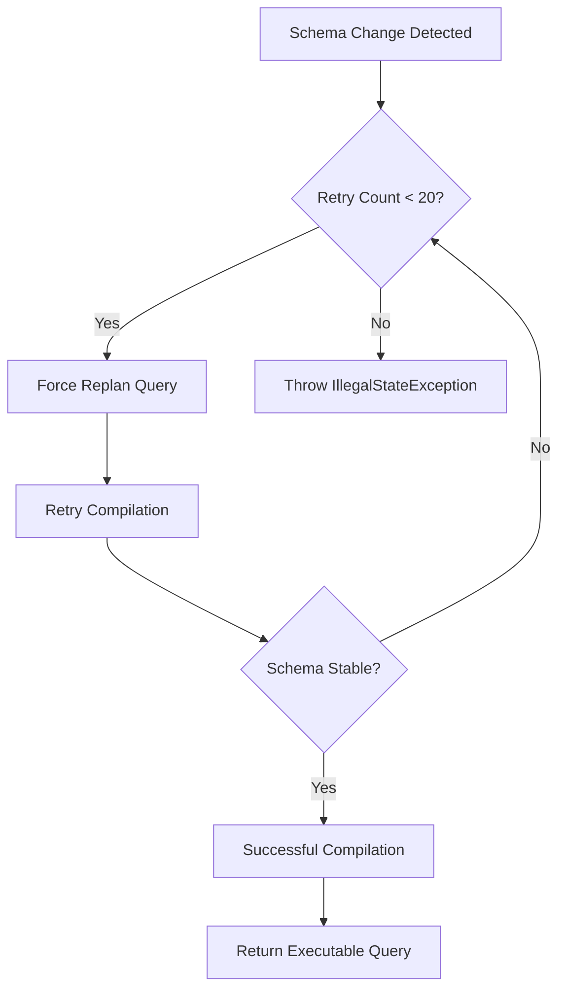

**Diagram sources**
- [ExecutionEngine.scala](file://community/cypher/cypher/src/main/scala/org/neo4j/cypher/internal/ExecutionEngine.scala#L448-L449)

### Troubleshooting Guide

#### Performance Issues
1. **Slow Query Execution**: Check cache hit rates and consider increasing cache sizes
2. **High Memory Usage**: Monitor cache sizes and adjust soft cache settings
3. **Lock Contention**: Review query patterns and consider query optimization

#### Compilation Issues
1. **Syntax Errors**: Verify Cypher syntax and parameter types
2. **Semantic Errors**: Check schema consistency and query logic
3. **Resource Exhaustion**: Monitor memory usage and optimize query complexity

**Section sources**
- [ExecutionEngine.scala](file://community/cypher/cypher/src/main/scala/org/neo4j/cypher/internal/ExecutionEngine.scala#L231-L258)
- [ExecutionEngine.scala](file://community/cypher/cypher/src/main/scala/org/neo4j/cypher/internal/ExecutionEngine.scala#L448-L449)

## Configuration and Parameters

### Key Configuration Options

The Cypher Query Engine supports extensive configuration through the CypherConfiguration class:

| Configuration Parameter | Type | Default | Description |
|------------------------|------|---------|-------------|
| queryCacheSize | Integer | 1000 | Maximum size of query caches |
| executionPlanCacheSize | Integer | -1 | Size of execution plan cache (-1=default, 0=disabled) |
| recompilationLimit | Integer | 5 | Number of executions before JIT compilation |
| softQueryCacheEnabled | Boolean | false | Enable soft cache with strong/soft partitions |
| statsDivergenceCalculator | Config | Default | Statistics divergence calculation settings |
| enableMonitors | Boolean | false | Enable performance monitoring |

### Method Parameters

#### executeQuery Methods
The primary execution methods accept various parameters:

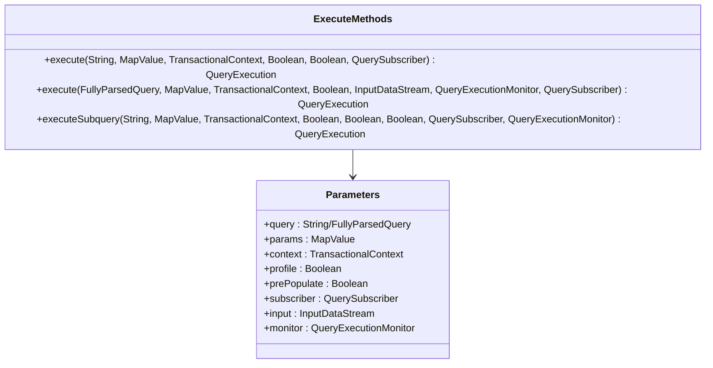

**Diagram sources**
- [ExecutionEngine.scala](file://community/cypher/cypher/src/main/scala/org/neo4j/cypher/internal/ExecutionEngine.scala#L101-L176)

**Section sources**
- [ExecutionEngine.scala](file://community/cypher/cypher/src/main/scala/org/neo4j/cypher/internal/ExecutionEngine.scala#L101-L176)

## Best Practices

### Query Optimization
1. **Use Parameters**: Always use parameterized queries for better caching
2. **Index Usage**: Ensure proper indexing for frequently queried patterns
3. **Query Complexity**: Keep queries reasonably complex to balance performance and readability
4. **Cache Utilization**: Leverage the caching system by using consistent query patterns

### Performance Tuning
1. **Cache Configuration**: Adjust cache sizes based on workload characteristics
2. **Memory Management**: Monitor memory usage and tune garbage collection
3. **Concurrency Control**: Understand lock behavior and optimize query patterns
4. **Monitoring**: Enable monitoring to track performance metrics

### Error Handling
1. **Graceful Degradation**: Implement fallback strategies for failed queries
2. **Resource Cleanup**: Ensure proper cleanup of resources in error conditions
3. **Logging**: Enable comprehensive logging for debugging and monitoring
4. **Retry Logic**: Implement appropriate retry mechanisms for transient failures

### Development Guidelines
1. **Testing**: Thoroughly test queries with various data volumes
2. **Profiling**: Use profiling tools to identify bottlenecks
3. **Documentation**: Document complex queries and optimization decisions
4. **Monitoring**: Set up monitoring for production deployments