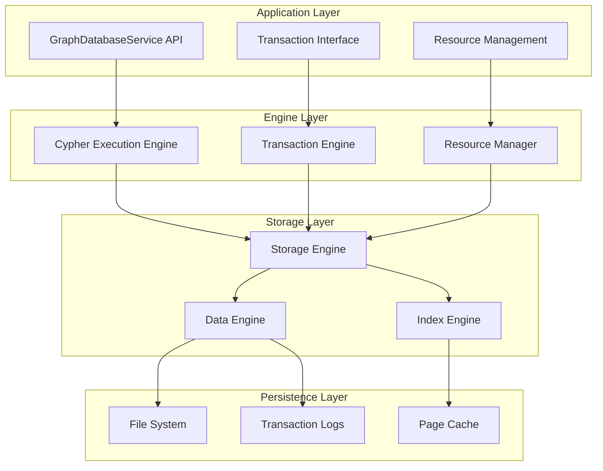
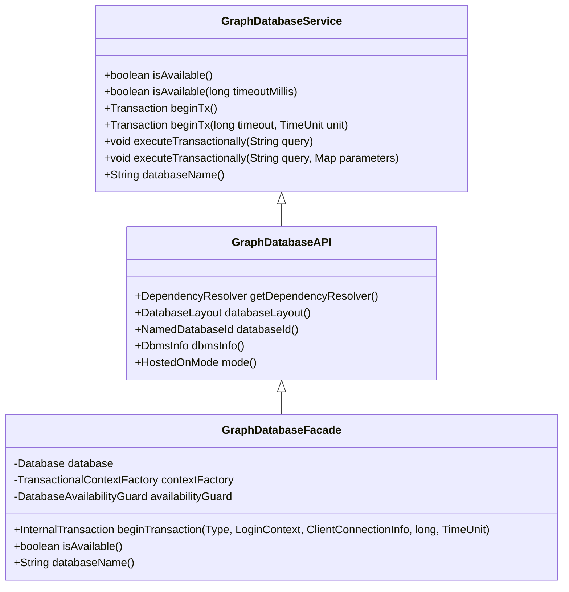
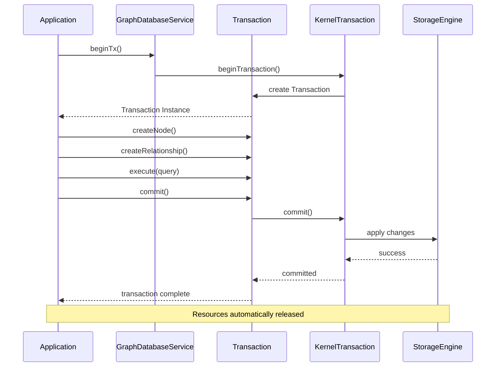
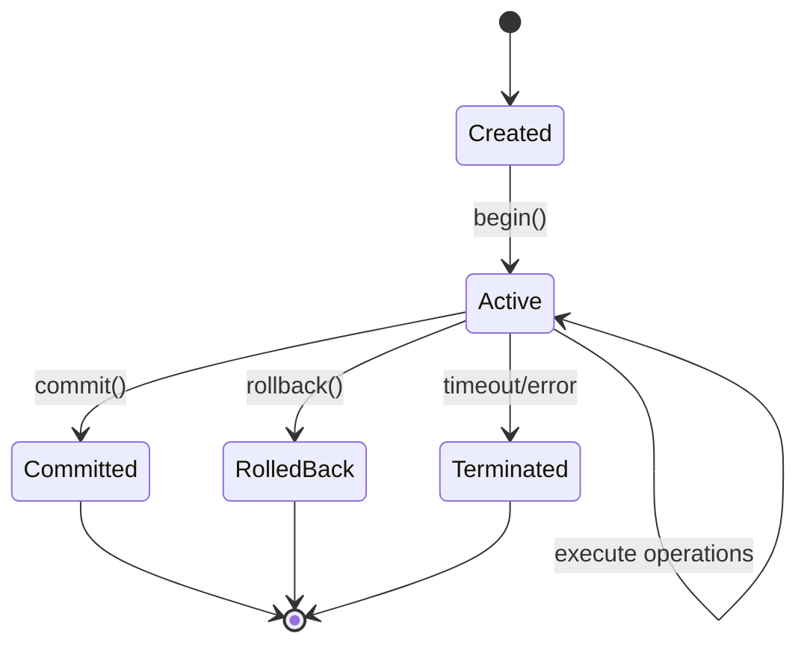
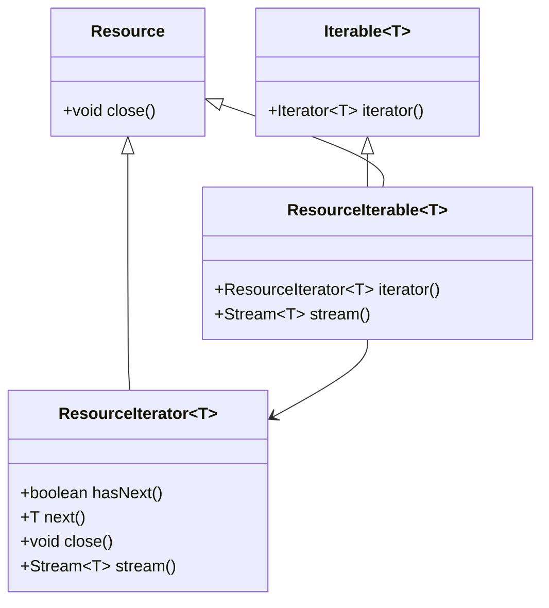
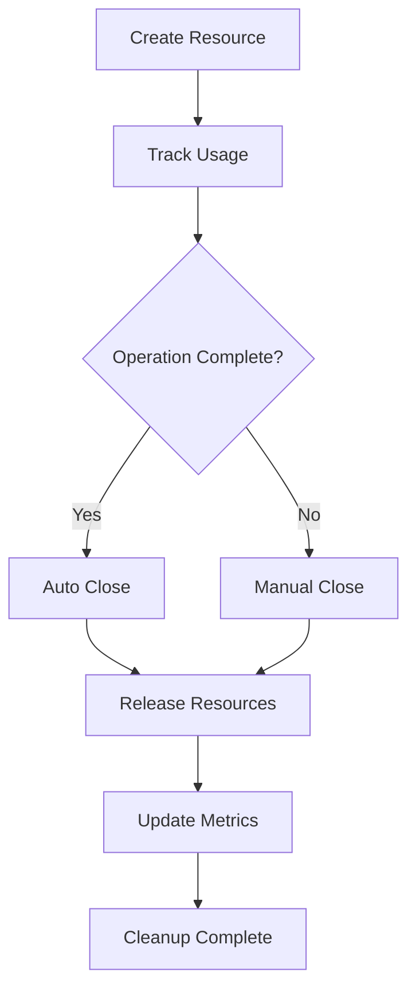
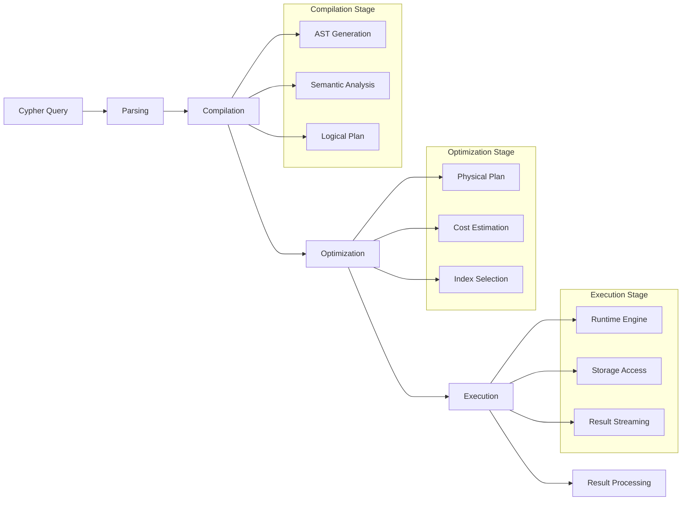
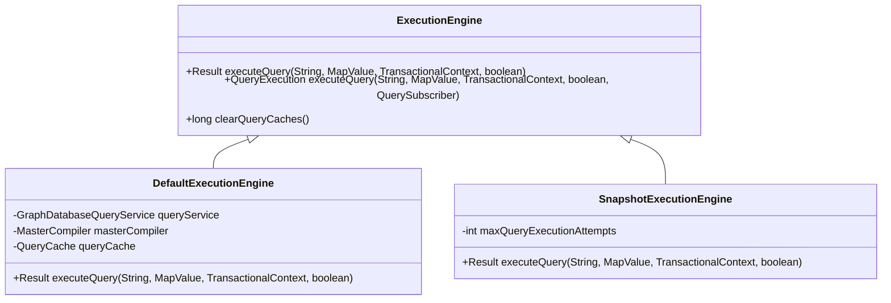
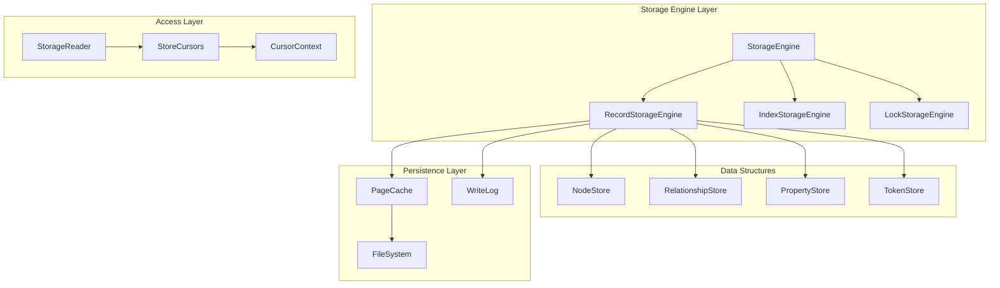
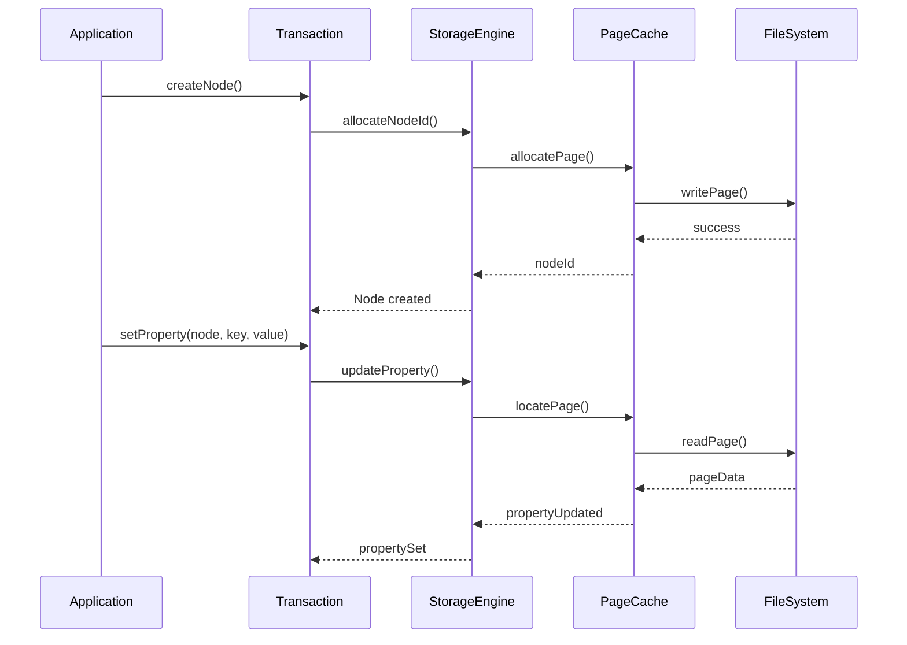

# Graph Database Engine

<cite>
**Referenced Files in This Document**
- [GraphDatabaseService.java](file://community/graphdb-api/src/main/java/org/neo4j/graphdb/GraphDatabaseService.java)
- [Transaction.java](file://community/graphdb-api/src/main/java/org/neo4j/graphdb/Transaction.java)
- [ResourceIterable.java](file://community/resource/src/main/java/org/neo4j/graphdb/ResourceIterable.java)
- [ResourceIterator.java](file://community/resource/src/main/java/org/neo4j/graphdb/ResourceIterator.java)
- [GraphDatabaseFacade.java](file://community/kernel/src/main/java/org/neo4j/kernel/impl/factory/GraphDatabaseFacade.java)
- [GraphDatabaseAPI.java](file://community/kernel/internal/GraphDatabaseAPI.java)
- [InternalTransaction.java](file://community/kernel-api/src/main/java/org/neo4j/kernel/impl/coreapi/InternalTransaction.java)
- [StorageEngine.java](file://community/kernel-api/src/main/java/org/neo4j/storageengine/api/StorageEngine.java)
- [ExecutionEngine.java](file://community/cypher/cypher/src/main/java/org/neo4j/cypher/internal/javacompat/ExecutionEngine.java)
- [GraphDatabaseTransactions.java](file://community/kernel/src/main/java/org/neo4j/kernel/impl/factory/GraphDatabaseTransactions.java)
- [KernelTransactionImplementation.java](file://community/kernel/src/main/java/org/neo4j/kernel/impl/api/KernelTransactionImplementation.java)
- [RecordStorageEngine.java](file://community/record-storage-engine/src/main/java/org/neo4j/internal/recordstorage/RecordStorageEngine.java)
</cite>

## Table of Contents
1. [Introduction](#introduction)
2. [Architecture Overview](#architecture-overview)
3. [Core Components](#core-components)
4. [GraphDatabaseService Interface](#graphdatabaseservice-interface)
5. [Transaction Management](#transaction-management)
6. [Resource Management](#resource-management)
7. [Query Execution Engine](#query-execution-engine)
8. [Storage Engine](#storage-engine)
9. [Practical Usage Examples](#practical-usage-examples)
10. [Best Practices](#best-practices)
11. [Troubleshooting Guide](#troubleshooting-guide)
12. [Conclusion](#conclusion)

## Introduction

Neo4j's Graph Database Engine serves as the core interface for interacting with the graph database, providing a comprehensive framework for managing nodes, relationships, and properties. At its heart lies the GraphDatabaseService interface, which acts as the primary gateway to the database, offering transactional capabilities, resource management, and query execution services.

The engine implements a layered architecture that separates concerns between the high-level API, transaction management, query processing, and storage persistence. This design enables efficient graph operations while maintaining data consistency and providing robust resource lifecycle management.

## Architecture Overview

The Neo4j Graph Database Engine follows a multi-layered architecture that ensures separation of concerns and modularity:



**Diagram sources**
- [GraphDatabaseService.java](file://community/graphdb-api/src/main/java/org/neo4j/graphdb/GraphDatabaseService.java#L31-L135)
- [ExecutionEngine.java](file://community/cypher/cypher/src/main/java/org/neo4j/cypher/internal/javacompat/ExecutionEngine.java#L33-L215)
- [StorageEngine.java](file://community/kernel-api/src/main/java/org/neo4j/storageengine/api/StorageEngine.java#L33-L157)

## Core Components

### GraphDatabaseService

The GraphDatabaseService interface serves as the primary entry point for database operations. It provides methods for database availability checks, transaction management, and query execution.



**Diagram sources**
- [GraphDatabaseService.java](file://community/graphdb-api/src/main/java/org/neo4j/graphdb/GraphDatabaseService.java#L31-L135)
- [GraphDatabaseFacade.java](file://community/kernel/src/main/java/org/neo4j/kernel/impl/factory/GraphDatabaseFacade.java#L54-L181)
- [GraphDatabaseAPI.java](file://community/kernel/internal/GraphDatabaseAPI.java#L40-L116)

**Section sources**
- [GraphDatabaseService.java](file://community/graphdb-api/src/main/java/org/neo4j/graphdb/GraphDatabaseService.java#L31-L135)
- [GraphDatabaseFacade.java](file://community/kernel/src/main/java/org/neo4j/kernel/impl/factory/GraphDatabaseFacade.java#L54-L181)

### Transaction Management

Transactions in Neo4j provide ACID guarantees and ensure data consistency. The transaction lifecycle involves creation, execution, and completion phases.



**Diagram sources**
- [Transaction.java](file://community/graphdb-api/src/main/java/org/neo4j/graphdb/Transaction.java#L77-L659)
- [KernelTransactionImplementation.java](file://community/kernel/src/main/java/org/neo4j/kernel/impl/api/KernelTransactionImplementation.java#L192-L1616)

**Section sources**
- [Transaction.java](file://community/graphdb-api/src/main/java/org/neo4j/graphdb/Transaction.java#L77-L659)
- [KernelTransactionImplementation.java](file://community/kernel/src/main/java/org/neo4j/kernel/impl/api/KernelTransactionImplementation.java#L192-L1616)

## GraphDatabaseService Interface

The GraphDatabaseService interface defines the contract for database operations and provides essential methods for database interaction.

### Key Methods

| Method | Purpose | Parameters | Return Type |
|--------|---------|------------|-------------|
| `isAvailable()` | Check database availability | None | `boolean` |
| `isAvailable(long timeoutMillis)` | Check availability with timeout | timeout in milliseconds | `boolean` |
| `beginTx()` | Start explicit transaction | None | `Transaction` |
| `beginTx(long timeout, TimeUnit unit)` | Start transaction with timeout | timeout and time unit | `Transaction` |
| `executeTransactionally(String query)` | Execute query in separate transaction | Cypher query string | `void` |
| `executeTransactionally(String query, Map<String, Object> parameters)` | Execute query with parameters | query and parameters | `void` |
| `databaseName()` | Get database name | None | `String` |

### Transaction Creation Patterns

The interface supports multiple transaction creation patterns:

```java
// Implicit transaction (auto-commit)
try (Transaction tx = graphDb.beginTx()) {
    Node node = tx.createNode();
    tx.commit();
}

// Explicit transaction with timeout
try (Transaction tx = graphDb.beginTx(30, TimeUnit.SECONDS)) {
    Node node = tx.createNode();
    tx.commit();
}

// Execute transactionally (single-use)
graphDb.executeTransactionally("CREATE (n:Person {name: $name})", 
    Map.of("name", "Alice"));
```

**Section sources**
- [GraphDatabaseService.java](file://community/graphdb-api/src/main/java/org/neo4j/graphdb/GraphDatabaseService.java#L31-L135)
- [GraphDatabaseTransactions.java](file://community/kernel/src/main/java/org/neo4j/kernel/impl/factory/GraphDatabaseTransactions.java#L47-L129)

## Transaction Management

Transactions in Neo4j are managed through a sophisticated system that handles lifecycle, concurrency, and resource allocation.

### Transaction Types

| Type | Description | Use Case |
|------|-------------|----------|
| `IMPLICIT` | Automatically commits after each operation | Single operations |
| `EXPLICIT` | Manual commit/rollback control | Multi-step operations |
| `READ_ONLY` | Read-only access | Queries that don't modify data |

### Transaction Lifecycle



### Resource Management in Transactions

Transactions automatically manage resources through the Resource interface, ensuring proper cleanup:

```java
// Automatic resource cleanup
try (Transaction tx = graphDb.beginTx()) {
    // Resources are automatically closed when transaction ends
    ResourceIterable<Node> nodes = tx.findNodes(Label.label("Person"));
    // No need to manually close nodes iterator
    tx.commit();
}
```

**Section sources**
- [Transaction.java](file://community/graphdb-api/src/main/java/org/neo4j/graphdb/Transaction.java#L77-L659)
- [InternalTransaction.java](file://community/kernel-api/src/main/java/org/neo4j/kernel/impl/coreapi/InternalTransaction.java#L35-L76)

## Resource Management

Neo4j implements a sophisticated resource management system to prevent memory leaks and ensure optimal performance.

### ResourceIterable and ResourceIterator

The ResourceIterable interface extends Iterable with resource management capabilities:



**Diagram sources**
- [ResourceIterable.java](file://community/resource/src/main/java/org/neo4j/graphdb/ResourceIterable.java#L77-L94)
- [ResourceIterator.java](file://community/resource/src/main/java/org/neo4j/graphdb/ResourceIterator.java#L41-L76)

### Resource Management Patterns

#### Try-with-resources Pattern
```java
try (Transaction tx = graphDb.beginTx()) {
    try (ResourceIterator<Node> nodes = tx.findNodes(Label.label("Person"))) {
        while (nodes.hasNext()) {
            Node node = nodes.next();
            // Process node
        }
        // nodes automatically closed
    }
    tx.commit();
}
```

#### Manual Resource Management
```java
Transaction tx = graphDb.beginTx();
try {
    ResourceIterator<Node> nodes = tx.findNodes(Label.label("Person"));
    try {
        while (nodes.hasNext()) {
            Node node = nodes.next();
            // Process node
        }
    } finally {
        nodes.close(); // Manual cleanup
    }
    tx.commit();
} finally {
    tx.close(); // Ensure transaction closure
}
```

### Resource Lifecycle Management

The system tracks resource usage and ensures proper cleanup:



**Section sources**
- [ResourceIterable.java](file://community/resource/src/main/java/org/neo4j/graphdb/ResourceIterable.java#L77-L94)
- [ResourceIterator.java](file://community/resource/src/main/java/org/neo4j/graphdb/ResourceIterator.java#L41-L76)

## Query Execution Engine

The Cypher Query Execution Engine processes graph queries efficiently through multiple stages of compilation and optimization.

### Execution Pipeline



### Query Execution Architecture

The execution engine consists of several key components:

| Component | Responsibility | Key Features |
|-----------|---------------|--------------|
| Parser | Parse Cypher syntax | AST generation, error detection |
| Compiler | Generate execution plans | Logical/physical plan conversion |
| Optimizer | Optimize query plans | Cost-based optimization |
| Runtime | Execute queries | Parallel execution, streaming |

### Execution Engine Implementation



**Diagram sources**
- [ExecutionEngine.java](file://community/cypher/cypher/src/main/java/org/neo4j/cypher/internal/javacompat/ExecutionEngine.java#L33-L215)

**Section sources**
- [ExecutionEngine.java](file://community/cypher/cypher/src/main/java/org/neo4j/cypher/internal/javacompat/ExecutionEngine.java#L33-L215)

## Storage Engine

The Storage Engine handles low-level data persistence and retrieval, providing the foundation for all database operations.

### Storage Engine Architecture



### Storage Engine Components

| Component | Purpose | Key Features |
|-----------|---------|--------------|
| RecordStorageEngine | Manage record storage | Node/relationship properties |
| IndexStorageEngine | Handle indexes | Full-text, range, uniqueness |
| LockStorageEngine | Manage locks | Concurrency control |
| PageCache | Cache management | Memory-mapped files |

### Storage Operations



**Section sources**
- [StorageEngine.java](file://community/kernel-api/src/main/java/org/neo4j/storageengine/api/StorageEngine.java#L33-L157)
- [RecordStorageEngine.java](file://community/record-storage-engine/src/main/java/org/neo4j/internal/recordstorage/RecordStorageEngine.java#L175-L205)

## Practical Usage Examples

### Creating Nodes and Relationships

```java
// Basic node creation
try (Transaction tx = graphDb.beginTx()) {
    Node personNode = tx.createNode(Label.label("Person"));
    personNode.setProperty("name", "Alice");
    personNode.setProperty("age", 30);
    tx.commit();
}

// Creating relationships
try (Transaction tx = graphDb.beginTx()) {
    Node alice = tx.findNode(Label.label("Person"), "name", "Alice");
    Node bob = tx.findNode(Label.label("Person"), "name", "Bob");
    
    Relationship friendship = alice.createRelationshipTo(bob, RelationshipType.withName("FRIENDS"));
    friendship.setProperty("since", 2020);
    tx.commit();
}
```

### Query Execution Examples

```java
// Simple Cypher query
try (Transaction tx = graphDb.beginTx()) {
    Result result = tx.execute(
        "MATCH (p:Person) WHERE p.age > $minAge RETURN p.name, p.age", 
        Map.of("minAge", 25)
    );
    
    while (result.hasNext()) {
        Map<String, Object> record = result.next();
        System.out.println(record.get("p.name") + " is " + record.get("p.age") + " years old");
    }
    tx.commit();
}

// Using ResourceIterable
try (Transaction tx = graphDb.beginTx()) {
    try (ResourceIterator<Node> people = tx.findNodes(Label.label("Person"))) {
        people.forEachRemaining(person -> {
            System.out.println(person.getProperty("name"));
        });
    }
    tx.commit();
}
```

### Advanced Transaction Patterns

```java
// Batch processing with resource management
try (Transaction tx = graphDb.beginTx()) {
    // Process large dataset efficiently
    try (ResourceIterator<Node> nodes = tx.findNodes(Label.label("LargeDataset"))) {
        nodes.stream()
            .limit(1000) // Process in batches
            .forEach(node -> {
                // Process each node
                processNode(node);
            });
    }
    tx.commit();
}

// Nested transactions with resource safety
try (Transaction tx = graphDb.beginTx()) {
    // Outer transaction operations
    
    // Execute query in separate transaction
    graphDb.executeTransactionally(
        "CREATE (n:Temporary {data: $data})",
        Map.of("data", "temporary_value")
    );
    
    // Continue with outer transaction
    tx.commit();
}
```

## Best Practices

### Resource Management Guidelines

1. **Always use try-with-resources** for transactions and iterators
2. **Close ResourceIterators explicitly** when not using try-with-resources
3. **Avoid holding references to resources** beyond transaction scope
4. **Use appropriate timeouts** for long-running operations

### Transaction Design Patterns

1. **Keep transactions short-lived** to minimize locking
2. **Group related operations** in single transactions
3. **Use executeTransactionally** for simple queries
4. **Implement proper error handling** with rollback support

### Performance Considerations

1. **Index appropriate properties** for frequent lookups
2. **Use parameterized queries** to leverage query caching
3. **Batch operations** when processing large datasets
4. **Monitor resource usage** and adjust memory settings

### Memory Management

```java
// Good practice: Automatic resource cleanup
try (Transaction tx = graphDb.beginTx()) {
    try (ResourceIterator<Node> nodes = tx.findNodes(Label.label("Person"))) {
        // Process nodes efficiently
        nodes.stream()
            .limit(1000) // Prevent memory overflow
            .forEach(node -> processNode(node));
    }
    tx.commit();
}

// Bad practice: Manual resource management
Transaction tx = graphDb.beginTx();
try {
    ResourceIterator<Node> nodes = tx.findNodes(Label.label("Person"));
    // Risk of forgetting to close nodes iterator
    while (nodes.hasNext()) {
        Node node = nodes.next();
        processNode(node);
    }
    // Missing nodes.close() - potential memory leak
    tx.commit();
} finally {
    tx.close(); // May not be enough
}
```

## Troubleshooting Guide

### Common Issues and Solutions

#### Transaction Timeout
**Problem**: Transactions hanging or timing out
**Solution**: Set appropriate timeouts and monitor long-running operations
```java
// Configure transaction timeout
try (Transaction tx = graphDb.beginTx(30, TimeUnit.SECONDS)) {
    // Long-running operation
    tx.commit();
}
```

#### Resource Leaks
**Problem**: Memory usage growing over time
**Solution**: Ensure proper resource cleanup
```java
// Always close ResourceIterators
try (Transaction tx = graphDb.beginTx()) {
    try (ResourceIterator<Node> nodes = tx.findNodes(Label.label("Person"))) {
        // Process nodes
    } // Automatically closed
    tx.commit();
}
```

#### Deadlocks
**Problem**: Transactions waiting indefinitely for locks
**Solution**: Design transaction patterns to avoid circular dependencies
```java
// Consistent ordering prevents deadlocks
try (Transaction tx = graphDb.beginTx()) {
    Node nodeA = tx.getNodeByElementId("nodeA-id");
    Node nodeB = tx.getNodeByElementId("nodeB-id");
    
    // Process in consistent order
    processNode(nodeA);
    processNode(nodeB);
    
    tx.commit();
}
```

### Monitoring and Diagnostics

| Metric | Description | Monitoring Approach |
|--------|-------------|-------------------|
| Transaction Count | Number of active transactions | KernelTransactionMonitor |
| Resource Usage | Memory and file descriptor usage | ResourceTracker |
| Query Performance | Execution time and throughput | QueryExecutionMonitor |
| Lock Contention | Wait times for locks | LockTracer |

## Conclusion

Neo4j's Graph Database Engine provides a robust, scalable foundation for graph database operations. The architecture balances simplicity with power, offering intuitive APIs while maintaining the performance and reliability required for production systems.

Key strengths of the engine include:

- **Intuitive API design** through the GraphDatabaseService interface
- **Automatic resource management** preventing memory leaks
- **Efficient query execution** through the Cypher engine
- **Robust transaction management** ensuring data consistency
- **Flexible storage architecture** supporting various data patterns

The engine's modular design enables easy extension and customization while maintaining backward compatibility. Whether building simple applications or complex graph analytics systems, the Graph Database Engine provides the tools and abstractions needed for success.

For developers working with Neo4j, understanding these core concepts and following established patterns ensures optimal performance, reliability, and maintainability of graph database applications.