# Storage Engine Architecture Documentation

<cite>
**Referenced Files in This Document**
- [RecordStorageEngine.java](file://community/record-storage-engine/src/main/java/org/neo4j/internal/recordstorage/RecordStorageEngine.java)
- [StorageEngine.java](file://community/kernel-api/src/main/java/org/neo4j/storageengine/api/StorageEngine.java)
- [NeoStores.java](file://community/record-storage-engine/src/main/java/org/neo4j/kernel/impl/store/NeoStores.java)
- [SchemaCache.java](file://community/storage-engine-util/src/main/java/org/neo4j/internal/schema/SchemaCache.java)
- [CountsStore.java](file://community/storage-engine-util/src/main/java/org/neo4j/internal/counts/CountsStore.java)
- [RecordStorageEngineFactory.java](file://community/record-storage-engine/src/main/java/org/neo4j/internal/recordstorage/RecordStorageEngineFactory.java)
- [TransactionApplicationMode.java](file://community/kernel-api/src/main/java/org/neo4j/storageengine/api/TransactionApplicationMode.java)
- [Recovery.java](file://community/kernel/src/main/java/org/neo4j/kernel/recovery/Recovery.java)
- [Command.java](file://community/record-storage-engine/src/main/java/org/neo4j/internal/recordstorage/Command.java)
</cite>

## Table of Contents
1. [Introduction](#introduction)
2. [Architecture Overview](#architecture-overview)
3. [Core Components](#core-components)
4. [System Context](#system-context)
5. [Data Flow Architecture](#data-flow-architecture)
6. [Transaction Management](#transaction-management)
7. [Recovery Mechanisms](#recovery-mechanisms)
8. [Infrastructure Requirements](#infrastructure-requirements)
9. [Cross-Cutting Concerns](#cross-cutting-concerns)
10. [Technology Stack](#technology-stack)
11. [Deployment Topology](#deployment-topology)
12. [Performance Considerations](#performance-considerations)
13. [Troubleshooting Guide](#troubleshooting-guide)
14. [Conclusion](#conclusion)

## Introduction

Neo4j's Storage Engine represents the foundational layer responsible for persistent data storage, transaction management, and recovery operations. The RecordStorageEngine serves as the primary implementation of the StorageEngine interface, providing robust data persistence capabilities with support for ACID transactions, concurrent access, and disaster recovery scenarios.

This documentation provides a comprehensive analysis of the storage engine's architecture, focusing on its role in data persistence, transaction lifecycle management, and recovery mechanisms. The storage engine operates as a critical component within Neo4j's layered architecture, interfacing with higher-level transaction management and lower-level I/O operations.

## Architecture Overview

The RecordStorageEngine implements a sophisticated multi-layered architecture designed for high performance, reliability, and scalability. The system follows a modular design pattern with clear separation of concerns between storage management, transaction processing, and recovery operations.

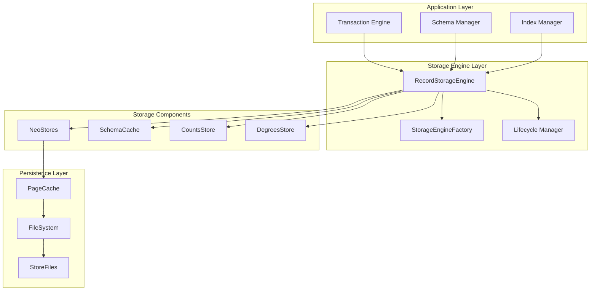
```mermaid
graph TB
subgraph "Application Layer"
TE[Transaction Engine]
SM[Schema Manager]
IM[Index Manager]
end
subgraph "Storage Engine Layer"
RSE[RecordStorageEngine]
SEF[StorageEngineFactory]
LE[Lifecycle Manager]
end
subgraph "Storage Components"
NS[NeoStores]
SC[SchemaCache]
CS[CountsStore]
DS[DegreesStore]
end
subgraph "Persistence Layer"
PS[PageCache]
FS[FileSystem]
SS[StoreFiles]
end
TE --> RSE
SM --> RSE
IM --> RSE
RSE --> SEF
RSE --> LE
RSE --> NS
RSE --> SC
RSE --> CS
RSE --> DS
NS --> PS
PS --> FS
FS --> SS
```

**Diagram sources**
- [RecordStorageEngine.java](file://community/record-storage-engine/src/main/java/org/neo4j/internal/recordstorage/RecordStorageEngine.java#L142-L200)
- [StorageEngine.java](file://community/kernel-api/src/main/java/org/neo4j/storageengine/api/StorageEngine.java#L52-L100)

The architecture demonstrates clear separation between the application-facing interface and the underlying storage implementation. The RecordStorageEngine acts as the central coordinator, managing interactions between various storage components while maintaining transactional consistency.

**Section sources**
- [RecordStorageEngine.java](file://community/record-storage-engine/src/main/java/org/neo4j/internal/recordstorage/RecordStorageEngine.java#L142-L200)
- [StorageEngine.java](file://community/kernel-api/src/main/java/org/neo4j/storageengine/api/StorageEngine.java#L52-L100)

## Core Components

### RecordStorageEngine Class

The RecordStorageEngine serves as the primary implementation of the StorageEngine interface, providing comprehensive data persistence capabilities. It manages multiple storage components and coordinates transaction processing across the system.

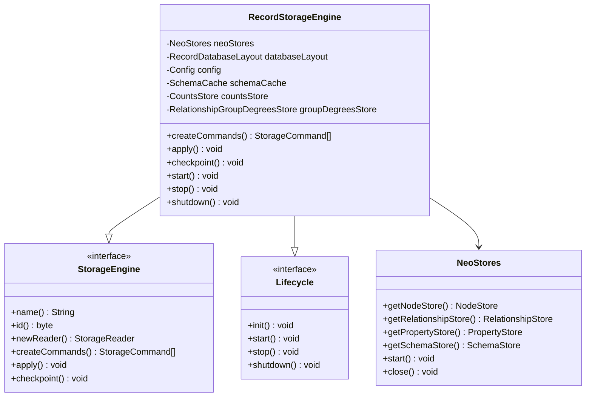
```mermaid
classDiagram
class RecordStorageEngine {
-NeoStores neoStores
-RecordDatabaseLayout databaseLayout
-Config config
-SchemaCache schemaCache
-CountsStore countsStore
-RelationshipGroupDegreesStore groupDegreesStore
+createCommands() StorageCommand[]
+apply() void
+checkpoint() void
+start() void
+stop() void
+shutdown() void
}
class StorageEngine {
<<interface>>
+name() String
+id() byte
+newReader() StorageReader
+createCommands() StorageCommand[]
+apply() void
+checkpoint() void
}
class Lifecycle {
<<interface>>
+init() void
+start() void
+stop() void
+shutdown() void
}
class NeoStores {
+getNodeStore() NodeStore
+getRelationshipStore() RelationshipStore
+getPropertyStore() PropertyStore
+getSchemaStore() SchemaStore
+start() void
+close() void
}
RecordStorageEngine --|> StorageEngine
RecordStorageEngine --|> Lifecycle
RecordStorageEngine --> NeoStores
```

**Diagram sources**
- [RecordStorageEngine.java](file://community/record-storage-engine/src/main/java/org/neo4j/internal/recordstorage/RecordStorageEngine.java#L142-L200)
- [StorageEngine.java](file://community/kernel-api/src/main/java/org/neo4j/storageengine/api/StorageEngine.java#L52-L100)

The RecordStorageEngine maintains several critical components:

- **NeoStores**: Central repository for all database stores (nodes, relationships, properties, schema)
- **SchemaCache**: In-memory cache for schema rules and constraints
- **CountsStore**: Maintains entity counts for efficient query optimization
- **DegreesStore**: Tracks relationship degrees for performance optimization

**Section sources**
- [RecordStorageEngine.java](file://community/record-storage-engine/src/main/java/org/neo4j/internal/recordstorage/RecordStorageEngine.java#L147-L180)

### StorageEngine Interface Implementation

The StorageEngine interface defines the contract for storage operations, providing methods for command creation, transaction application, and system lifecycle management.

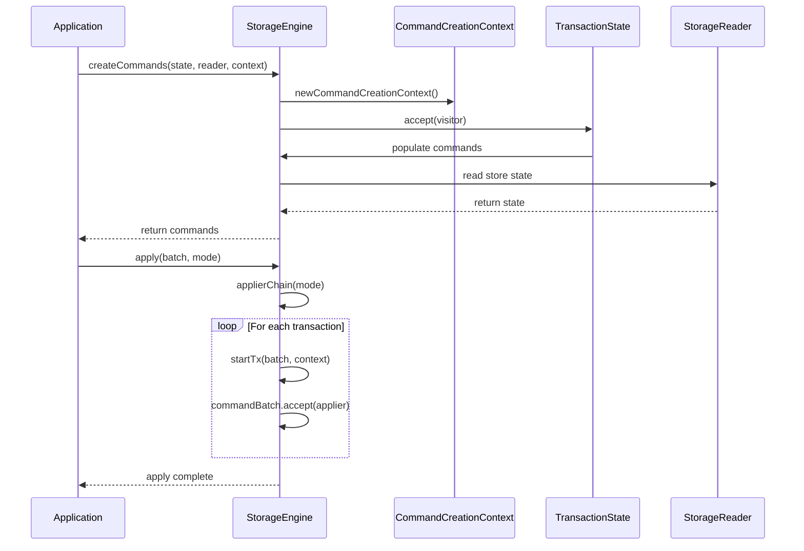
```mermaid
sequenceDiagram
participant App as Application
participant SE as StorageEngine
participant CRE as CommandCreationContext
participant TS as TransactionState
participant SR as StorageReader
App->>SE : createCommands(state, reader, context)
SE->>CRE : newCommandCreationContext()
SE->>TS : accept(visitor)
TS->>SE : populate commands
SE->>SR : read store state
SR-->>SE : return state
SE-->>App : return commands
App->>SE : apply(batch, mode)
SE->>SE : applierChain(mode)
loop For each transaction
SE->>SE : startTx(batch, context)
SE->>SE : commandBatch.accept(applier)
end
SE-->>App : apply complete
```

**Diagram sources**
- [StorageEngine.java](file://community/kernel-api/src/main/java/org/neo4j/storageengine/api/StorageEngine.java#L84-L140)
- [RecordStorageEngine.java](file://community/record-storage-engine/src/main/java/org/neo4j/internal/recordstorage/RecordStorageEngine.java#L461-L542)

**Section sources**
- [StorageEngine.java](file://community/kernel-api/src/main/java/org/neo4j/storageengine/api/StorageEngine.java#L84-L140)
- [RecordStorageEngine.java](file://community/record-storage-engine/src/main/java/org/neo4j/internal/recordstorage/RecordStorageEngine.java#L461-L542)

### Lifecycle Management

The storage engine implements comprehensive lifecycle management through the Lifecycle interface, ensuring proper initialization, startup, and shutdown sequences.

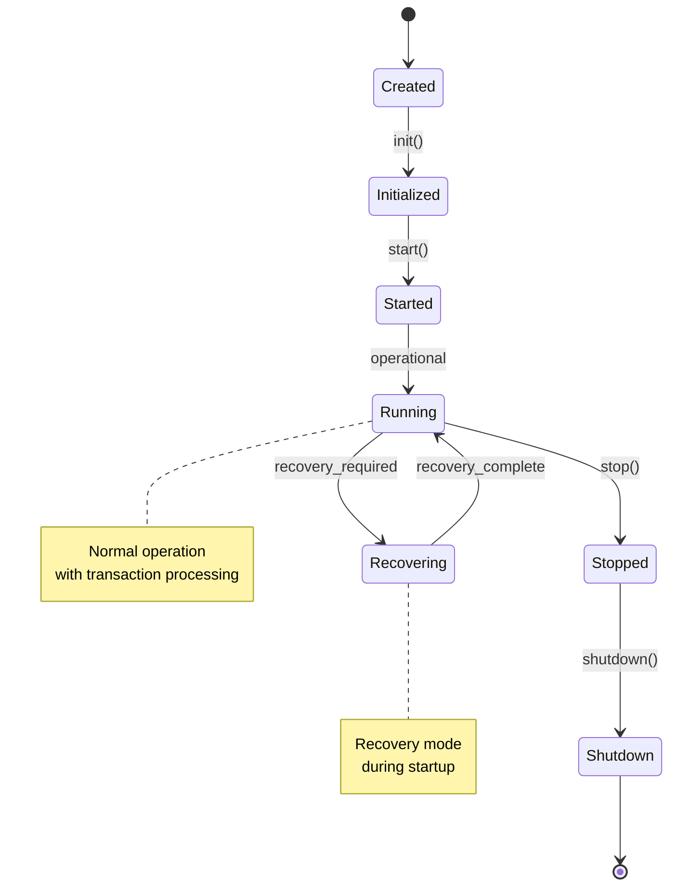
```mermaid
stateDiagram-v2
[*] --> Created
Created --> Initialized : init()
Initialized --> Started : start()
Started --> Running : operational
Running --> Stopped : stop()
Stopped --> Shutdown : shutdown()
Shutdown --> [*]
Running --> Recovering : recovery_required
Recovering --> Running : recovery_complete
note right of Running : Normal operation<br/>with transaction processing
note right of Recovering : Recovery mode<br/>during startup
```

**Diagram sources**
- [RecordStorageEngine.java](file://community/record-storage-engine/src/main/java/org/neo4j/internal/recordstorage/RecordStorageEngine.java#L632-L667)

**Section sources**
- [RecordStorageEngine.java](file://community/record-storage-engine/src/main/java/org/neo4j/internal/recordstorage/RecordStorageEngine.java#L632-L667)

## System Context

The RecordStorageEngine operates within a broader system architecture, interacting with various components to provide comprehensive data persistence services.

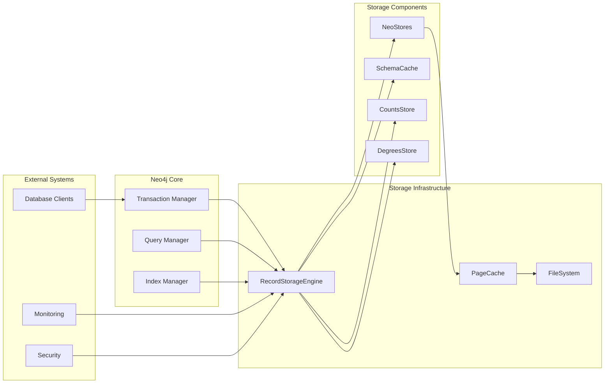
```mermaid
graph LR
subgraph "External Systems"
DB[Database Clients]
MON[Monitoring]
SEC[Security]
end
subgraph "Neo4j Core"
TM[Transaction Manager]
QM[Query Manager]
IM[Index Manager]
end
subgraph "Storage Infrastructure"
RSE[RecordStorageEngine]
PC[PageCache]
FS[FileSystem]
end
subgraph "Storage Components"
NS[NeoStores]
SC[SchemaCache]
CS[CountsStore]
DS[DegreesStore]
end
DB --> TM
TM --> RSE
QM --> RSE
IM --> RSE
RSE --> NS
RSE --> SC
RSE --> CS
RSE --> DS
NS --> PC
PC --> FS
MON --> RSE
SEC --> RSE
```

**Diagram sources**
- [RecordStorageEngine.java](file://community/record-storage-engine/src/main/java/org/neo4j/internal/recordstorage/RecordStorageEngine.java#L1-L50)

The system context reveals the storage engine's role as a central hub connecting external clients with internal storage components. It provides abstraction over low-level I/O operations while exposing a rich interface for transaction processing.

**Section sources**
- [RecordStorageEngine.java](file://community/record-storage-engine/src/main/java/org/neo4j/internal/recordstorage/RecordStorageEngine.java#L1-L50)

## Data Flow Architecture

The storage engine implements a sophisticated data flow architecture designed for high throughput and low latency transaction processing.

### Command Creation Flow

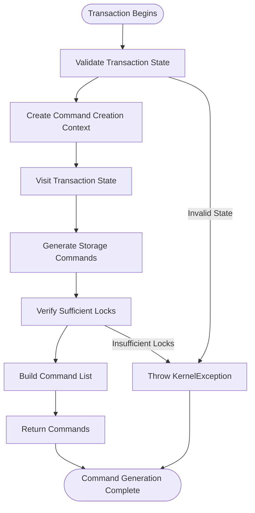
```mermaid
flowchart TD
Start([Transaction Begins]) --> ValidateState["Validate Transaction State"]
ValidateState --> CreateContext["Create Command Creation Context"]
CreateContext --> VisitState["Visit Transaction State"]
VisitState --> GenerateCommands["Generate Storage Commands"]
GenerateCommands --> VerifyLocks["Verify Sufficient Locks"]
VerifyLocks --> BuildCommands["Build Command List"]
BuildCommands --> ReturnCommands["Return Commands"]
ReturnCommands --> End([Command Generation Complete])
ValidateState --> |Invalid State| Error["Throw KernelException"]
VerifyLocks --> |Insufficient Locks| Error
Error --> End
```

**Diagram sources**
- [RecordStorageEngine.java](file://community/record-storage-engine/src/main/java/org/neo4j/internal/recordstorage/RecordStorageEngine.java#L461-L528)

### Transaction Application Flow

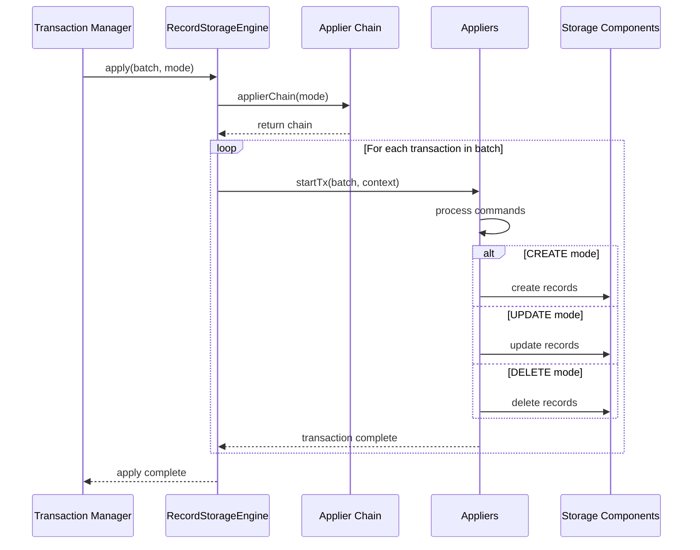
```mermaid
sequenceDiagram
participant TM as Transaction Manager
participant RSE as RecordStorageEngine
participant AC as Applier Chain
participant AS as Appliers
participant Stores as Storage Components
TM->>RSE : apply(batch, mode)
RSE->>AC : applierChain(mode)
AC-->>RSE : return chain
loop For each transaction in batch
RSE->>AS : startTx(batch, context)
AS->>AS : process commands
alt CREATE mode
AS->>Stores : create records
else UPDATE mode
AS->>Stores : update records
else DELETE mode
AS->>Stores : delete records
end
AS-->>RSE : transaction complete
end
RSE-->>TM : apply complete
```

**Diagram sources**
- [RecordStorageEngine.java](file://community/record-storage-engine/src/main/java/org/neo4j/internal/recordstorage/RecordStorageEngine.java#L544-L561)

**Section sources**
- [RecordStorageEngine.java](file://community/record-storage-engine/src/main/java/org/neo4j/internal/recordstorage/RecordStorageEngine.java#L461-L561)

## Transaction Management

The storage engine provides comprehensive transaction management capabilities, supporting ACID properties and concurrent access patterns.

### Transaction States and Modes

The system supports multiple transaction application modes to handle different operational scenarios:

| Mode | Purpose | Components Affected | ID Tracking |
|------|---------|-------------------|-------------|
| EXTERNAL | External transactions | All stores | Yes |
| INTERNAL | Internal operations | Neo stores only | No |
| RECOVERY | Forward recovery | All stores | Yes |
| REVERSE_RECOVERY | Reverse recovery | Neo stores only | No |
| MVCC_ROLLBACK | MVCC rollback | All stores | Yes |

### Command Processing Pipeline

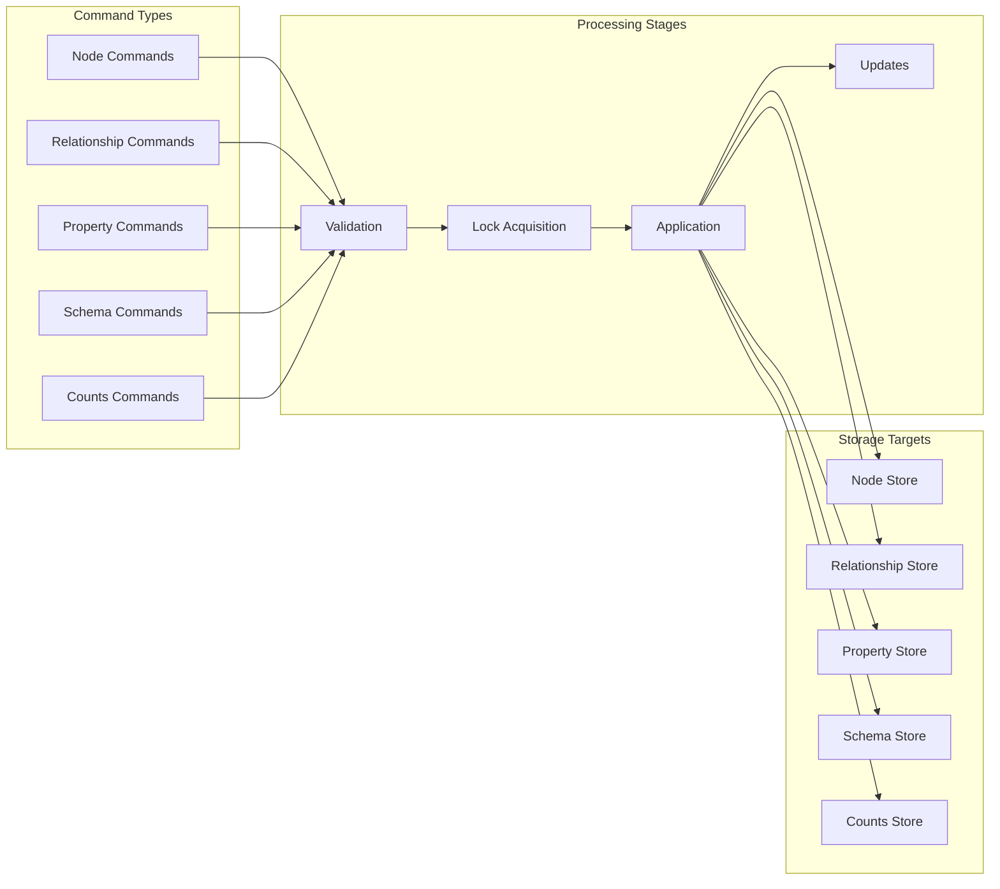
```mermaid
flowchart LR
subgraph "Command Types"
NC[Node Commands]
RC[Relationship Commands]
PC[Property Commands]
SC[Schema Commands]
CC[Counts Commands]
end
subgraph "Processing Stages"
V1[Validation]
L1[Lock Acquisition]
A1[Application]
U1[Updates]
end
subgraph "Storage Targets"
NS[Node Store]
RS[Relationship Store]
PS[Property Store]
SS[Schema Store]
CS[Counts Store]
end
NC --> V1
RC --> V1
PC --> V1
SC --> V1
CC --> V1
V1 --> L1
L1 --> A1
A1 --> U1
A1 --> NS
A1 --> RS
A1 --> PS
A1 --> SS
A1 --> CS
```

**Diagram sources**
- [TransactionApplicationMode.java](file://community/kernel-api/src/main/java/org/neo4j/storageengine/api/TransactionApplicationMode.java#L57-L87)

**Section sources**
- [TransactionApplicationMode.java](file://community/kernel-api/src/main/java/org/neo4j/storageengine/api/TransactionApplicationMode.java#L57-L87)

## Recovery Mechanisms

The storage engine implements robust recovery mechanisms to ensure data consistency after system failures or crashes.

### Recovery Phases

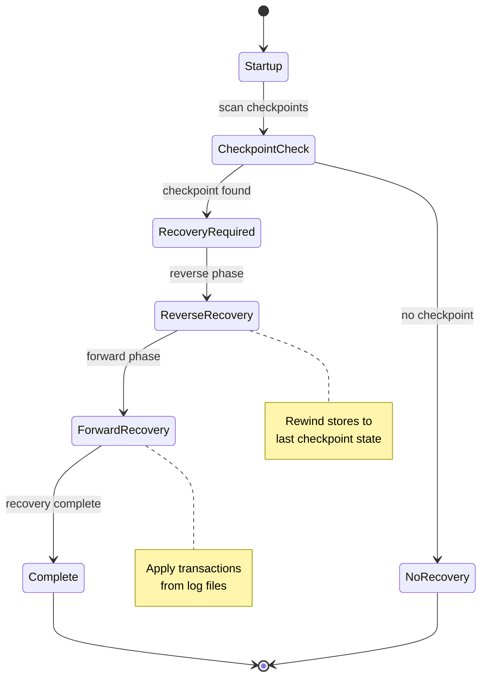
```mermaid
stateDiagram-v2
[*] --> Startup
Startup --> CheckpointCheck : scan checkpoints
CheckpointCheck --> RecoveryRequired : checkpoint found
CheckpointCheck --> NoRecovery : no checkpoint
RecoveryRequired --> ReverseRecovery : reverse phase
ReverseRecovery --> ForwardRecovery : forward phase
ForwardRecovery --> Complete : recovery complete
NoRecovery --> [*]
Complete --> [*]
note right of ReverseRecovery : Rewind stores to<br/>last checkpoint state
note right of ForwardRecovery : Apply transactions<br/>from log files
```

### Recovery Process Flow

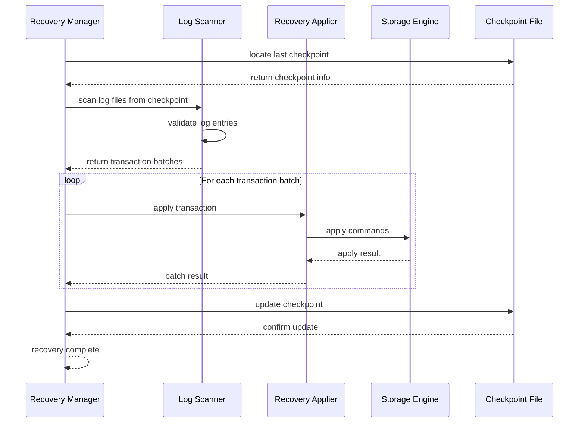
```mermaid
sequenceDiagram
participant RM as Recovery Manager
participant LS as Log Scanner
participant RA as Recovery Applier
participant SE as Storage Engine
participant CF as Checkpoint File
RM->>CF : locate last checkpoint
CF-->>RM : return checkpoint info
RM->>LS : scan log files from checkpoint
LS->>LS : validate log entries
LS-->>RM : return transaction batches
loop For each transaction batch
RM->>RA : apply transaction
RA->>SE : apply commands
SE-->>RA : apply result
RA-->>RM : batch result
end
RM->>CF : update checkpoint
CF-->>RM : confirm update
RM-->>RM : recovery complete
```

**Diagram sources**
- [Recovery.java](file://community/kernel/src/main/java/org/neo4j/kernel/recovery/Recovery.java#L731-L762)

**Section sources**
- [Recovery.java](file://community/kernel/src/main/java/org/neo4j/kernel/recovery/Recovery.java#L731-L762)

## Infrastructure Requirements

### Hardware Requirements

The storage engine requires specific hardware configurations to achieve optimal performance:

| Component | Minimum | Recommended | Enterprise |
|-----------|---------|-------------|------------|
| CPU Cores | 4 | 8+ | 16+ |
| RAM | 8 GB | 16 GB | 32 GB+ |
| Storage Type | HDD | SSD | NVMe |
| Network | Gigabit | 10GbE | 25GbE+ |

### Software Dependencies

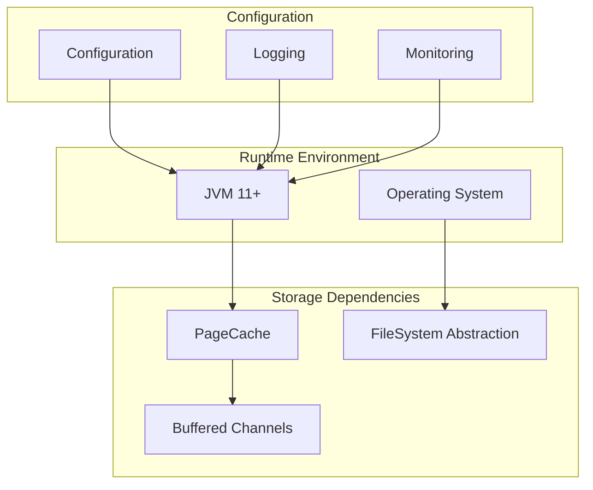
```mermaid
graph TD
subgraph "Runtime Environment"
JVM[JVM 11+]
OS[Operating System]
end
subgraph "Storage Dependencies"
PC[PageCache]
FS[FileSystem Abstraction]
BC[Buffered Channels]
end
subgraph "Configuration"
CFG[Configuration]
LOG[Logging]
MON[Monitoring]
end
JVM --> PC
OS --> FS
PC --> BC
CFG --> JVM
LOG --> JVM
MON --> JVM
```

**Section sources**
- [RecordStorageEngine.java](file://community/record-storage-engine/src/main/java/org/neo4j/internal/recordstorage/RecordStorageEngine.java#L185-L207)

## Cross-Cutting Concerns

### Security

The storage engine implements comprehensive security measures to protect data integrity and confidentiality:

- **Access Control**: Role-based access to storage components
- **Encryption**: Transparent encryption of stored data
- **Audit Logging**: Comprehensive audit trails for security events
- **Authentication**: Integration with Neo4j security subsystem

### Monitoring and Observability

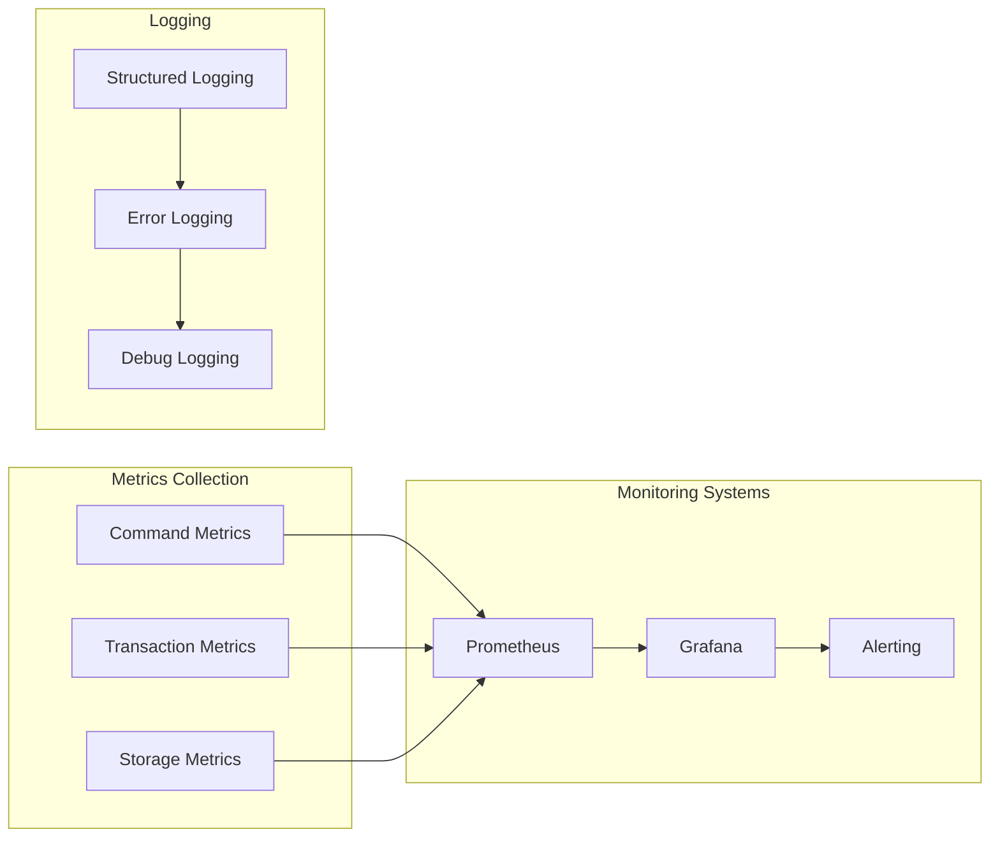
```mermaid
graph LR
subgraph "Metrics Collection"
CM[Command Metrics]
TM[Transaction Metrics]
SM[Storage Metrics]
end
subgraph "Monitoring Systems"
PM[Prometheus]
GM[Grafana]
AL[Alerting]
end
subgraph "Logging"
SL[Structured Logging]
EL[Error Logging]
DL[Debug Logging]
end
CM --> PM
TM --> PM
SM --> PM
PM --> GM
GM --> AL
SL --> EL
EL --> DL
```

### Disaster Recovery

The system provides multiple disaster recovery mechanisms:

- **Automatic Checkpointing**: Regular snapshots of storage state
- **Log Archiving**: Persistent transaction logs for recovery
- **Backup Integration**: Seamless integration with backup systems
- **Failover Support**: High availability configurations

**Section sources**
- [RecordStorageEngine.java](file://community/record-storage-engine/src/main/java/org/neo4j/internal/recordstorage/RecordStorageEngine.java#L670-L681)

## Technology Stack

### Core Technologies

The storage engine leverages several key technologies for optimal performance and reliability:

| Technology | Version | Purpose |
|------------|---------|---------|
| Java | 11+ | Runtime environment |
| PageCache | Custom | Memory-mapped file access |
| GBPTree | Custom | Index storage |
| LZ4 | 1.8+ | Compression |
| ZSTD | 1.4+ | Advanced compression |

### Dependencies

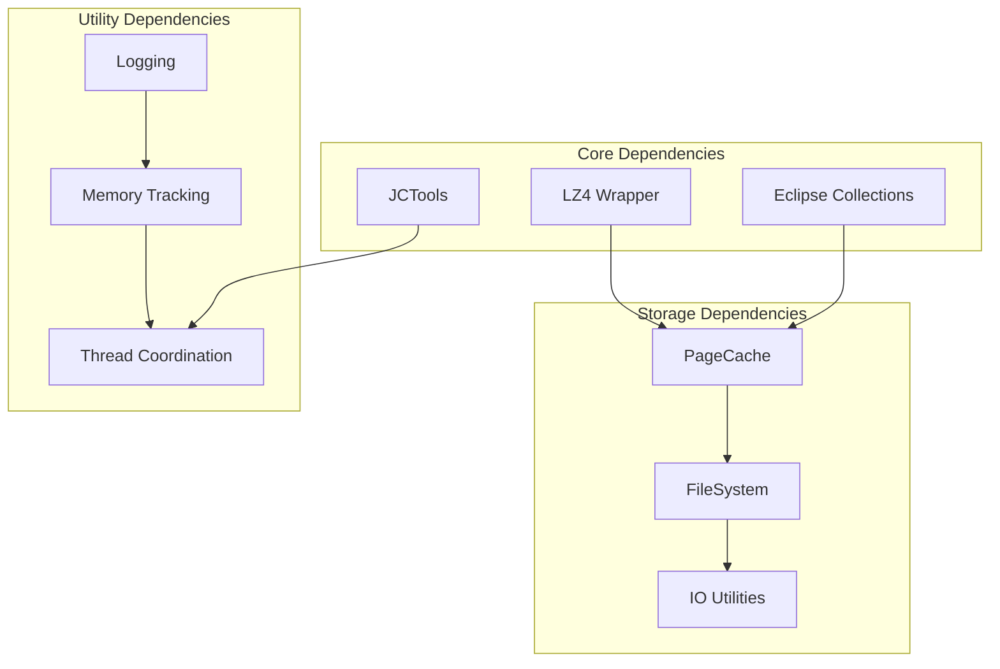
```mermaid
graph TD
subgraph "Core Dependencies"
EC[Eclipse Collections]
JC[JCTools]
LW[LZ4 Wrapper]
end
subgraph "Storage Dependencies"
PC[PageCache]
FS[FileSystem]
IO[IO Utilities]
end
subgraph "Utility Dependencies"
LC[Logging]
MC[Memory Tracking]
TC[Thread Coordination]
end
EC --> PC
JC --> TC
LW --> PC
PC --> FS
FS --> IO
LC --> MC
MC --> TC
```

**Section sources**
- [RecordStorageEngine.java](file://community/record-storage-engine/src/main/java/org/neo4j/internal/recordstorage/RecordStorageEngine.java#L1-L50)

## Deployment Topology

### Single Instance Deployment

For development and small-scale deployments, the storage engine can operate in a single-instance configuration:

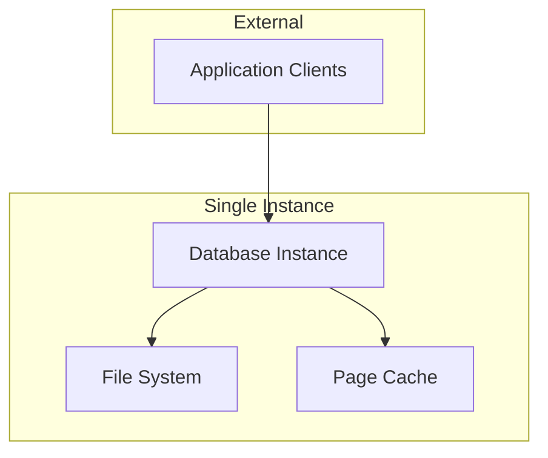
```mermaid
graph TB
subgraph "Single Instance"
DB[Database Instance]
FS[File System]
CACHE[Page Cache]
end
DB --> FS
DB --> CACHE
subgraph "External"
CLIENT[Application Clients]
end
CLIENT --> DB
```

### Distributed Deployment

For production environments, the storage engine supports distributed deployment patterns:

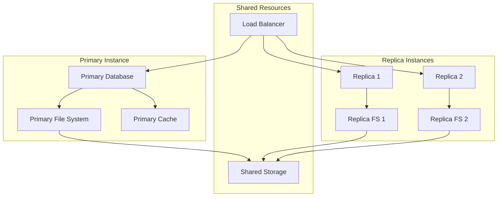
```mermaid
graph TB
subgraph "Primary Instance"
PDB[Primary Database]
PFS[Primary File System]
PCACHE[Primary Cache]
end
subgraph "Replica Instances"
RDB1[Replica 1]
RDB2[Replica 2]
RFS1[Replica FS 1]
RFS2[Replica FS 2]
end
subgraph "Shared Resources"
SHARED[Shared Storage]
LB[Load Balancer]
end
PDB --> PFS
PDB --> PCACHE
RDB1 --> RFS1
RDB2 --> RFS2
PFS --> SHARED
RFS1 --> SHARED
RFS2 --> SHARED
LB --> PDB
LB --> RDB1
LB --> RDB2
```

## Performance Considerations

### Throughput Optimization

The storage engine implements several optimization strategies:

- **Batch Processing**: Grouping related operations for efficiency
- **Parallel Execution**: Concurrent processing of independent operations
- **Memory Management**: Efficient memory allocation and reuse
- **I/O Optimization**: Optimized read/write patterns

### Latency Reduction

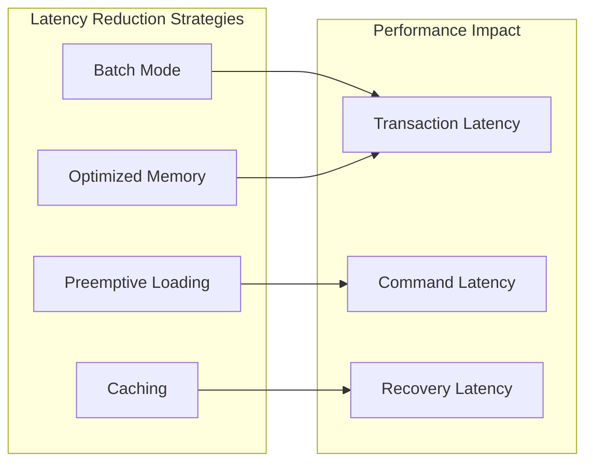
```mermaid
graph LR
subgraph "Latency Reduction Strategies"
BM[Batch Mode]
PM[Preemptive Loading]
CM[Caching]
OM[Optimized Memory]
end
subgraph "Performance Impact"
TL[Transaction Latency]
CL[Command Latency]
RL[Recovery Latency]
end
BM --> TL
PM --> CL
CM --> RL
OM --> TL
```

### Scalability Patterns

The storage engine supports multiple scalability patterns:

- **Horizontal Scaling**: Distributing load across multiple instances
- **Vertical Scaling**: Increasing resources on single instances
- **Sharding**: Partitioning data across multiple storage units
- **Caching**: Intelligent caching strategies for frequently accessed data

## Troubleshooting Guide

### Common Issues and Solutions

| Issue | Symptoms | Solution |
|-------|----------|----------|
| Slow Recovery | Extended startup time | Check log files, verify disk I/O |
| Memory Issues | OutOfMemoryError | Increase heap size, optimize cache |
| Disk Space | Disk full errors | Clean logs, increase storage |
| Corruption | Data inconsistencies | Run consistency checks, restore from backup |

### Diagnostic Tools

The storage engine provides comprehensive diagnostic capabilities:

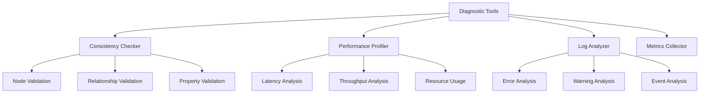
```mermaid
flowchart TD
DIAG[Diagnostic Tools] --> CONS[Consistency Checker]
DIAG --> PERF[Performance Profiler]
DIAG --> LOG[Log Analyzer]
DIAG --> MET[Metrics Collector]
CONS --> NODES[Node Validation]
CONS --> RELS[Relationship Validation]
CONS --> PROPS[Property Validation]
PERF --> LAT[Latency Analysis]
PERF --> THROUGHPUT[Throughput Analysis]
PERF --> RESOURCE[Resource Usage]
LOG --> ERRORS[Error Analysis]
LOG --> WARNINGS[Warning Analysis]
LOG --> EVENTS[Event Analysis]
```

**Section sources**
- [RecordStorageEngine.java](file://community/record-storage-engine/src/main/java/org/neo4j/internal/recordstorage/RecordStorageEngine.java#L684-L688)

## Conclusion

Neo4j's RecordStorageEngine represents a sophisticated and robust solution for graph data persistence. Its modular architecture, comprehensive transaction management, and advanced recovery mechanisms make it suitable for demanding enterprise applications.

The storage engine's design emphasizes performance, reliability, and scalability while maintaining simplicity in its interface. Its integration with Neo4j's broader ecosystem ensures seamless operation across various deployment scenarios.

Key strengths of the architecture include:

- **Modular Design**: Clear separation of concerns enables maintainability and extensibility
- **Transaction Safety**: Comprehensive ACID compliance with advanced concurrency control
- **Recovery Resilience**: Robust recovery mechanisms ensure data consistency
- **Performance Optimization**: Multiple optimization strategies for various workload patterns
- **Cross-Cutting Concerns**: Integrated security, monitoring, and disaster recovery

The storage engine continues to evolve with Neo4j's development, incorporating new technologies and optimization strategies to meet the growing demands of modern graph database applications.