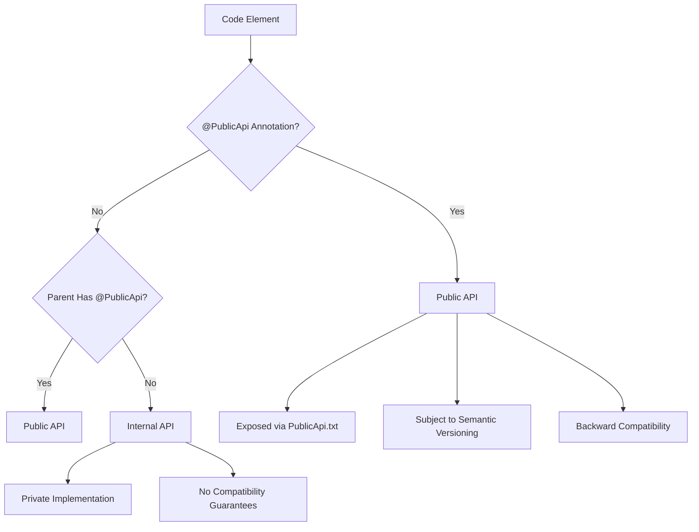
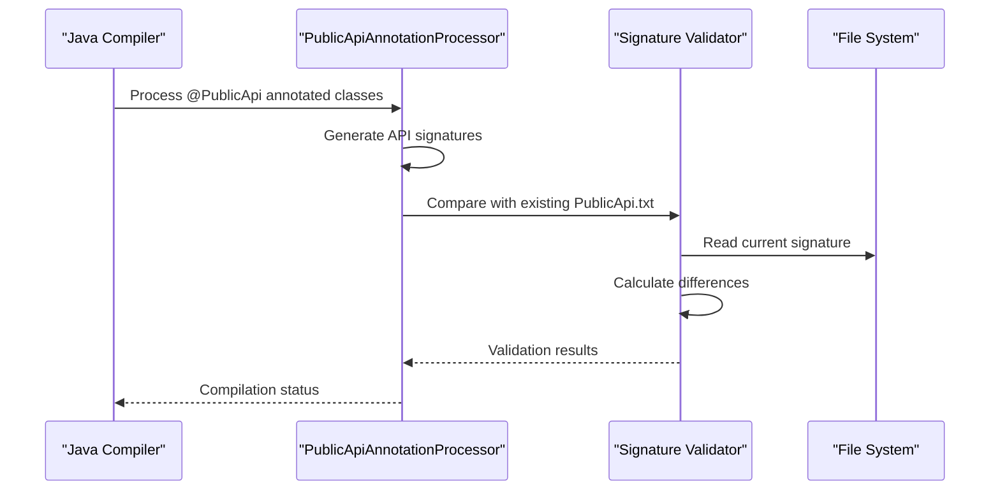
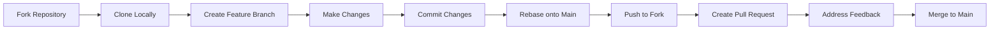
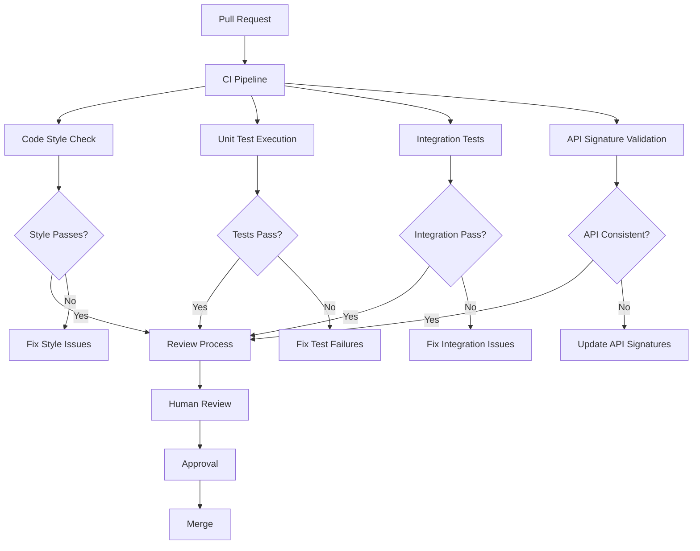

# Contributing to the Neo4j Codebase

<cite>
**Referenced Files in This Document**
- [CONTRIBUTING.md](file://CONTRIBUTING.md)
- [PublicApi.txt](file://community/common/PublicApi.txt)
- [PublicApi.txt](file://community/graphdb-api/PublicApi.txt)
- [PublicApi.java](file://annotations/src/main/java/org/neo4j/annotations/api/PublicApi.java)
- [PublicApiAnnotationProcessor.java](file://annotations/src/main/java/org/neo4j/annotations/api/PublicApiAnnotationProcessor.java)
- [PublicApiDoclet.java](file://annotations/src/main/java/org/neo4j/annotations/api/PublicApiDoclet.java)
- [Procedure.java](file://community/procedure-api/src/main/java/org/neo4j/procedure/Procedure.java)
- [Name.java](file://community/procedure-api/src/main/java/org/neo4j/procedure/Name.java)
- [ServiceAnnotationProcessor.java](file://annotations/src/main/java/org/neo4j/annotations/service/ServiceAnnotationProcessor.java)
- [JUnitUsageGuardExtension.java](file://community\testing\test-utils\src\main\java\org\neo4j\test\extension\guard\JUnitUsageGuardExtension.java)
- [DependenciesCollector.java](file://community\testing\test-utils\src\main\java\org\neo4j\test\extension\guard\DependenciesCollector.java)
</cite>

## Table of Contents
1. [Introduction](#introduction)
2. [Getting Started with Contributions](#getting-started-with-contributions)
3. [Understanding Public vs Internal APIs](#understanding-public-vs-internal-apis)
4. [Contribution Workflow](#contribution-workflow)
5. [Code Review Process](#code-review-process)
6. [Coding Standards and Best Practices](#coding-standards-and-best-practices)
7. [Testing Requirements](#testing-requirements)
8. [Documentation Standards](#documentation-standards)
9. [Common Contribution Issues](#common-contribution-issues)
10. [License Compliance](#license-compliance)
11. [Breaking Changes and Backward Compatibility](#breaking-changes-and-backward-compatibility)
12. [Troubleshooting Guide](#troubleshooting-guide)

## Introduction

Neo4j is an open-source graph database that welcomes contributions from the community. This comprehensive guide covers everything you need to know about contributing to the Neo4j codebase, from understanding the project structure to submitting your first pull request.

The Neo4j project maintains strict standards for code quality, API stability, and documentation. Understanding these standards is crucial for successful contributions and avoiding common pitfalls during the development process.

## Getting Started with Contributions

### Community Channels and Support

Before starting your contribution journey, familiarize yourself with the various communication channels available:

- **GitHub Issues**: Use for bug reports, feature requests, and technical discussions
- **Mailing List**: [neo4j@googlegroups.com](https://groups.google.com/forum/#!forum/neo4j) for general questions
- **Slack Channel**: Real-time collaboration and quick questions
- **Stack Overflow**: Tag questions with `neo4j` for community support

### Issue Reporting Guidelines

When reporting issues or requesting features, provide comprehensive information:

- **Product Versions**: Specify which Neo4j versions you're using
- **Development Environment**: Include language versions and operating systems
- **System Configuration**: Cluster vs single-machine setups
- **Reproduction Steps**: Clear steps to reproduce the issue
- **Error Details**: Complete error messages and stack traces
- **Previous Attempts**: What solutions you've already tried

**Section sources**
- [CONTRIBUTING.md](file://CONTRIBUTING.md#L13-L48)

## Understanding Public vs Internal APIs

### Public API Designation System

Neo4j employs a sophisticated API designation system using the `@PublicApi` annotation to clearly distinguish between public and internal APIs. This system ensures semantic versioning compatibility and protects users from unexpected breaking changes.



**Diagram sources**
- [PublicApi.java](file://annotations/src/main/java/org/neo4j/annotations/api/PublicApi.java#L27-L36)
- [PublicApiAnnotationProcessor.java](file://annotations/src/main/java/org/neo4j/annotations/api/PublicApiAnnotationProcessor.java#L231-L240)

### Public API Signature Generation

The `PublicApiAnnotationProcessor` automatically generates and validates Public API signatures, ensuring consistency across the codebase:



**Diagram sources**
- [PublicApiAnnotationProcessor.java](file://annotations/src/main/java/org/neo4j/annotations/api/PublicApiAnnotationProcessor.java#L131-L146)

### Example Public API Signatures

Public API signatures follow a specific format that captures the complete public interface:

| Element Type | Signature Format | Example |
|--------------|------------------|---------|
| Classes | `qualified.class.name class` | `org.neo4j.graphdb.GraphDatabaseService interface` |
| Methods | `ContainingClass::methodName(paramTypes) returnType` | `GraphDatabaseService::executeTransactionally(java.lang.String) void` |
| Fields | `ContainingClass::fieldName fieldType` | `Direction::BOTH org.neo4j.graphdb.Direction` |
| Interfaces | `qualified.interface.name implements ParentInterface` | `DatabaseManagementService extends java.lang.AutoCloseable` |

**Section sources**
- [PublicApi.txt](file://community/common/PublicApi.txt#L1-L249)
- [PublicApi.txt](file://community/graphdb-api/PublicApi.txt#L1-L745)

## Contribution Workflow

### Prerequisites and Setup

Before starting your contribution, ensure you have:

1. **Personal Fork**: Create a fork of the main Neo4j repository
2. **Development Environment**: Set up Java development environment
3. **Build Tools**: Install Maven for building and testing
4. **IDE Configuration**: Configure your IDE for Neo4j development

### Branch Naming Conventions

Use descriptive branch names that clearly indicate the purpose:

- `feature/add-new-procedure`
- `bugfix/fix-tx-commit-issue`
- `docs/update-api-documentation`
- `refactor/optimize-query-execution`

### Git Workflow

Follow the recommended Git workflow for clean, maintainable contributions:



**Diagram sources**
- [CONTRIBUTING.md](file://CONTRIBUTING.md#L42-L47)

### Commit Message Standards

Write clear, descriptive commit messages following conventional patterns:

- **Format**: `type(scope): description`
- **Types**: `feat`, `fix`, `docs`, `style`, `refactor`, `test`, `chore`
- **Examples**:
  - `feat(procedure): add new graph algorithm procedure`
  - `fix(query): resolve NPE in query execution`
  - `docs(api): update procedure documentation`

**Section sources**
- [CONTRIBUTING.md](file://CONTRIBUTING.md#L42-L47)

## Code Review Process

### Automated Checks

The Neo4j codebase includes extensive automated checks to ensure code quality and consistency:



**Diagram sources**
- [JUnitUsageGuardExtension.java](file://community\testing\test-utils\src\main\java\org\neo4j\test\extension\guard\JUnitUsageGuardExtension.java#L36-L94)
- [DependenciesCollector.java](file://community\testing\test-utils\src\main\java\org\neo4j\test\extension\guard\DependenciesCollector.java#L36-L102)

### Review Criteria

Code reviews focus on several key areas:

1. **Functionality**: Does the code work as intended?
2. **API Design**: Is the public API well-designed and consistent?
3. **Performance**: Are there potential performance issues?
4. **Security**: Are there security vulnerabilities?
5. **Documentation**: Is the code properly documented?
6. **Testing**: Are adequate tests provided?

## Coding Standards and Best Practices

### Java Coding Standards

Neo4j follows strict Java coding standards:

#### Class Design Principles
- Use meaningful class names that clearly indicate purpose
- Implement proper encapsulation with private fields and public getters/setters
- Follow the Single Responsibility Principle
- Use interfaces for abstraction and polymorphism

#### Error Handling Patterns
- Use specific exception types rather than generic `Exception`
- Provide meaningful error messages with context
- Implement proper resource cleanup using try-with-resources
- Document expected exceptions in Javadoc

#### Code Organization
- Group related methods and fields logically
- Use consistent indentation (4 spaces)
- Place imports in alphabetical order
- Separate concerns into separate classes or packages

### Annotation Usage

#### Public API Annotations
Use the `@PublicApi` annotation for all public classes, interfaces, and methods:

```java
@PublicApi
public interface GraphDatabaseService {
    // Public API methods
}
```

#### Procedure Annotations
For Neo4j procedures, use the appropriate annotations:

```java
@Procedure(name = "myprocedures.example", mode = Mode.READ)
@Description("Example procedure description")
public Stream<ResultRecord> exampleProcedure(
    @Name("input") String input,
    @Context Log log) {
    // Procedure implementation
}
```

**Section sources**
- [Procedure.java](file://community/procedure-api/src/main/java/org/neo4j/procedure/Procedure.java#L108-L110)
- [Name.java](file://community/procedure-api/src/main/java/org/neo4j/procedure/Name.java#L33-L35)

## Testing Requirements

### Unit Testing Standards

All contributions must include comprehensive unit tests:

#### Test Structure
- Use JUnit 5 for all tests
- Follow AAA (Arrange, Act, Assert) pattern
- Use descriptive test method names
- Test edge cases and error conditions

#### Mocking and Dependencies
- Use Mockito for mocking dependencies
- Test with real implementations when possible
- Avoid testing implementation details

### Integration Testing

For changes affecting core functionality:

- Test with multiple Neo4j versions
- Test with different configurations
- Verify database state consistency
- Test transaction boundaries

### Test Coverage Requirements

Maintain or improve test coverage:

- **Minimum**: 80% line coverage
- **Critical Areas**: 95% coverage for core functionality
- **New Features**: 100% coverage required

**Section sources**
- [JUnitUsageGuardExtension.java](file://community\testing\test-utils\src\main\java\org\neo4j\test\extension\guard\JUnitUsageGuardExtension.java#L41-L94)

## Documentation Standards

### API Documentation

All public APIs must include comprehensive Javadoc:

#### Required Elements
- **Purpose**: Clear description of functionality
- **Parameters**: Detailed parameter descriptions with types
- **Returns**: Description of return values
- **Throws**: List of possible exceptions
- **Examples**: Code examples when helpful

#### Documentation Format
```java
/**
 * Performs a specific operation on the graph database.
 * 
 * @param input the input parameter description
 * @return a stream of result records
 * @throws IllegalArgumentException if input is invalid
 * @since 5.0
 */
```

### Code Comments

Use comments judiciously:

- **Why**: Explain the reasoning behind complex logic
- **What**: Briefly describe simple operations
- **Avoid**: Redundant comments that repeat code

### Markdown Documentation

For documentation files:

- Use consistent heading structure
- Include code examples
- Reference related documentation
- Keep examples up-to-date

## Common Contribution Issues

### Failing CI Builds

Common causes and solutions:

#### Compilation Errors
- **Cause**: Syntax errors or missing dependencies
- **Solution**: Run `mvn compile` locally before pushing
- **Prevention**: Use IDE auto-formatting and linting

#### Test Failures
- **Cause**: New code introduces bugs or edge cases
- **Solution**: Debug failing tests locally
- **Prevention**: Write comprehensive tests before implementation

#### API Signature Mismatches
- **Cause**: Public API changes not reflected in PublicApi.txt
- **Solution**: Run `mvn generate-sources` to regenerate signatures
- **Prevention**: Understand the Public API annotation system

### License Compliance Issues

#### Copyright Headers
Ensure all files include proper copyright headers:

```java
/*
 * Copyright (c) "Neo4j"
 * Neo4j Sweden AB [https://neo4j.com]
 *
 * This file is part of Neo4j.
 *
 * Neo4j is free software: you can redistribute it and/or modify
 * it under the terms of the GNU General Public License as published by
 * the Free Software Foundation, either version 3 of the License, or
 * (at your option) any later version.
 *
 * This program is distributed in the hope that it will be useful,
 * but WITHOUT ANY WARRANTY; without even the implied warranty of
 * MERCHANTABILITY or FITNESS FOR A PARTICULAR PURPOSE.  See the
 * GNU General Public License for more details.
 *
 * You should have received a copy of the GNU General Public License
 * along with this program.  If not, see <https://www.gnu.org/licenses/>.
 */
```

#### Third-Party Licenses
- **Check**: Verify licenses for all dependencies
- **Document**: Update LICENSES.txt when adding dependencies
- **Comply**: Follow license requirements for all included code

### Build System Issues

#### Maven Configuration
- **Version**: Use the specified Maven version
- **Profiles**: Enable required profiles for your changes
- **Dependencies**: Resolve dependency conflicts

#### Module Dependencies
- **Circular**: Avoid circular dependencies between modules
- **Visibility**: Ensure proper module visibility
- **Exports**: Declare required exports for public APIs

## License Compliance

### Contributor License Agreement (CLA)

Before accepting contributions, Neo4j requires signing the CLA:

- **Purpose**: Protects both contributors and Neo4j
- **Process**: Link provided in the contribution guidelines
- **Scope**: Applies to all contributions

### License Headers

All source files must include the Apache License header:

```java
/*
 * Copyright (c) "Neo4j"
 * Neo4j Sweden AB [https://neo4j.com]
 *
 * This file is part of Neo4j.
 *
 * Neo4j is free software: you can redistribute it and/or modify
 * it under the terms of the GNU General Public License as published by
 * the Free Software Foundation, either version 3 of the License, or
 * (at your option) any later version.
 *
 * This program is distributed in the hope that it will be useful,
 * but WITHOUT ANY WARRANTY; without even the implied warranty of
 * MERCHANTABILITY or FITNESS FOR A PARTICULAR PURPOSE.  See the
 * GNU General Public License for more details.
 *
 * You should have received a copy of the GNU General Public License
 * along with this program.  If not, see <https://www.gnu.org/licenses/>.
 */
```

### Third-Party Components

When incorporating third-party code:

1. **Verify Compatibility**: Ensure license compatibility
2. **Attribute Properly**: Include original copyright notices
3. **Document**: Update LICENSES.txt with new dependencies
4. **Test**: Verify functionality works correctly

## Breaking Changes and Backward Compatibility

### Semantic Versioning

Neo4j follows semantic versioning (SemVer):

- **Major**: Breaking changes
- **Minor**: New features, backward compatible
- **Patch**: Bug fixes, backward compatible

### Identifying Breaking Changes

#### Public API Changes
- Adding/removing public methods
- Changing method signatures
- Modifying return types
- Changing parameter types

#### Behavioral Changes
- Altered error handling
- Changed performance characteristics
- Modified concurrency behavior

### Deprecation Patterns

Use proper deprecation patterns for gradual removal:

```java
/**
 * @deprecated Use {@link #newMethod()} instead.
 */
@Deprecated
public void oldMethod() {
    // Deprecated implementation
}

/**
 * @deprecated Use {@link #newMethod()} instead.
 * @param replacement the replacement method
 */
@Deprecated(since = "5.0", forRemoval = true)
public void oldMethod() {
    // Deprecated implementation
}
```

### Migration Strategies

For major changes, provide migration guides:

1. **Documentation**: Clear migration instructions
2. **Tooling**: Migration scripts or tools
3. **Compatibility**: Temporary compatibility layers
4. **Timeline**: Clear deprecation timeline

**Section sources**
- [ProtocolVersion.java](file://community\bolt\src\main\java\org\neo4j\bolt\negotiation\ProtocolVersion.java#L87-L106)

## Troubleshooting Guide

### Common Build Issues

#### Dependency Resolution Problems
- **Symptom**: ClassNotFoundException or NoClassDefFoundError
- **Solution**: Clean Maven cache (`mvn dependency:purge-local-repository`)
- **Prevention**: Use consistent Maven versions

#### Memory Issues
- **Symptom**: OutOfMemoryError during compilation
- **Solution**: Increase heap size (`-Xmx2G` JVM option)
- **Prevention**: Monitor memory usage during development

#### Encoding Problems
- **Symptom**: Character encoding errors
- **Solution**: Ensure UTF-8 encoding in Maven configuration
- **Prevention**: Configure IDE encoding settings

### Testing Issues

#### Test Isolation Problems
- **Symptom**: Tests pass individually but fail together
- **Solution**: Use proper test isolation techniques
- **Prevention**: Avoid shared state between tests

#### Timing Issues
- **Symptom**: Intermittent test failures
- **Solution**: Use proper synchronization mechanisms
- **Prevention**: Avoid hard-coded delays

### API Design Issues

#### Public API Violations
- **Symptom**: Public API signature mismatches
- **Solution**: Add `@PublicApi` annotation to public elements
- **Prevention**: Regular API signature validation

#### Internal API Exposure
- **Symptom**: Internal classes exposed in PublicApi.txt
- **Solution**: Remove unnecessary public modifiers
- **Prevention**: Code review of public API changes

### Performance Issues

#### Memory Leaks
- **Detection**: Use profilers to identify leaks
- **Resolution**: Proper resource cleanup
- **Prevention**: Follow resource management best practices

#### Slow Operations
- **Identification**: Profile slow operations
- **Optimization**: Optimize algorithms and data structures
- **Monitoring**: Implement performance monitoring

**Section sources**
- [DependenciesCollector.java](file://community\testing\test-utils\src\main\java\org\neo4j\test\extension\guard\DependenciesCollector.java#L36-L102)

## Conclusion

Contributing to the Neo4j codebase requires understanding of the project's architecture, coding standards, and community practices. By following this guide, you'll be well-prepared to make valuable contributions that enhance the Neo4j ecosystem.

Remember that successful contributions go beyond just writing code - they include thorough testing, comprehensive documentation, and careful consideration of backward compatibility. The Neo4j team appreciates all contributions, whether they're bug fixes, new features, or improvements to existing functionality.

For additional support and guidance, engage with the community through the established communication channels. Your contributions help make Neo4j better for everyone in the graph database community.