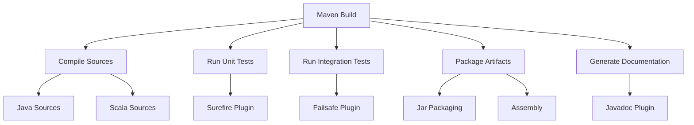
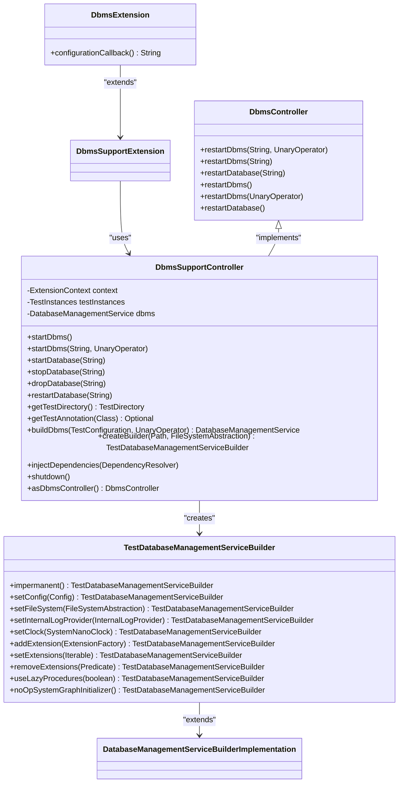

# Developer Guide

<cite>
**Referenced Files in This Document**   
- [pom.xml](file://pom.xml)
- [CONTRIBUTING.md](file://CONTRIBUTING.md)
- [community/neo4j-harness/src/main/java/org/neo4j/harness/Neo4jHarness.java](file://community/neo4j-harness/src/main/java/org/neo4j/harness/Neo4jHarness.java)
- [community/community-it/it-test-support/src/main/java/org/neo4j/test/extension/DbmsExtension.java](file://community/community-it/it-test-support/src/main/java/org/neo4j/test/extension/DbmsExtension.java)
- [community/community-it/it-test-support/src/main/java/org/neo4j/test/extension/DbmsController.java](file://community/community-it/it-test-support/src/main/java/org/neo4j/test/extension/DbmsController.java)
- [community/community-it/it-test-support/src/main/java/org/neo4j/test/TestDatabaseManagementServiceBuilder.java](file://community/community-it/it-test-support/src/main/java/org/neo4j/test/TestDatabaseManagementServiceBuilder.java)
- [community/community-it/it-test-support/src/main/java/org/neo4j/test/extension/DbmsSupportController.java](file://community/community-it/it-test-support/src/main/java/org/neo4j/test/extension/DbmsSupportController.java)
- [community/community-it/it-test-support/src/main/java/org/neo4j/test/extension/ImpermanentDbmsExtension.java](file://community/community-it/it-test-support/src/main/java/org/neo4j/test/extension/ImpermanentDbmsExtension.java)
- [community/community-it/it-test-support/src/main/java/org/neo4j/bolt/transport/Neo4jWithSocketSupportExtension.java](file://community/community-it/it-test-support/src/main/java/org/neo4j/bolt/transport/Neo4jWithSocketSupportExtension.java)
- [community/testing/test-utils/src/main/java/org/neo4j/test/extension/guard/JUnitUsageGuardExtension.java](file://community/testing/test-utils/src/main/java/org/neo4j/test/extension/guard/JUnitUsageGuardExtension.java)
</cite>

## Table of Contents
1. [Introduction](#introduction)
2. [Development Workflow](#development-workflow)
3. [Build System](#build-system)
4. [Testing Infrastructure](#testing-infrastructure)
5. [Code Contribution Guidelines](#code-contribution-guidelines)
6. [Practical Examples](#practical-examples)
7. [Troubleshooting Common Issues](#troubleshooting-common-issues)
8. [Conclusion](#conclusion)

## Introduction
This Developer Guide provides comprehensive guidance for developers working with Neo4j, focusing on the development workflow, build system, testing infrastructure, and contribution guidelines. The Neo4j codebase is organized as a multi-module Maven project with a clear separation of concerns between different components. The architecture follows best practices for building robust graph database applications, with a strong emphasis on testability and maintainability. Key components such as DbmsController, Neo4jHarness, and various test extensions provide the foundation for developing and testing Neo4j applications effectively.

**Section sources**
- [pom.xml](file://pom.xml#L1-L1907)
- [CONTRIBUTING.md](file://CONTRIBUTING.md#L1-L67)

## Development Workflow
The development workflow for Neo4j follows a structured approach that emphasizes test-driven development and continuous integration. Developers work within a Maven-based build system that coordinates the compilation, testing, and packaging of various modules. The workflow begins with setting up a development environment that includes JDK 17, Maven 3.8.2 or later, and an IDE configured with appropriate plugins for Java and Scala development. The project structure is organized into three main top-level directories: annotations, community, and packaging, each serving a specific purpose in the overall architecture.

The development process typically involves implementing new features or fixing bugs in the community modules, writing comprehensive unit and integration tests, and ensuring that all changes adhere to the coding standards and architectural principles of the project. The use of annotations such as @PublicApi and @Documented helps maintain API stability and documentation quality. Developers are encouraged to follow the contribution guidelines outlined in the CONTRIBUTING.md file, which includes creating personal forks, working in feature branches, and submitting pull requests for review.

**Section sources**
- [pom.xml](file://pom.xml#L189-L193)
- [CONTRIBUTING.md](file://CONTRIBUTING.md#L38-L51)

## Build System
The Neo4j build system is based on Apache Maven and is configured through the root pom.xml file and various module-specific pom.xml files throughout the codebase. The build system is designed to handle the complexity of a large, multi-module project with both Java and Scala components. Key aspects of the build configuration include:

- **Java Version**: The project targets Java 17 as specified in the vm.target.version property
- **Compiler Settings**: Configured with specific JVM arguments for optimal performance and debugging
- **Dependency Management**: Uses a centralized approach with version properties for consistent dependency versions
- **Plugin Configuration**: Includes various plugins for compilation, testing, packaging, and licensing

The build system supports different build profiles and configurations through properties that can be overridden as needed. For example, the test.runner.jvm.settings property defines JVM arguments used when running tests, including memory settings, garbage collection options, and various debugging flags. The build also includes comprehensive licensing and header checking through plugins like licensing-maven-plugin and license-maven-plugin to ensure compliance with open source requirements.



**Diagram sources **
- [pom.xml](file://pom.xml#L77-L187)
- [pom.xml](file://pom.xml#L237-L800)

**Section sources**
- [pom.xml](file://pom.xml#L77-L187)
- [pom.xml](file://pom.xml#L237-L800)

## Testing Infrastructure
The Neo4j testing infrastructure is built on JUnit 5 and provides a comprehensive framework for writing unit, integration, and system tests. The architecture is designed around extension mechanisms that simplify the setup and teardown of test environments, particularly for database-related tests. Key components of the testing infrastructure include:

### Test Extensions and Controllers
The testing framework provides several extension annotations and controller interfaces that simplify test setup:

- **DbmsExtension**: A JUnit 5 extension that automatically manages the lifecycle of a Neo4j DBMS instance for tests
- **DbmsController**: An interface that can be injected into tests to programmatically control the DBMS lifecycle
- **ImpermanentDbmsExtension**: A variant of DbmsExtension that creates temporary, in-memory databases
- **Neo4jWithSocketSupportExtension**: Provides support for testing with network sockets and Bolt protocol

These extensions leverage JUnit 5's extension model to provide before/after callbacks that start and stop the database instance, inject dependencies, and manage test state.

### Test Database Management
The TestDatabaseManagementServiceBuilder class extends the standard DatabaseManagementServiceBuilder with additional capabilities for testing:

- **Impermanent Mode**: Creates ephemeral file systems for tests that don't need persistent storage
- **Configuration Callbacks**: Allows tests to customize the database configuration before startup
- **Dependency Injection**: Supports injecting test-specific components and mocks
- **Lifecycle Control**: Provides fine-grained control over database startup and shutdown

The DbmsSupportController class serves as the backbone of the testing infrastructure, coordinating the creation of database instances, injection of dependencies, and management of test state. It uses JUnit 5's ExtensionContext to store and retrieve test-specific data, ensuring proper isolation between test methods.



**Diagram sources **
- [community/community-it/it-test-support/src/main/java/org/neo4j/test/extension/DbmsExtension.java](file://community/community-it/it-test-support/src/main/java/org/neo4j/test/extension/DbmsExtension.java#L59-L83)
- [community/community-it/it-test-support/src/main/java/org/neo4j/test/extension/DbmsController.java](file://community/community-it/it-test-support/src/main/java/org/neo4j/test/extension/DbmsController.java#L31-L64)
- [community/community-it/it-test-support/src/main/java/org/neo4j/test/TestDatabaseManagementServiceBuilder.java](file://community/community-it/it-test-support/src/main/java/org/neo4j/test/TestDatabaseManagementServiceBuilder.java#L62-L280)
- [community/community-it/it-test-support/src/main/java/org/neo4j/test/extension/DbmsSupportController.java](file://community/community-it/it-test-support/src/main/java/org/neo4j/test/extension/DbmsSupportController.java#L57-L336)

**Section sources**
- [community/community-it/it-test-support/src/main/java/org/neo4j/test/extension/DbmsExtension.java](file://community/community-it/it-test-support/src/main/java/org/neo4j/test/extension/DbmsExtension.java#L59-L83)
- [community/community-it/it-test-support/src/main/java/org/neo4j/test/extension/DbmsController.java](file://community/community-it/it-test-support/src/main/java/org/neo4j/test/extension/DbmsController.java#L31-L64)
- [community/community-it/it-test-support/src/main/java/org/neo4j/test/TestDatabaseManagementServiceBuilder.java](file://community/community-it/it-test-support/src/main/java/org/neo4j/test/TestDatabaseManagementServiceBuilder.java#L62-L280)
- [community/community-it/it-test-support/src/main/java/org/neo4j/test/extension/DbmsSupportController.java](file://community/community-it/it-test-support/src/main/java/org/neo4j/test/extension/DbmsSupportController.java#L57-L336)

## Code Contribution Guidelines
Contributing to the Neo4j codebase follows a well-defined process that ensures code quality and maintainability. The guidelines, outlined in CONTRIBUTING.md, emphasize several key practices:

1. **Fork and Branch**: All work should be done in a personal fork of the repository using feature branches with descriptive names
2. **Rebase, Don't Merge**: Contributors should rebase their branches onto the latest main branch rather than merging, to maintain a clean commit history
3. **Coding Standards**: Adherence to language-specific coding styles is required, with particular attention to Java and Scala conventions
4. **Testing**: Unit tests should be included for all non-documentation changes, ensuring comprehensive test coverage
5. **CLA**: Contributors must sign the Contributor License Agreement (CLA) before their pull requests can be accepted

The project uses Maven Enforcer Plugin rules to enforce various coding standards and project conventions, such as:
- Prohibiting star imports
- Ensuring Maven modules have group IDs starting with "org.neo4j"
- Preventing classes from being placed in the "com" package
- Banning test-jar dependencies in compile scope

These rules are automatically checked during the build process, providing immediate feedback to developers about potential issues.

**Section sources**
- [CONTRIBUTING.md](file://CONTRIBUTING.md#L40-L51)
- [pom.xml](file://pom.xml#L624-L723)

## Practical Examples
This section provides practical examples demonstrating common development tasks with Neo4j.

### Setting Up a Development Environment
To set up a development environment for Neo4j:
1. Install JDK 17 or later
2. Install Apache Maven 3.8.2 or later
3. Clone the Neo4j repository: `git clone https://github.com/neo4j/neo4j.git`
4. Import the project into your preferred IDE (IntelliJ IDEA is recommended)
5. Configure the IDE to use the project's coding standards and checkstyle rules

### Writing Unit and Integration Tests
The following example demonstrates how to write a test using the DbmsExtension:

```java
@DbmsExtension
class MyDatabaseTest {
    
    @Inject
    private GraphDatabaseService database;
    
    @Inject
    private DbmsController controller;
    
    @Test
    void shouldPerformDatabaseOperation() {
        // Test code that uses the injected database instance
        try (Transaction tx = database.beginTx()) {
            // Perform operations
            tx.commit();
        }
    }
    
    @Test
    void shouldRestartDatabase() {
        // Use the controller to restart the database
        controller.restartDatabase();
        // Continue with test assertions
    }
}
```

### Using Neo4jHarness for Integration Testing
For integration tests that require a running Neo4j instance, Neo4jHarness can be used:

```java
public class MyIntegrationTest {
    
    private Neo4jHarness harness;
    
    @BeforeEach
    void setUp() throws Exception {
        harness = Neo4jHarness.builder()
            .withConfig("dbms.connector.bolt.enabled", "true")
            .withConfig("dbms.connector.bolt.listen_address", "localhost:0")
            .build();
        harness.start();
    }
    
    @AfterEach
    void tearDown() {
        if (harness != null) {
            harness.stop();
        }
    }
    
    @Test
    void shouldConnectToRunningInstance() {
        // Test code that connects to the running Neo4j instance
        URI boltUri = harness.getBoltURI();
        // Use the URI to connect and perform operations
    }
}
```

**Section sources**
- [community/community-it/it-test-support/src/main/java/org/neo4j/test/extension/DbmsExtension.java](file://community/community-it/it-test-support/src/main/java/org/neo4j/test/extension/DbmsExtension.java#L59-L83)
- [community/community-it/it-test-support/src/main/java/org/neo4j/test/extension/DbmsController.java](file://community/community-it/it-test-support/src/main/java/org/neo4j/test/extension/DbmsController.java#L31-L64)
- [community/neo4j-harness/src/main/java/org/neo4j/harness/Neo4jHarness.java](file://community/neo4j-harness/src/main/java/org/neo4j/harness/Neo4jHarness.java)

## Troubleshooting Common Issues
When developing with Neo4j, several common issues may arise. This section provides guidance on identifying and resolving these issues.

### Build Issues
- **Missing Dependencies**: Ensure all required dependencies are declared in the pom.xml file and that the Maven repository is properly configured
- **Java Version Mismatch**: Verify that JDK 17 is being used, as specified in the vm.target.version property
- **Plugin Version Conflicts**: Check for version conflicts between different Maven plugins and dependencies

### Test Issues
- **Test Failures Due to Port Conflicts**: The testing infrastructure uses dynamic port allocation, but conflicts can still occur. Check the port.authority.directory system property to ensure proper port management
- **Database State Persistence**: Tests using impermanent databases should not rely on persistent state between test methods
- **Dependency Injection Failures**: Ensure that fields annotated with @Inject are of types that can be resolved by the DependencyResolver

### Debugging Tips
- Enable verbose logging by adding `-Dorg.neo4j.logging.level=DEBUG` to the JVM arguments
- Use the HeapDumpOnOutOfMemoryError flag to generate heap dumps for memory analysis
- Leverage the various diagnostic tools provided by the JVM, such as JFR (Java Flight Recorder)

**Section sources**
- [pom.xml](file://pom.xml#L89-L131)
- [community/community-it/it-test-support/src/main/java/org/neo4j/test/extension/DbmsSupportController.java](file://community/community-it/it-test-support/src/main/java/org/neo4j/test/extension/DbmsSupportController.java)

## Conclusion
This Developer Guide has provided a comprehensive overview of developing with Neo4j, covering the development workflow, build system, testing infrastructure, and contribution guidelines. The Neo4j codebase is structured as a sophisticated multi-module Maven project with a strong emphasis on testability and maintainability. Key components such as DbmsController, Neo4jHarness, and the various test extensions provide powerful tools for building and testing graph database applications. By following the guidelines and best practices outlined in this document, developers can effectively contribute to the Neo4j ecosystem and build robust applications on top of this powerful graph database platform.