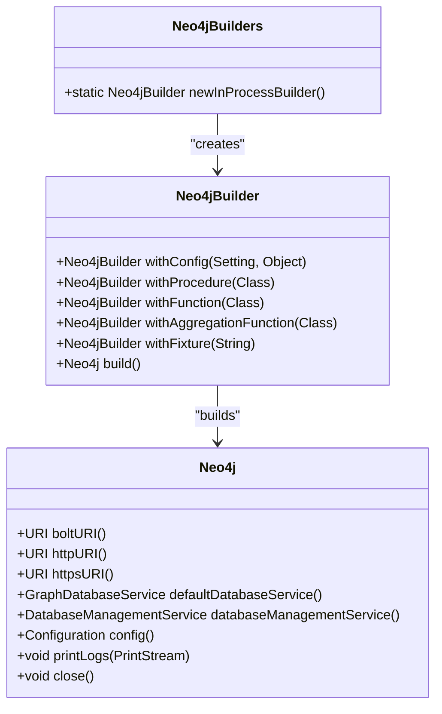
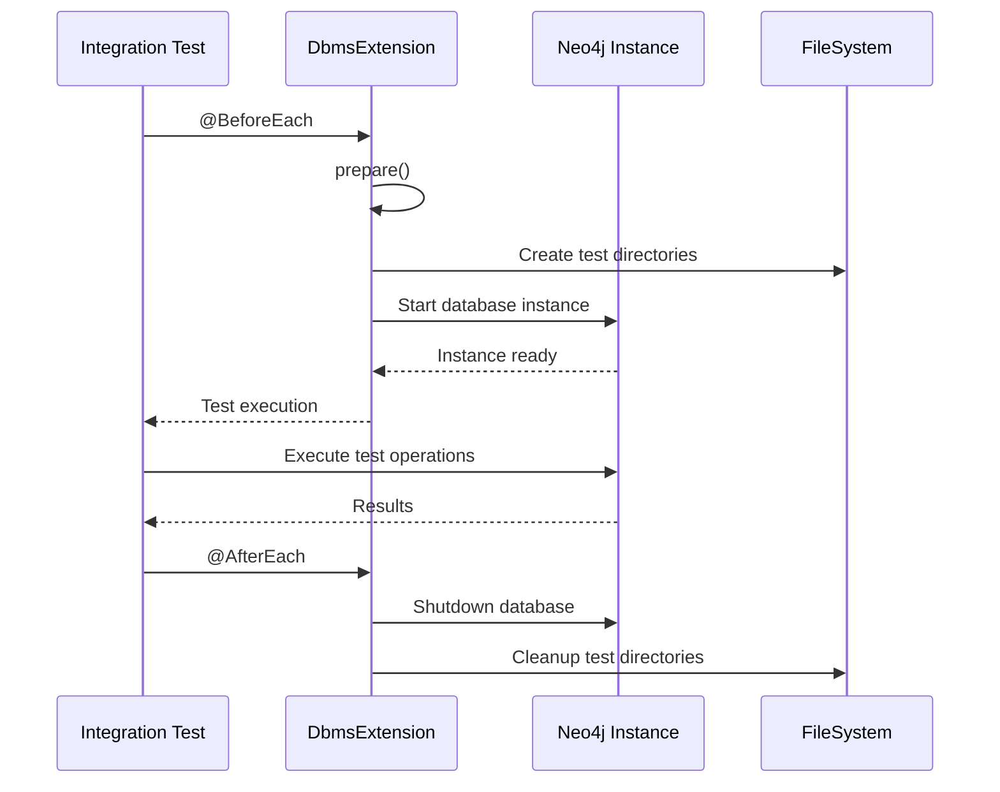

# Development Environment Setup

<cite>
**Referenced Files in This Document**   
- [pom.xml](file://pom.xml)
- [README.asciidoc](file://README.asciidoc)
- [CONTRIBUTING.md](file://CONTRIBUTING.md)
- [community/pom.xml](file://community/pom.xml)
- [community/neo4j-harness/pom.xml](file://community/neo4j-harness/pom.xml)
- [community/neo4j-harness/src/main/java/org/neo4j/harness/Neo4jBuilders.java](file://community/neo4j-harness/src/main/java/org/neo4j/harness/Neo4jBuilders.java)
- [community/neo4j-harness/src/main/java/org/neo4j/harness/Neo4jBuilder.java](file://community/neo4j-harness/src/main/java/org/neo4j/harness/Neo4jBuilder.java)
- [community/neo4j-harness/src/main/java/org/neo4j/harness/Neo4j.java](file://community/neo4j-harness/src/main/java/org/neo4j/harness/Neo4j.java)
- [community/community-it/it-test-support/src/main/java/org/neo4j/test/extension/DbmsExtension.java](file://community/community-it/it-test-support/src/main/java/org/neo4j/test/extension/DbmsExtension.java)
- [community/neo4j-harness/src/main/java/org/neo4j/harness/junit/rule/Neo4jRule.java](file://community/neo4j-harness/src/main/java/org/neo4j/harness/junit/rule/Neo4jRule.java)
</cite>

## Table of Contents
1. [Introduction](#introduction)
2. [Prerequisites](#prerequisites)
3. [Workspace Organization](#workspace-organization)
4. [IDE Setup](#ide-setup)
5. [Project Import and Dependency Resolution](#project-import-and-dependency-resolution)
6. [Build Profiles and Configuration](#build-profiles-and-configuration)
7. [Testing with Neo4jHarness](#testing-with-neo4jharness)
8. [DbmsExtensions for Integration Tests](#dbmsextensions-for-integration-tests)
9. [Debugging the Server Process](#debugging-the-server-process)
10. [Troubleshooting Common Issues](#troubleshooting-common-issues)
11. [Code Formatting and Developer Tooling](#code-formatting-and-developer-tooling)

## Introduction
This document provides comprehensive guidance for setting up a Neo4j development environment. It covers all essential aspects from prerequisites and workspace organization to IDE configuration, build setup, and testing strategies. The documentation focuses on the Neo4j community edition codebase, detailing how to properly configure the development environment for effective contribution and testing. The setup process includes Java version requirements, Maven configuration, IntelliJ IDEA setup, project import procedures, dependency resolution, and build profile configuration. Additionally, it provides practical examples for using Neo4jHarness for embedded database testing, configuring DbmsExtensions for integration tests, and debugging the server process. The document also addresses common setup issues and workspace organization best practices.

## Prerequisites
To set up a Neo4j development environment, several prerequisites must be installed and configured. The project requires Java 17 as specified in the root pom.xml file, which sets the vm.target.version property to 17. Apache Maven version 3.8.2 or higher is required for building the project, as indicated in the README.asciidoc file. Developers should ensure they have sufficient memory allocated to Maven by setting the MAVEN_OPTS environment variable with at least -Xmx2048m. On Linux-like systems, the open files limit should be set to at least 40,000, which can be verified using the ulimit -n command. For macOS users, Homebrew is recommended for package management, while Ubuntu users can install the required dependencies using apt-get. The build process also requires Bash and Make tools. The project's modular structure with multiple submodules organized in the community directory requires a robust development environment capable of handling large Java projects with complex dependencies.

**Section sources**
- [pom.xml](file://pom.xml#L79-L81)
- [README.asciidoc](file://README.asciidoc#L21-L37)

## Workspace Organization
The Neo4j codebase follows a structured directory organization with the root containing core configuration files including pom.xml, README.asciidoc, and CONTRIBUTING.md. The main source code is organized under the community directory, which contains numerous submodules such as annotations, bolt, capabilities, cloud, codegen, collections, command-line, common, concurrent, configuration, and others. Each submodule follows a standard Maven structure with src/main/java and src/test/java directories. The project uses a multi-module Maven architecture where the root pom.xml defines the parent configuration, and individual modules have their own pom.xml files that inherit from the parent. This structure allows for independent development and testing of different components while maintaining consistency across the codebase. The packaging directory contains scripts and configuration for creating distributable packages, while the community directory houses the core Neo4j functionality.

**Section sources**
- [pom.xml](file://pom.xml#L189-L193)
- [community/pom.xml](file://community/pom.xml#L20-L88)

## IDE Setup
For optimal development experience, IntelliJ IDEA is recommended as the primary IDE for working with the Neo4j codebase. After installing IntelliJ IDEA, developers should import the project as a Maven project, allowing the IDE to automatically detect and configure the multi-module structure. The IDE should be configured to use Java 17 as the project SDK, matching the vm.target.version specified in the root pom.xml. Developers should enable annotation processing in the IDE settings to support the Neo4j annotation processors used throughout the codebase. The Scala plugin should also be installed and configured, as several components of Neo4j are implemented in Scala. Code style settings should be aligned with the project's conventions, which can be derived from the license-maven-plugin configuration in the root pom.xml. The IDE should be configured to use the project's Maven wrapper and settings to ensure consistent behavior across different development environments.

**Section sources**
- [pom.xml](file://pom.xml#L151-L153)
- [pom.xml](file://pom.xml#L509-L552)

## Project Import and Dependency Resolution
To import the Neo4j project, developers should clone the repository and open the root directory in their IDE as a Maven project. The build process will automatically resolve dependencies specified in the various pom.xml files throughout the codebase. The root pom.xml defines the core dependencies and plugin versions used across all modules, ensuring consistency. When importing into IntelliJ IDEA, the IDE will detect the multi-module structure and configure each submodule as a separate module within the project. Developers should ensure that their IDE is configured to use the same Maven installation and settings as specified in the project documentation. The dependency resolution process may take considerable time due to the large number of dependencies and the size of the codebase. The licensing-maven-plugin and license-maven-plugin in the root pom.xml ensure that all dependencies comply with the project's licensing requirements and that proper headers are maintained in all source files.

**Section sources**
- [pom.xml](file://pom.xml#L462-L578)
- [pom.xml](file://pom.xml#L725-L775)

## Build Profiles and Configuration
The Neo4j build system uses Maven profiles to manage different build configurations. The community/pom.xml file defines an "include-cypher" profile that is activated by default and includes the cypher and cypher-shell modules in the build. This profile can be disabled by setting the skipCypher property. The root pom.xml contains extensive configuration for various build aspects including compiler settings, test execution, jar packaging, and licensing. The test.runner.jvm.settings property defines JVM arguments for test execution, including memory settings, garbage collection configuration, and various debugging options. The build is configured to use the Surefire and Failsafe plugins for unit and integration testing respectively, with specific configurations for test execution order and reporting. The enforcer-plugin ensures build consistency by enforcing Maven version requirements, package naming conventions, and dependency rules. The scala-maven-plugin is configured with specific Scala compilation settings including linting rules and target JVM version.

**Section sources**
- [community/pom.xml](file://community/pom.xml#L90-L103)
- [pom.xml](file://pom.xml#L92-L131)
- [pom.xml](file://pom.xml#L326-L404)
- [pom.xml](file://pom.xml#L580-L623)

## Testing with Neo4jHarness
Neo4jHarness provides a framework for creating embedded Neo4j instances for testing purposes. The core class is Neo4jBuilders, which provides factory methods for creating Neo4jBuilder instances. The newInProcessBuilder() method creates a builder for starting an in-process Neo4j instance that uses the system's temporary directory for storage. The Neo4jBuilder interface allows configuration of the test instance with various options including database configuration, procedures, functions, and data fixtures. Test instances can be configured with specific settings using the withConfig() method, and custom procedures can be registered using withProcedure(), withFunction(), and withAggregationFunction() methods. The build() method starts the Neo4j instance and returns a Neo4j object that provides access to the running database, including URIs for Bolt, HTTP, and HTTPS connectors. The Neo4j interface also provides methods for accessing the GraphDatabaseService, DatabaseManagementService, and configuration.

**Diagram sources**
- [community/neo4j-harness/src/main/java/org/neo4j/harness/Neo4jBuilders.java](file://community/neo4j-harness/src/main/java/org/neo4j/harness/Neo4jBuilders.java#L30-L38)
- [community/neo4j-harness/src/main/java/org/neo4j/harness/Neo4jBuilder.java](file://community/neo4j-harness/src/main/java/org/neo4j/harness/Neo4jBuilder.java#L29-L36)
- [community/neo4j-harness/src/main/java/org/neo4j/harness/Neo4j.java](file://community/neo4j-harness/src/main/java/org/neo4j/harness/Neo4j.java#L33-L40)

**Section sources**
- [community/neo4j-harness/src/main/java/org/neo4j/harness/Neo4jBuilders.java](file://community/neo4j-harness/src/main/java/org/neo4j/harness/Neo4jBuilders.java)
- [community/neo4j-harness/src/main/java/org/neo4j/harness/Neo4jBuilder.java](file://community/neo4j-harness/src/main/java/org/neo4j/harness/Neo4jBuilder.java)
- [community/neo4j-harness/src/main/java/org/neo4j/harness/Neo4j.java](file://community/neo4j-harness/src/main/java/org/neo4j/harness/Neo4j.java)

## DbmsExtensions for Integration Tests
The Neo4j test framework provides JUnit 5 extensions for managing test lifecycle and database state. The DbmsExtension class, located in the it-test-support module, provides a JUnit 5 extension for managing Neo4j database instances during integration tests. This extension handles the setup and teardown of database instances, ensuring proper resource cleanup after tests. The extension supports both per-class and per-method lifecycle management, allowing tests to share a single database instance or use isolated instances. The Neo4jWithSocketExtension provides additional functionality for testing with network sockets, enabling tests to verify connectivity and protocol behavior. These extensions integrate with JUnit 5's extension model, using annotations like @ExtendWith and @RegisterExtension to declaratively configure test behavior. The extensions handle complex setup tasks such as port allocation, configuration management, and file system isolation, allowing test authors to focus on test logic rather than infrastructure concerns.

**Diagram sources**
- [community/community-it/it-test-support/src/main/java/org/neo4j/test/extension/DbmsExtension.java](file://community/community-it/it-test-support/src/main/java/org/neo4j/test/extension/DbmsExtension.java)
- [community/testing/layout-test-utils/src/main/java/org/neo4j/test/extension/Neo4jLayoutSupportExtension.java](file://community/testing/layout-test-utils/src/main/java/org/neo4j/test/extension/Neo4jLayoutSupportExtension.java#L58-L89)

**Section sources**
- [community/community-it/it-test-support/src/main/java/org/neo4j/test/extension/DbmsExtension.java](file://community/community-it/it-test-support/src/main/java/org/neo4j/test/extension/DbmsExtension.java)
- [community/testing/layout-test-utils/src/main/java/org/neo4j/test/extension/Neo4jLayoutSupportExtension.java](file://community/testing/layout-test-utils/src/main/java/org/neo4j/test/extension/Neo4jLayoutSupportExtension.java)

## Debugging the Server Process
Debugging the Neo4j server process requires proper configuration of JVM arguments and IDE settings. The test.runner.jvm.settings in the root pom.xml defines various JVM options for debugging, including -XX:+HeapDumpOnOutOfMemoryError, -XX:+ExitOnOutOfMemoryError, and -Dorg.neo4j.io.pagecache.impl.muninn.MuninnWritePageCursor.CHECK_WRITE_LOCKS=true. These settings enable heap dumps on memory errors and various internal consistency checks. When running tests, the forkCount and reuseForks configurations in the surefire and failsafe plugins control how test processes are executed, which can impact debugging capabilities. For interactive debugging, developers can configure their IDE to attach to the Neo4j process or use remote debugging options. The Neo4jRule class provides a JUnit rule implementation that can be used in test classes to manage the Neo4j instance lifecycle, making it easier to debug test failures. The printLogs() method in the Neo4j interface allows test failures to output diagnostic information to a PrintStream, which can be captured for analysis.

**Section sources**
- [pom.xml](file://pom.xml#L92-L131)
- [community/neo4j-harness/src/main/java/org/neo4j/harness/junit/rule/Neo4jRule.java](file://community/neo4j-harness/src/main/java/org/neo4j/harness/junit/rule/Neo4jRule.java)

## Troubleshooting Common Issues
Common setup issues for the Neo4j development environment include memory configuration problems, port conflicts, and module resolution errors. Memory issues can be addressed by increasing the MAVEN_OPTS to -Xmx2048m or higher, as suggested in the README.asciidoc. Port conflicts may occur when multiple test instances try to bind to the same ports; this is typically handled automatically by the test framework using random ports, but can be configured explicitly if needed. Module resolution problems often stem from incorrect Java versions or Maven configurations; ensuring Java 17 and Maven 3.8.2 are used resolves most of these issues. File descriptor limits on Linux systems should be increased to at least 40,000 using ulimit -n to prevent "too many open files" errors during testing. Dependency resolution issues can be addressed by cleaning the Maven repository and rebuilding the project. IDE-specific issues can often be resolved by re-importing the project or invalidating caches. The extensive logging configuration in the build allows for detailed diagnostics when issues occur.

**Section sources**
- [README.asciidoc](file://README.asciidoc#L40-L46)
- [pom.xml](file://pom.xml#L92-L131)
- [pom.xml](file://pom.xml#L342-L355)

## Code Formatting and Developer Tooling
The Neo4j project enforces strict code formatting and quality standards through various Maven plugins and configuration. The license-maven-plugin ensures all source files have the correct license headers and checks for compliance during the build process. The enforcer-plugin enforces various project rules including package naming conventions, dependency restrictions, and Maven version requirements. Star imports are banned through the RestrictImports rule, requiring fully qualified imports. The project uses both JUnit 4 and JUnit 5 testing frameworks, with appropriate configuration in the surefire and failsafe plugins. The Scala code follows specific compilation settings defined in the scala-maven-plugin configuration. Developer tooling integration includes support for generating Javadoc documentation, creating test jars, and producing licensing reports. The build-resources dependency ensures consistent resource handling across modules. These tooling configurations work together to maintain code quality and consistency across the large codebase.

**Section sources**
- [pom.xml](file://pom.xml#L509-L552)
- [pom.xml](file://pom.xml#L625-L675)
- [pom.xml](file://pom.xml#L239-L323)