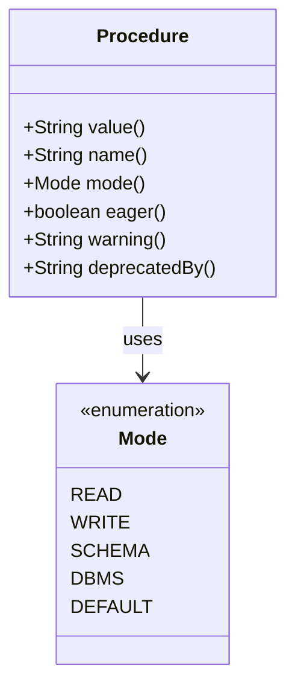
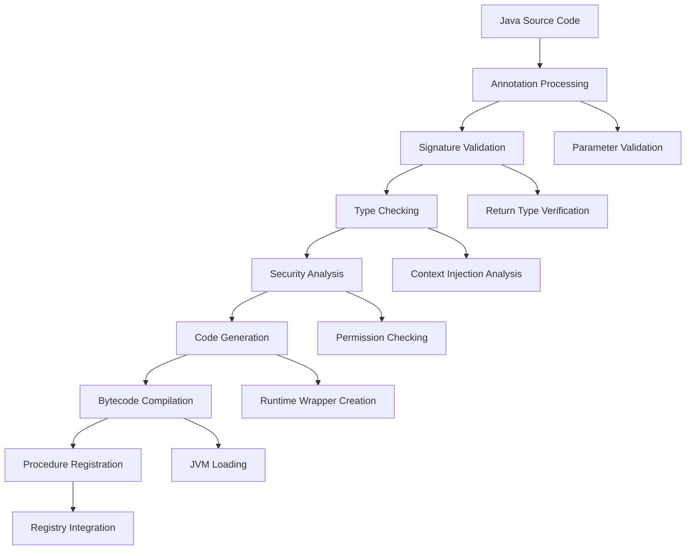
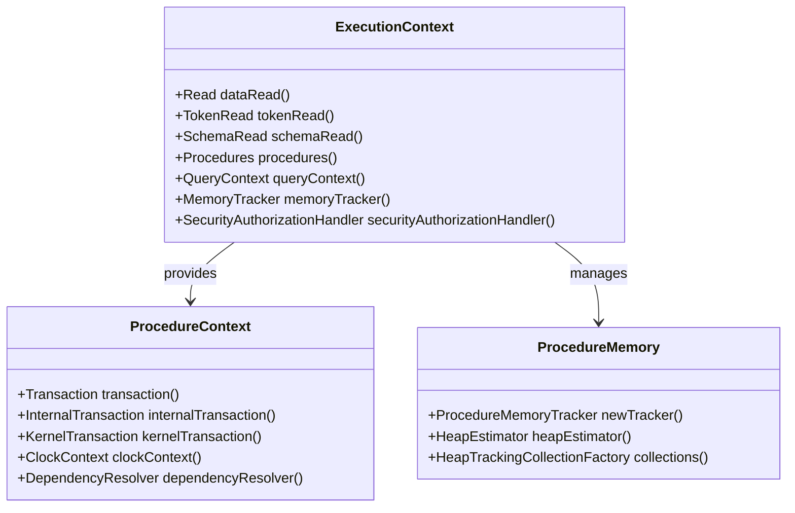
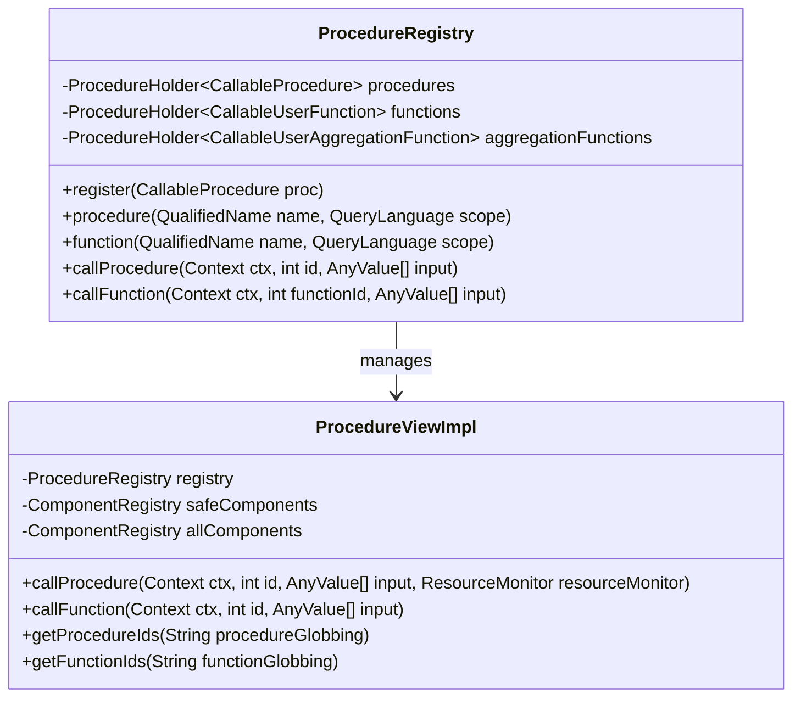
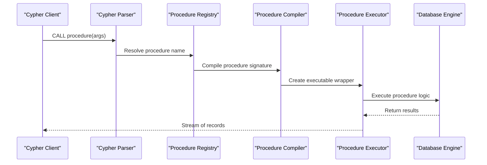
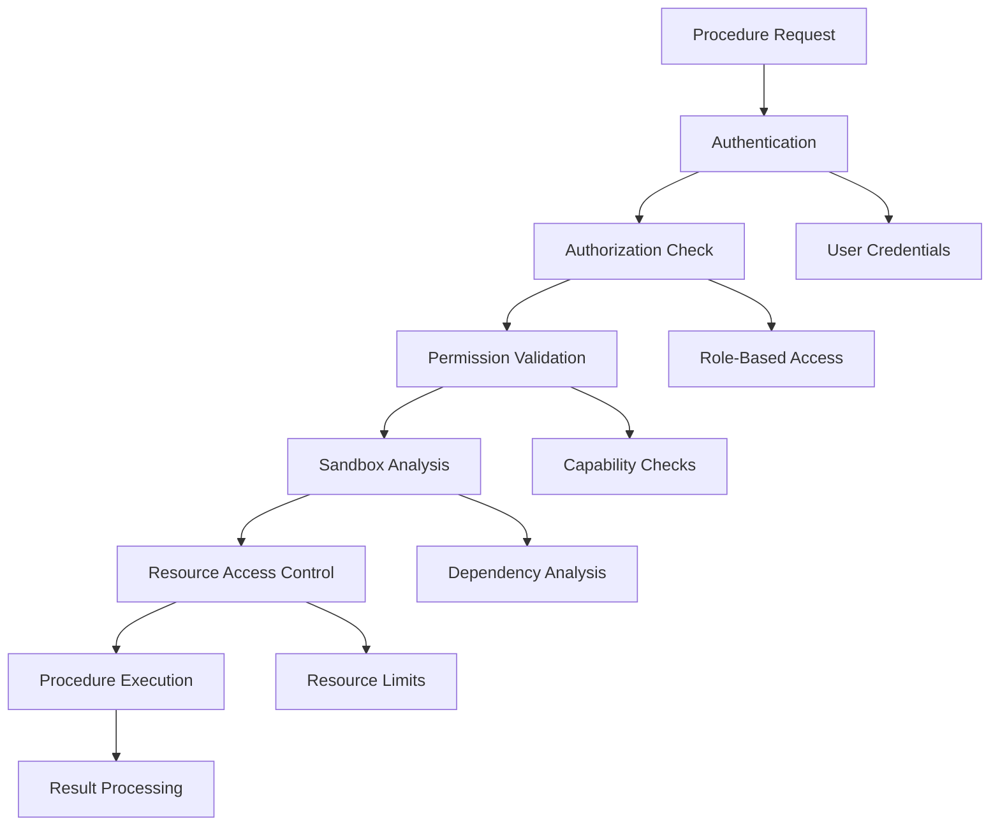
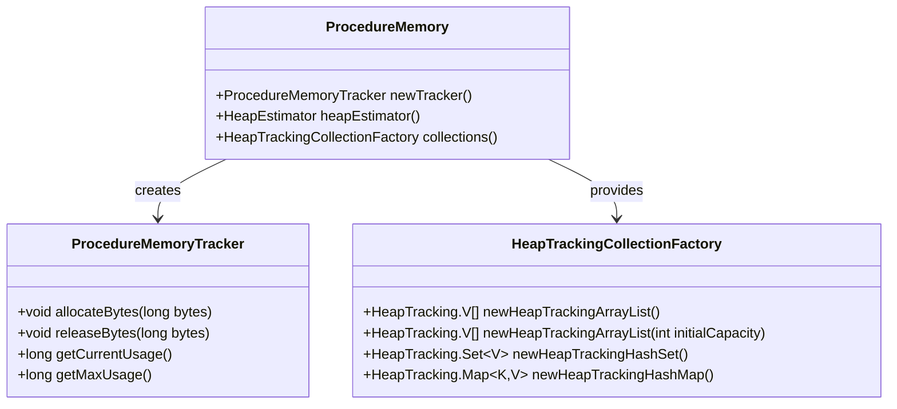

# Custom Procedures

<cite>
**Referenced Files in This Document**
- [Procedure.java](file://community/procedure-api/src/main/java/org/neo4j/procedure/Procedure.java)
- [UserFunction.java](file://community/procedure-api/src/main/java/org/neo4j/procedure/UserFunction.java)
- [ProcedureCompiler.java](file://community/procedure-compiler/src/main/java/org/neo4j/tooling/procedure/visitors/ParameterVisitor.java)
- [BuiltInDbmsProcedures.java](file://community/procedure/src/main/java/org/neo4j/procedure/builtin/BuiltInDbmsProcedures.java)
- [ProcedureRegistry.java](file://community/procedure/src/main/java/org/neo4j/procedure/impl/ProcedureRegistry.java)
- [ProcedureViewImpl.java](file://community/procedure/src/main/java/org/neo4j/procedure/impl/ProcedureViewImpl.java)
- [ProcedureConfig.java](file://community/procedure/src/main/java/org/neo4j/procedure/impl/ProcedureConfig.java)
- [ProcedureClassLoader.java](file://community/procedure/src/main/java/org/neo4j/procedure/impl/ProcedureClassLoader.java)
- [ProcedureCaller.java](file://community/kernel/src/main/java/org/neo4j/kernel/impl/newapi/ProcedureCaller.java)
- [ExecutionContext.java](file://community/kernel-api/src/main/java/org/neo4j/kernel/api/ExecutionContext.java)
- [ProcedureMemoryProvider.java](file://community/procedure/src/main/java/org/neo4j/procedure/impl/memory/ProcedureMemoryProvider.java)
- [SecurityAuthorizationHandler.java](file://community/kernel-api/src/main/java/org/neo4j/internal/kernel/api/security/SecurityAuthorizationHandler.java)
- [WebURLAccessRule.java](file://community/kernel/src/main/java/org/neo4j/kernel/impl/security/WebURLAccessRule.java)
</cite>

## Table of Contents
1. [Introduction](#introduction)
2. [Core Concepts](#core-concepts)
3. [Annotation System](#annotation-system)
4. [Compilation Process](#compilation-process)
5. [Execution Context](#execution-context)
6. [Procedure Registry](#procedure-registry)
7. [Configuration and Deployment](#configuration-and-deployment)
8. [Security and Restrictions](#security-and-restrictions)
9. [Memory Management](#memory-management)
10. [Common Issues and Solutions](#common-issues-and-solutions)
11. [Best Practices](#best-practices)
12. [Troubleshooting Guide](#troubleshooting-guide)

## Introduction

Neo4j's custom procedure system provides a powerful mechanism for extending the database's functionality through user-defined Java methods. This system allows developers to create procedures and user-defined functions that can be invoked directly from Cypher queries, enabling complex business logic, external integrations, and specialized data processing operations.

The custom procedure system consists of several key components:
- **Annotations** (@Procedure, @UserFunction) for marking methods as callable from Cypher
- **Compilation framework** that validates and transforms procedures at build time
- **Runtime execution engine** that manages procedure invocation and context
- **Security framework** that controls access and resource permissions
- **Memory management** system for efficient resource utilization

## Core Concepts

### Procedure vs User Function

Neo4j distinguishes between two types of custom callable entities:

**Procedures** are methods that return a stream of records and can perform various operations including graph modifications, external resource access, and complex computations. They are invoked using the `CALL` statement in Cypher.

**User Functions** are read-only methods that return a single value. They can be used within expressions and are invoked directly in Cypher queries.

### Execution Modes

Procedures operate under different execution modes that control their capabilities:

- **READ**: Allows only reading operations on the graph
- **WRITE**: Allows reading and writing operations
- **SCHEMA**: Allows reading and schema modification operations
- **DBMS**: Allows database management operations (password changes, etc.)

### Context Injection

Procedures gain access to Neo4j resources through automatic context injection. Fields annotated with `@Context` receive appropriate Neo4j components like the graph database service, logging facilities, and transaction contexts.

## Annotation System

### @Procedure Annotation

The `@Procedure` annotation marks methods as callable procedures from Cypher queries.

**Diagram sources**
- [Procedure.java](file://community/procedure-api/src/main/java/org/neo4j/procedure/Procedure.java#L107-L167)

**Key Features:**
- **Namespace and Name**: Defines the procedure's fully qualified name
- **Mode Control**: Specifies the procedure's operational capabilities
- **Eager Execution**: Controls Cypher query planning behavior
- **Warning Messages**: Provides user notifications about procedure usage
- **Deprecation Support**: Enables smooth migration paths

**Section sources**
- [Procedure.java](file://community/procedure-api/src/main/java/org/neo4j/procedure/Procedure.java#L107-L167)

### @UserFunction Annotation

The `@UserFunction` annotation marks methods as callable functions from Cypher expressions.

**Key Features:**
- **Single Value Return**: Functions must return exactly one value
- **Read-Only Operations**: Cannot modify the graph or schema
- **Expression Integration**: Can be used within Cypher expressions
- **Type Safety**: Automatic type conversion and validation

**Section sources**
- [UserFunction.java](file://community/procedure-api/src/main/java/org/neo4j/procedure/UserFunction.java#L99-L127)

### @Context Annotation

The `@Context` annotation enables automatic injection of Neo4j resources into procedure classes.

**Supported Context Types:**
- `GraphDatabaseService`: Access to the graph database
- `Log`: Logging facility for procedure operations
- `Transaction`: Current transaction context
- `SecurityContext`: Security and authorization information
- `DependencyResolver`: Access to Neo4j internal services

## Compilation Process

### ProcedureCompiler Architecture

The compilation process transforms annotated Java methods into executable procedures through a sophisticated multi-stage pipeline.

**Diagram sources**
- [ProcedureCompiler.java](file://community/procedure-compiler/src/main/java/org/neo4j/tooling/procedure/visitors/ParameterVisitor.java#L31-L60)

### Compilation Stages

**1. Annotation Processing**
- Validates @Procedure and @UserFunction annotations
- Extracts procedure signatures and metadata
- Performs basic syntax and semantic checks

**2. Signature Validation**
- Verifies parameter types and names
- Ensures return type compatibility
- Validates method signatures against Neo4j requirements

**3. Type Checking**
- Performs comprehensive type validation
- Ensures compatibility with Neo4j value types
- Validates parameter default values

**4. Security Analysis**
- Analyzes resource access patterns
- Identifies potential security vulnerabilities
- Enforces sandboxing requirements

**5. Code Generation**
- Creates runtime wrapper classes
- Implements context injection mechanisms
- Generates type-safe parameter handling

**Section sources**
- [ProcedureCompiler.java](file://community/procedure-compiler/src/main/java/org/neo4j/tooling/procedure/visitors/ParameterVisitor.java#L31-L60)

### BuiltInDbmsProcedures Implementation

The BuiltInDbmsProcedures class demonstrates practical implementation patterns for custom procedures.

**Key Implementation Patterns:**
- **Context Injection**: Uses @Context annotations for resource access
- **Parameter Validation**: Implements comprehensive input validation
- **Security Integration**: Leverages Neo4j's security framework
- **Error Handling**: Provides meaningful error messages

**Section sources**
- [BuiltInDbmsProcedures.java](file://community/procedure/src/main/java/org/neo4j/procedure/builtin/BuiltInDbmsProcedures.java#L85-L284)

## Execution Context

### Context Injection Mechanism

The execution context provides procedures with access to Neo4j resources through automatic dependency injection.

**Diagram sources**
- [ExecutionContext.java](file://community/kernel-api/src/main/java/org/neo4j/kernel/api/ExecutionContext.java#L58-L104)
- [ProcedureMemoryProvider.java](file://community/procedure/src/main/java/org/neo4j/procedure/impl/memory/ProcedureMemoryProvider.java#L30-L66)

### Transaction Context Handling

Procedures operate within specific transaction boundaries, with careful management of transaction state and resource cleanup.

**Transaction Lifecycle:**
1. **Context Creation**: Establishes procedure execution context
2. **Transaction Binding**: Associates procedure with active transaction
3. **Resource Allocation**: Provides access to graph resources
4. **Execution**: Runs procedure logic within transaction scope
5. **Cleanup**: Releases resources and maintains transaction integrity

**Section sources**
- [ExecutionContext.java](file://community/kernel-api/src/main/java/org/neo4j/kernel/api/ExecutionContext.java#L58-L104)

## Procedure Registry

### Registry Architecture

The procedure registry manages the lifecycle of all registered procedures and functions.

**Diagram sources**
- [ProcedureRegistry.java](file://community/procedure/src/main/java/org/neo4j/procedure/impl/ProcedureRegistry.java#L59-L239)
- [ProcedureViewImpl.java](file://community/procedure/src/main/java/org/neo4j/procedure/impl/ProcedureViewImpl.java#L58-L90)

### Invocation Relationship

The procedure invocation follows a well-defined flow from client requests to database operations.

**Diagram sources**
- [ProcedureCaller.java](file://community/kernel/src/main/java/org/neo4j/kernel/impl/newapi/ProcedureCaller.java#L52-L182)

**Section sources**
- [ProcedureRegistry.java](file://community/procedure/src/main/java/org/neo4j/procedure/impl/ProcedureRegistry.java#L59-L239)
- [ProcedureViewImpl.java](file://community/procedure/src/main/java/org/neo4j/procedure/impl/ProcedureViewImpl.java#L145-L184)

## Configuration and Deployment

### Configuration Options

Neo4j provides extensive configuration options for controlling procedure deployment and access.

| Configuration Setting | Description | Default Value |
|----------------------|-------------|---------------|
| `dbms.security.procedures.unrestricted` | List of unrestricted procedures | Empty list |
| `dbms.security.procedures.allowlist` | List of allowed procedures | `["*"]` |
| `dbms.security.procedures.blocked` | List of blocked procedures | Empty list |

### Deployment Strategies

**1. Jar Deployment**
- Package procedures in JAR files
- Deploy to Neo4j plugins directory
- Automatic discovery and registration

**2. Whitelist Management**
- Configure allowed procedures using glob patterns
- Support for wildcards (`*`) and double wildcards (`**`)
- Dynamic configuration updates

**3. Security Boundaries**
- Sandbox procedures with restricted access
- Full-access procedures for trusted code
- Namespace-based isolation

**Section sources**
- [ProcedureConfig.java](file://community/procedure/src/main/java/org/neo4j/procedure/impl/ProcedureConfig.java#L35-L99)

### Parameter Handling

Procedures support comprehensive parameter handling with type safety and validation.

**Parameter Types:**
- Primitive types: `String`, `long`, `double`, `boolean`, `Number`
- Graph types: `Node`, `Relationship`, `Path`
- Collection types: `Map<String, ?>`, `List<?>`
- Generic type: `Object`

**Return Value Specifications:**
- Procedures: Must return `Stream<Record>`
- Functions: Must return a single value
- Aggregation functions: Return reduction state

## Security and Restrictions

### Security Framework

Neo4j implements a multi-layered security model for procedure execution.

**Diagram sources**
- [SecurityAuthorizationHandler.java](file://community/kernel-api/src/main/java/org/neo4j/internal/kernel/api/security/SecurityAuthorizationHandler.java#L235-L260)

### Security Restrictions

**1. Class Loading Restrictions**
- Procedures must be loaded from approved JAR files
- Classpath isolation prevents unauthorized access
- Dynamic class loading is restricted

**2. Resource Access Control**
- Network access is controlled by URL access rules
- File system access is sandboxed
- External resource loading requires explicit permissions

**3. Dependency Management**
- Procedures cannot access internal Neo4j classes
- Only approved APIs are available
- Circular dependencies are prevented

**Section sources**
- [SecurityAuthorizationHandler.java](file://community/kernel-api/src/main/java/org/neo4j/internal/kernel/api/security/SecurityAuthorizationHandler.java#L235-L260)
- [WebURLAccessRule.java](file://community/kernel/src/main/java/org/neo4j/kernel/impl/security/WebURLAccessRule.java#L92-L228)

### URL Access Control

Procedures implementing network access must comply with Neo4j's URL access control system.

**Supported Protocols:**
- HTTP/HTTPS: Subject to IP pinning and redirect restrictions
- FTP: Limited access with security checks
- File: Sandboxed access with path restrictions

**Access Control Features:**
- Host-based filtering
- IP address pinning
- Redirect following limits
- Certificate validation

## Memory Management

### Memory Tracking System

Neo4j implements sophisticated memory management for procedure execution.

**Diagram sources**
- [ProcedureMemoryProvider.java](file://community/procedure/src/main/java/org/neo4j/procedure/impl/memory/ProcedureMemoryProvider.java#L30-L66)

### Memory Management Best Practices

**1. Resource Allocation**
- Use procedure-specific memory trackers
- Monitor memory usage during execution
- Release resources promptly

**2. Collection Management**
- Use heap-tracking collections for predictable memory usage
- Implement proper cleanup mechanisms
- Avoid memory leaks in long-running procedures

**3. Transaction Integration**
- Share memory limits with transactions
- Respect memory constraints during execution
- Handle memory exhaustion gracefully

**Section sources**
- [ProcedureMemoryProvider.java](file://community/procedure/src/main/java/org/neo4j/procedure/impl/memory/ProcedureMemoryProvider.java#L30-L66)

## Common Issues and Solutions

### Class Loading Problems

**Issue**: Procedures fail to load with linkage errors
**Causes**: 
- Missing dependencies in classpath
- Version conflicts between libraries
- Security restrictions preventing class loading

**Solutions**:
- Verify all dependencies are included in JAR
- Use dependency isolation techniques
- Check security configurations

### Security Restrictions

**Issue**: Procedures denied execution due to security violations
**Causes**:
- Unapproved resource access attempts
- Violation of sandboxing rules
- Missing required permissions

**Solutions**:
- Review security configuration settings
- Use appropriate procedure modes
- Implement proper permission handling

### Performance Considerations

**Issue**: Procedures causing performance degradation
**Causes**:
- Excessive memory allocation
- Blocking operations in procedure code
- Poor resource management

**Solutions**:
- Implement proper memory tracking
- Use asynchronous operations where appropriate
- Optimize resource usage patterns

## Best Practices

### Development Guidelines

**1. Design Principles**
- Keep procedures focused and single-purpose
- Implement comprehensive error handling
- Use appropriate execution modes
- Document procedure behavior and requirements

**2. Security Considerations**
- Validate all input parameters
- Implement proper access controls
- Use context injection for resource access
- Follow principle of least privilege

**3. Performance Optimization**
- Minimize memory allocations
- Use efficient data structures
- Implement proper resource cleanup
- Consider concurrent execution patterns

### Testing Strategies

**1. Unit Testing**
- Test individual procedure logic
- Verify parameter handling
- Validate error conditions
- Test security restrictions

**2. Integration Testing**
- Test procedure registration
- Verify Cypher integration
- Test resource access patterns
- Validate performance characteristics

## Troubleshooting Guide

### Common Error Scenarios

**1. Procedure Registration Failures**
- **Symptom**: Procedure not appearing in available procedures
- **Diagnosis**: Check procedure compilation logs
- **Resolution**: Verify annotation syntax and dependencies

**2. Execution Timeouts**
- **Symptom**: Procedures timing out during execution
- **Diagnosis**: Monitor procedure execution duration
- **Resolution**: Optimize procedure logic or increase timeouts

**3. Memory Exhaustion**
- **Symptom**: OutOfMemoryError during procedure execution
- **Diagnosis**: Monitor memory usage patterns
- **Resolution**: Implement proper memory management

### Debugging Techniques

**1. Logging Integration**
- Use provided logging facilities
- Implement structured logging
- Monitor procedure execution traces

**2. Performance Profiling**
- Track execution metrics
- Monitor resource usage
- Analyze bottleneck patterns

**3. Security Auditing**
- Review access logs
- Monitor permission violations
- Audit resource usage patterns

**Section sources**
- [ProcedureClassLoader.java](file://community/procedure/src/main/java/org/neo4j/procedure/impl/ProcedureClassLoader.java#L176-L212)